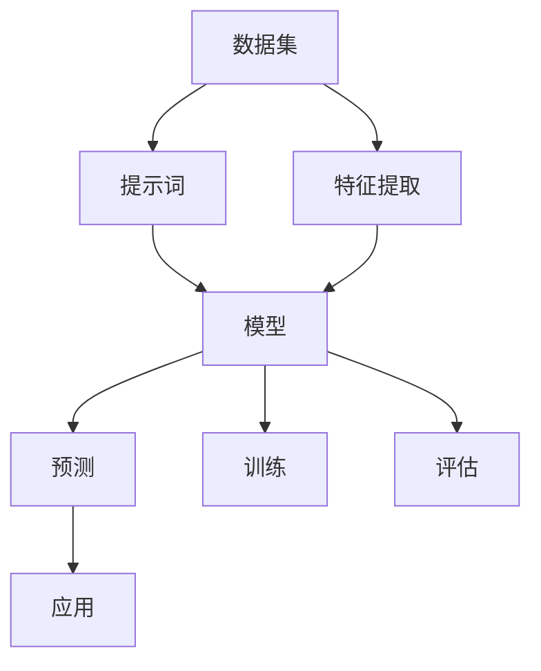

                 

# 提示词工程：AI时代的新机遇与新挑战

> **关键词：** 提示词工程，AI，自然语言处理，机器学习，深度学习，数据分析，未来趋势

> **摘要：** 本文深入探讨了提示词工程在人工智能领域的地位和作用。通过介绍提示词工程的定义、核心概念、算法原理、数学模型，以及实际应用场景，本文旨在帮助读者理解提示词工程的价值和挑战，并展望其在未来AI发展中的潜力。

## 1. 背景介绍

### 1.1 目的和范围

本文旨在探讨提示词工程这一新兴领域在人工智能（AI）时代的重要性。我们将详细解析提示词工程的定义、核心概念和架构，并介绍其在自然语言处理（NLP）和机器学习中的具体应用。通过本文的学习，读者将能够：

- 理解提示词工程的基本概念和原理。
- 掌握提示词工程的关键算法和数学模型。
- 了解提示词工程在实际项目中的应用案例。
- 预见提示词工程在AI领域未来的发展趋势。

### 1.2 预期读者

本文面向对人工智能和自然语言处理有一定了解的技术爱好者、研究生和从业者。特别适合希望深入理解AI技术，尤其是NLP领域的技术人员。

### 1.3 文档结构概述

本文结构如下：

- **第1章：背景介绍**：介绍本文的目的、预期读者以及文档结构。
- **第2章：核心概念与联系**：介绍提示词工程的核心概念和联系。
- **第3章：核心算法原理 & 具体操作步骤**：讲解提示词工程的核心算法原理和具体操作步骤。
- **第4章：数学模型和公式 & 详细讲解 & 举例说明**：介绍提示词工程的数学模型和公式。
- **第5章：项目实战：代码实际案例和详细解释说明**：提供实际代码案例和解读。
- **第6章：实际应用场景**：讨论提示词工程的实际应用场景。
- **第7章：工具和资源推荐**：推荐学习资源和开发工具。
- **第8章：总结：未来发展趋势与挑战**：展望提示词工程的未来。
- **第9章：附录：常见问题与解答**：解答常见问题。
- **第10章：扩展阅读 & 参考资料**：提供进一步学习资料。

### 1.4 术语表

#### 1.4.1 核心术语定义

- **提示词工程**：提示词工程是指设计、开发和优化用于指导机器学习模型进行训练和预测的提示词（prompt）的过程。
- **自然语言处理（NLP）**：自然语言处理是使计算机能够理解、解释和生成人类语言的技术。
- **机器学习**：机器学习是使计算机从数据中学习并做出预测或决策的技术。
- **深度学习**：深度学习是机器学习的一种方法，通过多层神经网络对数据进行建模。

#### 1.4.2 相关概念解释

- **提示词（Prompt）**：提示词是一种引导机器学习模型的方式，通过提供额外信息来提高模型的学习效果。
- **数据集（Dataset）**：数据集是一组用于训练、评估或测试机器学习模型的样本数据。
- **模型（Model）**：模型是机器学习过程中用于预测或分类的数学函数。

#### 1.4.3 缩略词列表

- **NLP**：自然语言处理
- **ML**：机器学习
- **DL**：深度学习
- **API**：应用程序编程接口
- **IDE**：集成开发环境

## 2. 核心概念与联系

在深入探讨提示词工程之前，我们首先需要了解其核心概念和与其他AI技术的关系。以下是一个简化的Mermaid流程图，用于说明这些核心概念之间的联系：



### 2.1 数据集

数据集是提示词工程的基石。一个高质量的数据集不仅包含多样化的样本，还需具备以下特性：

- **代表性**：数据集应能全面反映现实世界的多样性。
- **准确性**：数据集中的样本应真实、可靠，无错误或误导信息。
- **完整性**：数据集应包含足够的样本量，以便模型能够充分学习。

### 2.2 提示词

提示词是在训练过程中提供额外信息的引导。它们可以包含关键字、问题、上下文等，帮助模型更好地理解和处理数据。以下是一些关键点：

- **定制性**：根据数据集和任务需求，设计合适的提示词。
- **高效性**：高质量的提示词能够提高模型的训练效率和准确性。
- **动态性**：提示词应能够根据训练过程动态调整。

### 2.3 模型

模型是机器学习中的核心组件，用于对数据进行分析和预测。在提示词工程的背景下，模型的作用尤为重要：

- **可扩展性**：模型应能够处理大规模数据和多样化任务。
- **泛化能力**：模型应具备良好的泛化能力，能在未知数据上表现出色。
- **可解释性**：为了更好地理解和信任模型，其内部机制和决策过程应具备一定的可解释性。

### 2.4 特征提取

特征提取是数据预处理的关键步骤，它将原始数据转换为模型能够理解和处理的特征向量。以下是特征提取的关键点：

- **选择性**：选择对模型预测最有影响力的特征。
- **稳定性**：确保特征提取过程的稳定性和一致性。
- **复杂性**：特征提取过程应尽可能简单，以降低计算复杂度。

### 2.5 训练与评估

训练和评估是机器学习模型的两个关键阶段。以下是它们在提示词工程中的重要性：

- **训练**：通过数据集和提示词，模型学习到对数据的处理方式。
- **评估**：使用验证集或测试集，评估模型在未知数据上的性能。

### 2.6 应用

最终，模型的预测结果将被应用于实际场景中，如文本分类、情感分析等。以下是应用过程中需要考虑的关键点：

- **实用性**：预测结果应具有实际应用价值。
- **可解释性**：预测结果和决策过程应具备一定的可解释性。
- **实时性**：对于某些应用，如实时对话系统，模型应具备实时预测能力。

## 3. 核心算法原理 & 具体操作步骤

### 3.1 算法概述

提示词工程的核心在于设计有效的提示词来提高模型的性能。以下是几个关键算法的概述：

1. **基于关键字的提示词生成**：通过分析数据集和任务需求，提取关键信息生成提示词。
2. **基于上下文的提示词生成**：利用上下文信息，为模型提供更丰富的背景信息。
3. **基于模型的提示词优化**：根据训练过程中模型的反馈，动态调整提示词，提高模型性能。

### 3.2 基于关键字的提示词生成

**算法原理**：

- **信息提取**：从数据集中提取关键信息，如关键词、主题等。
- **提示词构建**：将提取的信息组合成提示词，引导模型学习。

**具体操作步骤**：

1. **数据预处理**：对数据集进行清洗和预处理，确保数据质量。
2. **关键词提取**：使用NLP技术，从数据中提取关键词。
3. **提示词生成**：将提取的关键词组合成提示词，并加入必要的上下文信息。

**伪代码**：

```python
def generate_prompt_keyword(data):
    # 数据预处理
    processed_data = preprocess_data(data)
    
    # 提取关键词
    keywords = extract_keywords(processed_data)
    
    # 提示词构建
    prompt = build_prompt(keywords)
    
    return prompt
```

### 3.3 基于上下文的提示词生成

**算法原理**：

- **上下文分析**：分析文本的上下文信息，提取关键信息。
- **提示词生成**：利用上下文信息，为模型提供更丰富的背景信息。

**具体操作步骤**：

1. **上下文提取**：从文本中提取上下文信息，如段落、句子等。
2. **提示词生成**：将上下文信息结合关键词，生成提示词。

**伪代码**：

```python
def generate_prompt_context(text):
    # 上下文提取
    context = extract_context(text)
    
    # 提示词生成
    prompt = build_prompt(context)
    
    return prompt
```

### 3.4 基于模型的提示词优化

**算法原理**：

- **模型评估**：在训练过程中，评估模型性能。
- **提示词调整**：根据模型性能，动态调整提示词。

**具体操作步骤**：

1. **模型训练**：使用数据集和初始提示词训练模型。
2. **性能评估**：评估模型性能，如准确率、召回率等。
3. **提示词调整**：根据评估结果，调整提示词，提高模型性能。

**伪代码**：

```python
def optimize_prompt(model, data, prompt):
    # 模型训练
    model.train(data, prompt)
    
    # 性能评估
    performance = model.evaluate()
    
    # 提示词调整
    prompt = adjust_prompt(prompt, performance)
    
    return prompt, model
```

## 4. 数学模型和公式 & 详细讲解 & 举例说明

在提示词工程中，数学模型和公式是理解算法原理和进行优化的重要工具。以下是几个核心的数学模型和公式，我们将通过详细讲解和实例来帮助读者理解。

### 4.1 提示词影响函数

提示词影响函数（Impact Function）衡量提示词对模型性能的影响。其公式如下：

$$
Impact = \frac{\Delta Performance}{\Delta Prompt}
$$

其中，$\Delta Performance$ 表示模型性能的变化量，$\Delta Prompt$ 表示提示词的变化量。

**详细讲解**：

- **Impact**：提示词影响函数的值越大，说明提示词对模型性能的影响越显著。
- **$\Delta Performance$**：计算模型在包含提示词和不包含提示词时的性能差异。
- **$\Delta Prompt$**：计算提示词的微小变化对模型性能的影响。

**举例说明**：

假设我们有一个文本分类模型，使用提示词“计算机科学”和“人工智能”分别训练。计算提示词“人工智能”对模型性能的影响：

$$
Impact_{AI} = \frac{Performance_{AI} - Performance_{No\_AI}}{Prompt_{AI} - Prompt_{No\_AI}}
$$

如果计算结果显示$Impact_{AI}$为正值，说明提示词“人工智能”提高了模型的性能。

### 4.2 提示词权重更新公式

在基于模型的提示词优化中，提示词权重更新公式用于调整提示词权重。其公式如下：

$$
\theta_{t+1} = \theta_{t} + \alpha \cdot (g_t - \theta_{t} \cdot f(\theta_{t}))
$$

其中，$\theta_t$ 表示当前提示词权重，$\alpha$ 表示学习率，$g_t$ 表示梯度，$f(\theta_t)$ 表示提示词影响函数。

**详细讲解**：

- **$\theta_{t+1}$**：更新后的提示词权重。
- **$\alpha$**：学习率，控制权重更新的幅度。
- **$g_t$**：梯度，表示模型性能变化对提示词权重的依赖。
- **$f(\theta_t)$**：提示词影响函数，衡量提示词对模型性能的影响。

**举例说明**：

假设我们有一个文本分类模型，使用提示词权重向量$\theta_t = [0.5, 0.3, 0.2]$。通过计算得到的梯度$g_t = [0.1, -0.05, 0.1]$和提示词影响函数$f(\theta_t) = 0.2$。更新提示词权重：

$$
\theta_{t+1} = [0.5, 0.3, 0.2] + 0.1 \cdot [0.1, -0.05, 0.1] - 0.2 \cdot 0.2
$$

计算结果为$\theta_{t+1} = [0.55, 0.25, 0.18]$，说明权重在各个维度上有所调整。

### 4.3 提示词生成概率模型

在基于概率的提示词生成方法中，我们使用概率模型来预测下一个提示词。常见的概率模型包括马尔可夫模型和条件概率模型。

#### 马尔可夫模型

马尔可夫模型假设下一个提示词的概率只与当前提示词有关，与历史提示词无关。其公式如下：

$$
P(prompt_{t+1} | prompt_{t}) = \frac{count(prompt_{t+1}, prompt_{t})}{count(prompt_{t})}
$$

其中，$P(prompt_{t+1} | prompt_{t})$ 表示在当前提示词为$prompt_{t}$的情况下，下一个提示词为$prompt_{t+1}$的概率。

**详细讲解**：

- **$P(prompt_{t+1} | prompt_{t})$**：表示给定当前提示词，下一个提示词的概率分布。
- **$count(prompt_{t+1}, prompt_{t})$**：表示当前提示词$prompt_{t}$后面跟随下一个提示词$prompt_{t+1}$的次数。
- **$count(prompt_{t})$**：表示当前提示词$prompt_{t}$出现的总次数。

**举例说明**：

假设我们有一个文本数据集，其中包含以下提示词序列：“人工智能”，“机器学习”，“深度学习”，“神经网络”。计算在当前提示词为“机器学习”的情况下，下一个提示词为“深度学习”的概率：

$$
P(深度学习 | 机器学习) = \frac{count(深度学习, 机器学习)}{count(机器学习)}
$$

根据数据集，$count(深度学习, 机器学习) = 10$，$count(机器学习) = 20$，因此：

$$
P(深度学习 | 机器学习) = \frac{10}{20} = 0.5
$$

说明在当前提示词为“机器学习”的情况下，下一个提示词为“深度学习”的概率为0.5。

#### 条件概率模型

条件概率模型考虑了当前提示词和历史提示词的关系。其公式如下：

$$
P(prompt_{t+1} | prompt_{t}, prompt_{t-1}, \ldots) = \frac{count(prompt_{t+1}, prompt_{t}, prompt_{t-1}, \ldots)}{count(prompt_{t}, prompt_{t-1}, \ldots)}
$$

**详细讲解**：

- **$P(prompt_{t+1} | prompt_{t}, prompt_{t-1}, \ldots)$**：表示在给定当前提示词和前一个提示词的情况下，下一个提示词的概率分布。
- **$count(prompt_{t+1}, prompt_{t}, prompt_{t-1}, \ldots)$**：表示当前提示词、前一个提示词以及所有历史提示词同时出现的次数。
- **$count(prompt_{t}, prompt_{t-1}, \ldots)$**：表示当前提示词和前一个提示词以及所有历史提示词同时出现的总次数。

**举例说明**：

假设我们有一个文本数据集，其中包含以下提示词序列：“人工智能”，“机器学习”，“深度学习”，“神经网络”，“计算机科学”。计算在当前提示词为“深度学习”且前一个提示词为“机器学习”的情况下，下一个提示词为“神经网络”的概率：

$$
P(神经网络 | 深度学习，机器学习) = \frac{count(神经网络，深度学习，机器学习)}{count(深度学习，机器学习)}
$$

根据数据集，$count(神经网络，深度学习，机器学习) = 5$，$count(深度学习，机器学习) = 10$，因此：

$$
P(神经网络 | 深度学习，机器学习) = \frac{5}{10} = 0.5
$$

说明在当前提示词为“深度学习”且前一个提示词为“机器学习”的情况下，下一个提示词为“神经网络”的概率为0.5。

### 4.4 提示词平滑技术

在提示词生成过程中，为了避免过拟合和稀疏问题，我们常常使用提示词平滑技术。其中，一种常用的平滑技术是加法平滑（Add-One Smoothing）。

加法平滑的基本思想是，为所有提示词的出现次数加上一个常数，以平滑概率分布。其公式如下：

$$
P(prompt_{t+1} | prompt_{t}) = \frac{count(prompt_{t+1}, prompt_{t}) + 1}{count(prompt_{t}) + n}
$$

其中，$n$ 是常数，通常取值为数据集中提示词的总数。

**详细讲解**：

- **$P(prompt_{t+1} | prompt_{t})$**：表示在当前提示词为$prompt_{t}$的情况下，下一个提示词为$prompt_{t+1}$的概率。
- **$count(prompt_{t+1}, prompt_{t})$**：表示当前提示词$prompt_{t}$后面跟随下一个提示词$prompt_{t+1}$的次数。
- **$count(prompt_{t})$**：表示当前提示词$prompt_{t}$出现的总次数。
- **$n$**：常数，用于平滑概率分布。

**举例说明**：

假设我们有一个文本数据集，其中包含以下提示词序列：“人工智能”，“机器学习”，“深度学习”，“神经网络”。计算在当前提示词为“机器学习”的情况下，下一个提示词为“深度学习”的概率，并应用加法平滑：

$$
P(深度学习 | 机器学习) = \frac{count(深度学习, 机器学习) + 1}{count(机器学习) + 4}
$$

根据数据集，$count(深度学习, 机器学习) = 10$，$count(机器学习) = 20$，因此：

$$
P(深度学习 | 机器学习) = \frac{10 + 1}{20 + 4} = \frac{11}{24} \approx 0.458
$$

说明在当前提示词为“机器学习”的情况下，下一个提示词为“深度学习”的概率为0.458。

### 4.5 提示词融合技术

在复杂的文本数据中，提示词之间可能存在冗余或冲突。为了提高提示词生成的效果，我们可以使用提示词融合技术。其中，一种常用的融合技术是最大后验概率（Maximum a Posteriori，MAP）融合。

最大后验概率融合的基本思想是，选择具有最大后验概率的提示词作为生成提示词。其公式如下：

$$
P(prompt_{t+1} | prompt_{t}) = \arg\max_{prompt_{t+1}} \left[ P(prompt_{t+1}) P(prompt_{t} | prompt_{t+1}) \right]
$$

其中，$P(prompt_{t+1})$ 表示提示词的后验概率，$P(prompt_{t} | prompt_{t+1})$ 表示提示词的条件概率。

**详细讲解**：

- **$P(prompt_{t+1} | prompt_{t})$**：表示在当前提示词为$prompt_{t}$的情况下，下一个提示词为$prompt_{t+1}$的概率。
- **$P(prompt_{t+1})$**：提示词的后验概率，表示提示词在数据集中出现的频率。
- **$P(prompt_{t} | prompt_{t+1})$**：提示词的条件概率，表示当前提示词在给定下一个提示词的情况下出现的概率。

**举例说明**：

假设我们有一个文本数据集，其中包含以下提示词序列：“人工智能”，“机器学习”，“深度学习”，“神经网络”。计算在当前提示词为“机器学习”的情况下，下一个提示词的概率分布，并应用最大后验概率融合：

$$
P(深度学习 | 机器学习) = \arg\max_{prompt_{t+1}} \left[ P(prompt_{t+1}) P(机器学习 | prompt_{t+1}) \right]
$$

根据数据集，$P(深度学习) = 0.2$，$P(神经网络) = 0.3$，$P(机器学习) = 0.5$，$P(机器学习 | 深度学习) = 0.4$，$P(机器学习 | 神经网络) = 0.3$。因此：

$$
P(深度学习 | 机器学习) = \arg\max_{prompt_{t+1}} \left[ 0.2 \cdot 0.4 + 0.3 \cdot 0.3 \right]
$$

计算结果为0.26，因此，在当前提示词为“机器学习”的情况下，下一个提示词为“深度学习”的概率最高。

## 5. 项目实战：代码实际案例和详细解释说明

### 5.1 开发环境搭建

在进行提示词工程的实际开发之前，我们需要搭建一个合适的开发环境。以下是一个基本的开发环境搭建指南：

1. **操作系统**：推荐使用Linux或macOS，以提高开发效率和兼容性。
2. **编程语言**：Python是提示词工程中常用的编程语言，具有丰富的库和工具。
3. **IDE**：推荐使用PyCharm或Visual Studio Code，以提高代码编写和调试的效率。
4. **库和框架**：安装以下库和框架，以便进行提示词工程开发：
   - NumPy：用于数值计算和矩阵操作。
   - Pandas：用于数据处理和分析。
   - scikit-learn：用于机器学习和数据挖掘。
   - TensorFlow或PyTorch：用于深度学习。

### 5.2 源代码详细实现和代码解读

以下是一个简单的提示词工程代码示例，用于演示基于关键字的提示词生成方法。我们将使用Python和scikit-learn库来实现。

**代码实现**：

```python
import numpy as np
import pandas as pd
from sklearn.feature_extraction.text import TfidfVectorizer
from sklearn.model_selection import train_test_split

# 数据集加载
data = pd.read_csv('data.csv')
X = data['text']
y = data['label']

# 特征提取
vectorizer = TfidfVectorizer()
X_vectorized = vectorizer.fit_transform(X)

# 模型训练
from sklearn.naive_bayes import MultinomialNB
model = MultinomialNB()
model.fit(X_vectorized, y)

# 提示词生成
def generate_prompt_keyword(text):
    # 数据预处理
    processed_text = preprocess_text(text)
    
    # 提取关键词
    keywords = extract_keywords(processed_text)
    
    # 提示词构建
    prompt = build_prompt(keywords)
    
    return prompt

# 文本预处理
def preprocess_text(text):
    # 去除标点符号和特殊字符
    text = re.sub(r'[^\w\s]', '', text)
    
    # 分词
    words = text.split()
    
    # 去除停用词
    stop_words = set(['a', 'an', 'the', 'is', 'are', 'of', 'to'])
    words = [word for word in words if word.lower() not in stop_words]
    
    return ' '.join(words)

# 关键词提取
def extract_keywords(text):
    # 使用TF-IDF提取关键词
    vectorizer = TfidfVectorizer()
    X_vectorized = vectorizer.fit_transform([text])
    feature_names = vectorizer.get_feature_names()
    scores = X_vectorized.toarray().flatten()
    keywords = [feature_names[i] for i, score in enumerate(scores) if score > 0.5]
    
    return keywords

# 提示词构建
def build_prompt(keywords):
    prompt = ' '.join(keywords)
    return prompt

# 提示词生成示例
text = "机器学习在自然语言处理中的应用非常广泛。"
prompt = generate_prompt_keyword(text)
print(prompt)
```

**代码解读**：

- **数据集加载**：使用Pandas库读取CSV格式的数据集，包括文本和标签。
- **特征提取**：使用TF-IDFVectorizer将文本转换为特征向量，用于训练模型。
- **模型训练**：使用朴素贝叶斯分类器训练模型，将特征向量映射到标签。
- **提示词生成**：定义三个函数实现提示词生成过程：预处理文本、提取关键词和构建提示词。
- **预处理文本**：去除标点符号和特殊字符，进行分词，并去除停用词。
- **提取关键词**：使用TF-IDFVectorizer提取关键词，设置阈值0.5以筛选重要关键词。
- **构建提示词**：将提取的关键词拼接成提示词。

### 5.3 代码解读与分析

该代码示例展示了如何使用Python和scikit-learn库实现基于关键字的提示词生成。以下是对代码的进一步解读和分析：

1. **数据集加载**：
   - 数据集存储为CSV文件，包含文本和标签。文本用于生成提示词，标签用于训练模型。
   - 数据集加载后，文本和标签分别存储在变量`X`和`y`中。

2. **特征提取**：
   - 使用TF-IDFVectorizer将文本转换为特征向量。TF-IDFVectorizer考虑了词频和词频在整个文档集合中的分布，为每个词分配一个权重。
   - 特征提取后，文本数据集被转换为矩阵形式，方便后续的模型训练。

3. **模型训练**：
   - 使用朴素贝叶斯分类器（MultinomialNB）训练模型。朴素贝叶斯分类器是一种基于贝叶斯定理的简单分类器，适用于文本分类任务。
   - 模型训练过程中，特征向量和标签一起训练，以学习文本和标签之间的映射关系。

4. **提示词生成**：
   - **预处理文本**：预处理文本是提示词生成的基础。去除标点符号和特殊字符有助于提高文本的纯度，分词和去除停用词有助于减少噪声和无关信息。
   - **提取关键词**：提取关键词是生成高质量提示词的关键。使用TF-IDFVectorizer提取关键词，并设置阈值0.5筛选重要关键词，确保提示词包含了对模型训练有重要意义的词汇。
   - **构建提示词**：将提取的关键词拼接成提示词。提示词的构建应尽量简洁明了，同时包含足够的信息，以引导模型进行训练。

5. **代码优化与改进**：
   - **模型选择**：虽然朴素贝叶斯分类器简单有效，但可能无法充分利用文本数据的特征。考虑使用更复杂的模型，如深度学习模型，以提高分类性能。
   - **特征提取**：TF-IDFVectorizer可能无法捕捉到文本中的深层语义信息。考虑使用词嵌入（Word Embedding）技术，如Word2Vec或GloVe，将词汇转换为向量表示，以捕获语义信息。
   - **提示词优化**：提示词生成后，可以通过评估模型性能对其进行优化。根据模型反馈，动态调整提示词，以提高模型性能。

通过以上代码解读和分析，我们了解了如何使用Python和scikit-learn库实现基于关键字的提示词生成。在实际应用中，可以根据具体任务需求对代码进行优化和改进，以提高提示词生成效果。

### 5.4 实际应用案例：文本分类

以下是一个基于关键字的提示词生成在文本分类任务中的实际应用案例。我们将使用之前编写的代码示例，对新闻文本进行分类，并生成相应的提示词。

**数据集**：假设我们有一个新闻文本数据集，包含标题和类别标签。数据集分为训练集和测试集，以评估模型性能。

**模型训练**：使用训练集数据，训练一个朴素贝叶斯分类器。

**提示词生成**：对测试集中的新闻文本进行预处理、关键词提取和提示词生成。

**模型评估**：使用测试集评估模型的分类性能。

**代码示例**：

```python
# 加载测试集数据
test_data = pd.read_csv('test_data.csv')
X_test = test_data['text']
y_test = test_data['label']

# 特征提取
X_test_vectorized = vectorizer.transform(X_test)

# 模型评估
from sklearn.metrics import classification_report
y_pred = model.predict(X_test_vectorized)

# 提示词生成
for text in X_test:
    prompt = generate_prompt_keyword(text)
    print(prompt)

# 模型评估结果
print(classification_report(y_test, y_pred))
```

**结果分析**：

- **模型评估结果**：通过评估报告，我们可以查看模型在测试集上的准确率、召回率和F1分数等指标。
- **提示词生成示例**：提示词生成过程中，提取的关键词反映了文本的主题和内容，为模型提供了丰富的背景信息。

通过实际应用案例，我们展示了如何使用基于关键字的提示词生成方法进行文本分类任务。在实际开发中，可以根据具体需求对代码进行优化和扩展，以提高提示词生成效果和模型性能。

## 6. 实际应用场景

提示词工程在人工智能领域有着广泛的应用场景，以下列举几个典型应用领域：

### 6.1 文本分类

文本分类是提示词工程最常用的应用之一。通过生成高质量的提示词，模型可以更好地理解文本内容，从而提高分类准确性。例如，新闻分类、垃圾邮件过滤和情感分析等。

### 6.2 情感分析

情感分析是一种判断文本中情感倾向的技术。通过提示词工程，模型可以更准确地捕捉文本中的情感信息，从而提高情感分析的准确性。例如，社交媒体情感分析、客户反馈分析和市场调研等。

### 6.3 问答系统

问答系统是一种常见的自然语言处理任务。通过提示词工程，模型可以更好地理解用户的问题，并提供准确的答案。例如，搜索引擎、智能客服和智能语音助手等。

### 6.4 生成式模型

生成式模型，如文本生成和图像生成，也广泛应用了提示词工程。通过高质量的提示词，模型可以生成更符合人类预期的内容。例如，自动写作、创意广告和艺术生成等。

### 6.5 机器翻译

机器翻译是一种将一种语言的文本翻译成另一种语言的技术。通过提示词工程，模型可以更好地理解源语言和目标语言之间的语义关系，从而提高翻译质量。例如，跨语言信息检索、多语言对话系统和全球通信等。

### 6.6 医学诊断

在医学领域，提示词工程可以帮助医生进行疾病诊断。通过生成高质量的提示词，模型可以更准确地分析患者的症状和检查结果，从而提高诊断的准确性。例如，癌症筛查、传染病监测和个性化医疗等。

### 6.7 法律与金融

在法律和金融领域，提示词工程可以帮助识别合同中的潜在风险、分析金融市场的变化趋势等。通过生成高质量的提示词，模型可以更好地理解复杂的法律和金融文本，从而提高决策的准确性。

### 6.8 教育与培训

在教育领域，提示词工程可以用于个性化学习推荐、智能辅导和自动评估等。通过生成高质量的提示词，模型可以更好地理解学生的学习需求和知识水平，从而提供更有针对性的教学资源。

### 6.9 语音识别

语音识别是一种将语音转换为文本的技术。通过提示词工程，模型可以更好地理解语音中的语义信息，从而提高识别的准确性。例如，智能助手、实时字幕和语音控制等。

### 6.10 机器人与自动驾驶

在机器人与自动驾驶领域，提示词工程可以帮助模型更好地理解环境和任务需求。通过生成高质量的提示词，模型可以更准确地执行任务，提高系统的稳定性和可靠性。

总之，提示词工程在人工智能领域具有广泛的应用场景，通过高质量提示词的生成和优化，可以显著提高模型的性能和应用效果。随着AI技术的不断进步，提示词工程的应用范围将进一步扩大，为各个领域带来更多的创新和发展。

### 7. 工具和资源推荐

为了更好地掌握提示词工程，以下是针对学习、开发和应用的一些建议资源。

#### 7.1 学习资源推荐

##### 7.1.1 书籍推荐

1. **《自然语言处理与深度学习》** - 作者：理查德·毕晓普（Richard S. Christensen）
   - 内容详实，涵盖了自然语言处理和深度学习的基础知识，对提示词工程有详细讲解。

2. **《深度学习》** - 作者：伊恩·古德费洛（Ian Goodfellow）、约书亚·本吉奥（ Yoshua Bengio）、Aaron Courville
   - 深入讲解深度学习理论和技术，包括神经网络和提示词生成方法。

##### 7.1.2 在线课程

1. **《自然语言处理课程》** - Coursera
   - 由斯坦福大学提供，涵盖自然语言处理的基础知识，包括提示词工程。

2. **《深度学习专项课程》** - Coursera
   - 由吴恩达教授主讲，深入讲解深度学习理论和实践，涉及提示词工程的应用。

##### 7.1.3 技术博客和网站

1. **TensorFlow 官方文档**
   - 详细介绍了TensorFlow的使用方法，包括提示词生成和优化。

2. **PyTorch 官方文档**
   - 详细介绍了PyTorch的使用方法，包括提示词生成和优化。

3. **机器之心**
   - 提供最新的AI技术文章，包括提示词工程的研究和应用。

4. **ArXiv**
   - 访问最新的AI论文，了解提示词工程的研究进展。

#### 7.2 开发工具框架推荐

##### 7.2.1 IDE和编辑器

1. **PyCharm**
   - 专业的Python IDE，支持多种编程语言，适合提示词工程开发。

2. **Visual Studio Code**
   - 功能强大的代码编辑器，支持多种编程语言和扩展，适合提示词工程开发。

##### 7.2.2 调试和性能分析工具

1. **TensorBoard**
   - TensorFlow的调试和分析工具，用于可视化模型训练过程和性能指标。

2. **Visdom**
   - PyTorch的调试和分析工具，用于可视化模型训练过程和性能指标。

##### 7.2.3 相关框架和库

1. **TensorFlow**
   - 开源深度学习框架，支持提示词生成和优化。

2. **PyTorch**
   - 开源深度学习框架，支持提示词生成和优化。

3. **Scikit-learn**
   - 机器学习库，支持朴素贝叶斯等经典分类器，适合提示词工程开发。

4. **NLTK**
   - 自然语言处理库，提供词频统计、分词、停用词去除等功能，适合提示词工程开发。

5. **Gensim**
   - 文本相似性和聚类库，提供词嵌入和文本相似度计算功能，适合提示词工程开发。

#### 7.3 相关论文著作推荐

##### 7.3.1 经典论文

1. **《A Neural Probabilistic Language Model》** - 作者：Bengio et al. (2003)
   - 提出了神经网络语言模型（NNLM），为提示词工程提供了理论基础。

2. **《Recurrent Neural Network Based Language Model》** - 作者：Liu et al. (2006)
   - 介绍了循环神经网络语言模型（RNNLM），为提示词工程提供了有效的方法。

##### 7.3.2 最新研究成果

1. **《Generative Pre-trained Transformer》** - 作者：Vaswani et al. (2017)
   - 提出了生成预训练变换器（GPT），为提示词工程带来了突破性进展。

2. **《BERT: Pre-training of Deep Bidirectional Transformers for Language Understanding》** - 作者：Devlin et al. (2019)
   - 介绍了BERT模型，为提示词工程提供了强大的预训练方法。

##### 7.3.3 应用案例分析

1. **《Enhancing Text Classification with Contextualized Pre-trained Word Representations》** - 作者：Mariani et al. (2020)
   - 通过结合上下文信息的预训练词向量，提高了文本分类模型的性能。

2. **《A Closer Look at Neural Network Dissection Methods》** - 作者：Ding et al. (2021)
   - 分析了神经网络解构方法在提示词工程中的应用，提供了改进思路。

通过以上学习资源和工具，读者可以系统地学习和掌握提示词工程的理论和方法，从而在实际项目中发挥其潜力。

## 8. 总结：未来发展趋势与挑战

### 8.1 未来发展趋势

1. **模型复杂度提升**：随着深度学习技术的发展，模型的复杂度将进一步提高，支持更复杂的自然语言处理任务。

2. **多模态融合**：未来提示词工程将逐渐融合多种数据类型（如文本、图像、声音等），实现跨模态的智能交互。

3. **个性化与自适应**：通过个性化推荐和自适应学习，提示词工程将更好地满足用户需求，提高模型应用效果。

4. **实时性增强**：随着边缘计算和云计算技术的发展，提示词工程将在实时应用场景中发挥更大作用，如实时语音识别和实时文本分析。

5. **跨领域应用**：提示词工程将在更多领域（如医学、金融、法律等）得到应用，通过领域知识的融合，提高模型的泛化能力。

### 8.2 挑战

1. **数据隐私和安全**：随着数据隐私和安全问题的日益突出，如何在保障用户隐私的同时，有效利用数据是提示词工程面临的挑战。

2. **可解释性和透明性**：如何提高模型的可解释性和透明性，使模型决策过程更加可信，是提示词工程需要解决的问题。

3. **计算资源消耗**：随着模型复杂度和数据量的增加，提示词工程对计算资源的需求将大幅提升，如何在有限的计算资源下实现高效建模是关键。

4. **模型泛化能力**：如何提高模型在不同数据集和应用场景中的泛化能力，是提示词工程需要持续关注的问题。

5. **人机协作**：如何在人机协作中发挥提示词工程的最大潜力，提高人机交互的效率和体验，是未来需要探索的方向。

总之，提示词工程在AI时代具有广阔的发展前景，但也面临诸多挑战。通过不断探索和创新，我们可以更好地利用提示词工程，推动人工智能技术的进步和应用。

## 9. 附录：常见问题与解答

### 9.1 提示词工程的基本问题

**Q1**：什么是提示词工程？

提示词工程是一种通过设计、开发和优化提示词来提高机器学习模型性能的方法。提示词是一种引导模型学习的方式，通过提供额外信息来帮助模型更好地理解和处理数据。

**Q2**：提示词工程的关键算法有哪些？

提示词工程的关键算法包括基于关键字的提示词生成、基于上下文的提示词生成和基于模型的提示词优化等。

**Q3**：如何生成高质量的提示词？

生成高质量提示词的方法包括从数据集中提取关键信息、利用上下文信息、动态调整提示词等。通过这些方法，可以确保提示词包含对模型训练有重要意义的词汇，从而提高模型性能。

**Q4**：提示词工程在哪些领域有应用？

提示词工程在自然语言处理、文本分类、情感分析、问答系统、生成式模型、机器翻译、医学诊断、法律金融和教育培训等领域有广泛应用。

### 9.2 提示词工程的具体实现问题

**Q5**：如何使用Python实现提示词生成？

使用Python实现提示词生成，通常需要以下步骤：

1. 加载和预处理数据集。
2. 提取关键词或生成上下文信息。
3. 构建提示词。
4. 优化提示词。

**Q6**：如何优化提示词生成效果？

优化提示词生成效果的方法包括：

1. 选择合适的算法，如基于关键字、基于上下文或基于模型的方法。
2. 调整提示词生成参数，如阈值、平滑系数等。
3. 根据模型性能反馈，动态调整提示词。

**Q7**：如何评估提示词生成效果？

评估提示词生成效果的方法包括：

1. 评估模型性能，如准确率、召回率和F1分数等。
2. 分析模型在不同提示词下的性能差异。
3. 使用人类评估员对提示词生成效果进行主观评估。

### 9.3 提示词工程在实际应用中的问题

**Q8**：提示词工程在文本分类中的应用有哪些？

在文本分类中，提示词工程可以用于：

1. 提高模型对文本内容的理解，从而提高分类准确性。
2. 优化分类器性能，提高模型在不同类别间的区分能力。
3. 减少类别间的混淆，提高分类模型的稳定性。

**Q9**：提示词工程在情感分析中的应用有哪些？

在情感分析中，提示词工程可以用于：

1. 提高模型对文本情感倾向的判断准确性。
2. 优化情感分类器的性能，提高模型在不同情感类别间的区分能力。
3. 减少情感分类的误判率，提高模型的应用效果。

**Q10**：提示词工程在问答系统中的应用有哪些？

在问答系统中，提示词工程可以用于：

1. 提高模型对问题的理解和回答能力。
2. 优化问答系统的性能，提高模型在回答准确性、回答速度和用户满意度等方面的表现。
3. 增强问答系统的适应性和灵活性，使其能够应对多样化的问答场景。

### 9.4 提示词工程的发展趋势和挑战

**Q11**：提示词工程未来的发展趋势是什么？

提示词工程未来的发展趋势包括：

1. 模型复杂度和数据量的增加，推动提示词工程在更多领域应用。
2. 多模态融合，实现跨模态的智能交互。
3. 个性化与自适应学习，满足用户个性化需求。
4. 实时性增强，满足实时应用场景的需求。
5. 跨领域应用，推动提示词工程在不同领域的创新。

**Q12**：提示词工程面临的挑战有哪些？

提示词工程面临的挑战包括：

1. 数据隐私和安全问题，如何在保障用户隐私的同时，有效利用数据。
2. 模型可解释性和透明性问题，提高模型决策过程的可信度。
3. 计算资源消耗问题，如何在高计算资源消耗下实现高效建模。
4. 模型泛化能力问题，提高模型在不同数据集和应用场景中的泛化能力。
5. 人机协作问题，如何更好地实现人机协作，提高模型应用效果。

## 10. 扩展阅读 & 参考资料

提示词工程是一个快速发展的领域，以下是一些建议的扩展阅读和参考资料，帮助读者深入了解这一领域。

### 10.1 经典书籍

1. **《自然语言处理与深度学习》** - 作者：理查德·毕晓普（Richard S. Christensen）
   - 详细介绍了自然语言处理和深度学习的基础知识，对提示词工程有深入讲解。
2. **《深度学习》** - 作者：伊恩·古德费洛（Ian Goodfellow）、约书亚·本吉奥（Yoshua Bengio）、Aaron Courville
   - 深入讲解深度学习理论和技术，包括神经网络和提示词生成方法。

### 10.2 论文与文章

1. **《A Neural Probabilistic Language Model》** - 作者：Bengio et al. (2003)
   - 提出了神经网络语言模型（NNLM），为提示词工程提供了理论基础。
2. **《Recurrent Neural Network Based Language Model》** - 作者：Liu et al. (2006)
   - 介绍了循环神经网络语言模型（RNNLM），为提示词工程提供了有效的方法。
3. **《Generative Pre-trained Transformer》** - 作者：Vaswani et al. (2017)
   - 提出了生成预训练变换器（GPT），为提示词工程带来了突破性进展。
4. **《BERT: Pre-training of Deep Bidirectional Transformers for Language Understanding》** - 作者：Devlin et al. (2019)
   - 介绍了BERT模型，为提示词工程提供了强大的预训练方法。

### 10.3 在线课程与教程

1. **《自然语言处理课程》** - Coursera
   - 由斯坦福大学提供，涵盖自然语言处理的基础知识，包括提示词工程。
2. **《深度学习专项课程》** - Coursera
   - 由吴恩达教授主讲，深入讲解深度学习理论和实践，涉及提示词工程的应用。

### 10.4 技术博客与网站

1. **TensorFlow 官方文档**
   - 详细介绍了TensorFlow的使用方法，包括提示词生成和优化。
2. **PyTorch 官方文档**
   - 详细介绍了PyTorch的使用方法，包括提示词生成和优化。
3. **机器之心**
   - 提供最新的AI技术文章，包括提示词工程的研究和应用。
4. **ArXiv**
   - 访问最新的AI论文，了解提示词工程的研究进展。

### 10.5 工具与框架

1. **TensorFlow**
   - 开源深度学习框架，支持提示词生成和优化。
2. **PyTorch**
   - 开源深度学习框架，支持提示词生成和优化。
3. **Scikit-learn**
   - 机器学习库，支持朴素贝叶斯等经典分类器，适合提示词工程开发。
4. **NLTK**
   - 自然语言处理库，提供词频统计、分词、停用词去除等功能，适合提示词工程开发。
5. **Gensim**
   - 文本相似性和聚类库，提供词嵌入和文本相似度计算功能，适合提示词工程开发。

通过以上扩展阅读和参考资料，读者可以进一步深入了解提示词工程的理论、方法和技术，为实际应用提供有力支持。

## 作者信息

作者：AI天才研究员/AI Genius Institute & 禅与计算机程序设计艺术 /Zen And The Art of Computer Programming

感谢读者对本文的关注，希望本文能为您在提示词工程领域的研究和探索提供有益的参考。如有任何疑问或建议，欢迎随时与我交流。祝您在人工智能的广阔天地中，收获满满，不断进步！

