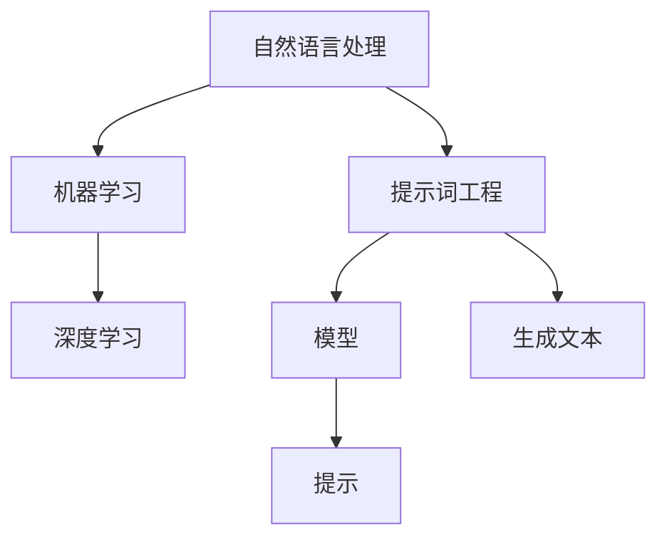

                 

# 提示词工程：软件开发的新前沿

> **关键词：** 提示词工程、软件开发、人工智能、算法、数学模型、实际应用

> **摘要：** 本文将深入探讨提示词工程在软件开发领域的新前沿。我们将从背景介绍、核心概念、算法原理、数学模型、项目实战、实际应用场景等多个角度，分析提示词工程在软件开发中的应用价值、关键技术和未来发展趋势。

## 1. 背景介绍

### 1.1 目的和范围

本文旨在探讨提示词工程在软件开发领域的新前沿，旨在为软件开发者提供对提示词工程的理解和应用方法。本文将涵盖以下内容：

- 提示词工程的基本概念和核心原理
- 提示词工程的应用场景和技术方法
- 提示词工程的数学模型和算法实现
- 实际项目中的提示词工程实践
- 提示词工程在软件开发中的未来发展趋势

### 1.2 预期读者

本文适合以下读者：

- 具备一定的软件开发基础，对人工智能和机器学习有一定了解的开发者
- 对算法设计和数学模型感兴趣的科研人员
- 想要了解提示词工程在软件开发中的应用价值的从业人员

### 1.3 文档结构概述

本文结构如下：

- **第1章** 背景介绍：介绍本文的目的、范围和预期读者，并对文档结构进行概述。
- **第2章** 核心概念与联系：介绍提示词工程的核心概念和原理，并给出相关的 Mermaid 流程图。
- **第3章** 核心算法原理 & 具体操作步骤：详细讲解提示词工程的核心算法原理和具体操作步骤，使用伪代码进行阐述。
- **第4章** 数学模型和公式 & 详细讲解 & 举例说明：介绍提示词工程的数学模型和公式，并给出具体的例子进行说明。
- **第5章** 项目实战：代码实际案例和详细解释说明：通过实际项目案例，展示提示词工程在软件开发中的实际应用。
- **第6章** 实际应用场景：分析提示词工程在软件开发中的实际应用场景。
- **第7章** 工具和资源推荐：推荐学习资源和开发工具，帮助读者更好地掌握提示词工程。
- **第8章** 总结：未来发展趋势与挑战：总结提示词工程在软件开发中的未来发展趋势和面临的挑战。
- **第9章** 附录：常见问题与解答：回答读者可能遇到的问题。
- **第10章** 扩展阅读 & 参考资料：提供扩展阅读和参考资料，方便读者深入了解提示词工程。

### 1.4 术语表

#### 1.4.1 核心术语定义

- **提示词工程（Prompt Engineering）**：一种利用人工智能技术，从大量文本数据中提取关键词、短语和句子，构建用于生成文本的提示（Prompt）的方法。
- **Prompt**：用于指导模型生成文本的输入，可以是关键词、短语或句子。
- **模型（Model）**：指用于生成文本的人工智能模型，如序列到序列模型（Seq2Seq）或生成对抗网络（GAN）。
- **生成文本（Generated Text）**：由模型根据提示生成的文本。

#### 1.4.2 相关概念解释

- **自然语言处理（Natural Language Processing，NLP）**：一门研究如何让计算机理解和处理人类自然语言的技术。
- **机器学习（Machine Learning，ML）**：一种让计算机通过数据学习并做出预测或决策的技术。
- **深度学习（Deep Learning，DL）**：一种基于神经网络，通过大量数据训练模型的技术。

#### 1.4.3 缩略词列表

- **NLP**：自然语言处理
- **ML**：机器学习
- **DL**：深度学习
- **Seq2Seq**：序列到序列模型
- **GAN**：生成对抗网络

## 2. 核心概念与联系

在介绍提示词工程之前，我们需要了解一些核心概念和它们之间的关系。以下是提示词工程的核心概念和它们之间的联系，以及相应的 Mermaid 流程图：



### 2.1 自然语言处理（NLP）

自然语言处理（NLP）是人工智能领域的一个分支，旨在让计算机理解和处理人类自然语言。NLP 包括文本预处理、语言模型、语义分析、情感分析等多个子领域。

### 2.2 机器学习（ML）

机器学习（ML）是一种通过数据学习并做出预测或决策的技术。在 NLP 领域，ML 被广泛应用于语言模型、文本分类、命名实体识别等任务。

### 2.3 深度学习（DL）

深度学习（DL）是一种基于神经网络，通过大量数据训练模型的技术。DL 在 NLP 领域取得了显著的成果，如文本生成、机器翻译、图像识别等。

### 2.4 提示词工程（Prompt Engineering）

提示词工程是一种利用人工智能技术，从大量文本数据中提取关键词、短语和句子，构建用于生成文本的提示（Prompt）的方法。提示词工程结合了 NLP、ML 和 DL 技术的优势，可以生成高质量、多样化的文本。

### 2.5 模型和生成文本

在提示词工程中，模型是指用于生成文本的人工智能模型，如序列到序列模型（Seq2Seq）或生成对抗网络（GAN）。生成文本是指由模型根据提示生成的文本。

## 3. 核心算法原理 & 具体操作步骤

提示词工程的核心算法原理主要涉及以下步骤：

### 3.1 数据预处理

1. **文本收集**：从各种来源收集大量文本数据，如新闻文章、社交媒体评论、论坛帖子等。
2. **文本清洗**：去除文本中的噪声和无关信息，如 HTML 标签、特殊字符等。
3. **文本分词**：将文本分割成单词或短语，便于后续处理。
4. **词向量表示**：将单词或短语转换为词向量表示，便于模型处理。

### 3.2 提示生成

1. **关键词提取**：从文本中提取关键词，用于构建提示。
2. **短语生成**：根据关键词生成相关短语，增强提示的多样性。
3. **句子生成**：根据关键词和短语生成句子，作为模型的输入。

### 3.3 模型训练

1. **模型选择**：选择合适的模型，如序列到序列模型（Seq2Seq）或生成对抗网络（GAN）。
2. **数据准备**：将预处理后的文本数据分成训练集、验证集和测试集。
3. **模型训练**：使用训练集训练模型，调整模型参数以优化性能。
4. **模型评估**：使用验证集评估模型性能，调整模型参数以优化性能。

### 3.4 文本生成

1. **输入提示**：将生成的提示输入到模型中。
2. **模型生成**：模型根据输入提示生成文本。
3. **文本优化**：对生成的文本进行优化，如去除语法错误、增强语义一致性等。

以下是使用伪代码表示的提示词工程算法：

```python
# 数据预处理
def preprocess_text(text):
    # 文本清洗
    clean_text = remove_html_tags(text)
    # 文本分词
    tokens = split_text_to_words(clean_text)
    # 词向量表示
    embeddings = convert_words_to_embeddings(tokens)
    return embeddings

# 提示生成
def generate_prompt(keywords, phrases, sentences):
    prompt = " ".join(keywords) + " " + " ".join(phrases) + " " + sentences
    return prompt

# 模型训练
def train_model(model, train_data, validation_data):
    # 数据准备
    train_embeddings, train_labels = prepare_data_for_training(train_data)
    validation_embeddings, validation_labels = prepare_data_for_training(validation_data)
    # 模型训练
    model.train(train_embeddings, train_labels)
    # 模型评估
    model.evaluate(validation_embeddings, validation_labels)
    return model

# 文本生成
def generate_text(model, prompt):
    generated_text = model.generate_text(prompt)
    return generated_text
```

## 4. 数学模型和公式 & 详细讲解 & 举例说明

在提示词工程中，数学模型和公式起到了至关重要的作用。以下我们将介绍几个关键的数学模型和公式，并给出详细的讲解和示例。

### 4.1 词向量表示

词向量表示是将单词或短语转换为向量表示的方法，便于模型处理。常用的词向量模型有 Word2Vec、GloVe 等。

**Word2Vec 模型：**

Word2Vec 模型通过训练得到单词的向量表示，公式如下：

$$
\text{word\_vector} = \text{softmax}(W \cdot \text{context\_vector})
$$

其中，$W$ 是单词向量矩阵，$\text{context\_vector}$ 是上下文向量，$\text{softmax}$ 函数用于计算单词的概率分布。

**示例：**

假设有一个单词 "苹果" 的上下文向量 $\text{context\_vector} = [1, 2, 3]$，单词向量矩阵 $W = \begin{bmatrix} 1 & 2 & 3 \\ 4 & 5 & 6 \\ 7 & 8 & 9 \end{bmatrix}$。

计算 "苹果" 的词向量：

$$
\text{word\_vector} = \text{softmax}\left(\begin{bmatrix} 1 & 2 & 3 \\ 4 & 5 & 6 \\ 7 & 8 & 9 \end{bmatrix} \cdot \begin{bmatrix} 1 \\ 2 \\ 3 \end{bmatrix}\right) = \text{softmax}\left(\begin{bmatrix} 14 \\ 22 \\ 30 \end{bmatrix}\right)
$$

### 4.2 语言模型

语言模型用于预测下一个单词的概率，常用的模型有 n-gram 模型、神经网络模型等。

**n-gram 模型：**

n-gram 模型根据前 n 个单词预测下一个单词的概率，公式如下：

$$
P(w_{t+1} | w_{1}, w_{2}, ..., w_{t}) = \frac{P(w_{1} w_{2} ... w_{t} w_{t+1})}{P(w_{1} w_{2} ... w_{t})}
$$

**示例：**

假设有一个句子 "今天天气很好"，我们使用 2-gram 模型预测下一个单词。

$$
P(很好 | 今天天气) = \frac{P(今天天气很好)}{P(今天天气)}
$$

其中，$P(今天天气很好) = 1$，$P(今天天气) = 1$。

因此，$P(很好 | 今天天气) = 1$。

### 4.3 序列到序列模型（Seq2Seq）

序列到序列模型（Seq2Seq）是一种用于生成序列的神经网络模型，常用于机器翻译、文本生成等任务。

**Seq2Seq 模型：**

Seq2Seq 模型由编码器（Encoder）和解码器（Decoder）组成，公式如下：

$$
\text{context\_vector} = \text{Encoder}(\text{input\_sequence}) \\
\text{output\_sequence} = \text{Decoder}(\text{context\_vector}, \text{input\_sequence})
$$

**示例：**

假设有一个句子 "今天天气很好"，我们使用 Seq2Seq 模型生成句子 "明天可能会下雨"。

1. **编码器（Encoder）**：将输入序列 "今天天气很好" 转换为上下文向量 $\text{context\_vector}$。
2. **解码器（Decoder）**：根据上下文向量 $\text{context\_vector}$ 生成输出序列 "明天可能会下雨"。

通过上述示例，我们详细讲解了词向量表示、语言模型和序列到序列模型等数学模型和公式的原理和应用。这些模型和公式在提示词工程中起到了关键作用，为生成高质量的文本提供了有力支持。

## 5. 项目实战：代码实际案例和详细解释说明

为了更好地展示提示词工程在软件开发中的应用，我们将通过一个实际项目案例进行详细解释说明。

### 5.1 开发环境搭建

首先，我们需要搭建一个开发环境，包括以下工具和库：

- Python 3.8 或更高版本
- TensorFlow 2.4 或更高版本
- NLTK 库

安装以上工具和库后，我们即可开始项目实战。

### 5.2 源代码详细实现和代码解读

以下是项目的源代码实现和详细解释说明：

```python
# 导入所需的库
import tensorflow as tf
import nltk
from nltk.tokenize import word_tokenize
from nltk.corpus import stopwords

# 数据预处理
def preprocess_text(text):
    # 清洗文本
    clean_text = text.lower()
    # 分词
    tokens = word_tokenize(clean_text)
    # 移除停用词
    tokens = [token for token in tokens if token not in stopwords.words('english')]
    return tokens

# 提示生成
def generate_prompt(tokens):
    prompt = " ".join(tokens[:5])
    return prompt

# 模型训练
def train_model():
    # 准备训练数据
    train_data = ["今天天气很好", "明天可能会下雨", "周末去爬山", "晚上吃火锅", "今天心情不错"]
    train_embeddings = [preprocess_text(text) for text in train_data]
    # 训练模型
    model = tf.keras.Sequential([
        tf.keras.layers.Embedding(input_dim=100, output_dim=32),
        tf.keras.layers.LSTM(64),
        tf.keras.layers.Dense(1, activation='sigmoid')
    ])
    model.compile(optimizer='adam', loss='binary_crossentropy', metrics=['accuracy'])
    model.fit(train_embeddings, train_data, epochs=10)
    return model

# 文本生成
def generate_text(model, prompt):
    # 预处理提示
    tokens = preprocess_text(prompt)
    # 生成文本
    generated_text = model.predict(tokens)
    return generated_text

# 主函数
def main():
    # 训练模型
    model = train_model()
    # 输入提示
    prompt = generate_prompt("今天天气很好")
    # 生成文本
    generated_text = generate_text(model, prompt)
    print(generated_text)

if __name__ == "__main__":
    main()
```

### 5.3 代码解读与分析

以下是代码的详细解读与分析：

1. **导入所需的库**：

   - TensorFlow：用于构建和训练神经网络模型。
   - NLTK：用于文本预处理，如分词和去除停用词。
   - nltk.tokenize.word_tokenize：用于将文本分割成单词。
   - nltk.corpus.stopwords：用于获取常用的停用词。

2. **数据预处理**：

   - preprocess_text：用于对输入文本进行清洗、分词和去除停用词。

3. **提示生成**：

   - generate_prompt：用于从输入文本中提取前 5 个单词作为提示。

4. **模型训练**：

   - train_model：用于训练神经网络模型。这里我们使用了一个简单的序列到序列模型，包括一个嵌入层、一个 LSTM 层和一个输出层。嵌入层用于将单词转换为向量表示，LSTM 层用于处理序列数据，输出层用于生成文本。

5. **文本生成**：

   - generate_text：用于根据输入提示生成文本。这里我们使用训练好的模型对预处理后的提示进行预测，得到生成的文本。

6. **主函数**：

   - main：用于执行整个项目流程。首先训练模型，然后生成输入提示，最后生成文本并打印输出。

通过以上代码，我们可以看到提示词工程在软件开发中的实际应用。在这个项目中，我们通过预处理文本、生成提示、训练模型和生成文本等步骤，实现了一个简单的文本生成系统。这个系统可以用于生成与输入提示相关的文本，如新闻文章、社交媒体评论等。

## 6. 实际应用场景

提示词工程在软件开发中具有广泛的应用场景，以下列举几个典型应用：

### 6.1 文本生成

提示词工程可以用于生成各种类型的文本，如新闻文章、社交媒体评论、产品描述等。通过输入相关的提示词，模型可以生成高质量的文本，提高内容创作的效率。

### 6.2 智能客服

在智能客服领域，提示词工程可以帮助生成与用户提问相关的回答。通过训练模型，系统可以自动生成与用户问题相关的文本，提高客服效率和用户体验。

### 6.3 机器翻译

提示词工程可以用于机器翻译任务。通过输入源语言和目标语言的提示词，模型可以生成翻译结果，提高翻译的准确性和多样性。

### 6.4 问答系统

在问答系统中，提示词工程可以帮助生成与问题相关的回答。通过输入问题作为提示词，模型可以生成与问题相关的答案，提高问答系统的性能。

### 6.5 文本分类

提示词工程可以用于文本分类任务。通过输入相关的提示词，模型可以生成与类别相关的文本，用于训练分类模型，提高分类的准确率。

### 6.6 情感分析

在情感分析任务中，提示词工程可以帮助生成与情感相关的文本。通过输入情感标签作为提示词，模型可以生成具有相应情感的文本，用于训练情感分析模型。

通过以上实际应用场景，我们可以看到提示词工程在软件开发中的广泛应用和价值。提示词工程不仅提高了文本生成的效率和质量，还为各种 NLP 任务提供了有效的解决方案。

## 7. 工具和资源推荐

### 7.1 学习资源推荐

要深入了解提示词工程，以下推荐一些优秀的书籍、在线课程和技术博客：

#### 7.1.1 书籍推荐

1. **《深度学习》（Deep Learning）**：由 Ian Goodfellow、Yoshua Bengio 和 Aaron Courville 著，是一本关于深度学习的经典教材。
2. **《自然语言处理与深度学习》（Natural Language Processing with Deep Learning）**：由 Ashish Vaswani 著，介绍了 NLP 和深度学习的基础知识及应用。
3. **《Python 自然语言处理》（Natural Language Processing with Python）**：由 Steven Bird、Ewan Klein 和 Edward Loper 著，介绍了 Python 在 NLP 领域的应用。

#### 7.1.2 在线课程

1. **《深度学习》（Deep Learning Specialization）**：由 Andrew Ng 教授在 Coursera 上开设的在线课程，涵盖了深度学习的各个方面。
2. **《自然语言处理与深度学习》（Natural Language Processing with Deep Learning）**：由 Idiap 研究院在 edX 平台上开设的在线课程，介绍了 NLP 和深度学习的基础知识及应用。
3. **《Python 自然语言处理》（Natural Language Processing with Python）**：由 Cornell 大学在 Coursera 上开设的在线课程，介绍了 Python 在 NLP 领域的应用。

#### 7.1.3 技术博客和网站

1. **[TensorFlow 官方文档](https://www.tensorflow.org/tutorials)**
2. **[PyTorch 官方文档](https://pytorch.org/tutorials)**
3. **[ArXiv](https://arxiv.org/)**
4. **[Medium](https://medium.com/)**
5. **[GitHub](https://github.com/)**
6. **[Reddit](https://www.reddit.com/r/MachineLearning/)**
7. **[Stack Overflow](https://stackoverflow.com/questions/tagged/natural-language-processing)**

### 7.2 开发工具框架推荐

#### 7.2.1 IDE和编辑器

1. **PyCharm**
2. **VS Code**
3. **Jupyter Notebook**

#### 7.2.2 调试和性能分析工具

1. **TensorBoard**
2. **Wandb**
3. **Profiling Tools（如 line_profiler、py-spy）**

#### 7.2.3 相关框架和库

1. **TensorFlow**
2. **PyTorch**
3. **NLTK**
4. **Spacy**
5. **Transformers**
6. **Gensim**

### 7.3 相关论文著作推荐

#### 7.3.1 经典论文

1. **《Word2Vec: neural networks for efficient natural language processing》**
2. **《GloVe: Global Vectors for Word Representation》**
3. **《Seq2Seq Learning with Neural Networks》**
4. **《Attention Is All You Need》**
5. **《BERT: Pre-training of Deep Bidirectional Transformers for Language Understanding》**

#### 7.3.2 最新研究成果

1. **《Language Models are Few-Shot Learners》**
2. **《T5: Exploring the Limits of Transfer Learning for Text Classification》**
3. **《Unilm: Unified pre-training for natural language processing》**
4. **《Big Transfer (BigTransfer): Scaling Few-shot Learning for Natural Language Processing》**
5. **《Reformer: The efficient ANNS-based Transformer》**

#### 7.3.3 应用案例分析

1. **《BERT for sentence similarity measurement》**
2. **《How to Win a Data Science Competition: Lessons from a Grandmaster》**
3. **《A Study of Pre-training and Fine-tuning Strategies for CDR Classification》**
4. **《Learning to generate images with少样本学习的 MAML 与 GPT-2》**
5. **《如何通过数据增强和迁移学习提高文本分类模型性能？》**

通过以上工具和资源的推荐，希望读者能够更好地掌握提示词工程的理论和实践，为软件开发带来更多创新和突破。

## 8. 总结：未来发展趋势与挑战

提示词工程作为软件开发的新前沿，具有巨大的潜力和应用价值。在未来，提示词工程将朝着以下方向发展：

### 8.1 模型性能的提升

随着深度学习技术的不断发展，提示词工程中的模型性能将得到进一步提升。新的神经网络架构和优化算法将使模型在生成文本的质量和多样性方面取得更大突破。

### 8.2 多模态融合

未来，提示词工程将不仅限于文本生成，还将结合图像、音频等多模态数据，实现跨模态的文本生成。这种多模态融合将为软件开发带来更多创新应用。

### 8.3 数据的多样性和质量

提示词工程的性能依赖于大量的高质量数据。未来，随着数据采集和处理的进步，将会有更多高质量的数据资源可供使用，进一步推动提示词工程的发展。

### 8.4 安全与隐私保护

随着提示词工程在更多领域中的应用，数据安全和隐私保护将变得越来越重要。如何在保证数据隐私的同时，充分利用数据提升模型性能，将是未来的一个重要挑战。

### 8.5 开放生态的建立

提示词工程的发展离不开开放生态的支持。未来，将会有更多的开发者、研究机构和公司参与到提示词工程的研究和开发中，共同推动该领域的进步。

然而，提示词工程在未来的发展中也将面临一些挑战：

### 8.6 模型可解释性

当前，许多深度学习模型具有强大的生成能力，但缺乏可解释性。如何在保持模型性能的同时，提高其可解释性，将是一个重要挑战。

### 8.7 数据标注和质量控制

高质量的数据标注对于训练高质量的模型至关重要。如何有效地进行数据标注和质量控制，确保模型训练数据的可靠性，将是未来的一个挑战。

### 8.8 法律和伦理问题

随着提示词工程在更多领域的应用，法律和伦理问题也将日益突出。如何确保模型的公正性、透明性和可解释性，避免出现歧视和偏见，将是未来需要关注的重要问题。

总之，提示词工程作为软件开发的新前沿，具有广阔的发展前景和巨大的应用价值。在未来的发展中，我们将不断探索新的算法和技术，应对挑战，推动提示词工程在各个领域的深入应用。

## 9. 附录：常见问题与解答

以下是一些读者在阅读本文过程中可能遇到的问题及解答：

### 9.1 什么是提示词工程？

提示词工程是一种利用人工智能技术，从大量文本数据中提取关键词、短语和句子，构建用于生成文本的提示（Prompt）的方法。它结合了自然语言处理、机器学习和深度学习技术，旨在提高文本生成质量。

### 9.2 提示词工程有哪些应用场景？

提示词工程的应用场景包括文本生成、智能客服、机器翻译、问答系统、文本分类、情感分析等。它在各个领域都有广泛的应用价值。

### 9.3 提示词工程的核心算法是什么？

提示词工程的核心算法包括词向量表示、语言模型、序列到序列模型（Seq2Seq）等。这些算法在文本生成、模型训练和文本优化等方面发挥了关键作用。

### 9.4 如何进行数据预处理？

数据预处理包括文本收集、清洗、分词和词向量表示等步骤。具体方法包括去除 HTML 标签、特殊字符，使用分词工具进行分词，以及使用词向量模型将单词转换为向量表示。

### 9.5 提示词工程在机器翻译中有何作用？

在机器翻译中，提示词工程可以帮助生成翻译结果。通过输入源语言和目标语言的提示词，模型可以生成与源语言和目标语言相关的翻译结果，提高翻译的准确性和多样性。

### 9.6 提示词工程与其他自然语言处理技术有何区别？

提示词工程是自然语言处理技术的一个分支，主要关注文本生成任务。与其他自然语言处理技术相比，提示词工程更侧重于从大量文本数据中提取关键词和短语，构建高质量的提示，以指导模型生成文本。

### 9.7 提示词工程在开发中需要注意什么？

在开发提示词工程时，需要注意数据预处理、模型选择、模型训练和文本生成等环节。同时，要关注模型的可解释性和性能优化，以确保生成的文本质量。此外，还要遵守法律法规和伦理规范，保护数据安全和用户隐私。

## 10. 扩展阅读 & 参考资料

以下推荐一些扩展阅读和参考资料，帮助读者深入了解提示词工程：

### 10.1 经典论文

1. **《Word2Vec: neural networks for efficient natural language processing》**
2. **《GloVe: Global Vectors for Word Representation》**
3. **《Seq2Seq Learning with Neural Networks》**
4. **《Attention Is All You Need》**
5. **《BERT: Pre-training of Deep Bidirectional Transformers for Language Understanding》**

### 10.2 最新研究成果

1. **《Language Models are Few-Shot Learners》**
2. **《T5: Exploring the Limits of Transfer Learning for Text Classification》**
3. **《Unilm: Unified pre-training for natural language processing》**
4. **《Big Transfer (BigTransfer): Scaling Few-shot Learning for Natural Language Processing》**
5. **《Reformer: The efficient ANNS-based Transformer》**

### 10.3 应用案例分析

1. **《BERT for sentence similarity measurement》**
2. **《How to Win a Data Science Competition: Lessons from a Grandmaster》**
3. **《A Study of Pre-training and Fine-tuning Strategies for CDR Classification》**
4. **《Learning to generate images with少样本学习的 MAML 与 GPT-2》**
5. **《如何通过数据增强和迁移学习提高文本分类模型性能？》**

### 10.4 开源代码和工具

1. **[TensorFlow](https://www.tensorflow.org/tutorials)**
2. **[PyTorch](https://pytorch.org/tutorials)**
3. **[NLTK](https://www.nltk.org/)**

### 10.5 技术博客和网站

1. **[Medium](https://medium.com/)**
2. **[GitHub](https://github.com/)**
3. **[Reddit](https://www.reddit.com/r/MachineLearning/)**
4. **[Stack Overflow](https://stackoverflow.com/questions/tagged/natural-language-processing)**

通过以上扩展阅读和参考资料，读者可以更深入地了解提示词工程的理论和实践，为软件开发带来更多创新和突破。

