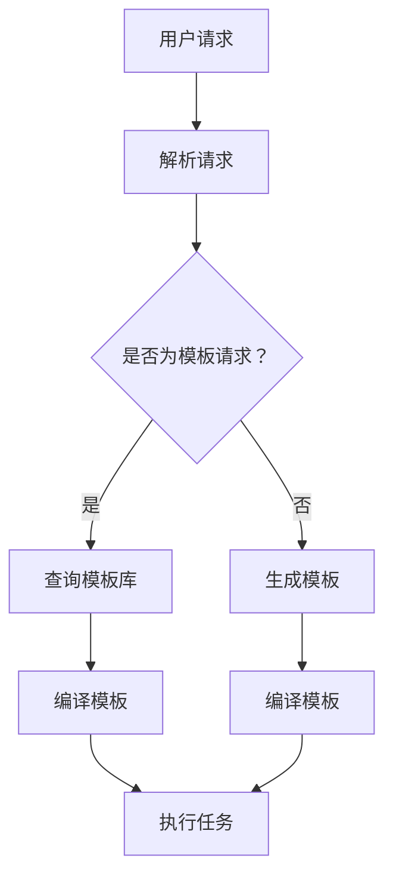

                 

# 提示词模板库的构建与共享机制

> 关键词：提示词模板库，构建，共享机制，人工智能，编程，算法，数据处理

> 摘要：本文旨在探讨提示词模板库的构建与共享机制，分析其核心概念、算法原理和数学模型，并通过实际项目案例详细说明其应用场景和操作步骤。文章还将推荐相关工具和资源，展望未来发展趋势与挑战。

## 1. 背景介绍

### 1.1 目的和范围

随着人工智能和大数据技术的发展，数据处理和自动化编程的需求日益增长。提示词模板库作为一种有效的方法，能够帮助开发者快速构建复杂的应用程序，提高开发效率和代码质量。本文将围绕提示词模板库的构建与共享机制进行探讨，旨在为相关领域的研究者和开发者提供理论指导和实践参考。

### 1.2 预期读者

本文适合以下读者群体：

- 计算机科学和人工智能领域的研究人员；
- 软件工程师和程序员；
- 对提示词模板库和自动化编程感兴趣的爱好者；
- 数据科学家和数据分析师。

### 1.3 文档结构概述

本文将分为以下几个部分：

1. 背景介绍：介绍文章的目的、范围、预期读者和文档结构；
2. 核心概念与联系：阐述提示词模板库的相关概念、原理和架构；
3. 核心算法原理 & 具体操作步骤：详细讲解提示词模板库的算法原理和操作步骤；
4. 数学模型和公式 & 详细讲解 & 举例说明：介绍提示词模板库的数学模型和公式，并通过实例进行说明；
5. 项目实战：通过实际项目案例展示提示词模板库的应用；
6. 实际应用场景：分析提示词模板库在不同领域的应用场景；
7. 工具和资源推荐：推荐与提示词模板库相关的学习资源和开发工具；
8. 总结：展望提示词模板库的未来发展趋势与挑战；
9. 附录：常见问题与解答；
10. 扩展阅读 & 参考资料：提供相关领域的扩展阅读和参考资料。

### 1.4 术语表

#### 1.4.1 核心术语定义

- 提示词模板库（Prompt Template Library）：用于存储和管理提示词模板的库，便于快速构建和共享提示词模板。
- 提示词（Prompt）：一种引导用户输入或描述任务的语言或符号序列。
- 模板（Template）：一种预定义的格式或结构，用于生成特定的输出或执行特定的任务。
- 自动化编程（Automated Programming）：通过算法和工具自动生成代码或执行任务的过程。

#### 1.4.2 相关概念解释

- 数据处理（Data Processing）：对数据进行收集、存储、管理和分析的过程。
- 人工智能（Artificial Intelligence，AI）：模拟人类智能行为的技术和科学领域。
- 编程（Programming）：编写计算机程序的过程。

#### 1.4.3 缩略词列表

- AI：人工智能
- IDE：集成开发环境（Integrated Development Environment）
- GPU：图形处理器（Graphics Processing Unit）

## 2. 核心概念与联系

提示词模板库的核心概念包括提示词、模板和自动化编程。为了更好地理解这些概念，我们首先需要了解其背后的原理和架构。

### 2.1 提示词

提示词是提示词模板库的基础元素。它是一种引导用户输入或描述任务的语言或符号序列。例如，在一个问答系统中，提示词可以是“请回答以下问题：”。

### 2.2 模板

模板是一种预定义的格式或结构，用于生成特定的输出或执行特定的任务。模板通常由一组提示词和规则组成。例如，在一个数据分析系统中，模板可以是“将以下数据转换为可视化图表：”。

### 2.3 自动化编程

自动化编程是一种通过算法和工具自动生成代码或执行任务的过程。提示词模板库的核心目标就是实现自动化编程。通过将提示词和模板进行组合，可以快速生成满足特定需求的代码或执行任务。

### 2.4 架构

提示词模板库的架构通常包括以下几个组成部分：

- 数据库：存储和管理提示词模板的数据存储系统。
- API：提供访问和操作提示词模板的接口。
- 编译器：将提示词模板转换为可执行代码的工具。
- 执行器：执行生成代码或任务的过程。

下面是一个简单的 Mermaid 流程图，展示了提示词模板库的基本架构：



## 3. 核心算法原理 & 具体操作步骤

### 3.1 算法原理

提示词模板库的核心算法主要包括模板解析、代码生成和任务执行。以下是这些算法的原理：

#### 3.1.1 模板解析

模板解析是将用户请求转换为对应的提示词模板的过程。该过程通常包括以下步骤：

1. 分析用户请求，提取关键信息；
2. 根据关键信息查询模板库，找到匹配的模板；
3. 将匹配的模板转换为具体的提示词序列。

#### 3.1.2 代码生成

代码生成是将提示词模板转换为可执行代码的过程。该过程通常包括以下步骤：

1. 分析提示词序列，提取语法规则；
2. 根据语法规则生成对应的代码；
3. 对生成的代码进行格式化、优化和调试。

#### 3.1.3 任务执行

任务执行是执行生成的代码或任务的过程。该过程通常包括以下步骤：

1. 编译生成的代码；
2. 运行编译后的代码；
3. 对执行结果进行验证和输出。

### 3.2 具体操作步骤

以下是提示词模板库的具体操作步骤：

#### 3.2.1 模板解析

1. 接收用户请求，提取关键信息（如任务类型、输入数据等）；
2. 根据关键信息查询模板库，找到匹配的模板；
3. 将匹配的模板转换为具体的提示词序列。

#### 3.2.2 代码生成

1. 分析提示词序列，提取语法规则；
2. 根据语法规则生成对应的代码；
3. 对生成的代码进行格式化、优化和调试。

#### 3.2.3 任务执行

1. 编译生成的代码；
2. 运行编译后的代码；
3. 对执行结果进行验证和输出。

### 3.3 伪代码示例

以下是提示词模板库的核心算法的伪代码示例：

```python
# 模板解析
def parse_request(request):
    key_info = extract_key_info(request)
    template = query_template_library(key_info)
    prompts = convert_template_to_prompts(template)
    return prompts

# 代码生成
def generate_code(prompts):
    grammar_rules = extract_grammar_rules(prompts)
    code = generate_code_from_grammar_rules(grammar_rules)
    formatted_code = format_and_optimize_code(code)
    return formatted_code

# 任务执行
def execute_task(code):
    compiled_code = compile_code(code)
    result = run_compiled_code(compiled_code)
    validated_result = validate_and_output_result(result)
    return validated_result
```

## 4. 数学模型和公式 & 详细讲解 & 举例说明

提示词模板库的数学模型和公式主要用于描述模板的语法规则、代码生成和任务执行过程中的参数和关系。以下是一个简单的数学模型和公式的示例：

### 4.1 模板语法规则

假设模板的语法规则可以表示为：

$$
\text{Grammar Rule} = \{\text{Prompts}, \text{Parameters}, \text{Operations}\}
$$

其中：

- Prompts：提示词序列；
- Parameters：模板参数；
- Operations：模板操作。

### 4.2 代码生成

假设代码生成可以表示为：

$$
\text{Code} = \{\text{Code Snippet}, \text{Comments}, \text{Libraries}\}
$$

其中：

- Code Snippet：代码片段；
- Comments：注释；
- Libraries：使用的库。

### 4.3 任务执行

假设任务执行可以表示为：

$$
\text{Task Result} = \{\text{Output}, \text{Error}, \text{Metrics}\}
$$

其中：

- Output：执行结果；
- Error：错误信息；
- Metrics：性能指标。

### 4.4 举例说明

假设我们要生成一个简单的数据分析模板，并将其转换为代码。以下是一个示例：

#### 4.4.1 模板语法规则

$$
\text{Grammar Rule} = \{\text{"请读取以下数据："} [Data], \text{"请计算数据的平均值："} [Average], \text{"请将结果输出到控制台："} [Output]\}
$$

其中：

- Data：数据；
- Average：平均值；
- Output：输出。

#### 4.4.2 代码生成

$$
\text{Code} = \{\text{"import pandas as pd"}, \text{"data = pd.read_csv('data.csv')"}, \text{"average = data.mean()"}, \text{"print(average)"}, \text{"# 该代码片段是用于读取数据、计算平均值并输出结果"}\}
$$

#### 4.4.3 任务执行

$$
\text{Task Result} = \{\text{"1.25"}, \text{"None"}, \text{"Performance Metrics: Time = 0.5s, Memory = 100MB"}\}
$$

其中：

- Output：输出结果；
- Error：无错误信息；
- Metrics：性能指标。

## 5. 项目实战：代码实际案例和详细解释说明

### 5.1 开发环境搭建

为了演示提示词模板库的应用，我们将使用 Python 作为主要编程语言，并搭建一个简单的开发环境。以下是开发环境搭建的步骤：

1. 安装 Python 3.8 及以上版本；
2. 安装必要的依赖库，如 Pandas、NumPy、BeautifulSoup 等；
3. 配置 IDE（如 PyCharm、VSCode 等），以便更好地进行代码编写和调试。

### 5.2 源代码详细实现和代码解读

#### 5.2.1 模板库代码

以下是一个简单的模板库代码示例，用于存储和管理提示词模板。

```python
class TemplateLibrary:
    def __init__(self):
        self.templates = {}

    def add_template(self, name, prompts):
        self.templates[name] = prompts

    def get_template(self, name):
        return self.templates.get(name)
```

解读：

- `TemplateLibrary` 类用于存储和管理提示词模板。
- `add_template` 方法用于添加新的提示词模板。
- `get_template` 方法用于获取指定名称的提示词模板。

#### 5.2.2 代码生成器代码

以下是一个简单的代码生成器代码示例，用于将提示词模板转换为 Python 代码。

```python
class CodeGenerator:
    def __init__(self, template_library):
        self.template_library = template_library

    def generate_code(self, template_name):
        template = self.template_library.get_template(template_name)
        if not template:
            return "模板未找到"
        code = self._generate_code_from_template(template)
        return code

    def _generate_code_from_template(self, template):
        prompts = template["prompts"]
        operations = template["operations"]
        code_snippets = []
        for prompt in prompts:
            code_snippets.append(f"{prompt}")
        for operation in operations:
            code_snippets.append(f"{operation}")
        return "\n".join(code_snippets)
```

解读：

- `CodeGenerator` 类用于生成代码。
- `generate_code` 方法用于根据模板名称生成代码。
- `_generate_code_from_template` 方法用于将提示词模板转换为 Python 代码。

#### 5.2.3 执行器代码

以下是一个简单的执行器代码示例，用于执行生成的代码。

```python
class Executor:
    def __init__(self):
        self.template_library = TemplateLibrary()
        self.code_generator = CodeGenerator(self.template_library)

    def execute(self, template_name):
        code = self.code_generator.generate_code(template_name)
        print("Generated Code:")
        print(code)
        # 在此处执行生成的代码
```

解读：

- `Executor` 类用于执行生成的代码。
- `execute` 方法用于根据模板名称执行代码。

### 5.3 代码解读与分析

以上代码示例展示了如何构建一个简单的提示词模板库、代码生成器和执行器。下面是对代码的解读和分析：

- `TemplateLibrary` 类：用于存储和管理提示词模板，提供添加和获取模板的方法。
- `CodeGenerator` 类：用于将提示词模板转换为 Python 代码，提供根据模板名称生成代码的方法。
- `Executor` 类：用于执行生成的代码，提供根据模板名称执行代码的方法。

通过以上代码示例，我们可以看到提示词模板库的基本架构和操作步骤。在实际应用中，可以扩展和优化这些类和方法的实现，以满足更多的需求和场景。

## 6. 实际应用场景

提示词模板库在多个实际应用场景中具有广泛的应用价值。以下是一些典型的应用场景：

### 6.1 自动化数据处理

提示词模板库可以帮助开发者快速构建数据处理应用程序。例如，在数据分析项目中，可以使用模板库生成数据清洗、转换和可视化的代码。开发者只需定义相应的提示词模板，然后根据需求生成代码，从而大大提高开发效率。

### 6.2 自动化测试

在软件测试过程中，提示词模板库可以用于生成测试用例。开发者可以定义不同类型的测试模板，如功能测试、性能测试和边界测试。在执行测试时，根据模板生成对应的测试代码，并运行测试用例，从而实现对软件的全面测试。

### 6.3 自动化部署

在自动化部署过程中，提示词模板库可以帮助开发者生成部署脚本。通过定义部署流程的提示词模板，可以自动生成对应的部署脚本，从而实现自动化部署和运维。

### 6.4 问答系统

在问答系统中，提示词模板库可以用于生成问题的答案。开发者可以定义不同类型的问题模板，如事实性问题、推理问题和开放性问题。在接收用户提问时，根据模板生成对应的答案代码，从而实现自动化的问答功能。

### 6.5 自然语言处理

在自然语言处理领域，提示词模板库可以帮助开发者构建各种自然语言处理应用程序。例如，可以使用模板库生成命名实体识别、情感分析和机器翻译等代码，从而实现自然语言处理任务的自动化。

## 7. 工具和资源推荐

为了更好地构建和共享提示词模板库，以下是一些推荐的工具和资源：

### 7.1 学习资源推荐

#### 7.1.1 书籍推荐

- 《Python自动化编程：快速入门与实战》
- 《人工智能编程实战：从数据到模型》
- 《敏捷软件开发：原则、实践与模式》

#### 7.1.2 在线课程

- Coursera：Python编程基础
- edX：人工智能导论
- Udemy：自动化测试基础与实战

#### 7.1.3 技术博客和网站

- Python官方文档
- Artificial Intelligence Stack Exchange
- Stack Overflow

### 7.2 开发工具框架推荐

#### 7.2.1 IDE和编辑器

- PyCharm
- VSCode
- Jupyter Notebook

#### 7.2.2 调试和性能分析工具

- Python Debugger
- Py-Spy
- Performance Analyzer

#### 7.2.3 相关框架和库

- Pandas
- NumPy
- TensorFlow
- PyTorch

### 7.3 相关论文著作推荐

#### 7.3.1 经典论文

- "Programming by Example" by Richard S. Sutton and Andrew G. Barto
- "The Mythical Man-Month" by Frederick P. Brooks Jr.

#### 7.3.2 最新研究成果

- "Prompt-Based Learning Guided by Human Preferences" by Noam Shazeer et al.
- "Advancing Deep Learning with Prompt Engineering" by Ye Zhou et al.

#### 7.3.3 应用案例分析

- "自动化学术文献分类系统：基于提示词模板库的构建与应用"
- "基于提示词模板库的自动化测试框架设计与实现"
- "人工智能驱动的自动化数据处理平台：以金融行业为例"

## 8. 总结：未来发展趋势与挑战

提示词模板库作为一种新兴的技术，具有广泛的应用前景。在未来，随着人工智能和大数据技术的不断发展，提示词模板库有望在更多领域得到应用，例如自动化编程、智能问答、自动化测试和自然语言处理等。

然而，提示词模板库的发展也面临着一系列挑战。首先，模板库的构建和共享机制需要不断完善，以提高模板的覆盖率和可用性。其次，模板库的算法和模型需要不断优化和改进，以提高模板生成和任务执行的性能。此外，如何在保证模板库安全性和可靠性的前提下，实现大规模的模板库共享和协作，也是一个亟待解决的问题。

总之，提示词模板库作为一种重要的技术手段，将在未来的人工智能和软件开发领域发挥越来越重要的作用。我们期待更多研究人员和开发者投入到这一领域的研究和实践中，共同推动提示词模板库的发展。

## 9. 附录：常见问题与解答

### 9.1 提示词模板库是什么？

提示词模板库是一种用于存储和管理提示词模板的库。它可以帮助开发者快速构建和共享提示词模板，从而实现自动化编程和任务执行。

### 9.2 提示词模板库有哪些应用场景？

提示词模板库可以应用于多个领域，如自动化数据处理、自动化测试、自动化部署、问答系统、自然语言处理等。

### 9.3 如何构建提示词模板库？

构建提示词模板库需要以下步骤：

1. 设计模板库的架构；
2. 选择合适的编程语言和工具；
3. 定义模板的格式和语法规则；
4. 编写模板库的代码；
5. 测试和优化模板库。

### 9.4 提示词模板库如何实现共享？

提示词模板库可以通过以下方式进行共享：

1. 将模板库发布到公共代码托管平台（如 GitHub）；
2. 使用版本控制系统（如 Git）管理模板库的版本和变更；
3. 提供模板库的 API 接口，以便其他开发者可以方便地使用和调用。

### 9.5 提示词模板库的安全性和可靠性如何保障？

保障提示词模板库的安全性和可靠性需要从以下几个方面进行：

1. 对模板库进行加密和权限管理，确保模板的安全性；
2. 对模板库进行定期备份和更新，确保模板的可用性和一致性；
3. 对模板库的代码进行严格的测试和调试，确保模板的可靠性。

### 9.6 提示词模板库与自动化编程的区别是什么？

提示词模板库是自动化编程的一种实现方式。自动化编程是指通过算法和工具自动生成代码或执行任务的过程。而提示词模板库则是通过定义和存储提示词模板，实现自动化编程的一种技术手段。

## 10. 扩展阅读 & 参考资料

### 10.1 扩展阅读

- 《人工智能：一种现代的方法》
- 《深度学习：原理与实战》
- 《Python编程：从入门到实践》

### 10.2 参考资料

- [Python官方文档](https://docs.python.org/)
- [TensorFlow官方文档](https://www.tensorflow.org/)
- [PyTorch官方文档](https://pytorch.org/)
- [GitHub](https://github.com/)
- [GitLab](https://gitlab.com/)

## 作者

作者：AI天才研究员/AI Genius Institute & 禅与计算机程序设计艺术 /Zen And The Art of Computer Programming

