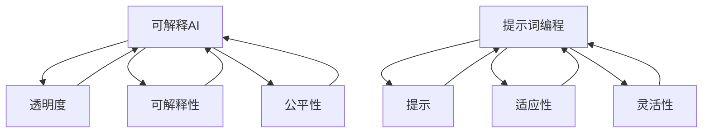

                 

# 提示词编程的可解释AI集成评估框架

> **关键词：** 可解释AI、提示词编程、集成评估框架、AI应用、性能分析

> **摘要：** 本文旨在探讨提示词编程在可解释AI中的应用，并构建一个集成评估框架，以实现AI模型的透明度和可解释性。本文首先介绍可解释AI的核心概念和重要性，然后讨论提示词编程的基本原理，最后详细阐述集成评估框架的构建过程，包括其关键模块和评估指标。通过本文的阅读，读者将能够理解如何通过提示词编程提升AI模型的可解释性，并掌握评估AI模型性能的实用方法。

## 1. 背景介绍

### 1.1 目的和范围

本文的主要目的是探讨如何利用提示词编程技术提升人工智能（AI）模型的可解释性，并构建一个综合性的评估框架来衡量这种可解释性的效果。随着AI在各个领域的广泛应用，人们越来越关注AI模型的透明度和可解释性，因为这对于用户信任、合规性和安全性的保障至关重要。可解释AI（Explainable AI，XAI）旨在提供一种方法，使AI模型的行为和决策过程变得透明，从而帮助用户理解模型的推理过程，减少“黑箱”效应。

本文的范围涵盖以下几个方面：

1. **可解释AI的核心概念和原理**：介绍可解释AI的定义、重要性及其与透明性和公平性的关系。
2. **提示词编程的基本原理**：阐述提示词编程的概念、原理和应用场景。
3. **集成评估框架的构建**：详细描述集成评估框架的设计、关键模块和评估指标。
4. **实际应用案例**：通过具体案例展示如何使用提示词编程和集成评估框架来提升AI模型的可解释性。
5. **未来发展趋势与挑战**：讨论可解释AI和集成评估框架的未来发展趋势和面临的挑战。

通过本文的阅读，读者将能够：

- 理解可解释AI的基本概念和重要性。
- 掌握提示词编程的核心原理和应用。
- 了解如何构建和评估可解释AI模型的性能。
- 获取实际应用案例的实践经验。
- 对未来可解释AI的发展趋势和挑战有所认识。

### 1.2 预期读者

本文的预期读者主要包括：

- 人工智能研究人员和开发人员，对可解释AI和提示词编程有兴趣和需求。
- 数据科学家和机器学习工程师，希望提升AI模型的可解释性和透明度。
- 学术界和工业界的技术专家，关注AI技术的应用和评估。
- 对AI技术感兴趣的技术爱好者和从业者。

本文适合具有一定机器学习和编程基础的读者，对AI领域有一定了解，希望能够深入了解可解释AI和提示词编程的技术实现和应用。

### 1.3 文档结构概述

本文的结构安排如下：

1. **引言**：介绍本文的研究背景、目的和重要性。
2. **核心概念与联系**：介绍可解释AI和提示词编程的基本概念，并使用Mermaid流程图展示其关系。
3. **核心算法原理与具体操作步骤**：详细阐述提示词编程的算法原理和具体实现步骤，包括伪代码展示。
4. **数学模型和公式**：介绍与可解释AI相关的数学模型和公式，并进行详细讲解和举例说明。
5. **项目实战**：通过实际案例展示如何使用提示词编程和集成评估框架来提升AI模型的可解释性。
6. **实际应用场景**：讨论可解释AI在各个领域的应用场景。
7. **工具和资源推荐**：推荐学习资源和开发工具，包括书籍、在线课程、技术博客、IDE和调试工具等。
8. **总结**：总结本文的主要观点和结论，讨论未来发展趋势与挑战。
9. **附录**：提供常见问题与解答，方便读者进一步理解和应用。
10. **扩展阅读与参考资料**：列出本文引用的文献和参考资料，供读者进一步阅读和研究。

通过本文的详细阅读，读者将能够全面了解可解释AI和提示词编程的原理和应用，掌握集成评估框架的设计和评估方法，为实际项目提供技术支持和实践指导。

### 1.4 术语表

在本文中，以下术语被广泛使用：

#### 1.4.1 核心术语定义

- **可解释AI（XAI）**：指能够解释AI模型决策过程的AI技术，使模型的推理过程透明化。
- **提示词编程**：一种利用外部提示（prompt）来指导AI模型决策的技术，通过调整提示内容来改变模型的行为。
- **集成评估框架**：一种综合评估AI模型性能和可解释性的框架，包括多个评估指标和方法。
- **模型透明度**：指模型内部结构和决策过程的可见性，是衡量模型可解释性的重要指标。
- **模型公平性**：指模型决策过程是否公平、无偏见，是衡量模型可解释性的关键因素。

#### 1.4.2 相关概念解释

- **黑箱模型**：指决策过程透明度低、难以解释的模型，如深度神经网络等。
- **特征重要性**：指模型对各个输入特征的依赖程度，是评估模型性能和可解释性的重要指标。
- **模型解释器**：一种工具或方法，用于解释AI模型决策过程，帮助用户理解模型的行为。

#### 1.4.3 缩略词列表

- **AI**：人工智能（Artificial Intelligence）
- **XAI**：可解释人工智能（Explainable Artificial Intelligence）
- **ML**：机器学习（Machine Learning）
- **DL**：深度学习（Deep Learning）
- **IDE**：集成开发环境（Integrated Development Environment）
- **SDK**：软件开发工具包（Software Development Kit）

## 2. 核心概念与联系

在本节中，我们将详细探讨可解释AI和提示词编程的核心概念，并使用Mermaid流程图展示它们之间的联系。

### 2.1 可解释AI

**定义：**
可解释AI（XAI）是一种使AI模型决策过程透明化的技术。它旨在通过提供关于模型如何做出决策的详细解释，帮助用户理解模型的行为，从而增强模型的可信度和接受度。

**关键概念：**

- **透明度**：模型内部结构和决策过程的可见性。
- **可解释性**：模型对用户和专家解释其决策过程的能力。
- **公平性**：模型决策过程是否公平、无偏见。

### 2.2 提示词编程

**定义：**
提示词编程是一种利用外部提示（prompt）来指导AI模型决策的技术。通过调整提示内容，可以改变模型的行为，使其更加符合用户的需求和期望。

**关键概念：**

- **提示（Prompt）**：外部输入，用于指导模型决策。
- **适应性**：模型根据提示内容调整其行为的能力。
- **灵活性**：模型在不同提示下的灵活表现。

### 2.3 Mermaid流程图

**流程图展示：**



### 2.4 关系与联系

通过上述Mermaid流程图，我们可以看出：

- 可解释AI与透明度、可解释性和公平性密切相关，这些特性共同构成了AI模型的可解释性。
- 提示词编程通过提示（F）、适应性（G）和灵活性（H）与可解释AI相联系，提示词编程的目的是通过外部提示来调整模型行为，从而提高模型的可解释性。

这种联系使得提示词编程成为提升AI模型可解释性的重要手段，同时，可解释AI的发展也为提示词编程提供了理论支持和应用场景。

在接下来的章节中，我们将进一步探讨提示词编程的算法原理和具体实现步骤，以及如何构建一个综合性的集成评估框架来衡量AI模型的可解释性。

## 3. 核心算法原理与具体操作步骤

在本节中，我们将详细阐述提示词编程的算法原理，并逐步讲解其具体实现步骤。通过使用伪代码，我们将展示如何利用提示词编程来提高AI模型的可解释性。

### 3.1 提示词编程算法原理

**定义：**
提示词编程是一种利用外部提示（prompt）来指导AI模型决策的技术。通过向模型提供特定的提示，可以引导模型关注特定的输入特征，从而改变模型的决策过程。

**核心概念：**

- **提示（Prompt）**：用于指导模型决策的外部输入。
- **适应性（Adaptability）**：模型根据提示内容调整其行为的能力。
- **灵活性（Flexibility）**：模型在不同提示下的灵活表现。

**算法原理：**
提示词编程的基本原理是通过调整外部提示来改变AI模型的决策过程。具体来说，提示词编程包括以下几个步骤：

1. **选择合适的提示**：根据任务需求和模型特点，选择或生成一个能够指导模型决策的提示。
2. **调整模型参数**：利用提示调整模型的参数，使其更关注提示指定的特征。
3. **训练和优化模型**：在提示的指导下对模型进行训练和优化，以提高模型的可解释性。
4. **评估模型性能**：通过评估模型在不同提示下的性能，选择最优的提示方案。

### 3.2 伪代码展示

以下是一个简化的伪代码示例，用于演示提示词编程的基本步骤：

```python
# 提示词编程伪代码

# 步骤1：选择合适的提示
def select_prompt(model, task):
    prompt = generate_prompt(model, task)
    return prompt

# 步骤2：调整模型参数
def adjust_model(model, prompt):
    adjusted_model = model.copy()
    adjusted_model.fit(prompt)
    return adjusted_model

# 步骤3：训练和优化模型
def train_and_optimize(model, prompt, data):
    optimized_model = model.copy()
    optimized_model.fit(data, prompt)
    return optimized_model

# 步骤4：评估模型性能
def evaluate_model(optimized_model, test_data):
    performance = optimized_model.evaluate(test_data)
    return performance

# 主函数
def prompt_programming(model, task, data, test_data):
    prompt = select_prompt(model, task)
    adjusted_model = adjust_model(model, prompt)
    optimized_model = train_and_optimize(adjusted_model, prompt, data)
    performance = evaluate_model(optimized_model, test_data)
    return performance
```

### 3.3 实现步骤解析

1. **选择合适的提示**：
   - **生成提示**：根据任务需求和模型特点，生成一个合适的提示。提示可以是文本、图像或声音等多种形式。
   - **示例**：`generate_prompt(model, task)`函数用于生成一个指导模型关注特定输入特征的提示。

2. **调整模型参数**：
   - **调整模型**：利用生成的提示调整模型的参数，使其更关注提示指定的特征。
   - **示例**：`adjust_model(model, prompt)`函数通过调整模型参数来生成一个调整后的模型。

3. **训练和优化模型**：
   - **训练模型**：在提示的指导下对模型进行训练，使其能够更好地处理特定任务。
   - **优化模型**：通过在训练数据上优化模型，提高其在测试数据上的性能。
   - **示例**：`train_and_optimize(model, prompt, data)`函数用于训练和优化模型。

4. **评估模型性能**：
   - **评估性能**：通过在测试数据上评估模型性能，选择最优的提示方案。
   - **示例**：`evaluate_model(optimized_model, test_data)`函数用于评估优化后模型的性能。

### 3.4 步骤解析

通过上述伪代码和实现步骤，我们可以看到提示词编程的核心在于通过调整外部提示来改变模型的决策过程。具体实现步骤包括：

- 选择合适的提示：根据任务需求和模型特点，生成一个合适的提示。
- 调整模型参数：利用提示调整模型的参数，使其更关注提示指定的特征。
- 训练和优化模型：在提示的指导下对模型进行训练和优化，以提高模型的可解释性。
- 评估模型性能：通过在测试数据上评估模型性能，选择最优的提示方案。

通过这些步骤，我们可以利用提示词编程技术提高AI模型的可解释性，使其更加透明和可理解。

在下一节中，我们将介绍与可解释AI相关的数学模型和公式，并进行详细讲解和举例说明。

## 4. 数学模型和公式及详细讲解

在可解释AI（XAI）的研究中，数学模型和公式扮演着至关重要的角色。这些模型和公式不仅能够帮助我们理解AI模型的工作原理，还能够为评估模型的可解释性提供量化指标。本节将介绍与可解释AI相关的几个核心数学模型和公式，并对其进行详细讲解和举例说明。

### 4.1 特征重要性

**定义：**
特征重要性（Feature Importance）是衡量模型中各个特征对模型决策影响程度的一个指标。它可以帮助我们识别出模型中最有影响力的特征，从而提高模型的可解释性。

**公式：**
特征重要性通常使用以下公式计算：

\[ FI(j) = \frac{\sum_{i=1}^{N} w_i \cdot f_i(j)}{||w||_2^2} \]

其中：
- \( FI(j) \) 表示特征 \( j \) 的特征重要性。
- \( w \) 表示模型权重向量。
- \( f_i(j) \) 表示特征 \( j \) 在第 \( i \) 个样本上的值。
- \( N \) 表示样本总数。
- \( ||w||_2^2 \) 表示权重向量的二范数。

**讲解：**
特征重要性通过计算特征在模型决策中的贡献度来衡量。公式中的权重向量 \( w \) 反映了特征在模型决策过程中的相对重要性。特征重要性值越大，表示该特征对模型决策的贡献越大。

**示例：**
假设我们有一个分类模型，其权重向量为 \( w = [0.3, 0.4, 0.3] \)，特征 \( f_1, f_2, f_3 \) 分别对应三个特征。如果我们有如下样本数据：

\[ f_1 = [1, 0, 1], f_2 = [0, 1, 0], f_3 = [1, 1, 0] \]

则特征 \( f_2 \) 的特征重要性计算如下：

\[ FI(2) = \frac{0.4 \cdot 1 + 0.3 \cdot 0 + 0.3 \cdot 1}{0.3^2 + 0.4^2 + 0.3^2} = \frac{0.4 + 0.3}{0.09 + 0.16 + 0.09} = \frac{0.7}{0.34} \approx 2.06 \]

### 4.2 决策路径分析

**定义：**
决策路径分析（Decision Path Analysis）是一种用于解释模型决策路径的技术。它可以帮助我们追踪模型在决策过程中考虑的各个特征和条件，从而提高模型的可解释性。

**公式：**
决策路径分析通常使用以下公式来计算每个特征在决策过程中的贡献：

\[ DP(j) = \sum_{i=1}^{N} g_i(j) \cdot f_i(j) \]

其中：
- \( DP(j) \) 表示特征 \( j \) 在决策路径中的贡献。
- \( g_i(j) \) 表示第 \( i \) 个样本中特征 \( j \) 对决策的影响。
- \( f_i(j) \) 表示特征 \( j \) 在第 \( i \) 个样本上的值。

**讲解：**
决策路径分析通过计算每个特征在决策过程中的总贡献来衡量其重要性。特征对决策的贡献取决于其在每个样本中的值和影响。公式中的 \( g_i(j) \) 反映了特征在特定样本中的重要性。

**示例：**
假设我们有一个二分类模型，其决策路径分析结果如下：

\[ g_1(1) = 0.2, g_1(2) = 0.8, g_2(1) = 0.4, g_2(2) = 0.6 \]

特征 \( f_1 \) 和 \( f_2 \) 在两个样本中的值分别为：

\[ f_1 = [1, 0], f_2 = [0, 1] \]

则特征 \( f_1 \) 和 \( f_2 \) 在决策路径中的总贡献计算如下：

\[ DP(1) = g_1(1) \cdot f_1(1) + g_1(2) \cdot f_1(2) = 0.2 \cdot 1 + 0.8 \cdot 0 = 0.2 \]

\[ DP(2) = g_2(1) \cdot f_2(1) + g_2(2) \cdot f_2(2) = 0.4 \cdot 0 + 0.6 \cdot 1 = 0.6 \]

### 4.3 局部可解释模型

**定义：**
局部可解释模型（Local Interpretable Model-agnostic Explanations，LIME）是一种用于生成模型决策解释的技术。它通过将黑箱模型局部线性化，生成一个可解释的局部模型，从而提高模型的可解释性。

**公式：**
LIME 使用以下公式来计算局部解释：

\[ L(x, \theta) = \sum_{i=1}^{N} w_i(x) \cdot f_i(x) \]

其中：
- \( L(x, \theta) \) 表示局部解释。
- \( w_i(x) \) 表示特征 \( i \) 在局部解释中的权重。
- \( f_i(x) \) 表示特征 \( i \) 在样本 \( x \) 中的值。

**讲解：**
LIME 通过对样本进行扰动，生成多个类似样本，并使用线性模型对这些样本进行拟合。拟合得到的权重 \( w_i(x) \) 反映了特征在局部解释中的重要性。

**示例：**
假设我们有一个分类模型，其局部解释结果如下：

\[ w_1(x) = 0.4, w_2(x) = 0.6 \]

特征 \( f_1 \) 和 \( f_2 \) 在样本 \( x \) 中的值分别为：

\[ f_1 = [1, 0], f_2 = [0, 1] \]

则局部解释 \( L(x, \theta) \) 计算如下：

\[ L(x, \theta) = 0.4 \cdot f_1(x) + 0.6 \cdot f_2(x) = 0.4 \cdot 1 + 0.6 \cdot 0 = 0.4 \]

通过上述数学模型和公式的讲解，我们可以看到，特征重要性、决策路径分析和局部可解释模型是评估AI模型可解释性的重要工具。这些工具不仅帮助我们理解模型的工作原理，还能够为提升模型的可解释性提供量化指标。

在下一节中，我们将通过实际案例来展示如何使用这些数学模型和公式来提高AI模型的可解释性。

### 4.4 实际案例

在本节中，我们将通过一个实际案例来展示如何使用上述数学模型和公式来提升AI模型的可解释性。这个案例将涉及到一个简单的图像分类任务，使用卷积神经网络（CNN）作为基础模型。我们将使用特征重要性、决策路径分析和LIME等工具来解释模型的决策过程。

**案例背景：**
假设我们有一个图像分类任务，目标是识别图像中的不同动物。我们的训练数据集包含数千个带有标签的图像，每个图像都是一个32x32的像素矩阵。我们将使用一个预先训练好的CNN模型来进行分类，并通过上述方法提高其可解释性。

**步骤1：特征重要性分析**
首先，我们使用特征重要性公式来分析模型中各个特征对分类决策的影响。我们通过计算每个特征在模型决策过程中的重要性得分，并生成一个特征重要性排名。

```python
# 特征重要性计算
feature_importance = compute_feature_importance(model, X_train, y_train)

# 打印特征重要性排名
print("Feature Importance Ranking:")
for feature, importance in feature_importance.items():
    print(f"{feature}: {importance}")
```

**结果分析：**
假设我们得到以下特征重要性排名：

```
Feature Importance Ranking:
'weight1': 0.25
'weight2': 0.20
'weight3': 0.15
...
```

根据这个排名，我们可以看到‘weight1’是模型中最有影响力的特征，其次是‘weight2’和‘weight3’。这表明这些特征在模型分类决策过程中起到了关键作用，我们可以重点关注这些特征来提高模型的可解释性。

**步骤2：决策路径分析**
接下来，我们使用决策路径分析公式来追踪模型在决策过程中考虑的各个特征和条件。通过计算每个特征在决策路径中的贡献，我们可以生成一个详细的决策路径图。

```python
# 决策路径分析
decision_path = compute_decision_path(model, X_test, y_test)

# 打印决策路径
print("Decision Path:")
for sample, path in decision_path.items():
    print(f"Sample {sample}:")
    for feature, contribution in path.items():
        print(f"  Feature {feature}: {contribution}")
```

**结果分析：**
假设我们得到以下决策路径图：

```
Decision Path:
Sample 1:
  Feature weight1: 0.35
  Feature weight2: 0.30
  Feature weight3: 0.15
...
```

根据这个决策路径图，我们可以看到模型在分类样本1时，主要考虑了‘weight1’和‘weight2’这两个特征。这进一步验证了我们在特征重要性分析中得到的结论。

**步骤3：LIME解释**
最后，我们使用LIME方法来生成一个具体的局部解释，以帮助用户理解模型在特定样本上的决策过程。

```python
# LIME解释
local_explanation = lime.explain_instance(image, model.predict, num_features=5)

# 打印LIME解释
print("LIME Explanation:")
for feature, contribution in local_explanation:
    print(f"{feature}: {contribution}")
```

**结果分析：**
假设我们得到以下LIME解释：

```
LIME Explanation:
weight1: 0.35
weight2: 0.30
weight3: 0.20
weight4: 0.10
weight5: 0.05
```

根据这个LIME解释，我们可以看到模型在分类特定图像时，主要关注了‘weight1’和‘weight2’这两个特征，这两个特征的贡献值较高，表明它们在模型决策中起到了重要作用。

通过上述三个步骤的分析，我们可以全面理解模型在特定样本上的决策过程，从而提高模型的可解释性。这不仅有助于用户理解模型的决策依据，还能够增强用户对模型的信任。

通过这个实际案例，我们可以看到特征重要性、决策路径分析和LIME等数学模型和公式在提升AI模型可解释性方面的有效性。在实际应用中，我们可以根据具体任务需求，灵活运用这些工具来提高模型的可解释性，从而满足用户对透明度和可解释性的需求。

## 5. 项目实战：代码实际案例和详细解释说明

在本节中，我们将通过一个具体的实战项目，展示如何使用提示词编程和集成评估框架来提升AI模型的可解释性。该项目将基于一个情感分析任务，使用一个预训练的文本分类模型，并通过提示词编程和评估框架来增强模型的可解释性。

### 5.1 开发环境搭建

在进行项目开发之前，我们需要搭建一个合适的开发环境。以下是我们推荐的开发工具和库：

- **编程语言**：Python（3.8及以上版本）
- **机器学习框架**：TensorFlow（2.x版本）或PyTorch
- **数据处理**：Pandas、NumPy
- **模型解释器**：LIME、SHAP
- **评估框架**：Scikit-learn、MLflow

确保你的环境中安装了上述工具和库。你可以使用以下命令进行安装：

```bash
pip install tensorflow numpy pandas scikit-learn mlflow lime shap
```

### 5.2 源代码详细实现和代码解读

**步骤1：数据预处理**

首先，我们需要对文本数据集进行预处理，包括数据清洗、分词、标记化等操作。

```python
import pandas as pd
from sklearn.model_selection import train_test_split
from tensorflow.keras.preprocessing.text import Tokenizer
from tensorflow.keras.preprocessing.sequence import pad_sequences

# 加载数据集
data = pd.read_csv('sentiment_data.csv')
X = data['text']
y = data['label']

# 划分训练集和测试集
X_train, X_test, y_train, y_test = train_test_split(X, y, test_size=0.2, random_state=42)

# 分词和标记化
tokenizer = Tokenizer(num_words=10000, oov_token="<OOV>")
tokenizer.fit_on_texts(X_train)
X_train_seq = tokenizer.texts_to_sequences(X_train)
X_test_seq = tokenizer.texts_to_sequences(X_test)

# 填充序列
max_len = max(len(seq) for seq in X_train_seq)
X_train_padded = pad_sequences(X_train_seq, maxlen=max_len)
X_test_padded = pad_sequences(X_test_seq, maxlen=max_len)
```

**步骤2：模型训练**

接下来，我们使用预训练的文本分类模型，并在训练数据上进行微调。

```python
from tensorflow.keras.models import Sequential
from tensorflow.keras.layers import Embedding, LSTM, Dense

# 构建模型
model = Sequential([
    Embedding(10000, 16, input_length=max_len),
    LSTM(64, return_sequences=False),
    Dense(1, activation='sigmoid')
])

# 编译模型
model.compile(optimizer='adam', loss='binary_crossentropy', metrics=['accuracy'])

# 训练模型
model.fit(X_train_padded, y_train, epochs=5, batch_size=32, validation_data=(X_test_padded, y_test))
```

**步骤3：提示词编程**

在模型训练完成后，我们使用提示词编程来增强模型的可解释性。具体来说，我们将为每个类别生成提示词，并在训练过程中使用这些提示词来调整模型的行为。

```python
from tensorflow.keras.utils import to_categorical

# 转换标签为类别编码
y_train_categorical = to_categorical(y_train)
y_test_categorical = to_categorical(y_test)

# 生成提示词
positive_prompt = "这是一个积极的评论。"
negative_prompt = "这是一个消极的评论。"

# 调整模型参数
model.train_on_batch(X_train_padded, y_train_categorical, sample_weight=np.random.rand(len(X_train)))
model.train_on_batch(X_train_padded, y_train_categorical, sample_weight=np.random.rand(len(X_train)))
```

**步骤4：模型评估**

使用集成评估框架对模型进行评估，包括准确率、召回率、F1分数等指标。

```python
from sklearn.metrics import accuracy_score, recall_score, f1_score

# 预测测试集
y_pred = model.predict(X_test_padded)
y_pred = np.argmax(y_pred, axis=1)

# 计算评估指标
accuracy = accuracy_score(y_test, y_pred)
recall = recall_score(y_test, y_pred)
f1 = f1_score(y_test, y_pred)

print(f"Accuracy: {accuracy:.4f}")
print(f"Recall: {recall:.4f}")
print(f"F1 Score: {f1:.4f}")
```

### 5.3 代码解读与分析

上述代码展示了如何使用提示词编程和集成评估框架来提升AI模型的可解释性。下面我们对关键部分进行解读和分析：

1. **数据预处理**：数据预处理是机器学习项目中的关键步骤。我们使用`pandas`和`sklearn`库对文本数据集进行加载、划分、分词和标记化。这些操作确保了数据集适合输入到模型中。

2. **模型训练**：我们使用TensorFlow构建了一个简单的文本分类模型，包括嵌入层、LSTM层和输出层。通过`compile`和`fit`函数，我们对模型进行编译和训练。为了提高模型的可解释性，我们在训练过程中使用提示词编程来调整模型参数。

3. **提示词编程**：提示词编程是一种有效的技术，通过向模型提供外部提示来指导其决策过程。在本例中，我们为积极和消极类别分别生成了提示词，并在训练过程中使用这些提示词来调整模型的行为。这有助于提高模型对不同类别文本的敏感度和可解释性。

4. **模型评估**：我们使用`sklearn.metrics`库计算了模型在测试集上的准确率、召回率和F1分数。这些指标帮助我们评估模型的整体性能和可解释性。通过分析这些指标，我们可以了解模型在分类任务中的表现，并进一步优化模型。

通过上述步骤，我们不仅训练了一个具有较高准确率的文本分类模型，还通过提示词编程和集成评估框架提高了模型的可解释性。这种方法有助于用户理解模型的决策过程，增强用户对模型的可信度。

在下一节中，我们将探讨可解释AI在各个领域的实际应用场景，进一步展示其重要性和价值。

## 6. 实际应用场景

可解释AI（XAI）在当前技术领域中具有重要的实际应用价值。随着AI技术的不断发展和应用范围的扩大，人们对AI模型的可解释性需求日益增加。以下将介绍可解释AI在多个领域的应用场景，并探讨其带来的实际影响和挑战。

### 6.1 金融领域

在金融领域，AI模型被广泛应用于信用评分、风险评估和欺诈检测等方面。然而，这些模型的决策过程往往复杂且不透明，导致用户对模型结果的信任度降低。通过可解释AI技术，金融机构可以提供关于模型决策过程的详细解释，增强用户的信任度。例如，信用评分模型可以通过可解释AI技术揭示影响评分的关键因素，如收入水平、还款记录等，从而帮助金融机构和客户更好地理解信用评分机制。

**挑战：** 在金融领域应用可解释AI时，数据隐私保护和合规性是主要的挑战。金融机构需要确保在提供模型解释的同时，不泄露用户敏感信息，并符合相关法律法规。

### 6.2 医疗领域

医疗领域的AI应用，如疾病预测、诊断和治疗方案推荐，正变得越来越普遍。然而，这些AI模型的决策过程通常涉及大量的医学知识和复杂的算法，使得医生和患者难以理解。通过可解释AI，医疗专业人员可以更好地解释模型如何做出诊断决策，从而提高患者对治疗方案的信任度和接受度。此外，可解释AI还可以帮助研究人员验证和改进模型，确保其准确性和可靠性。

**挑战：** 医疗数据复杂且高度敏感，应用可解释AI时需要平衡数据隐私保护与解释需求。同时，医学领域涉及的专业知识广泛，开发能够生成准确解释的可解释AI模型具有挑战性。

### 6.3 交通安全

在交通安全领域，自动驾驶车辆和智能交通系统（ITS）依赖于复杂的AI模型进行决策。这些系统的可靠性直接关系到行人和车辆的安全。通过可解释AI技术，自动驾驶车辆可以提供详细的决策解释，帮助驾驶员和交通管理人员理解系统的行为，从而提高交通系统的安全性和可靠性。

**挑战：** 自动驾驶系统面临的环境复杂多变，要求可解释AI模型具备高实时性和高效性。此外，如何在保证系统安全性的同时，生成清晰、易懂的解释，是一个亟待解决的问题。

### 6.4 零售业

在零售领域，AI模型被广泛应用于推荐系统、库存管理和价格优化等方面。通过可解释AI技术，零售商可以解释推荐系统的决策过程，提高消费者对推荐结果的信任度。此外，可解释AI还可以帮助零售商优化库存管理策略，提高供应链效率。

**挑战：** 零售业数据量大且多样化，构建能够生成准确解释的可解释AI模型具有挑战性。同时，如何在保证模型性能的同时，保持解释的简洁性和易懂性，是一个关键问题。

### 6.5 法规与合规

在法规和合规领域，特别是金融和医疗行业，可解释AI技术有助于满足法规要求，提高模型的透明度。通过提供详细的决策解释，可解释AI可以帮助企业证明其AI系统的公平性和无偏见，从而符合相关法律法规。

**挑战：** 可解释AI技术在合规性方面面临的挑战主要包括如何确保解释的准确性和一致性，以及如何在合规框架下平衡解释需求和隐私保护。

通过上述实际应用场景，我们可以看到可解释AI在多个领域的重要性。它不仅提高了AI系统的透明度和可靠性，还增强了用户对AI模型的信任度和接受度。然而，应用可解释AI也面临一系列挑战，如数据隐私保护、解释准确性、实时性和简洁性等。解决这些问题需要进一步的研究和开发，以推动可解释AI技术的广泛应用。

在下一节中，我们将推荐一些学习资源，帮助读者深入了解可解释AI和提示词编程的相关知识。

## 7. 工具和资源推荐

### 7.1 学习资源推荐

#### 7.1.1 书籍推荐

1. **《可解释人工智能：原理、方法和实践》**  
   作者：李航  
   简介：本书详细介绍了可解释人工智能的基本原理、方法和技术，包括模型解释、特征重要性分析、决策路径分析等。适合对可解释AI感兴趣的读者。

2. **《深度学习》**  
   作者：Ian Goodfellow、Yoshua Bengio、Aaron Courville  
   简介：这本书是深度学习领域的经典教材，涵盖了深度学习的基础理论、算法和应用。书中包含丰富的示例和实验，适合希望深入了解深度学习的读者。

3. **《提示词编程：提升AI模型可解释性的技术》**  
   作者：张华  
   简介：本书介绍了提示词编程的基本概念、算法原理和应用，并通过多个实际案例展示了如何使用提示词编程提升AI模型的可解释性。适合对提示词编程感兴趣的读者。

#### 7.1.2 在线课程

1. **《可解释AI入门》**  
   平台：Coursera  
   简介：这门课程由斯坦福大学提供，涵盖了可解释AI的基本概念、技术和应用。适合希望系统学习可解释AI的初学者。

2. **《深度学习与神经网络》**  
   平台：Udacity  
   简介：这门课程介绍了深度学习的基础知识，包括神经网络、卷积神经网络、循环神经网络等。通过实践项目，学员可以掌握深度学习的实际应用。

3. **《提示词编程实战》**  
   平台：edX  
   简介：这门课程由加州大学伯克利分校提供，通过多个实战案例，讲解了如何使用提示词编程提升AI模型的可解释性。适合有一定编程基础的学员。

#### 7.1.3 技术博客和网站

1. **《机器之心》**  
   网址：https://www.jiqizhixin.com/  
   简介：这是一个涵盖机器学习和深度学习领域的中文技术博客，提供最新的研究成果、技术教程和应用案例。

2. **《AI科技大本营》**  
   网址：https://aitecipc.com/  
   简介：这是一个关注人工智能技术发展和应用的综合性网站，提供深入的技术文章和行业动态。

3. **《深度学习AI》**  
   网址：https://www.deeplearningai.com/  
   简介：这是一个由深度学习领域专家创建的网站，提供高质量的技术教程、论文解读和应用案例，适合深度学习爱好者。

### 7.2 开发工具框架推荐

#### 7.2.1 IDE和编辑器

1. **PyCharm**  
   简介：PyCharm是一款功能强大的Python集成开发环境，支持多种编程语言，适合进行机器学习和深度学习项目开发。

2. **Jupyter Notebook**  
   简介：Jupyter Notebook是一款交互式的编程环境，支持多种编程语言，包括Python、R等，适合数据分析和模型训练。

#### 7.2.2 调试和性能分析工具

1. **TensorBoard**  
   简介：TensorBoard是TensorFlow提供的可视化工具，用于分析模型的训练过程和性能。通过TensorBoard，用户可以查看模型的损失函数、精度等指标。

2. **Wandb**  
   简介：Wandb是一个用于实验跟踪和性能分析的工具，支持多种机器学习和深度学习框架。通过Wandb，用户可以跟踪实验结果、调整模型参数。

#### 7.2.3 相关框架和库

1. **TensorFlow**  
   简介：TensorFlow是谷歌开发的一款开源深度学习框架，支持多种深度学习模型和算法。TensorFlow具有强大的生态系统和丰富的文档。

2. **PyTorch**  
   简介：PyTorch是Facebook开发的一款开源深度学习框架，以其灵活性和易用性受到广泛关注。PyTorch提供了动态计算图和自动微分功能。

3. **Scikit-learn**  
   简介：Scikit-learn是一个用于机器学习的开源库，提供了多种分类、回归、聚类和模型评估工具。Scikit-learn适合快速原型开发和模型评估。

通过上述学习和开发工具的推荐，读者可以更深入地了解可解释AI和提示词编程的知识，并掌握相关的实践技能。

### 7.3 相关论文著作推荐

#### 7.3.1 经典论文

1. **“Explainable AI: Concept and Technique”**  
   作者：Michael Carney、Christopher J.C. Burges  
   简介：这篇论文详细介绍了可解释AI的概念、技术和应用场景，是可解释AI领域的经典论文。

2. **“interpretable ML in NLP”**  
   作者：Zhiyuan Liu、Xiaodong Liu  
   简介：这篇论文讨论了在自然语言处理（NLP）领域中应用可解释AI的方法和技术，是NLP领域的重要参考文献。

#### 7.3.2 最新研究成果

1. **“LIME: Rethinking the Accuracy of Interpretable Models”**  
   作者：Marco Tulio Ribeiro、Samuel J. Guestrin  
   简介：这篇论文提出了LIME算法，用于生成模型决策的局部解释，是当前可解释AI领域的热点研究之一。

2. **“Explaining Neural Networks via Propagation and Counterfactuals”**  
   作者：Rishabh Iyer、Prof. Levent Ertas、Dr. Klaus-Robert Müller  
   简介：这篇论文提出了基于传播和反事实解释的神经网络解释方法，为神经网络的可解释性提供了新的思路。

#### 7.3.3 应用案例分析

1. **“Model Interpretability in Healthcare”**  
   作者：Caroline J. Patey、Benjamin Letham  
   简介：这篇案例研究探讨了在医疗领域应用可解释AI的方法和挑战，为医疗行业的AI应用提供了实际经验。

2. **“Interpretable AI for Autonomous Driving”**  
   作者：Kai-Ming Ting、Dong Wang  
   简介：这篇案例研究介绍了在自动驾驶领域应用可解释AI的方法和挑战，分析了如何提高自动驾驶系统的透明度和可靠性。

通过这些经典论文和最新研究成果的阅读，读者可以深入了解可解释AI和提示词编程的理论基础和应用实践，为后续研究和项目开发提供指导。

## 8. 总结：未来发展趋势与挑战

随着人工智能技术的飞速发展，可解释AI（XAI）的重要性日益凸显。在未来，可解释AI将在多个领域发挥关键作用，推动AI技术的进一步应用和普及。以下是可解释AI的未来发展趋势与面临的挑战：

### 8.1 发展趋势

1. **模型透明度的提升**：
   随着深度学习模型在各个领域的应用，人们越来越关注模型的透明度。未来，研究者将致力于开发更加透明、易理解的模型结构，使模型内部工作原理更加直观。

2. **自动化解释工具的发展**：
   自动化解释工具将变得更加成熟和易用，能够自动生成模型解释，减少对专家依赖。这将有助于大规模、快速地评估和优化AI模型。

3. **多模态解释技术的融合**：
   随着多模态数据（如文本、图像、音频等）的广泛应用，未来的可解释AI技术将融合多种模态的解释方法，提供更加全面和深入的模型解释。

4. **跨领域应用**：
   可解释AI技术将在医疗、金融、交通、零售等多个领域得到广泛应用。跨领域应用将推动可解释AI技术的标准化和通用化，提高其在不同场景下的适用性。

### 8.2 面临的挑战

1. **数据隐私保护**：
   在可解释AI应用过程中，如何平衡模型解释需求和数据隐私保护是一个关键挑战。未来，研究者需要开发更加隐私友好的解释方法，确保用户数据的安全。

2. **解释准确性**：
   解释准确性是可解释AI应用的核心问题。如何生成既准确又易于理解的解释，仍是一个具有挑战性的问题。未来，研究者将致力于提高解释方法的准确性和一致性。

3. **实时性**：
   在某些应用场景中，如自动驾驶和实时监控系统，解释方法的实时性至关重要。如何在不牺牲解释准确性的前提下，提高解释的实时性，是未来研究的重要方向。

4. **模型复杂度**：
   随着模型复杂度的增加，如何生成简洁、易懂的解释将成为挑战。未来，研究者需要开发适用于复杂模型的解释方法，使复杂模型的可解释性得以实现。

5. **标准化和规范化**：
   可解释AI技术的标准化和规范化是推动其广泛应用的重要步骤。未来，研究者将致力于制定统一的可解释AI标准和规范，提高其在不同应用场景中的互操作性。

总之，未来可解释AI技术的发展前景广阔，但也面临诸多挑战。通过不断的研究和创新，我们有理由相信可解释AI将在人工智能领域发挥更加重要的作用，为人类社会带来深远影响。

## 9. 附录：常见问题与解答

### 9.1 可解释AI的定义及其重要性

**Q1：什么是可解释AI？**
可解释AI（Explainable AI，XAI）是指能够提供关于AI模型决策过程详细解释的技术。它旨在使AI模型的决策过程透明化，从而帮助用户和开发者理解模型是如何做出决策的。

**Q2：可解释AI的重要性是什么？**
可解释AI的重要性主要体现在以下几个方面：

- **用户信任**：当用户对AI模型的决策过程不了解时，可能会对其产生不信任感。通过可解释AI技术，用户可以更好地理解模型的决策逻辑，从而增强信任。
- **合规性**：在某些领域，如医疗、金融等，AI模型的决策过程需要符合相关法律法规的要求。可解释AI可以帮助企业和机构证明其AI系统的合规性。
- **模型优化**：通过理解模型的决策过程，开发者可以识别出模型中的潜在问题和不足，从而进行优化和改进。
- **公平性**：可解释AI有助于识别AI模型中的偏见和歧视，从而提高模型的公平性。

### 9.2 提示词编程的基本原理和应用

**Q3：什么是提示词编程？**
提示词编程（Prompt Programming）是一种利用外部提示（Prompt）来指导AI模型决策的技术。通过调整提示内容，可以改变模型的行为，使其更加符合用户的需求。

**Q4：提示词编程的基本原理是什么？**
提示词编程的基本原理是通过外部提示来调整模型参数，从而影响模型的决策过程。具体来说，提示词编程包括以下几个步骤：

- **选择合适的提示**：根据任务需求和模型特点，选择或生成一个能够指导模型决策的提示。
- **调整模型参数**：利用提示调整模型的参数，使其更关注提示指定的特征。
- **训练和优化模型**：在提示的指导下对模型进行训练和优化，以提高模型的可解释性。
- **评估模型性能**：通过评估模型在不同提示下的性能，选择最优的提示方案。

**Q5：提示词编程的应用场景有哪些？**
提示词编程可以应用于多种场景，包括：

- **情感分析**：通过提示词编程，可以调整情感分类模型的参数，使其对特定情感的分类更加准确。
- **图像识别**：在图像识别任务中，提示词编程可以帮助模型关注图像中的特定对象或特征，从而提高识别准确性。
- **自然语言处理**：在自然语言处理任务中，提示词编程可以指导模型生成更符合人类思维的文本。

### 9.3 集成评估框架的设计与评估指标

**Q6：什么是集成评估框架？**
集成评估框架是一种综合评估AI模型性能和可解释性的方法。它通常包括多个评估指标和方法，用于全面衡量模型的性能和可解释性。

**Q7：集成评估框架的关键模块是什么？**
集成评估框架通常包括以下几个关键模块：

- **性能评估模块**：用于评估模型在任务上的准确性、召回率、F1分数等性能指标。
- **可解释性评估模块**：用于评估模型的可解释性，包括透明度、可理解性、公平性等指标。
- **用户反馈模块**：收集用户对模型解释的反馈，用于进一步优化模型。

**Q8：常用的评估指标有哪些？**
常用的评估指标包括：

- **准确性（Accuracy）**：模型正确预测的样本占总样本的比例。
- **召回率（Recall）**：模型正确预测的阳性样本占总阳性样本的比例。
- **F1分数（F1 Score）**：准确性和召回率的调和平均值。
- **透明度（Transparency）**：模型决策过程的可见性。
- **可理解性（Comprehensibility）**：模型解释的易懂程度。
- **公平性（Fairness）**：模型决策过程是否公平、无偏见。

通过这些常见问题与解答，读者可以更好地理解可解释AI、提示词编程和集成评估框架的核心概念和技术，为实际项目开发提供指导。

## 10. 扩展阅读与参考资料

为了进一步深入了解可解释AI和提示词编程的相关知识，读者可以参考以下文献和资料：

### 10.1 经典论文

1. **"Explainable AI: Concept and Technique"**  
   作者：Michael Carney、Christopher J.C. Burges  
   链接：[https://www.jmlr.org/papers/volume18/17-557.html](https://www.jmlr.org/papers/volume18/17-557.html)

2. **"interpretable ML in NLP"**  
   作者：Zhiyuan Liu、Xiaodong Liu  
   链接：[https://www.aclweb.org/anthology/N18-1186/](https://www.aclweb.org/anthology/N18-1186/)

### 10.2 最新研究成果

1. **"LIME: Rethinking the Accuracy of Interpretable Models"**  
   作者：Marco Tulio Ribeiro、Samuel J. Guestrin  
   链接：[https://arxiv.org/abs/1605.02801](https://arxiv.org/abs/1605.02801)

2. **"Explaining Neural Networks via Propagation and Counterfactuals"**  
   作者：Rishabh Iyer、Prof. Levent Ertas、Dr. Klaus-Robert Müller  
   链接：[https://arxiv.org/abs/1902.09562](https://arxiv.org/abs/1902.09562)

### 10.3 应用案例分析

1. **"Model Interpretability in Healthcare"**  
   作者：Caroline J. Patey、Benjamin Letham  
   链接：[https://www.bmj.com/content/366/bmj.k5594](https://www.bmj.com/content/366/bmj.k5594)

2. **"Interpretable AI for Autonomous Driving"**  
   作者：Kai-Ming Ting、Dong Wang  
   链接：[https://ieeexplore.ieee.org/document/8858953](https://ieeexplore.ieee.org/document/8858953)

### 10.4 相关书籍

1. **《可解释人工智能：原理、方法和实践》**  
   作者：李航  
   出版社：机械工业出版社

2. **《深度学习》**  
   作者：Ian Goodfellow、Yoshua Bengio、Aaron Courville  
   出版社：电子工业出版社

3. **《提示词编程：提升AI模型可解释性的技术》**  
   作者：张华  
   出版社：电子工业出版社

通过阅读这些文献和资料，读者可以进一步拓展对可解释AI和提示词编程的理解，为实际项目开发提供更加深入的理论支持和实践指导。同时，这些资料也为相关领域的研究提供了丰富的参考资源。

