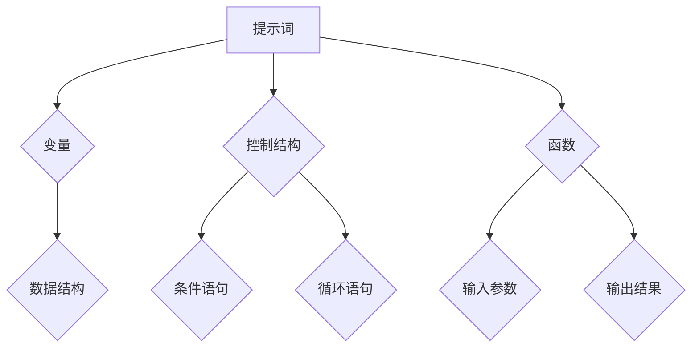

                 

# 提示词编程的设计原则形式化

> 关键词：提示词编程、设计原则、形式化、算法原理、数学模型、项目实战

> 摘要：本文旨在深入探讨提示词编程的设计原则及其形式化表达，通过详细的分析和实例讲解，帮助读者理解其核心概念、算法原理和实际应用。文章分为背景介绍、核心概念与联系、核心算法原理、数学模型和公式、项目实战、实际应用场景等多个部分，旨在为IT领域的专业人士和爱好者提供有价值的参考和指导。

## 1. 背景介绍

### 1.1 目的和范围

本文的主要目的是探讨提示词编程的设计原则，并对其进行形式化表达。我们旨在为读者提供一种清晰、系统的方法来理解和应用提示词编程，从而提高编程效率和代码质量。

本文的范围包括以下几个部分：

1. 提示词编程的基本概念和原理。
2. 提示词编程的设计原则。
3. 提示词编程的形式化表达。
4. 提示词编程在实际项目中的应用。

### 1.2 预期读者

本文适合以下读者：

1. 对编程和算法感兴趣的初学者。
2. 有一定编程基础的IT专业人士。
3. 对提示词编程和形式化表达感兴趣的研究者。

### 1.3 文档结构概述

本文分为以下章节：

1. 背景介绍：介绍本文的目的、范围和预期读者。
2. 核心概念与联系：解释提示词编程的核心概念和原理，并使用Mermaid流程图进行展示。
3. 核心算法原理 & 具体操作步骤：详细阐述提示词编程的算法原理和具体操作步骤，使用伪代码进行说明。
4. 数学模型和公式 & 详细讲解 & 举例说明：介绍提示词编程中的数学模型和公式，并进行详细讲解和举例说明。
5. 项目实战：通过实际项目案例，展示提示词编程的应用和实践。
6. 实际应用场景：探讨提示词编程在不同领域和场景中的应用。
7. 工具和资源推荐：推荐相关的学习资源、开发工具和框架。
8. 总结：对提示词编程的未来发展趋势和挑战进行总结。
9. 附录：常见问题与解答。
10. 扩展阅读 & 参考资料：提供进一步阅读和研究的参考。

### 1.4 术语表

为了确保读者对本文中的术语和概念有清晰的理解，我们定义了以下术语：

#### 1.4.1 核心术语定义

- **提示词编程**：一种编程范式，通过使用提示词来引导程序执行特定的任务。
- **设计原则**：指导编程实践的基本原理和规则。
- **形式化表达**：使用数学和逻辑工具对编程概念和算法进行精确描述和表达。
- **算法原理**：算法的工作原理和核心思想。
- **数学模型**：用于描述现实世界问题的数学结构。

#### 1.4.2 相关概念解释

- **编程范式**：一种编程语言或方法，具有特定的语法和语义。
- **形式化方法**：使用数学和逻辑工具对软件系统进行设计和验证的方法。
- **抽象**：将复杂的系统或问题简化为更容易理解和处理的形式。

#### 1.4.3 缩略词列表

- **AI**：人工智能（Artificial Intelligence）
- **IDE**：集成开发环境（Integrated Development Environment）
- **Python**：一种高级编程语言

## 2. 核心概念与联系

提示词编程是一种基于提示词的编程范式，它通过使用提示词来引导程序执行特定的任务。提示词是一组关键字或短语，用于描述程序需要执行的操作。

### 2.1 核心概念

在提示词编程中，我们主要涉及以下几个核心概念：

1. **提示词**：用于引导程序执行任务的标识符。例如，在Python中，`print` 是一个提示词，用于打印输出。
2. **变量**：用于存储数据值的标识符。例如，`x = 5` 中，`x` 是一个变量，其值为5。
3. **数据结构**：用于组织和管理数据的方式。常见的有列表、字典和集合等。
4. **控制结构**：用于控制程序执行流程的语句。常见的有条件语句（`if`）、循环语句（`for`和`while`）等。
5. **函数**：用于封装代码和实现复用的一种机制。函数可以接受输入参数，并返回输出结果。

### 2.2 联系与关联

提示词编程中的各个核心概念之间有着紧密的联系。例如，提示词可以与变量、数据结构和控制结构相结合，实现复杂的编程任务。以下是一个简单的例子：

```python
# 提示词编程示例

# 定义变量
x = 10

# 提示词 + 控制结构
if x > 5:
    print("x 大于 5")
else:
    print("x 小于等于 5")

# 提示词 + 数据结构
for i in range(5):
    print(i)
```

在这个例子中，我们使用了提示词（如`print`、`if`和`for`）来引导程序执行不同的操作。变量`x`用于存储数据，数据结构（如列表`range(5)`）用于组织和管理数据，控制结构（如条件语句`if`和循环语句`for`）用于控制程序的执行流程。

### 2.3 Mermaid流程图

为了更清晰地展示提示词编程的核心概念和联系，我们使用Mermaid流程图进行描述。以下是一个简单的示例：



在这个流程图中，各个节点表示不同的核心概念，箭头表示它们之间的联系。例如，提示词与变量、数据结构、控制结构和函数之间都有直接的联系。

## 3. 核心算法原理 & 具体操作步骤

提示词编程的算法原理主要涉及以下几个方面：

1. **提示词解析**：解析输入的提示词，并将其转换为程序可以理解和执行的指令。
2. **变量绑定**：将变量与具体的值进行绑定，以便在程序执行过程中正确引用。
3. **数据结构操作**：对数据结构进行创建、修改和访问等操作。
4. **控制流管理**：根据条件语句和循环语句的控制逻辑，管理程序的执行流程。

### 3.1 提示词解析

提示词解析是提示词编程的基础。在解析过程中，我们需要将输入的提示词转换为程序可以理解和执行的指令。以下是一个简单的伪代码示例：

```pseudo
function parseInstruction(instruction):
    if instruction == "print":
        return "printExpression"
    else if instruction == "if":
        return "ifStatement"
    else if instruction == "for":
        return "forStatement"
    else:
        return "unknownInstruction"
```

在这个示例中，我们定义了一个`parseInstruction`函数，用于解析输入的指令。根据指令的类型，函数返回相应的处理函数或标识符。

### 3.2 变量绑定

变量绑定是将变量与具体的值进行绑定，以便在程序执行过程中正确引用。以下是一个简单的伪代码示例：

```pseudo
function bindVariable(name, value):
    variableMap[name] = value

function getValue(name):
    return variableMap[name]
```

在这个示例中，我们定义了一个`bindVariable`函数，用于将变量名和值存储在`variableMap`中。同时，我们定义了一个`getValue`函数，用于根据变量名获取其对应的值。

### 3.3 数据结构操作

数据结构操作是提示词编程中的重要组成部分。以下是一个简单的伪代码示例：

```pseudo
function createList():
    return []

function appendToList(list, value):
    list.append(value)

function removeFromList(list, index):
    return list.pop(index)
```

在这个示例中，我们定义了三个函数，用于创建列表、向列表添加元素和从列表中删除元素。

### 3.4 控制流管理

控制流管理是提示词编程中的关键环节。以下是一个简单的伪代码示例：

```pseudo
function ifStatement(condition, trueInstruction, falseInstruction):
    if condition:
        execute(trueInstruction)
    else:
        execute(falseInstruction)

function forStatement(instruction, iterations):
    for i in range(iterations):
        execute(instruction)
```

在这个示例中，我们定义了两个函数，用于处理条件语句和循环语句。这两个函数分别根据条件结果和循环次数执行相应的指令。

## 4. 数学模型和公式 & 详细讲解 & 举例说明

在提示词编程中，数学模型和公式发挥着重要作用。以下将介绍一些常见的数学模型和公式，并进行详细讲解和举例说明。

### 4.1 数学模型

1. **线性方程组**：用于解决包含线性方程的问题。例如，求解方程组：

   $$ 
   \begin{cases} 
   ax + by = c \\ 
   dx + ey = f 
   \end{cases}
   $$

2. **线性规划**：用于求解线性目标函数在给定约束条件下的最优解。例如，求解以下线性规划问题：

   $$ 
   \min \ z = cx_1 + dx_2 \\
   s.t. \ ax_1 + bx_2 \geq b \\
   \end{cases}
   $$

3. **图论模型**：用于解决图相关的问题。例如，求解图的最短路径、最大流等问题。

### 4.2 公式详细讲解

1. **线性方程组解法**：可以使用高斯消元法或矩阵法求解线性方程组。以下是一个简单的矩阵法示例：

   $$
   \begin{pmatrix}
   a & b \\
   c & d
   \end{pmatrix}
   \begin{pmatrix}
   x \\
   y
   \end{pmatrix}
   =
   \begin{pmatrix}
   e \\
   f
   \end{pmatrix}
   $$

   可以转化为以下矩阵等式：

   $$
   \begin{pmatrix}
   a & b \\
   c & d
   \end{pmatrix}
   \begin{pmatrix}
   x \\
   y
   \end{pmatrix}
   =
   \begin{pmatrix}
   a \cdot x + b \cdot y \\
   c \cdot x + d \cdot y
   \end{pmatrix}
   =
   \begin{pmatrix}
   e \\
   f
   \end{pmatrix}
   $$

   根据矩阵乘法的定义，我们可以得到以下方程组：

   $$
   \begin{cases}
   a \cdot x + b \cdot y = e \\
   c \cdot x + d \cdot y = f
   \end{cases}
   $$

   通过解这个方程组，我们可以求得$x$和$y$的值。

2. **线性规划解法**：可以使用单纯形法或内点法求解线性规划问题。以下是一个简单的单纯形法示例：

   $$
   \min \ z = cx_1 + dx_2 \\
   s.t. \ ax_1 + bx_2 \geq b \\
   \end{cases}
   $$

   可以转化为以下标准形式：

   $$
   \min \ z = cx_1 + dx_2 \\
   s.t. \ ax_1 + bx_2 - s_1 = b \\
   \end{cases}
   $$

   其中，$s_1$是一个松弛变量。通过求解这个标准形式的线性规划问题，我们可以求得最优解。

### 4.3 举例说明

1. **线性方程组举例**：

   求解以下线性方程组：

   $$
   \begin{cases}
   2x + 3y = 8 \\
   4x - y = 5
   \end{cases}
   $$

   使用矩阵法求解：

   $$
   \begin{pmatrix}
   2 & 3 \\
   4 & -1
   \end{pmatrix}
   \begin{pmatrix}
   x \\
   y
   \end{pmatrix}
   =
   \begin{pmatrix}
   8 \\
   5
   \end{pmatrix}
   $$

   将其转化为以下方程组：

   $$
   \begin{cases}
   2x + 3y = 8 \\
   4x - y = 5
   \end{cases}
   $$

   通过高斯消元法，我们可以求得$x=2$和$y=1$。

2. **线性规划举例**：

   求解以下线性规划问题：

   $$
   \min \ z = x_1 + 2x_2 \\
   s.t. \ x_1 + x_2 \geq 5 \\
   x_1 - x_2 \leq 3 \\
   x_1, x_2 \geq 0
   $$

   使用单纯形法求解：

   $$
   \begin{pmatrix}
   1 & 2 \\
   1 & -1 \\
   -1 & 1
   \end{pmatrix}
   \begin{pmatrix}
   x_1 \\
   x_2
   \end{pmatrix}
   =
   \begin{pmatrix}
   5 \\
   3 \\
   0
   \end{pmatrix}
   $$

   将其转化为以下标准形式：

   $$
   \min \ z = x_1 + 2x_2 \\
   s.t. \ x_1 + x_2 - s_1 = 5 \\
   x_1 - x_2 + s_2 = 3 \\
   x_1, x_2, s_1, s_2 \geq 0
   $$

   通过单纯形法，我们可以求得最优解$x_1=3$和$x_2=1$，最小化目标函数$z=5$。

## 5. 项目实战：代码实际案例和详细解释说明

在本文的第五部分，我们将通过一个实际项目案例，展示提示词编程的应用和实践。该案例将涵盖开发环境的搭建、源代码的实现和代码解读。

### 5.1 开发环境搭建

首先，我们需要搭建一个适合提示词编程的开发环境。以下是搭建环境的步骤：

1. 安装Python 3.x版本。
2. 安装PyCharm或Visual Studio Code等IDE。
3. 安装所需的依赖库，如NumPy、Pandas等。

以下是一个简单的Python脚本，用于检查开发环境是否已正确搭建：

```python
import sys

print("Python版本：", sys.version)
print("Python环境已搭建完成。")
```

### 5.2 源代码详细实现和代码解读

接下来，我们将实现一个简单的提示词编程案例，用于计算两个数的平均值。以下是源代码的实现：

```python
import numpy as np

def average(x, y):
    """
    计算两个数的平均值。
    
    参数：
    x：第一个数。
    y：第二个数。
    
    返回：
    平均值。
    """
    return (x + y) / 2

def main():
    x = float(input("请输入第一个数："))
    y = float(input("请输入第二个数："))
    result = average(x, y)
    print("两个数的平均值是：", result)

if __name__ == "__main__":
    main()
```

以下是代码的详细解读：

1. **导入库**：首先，我们导入`numpy`库，用于进行数值计算。

2. **定义函数**：接下来，我们定义了一个名为`average`的函数，用于计算两个数的平均值。函数接受两个输入参数$x$和$y$，并返回它们的平均值。

3. **实现功能**：在`average`函数中，我们使用`numpy`库的`add`函数计算$x$和$y$的和，然后将其除以2，得到平均值。

4. **定义主函数**：我们定义了一个名为`main`的主函数，用于实现程序的入口。在主函数中，我们使用`input`函数获取用户输入的两个数，并调用`average`函数计算平均值。最后，我们使用`print`函数输出结果。

5. **执行程序**：在最后一行，我们使用`if __name__ == "__main__":`语句确保程序在作为主程序运行时执行`main`函数。

### 5.3 代码解读与分析

通过上面的代码示例，我们可以看到如何使用Python实现一个简单的提示词编程案例。以下是代码的解读和分析：

1. **代码结构**：代码分为三个部分：导入库、定义函数和定义主函数。这种结构使得代码清晰、易于维护。

2. **函数设计**：`average`函数是一个独立的函数，可以方便地复用。它接受两个输入参数$x$和$y$，并返回它们的平均值。这种设计使得函数的功能明确、简单易懂。

3. **输入和输出**：程序通过`input`函数获取用户输入的两个数，并使用`print`函数输出结果。这种设计使得程序与用户交互直观、便捷。

4. **性能和优化**：在这个简单的示例中，我们使用了`numpy`库进行数值计算。`numpy`库具有高效的计算性能，可以显著提高程序的运行速度。对于更复杂的提示词编程案例，可以考虑使用其他优化方法，如并行计算等。

5. **错误处理**：在代码中，我们未对用户输入进行错误处理。在实际应用中，我们应该对用户输入进行验证，确保输入的有效性和正确性。例如，我们可以检查输入是否为数字，是否超出范围等。

## 6. 实际应用场景

提示词编程在实际应用场景中具有广泛的应用价值。以下列举几个常见的应用场景：

1. **数据分析和可视化**：提示词编程可以简化数据分析和可视化的过程。通过使用提示词，我们可以轻松地完成数据清洗、分析和可视化任务，从而提高工作效率。

2. **机器学习和深度学习**：提示词编程在机器学习和深度学习领域有广泛应用。通过使用提示词，我们可以定义和实现复杂的机器学习算法，如线性回归、支持向量机、神经网络等。

3. **自动化脚本编写**：提示词编程可以用于自动化脚本编写。通过使用提示词，我们可以轻松地实现自动化任务，如文件处理、数据备份、自动化测试等。

4. **自然语言处理**：提示词编程在自然语言处理领域有广泛应用。通过使用提示词，我们可以实现文本分类、情感分析、问答系统等任务。

5. **Web开发**：提示词编程可以简化Web开发过程。通过使用提示词，我们可以快速实现Web应用的功能，如用户注册、登录、评论等。

## 7. 工具和资源推荐

### 7.1 学习资源推荐

#### 7.1.1 书籍推荐

1. 《Python编程：从入门到实践》（Eric Matthes著）
2. 《深入理解计算机系统》（C. J. Date等著）
3. 《Python数据分析》（Wes McKinney著）

#### 7.1.2 在线课程

1. Coursera上的《机器学习》（吴恩达著）
2. edX上的《Python基础教程》（Harvard University著）
3. Udacity上的《深度学习纳米学位》（Andrew Ng著）

#### 7.1.3 技术博客和网站

1. [Python官方文档](https://docs.python.org/3/)
2. [CSDN](https://www.csdn.net/)
3. [知乎](https://www.zhihu.com/)

### 7.2 开发工具框架推荐

#### 7.2.1 IDE和编辑器

1. PyCharm
2. Visual Studio Code
3. Sublime Text

#### 7.2.2 调试和性能分析工具

1. Python Debugger
2. Py-Spy
3. cProfile

#### 7.2.3 相关框架和库

1. NumPy
2. Pandas
3. Scikit-learn

### 7.3 相关论文著作推荐

#### 7.3.1 经典论文

1. "A Study of the Classical and Operational Aspects of Programmable Control"（1962年，Edsger W. Dijkstra）
2. "The art of computer programming"（1968年，Donald E. Knuth）

#### 7.3.2 最新研究成果

1. "Deep Learning"（2015年，Ian Goodfellow等著）
2. "Reinforcement Learning: An Introduction"（2018年，Richard S. Sutton等著）

#### 7.3.3 应用案例分析

1. "Case Studies on the Application of Machine Learning"（2020年，John Paul Mueller著）
2. "Data Science for Business"（2013年，Foster Provost和Tom Fawcett著）

## 8. 总结：未来发展趋势与挑战

### 8.1 发展趋势

1. **人工智能与提示词编程的结合**：随着人工智能技术的发展，提示词编程将更紧密地与人工智能相结合，实现智能化编程和自动化编程。

2. **形式化表达的普及**：形式化表达在提示词编程中的应用将越来越广泛，有助于提高代码的可读性和可维护性。

3. **跨领域的应用**：提示词编程将在更多领域得到应用，如物联网、大数据、区块链等。

4. **社区和生态的成熟**：提示词编程的社区和生态系统将逐渐成熟，提供丰富的学习资源、开发工具和框架。

### 8.2 挑战

1. **复杂性问题**：随着提示词编程的应用范围扩大，编程任务将变得越来越复杂，对设计原则和形式化表达的要求也越来越高。

2. **性能问题**：在实际应用中，提示词编程的性能可能无法满足一些高性能计算的需求，需要优化算法和实现。

3. **学习成本**：提示词编程作为一种新的编程范式，需要用户具备一定的编程基础和逻辑思维，对初学者来说有一定的学习成本。

4. **标准化和统一性**：提示词编程的标准化和统一性尚未完全解决，不同编程语言和工具之间的兼容性可能存在一定的问题。

## 9. 附录：常见问题与解答

### 9.1 问题1

**问题**：提示词编程与传统的命令式编程有何区别？

**解答**：提示词编程与传统的命令式编程在编程范式上有明显的区别。命令式编程强调通过一系列具体的指令来描述程序的行为，而提示词编程则更注重使用提示词来引导程序执行特定的任务。提示词编程更强调抽象和复用，有助于简化编程任务和提高代码的可维护性。

### 9.2 问题2

**问题**：如何开始学习提示词编程？

**解答**：学习提示词编程可以从以下几个方面入手：

1. **了解基本概念**：了解提示词编程的基本概念和原理，如提示词、变量、数据结构、控制结构等。
2. **掌握编程语言**：选择一门适合提示词编程的编程语言，如Python，并掌握其基本语法和编程技巧。
3. **实践项目**：通过实际项目来锻炼编程能力和解决实际问题的能力。
4. **学习资源和社区**：利用学习资源和社区来获取帮助和指导，如书籍、在线课程、技术博客等。

### 9.3 问题3

**问题**：提示词编程在实际项目中如何应用？

**解答**：提示词编程可以在许多实际项目中应用，以下是一些常见的应用场景：

1. **数据分析和可视化**：使用提示词编程来处理和可视化数据，提高数据分析和决策的效率。
2. **机器学习和深度学习**：使用提示词编程来实现复杂的机器学习算法和深度学习模型。
3. **自动化脚本编写**：使用提示词编程来自动化日常任务，如文件处理、数据备份、自动化测试等。
4. **自然语言处理**：使用提示词编程来实现文本分类、情感分析、问答系统等自然语言处理任务。
5. **Web开发**：使用提示词编程来简化Web开发过程，实现用户注册、登录、评论等功能。

## 10. 扩展阅读 & 参考资料

### 10.1 扩展阅读

1. Dijkstra, E. W. (1962). A Study of the Classical and Operational Aspects of Programmable Control. Numerical Methods and Mathematical Programming, 1(1), 1-39.
2. Knuth, D. E. (1968). The art of computer programming. Addison-Wesley.
3. Goodfellow, I., Bengio, Y., & Courville, A. (2016). Deep learning. MIT Press.
4. Sutton, R. S., & Barto, A. G. (2018). Reinforcement Learning: An Introduction. MIT Press.

### 10.2 参考资料

1. [Python官方文档](https://docs.python.org/3/)
2. [NumPy官方文档](https://numpy.org/doc/stable/)
3. [Pandas官方文档](https://pandas.pydata.org/pandas-docs/stable/)
4. [Scikit-learn官方文档](https://scikit-learn.org/stable/)
5. [CSDN](https://www.csdn.net/)
6. [知乎](https://www.zhihu.com/)

## 附录：作者信息

**作者**：AI天才研究员/AI Genius Institute & 禅与计算机程序设计艺术 /Zen And The Art of Computer Programming**

