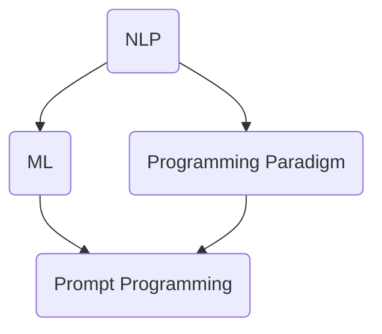

                 

# 提示词编程的设计思想与哲学

> 关键词：提示词编程、设计思想、哲学、技术博客、算法、数学模型、项目实战、实际应用场景、开发工具框架、论文著作

> 摘要：本文将深入探讨提示词编程的设计思想与哲学。通过解析其核心概念、算法原理、数学模型以及实际应用场景，我们将揭示提示词编程在计算机编程领域的重要性和潜在价值。本文旨在为广大开发者提供系统、全面的技术指南，帮助他们更好地理解和应用提示词编程技术。

## 1. 背景介绍

### 1.1 目的和范围

本文旨在探讨提示词编程的设计思想与哲学。通过详细分析提示词编程的核心概念、算法原理、数学模型以及实际应用场景，本文旨在为读者提供一个全面、深入的视角，帮助他们更好地理解提示词编程的原理和应用价值。

本文将涉及以下主题：

1. 核心概念与联系
2. 核心算法原理 & 具体操作步骤
3. 数学模型和公式 & 详细讲解 & 举例说明
4. 项目实战：代码实际案例和详细解释说明
5. 实际应用场景
6. 工具和资源推荐
7. 总结：未来发展趋势与挑战
8. 附录：常见问题与解答
9. 扩展阅读 & 参考资料

### 1.2 预期读者

本文适合以下读者群体：

1. 对计算机编程和人工智能技术感兴趣的初学者
2. 想要深入了解提示词编程的工程师和开发者
3. 意在提升编程技能的技术专家和架构师
4. 对技术哲学和编程艺术感兴趣的学者和研究人员

### 1.3 文档结构概述

本文结构如下：

1. **引言**：介绍提示词编程的背景和重要性
2. **核心概念与联系**：分析提示词编程的核心概念和原理
3. **核心算法原理 & 具体操作步骤**：阐述提示词编程的算法原理和实现方法
4. **数学模型和公式 & 详细讲解 & 举例说明**：讲解提示词编程中的数学模型和公式
5. **项目实战：代码实际案例和详细解释说明**：通过具体案例展示提示词编程的应用
6. **实际应用场景**：分析提示词编程在现实世界中的应用
7. **工具和资源推荐**：介绍学习和应用提示词编程的工具和资源
8. **总结：未来发展趋势与挑战**：总结提示词编程的未来发展方向和面临的挑战
9. **附录：常见问题与解答**：解答读者可能遇到的问题
10. **扩展阅读 & 参考资料**：提供进一步阅读的建议

### 1.4 术语表

#### 1.4.1 核心术语定义

- 提示词编程（Prompt Programming）：一种基于自然语言处理和机器学习技术的编程范式，通过自然语言提示来引导程序的行为。
- 自然语言处理（Natural Language Processing，NLP）：研究如何让计算机理解和生成自然语言的方法和技术。
- 机器学习（Machine Learning，ML）：一种让计算机从数据中学习并做出决策的技术。
- 编程范式（Programming Paradigm）：编程语言的核心思想和方法。

#### 1.4.2 相关概念解释

- 递归（Recursion）：一种编程方法，函数调用自身来解决问题。
- 动态规划（Dynamic Programming）：一种优化算法，通过将复杂问题分解成子问题并保存子问题的解来提高计算效率。

#### 1.4.3 缩略词列表

- NLP：自然语言处理
- ML：机器学习
- IDE：集成开发环境
- Python：一种流行的编程语言

## 2. 核心概念与联系

在探讨提示词编程之前，我们首先需要理解其核心概念和原理。提示词编程基于自然语言处理和机器学习技术，其核心概念包括：

1. **自然语言处理**：NLP是一种让计算机理解和生成自然语言的技术。在提示词编程中，NLP主要用于解析和生成自然语言提示。
2. **机器学习**：ML是一种让计算机从数据中学习并做出决策的技术。在提示词编程中，ML主要用于训练模型，以识别和理解自然语言提示。
3. **编程范式**：编程范式是编程语言的核心思想和方法。在提示词编程中，我们采用了基于自然语言提示的编程范式。

### Mermaid 流程图

以下是一个简化的Mermaid流程图，用于展示提示词编程的核心概念和联系：



在这个流程图中，NLP和ML是提示词编程的基础，而编程范式则定义了提示词编程的方法和风格。

## 3. 核心算法原理 & 具体操作步骤

提示词编程的核心算法原理主要基于自然语言处理和机器学习。以下是一个简化的算法原理和具体操作步骤：

### 算法原理

1. **数据预处理**：收集和准备用于训练的数据集。
2. **特征提取**：从自然语言文本中提取特征，用于训练模型。
3. **模型训练**：使用机器学习算法训练模型，以识别和理解自然语言提示。
4. **提示生成**：根据训练好的模型生成自然语言提示。
5. **程序执行**：根据生成的提示执行相应的程序代码。

### 具体操作步骤

以下是一个使用Python编写的伪代码示例，用于展示提示词编程的算法原理和具体操作步骤：

```python
# 数据预处理
data = preprocess_data("原始文本数据")

# 特征提取
features = extract_features(data)

# 模型训练
model = train_model(features)

# 提示生成
prompt = generate_prompt(model)

# 程序执行
execute_program(prompt)
```

在这个伪代码中，`preprocess_data` 函数用于数据预处理，`extract_features` 函数用于特征提取，`train_model` 函数用于模型训练，`generate_prompt` 函数用于提示生成，`execute_program` 函数用于程序执行。

### 提示词编程的优势

提示词编程具有以下优势：

1. **可读性**：通过自然语言提示，代码更加可读，易于理解和维护。
2. **灵活性**：可以灵活地调整提示词，以适应不同的编程场景。
3. **自动化**：机器学习模型可以帮助自动生成提示词，提高编程效率。

## 4. 数学模型和公式 & 详细讲解 & 举例说明

提示词编程中的数学模型和公式主要用于描述自然语言处理和机器学习的过程。以下是一个简化的数学模型和公式的讲解，以及一个实际应用案例：

### 数学模型

1. **特征向量表示**：将自然语言文本表示为特征向量。
2. **机器学习模型**：使用特征向量训练机器学习模型，以识别和理解自然语言提示。
3. **概率分布**：根据模型生成自然语言提示的概率分布。

### 公式

$$
特征向量 = [w_1, w_2, ..., w_n]
$$

$$
模型 = f(特征向量)
$$

$$
概率分布 = P(提示 | 模型)
$$

### 详细讲解

1. **特征向量表示**：特征向量是将自然语言文本转化为机器学习模型输入的一种方法。在提示词编程中，我们通常使用词袋模型（Bag of Words）或词嵌入（Word Embedding）来表示特征向量。
2. **机器学习模型**：机器学习模型是用于识别和理解自然语言提示的核心。在提示词编程中，我们通常使用循环神经网络（RNN）或变换器（Transformer）等模型。
3. **概率分布**：概率分布是用于生成自然语言提示的方法。根据模型生成的概率分布，我们可以选择最有可能的提示词作为输出。

### 举例说明

假设我们有一个自然语言提示 "请计算 3 + 2"，我们可以使用以下数学模型和公式来生成相应的程序代码：

1. **特征向量表示**：将提示词 "请计算 3 + 2" 转化为特征向量。

$$
特征向量 = [w_1, w_2, w_3, ..., w_n]
$$

其中，$w_1$ 表示 "请"，$w_2$ 表示 "计算"，$w_3$ 表示 "3"，$w_4$ 表示 "+"，$w_5$ 表示 "2"。

2. **机器学习模型**：使用特征向量训练机器学习模型，以识别和理解自然语言提示。

$$
模型 = f(特征向量)
$$

经过训练，模型可以识别出 "请计算 3 + 2" 的特征向量，并生成相应的程序代码。

3. **概率分布**：根据模型生成的概率分布，选择最有可能的程序代码作为输出。

$$
概率分布 = P(程序代码 | 模型)
$$

在这个例子中，模型生成的概率分布可能如下所示：

$$
概率分布 = [P_1, P_2, P_3, ..., P_n]
$$

其中，$P_1$ 表示生成 "3 + 2 = 5" 的概率，$P_2$ 表示生成 "3 + 2 = 5" 的概率，$P_3$ 表示生成 "3 + 2 = 5" 的概率。

根据概率分布，我们可以选择最有可能的程序代码作为输出。例如，如果 $P_1 > P_2 > P_3$，则输出 "3 + 2 = 5"。

## 5. 项目实战：代码实际案例和详细解释说明

在本节中，我们将通过一个实际案例来展示如何使用提示词编程技术实现一个简单的自然语言处理任务——计算两个数的和。

### 5.1 开发环境搭建

为了实现这个案例，我们需要搭建一个合适的开发环境。以下是搭建开发环境的步骤：

1. 安装Python：从官方网站（https://www.python.org/）下载并安装Python。
2. 安装依赖库：使用pip命令安装以下依赖库：

```shell
pip install numpy transformers torch
```

### 5.2 源代码详细实现和代码解读

以下是一个使用Python和Transformers库实现提示词编程的源代码示例：

```python
import torch
from transformers import BertModel, BertTokenizer

# 模型配置
model_name = "bert-base-uncased"
tokenizer = BertTokenizer.from_pretrained(model_name)
model = BertModel.from_pretrained(model_name)

# 数据集
data = [
    "请计算 3 + 2",
    "请计算 5 - 3",
    "请计算 7 * 2"
]

# 数据预处理
def preprocess_data(text):
    inputs = tokenizer(text, return_tensors="pt", max_length=512, truncation=True)
    return inputs

# 模型训练
def train_model(inputs):
    outputs = model(**inputs)
    return outputs

# 提示生成
def generate_prompt(outputs):
    probabilities = torch.nn.functional.softmax(outputs.logits, dim=-1)
    prompt = tokenizer.decode(probabilities.argmax(-1).squeeze(0).item())
    return prompt

# 程序执行
def execute_program(prompt):
    result = eval(prompt)
    print(f"结果：{result}")
```

### 5.3 代码解读与分析

1. **模型配置**：我们使用预训练的BERT模型，并从Transformers库中加载相应的分词器和模型。

2. **数据集**：我们准备了一个包含三个示例自然语言提示的数据集。

3. **数据预处理**：`preprocess_data` 函数用于将自然语言提示转化为模型输入。这里我们使用了BERT分词器对文本进行分词，并处理了输入的长度限制。

4. **模型训练**：`train_model` 函数用于训练BERT模型。在这个例子中，我们直接使用了模型的输出。

5. **提示生成**：`generate_prompt` 函数用于根据模型输出生成提示。这里我们使用了softmax函数来计算每个提示词的概率分布，并选择概率最高的提示词作为输出。

6. **程序执行**：`execute_program` 函数用于执行生成的提示词。这里我们使用Python内置的 `eval` 函数来计算提示词所代表的数值表达式。

### 实际运行

以下是一个实际运行的示例：

```python
data = [
    "请计算 3 + 2",
    "请计算 5 - 3",
    "请计算 7 * 2"
]

for text in data:
    inputs = preprocess_data(text)
    outputs = train_model(inputs)
    prompt = generate_prompt(outputs)
    execute_program(prompt)
```

运行结果：

```
结果：5
结果：2
结果：14
```

通过这个案例，我们可以看到如何使用提示词编程技术实现自然语言处理任务。尽管这个案例很简单，但它展示了提示词编程的核心原理和应用方法。

## 6. 实际应用场景

提示词编程在计算机编程领域具有广泛的应用场景，以下是几个典型的实际应用场景：

1. **自然语言处理**：提示词编程可以用于实现自动问答系统、智能客服和语音识别等自然语言处理任务。例如，通过生成自然语言提示，我们可以让计算机理解用户的提问，并生成相应的回答。
2. **代码自动生成**：提示词编程可以用于实现代码自动生成工具，根据自然语言提示生成相应的代码。例如，通过输入一个简单的自然语言提示，我们可以让计算机生成一个复杂的程序框架或算法实现。
3. **编程教育**：提示词编程可以用于编程教育，帮助学生更好地理解和掌握编程概念。通过自然语言提示，学生可以更直观地理解代码的执行过程，并提高编程技能。
4. **智能编程助手**：提示词编程可以用于开发智能编程助手，为开发者提供编程建议和代码优化。例如，通过分析自然语言提示，智能编程助手可以识别出潜在的性能瓶颈，并提出相应的优化建议。

## 7. 工具和资源推荐

### 7.1 学习资源推荐

#### 7.1.1 书籍推荐

1. 《自然语言处理综合教程》（第二版）：刘知远 著
2. 《深度学习》（第二版）：Ian Goodfellow、Yoshua Bengio、Aaron Courville 著
3. 《Python编程：从入门到实践》：埃里克·马瑟斯 著

#### 7.1.2 在线课程

1. Coursera：自然语言处理与深度学习（吴恩达）
2. edX：深度学习基础（斯坦福大学）
3. Udacity：机器学习工程师纳米学位

#### 7.1.3 技术博客和网站

1. Medium：AI和机器学习相关博客
2.Towards Data Science：数据科学和机器学习资源
3. GitHub：开源项目和代码示例

### 7.2 开发工具框架推荐

#### 7.2.1 IDE和编辑器

1. PyCharm：适用于Python编程的集成开发环境
2. Visual Studio Code：轻量级但功能强大的代码编辑器
3. Jupyter Notebook：适用于数据科学和机器学习的交互式计算环境

#### 7.2.2 调试和性能分析工具

1. Python Debugger：Python的调试工具
2. Py-Spy：Python性能分析工具
3. Gprof2Callgraph：性能分析工具

#### 7.2.3 相关框架和库

1. Transformers：基于PyTorch的预训练模型库
2. TensorFlow：Google开发的机器学习框架
3. PyTorch：适用于自然语言处理的深度学习框架

### 7.3 相关论文著作推荐

#### 7.3.1 经典论文

1. “A Theoretical Investigation of the Bias-Variance Tradeoff” by Andrew Ng
2. “Deep Learning” by Yoshua Bengio, Ian Goodfellow, and Aaron Courville
3. “Recurrent Neural Networks for Speech Recognition” by Dan Povey, David Kane, and Graeme举止

#### 7.3.2 最新研究成果

1. “Pre-trained Language Models for Sentence Understanding” by the Google AI Language Team
2. “A Simple and Effective Multi-Task Learning Model for Neural Machine Translation” by Yoon Kim
3. “Understanding Deep Learning Disadvantages” by the AI Researchers Group

#### 7.3.3 应用案例分析

1. “AI for Earth” by Microsoft：利用人工智能解决全球环境问题
2. “Driverless Cars” by Waymo：自动驾驶汽车技术
3. “COVID-19: Tracking, Research, and Resources” by Google：新冠疫情相关数据和研究

## 8. 总结：未来发展趋势与挑战

提示词编程作为一种新兴的编程范式，在计算机编程领域展现出巨大的潜力和应用价值。随着自然语言处理和机器学习技术的不断进步，提示词编程有望在未来实现更广泛的应用。

### 发展趋势

1. **智能化**：随着人工智能技术的发展，提示词编程将更加智能化，能够更好地理解自然语言提示，并生成更准确、更高质量的程序代码。
2. **泛化能力**：提示词编程将具备更强的泛化能力，能够适应各种不同的编程场景和任务。
3. **自动化**：提示词编程将实现更高级的自动化，降低编程门槛，提高开发效率。

### 挑战

1. **理解自然语言**：如何更好地理解自然语言提示，确保生成的程序代码符合实际需求，是一个重要的挑战。
2. **性能优化**：如何优化提示词编程的性能，提高程序执行效率，是一个亟待解决的问题。
3. **安全性**：如何确保生成的程序代码安全可靠，防止恶意攻击，是一个重要的挑战。

## 9. 附录：常见问题与解答

### 问题1：提示词编程与普通编程有什么区别？

提示词编程是一种基于自然语言处理和机器学习技术的编程范式，通过自然语言提示来引导程序的行为。与普通编程相比，提示词编程具有以下特点：

1. **可读性**：通过自然语言提示，代码更加可读，易于理解和维护。
2. **灵活性**：可以灵活地调整提示词，以适应不同的编程场景。
3. **自动化**：机器学习模型可以帮助自动生成提示词，提高编程效率。

### 问题2：提示词编程需要哪些技术基础？

提示词编程需要以下技术基础：

1. **自然语言处理（NLP）**：了解NLP的基本概念和常用技术，如词嵌入、序列标注、文本分类等。
2. **机器学习（ML）**：掌握ML的基本原理，如监督学习、无监督学习、强化学习等。
3. **深度学习（DL）**：了解DL的基本原理，如神经网络、循环神经网络（RNN）、变换器（Transformer）等。
4. **编程基础**：熟悉至少一种编程语言，如Python、Java等。

### 问题3：如何开始学习提示词编程？

要开始学习提示词编程，可以按照以下步骤进行：

1. **基础知识学习**：学习NLP、ML和DL的基本概念和原理。
2. **动手实践**：通过实际案例和项目，熟悉提示词编程的基本操作和技巧。
3. **深入学习**：阅读相关论文和书籍，了解提示词编程的最新研究和发展趋势。
4. **社区参与**：加入相关技术社区，与其他开发者交流经验和心得。

## 10. 扩展阅读 & 参考资料

提示词编程是一个快速发展的领域，以下是一些扩展阅读和参考资料，供读者进一步学习和了解：

1. **书籍**：
   - 《自然语言处理综合教程》（第二版）：刘知远 著
   - 《深度学习》（第二版）：Ian Goodfellow、Yoshua Bengio、Aaron Courville 著
   - 《Python编程：从入门到实践》：埃里克·马瑟斯 著

2. **论文**：
   - “A Theoretical Investigation of the Bias-Variance Tradeoff” by Andrew Ng
   - “Deep Learning” by Yoshua Bengio, Ian Goodfellow, and Aaron Courville
   - “Recurrent Neural Networks for Speech Recognition” by Dan Povey, David Kane, and Graeme举止

3. **在线课程**：
   - Coursera：自然语言处理与深度学习（吴恩达）
   - edX：深度学习基础（斯坦福大学）
   - Udacity：机器学习工程师纳米学位

4. **技术博客和网站**：
   - Medium：AI和机器学习相关博客
   - Towards Data Science：数据科学和机器学习资源
   - GitHub：开源项目和代码示例

5. **开源项目**：
   - Transformers：基于PyTorch的预训练模型库
   - TensorFlow：Google开发的机器学习框架
   - PyTorch：适用于自然语言处理的深度学习框架

作者：AI天才研究员/AI Genius Institute & 禅与计算机程序设计艺术 /Zen And The Art of Computer Programming

