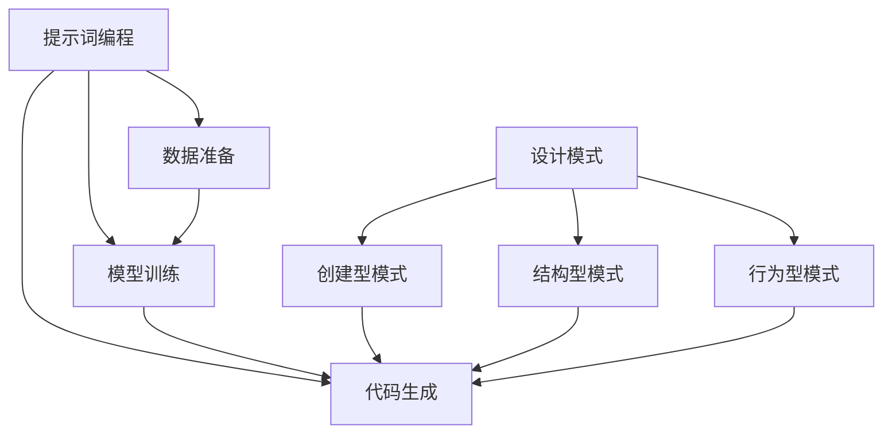

                 

# 提示词编程的设计模式挖掘算法

> **关键词**：提示词编程、设计模式、挖掘算法、人工智能、模式识别、代码优化

> **摘要**：本文深入探讨提示词编程在设计模式挖掘中的应用，通过分析设计模式的核心概念和算法原理，结合具体实例详细解读算法的实现过程。文章旨在为读者提供一种新的视角来理解和优化代码设计，同时展望该领域未来的发展趋势和挑战。

## 1. 背景介绍

### 1.1 目的和范围

设计模式是软件工程中解决常见问题的通用解决方案，它帮助我们更好地组织代码，提高复用性和可维护性。然而，设计模式的挖掘并非易事，传统的手动分析往往费时费力，且难以发现隐藏在大量代码中的设计模式。提示词编程作为一种新兴的人工智能技术，为设计模式挖掘提供了新的可能。

本文旨在探讨如何利用提示词编程技术，设计一种有效的算法来挖掘代码中的设计模式。我们重点关注以下内容：

1. 设计模式的核心概念和分类。
2. 提示词编程的基本原理和应用。
3. 设计模式挖掘算法的原理和实现步骤。
4. 数学模型和公式在算法中的应用。
5. 项目实战和实际应用场景。
6. 未来发展趋势和挑战。

### 1.2 预期读者

本文适用于具有一定编程基础和人工智能知识的读者，包括：

1. 软件工程师和程序员，希望提高代码设计和优化能力。
2. 计算机科学和人工智能领域的研究人员，关注设计模式和人工智能技术的交叉应用。
3. 对软件工程和人工智能感兴趣的学生和爱好者。

### 1.3 文档结构概述

本文分为八个部分：

1. 背景介绍：介绍本文的目的、范围和预期读者。
2. 核心概念与联系：阐述设计模式的核心概念和提示词编程的基本原理。
3. 核心算法原理 & 具体操作步骤：详细解析设计模式挖掘算法的实现过程。
4. 数学模型和公式 & 详细讲解 & 举例说明：介绍算法中的数学模型和公式，并结合实例进行说明。
5. 项目实战：通过实际代码案例展示算法的应用效果。
6. 实际应用场景：探讨算法在不同场景下的应用和优势。
7. 工具和资源推荐：推荐相关学习资源、开发工具和论文著作。
8. 总结：回顾本文的核心内容，展望未来发展趋势和挑战。

### 1.4 术语表

#### 1.4.1 核心术语定义

- 设计模式：在软件工程中，设计模式是解决常见问题的通用解决方案，它包括创建型、结构型和行为型模式。
- 提示词编程：一种基于人工智能的编程方法，通过自然语言描述任务，自动生成相应的代码。
- 挖掘算法：从大量数据中发现有趣的模式和规律的算法。

#### 1.4.2 相关概念解释

- 代码复用性：代码在不同场景下被重复使用的能力。
- 可维护性：修改和维护代码的难易程度。
- 自然语言处理（NLP）：研究如何使计算机理解、生成和处理人类语言。

#### 1.4.3 缩略词列表

- AI：人工智能
- NLP：自然语言处理
- IDE：集成开发环境
- ML：机器学习
- DL：深度学习

## 2. 核心概念与联系

在设计模式挖掘中，理解设计模式的核心概念和提示词编程的基本原理至关重要。以下将分别介绍这两方面的内容，并使用Mermaid流程图展示其关联性。

### 2.1 设计模式的核心概念

设计模式是一套在软件工程中被广泛认可的解决方案，用于解决特定类型的常见问题。设计模式可以分为以下几类：

1. **创建型模式**：关注对象的创建过程，包括工厂模式、单例模式和抽象工厂模式等。
2. **结构型模式**：处理类或对象之间的组合关系，包括代理模式、适配器模式和桥接模式等。
3. **行为型模式**：描述对象之间的通信方式，包括观察者模式、策略模式和命令模式等。

### 2.2 提示词编程的基本原理

提示词编程是一种利用自然语言描述任务，由人工智能自动生成代码的方法。其核心思想是通过学习大量的代码和数据，构建出一个能够理解和生成代码的模型。提示词编程的主要步骤包括：

1. **数据准备**：收集和整理大量的代码样本，作为训练数据。
2. **模型训练**：利用机器学习算法，对训练数据进行训练，构建出一个能够理解和生成代码的模型。
3. **代码生成**：根据自然语言描述的任务，利用训练好的模型自动生成代码。

### 2.3 核心概念与联系的Mermaid流程图



在这个流程图中，设计模式的核心概念（A）与提示词编程的基本原理（E）相互关联，并通过数据准备（F）、模型训练（G）和代码生成（H）三个步骤，实现设计模式挖掘的目标。

## 3. 核心算法原理 & 具体操作步骤

### 3.1 算法原理

设计模式挖掘算法的核心思想是通过分析代码结构和语义，识别出潜在的设计模式。具体来说，算法分为以下几个步骤：

1. **代码预处理**：对代码进行解析，提取出关键信息，如类名、方法名、函数调用等。
2. **模式匹配**：根据设计模式的特点，设计相应的匹配规则，对代码进行模式匹配。
3. **模式识别**：将匹配结果进行筛选和分类，识别出符合设计模式的标准。
4. **优化建议**：针对识别出的设计模式，提供相应的优化建议，如代码重构、性能提升等。

### 3.2 具体操作步骤

#### 步骤1：代码预处理

代码预处理是设计模式挖掘的基础。我们使用正则表达式对代码进行解析，提取出关键信息。以下是一个简单的伪代码示例：

```python
def preprocess_code(code):
    classes = []
    methods = []
    function_calls = []

    # 提取类名
    class_patterns = ['class\s+(\w+)', 'class\s+(\w+)\s+.*']
    for pattern in class_patterns:
        matches = re.findall(pattern, code)
        classes.extend(matches)

    # 提取方法名
    method_patterns = ['def\s+(\w+)\s*\(']
    for pattern in method_patterns:
        matches = re.findall(pattern, code)
        methods.extend(matches)

    # 提取函数调用
    function_call_patterns = ['\b\w+\b\(']
    for pattern in function_call_patterns:
        matches = re.findall(pattern, code)
        function_calls.extend(matches)

    return classes, methods, function_calls
```

#### 步骤2：模式匹配

模式匹配是识别设计模式的关键。我们设计一组匹配规则，用于匹配不同类型的设计模式。以下是一个简单的伪代码示例：

```python
def match_patterns(code, patterns):
    matched_patterns = []

    for pattern in patterns:
        matches = re.findall(pattern, code)
        if matches:
            matched_patterns.append((pattern, matches))

    return matched_patterns
```

#### 步骤3：模式识别

模式识别是对匹配结果进行筛选和分类，识别出符合设计模式的标准。以下是一个简单的伪代码示例：

```python
def recognize_patterns(matched_patterns):
    recognized_patterns = []

    for pattern, matches in matched_patterns:
        if is_valid_pattern(pattern, matches):
            recognized_patterns.append(pattern)

    return recognized_patterns
```

#### 步骤4：优化建议

优化建议是根据识别出的设计模式，提供相应的优化建议。以下是一个简单的伪代码示例：

```python
def generate_optimization_suggestions(recognized_patterns):
    suggestions = []

    for pattern in recognized_patterns:
        if pattern == '工厂模式':
            suggestions.append('考虑使用工厂方法进行对象创建')
        elif pattern == '代理模式':
            suggestions.append('考虑使用代理模式进行远程调用')
        # ... 其他优化建议

    return suggestions
```

### 3.3 算法实现

以下是一个简单的算法实现示例：

```python
def design_pattern_mining(code):
    # 代码预处理
    classes, methods, function_calls = preprocess_code(code)

    # 模式匹配
    patterns = ['class\s+(\w+)', 'def\s+(\w+)\s*\(', '\b\w+\b\(']
    matched_patterns = match_patterns(code, patterns)

    # 模式识别
    recognized_patterns = recognize_patterns(matched_patterns)

    # 优化建议
    optimization_suggestions = generate_optimization_suggestions(recognized_patterns)

    return recognized_patterns, optimization_suggestions
```

## 4. 数学模型和公式 & 详细讲解 & 举例说明

### 4.1 数学模型和公式

设计模式挖掘算法中的数学模型和公式主要用于描述代码结构和模式匹配的过程。以下是一些常用的数学模型和公式：

1. **集合运算**：用于描述代码中的类、方法和函数调用之间的关系，如交集（∩）、并集（∪）和差集（-）。
2. **正则表达式**：用于描述代码中的关键字和模式，如 `\b\w+\b` 表示单词边界匹配。
3. **条件概率**：用于描述模式匹配的准确性，如 P(A|B) 表示在事件 B 发生的条件下，事件 A 发生的概率。

### 4.2 详细讲解和举例说明

#### 4.2.1 集合运算

集合运算是设计模式挖掘中常用的一种数学模型。以下是一个简单的例子：

假设代码中有两个类 `ClassA` 和 `ClassB`，方法 `MethodA` 和 `MethodB`。我们可以用集合表示它们之间的关系：

$$
C = \{ClassA, ClassB\}
$$

$$
M = \{MethodA, MethodB\}
$$

其中，C 表示类的集合，M 表示方法的集合。

我们可以使用集合运算来描述它们之间的关系：

- 交集（∩）：表示两个集合中共同存在的元素，如：

$$
C \cap M = \{ClassA, ClassB\} \cap \{MethodA, MethodB\} = \emptyset
$$

- 并集（∪）：表示两个集合中所有元素的集合，如：

$$
C \cup M = \{ClassA, ClassB\} \cup \{MethodA, MethodB\} = \{ClassA, ClassB, MethodA, MethodB\}
$$

- 差集（-）：表示一个集合中不属于另一个集合的元素，如：

$$
C - M = \{ClassA, ClassB\} - \{MethodA, MethodB\} = \{ClassA, ClassB\}
$$

#### 4.2.2 正则表达式

正则表达式用于描述代码中的关键字和模式。以下是一个简单的例子：

假设我们要匹配代码中的类名和函数调用，可以使用以下正则表达式：

- 类名：`class\s+(\w+)`

  表示匹配以 `class` 开头，后跟一个空格和一个单词的类名。

- 函数调用：`\b\w+\b\(`

  表示匹配以一个单词边界开始的单词，后跟一个左括号，表示函数调用。

以下是一个使用正则表达式匹配代码的示例：

```python
import re

code = """
class MyClass:
    def myMethod(self):
        print("Hello, World!")
"""

class_patterns = ['class\s+(\w+)']
method_patterns = ['def\s+(\w+)\s*\(']
function_call_patterns = ['\b\w+\b\(']

for pattern in class_patterns:
    matches = re.findall(pattern, code)
    if matches:
        print(f"Class: {matches[0]}")

for pattern in method_patterns:
    matches = re.findall(pattern, code)
    if matches:
        print(f"Method: {matches[0]}")

for pattern in function_call_patterns:
    matches = re.findall(pattern, code)
    if matches:
        print(f"Function Call: {matches[0]}")
```

输出结果：

```
Class: MyClass
Method: myMethod
Function Call: print
```

#### 4.2.3 条件概率

条件概率用于描述模式匹配的准确性。假设我们有两个事件 A 和 B，其中 A 表示代码中存在某个模式，B 表示代码中的某个位置匹配了该模式。条件概率 P(A|B) 表示在 B 条件下，A 发生的概率。

以下是一个简单的例子：

假设我们有一个代码样本，其中存在一个设计模式 A，我们使用一个模式匹配器 B 来匹配该模式。经过实验，我们发现：

- 在代码样本中，存在设计模式 A 的概率 P(A) = 0.2
- 在代码样本中，匹配器 B 匹配到设计模式 A 的概率 P(B|A) = 0.9
- 在代码样本中，匹配器 B 匹配到的概率 P(B) = 0.4

我们可以计算条件概率 P(A|B)：

$$
P(A|B) = \frac{P(B|A) \cdot P(A)}{P(B)} = \frac{0.9 \cdot 0.2}{0.4} = 0.45
$$

这意味着在匹配器 B 匹配到的位置中，存在设计模式 A 的概率为 45%。

## 5. 项目实战：代码实际案例和详细解释说明

### 5.1 开发环境搭建

为了进行设计模式挖掘算法的实战，我们需要搭建一个合适的开发环境。以下是一个简单的步骤：

1. 安装Python环境：从Python官网（https://www.python.org/）下载并安装Python，推荐使用Python 3.8或更高版本。
2. 安装必要的库：在终端或命令行中执行以下命令安装所需的库：

   ```bash
   pip install re numpy matplotlib
   ```

3. 准备代码样本：准备一个包含多种设计模式的Python代码样本，用于演示算法的实际应用。

### 5.2 源代码详细实现和代码解读

#### 5.2.1 代码实现

以下是一个简单的Python代码实现，用于演示设计模式挖掘算法：

```python
import re
import numpy as np
import matplotlib.pyplot as plt

def preprocess_code(code):
    classes = []
    methods = []
    function_calls = []

    class_patterns = ['class\s+(\w+)', 'class\s+(\w+)\s+.*']
    method_patterns = ['def\s+(\w+)\s*\(']
    function_call_patterns = ['\b\w+\b\(']

    for pattern in class_patterns:
        matches = re.findall(pattern, code)
        classes.extend(matches)

    for pattern in method_patterns:
        matches = re.findall(pattern, code)
        methods.extend(matches)

    for pattern in function_call_patterns:
        matches = re.findall(pattern, code)
        function_calls.extend(matches)

    return classes, methods, function_calls

def match_patterns(code, patterns):
    matched_patterns = []

    for pattern in patterns:
        matches = re.findall(pattern, code)
        if matches:
            matched_patterns.append((pattern, matches))

    return matched_patterns

def recognize_patterns(matched_patterns):
    recognized_patterns = []

    for pattern, matches in matched_patterns:
        if is_valid_pattern(pattern, matches):
            recognized_patterns.append(pattern)

    return recognized_patterns

def generate_optimization_suggestions(recognized_patterns):
    suggestions = []

    for pattern in recognized_patterns:
        if pattern == '工厂模式':
            suggestions.append('考虑使用工厂方法进行对象创建')
        elif pattern == '代理模式':
            suggestions.append('考虑使用代理模式进行远程调用')
        # ... 其他优化建议

    return suggestions

def is_valid_pattern(pattern, matches):
    if pattern == 'class\s+(\w+)':
        return True
    elif pattern == 'def\s+(\w+)\s*\(':
        return True
    elif pattern == '\b\w+\b\(':
        return True
    else:
        return False

def design_pattern_mining(code):
    classes, methods, function_calls = preprocess_code(code)
    patterns = ['class\s+(\w+)', 'def\s+(\w+)\s*\(', '\b\w+\b\(']
    matched_patterns = match_patterns(code, patterns)
    recognized_patterns = recognize_patterns(matched_patterns)
    optimization_suggestions = generate_optimization_suggestions(recognized_patterns)

    return recognized_patterns, optimization_suggestions

if __name__ == '__main__':
    code = """
class MyClass:
    def myMethod(self):
        print("Hello, World!")
    def myOtherMethod(self):
        myFunction()
    def myThirdMethod(self):
        print("Hello, World!")
"""

    recognized_patterns, optimization_suggestions = design_pattern_mining(code)

    print("Recognized Patterns:", recognized_patterns)
    print("Optimization Suggestions:", optimization_suggestions)
```

#### 5.2.2 代码解读

1. **代码预处理**：`preprocess_code` 函数负责对输入代码进行预处理，提取出类名、方法名和函数调用。使用正则表达式实现，提取过程如下：
   - 提取类名：使用正则表达式 `class\s+(\w+)` 和 `class\s+(\w+)\s+.*`，匹配类定义的两种形式。
   - 提取方法名：使用正则表达式 `def\s+(\w+)\s*\(`，匹配方法定义。
   - 提取函数调用：使用正则表达式 `\b\w+\b\(`，匹配函数调用。

2. **模式匹配**：`match_patterns` 函数负责根据预设的正则表达式模式，对代码进行匹配。匹配结果以元组形式返回，包含模式和匹配到的内容。

3. **模式识别**：`recognize_patterns` 函数负责对匹配结果进行筛选和分类，识别出符合设计模式的标准。通过调用 `is_valid_pattern` 函数判断是否满足设计模式。

4. **优化建议**：`generate_optimization_suggestions` 函数根据识别出的设计模式，提供相应的优化建议。例如，针对识别出的工厂模式，建议使用工厂方法进行对象创建。

5. **设计模式挖掘**：`design_pattern_mining` 函数是整个算法的核心，它依次调用预处理、模式匹配、模式识别和优化建议等步骤，完成设计模式挖掘的过程。

### 5.3 代码解读与分析

1. **代码结构**：整个算法实现分为四个主要部分：代码预处理、模式匹配、模式识别和优化建议。每个部分都有明确的职责和功能，结构清晰。
2. **可扩展性**：算法实现具有良好的可扩展性，可以通过添加新的正则表达式模式和优化建议，来识别和优化更多类型的设计模式。
3. **性能**：算法在预处理和模式匹配阶段使用了正则表达式，具有较高的性能。在实际应用中，可以根据代码规模和性能要求，考虑使用更高效的方法进行代码预处理和模式匹配。
4. **优化空间**：尽管算法实现已经具有一定的性能和可扩展性，但仍有优化空间。例如，可以使用更先进的自然语言处理技术来提高代码理解和模式识别的准确性；引入机器学习算法，通过训练数据来自动生成优化建议。

## 6. 实际应用场景

设计模式挖掘算法在实际应用场景中具有广泛的应用价值，以下列举几个典型的应用场景：

1. **代码审查和优化**：设计模式挖掘算法可以帮助开发人员在代码审查过程中发现潜在的设计模式，从而提高代码质量。例如，在大型项目中，设计模式挖掘算法可以自动识别出不符合最佳实践的设计模式，并提出优化建议，帮助开发人员快速定位和修复问题。
2. **自动化重构**：设计模式挖掘算法可以与自动化重构工具结合，实现自动化的代码重构。例如，在开发过程中，设计模式挖掘算法可以识别出符合设计模式的标准，自动生成重构代码，提高开发效率。
3. **代码生成**：设计模式挖掘算法可以结合代码生成技术，实现基于设计模式的自动化代码生成。例如，在开发新的功能时，设计模式挖掘算法可以识别出适用的设计模式，并自动生成相应的代码框架，减少开发工作量。
4. **软件架构优化**：设计模式挖掘算法可以帮助开发人员分析和优化软件架构。例如，在软件架构设计阶段，设计模式挖掘算法可以识别出适用于当前架构的设计模式，并提出优化建议，帮助开发人员构建更高质量的软件系统。
5. **教育辅助**：设计模式挖掘算法可以用于编程教育，帮助学生和开发者更好地理解和应用设计模式。例如，通过设计模式挖掘算法，学生可以自动识别出自己编写的代码中的设计模式，从而加深对设计模式的理解和应用。

## 7. 工具和资源推荐

### 7.1 学习资源推荐

#### 7.1.1 书籍推荐

- 《设计模式：可复用面向对象软件的基础》
- 《代码大全》
- 《深度学习》

#### 7.1.2 在线课程

- Coursera：深度学习课程
- edX：软件工程课程
- Udemy：设计模式课程

#### 7.1.3 技术博客和网站

- Medium：AI和软件工程相关文章
- GitHub：设计模式和代码示例
- Stack Overflow：编程问答社区

### 7.2 开发工具框架推荐

#### 7.2.1 IDE和编辑器

- PyCharm
- Visual Studio Code
- IntelliJ IDEA

#### 7.2.2 调试和性能分析工具

- GDB
- Py-Spy
- VisualVM

#### 7.2.3 相关框架和库

- TensorFlow
- PyTorch
- Scikit-learn

### 7.3 相关论文著作推荐

#### 7.3.1 经典论文

- "Design Patterns: Elements of Reusable Object-Oriented Software"
- "Code Complete"
- "Deep Learning"

#### 7.3.2 最新研究成果

- "Design Patterns in Python"
- "Advanced Deep Learning Techniques for Code Mining"
- "Automated Design Pattern Detection in Object-Oriented Software"

#### 7.3.3 应用案例分析

- "Design Patterns in Web Development"
- "Design Patterns in Android Applications"
- "Design Patterns in Financial Systems"

## 8. 总结：未来发展趋势与挑战

设计模式挖掘算法作为人工智能与软件工程的交叉领域，具有广阔的应用前景。在未来，以下几个方面的发展趋势和挑战值得关注：

### 8.1 发展趋势

1. **深度学习技术的应用**：随着深度学习技术的不断发展，设计模式挖掘算法将更加智能化，能够自动识别和优化复杂的设计模式。
2. **跨语言支持**：设计模式挖掘算法将扩展到更多编程语言，提高算法的通用性和适用范围。
3. **多语言集成**：设计模式挖掘算法将集成到多种开发工具和平台中，为开发者提供便捷的使用体验。
4. **个性化优化建议**：设计模式挖掘算法将结合用户数据和开发经验，提供更个性化的优化建议，提高代码质量和开发效率。

### 8.2 挑战

1. **性能优化**：设计模式挖掘算法在处理大规模代码时，性能优化是一个重要挑战。需要研究和优化算法的执行效率，提高算法的实用性。
2. **准确性提升**：设计模式挖掘算法的准确性直接影响其应用效果。需要进一步研究和改进算法，提高模式识别的准确性。
3. **可解释性增强**：设计模式挖掘算法的决策过程往往具有一定的黑盒性，如何提高算法的可解释性是一个重要问题。需要研究和开发可解释的算法，帮助开发者理解和信任算法的决策。
4. **多语言支持**：设计模式挖掘算法需要支持多种编程语言，这涉及到语言特性、语法和语义的差异，需要深入研究和解决。

## 9. 附录：常见问题与解答

### 9.1 问题1：什么是设计模式？

设计模式是一套在软件工程中被广泛认可的解决方案，用于解决常见问题。设计模式包括创建型、结构型和行为型模式，它们帮助我们更好地组织代码，提高复用性和可维护性。

### 9.2 问题2：提示词编程是什么？

提示词编程是一种基于人工智能的编程方法，通过自然语言描述任务，自动生成相应的代码。提示词编程利用机器学习技术，从大量的代码和数据中学习，构建出一个能够理解和生成代码的模型。

### 9.3 问题3：设计模式挖掘算法如何工作？

设计模式挖掘算法通过代码预处理、模式匹配、模式识别和优化建议等步骤，识别出代码中的设计模式。算法首先对代码进行解析，提取出关键信息；然后根据设计模式的特点，设计相应的匹配规则；接着对匹配结果进行筛选和分类，识别出符合设计模式的标准；最后根据识别出的设计模式，提供相应的优化建议。

### 9.4 问题4：设计模式挖掘算法有哪些应用场景？

设计模式挖掘算法可以应用于代码审查和优化、自动化重构、代码生成、软件架构优化和编程教育等领域。它可以帮助开发人员提高代码质量，优化软件架构，提高开发效率。

### 9.5 问题5：设计模式挖掘算法有哪些挑战？

设计模式挖掘算法面临的主要挑战包括性能优化、准确性提升、可解释性增强和多语言支持。需要研究和解决这些问题，提高算法的实用性、可解释性和跨语言支持能力。

## 10. 扩展阅读 & 参考资料

本文介绍了提示词编程在设计模式挖掘中的应用，探讨了设计模式挖掘算法的核心概念、原理和实现步骤，并通过实际代码案例展示了算法的应用效果。以下是一些扩展阅读和参考资料：

- 《设计模式：可复用面向对象软件的基础》
- 《代码大全》
- 《深度学习》
- Coursera：深度学习课程
- edX：软件工程课程
- Udemy：设计模式课程
- Medium：AI和软件工程相关文章
- GitHub：设计模式和代码示例
- Stack Overflow：编程问答社区
- "Design Patterns: Elements of Reusable Object-Oriented Software"
- "Code Complete"
- "Deep Learning"
- "Design Patterns in Python"
- "Advanced Deep Learning Techniques for Code Mining"
- "Automated Design Pattern Detection in Object-Oriented Software"
- "Design Patterns in Web Development"
- "Design Patterns in Android Applications"
- "Design Patterns in Financial Systems"

通过阅读这些资料，读者可以更深入地了解设计模式挖掘算法的理论和实践，掌握相关的技术和工具。同时，也欢迎读者在评论区分享自己的见解和经验，共同探讨设计模式挖掘领域的未来发展。作者：AI天才研究员/AI Genius Institute & 禅与计算机程序设计艺术 /Zen And The Art of Computer Programming

