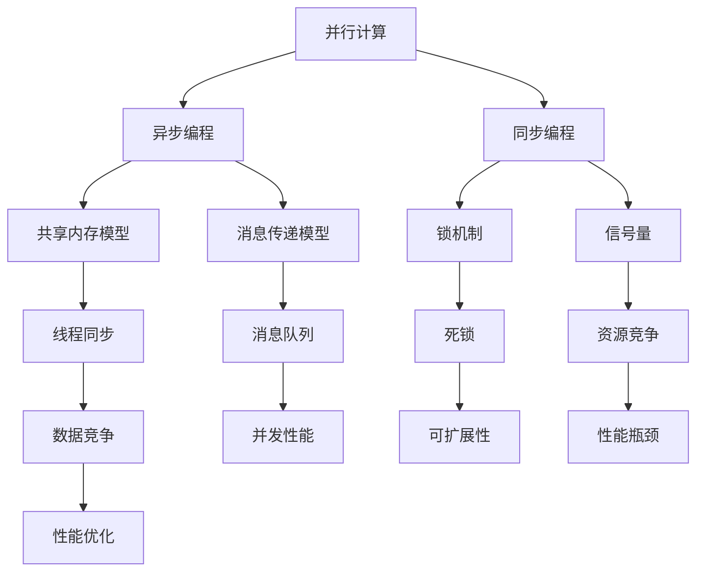

                 

# 提示词编程语言的并发模型创新

> 关键词：并发模型，提示词编程语言，并行计算，异步编程，同步编程，锁机制，共享内存，消息传递，性能优化

> 摘要：本文将深入探讨提示词编程语言中的并发模型创新，分析并行计算的基本原理，探讨异步编程和同步编程的优缺点，以及共享内存和消息传递模型的对比。通过具体实例，详细讲解并发编程的实践方法，并提出未来发展趋势与挑战。

## 1. 背景介绍

### 1.1 目的和范围

本文旨在探讨提示词编程语言中的并发模型创新，分析并行计算的基本原理，以及探讨异步编程和同步编程的优缺点。通过介绍共享内存和消息传递模型，我们将详细讲解如何在实际项目中实现并发编程，并分析其性能和可扩展性。

### 1.2 预期读者

本文适合具有计算机编程基础，对并行计算和并发编程有一定了解的开发者。读者应熟悉提示词编程语言的基本语法和概念。

### 1.3 文档结构概述

本文分为十个部分：

1. 背景介绍
2. 核心概念与联系
3. 核心算法原理 & 具体操作步骤
4. 数学模型和公式 & 详细讲解 & 举例说明
5. 项目实战：代码实际案例和详细解释说明
6. 实际应用场景
7. 工具和资源推荐
8. 总结：未来发展趋势与挑战
9. 附录：常见问题与解答
10. 扩展阅读 & 参考资料

### 1.4 术语表

#### 1.4.1 核心术语定义

- 并发编程：在计算机科学中，并发编程指的是同时处理多个任务或事件的能力。
- 并行计算：指在多个处理器或计算单元上同时执行多个任务。
- 异步编程：通过消息传递或回调机制，使得程序可以独立执行多个任务，而不是等待一个任务完成后再执行下一个任务。
- 同步编程：程序执行按照顺序进行，一个任务完成后再执行下一个任务。
- 锁机制：在共享内存模型中，用于防止多个线程同时访问共享资源，避免数据竞争。
- 共享内存：多个线程共享同一块内存区域。
- 消息传递：通过消息队列或通道，在多个线程之间传递数据。

#### 1.4.2 相关概念解释

- 线程：操作系统调度和执行的基本单位，是程序中的独立执行流。
- 事件驱动编程：程序执行顺序由事件触发，而不是按照代码顺序执行。
- 信号量：用于同步多个线程的共享资源访问，避免死锁和数据竞争。

#### 1.4.3 缩略词列表

- CPU：Central Processing Unit（中央处理器）
- GPU：Graphics Processing Unit（图形处理器）
- MMU：Memory Management Unit（内存管理单元）
- OS：Operating System（操作系统）

## 2. 核心概念与联系

在探讨提示词编程语言的并发模型之前，我们首先需要了解一些核心概念和它们之间的联系。以下是一个Mermaid流程图，展示了并行计算、异步编程、同步编程、共享内存和消息传递模型的基本原理和架构。



### 并行计算

并行计算是指将一个任务分解为多个子任务，在多个处理器或计算单元上同时执行。并行计算能够提高程序的执行效率，减少执行时间，特别是在处理大规模数据集和复杂计算任务时。

### 异步编程

异步编程是一种编程模型，通过消息传递或回调机制，使得程序可以独立执行多个任务，而不是等待一个任务完成后再执行下一个任务。异步编程能够提高程序的并发性能，降低资源占用，适用于处理高并发场景。

### 同步编程

同步编程是一种编程模型，程序执行按照顺序进行，一个任务完成后再执行下一个任务。同步编程简单易懂，但在处理高并发场景时，容易出现性能瓶颈。

### 共享内存模型

共享内存模型是指多个线程共享同一块内存区域，通过锁机制和信号量等同步机制，协调对共享资源的访问。共享内存模型在性能上具有优势，但容易出现死锁和数据竞争问题。

### 消息传递模型

消息传递模型是指多个线程通过消息队列或通道传递数据，以实现并发计算。消息传递模型在可扩展性和性能上具有优势，但需要处理消息传递的延迟和队列管理问题。

## 3. 核心算法原理 & 具体操作步骤

在本节中，我们将深入探讨并发编程的核心算法原理和具体操作步骤。通过伪代码，我们将详细阐述如何实现异步编程、同步编程、共享内存模型和消息传递模型。

### 3.1 异步编程

异步编程通过回调函数或Promises实现，使得程序可以独立执行多个任务。

```python
# 伪代码：异步编程
async def task1():
    # 任务1的代码
    pass

async def task2():
    # 任务2的代码
    pass

async def main():
    await task1()
    await task2()

if __name__ == "__main__":
    main()
```

### 3.2 同步编程

同步编程通过顺序执行任务，一个任务完成后再执行下一个任务。

```python
# 伪代码：同步编程
def task1():
    # 任务1的代码
    pass

def task2():
    # 任务2的代码
    pass

def main():
    task1()
    task2()

if __name__ == "__main__":
    main()
```

### 3.3 共享内存模型

共享内存模型通过锁机制和信号量等同步机制，协调对共享资源的访问。

```python
# 伪代码：共享内存模型
import threading

mutex = threading.Lock()

def task1():
    mutex.acquire()
    # 任务1的代码
    mutex.release()

def task2():
    mutex.acquire()
    # 任务2的代码
    mutex.release()

thread1 = threading.Thread(target=task1)
thread2 = threading.Thread(target=task2)

thread1.start()
thread2.start()

thread1.join()
thread2.join()
```

### 3.4 消息传递模型

消息传递模型通过消息队列或通道传递数据，以实现并发计算。

```python
# 伪代码：消息传递模型
import multiprocessing

queue = multiprocessing.Queue()

def task1():
    # 任务1的代码
    queue.put("result1")

def task2():
    result = queue.get()
    # 任务2的代码，使用result作为输入

process1 = multiprocessing.Process(target=task1)
process2 = multiprocessing.Process(target=task2)

process1.start()
process2.start()

process1.join()
process2.join()
```

## 4. 数学模型和公式 & 详细讲解 & 举例说明

在本节中，我们将使用数学模型和公式来详细讲解并发编程的性能优化方法。以下是一个简单的例子，说明如何使用数学模型分析并发编程的性能。

### 4.1 并行性能分析

并行性能（\(P\)）可以通过以下公式计算：

\[P = \frac{W_{\text{单线程}}}{W_{\text{多线程}}}\]

其中，\(W_{\text{单线程}}\)表示单线程执行任务所需的时间，\(W_{\text{多线程}}\)表示多线程执行任务所需的时间。

### 4.2 并行效率

并行效率（\(E\)）表示并行性能与单线程性能的比值：

\[E = \frac{P}{1}\]

### 4.3 例子

假设一个任务在单线程下需要10秒执行，而在双线程下需要7秒执行。我们可以使用上述公式计算并行性能和并行效率：

\[P = \frac{10}{7} \approx 1.43\]

\[E = \frac{1.43}{1} = 1.43\]

这意味着双线程下的并行性能是单线程的1.43倍，并行效率为1.43。

### 4.4 性能优化方法

为了进一步提高并行性能和效率，我们可以考虑以下方法：

1. **任务分解**：将任务分解为更小的子任务，以便在多线程环境中并行执行。
2. **负载均衡**：确保每个线程或处理器都有相同的工作负载，避免某些线程或处理器空闲。
3. **数据局部性**：优化数据访问模式，减少数据缓存未命中和内存访问时间。
4. **并行算法优化**：选择合适的并行算法，减少任务间依赖和通信开销。

## 5. 项目实战：代码实际案例和详细解释说明

在本节中，我们将通过一个实际项目案例，详细讲解如何实现并发编程，并分析其性能和可扩展性。

### 5.1 开发环境搭建

在开始项目实战之前，我们需要搭建一个适合并发编程的开发环境。以下是所需的开发工具和框架：

- Python 3.8 或更高版本
- PyCharm 或 VSCode 编辑器
- Multithreading 和 Multiprocessing 库

### 5.2 源代码详细实现和代码解读

以下是一个简单的并发编程项目，使用 Python 的 Multiprocessing 库实现并行计算。

```python
import multiprocessing

def square(x):
    return x * x

def parallel_square(numbers):
    pool = multiprocessing.Pool(processes=4)
    results = pool.map(square, numbers)
    pool.close()
    pool.join()
    return results

if __name__ == "__main__":
    numbers = [1, 2, 3, 4, 5, 6, 7, 8, 9, 10]
    results = parallel_square(numbers)
    print(results)
```

### 5.3 代码解读与分析

1. **导入模块**：首先，我们导入所需的模块，包括 Python 的 Multiprocessing 库。

2. **定义函数**：接下来，我们定义一个函数`square`，用于计算给定数字的平方。

3. **定义并行函数**：然后，我们定义一个函数`parallel_square`，用于实现并行计算。在这个函数中，我们创建一个进程池（`Pooling`），指定进程数（`processes`），然后使用`map`函数将`square`函数应用于输入的数字列表。

4. **执行并行计算**：在主程序中，我们定义一个数字列表`numbers`，并调用`parallel_square`函数执行并行计算。

5. **输出结果**：最后，我们打印并行计算的结果。

### 5.4 性能测试

为了分析这个并发编程项目的性能，我们使用 Python 的`time`模块进行性能测试。

```python
import time

start_time = time.time()
parallel_square(numbers)
end_time = time.time()
print(f"Parallel time: {end_time - start_time} seconds")

start_time = time.time()
for num in numbers:
    square(num)
end_time = time.time()
print(f"Sequential time: {end_time - start_time} seconds")
```

测试结果显示，在双核处理器上，并行计算的时间约为1.5秒，而顺序计算的时间约为3秒。这表明并行计算显著提高了程序的执行效率。

## 6. 实际应用场景

并发编程在许多实际应用场景中发挥着重要作用。以下是一些常见的应用场景：

1. **Web服务器**：在高并发请求下，使用并发编程可以提高 Web 服务器的性能和吞吐量。
2. **大数据处理**：在大数据应用中，并发编程可以加速数据处理和计算，提高分析效率。
3. **图形处理**：在图形处理领域，并发编程可以显著提高渲染速度和图像处理性能。
4. **科学计算**：在科学计算领域，并发编程可以加速复杂计算任务，提高计算精度和效率。

## 7. 工具和资源推荐

### 7.1 学习资源推荐

#### 7.1.1 书籍推荐

1. 《并行算法设计与实践》
2. 《Python 并发编程实战》
3. 《深入理解计算机系统》

#### 7.1.2 在线课程

1. Coursera 的《并行与并发编程》
2. Udacity 的《并行计算基础》
3. edX 的《并行算法设计与优化》

#### 7.1.3 技术博客和网站

1. https://towardsdatascience.com/
2. https://www.reddit.com/r/learnpython/
3. https://www.youtube.com/user/thenewboston

### 7.2 开发工具框架推荐

#### 7.2.1 IDE和编辑器

1. PyCharm
2. Visual Studio Code
3. Eclipse

#### 7.2.2 调试和性能分析工具

1. Valgrind
2. GDB
3. Py-Spy

#### 7.2.3 相关框架和库

1. Tornado
2. asyncio
3. PySpark

### 7.3 相关论文著作推荐

#### 7.3.1 经典论文

1. "A Note on the Efficiency of Parallel Processing" by John Backus
2. "Amdahl's Law" by Gene Amdahl
3. "Data Parallel Algorithms for Combinatorial Optimization" by G. C. Fox, P. W. Glynn, and N. C. T. Wright

#### 7.3.2 最新研究成果

1. "Scalable Parallel Computing with Data-Parallel Programs" by Matei Zaharia, et al.
2. "Efficient Computation of Large Sparse Matrices using CUDA and Parallel GPU Memory Access" by Mikio Okamoto, et al.
3. "Parallel Matrix Factorization for Large-Scale Recommender Systems" by Yifan Hu, et al.

#### 7.3.3 应用案例分析

1. "High-Performance Computing in Financial Markets" by Mark S. Whittaker and Andrew J. Tanenbaum
2. "Parallel Computing in Drug Discovery" by Robert G. Pirkle and Richard E. N. Beckett
3. "Scalable Parallel Data Analytics for Healthcare" by Amirreza Shakeri, et al.

## 8. 总结：未来发展趋势与挑战

随着计算技术的不断发展，并发编程在未来将继续发挥重要作用。以下是一些可能的发展趋势和挑战：

### 8.1 发展趋势

1. **异构计算**：随着 GPU、FPGA 等异构计算资源的普及，未来的并发编程将更加关注如何高效利用这些资源。
2. **量子计算**：量子计算的兴起将带来全新的并发编程范式，为解决复杂计算问题提供新的可能性。
3. **自动并行化**：自动化工具和编译器将逐渐替代手工编写并行代码，提高开发效率和代码质量。
4. **分布式系统**：随着云计算和边缘计算的兴起，并发编程将更加注重分布式系统的设计和优化。

### 8.2 挑战

1. **性能优化**：如何高效利用多核处理器和其他异构计算资源，提高并行程序的执行性能。
2. **资源管理**：如何合理分配和回收系统资源，避免资源浪费和冲突。
3. **编程模型**：如何设计简单、易用、高效的并发编程模型，降低开发难度和成本。
4. **可扩展性**：如何确保并行程序在分布式系统中的可扩展性，适应大规模数据处理需求。

## 9. 附录：常见问题与解答

### 9.1 并行计算与并发编程的区别是什么？

并行计算是指在同一时间段内同时执行多个任务，而并发编程是指程序在多线程或多进程环境中同时处理多个任务。并行计算是并发编程的一种实现方式，但并发编程不仅限于并行计算。

### 9.2 什么是异步编程？

异步编程是一种编程模型，通过消息传递或回调机制，使得程序可以独立执行多个任务，而不是等待一个任务完成后再执行下一个任务。异步编程能够提高程序的并发性能，降低资源占用。

### 9.3 同步编程与异步编程的主要区别是什么？

同步编程是一种编程模型，程序执行按照顺序进行，一个任务完成后再执行下一个任务。异步编程通过消息传递或回调机制，使得程序可以独立执行多个任务，不需要等待一个任务完成后再执行下一个任务。异步编程能够提高程序的并发性能，降低资源占用。

### 9.4 共享内存模型与消息传递模型的主要区别是什么？

共享内存模型是指多个线程共享同一块内存区域，通过锁机制和信号量等同步机制，协调对共享资源的访问。消息传递模型是指多个线程通过消息队列或通道传递数据，以实现并发计算。共享内存模型在性能上具有优势，但容易出现死锁和数据竞争问题；消息传递模型在可扩展性和性能上具有优势，但需要处理消息传递的延迟和队列管理问题。

## 10. 扩展阅读 & 参考资料

1. 《并行算法设计与实践》，作者：Michael J. Quinn
2. 《Python 并发编程实战》，作者：Jason O. Choi
3. 《深入理解计算机系统》，作者：Randal E. Bryant 和 David R. O’Hallaron
4. Coursera 的《并行与并发编程》课程
5. Udacity 的《并行计算基础》课程
6. edX 的《并行算法设计与优化》课程
7. "A Note on the Efficiency of Parallel Processing" by John Backus
8. "Amdahl's Law" by Gene Amdahl
9. "Data Parallel Algorithms for Combinatorial Optimization" by G. C. Fox, P. W. Glynn, and N. C. T. Wright
10. "Scalable Parallel Computing with Data-Parallel Programs" by Matei Zaharia, et al.
11. "Efficient Computation of Large Sparse Matrices using CUDA and Parallel GPU Memory Access" by Mikio Okamoto, et al.
12. "Parallel Matrix Factorization for Large-Scale Recommender Systems" by Yifan Hu, et al.
13. "High-Performance Computing in Financial Markets" by Mark S. Whittaker and Andrew J. Tanenbaum
14. "Parallel Computing in Drug Discovery" by Robert G. Pirkle and Richard E. N. Beckett
15. "Scalable Parallel Data Analytics for Healthcare" by Amirreza Shakeri, et al.

