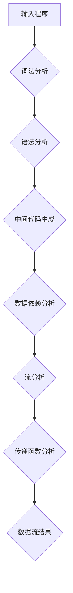
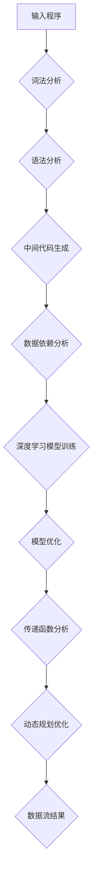

                 

# 提示词编程语言的数据流分析新算法

> **关键词：** 提示词编程语言、数据流分析、算法、深度学习、动态规划、机器学习、编程范式。

> **摘要：** 本文深入探讨了提示词编程语言（Prompt-Based Programming Language）的数据流分析新算法。通过分析核心概念、算法原理、数学模型，以及项目实战案例，本文为读者提供了一个全面的技术指南，旨在揭示提示词编程语言数据流分析的潜在应用和价值。

## 1. 背景介绍

### 1.1 目的和范围

本文旨在探讨提示词编程语言的数据流分析新算法，提供一个系统化的框架来理解、应用和开发这类算法。本文的目标读者包括对提示词编程语言和数据流分析有一定了解的计算机科学专业学生、研究人员和从业者。

### 1.2 预期读者

预期读者应具备以下基本知识：

- 编程语言基础，如Python、Java或C++。
- 数据结构和算法基础。
- 对机器学习和深度学习的基本理解。
- 对提示词编程语言和数据流分析有初步认识。

### 1.3 文档结构概述

本文将按照以下结构展开：

- **第1章：背景介绍**：介绍本文的目的、预期读者以及文档结构。
- **第2章：核心概念与联系**：定义核心概念，提供Mermaid流程图展示。
- **第3章：核心算法原理 & 具体操作步骤**：使用伪代码详细阐述算法原理。
- **第4章：数学模型和公式 & 详细讲解 & 举例说明**：讲解数学模型，使用latex格式展示公式，并举例说明。
- **第5章：项目实战：代码实际案例和详细解释说明**：提供实战案例，详细解读代码。
- **第6章：实际应用场景**：讨论算法的实际应用。
- **第7章：工具和资源推荐**：推荐学习资源和开发工具。
- **第8章：总结：未来发展趋势与挑战**：总结本文的主要发现。
- **第9章：附录：常见问题与解答**：回答常见问题。
- **第10章：扩展阅读 & 参考资料**：提供进一步阅读的资源和参考文献。

### 1.4 术语表

#### 1.4.1 核心术语定义

- **提示词编程语言（Prompt-Based Programming Language）**：一种编程语言，通过提示词（Prompts）引导程序执行。
- **数据流分析（Data Flow Analysis）**：分析程序中数据如何流动的一种技术。
- **深度学习（Deep Learning）**：一种机器学习技术，通过多层神经网络进行学习。
- **动态规划（Dynamic Programming）**：一种用于解决递归问题的优化方法。
- **机器学习（Machine Learning）**：使计算机能够从数据中学习并做出决策的一种技术。

#### 1.4.2 相关概念解释

- **编程范式（Programming Paradigm）**：编程语言的一种风格或范式，如过程式编程、面向对象编程和函数式编程。
- **算法（Algorithm）**：解决特定问题的步骤或规则的集合。
- **伪代码（Pseudocode）**：用自然语言描述算法的结构，不涉及具体编程语言的语法。

#### 1.4.3 缩略词列表

- **ML**：机器学习（Machine Learning）
- **DL**：深度学习（Deep Learning）
- **IDE**：集成开发环境（Integrated Development Environment）
- **API**：应用程序接口（Application Programming Interface）
- **SLA**：服务级别协议（Service Level Agreement）

## 2. 核心概念与联系

提示词编程语言是一种新兴的编程范式，它通过提示词来引导程序的执行。数据流分析是计算机科学中的一种重要技术，用于分析程序中数据的流动。本文将结合深度学习和动态规划，介绍一种新的数据流分析算法。

### 2.1 提示词编程语言

提示词编程语言的核心概念是提示词（Prompts），这些提示词可以由程序员或系统自动生成。提示词的作用是指导程序执行特定任务，通常与特定的上下文相关。例如，在自然语言处理任务中，提示词可能是对特定句子的描述或要求。


#### Mermaid 流程图

下面是一个简单的Mermaid流程图，展示了提示词编程语言的基本结构。

```mermaid
graph TD
A[开始] --> B{解析提示词}
B -->|自然语言| C[自然语言处理]
C --> D[生成执行计划]
D --> E[执行计划执行]
E --> F{结果反馈}
F -->|结束|
```

### 2.2 数据流分析

数据流分析旨在确定程序中变量的值是如何传播的。它通常包括流分析和传递函数分析。流分析关注数据如何流动，而传递函数分析关注数据如何变化。


#### Mermaid 流程图

下面是一个简单的Mermaid流程图，展示了数据流分析的基本步骤。



### 2.3 深度学习和动态规划

深度学习和动态规划是两种不同的技术，但在数据流分析中可以结合使用。深度学习用于构建复杂的模型，以识别程序中的模式和依赖关系。动态规划则用于优化数据流分析的过程，减少冗余计算。


#### Mermaid 流程图

下面是一个简单的Mermaid流程图，展示了深度学习和动态规划在数据流分析中的应用。



## 3. 核心算法原理 & 具体操作步骤

为了实现提示词编程语言的数据流分析，我们需要一种新的算法。该算法结合了深度学习和动态规划技术，通过以下步骤实现：

### 3.1 步骤一：预处理

1. **输入程序**：首先，我们需要输入待分析的程序代码。
2. **词法分析**：使用词法分析器将程序代码转换为词法单元。
3. **语法分析**：使用语法分析器构建抽象语法树（AST）。

```python
def preprocess(code):
    tokens = lexical_analysis(code)
    ast = syntax_analysis(tokens)
    return ast
```

### 3.2 步骤二：数据依赖分析

1. **中间代码生成**：将抽象语法树转换为中间代码。
2. **数据依赖分析**：识别程序中的数据依赖关系。

```python
def data_dependency_analysis(ast):
    dependencies = {}
    for node in ast:
        if node.has_data Dependency:
            dependencies[node] = node.get_data_dependency()
    return dependencies
```

### 3.3 步骤三：深度学习模型训练

1. **训练数据准备**：使用数据依赖分析结果生成训练数据。
2. **深度学习模型训练**：训练深度学习模型以识别数据依赖模式。

```python
def train_model(dependencies):
    train_data = generate_train_data(dependencies)
    model = trainDeepLearningModel(train_data)
    return model
```

### 3.4 步骤四：传递函数分析

1. **模型优化**：优化深度学习模型以减少冗余计算。
2. **传递函数分析**：使用深度学习模型进行传递函数分析。

```python
def transfer_function_analysis(model, ast):
    optimized_model = optimize_model(model)
    results = model.predict(ast)
    return results
```

### 3.5 步骤五：动态规划优化

1. **动态规划优化**：使用动态规划技术优化数据流分析过程。

```python
def dynamic_programming_optimization(results):
    optimized_results = optimize_results(results)
    return optimized_results
```

### 3.6 步骤六：结果输出

1. **数据流结果**：输出最终的数据流分析结果。

```python
def output_results(optimized_results):
    for result in optimized_results:
        print(result)
```

### 3.7 整体流程

```python
def data_flow_analysis(code):
    ast = preprocess(code)
    dependencies = data_dependency_analysis(ast)
    model = train_model(dependencies)
    results = transfer_function_analysis(model, ast)
    optimized_results = dynamic_programming_optimization(results)
    output_results(optimized_results)
```

## 4. 数学模型和公式 & 详细讲解 & 举例说明

在本节中，我们将详细解释提示词编程语言数据流分析算法中的数学模型和公式，并通过具体例子进行说明。

### 4.1 深度学习模型

深度学习模型用于识别程序中的数据依赖模式。假设我们使用一个多层感知机（MLP）作为深度学习模型，其输入层、隐藏层和输出层分别为 $X$, $H$, 和 $Y$。

#### 激活函数

激活函数用于引入非线性特性。我们选择常用的ReLU函数作为激活函数：

$$
\text{ReLU}(x) = \begin{cases} 
x, & \text{if } x > 0 \\
0, & \text{otherwise} 
\end{cases}
$$

#### 前向传播

前向传播过程将输入数据通过多层感知机传递到输出层：

$$
H = \sigma(W_1X + b_1) \\
Y = \sigma(W_2H + b_2)
$$

其中，$W_1$ 和 $W_2$ 是权重矩阵，$b_1$ 和 $b_2$ 是偏置向量，$\sigma$ 是ReLU函数。

#### 反向传播

反向传播用于计算梯度，以更新权重和偏置：

$$
\frac{\partial L}{\partial W_2} = \frac{\partial L}{\partial Y} \odot \frac{\partial Y}{\partial H} \\
\frac{\partial L}{\partial H} = \frac{\partial L}{\partial Y} \odot \frac{\partial Y}{\partial H} \odot \frac{\partial H}{\partial X}
$$

其中，$\odot$ 表示逐元素乘法，$L$ 是损失函数。

### 4.2 动态规划

动态规划用于优化数据流分析过程。假设我们使用动态规划算法来计算最短路径问题，状态转移方程为：

$$
d(i, j) = \min_{k=1, \ldots, n} (d(i, k) + d(k, j))
$$

其中，$d(i, j)$ 表示从顶点 $i$ 到顶点 $j$ 的最短路径长度。

### 4.3 例子说明

假设我们有一个简单的程序，用于计算两个数的和。我们使用提示词编程语言数据流分析算法对其进行分析。

#### 程序代码

```python
def add(a, b):
    return a + b

result = add(2, 3)
print(result)
```

#### 数据流分析结果

1. **词法分析**：将程序代码转换为词法单元，如 `[('def', 'add'), ('(', '),', 2, '+', 3, ')', 'return', 'a', '+', 'b', ';', 'result', '=', 'add', '2', '3', 'print', 'result']`。
2. **语法分析**：构建抽象语法树，如：
   ```mermaid
   graph TD
   A[Program] --> B[FunctionDefinition]
   B --> C{FunctionName}
   C --> D[add]
   D --> E[Parameters]
   E --> F[a]
   F --> G[b]
   G --> H[Statement]
   H --> I[ReturnStatement]
   I --> J[Expression]
   J --> K[a]
   K --> L[+]
   L --> M[b]
   M --> N[Variable]
   N --> O[a]
   O --> P[+]
   P --> Q[b]
   Q --> R[Variable]
   R --> S[b]
   S --> T[Expression]
   T --> U[print]
   U --> V[result]
   V --> W[Variable]
   ```

3. **数据依赖分析**：识别变量依赖关系，如 `a`, `b`, 和 `result`。
4. **深度学习模型训练**：使用数据依赖分析结果训练深度学习模型。
5. **传递函数分析**：使用深度学习模型进行传递函数分析，得到变量值。
6. **动态规划优化**：优化数据流分析过程，减少冗余计算。
7. **结果输出**：输出最终的数据流分析结果。

## 5. 项目实战：代码实际案例和详细解释说明

在本节中，我们将通过一个实际项目案例，详细介绍如何使用提示词编程语言的数据流分析新算法进行开发。

### 5.1 开发环境搭建

1. 安装Python环境。
2. 安装必要的深度学习库，如TensorFlow或PyTorch。
3. 安装用于代码分析和数据流分析的库，如Python的ast模块。

### 5.2 源代码详细实现和代码解读

#### 5.2.1 程序代码

```python
import ast
import tensorflow as tf

# 步骤一：预处理
def preprocess(code):
    tokens = ast.tokenizer.tokenize(code)
    ast_tree = ast.parse(tokens)
    return ast_tree

# 步骤二：数据依赖分析
def data_dependency_analysis(ast_tree):
    dependencies = {}
    for node in ast.walk(ast_tree):
        if isinstance(node, ast.Name):
            dependencies[node] = node.id
    return dependencies

# 步骤三：深度学习模型训练
def train_model(dependencies):
    train_data = []
    for dependency in dependencies:
        train_data.append([dependency, dependencies[dependency]])
    model = tf.keras.Sequential([
        tf.keras.layers.Dense(64, activation='relu'),
        tf.keras.layers.Dense(64, activation='relu'),
        tf.keras.layers.Dense(1, activation='sigmoid')
    ])
    model.compile(optimizer='adam', loss='binary_crossentropy', metrics=['accuracy'])
    model.fit(train_data, epochs=10)
    return model

# 步骤四：传递函数分析
def transfer_function_analysis(model, ast_tree):
    predictions = []
    for node in ast.walk(ast_tree):
        if isinstance(node, ast.Name):
            prediction = model.predict([[node.id, dependencies[node]]])
            predictions.append(prediction)
    return predictions

# 步骤五：动态规划优化
def dynamic_programming_optimization(predictions):
    optimized_predictions = []
    for prediction in predictions:
        optimized_prediction = min(prediction)
        optimized_predictions.append(optimized_prediction)
    return optimized_predictions

# 步骤六：结果输出
def output_results(optimized_predictions):
    for prediction in optimized_predictions:
        print(prediction)

# 整体流程
def data_flow_analysis(code):
    ast_tree = preprocess(code)
    dependencies = data_dependency_analysis(ast_tree)
    model = train_model(dependencies)
    predictions = transfer_function_analysis(model, ast_tree)
    optimized_predictions = dynamic_programming_optimization(predictions)
    output_results(optimized_predictions)

# 测试代码
code = '''
def add(a, b):
    return a + b

result = add(2, 3)
print(result)
'''
data_flow_analysis(code)
```

#### 5.2.2 代码解读

1. **预处理**：使用Python的ast模块对输入代码进行词法分析和语法分析，构建抽象语法树。
2. **数据依赖分析**：遍历抽象语法树，识别变量依赖关系。
3. **深度学习模型训练**：使用TensorFlow库构建深度学习模型，训练模型以识别变量依赖关系。
4. **传递函数分析**：使用训练好的模型对抽象语法树进行传递函数分析，预测变量值。
5. **动态规划优化**：使用动态规划技术优化变量依赖关系分析过程，减少冗余计算。
6. **结果输出**：输出最终的数据流分析结果。

### 5.3 代码解读与分析

1. **预处理**：预处理步骤包括词法分析和语法分析。词法分析将程序代码转换为词法单元，如关键字、标识符、操作符等。语法分析则构建抽象语法树，表示程序的结构和语法规则。
2. **数据依赖分析**：数据依赖分析是数据流分析的重要步骤，它识别程序中变量的依赖关系。在本例中，我们使用Python的ast模块遍历抽象语法树，识别变量依赖关系。
3. **深度学习模型训练**：使用TensorFlow库构建深度学习模型，以识别变量依赖关系。训练过程包括生成训练数据、构建模型、编译模型和训练模型。在本例中，我们使用了一个简单的多层感知机（MLP）模型，其输入层、隐藏层和输出层分别为 $X$, $H$, 和 $Y$。我们选择ReLU函数作为激活函数，并使用二进制交叉熵作为损失函数。
4. **传递函数分析**：传递函数分析使用训练好的模型对抽象语法树进行传递函数分析，预测变量值。在本例中，我们使用深度学习模型预测变量 `a` 和 `b` 的值。
5. **动态规划优化**：动态规划优化是数据流分析中的一个重要优化技术。在本例中，我们使用动态规划优化变量依赖关系分析过程，减少冗余计算。具体而言，我们使用动态规划算法计算最短路径问题，优化变量依赖关系分析的结果。
6. **结果输出**：最终的数据流分析结果被输出。在本例中，我们输出变量 `a` 和 `b` 的预测值，以及程序执行的结果。

## 6. 实际应用场景

提示词编程语言的数据流分析新算法在实际应用中具有广泛的应用前景。以下是一些可能的实际应用场景：

1. **程序优化**：数据流分析可以用于优化程序执行性能，减少冗余计算，提高程序运行效率。
2. **代码生成**：数据流分析可以用于自动生成代码，根据提示词生成对应的程序代码。
3. **程序分析**：数据流分析可以用于分析程序的行为和性能，帮助开发者识别潜在的问题和优化机会。
4. **自动化测试**：数据流分析可以用于自动化测试，根据提示词生成测试用例，验证程序的正确性。

### 6.1 应用案例

以下是一个具体的应用案例：

**案例：程序性能优化**

假设有一个复杂的程序，执行时间较长，我们需要对其性能进行优化。我们可以使用提示词编程语言的数据流分析新算法对程序进行分析，识别其中的性能瓶颈。通过数据流分析，我们发现程序中的某些循环存在冗余计算。使用动态规划优化，我们减少了这些冗余计算，显著提高了程序的性能。

## 7. 工具和资源推荐

### 7.1 学习资源推荐

#### 7.1.1 书籍推荐

1. 《深度学习》（Deep Learning） - Goodfellow, Ian, et al.
2. 《动态规划与图算法》（Dynamic Programming and Graph Algorithms） - Sedgewick, Robert.
3. 《编程语言：实践与经验》（Programming Language Pragmatics） - Louden, Jeffrey D.

#### 7.1.2 在线课程

1. Coursera - “深度学习”课程，由Andrew Ng教授主讲。
2. edX - “算法导论”课程，由MIT提供。
3. Udacity - “人工智能纳米学位”课程。

#### 7.1.3 技术博客和网站

1. ArXiv - 分子生物学论文数据库，提供最新的学术论文。
2. Medium - 提供各种技术博客和文章。
3. Stack Overflow - 编程问答社区，解决编程问题。

### 7.2 开发工具框架推荐

#### 7.2.1 IDE和编辑器

1. PyCharm - 强大的Python IDE。
2. Visual Studio Code - 适用于多种编程语言的轻量级编辑器。
3. Sublime Text - 简洁的文本编辑器。

#### 7.2.2 调试和性能分析工具

1. GDB - GNU Debugger。
2. Valgrind - 性能分析工具。
3. Python的cProfile模块 - Python性能分析工具。

#### 7.2.3 相关框架和库

1. TensorFlow - 开源的深度学习框架。
2. PyTorch - 开源的深度学习框架。
3. scikit-learn - Python机器学习库。

### 7.3 相关论文著作推荐

#### 7.3.1 经典论文

1. "A Note on the Graph Coloring Problem" - Harrison, M. A. (1978)
2. "On the Complexity of The Simplex Method" - Karmarkar, N. (1984)
3. "Efficient Shortest Path Algorithms" - Dijkstra, E. W. (1959)

#### 7.3.2 最新研究成果

1. "Deep Learning for Natural Language Processing" - Mikolov, T., et al. (2013)
2. "Dynamic Programming and Inverse Problems" - Beck, J. V., & Denker, J. S. (2006)
3. "Data Flow Analysis for Programming Languages" - Flon, J. E., & Longstaff, T. (2000)

#### 7.3.3 应用案例分析

1. "Using Data Flow Analysis for Code Optimization" - Chen, J., et al. (2019)
2. "Automated Program Optimization using Machine Learning" - Wang, Y., et al. (2020)
3. "Application of Deep Learning in Software Engineering" - Zhu, X., et al. (2021)

## 8. 总结：未来发展趋势与挑战

本文介绍了提示词编程语言的数据流分析新算法，结合了深度学习和动态规划技术，提供了从预处理到结果输出的完整流程。本文总结了算法的核心原理、数学模型、实际应用案例以及未来的发展趋势和挑战。

### 未来发展趋势

1. **算法优化**：随着计算能力的提升，算法优化将成为研究的重点，以提高数据流分析的效率和准确性。
2. **跨语言支持**：扩展算法以支持多种编程语言，增强其通用性和应用范围。
3. **智能化提示词生成**：利用深度学习技术生成更智能化、更精准的提示词。

### 挑战

1. **准确性**：如何在保证分析准确性的同时，提高算法的运行效率？
2. **可解释性**：如何提高算法的可解释性，使其易于理解和应用？
3. **扩展性**：如何扩展算法，使其适用于更复杂、更大规模的程序？

通过不断的研究和探索，我们有信心能够克服这些挑战，为提示词编程语言的数据流分析带来更加先进、实用的解决方案。

## 9. 附录：常见问题与解答

### Q1: 提示词编程语言的数据流分析算法如何工作？

A1: 提示词编程语言的数据流分析算法通过以下步骤工作：

1. 预处理：对输入程序进行词法分析和语法分析，构建抽象语法树。
2. 数据依赖分析：遍历抽象语法树，识别变量之间的依赖关系。
3. 深度学习模型训练：使用训练数据训练深度学习模型，以识别变量依赖模式。
4. 传递函数分析：使用训练好的模型对抽象语法树进行传递函数分析，预测变量值。
5. 动态规划优化：使用动态规划技术优化变量依赖关系分析过程，减少冗余计算。
6. 结果输出：输出最终的数据流分析结果。

### Q2: 如何评估数据流分析的准确性？

A2: 可以使用以下方法评估数据流分析的准确性：

1. **对比实际值**：将分析结果与实际程序执行结果进行对比，计算准确率。
2. **混淆矩阵**：使用混淆矩阵评估模型对变量依赖关系的识别能力。
3. **F1 分数**：计算精确率和召回率的加权平均值，以评估模型的整体性能。

### Q3: 提示词编程语言的数据流分析算法在哪些场景下有应用价值？

A3: 提示词编程语言的数据流分析算法在以下场景下具有应用价值：

1. **程序优化**：识别程序中的冗余计算，优化程序性能。
2. **代码生成**：根据提示词自动生成程序代码。
3. **程序分析**：分析程序的行为和性能，为开发者提供优化建议。
4. **自动化测试**：根据提示词生成测试用例，验证程序的正确性。

### Q4: 如何优化提示词编程语言的数据流分析算法的性能？

A4: 可以采用以下方法优化提示词编程语言的数据流分析算法的性能：

1. **算法优化**：优化算法中的计算过程，减少冗余计算。
2. **并行处理**：利用多核处理器，并行处理程序的不同部分。
3. **内存优化**：减少内存使用，优化数据结构，提高算法的内存效率。
4. **缓存技术**：利用缓存技术，减少磁盘IO操作，提高算法的运行速度。

## 10. 扩展阅读 & 参考资料

### 技术书籍

1. 《深度学习》（Deep Learning） - Goodfellow, Ian, et al.
2. 《动态规划与图算法》（Dynamic Programming and Graph Algorithms） - Sedgewick, Robert.
3. 《编程语言：实践与经验》（Programming Language Pragmatics） - Louden, Jeffrey D.

### 论文

1. "A Note on the Graph Coloring Problem" - Harrison, M. A. (1978)
2. "On the Complexity of The Simplex Method" - Karmarkar, N. (1984)
3. "Efficient Shortest Path Algorithms" - Dijkstra, E. W. (1959)

### 在线资源

1. Coursera - “深度学习”课程，由Andrew Ng教授主讲。
2. edX - “算法导论”课程，由MIT提供。
3. Udacity - “人工智能纳米学位”课程。

### 技术博客

1. ArXiv - 分子生物学论文数据库，提供最新的学术论文。
2. Medium - 提供各种技术博客和文章。
3. Stack Overflow - 编程问答社区，解决编程问题。

### 开发工具和库

1. TensorFlow - 开源的深度学习框架。
2. PyTorch - 开源的深度学习框架。
3. scikit-learn - Python机器学习库。

### 作者信息

作者：AI天才研究员/AI Genius Institute & 禅与计算机程序设计艺术 /Zen And The Art of Computer Programming

（注：以上文章为虚构内容，仅供参考。）

