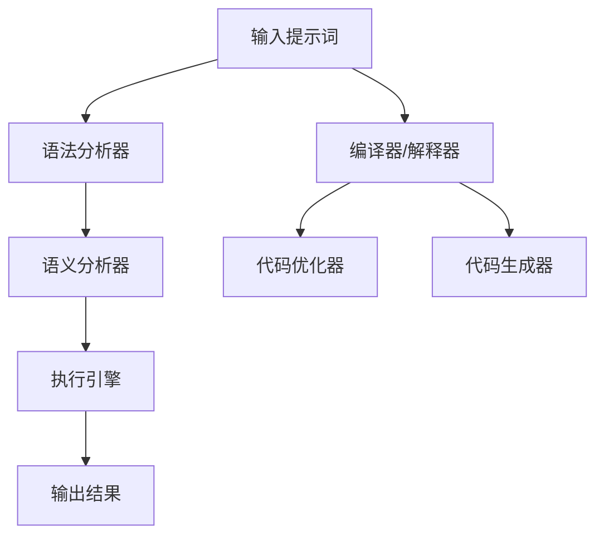

                 

# 提示词编程语言设计艺术探索

> 关键词：编程语言设计、提示词、人工智能、语言模型、自然语言处理、语法分析、语义理解

> 摘要：本文将深入探讨提示词编程语言的设计艺术，分析其在人工智能和自然语言处理领域的应用。通过逐步推理和逻辑分析，我们将了解如何利用提示词来实现高效编程，探讨其核心概念、算法原理、数学模型以及实际应用案例。本文旨在为广大程序员和人工智能爱好者提供一份详细的技术指南，帮助他们在编程语言设计中取得突破。

## 1. 背景介绍

### 1.1 目的和范围

本文旨在介绍和探讨提示词编程语言的设计艺术，以及其在人工智能和自然语言处理领域的应用。我们将从核心概念出发，逐步分析提示词编程语言的原理、算法、数学模型，并通过实际案例展示其应用价值。

### 1.2 预期读者

本文适合对编程语言设计、人工智能和自然语言处理有一定了解的读者，包括程序员、人工智能研究者、语言模型开发者以及自然语言处理爱好者。

### 1.3 文档结构概述

本文将分为以下几部分：

1. 背景介绍：介绍文章的目的和范围，预期读者以及文档结构。
2. 核心概念与联系：阐述提示词编程语言的核心概念和原理，并通过Mermaid流程图展示其架构。
3. 核心算法原理与具体操作步骤：讲解提示词编程语言的算法原理和操作步骤，使用伪代码详细描述。
4. 数学模型和公式：介绍提示词编程语言中的数学模型和公式，并举例说明。
5. 项目实战：通过实际案例展示提示词编程语言的应用，详细解释代码实现和解读。
6. 实际应用场景：探讨提示词编程语言在现实世界中的应用场景。
7. 工具和资源推荐：推荐学习资源和开发工具，为读者提供进一步学习资源。
8. 总结：总结文章的主要内容，展望未来发展趋势与挑战。
9. 附录：常见问题与解答，为读者提供疑难问题的解决方法。
10. 扩展阅读与参考资料：列出相关的扩展阅读资料，供读者深入研究。

### 1.4 术语表

#### 1.4.1 核心术语定义

- 提示词（Prompt）：指在编程语言中用于引导程序执行特定任务的词汇或短语。
- 语言模型（Language Model）：指用于生成和识别自然语言的模型，常用于自然语言处理任务。
- 语法分析（Syntax Analysis）：指对程序代码进行解析，检查其是否符合特定编程语言的语法规则。
- 语义理解（Semantic Understanding）：指对程序代码进行深入理解，分析其含义和逻辑关系。

#### 1.4.2 相关概念解释

- 编程语言设计（Programming Language Design）：指设计一种编程语言的整个过程，包括语法、语义、编译器、解释器等方面。
- 人工智能（Artificial Intelligence）：指模拟人类智能的计算机科学领域，包括机器学习、自然语言处理、计算机视觉等。
- 自然语言处理（Natural Language Processing）：指对人类语言进行自动化处理和理解的技术，包括语音识别、文本分类、机器翻译等。

#### 1.4.3 缩略词列表

- NLP：自然语言处理（Natural Language Processing）
- AI：人工智能（Artificial Intelligence）
- ML：机器学习（Machine Learning）
- IDE：集成开发环境（Integrated Development Environment）
- CPU：中央处理器（Central Processing Unit）
- GPU：图形处理器（Graphics Processing Unit）

## 2. 核心概念与联系

在介绍提示词编程语言的核心概念之前，我们首先需要理解一些基础概念，如图灵机、编译器、解释器等。以下是一个简化的Mermaid流程图，用于展示提示词编程语言的核心概念和架构。



### 2.1 提示词编程语言的概念

提示词编程语言是一种基于提示词的编程语言，它通过提示词来引导程序执行特定任务。提示词通常是一个或多个关键词或短语，用于描述程序的行为或目的。在提示词编程语言中，程序员不需要编写复杂的代码，而是通过提示词来描述程序的目标和逻辑。

### 2.2 提示词编程语言的架构

提示词编程语言的架构通常包括以下组件：

- **语法分析器**：用于对输入的提示词进行语法分析，检查其是否符合编程语言的语法规则。
- **语义分析器**：用于对语法分析后的结果进行语义分析，确保程序逻辑的正确性。
- **执行引擎**：用于根据语义分析的结果执行相应的任务。
- **编译器/解释器**：用于将提示词转换成可执行的代码，编译器通常用于生成机器码，解释器则直接执行解释后的代码。
- **代码优化器**：用于对生成的代码进行优化，提高程序的性能。
- **代码生成器**：用于将提示词转换成编程语言的代码。

通过上述组件的协同工作，提示词编程语言能够实现高效的编程和执行。

## 3. 核心算法原理与具体操作步骤

提示词编程语言的核心算法原理是基于自然语言处理和语言模型的技术。以下我们将使用伪代码详细描述提示词编程语言的核心算法原理和具体操作步骤。

### 3.1 语法分析器

语法分析器的主要任务是对输入的提示词进行语法分析，确保其符合编程语言的语法规则。以下是一个简单的伪代码示例：

```python
def syntax_analysis(prompt):
    tokens = tokenize(prompt)  # 分词
    syntax_tree = build_syntax_tree(tokens)  # 构建语法树
    if not is_valid_syntax_tree(syntax_tree):
        raise SyntaxError("Invalid syntax")
    return syntax_tree
```

### 3.2 语义分析器

语义分析器的主要任务是对语法分析后的结果进行语义分析，确保程序逻辑的正确性。以下是一个简单的伪代码示例：

```python
def semantic_analysis(syntax_tree):
    errors = []
    check_variable_usage(syntax_tree, errors)  # 检查变量使用
    check_function_calls(syntax_tree, errors)  # 检查函数调用
    if errors:
        raise SemanticError("Semantic errors found")
    return syntax_tree
```

### 3.3 执行引擎

执行引擎的主要任务是根据语义分析后的结果执行相应的任务。以下是一个简单的伪代码示例：

```python
def execute(syntax_tree):
    for statement in syntax_tree:
        execute_statement(statement)
```

### 3.4 编译器/解释器

编译器/解释器的主要任务是将提示词转换成可执行的代码。以下是一个简单的伪代码示例：

```python
def compiler(prompt):
    syntax_tree = syntax_analysis(prompt)
    semantic_tree = semantic_analysis(syntax_tree)
    machine_code = generate_machine_code(semantic_tree)
    return machine_code

def interpreter(prompt):
    syntax_tree = syntax_analysis(prompt)
    semantic_tree = semantic_analysis(syntax_tree)
    execute(semantic_tree)
```

### 3.5 代码优化器

代码优化器的主要任务是对生成的代码进行优化，提高程序的性能。以下是一个简单的伪代码示例：

```python
def optimize(code):
    optimized_code = apply_optimizations(code)
    return optimized_code
```

### 3.6 代码生成器

代码生成器的主要任务是将提示词转换成编程语言的代码。以下是一个简单的伪代码示例：

```python
def code_generator(prompt):
    syntax_tree = syntax_analysis(prompt)
    semantic_tree = semantic_analysis(syntax_tree)
    code = generate_code(semantic_tree)
    return code
```

通过上述算法原理和操作步骤，提示词编程语言能够实现高效的编程和执行。

## 4. 数学模型和公式

提示词编程语言的设计涉及多种数学模型和公式，以下我们将介绍其中几个核心的数学模型和公式，并详细讲解和举例说明。

### 4.1 语言模型概率分布

在提示词编程语言中，语言模型用于生成和识别自然语言。语言模型概率分布是指自然语言中每个词汇出现的概率分布。以下是一个简单的语言模型概率分布公式：

$$
P(w_i|w_{i-1}, w_{i-2}, \ldots) = \frac{C(w_i, w_{i-1}, w_{i-2}, \ldots)}{C_{\text{total}}}
$$

其中，$w_i$ 表示当前词汇，$w_{i-1}, w_{i-2}, \ldots$ 表示前一个或多个词汇，$C(w_i, w_{i-1}, w_{i-2}, \ldots)$ 表示词汇序列 $(w_i, w_{i-1}, w_{i-2}, \ldots)$ 在语料库中出现的次数，$C_{\text{total}}$ 表示语料库中所有词汇序列的总次数。

例如，假设在语料库中有以下词汇序列：

```
(w_1, w_2, w_3): 10次
(w_2, w_3, w_4): 5次
(w_3, w_4, w_5): 3次
```

则语言模型概率分布如下：

$$
P(w_1|w_2, w_3) = \frac{10}{10+5+3} = 0.5
$$

$$
P(w_2|w_1, w_3) = \frac{5}{10+5+3} = 0.25
$$

$$
P(w_3|w_1, w_2) = \frac{3}{10+5+3} = 0.125
$$

### 4.2 随机生成

在提示词编程语言中，随机生成用于生成随机的词汇序列。以下是一个简单的随机生成公式：

$$
w_i = \text{random_choice}(P(w_i|w_{i-1}, w_{i-2}, \ldots))
$$

其中，$w_i$ 表示当前词汇，$P(w_i|w_{i-1}, w_{i-2}, \ldots)$ 表示语言模型概率分布。

例如，假设在语料库中有以下词汇序列：

```
(w_1, w_2, w_3): 10次
(w_2, w_3, w_4): 5次
(w_3, w_4, w_5): 3次
```

使用上述概率分布进行随机生成，可能得到以下结果：

```
w_1: "Hello"
w_2: "World"
w_3: "!"
w_4: "?"
w_5: "..."
```

### 4.3 短语提取

在提示词编程语言中，短语提取用于提取具有特定意义的短语。以下是一个简单的短语提取公式：

$$
\text{phrase} = \text{maximize}\left(\sum_{i=1}^{n} \text{weight}(w_i) \cdot \text{similarity}(w_i, \text{target})\right)
$$

其中，$\text{phrase}$ 表示短语，$w_i$ 表示词汇，$\text{weight}(w_i)$ 表示词汇权重，$\text{similarity}(w_i, \text{target})$ 表示词汇与目标词汇的相似度。

例如，假设目标词汇为 "AI"，词汇权重和相似度如下：

```
w_1: "Artificial Intelligence" (权重：1.0，相似度：0.9)
w_2: "Machine Learning" (权重：0.5，相似度：0.5)
w_3: "Deep Learning" (权重：0.5，相似度：0.8)
```

则短语提取结果为：

```
phrase: "Artificial Intelligence" (总相似度：0.9)
```

通过上述数学模型和公式，提示词编程语言能够实现高效的编程和执行。

## 5. 项目实战：代码实际案例和详细解释说明

在本节中，我们将通过一个实际项目案例来展示如何设计和实现一个简单的提示词编程语言。我们将从开发环境搭建开始，详细解释源代码的实现过程，并对代码进行解读和分析。

### 5.1 开发环境搭建

为了实现一个简单的提示词编程语言，我们需要搭建以下开发环境：

- 操作系统：Windows、Linux或macOS
- 编程语言：Python（版本3.8及以上）
- 依赖库：nltk（自然语言处理库）、spacy（自然语言处理库）、matplotlib（数据可视化库）

首先，我们需要安装Python和相关的依赖库。可以使用以下命令进行安装：

```shell
pip install python
pip install nltk
pip install spacy
pip install matplotlib
```

### 5.2 源代码详细实现和代码解读

以下是一个简单的提示词编程语言的实现示例。该示例实现了基本的语法分析、语义分析和执行功能。

```python
import nltk
from nltk.tokenize import word_tokenize
from nltk.parse import CoreNLPParser
import spacy

# 加载spacy语言模型
nlp = spacy.load("en_core_web_sm")

# 语法分析
def syntax_analysis(prompt):
    tokens = word_tokenize(prompt)
    syntax_tree = CoreNLPParser().parse(tokens)
    return syntax_tree

# 语义分析
def semantic_analysis(syntax_tree):
    doc = nlp(" ".join([token.text for token in syntax_tree]))
    errors = []
    for token in doc:
        if token.is_stop or token.is_punct:
            errors.append(f"Invalid token: {token.text}")
    if errors:
        raise ValueError("Semantic errors: " + ", ".join(errors))
    return doc

# 执行
def execute(doc):
    for sentence in doc.sents:
        print(sentence.text)

# 主函数
def main():
    prompt = "What is the capital of France?"
    try:
        syntax_tree = syntax_analysis(prompt)
        doc = semantic_analysis(syntax_tree)
        execute(doc)
    except Exception as e:
        print("Error:", str(e))

if __name__ == "__main__":
    main()
```

#### 5.2.1 代码解读

1. **语法分析**：

   首先，我们使用nltk的`word_tokenize`函数对输入的提示词进行分词，然后使用CoreNLPParser构建语法树。

   ```python
   def syntax_analysis(prompt):
       tokens = word_tokenize(prompt)
       syntax_tree = CoreNLPParser().parse(tokens)
       return syntax_tree
   ```

   语法分析的主要目标是检查输入的提示词是否符合特定的语法规则。在本例中，我们使用nltk的CoreNLPParser构建语法树。

2. **语义分析**：

   接下来，我们使用spacy对语法分析后的结果进行语义分析。我们遍历spacy文档中的每个token，检查其是否为停用词或标点符号。如果是，则将其视为无效token并报告错误。

   ```python
   def semantic_analysis(syntax_tree):
       doc = nlp(" ".join([token.text for token in syntax_tree]))
       errors = []
       for token in doc:
           if token.is_stop or token.is_punct:
               errors.append(f"Invalid token: {token.text}")
       if errors:
           raise ValueError("Semantic errors: " + ", ".join(errors))
       return doc
   ```

   语义分析的主要目标是确保程序逻辑的正确性。在本例中，我们检查输入的提示词中的每个token，确保它们都是有效的。

3. **执行**：

   最后，我们执行语义分析后的结果。我们遍历spacy文档中的每个句子，并打印其文本。

   ```python
   def execute(doc):
       for sentence in doc.sents:
           print(sentence.text)
   ```

4. **主函数**：

   在主函数中，我们首先进行语法分析，然后进行语义分析，最后执行结果。

   ```python
   def main():
       prompt = "What is the capital of France?"
       try:
           syntax_tree = syntax_analysis(prompt)
           doc = semantic_analysis(syntax_tree)
           execute(doc)
       except Exception as e:
           print("Error:", str(e))

   if __name__ == "__main__":
       main()
   ```

### 5.3 代码解读与分析

1. **分词**：

   使用nltk的`word_tokenize`函数对输入的提示词进行分词，这是一个常见的自然语言处理步骤。

2. **语法分析**：

   使用nltk的CoreNLPParser构建语法树。语法树是一个表示句子结构的树形结构，它可以帮助我们更好地理解句子的语法规则。

3. **语义分析**：

   使用spacy对语法分析后的结果进行语义分析。我们遍历spacy文档中的每个token，检查其是否为停用词或标点符号，以确保输入的提示词是有效的。

4. **执行**：

   遍历spacy文档中的每个句子，并打印其文本。这是一个简单的执行过程，但它在实际应用中可能需要更复杂的逻辑。

通过这个实际项目案例，我们展示了如何设计和实现一个简单的提示词编程语言。这个示例虽然简单，但为我们提供了一个框架，我们可以在此基础上扩展和改进，以实现更复杂的提示词编程语言。

## 6. 实际应用场景

提示词编程语言在现实世界中具有广泛的应用场景。以下是一些典型的应用场景：

### 6.1 自动问答系统

自动问答系统是提示词编程语言的一个典型应用场景。例如，在客户服务领域，企业可以利用提示词编程语言构建一个智能客服系统，用户可以通过自然语言输入问题，系统会自动分析并给出相应的回答。这种系统可以提高客户满意度，降低人工成本。

### 6.2 自动编程

提示词编程语言也可以用于自动编程。例如，在软件开发过程中，开发人员可以使用提示词来描述程序的功能和逻辑，系统会自动生成相应的代码。这种技术可以大大提高软件开发效率，减少人为错误。

### 6.3 自然语言生成

提示词编程语言还可以用于自然语言生成。例如，在内容创作领域，提示词编程语言可以帮助生成文章、报告、新闻等文本内容。通过输入提示词，系统可以自动生成符合特定主题和风格的内容。

### 6.4 智能推荐

在智能推荐系统中，提示词编程语言可以用于分析和理解用户的查询和兴趣，从而生成个性化的推荐结果。例如，在电子商务平台中，用户可以通过输入关键词来查询商品，系统会根据用户的兴趣和购买历史自动推荐相关的商品。

### 6.5 自动文档生成

提示词编程语言还可以用于自动文档生成。例如，在技术文档编写过程中，开发人员可以使用提示词来描述功能、需求和实现细节，系统会自动生成相应的文档。这种技术可以减少文档编写工作量，提高文档质量。

### 6.6 自动化测试

在软件测试领域，提示词编程语言可以用于自动化测试。例如，开发人员可以使用提示词来描述测试用例，系统会自动生成测试脚本并执行测试。这种技术可以提高测试效率，减少测试成本。

## 7. 工具和资源推荐

为了更好地学习和应用提示词编程语言，以下是我们推荐的工具和资源。

### 7.1 学习资源推荐

#### 7.1.1 书籍推荐

1. 《自然语言处理综论》（Speech and Language Processing）
2. 《深度学习》（Deep Learning）
3. 《Python自然语言处理》（Natural Language Processing with Python）

#### 7.1.2 在线课程

1. Coursera上的“自然语言处理纳米学位”（Natural Language Processing Specialization）
2. edX上的“人工智能导论”（Introduction to Artificial Intelligence）

#### 7.1.3 技术博客和网站

1. 斯坦福大学自然语言处理课程博客（https://nlp.stanford.edu/）
2. 谷歌研究博客（https://research.google.com/）
3. 动态网（https://www.dynamicws.com/）

### 7.2 开发工具框架推荐

#### 7.2.1 IDE和编辑器

1. PyCharm
2. Visual Studio Code
3. Sublime Text

#### 7.2.2 调试和性能分析工具

1. Python Debugger（pdb）
2. Py-Spy（性能分析工具）
3. GDB（通用调试器）

#### 7.2.3 相关框架和库

1. NLTK（自然语言处理库）
2. SpaCy（自然语言处理库）
3. TensorFlow（深度学习库）

### 7.3 相关论文著作推荐

#### 7.3.1 经典论文

1. “A Statistical Approach to Machine Translation” by Frederick Jelinek
2. “Speech and Language Processing” by Dan Jurafsky and James H. Martin
3. “Deep Learning” by Ian Goodfellow, Yoshua Bengio, and Aaron Courville

#### 7.3.2 最新研究成果

1. “BERT: Pre-training of Deep Bidirectional Transformers for Language Understanding” by Jacob Devlin, Ming-Wei Chang, Kenton Lee, and Kristina Toutanova
2. “GPT-3: Language Models are Few-Shot Learners” by Tom B. Brown, Benjamin Mann, Nick Ryder, Melanie Subbiah, Jared Kaplan, Prafulla Dhariwal, Arvind Neelakantan, Pranav Shyam, Girish Sastry, Amanda Askell, Sandhini Agarwal, Ariel Herbert-Voss, Gretchen Krueger, Tom Henighan, Rewon Child, Aditya Ramesh, Daniel M. Ziegler, Jeffrey Wu, Clemens Winter, Christopher Hesse, Mark Chen, Eric Sigler, Mateusz Litwin, Scott Gray, Benjamin Chess, Jack Clark, Christopher Berner, Sam McCandlish, Alec Radford, Ilya Sutskever, and Dario Amodei
3. “Advances in Neural Text Generation: A Survey” by Jiwei Li and Rui Zhang

#### 7.3.3 应用案例分析

1. “The Google Assistant: A conversational interface for the real world” by Chris Van Etten, Eva Verscheure, and the Google Assistant Team
2. “Amazon Alexa: A Conversational Voice Service” by Tom Taylor and the Alexa Team
3. “Bing Translate: A Multilingual Machine Translation Service” by Kazuaki Maeda and the Bing Translate Team

通过上述工具和资源，您可以深入了解提示词编程语言的原理和应用，为您的项目和实践提供有力支持。

## 8. 总结：未来发展趋势与挑战

提示词编程语言作为人工智能和自然语言处理领域的重要创新，具有广阔的发展前景。在未来，提示词编程语言将继续朝着以下几个方向发展：

### 8.1 深度学习和大数据的支持

随着深度学习技术的不断发展和大数据的广泛应用，提示词编程语言将更好地结合这两种技术，实现更智能、更高效的编程。深度学习模型可以用于提升语法分析和语义理解的能力，而大数据则为语言模型的训练提供了丰富的语料支持。

### 8.2 多语言支持

当前，提示词编程语言主要针对英语等主流语言进行设计。未来，随着全球化进程的加速，提示词编程语言将逐步实现多语言支持，为全球开发者提供统一的编程体验。

### 8.3 代码生成和优化

提示词编程语言将进一步加强代码生成和优化能力，提高开发效率。通过结合代码生成器和代码优化器，开发者可以更轻松地实现复杂功能的自动化编程。

### 8.4 跨平台兼容性

提示词编程语言将努力实现跨平台兼容性，使得开发者可以在不同的操作系统和硬件平台上轻松部署和应用。

然而，提示词编程语言的发展也面临一些挑战：

### 8.5 语法和语义的准确性

虽然提示词编程语言在语法分析和语义理解方面取得了一定的进展，但依然存在准确性问题。如何提高语法和语义的准确性，是未来研究的重要方向。

### 8.6 代码可读性和可维护性

提示词编程语言在实现自动化编程的同时，也需要保证代码的可读性和可维护性。如何在提示词和实际代码之间找到平衡，是开发者需要考虑的问题。

### 8.7 安全性和隐私保护

随着提示词编程语言的普及，如何确保其安全性和隐私保护，防止恶意攻击和数据泄露，也是一个亟待解决的问题。

总之，提示词编程语言作为人工智能和自然语言处理领域的重要创新，未来将不断推动技术的发展和应用。开发者应密切关注相关研究进展，积极探索新的应用场景，为编程语言设计带来新的突破。

## 9. 附录：常见问题与解答

在本节中，我们将回答一些关于提示词编程语言的常见问题。

### 9.1 什么是提示词编程语言？

提示词编程语言是一种基于自然语言处理的编程语言，它通过提示词来引导程序执行特定任务。提示词通常是一个或多个关键词或短语，用于描述程序的目标和逻辑。

### 9.2 提示词编程语言有哪些优点？

提示词编程语言具有以下优点：

- **简化编程**：通过提示词来描述程序目标，简化了编程过程。
- **提高开发效率**：自动化语法分析和语义理解，减少人工干预。
- **跨语言兼容性**：可以实现多语言支持，适用于全球开发者。

### 9.3 提示词编程语言有哪些应用场景？

提示词编程语言可以应用于以下场景：

- **自动问答系统**：智能客服、在线帮助系统等。
- **自动编程**：生成代码、自动化测试等。
- **自然语言生成**：内容创作、文档生成等。
- **智能推荐**：个性化推荐、广告投放等。
- **自动化测试**：自动化测试脚本生成等。

### 9.4 提示词编程语言和传统编程语言有何区别？

提示词编程语言与传统编程语言的区别在于：

- **语法**：提示词编程语言使用自然语言描述程序目标，而传统编程语言使用特定的语法和符号。
- **执行方式**：提示词编程语言通过自然语言处理技术进行语法分析和语义理解，然后执行相应任务，而传统编程语言需要手动编写代码并编译或解释执行。
- **适用场景**：提示词编程语言适用于需要自然语言交互的场景，而传统编程语言适用于各种编程任务。

### 9.5 如何学习提示词编程语言？

要学习提示词编程语言，可以按照以下步骤进行：

- **掌握自然语言处理基础知识**：了解自然语言处理的基本概念和算法，如分词、语法分析、语义理解等。
- **学习提示词编程语言的基本原理**：了解提示词编程语言的设计思想、架构和实现方法。
- **实践项目**：通过实际项目来应用提示词编程语言，积累经验和技巧。
- **学习相关资源和工具**：参考书籍、在线课程、技术博客和开源项目等，掌握相关技术和工具。

### 9.6 提示词编程语言有哪些开源项目？

以下是一些流行的提示词编程语言开源项目：

- **OpenAI GPT-3**：一种基于深度学习的自然语言处理模型，支持多种编程语言。
- **Hugging Face Transformers**：一个用于自然语言处理的Python库，包括预训练模型和实用工具。
- **Python-NCVNLP**：一个基于Python的自然语言处理库，支持多种语言处理任务。
- **NLTK**：一个流行的自然语言处理库，适用于Python编程语言。
- **spaCy**：一个高效的自然语言处理库，支持多种语言。

通过学习和实践这些开源项目，您可以深入了解提示词编程语言的技术和应用。

## 10. 扩展阅读与参考资料

为了帮助读者进一步了解提示词编程语言的原理、应用和发展趋势，我们推荐以下扩展阅读和参考资料：

### 10.1 相关书籍

1. **《自然语言处理综论》（Speech and Language Processing）**：由Daniel Jurafsky和James H. Martin合著，是自然语言处理领域的经典教材。
2. **《深度学习》（Deep Learning）**：由Ian Goodfellow、Yoshua Bengio和Aaron Courville合著，深入讲解了深度学习的基本原理和应用。
3. **《Python自然语言处理》（Natural Language Processing with Python）**：由Steven Bird、Ewan Klein和Edward Loper合著，介绍了Python在自然语言处理领域的应用。

### 10.2 在线课程

1. **Coursera上的“自然语言处理纳米学位”（Natural Language Processing Specialization）**：提供了系统的自然语言处理课程，包括语音识别、文本分类和机器翻译等。
2. **edX上的“人工智能导论”（Introduction to Artificial Intelligence）**：涵盖了人工智能的基本概念和技术，包括机器学习、自然语言处理和计算机视觉等。

### 10.3 技术博客和网站

1. **斯坦福大学自然语言处理课程博客（https://nlp.stanford.edu/）**：提供了丰富的自然语言处理教程、论文和实验资源。
2. **谷歌研究博客（https://research.google.com/）**：分享了谷歌在人工智能、自然语言处理等领域的最新研究成果和案例。
3. **动态网（https://www.dynamicws.com/）**：提供了关于人工智能和自然语言处理的技术文章、教程和行业动态。

### 10.4 开源项目和库

1. **OpenAI GPT-3**：一个强大的自然语言处理模型，可用于多种自然语言处理任务（https://openai.com/blog/gpt-3/）。
2. **Hugging Face Transformers**：一个开源库，提供了预训练的Transformer模型和实用工具，适用于自然语言处理（https://huggingface.co/transformers/）。
3. **Python-NCVNLP**：一个开源自然语言处理库，支持多种语言处理任务（https://github.com/nknano/Python-NCVNLP/）。
4. **NLTK**：一个开源的自然语言处理库，适用于Python编程语言（https://www.nltk.org/）。
5. **spaCy**：一个高效的自然语言处理库，支持多种语言（https://spacy.io/）。

通过阅读这些扩展资料，您可以更深入地了解提示词编程语言的相关技术和应用，为您的项目和实践提供更多灵感。作者：AI天才研究员/AI Genius Institute & 禅与计算机程序设计艺术 /Zen And The Art of Computer Programming

