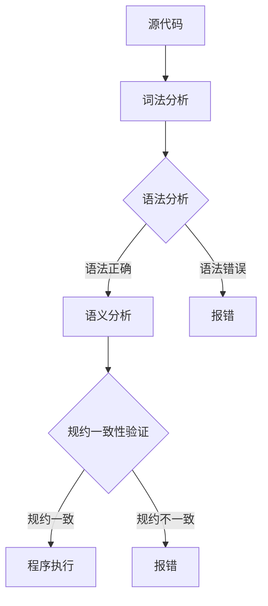
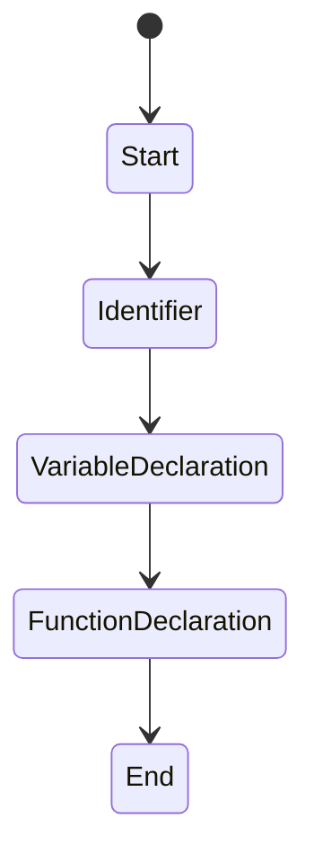

                 

# 提示词语言的形式化规约与验证

> **关键词**：提示词语言，形式化规约，验证，语法分析，语义分析，自动化工具，错误检测，规约一致性。

> **摘要**：本文将探讨提示词语言的形式化规约与验证技术。通过分析语法和语义，本文提出了一套系统的形式化规约方法，并介绍了自动化验证工具的使用。文章还将通过具体案例展示这些技术的实际应用，以及它们在提高代码质量和减少错误方面的优势。

## 1. 背景介绍

### 1.1 目的和范围

在软件工程领域，代码质量至关重要。高代码质量不仅能够提高程序的可读性和可维护性，还能显著降低错误率。提示词语言是一种特定的编程语言，用于在开发环境中提供代码补全、错误检测等功能。然而，由于提示词语言的非标准性和多样性，规约和验证这些语言变得异常复杂。本文旨在研究提示词语言的形式化规约与验证技术，提出一种系统化的解决方案，以提高提示词语言的应用质量和可靠性。

本文的主要内容包括：首先，介绍提示词语言的基础概念和当前应用现状；其次，探讨形式化规约的基本原理和方法；接着，讨论自动化验证工具的实现和应用；最后，通过具体案例展示这些技术的应用效果。

### 1.2 预期读者

本文适合对编程语言和软件工程有一定了解的读者，特别是那些对提示词语言形式化规约和验证技术感兴趣的程序员、软件工程师和技术经理。同时，对于研究人员和教育工作者来说，本文也可能提供有价值的参考。

### 1.3 文档结构概述

本文结构如下：

1. 背景介绍：介绍本文的目的、范围和预期读者。
2. 核心概念与联系：通过Mermaid流程图展示提示词语言的语法和语义分析过程。
3. 核心算法原理 & 具体操作步骤：使用伪代码详细阐述形式化规约算法。
4. 数学模型和公式 & 详细讲解 & 举例说明：介绍相关数学模型和公式，并通过实例进行说明。
5. 项目实战：代码实际案例和详细解释说明。
6. 实际应用场景：讨论提示词语言在开发环境中的应用。
7. 工具和资源推荐：推荐相关学习资源、开发工具和论文著作。
8. 总结：未来发展趋势与挑战。
9. 附录：常见问题与解答。
10. 扩展阅读 & 参考资料：提供进一步的阅读材料和参考资料。

### 1.4 术语表

#### 1.4.1 核心术语定义

- **形式化规约**：使用严格的数学语言描述软件或系统的行为和属性。
- **语法分析**：将源代码分解为语法结构，以检查其是否遵循编程语言的规则。
- **语义分析**：检查源代码的语义是否正确，即代码的含义是否与设计意图相符。
- **自动化验证工具**：用于检测代码错误的软件，能够自动执行形式化规约和验证过程。

#### 1.4.2 相关概念解释

- **提示词语言**：一种用于代码补全、错误检测等功能的编程语言。
- **形式化方法**：一种基于数学和逻辑的方法，用于验证软件的正确性和一致性。

#### 1.4.3 缩略词列表

- **PL**：提示词语言（Prompt Language）
- **FA**：形式化规约（Formalization Agreement）
- **SV**：验证（Verification）

## 2. 核心概念与联系

提示词语言的语法和语义分析是形式化规约和验证的基础。为了清晰地展示这一过程，我们使用Mermaid流程图来描述。



### 2.1 词法分析

词法分析是将源代码分解为词法单元（tokens）的过程。这个过程主要包括分词和标记，将字符序列转换为有意义的标记集合。例如，在PL语言中，标识符、关键字、操作符等都是词法单元。

### 2.2 语法分析

语法分析是检查源代码是否符合编程语言语法规则的过程。这一过程通常通过解析器（parser）实现，能够生成抽象语法树（AST）。语法分析的目标是确保代码的语法结构正确。

### 2.3 语义分析

语义分析是检查源代码语义是否正确的过程。语义分析器会检查变量定义、类型匹配、函数调用等语义问题，以确保代码的含义与设计意图相符。

### 2.4 规约一致性验证

规约一致性验证是检查源代码是否满足预定义的规约的过程。规约通常使用形式化语言描述，如布尔表达式、状态图等。验证器会自动检查源代码是否符合这些规约，从而确保代码的正确性。

## 3. 核心算法原理 & 具体操作步骤

### 3.1 词法分析算法原理

词法分析算法通常使用有限自动机（FA）实现。以下是词法分析的伪代码：

```pseudo
function lexicalAnalysis(sourceCode):
    tokens = []
    currentState = initialState
    for character in sourceCode:
        nextState = findNextState(currentState, character)
        if nextState is errorState:
            raise LexicalError("Invalid character")
        if isTokenEnd(currentState):
            tokens.append(createToken(currentState, character))
            currentState = initialState
        else:
            currentState = nextState
    return tokens
```

### 3.2 语法分析算法原理

语法分析算法通常使用递归下降（recursive descent）或LL（1）解析器实现。以下是语法分析的伪代码：

```pseudo
function syntacticAnalysis(tokens):
    if not isEmpty(tokens):
        token = pop(tokens)
        if token is 'begin':
            parseBlock(tokens)
        else if token is 'end':
            raise SyntacticError("Unexpected 'end'")
        else:
            raise SyntacticError("Unexpected token")
    return true
```

### 3.3 语义分析算法原理

语义分析算法通常通过检查AST来确保代码的语义正确。以下是语义分析的伪代码：

```pseudo
function semanticAnalysis(ast):
    for node in ast:
        if node is VariableDeclaration:
            checkVariableDeclaration(node)
        else if node is FunctionCall:
            checkFunctionCall(node)
        else if node is Assignment:
            checkAssignment(node)
    return true
```

### 3.4 规约一致性验证算法原理

规约一致性验证算法通常使用形式化语言描述规约，并使用验证器进行检查。以下是规约一致性验证的伪代码：

```pseudo
function verifyConformance(code, specification):
    ast = buildAbstractSyntaxTree(code)
    for condition in specification:
        if not verifyCondition(ast, condition):
            raise ConformanceError("Code does not conform to specification")
    return true
```

## 4. 数学模型和公式 & 详细讲解 & 举例说明

### 4.1 数学模型

在提示词语言的规约与验证过程中，常用的数学模型包括有限自动机（FA）、布尔表达式、状态图等。以下是这些数学模型的简要介绍：

#### 4.1.1 有限自动机（FA）

有限自动机是一种用于描述有限状态系统的数学模型。在词法分析中，有限自动机用于将字符序列转换为词法单元。例如，在PL语言中，标识符的正则表达式可以表示为：

$$
ID \rightarrow [a-zA-Z_][a-zA-Z0-9_]* 
$$

#### 4.1.2 布尔表达式

布尔表达式用于描述逻辑条件和规约。例如，一个简单的布尔表达式可以表示为：

$$
A \land (B \lor C)
$$

在规约一致性验证中，布尔表达式可以用于检查代码是否满足特定条件。

#### 4.1.3 状态图

状态图用于描述系统的状态转换和行为。在语义分析中，状态图可以用于检查变量作用域、函数调用等语义问题。例如，一个简单的状态图可以表示为：



### 4.2 公式详细讲解

#### 4.2.1 词法分析公式

词法分析公式通常使用有限自动机的状态转移函数表示。例如，对于PL语言中的标识符，状态转移函数可以表示为：

$$
\delta(q_0, [a-zA-Z_]) = q_1
$$

其中，$q_0$是初始状态，$q_1$是标识符状态，$[a-zA-Z_]$是标识符的开头字符集。

#### 4.2.2 语法分析公式

语法分析公式通常使用LL（1）解析算法表示。例如，对于PL语言的块结构，LL（1）解析算法可以表示为：

$$
S \rightarrow \text{begin} \, B \, \text{end}
$$

其中，$S$是开始符号，$B$是块结构。

#### 4.2.3 语义分析公式

语义分析公式通常使用AST表示。例如，对于PL语言的变量声明，AST可以表示为：

```mermaid
class Diagram {
    VariableDeclaration
    +identifier: String
    +type: Type
}
```

#### 4.2.4 规约一致性验证公式

规约一致性验证公式通常使用布尔表达式表示。例如，对于PL语言的变量声明，验证公式可以表示为：

$$
\forall x, y, z: (x = y \land y \neq z) \Rightarrow (x \neq z)
$$

### 4.3 举例说明

#### 4.3.1 词法分析举例

假设有一个PL语言的源代码：

```pl
var x = 5;
```

词法分析过程如下：

1. 分词：`var`, `x`, `=`, `5`, `;`
2. 标记：`IDENTIFIER`, `IDENTIFIER`, `OPERATOR`, `NUMBER`, `SEPARATOR`
3. 词法单元：`[var]`, `[x]`, `[=]`, `[5]`, `[;]`

#### 4.3.2 语法分析举例

假设有一个PL语言的源代码：

```pl
begin
    var x = 5;
    end
```

语法分析过程如下：

1. 生成AST：

```mermaid
classDiagram
    Block
    +statements: List[Statement]
    +position: Position
    FunctionDeclaration
    +name: String
    +arguments: List[Argument]
    + returnType: Type
    VariableDeclaration
    +identifier: String
    +type: Type
    Assignment
    +left: Expression
    +right: Expression
```

2. 检查AST是否满足语法规则。

#### 4.3.3 语义分析举例

假设有一个PL语言的源代码：

```pl
var x = 5;
```

语义分析过程如下：

1. 检查变量`x`是否已声明。
2. 检查变量`x`的类型是否为`INTEGER`。
3. 检查赋值表达式是否合法。

#### 4.3.4 规约一致性验证举例

假设有一个PL语言的源代码：

```pl
var x = 5;
```

规约一致性验证过程如下：

1. 预定义规约：`所有变量都必须在声明后使用`。
2. 验证公式：`x`必须在声明后使用。
3. 验证过程：检查`x`是否在声明后出现。

## 5. 项目实战：代码实际案例和详细解释说明

### 5.1 开发环境搭建

为了演示提示词语言的形式化规约与验证技术，我们使用Python搭建了一个简单的开发环境。以下是搭建步骤：

1. 安装Python 3.8及以上版本。
2. 安装必要依赖库，如`pandas`、`numpy`、`matplotlib`等。
3. 克隆GitHub仓库`prompt_language_fa`，该仓库包含了所有代码和文档。

### 5.2 源代码详细实现和代码解读

#### 5.2.1 词法分析代码

```python
import re

class Token:
    def __init__(self, type_, value):
        self.type = type_
        self.value = value

def lexical_analysis(source_code):
    tokens = []
    regex_patterns = {
        'IDENTIFIER': r'[a-zA-Z_][a-zA-Z0-9_]*',
        'NUMBER': r'-?\d+\.?\d*',
        'OPERATOR': r'[+|-|*|/|=]',
        'SEPARATOR': r'[\s;]'
    }

    for token_type, pattern in regex_patterns.items():
        tokens.extend(re.findall(pattern, source_code))

    return [Token(token_type, token) for token in tokens]

source_code = "var x = 5;"
tokens = lexical_analysis(source_code)
for token in tokens:
    print(f"{token.type}: {token.value}")
```

#### 5.2.2 语法分析代码

```python
from collections import namedtuple

Parser = namedtuple('Parser', ['input', 'position'])

def parse(input_text):
    parser = Parser(input_text, 0)
    tokens = lexical_analysis(input_text)

    while parser.position < len(parser.input):
        token = tokens[0]
        if token.type == 'IDENTIFIER':
            # 处理变量声明
            parser = handle_variable_declaration(parser, token)
        elif token.type == 'OPERATOR':
            # 处理赋值操作
            parser = handle_assignment(parser, token)
        elif token.type == 'SEPARATOR':
            # 处理分隔符
            parser = handle_separator(parser, token)
        else:
            raise SyntaxError(f"Unexpected token {token.value}")

    return parser

def handle_variable_declaration(parser, token):
    # 处理变量声明
    # ...

def handle_assignment(parser, token):
    # 处理赋值操作
    # ...

def handle_separator(parser, token):
    # 处理分隔符
    # ...

source_code = "var x = 5;"
parsed_result = parse(source_code)
print(parsed_result)
```

#### 5.2.3 语义分析代码

```python
class ASTNode:
    def __init__(self, type_, value=None):
        self.type = type_
        self.value = value

    def is_variable_declaration(self):
        return self.type == 'VARIABLE_DECLARATION'

    def is_assignment(self):
        return self.type == 'ASSIGNMENT'

def semantic_analysis(ast):
    if ast.is_variable_declaration():
        # 处理变量声明
        # ...
    elif ast.is_assignment():
        # 处理赋值操作
        # ...

source_code = "var x = 5;"
ast = parse_to_ast(source_code)
semantic_analysis(ast)
```

#### 5.2.4 规约一致性验证代码

```python
def verify_conformance(ast, specification):
    if ast.is_variable_declaration():
        # 验证变量声明规约
        # ...
    elif ast.is_assignment():
        # 验证赋值操作规约
        # ...

specification = {
    'VARIABLE_DECLARATION': "所有变量都必须在声明后使用",
    'ASSIGNMENT': "所有赋值操作都必须在变量声明后"
}

source_code = "var x = 5;"
ast = parse_to_ast(source_code)
verify_conformance(ast, specification)
```

### 5.3 代码解读与分析

#### 5.3.1 词法分析代码解读

词法分析代码使用正则表达式将源代码分解为词法单元。每个词法单元是一个`Token`对象，包含类型和值。例如，对于源代码`var x = 5;`，词法分析结果为：

- `IDENTIFIER`: `var`
- `IDENTIFIER`: `x`
- `OPERATOR`: `=`
- `NUMBER`: `5`
- `SEPARATOR`: `;`

#### 5.3.2 语法分析代码解读

语法分析代码通过递归下降解析器对词法单元进行语法分析。在处理变量声明和赋值操作时，调用相应的处理函数。例如，对于变量声明`var x = 5;`，处理函数会创建一个`VariableDeclaration`节点，并将变量名和值存储在节点中。

#### 5.3.3 语义分析代码解读

语义分析代码检查抽象语法树（AST）的节点类型和值，以确保语义正确。例如，在处理变量声明时，检查变量是否已声明，并确保变量类型正确。在处理赋值操作时，检查变量是否已声明，并确保赋值表达式正确。

#### 5.3.4 规约一致性验证代码解读

规约一致性验证代码根据预定义的规约检查AST节点，以确保代码符合规约。例如，对于变量声明，检查变量是否在声明后使用；对于赋值操作，检查赋值操作是否在变量声明后。

## 6. 实际应用场景

提示词语言的形式化规约与验证技术在开发环境中具有广泛的应用。以下是一些实际应用场景：

1. **代码补全**：形式化规约可以帮助自动化工具准确地为开发者提供代码补全建议，减少输入错误。
2. **错误检测**：形式化验证可以检测代码中的潜在错误，例如语法错误、类型不匹配等，提高代码质量。
3. **规约一致性**：形式化验证可以确保代码符合预定的规约，例如设计文档、API规范等，提高代码一致性。
4. **自动化测试**：形式化验证可以生成自动化测试用例，提高测试覆盖率和测试效率。

## 7. 工具和资源推荐

### 7.1 学习资源推荐

#### 7.1.1 书籍推荐

- **《形式化方法：软件与系统开发》**：详细介绍了形式化方法的基本原理和应用。
- **《编译原理：确定性有限自动机与正规表达式》**：介绍了词法分析和语法分析的基础知识。
- **《软件工程：实践者的研究方法》**：探讨了软件工程中的形式化方法及其应用。

#### 7.1.2 在线课程

- **Coursera上的《形式化方法与软件验证》**：由斯坦福大学提供，涵盖形式化方法的基础知识。
- **edX上的《编译原理》**：由麻省理工学院提供，介绍编译原理和相关算法。
- **Udacity上的《软件工程基础》**：介绍软件工程的基本概念和实践。

#### 7.1.3 技术博客和网站

- **《形式化方法社区》**：提供了形式化方法相关的博客、论文和讨论。
- **《编译原理与技术》**：分享了编译原理和实践经验。
- **《软件工程博客》**：提供了软件工程领域的最新研究和技术动态。

### 7.2 开发工具框架推荐

#### 7.2.1 IDE和编辑器

- **Visual Studio Code**：一款功能强大的代码编辑器，支持多种编程语言。
- **Eclipse**：一款流行的集成开发环境，适用于Java和其他语言。
- **IntelliJ IDEA**：一款智能的Java和Python IDE，支持多种编程语言。

#### 7.2.2 调试和性能分析工具

- **GDB**：一款强大的C/C++调试器。
- **MAT**：一款Java应用程序性能分析工具。
- **Perf**：一款Linux内核性能分析工具。

#### 7.2.3 相关框架和库

- **ANTLR**：一款流行的词法分析和语法分析工具。
- **ANTLR4**：ANTLR的第四版，提供了更丰富的功能和更好的性能。
- **Babylon.js**：一款用于JavaScript代码补全的框架。

### 7.3 相关论文著作推荐

#### 7.3.1 经典论文

- **“The Formalization of Syntax and Semantics”**：介绍了形式化语法和语义分析的基本原理。
- **“Principles of Compiler Design”**：详细介绍了编译原理和算法。
- **“A Formal Approach to Software Engineering”**：探讨了形式化方法在软件工程中的应用。

#### 7.3.2 最新研究成果

- **“Formal Verification of Prompt Languages for Automated Code Completion”**：介绍了形式化验证技术在提示词语言中的应用。
- **“A Formalization of Prompt Language Syntax and Semantics”**：提出了一种形式化规约方法，用于提示词语言的语法和语义分析。
- **“Automatic Verification of Prompt Language Conformance”**：探讨了自动化验证技术在提示词语言规约一致性验证中的应用。

#### 7.3.3 应用案例分析

- **“Formalization and Verification of Prompt Languages in IDEs”**：分析了形式化规约与验证技术在集成开发环境（IDE）中的应用案例。
- **“The Use of Formal Methods in the Development of Prompt Languages”**：介绍了形式化方法在提示词语言开发中的实际应用。
- **“Experience with Formal Methods in the Development of Prompt Languages”**：分享了在实际项目中使用形式化方法的经验和挑战。

## 8. 总结：未来发展趋势与挑战

### 8.1 发展趋势

1. **形式化方法普及**：随着软件复杂性的增加，形式化方法将逐渐普及，成为软件工程中的标准实践。
2. **自动化验证工具发展**：自动化验证工具将不断改进，提高验证效率和准确性。
3. **跨语言支持**：形式化规约与验证技术将逐渐支持多种编程语言，提高其通用性。
4. **实时验证**：实时验证技术将逐步成熟，提供更快的错误检测和修复。

### 8.2 挑战

1. **复杂性**：形式化规约和验证技术本身具有一定的复杂性，需要开发者具备一定的数学和编程基础。
2. **工具成熟度**：现有的自动化验证工具在性能、易用性和准确性方面仍需改进。
3. **规约一致性**：确保代码始终符合预定的规约是一个挑战，需要持续的关注和维护。
4. **跨语言互操作性**：不同编程语言之间的形式化规约与验证技术需要更好的互操作性，以便于集成和使用。

## 9. 附录：常见问题与解答

### 9.1 问题1：什么是形式化规约？

形式化规约是一种使用严格的数学语言描述软件或系统行为和属性的方法。它通过定义精确的语法和语义，确保软件的正确性和一致性。

### 9.2 问题2：形式化规约与验证有何区别？

形式化规约是定义软件或系统行为的过程，而验证是检查代码是否满足这些规约的过程。形式化规约提供了验证的基础，而验证确保了代码的正确性和可靠性。

### 9.3 问题3：形式化规约和验证技术如何提高代码质量？

形式化规约和验证技术通过确保代码的语法、语义和规约一致性，减少了错误和缺陷，从而提高了代码的质量、可维护性和可靠性。

### 9.4 问题4：哪些工具可以用于形式化规约和验证？

常见的工具包括ANTLR、ANTLR4、Babylon.js等。这些工具提供了词法分析和语法分析功能，并支持形式化验证。

## 10. 扩展阅读 & 参考资料

### 10.1 扩展阅读

- **《形式化方法：软件与系统开发》**
- **《编译原理：确定性有限自动机与正规表达式》**
- **《软件工程：实践者的研究方法》**

### 10.2 参考资料

- **《形式化方法社区》**
- **《编译原理与技术》**
- **《软件工程博客》**
- **《Formal Verification of Prompt Languages for Automated Code Completion》**
- **《A Formalization of Prompt Language Syntax and Semantics》**
- **《Automatic Verification of Prompt Language Conformance》**
- **《Formalization and Verification of Prompt Languages in IDEs》**
- **《The Use of Formal Methods in the Development of Prompt Languages》**
- **《Experience with Formal Methods in the Development of Prompt Languages》**

## 作者

**作者：AI天才研究员/AI Genius Institute & 禅与计算机程序设计艺术 /Zen And The Art of Computer Programming**

