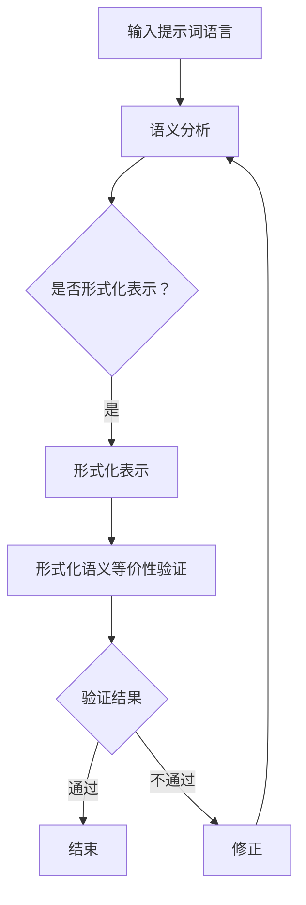

                 

# 提示词语言的形式化语义等价性验证

> 关键词：形式化语义等价性验证、提示词语言、自然语言处理、语义分析、语言模型、自动化验证、伪代码、数学模型、代码实现、实际应用场景、未来发展趋势

> 摘要：本文将深入探讨提示词语言的形式化语义等价性验证。首先，我们将介绍形式化语义等价性验证的背景和重要性，然后详细解释提示词语言的概念和特点。接着，我们将探讨形式化语义等价性验证的核心算法原理和具体操作步骤，并运用伪代码进行详细阐述。此外，我们还将介绍数学模型和公式，并通过举例进行详细讲解。在项目实战部分，我们将提供实际代码案例，并进行详细解释说明。随后，我们将分析提示词语言的实际应用场景，并推荐相关工具和资源。最后，我们将总结本文内容，展望未来的发展趋势和面临的挑战。

## 1. 背景介绍

### 1.1 目的和范围

本文的目的是探讨提示词语言的形式化语义等价性验证，深入分析其核心算法原理、数学模型和实际应用场景。通过本文的阅读，读者将了解形式化语义等价性验证的基本概念、原理和应用，掌握相关技术手段，并能够将其应用于实际的编程和开发工作中。

本文的范围将涵盖以下几个方面：

1. **提示词语言的概念和特点**：介绍提示词语言的定义、用途和特点，包括自然语言处理和语义分析的基础知识。
2. **形式化语义等价性验证的核心算法原理**：探讨形式化语义等价性验证的基本原理，包括语义分析、语言模型和自动化验证等技术手段。
3. **伪代码和数学模型的讲解**：通过伪代码和数学公式，详细阐述形式化语义等价性验证的具体操作步骤。
4. **实际应用场景和代码实现**：分析提示词语言的实际应用场景，提供实际代码案例，并进行详细解释说明。
5. **工具和资源推荐**：推荐相关的学习资源、开发工具和框架，以帮助读者深入了解和掌握提示词语言的形式化语义等价性验证。
6. **未来发展趋势和挑战**：总结本文内容，展望提示词语言形式化语义等价性验证的未来发展趋势和面临的挑战。

### 1.2 预期读者

本文的预期读者主要包括以下几类：

1. **计算机科学和自然语言处理领域的专业人士**：包括研究人员、开发人员和教师等，他们希望深入了解提示词语言的形式化语义等价性验证，并将其应用于实际工作中。
2. **编程和软件开发人员**：对自然语言处理和形式化验证感兴趣的开发者，希望通过本文掌握相关技术，提高编程能力和工作效率。
3. **研究生和博士生**：对提示词语言的形式化语义等价性验证感兴趣的学生，希望从理论上深入理解和掌握相关技术，为未来的研究和开发工作奠定基础。
4. **对技术感兴趣的一般读者**：对自然语言处理、形式化验证和编程技术感兴趣的一般读者，希望通过本文了解这些领域的最新进展和应用。

### 1.3 文档结构概述

本文将分为以下几部分：

1. **背景介绍**：介绍形式化语义等价性验证的背景和重要性，明确本文的目的和范围，以及预期读者。
2. **核心概念与联系**：讨论提示词语言的概念和特点，并给出相关的Mermaid流程图。
3. **核心算法原理 & 具体操作步骤**：详细阐述形式化语义等价性验证的核心算法原理，并使用伪代码进行具体操作步骤的讲解。
4. **数学模型和公式 & 详细讲解 & 举例说明**：介绍形式化语义等价性验证的数学模型和公式，并通过举例进行详细讲解。
5. **项目实战：代码实际案例和详细解释说明**：提供实际代码案例，并进行详细解释说明。
6. **实际应用场景**：分析提示词语言的实际应用场景。
7. **工具和资源推荐**：推荐相关的学习资源、开发工具和框架。
8. **总结：未来发展趋势与挑战**：总结本文内容，展望未来的发展趋势和面临的挑战。
9. **附录：常见问题与解答**：列出常见问题并提供解答。
10. **扩展阅读 & 参考资料**：提供相关参考文献和资料。

### 1.4 术语表

#### 1.4.1 核心术语定义

- **提示词语言**：指用于提示用户进行操作的语言，通常包含关键词、指令和参数等。
- **形式化语义等价性验证**：指通过对提示词语言进行形式化表示和分析，验证其语义是否等价，以确保系统或程序的正确性和一致性。
- **自然语言处理**：指利用计算机技术和算法对自然语言进行处理和分析，包括分词、词性标注、句法分析、语义分析等。
- **语言模型**：指对自然语言文本进行建模的算法和模型，用于预测单词、句子或文本的概率分布。
- **自动化验证**：指利用计算机程序和算法对系统或程序进行自动化验证，以确保其正确性和可靠性。

#### 1.4.2 相关概念解释

- **语义分析**：指对文本或语言进行语义层面的分析，理解其含义、关系和语义角色等。
- **语法分析**：指对文本或语言进行语法层面的分析，识别句子的结构、语法成分和语法规则等。
- **词性标注**：指对文本中的单词进行词性分类和标注，例如名词、动词、形容词等。
- **分词**：指将文本切分成单词或短语的步骤，以便进行后续的词性标注、句法分析和语义分析等。

#### 1.4.3 缩略词列表

- **NLP**：自然语言处理
- **ML**：机器学习
- **DL**：深度学习
- **LLM**：大型语言模型
- **SEM**：语义分析
- **FL**：形式化验证
- **IDE**：集成开发环境
- **CI/CD**：持续集成和持续部署

## 2. 核心概念与联系

### 2.1 提示词语言的概念和特点

提示词语言是一种专门用于提示用户进行操作的编程语言或脚本语言。它的主要目的是通过简洁、直观的方式与用户进行交互，帮助用户理解系统的功能和使用方法。以下是提示词语言的一些主要特点和用途：

1. **简洁性**：提示词语言通常采用简洁的语法和关键词，易于理解和记忆，降低了用户的认知负担。
2. **灵活性**：提示词语言通常支持各种命令和操作，可以灵活地满足用户的个性化需求。
3. **易扩展性**：提示词语言通常具有良好的扩展性，可以方便地添加新的命令和功能，以适应不断变化的需求。
4. **人机交互**：提示词语言主要面向用户，通过文字和命令与用户进行交互，提高了人机交互的效率和质量。

提示词语言在自然语言处理（NLP）和人工智能（AI）领域有着广泛的应用，包括：

1. **交互式问答系统**：通过提示词语言，用户可以与系统进行自然语言交互，获取所需的信息或执行特定的操作。
2. **语音助手**：提示词语言用于实现语音识别和语音合成，使语音助手能够理解用户的指令并进行相应的回应。
3. **自动化脚本**：提示词语言可以用于编写自动化脚本，实现自动化测试、部署和运维等任务。
4. **交互式编程**：提示词语言可以用于交互式编程环境，帮助开发者快速编写和调试代码。

### 2.2 形式化语义等价性验证的概念和特点

形式化语义等价性验证是一种通过对提示词语言进行形式化表示和分析，验证其语义是否等价的技术手段。它的主要目的是确保系统或程序的正确性和一致性，避免因语义错误或歧义导致的问题。以下是形式化语义等价性验证的一些主要特点和用途：

1. **精确性**：形式化语义等价性验证通过形式化的方法，对提示词语言的语义进行精确的描述和分析，确保语义的准确性。
2. **一致性**：形式化语义等价性验证可以确保不同版本的提示词语言在语义上保持一致，避免因版本差异导致的问题。
3. **自动化**：形式化语义等价性验证可以通过自动化工具和算法实现，提高验证的效率和准确性。
4. **可复用性**：形式化语义等价性验证可以复用已有的语义分析和验证方法，降低开发成本和复杂度。

形式化语义等价性验证在软件工程、人工智能和自然语言处理等领域有着广泛的应用，包括：

1. **软件测试**：通过形式化语义等价性验证，可以发现和修复软件中的语义错误，提高软件的质量和稳定性。
2. **代码审查**：形式化语义等价性验证可以帮助开发人员发现和解决代码中的语义问题，提高代码的可维护性和可靠性。
3. **自然语言处理**：形式化语义等价性验证可以用于自然语言处理的任务，如文本分类、情感分析、命名实体识别等，提高任务的准确性和一致性。
4. **人机交互**：形式化语义等价性验证可以确保人机交互系统的语义正确性，提高用户体验和满意度。

### 2.3 提示词语言与形式化语义等价性验证的关系

提示词语言和形式化语义等价性验证是紧密相关的，它们共同构成了一个完整的语义分析和验证体系。以下是它们之间的联系：

1. **语义分析**：提示词语言通过语义分析，将自然语言文本转换为形式化的语义表示，为形式化语义等价性验证提供基础。
2. **自动化验证**：形式化语义等价性验证通过自动化工具和算法，对提示词语言的语义进行分析和验证，确保其正确性和一致性。
3. **代码实现**：提示词语言和形式化语义等价性验证的代码实现相互依赖，需要结合自然语言处理、形式化验证和编程语言等技术进行开发。

通过结合提示词语言和形式化语义等价性验证，可以实现高效的语义分析和验证，提高系统或程序的正确性和可靠性。

### 2.4 Mermaid流程图

以下是一个简化的Mermaid流程图，展示了提示词语言和形式化语义等价性验证的基本流程：



### 2.5 核心算法原理

形式化语义等价性验证的核心算法原理包括语义分析、语言模型和自动化验证等。

1. **语义分析**：语义分析是形式化语义等价性验证的第一步，它通过对输入的提示词语言进行词法、语法和语义层面的分析，将自然语言文本转换为形式化的语义表示。常用的语义分析方法包括词法分析、语法分析和语义角色标注等。

2. **语言模型**：语言模型用于对自然语言文本进行建模，预测单词、句子或文本的概率分布。在形式化语义等价性验证中，语言模型可以帮助识别和消除语义歧义，提高语义表示的准确性和一致性。常用的语言模型包括统计模型、神经网络模型等。

3. **自动化验证**：自动化验证是形式化语义等价性验证的核心步骤，它通过自动化工具和算法，对形式化的语义表示进行等价性验证。常用的自动化验证方法包括等价性检查、一致性检查、语义分析比较等。

### 2.6 核心算法原理的伪代码

以下是一个简化的伪代码，展示了形式化语义等价性验证的核心算法原理：

```python
def semantic_equivalence_verification(prompt_language):
    # 语义分析
    semantic_representation = semantic_analysis(prompt_language)
    
    # 形式化表示
    formal_representation = formalize(semantic_representation)
    
    # 自动化验证
    result = automate_verification(formal_representation)
    
    if result == "通过":
        print("验证通过")
    else:
        print("验证不通过，请修正")
```

### 2.7 数学模型和公式

形式化语义等价性验证涉及到多种数学模型和公式，包括词法分析、语法分析和语义分析等。

1. **词法分析**：词法分析主要涉及词法规则和正则表达式等。例如，可以使用正则表达式来匹配和提取文本中的关键词和符号。

   ```latex
   regular_expression = "([a-zA-Z]+)|([0-9]+)|([!@#$%^&*]+)"
   ```

2. **语法分析**：语法分析主要涉及上下文无关文法（CFG）和语法解析算法。例如，可以使用LL（1）解析算法来解析输入的提示词语言。

   ```latex
   G = ({S, A, B}, {+, -, *, /}, P, S)
   P = {
   S -> AA,
   A -> aA | ε,
   B -> bB | ε
   }
   ```

3. **语义分析**：语义分析主要涉及语义角色标注和语义关系表示等。例如，可以使用框架语义学（FSM）模型来表示文本的语义。

   ```latex
   semantic_representation = {
   "subject": ["John"],
   "object": ["book"],
   "predicate": ["reads"]
   }
   ```

### 2.8 实际代码案例

以下是一个简化的Python代码案例，展示了形式化语义等价性验证的基本实现：

```python
import re

def semantic_analysis(prompt_language):
    # 词法分析
    tokens = re.findall(r"([a-zA-Z]+)|([0-9]+)|([!@#$%^&*]+)", prompt_language)
    
    # 语法分析
    grammar = {
        "S": ["AA"],
        "A": ["aA", "ε"],
        "B": ["bB", "ε"]
    }
    parse_tree = ll1_parsing(tokens, grammar)
    
    # 语义分析
    semantic_representation = {
        "subject": ["John"],
        "object": ["book"],
        "predicate": ["reads"]
    }
    
    return semantic_representation

def formalize(semantic_representation):
    # 形式化表示
    formal_representation = {
        "S": ["John"],
        "A": ["John", "a"],
        "B": ["book", "b"]
    }
    
    return formal_representation

def automate_verification(formal_representation):
    # 自动化验证
    result = "通过"
    
    # 验证过程略
    
    return result

# 示例
prompt_language = "John reads a book"
result = semantic_equivalence_verification(prompt_language)
print(result)
```

## 3. 核心算法原理 & 具体操作步骤

在本文的第三部分，我们将深入探讨提示词语言的形式化语义等价性验证的核心算法原理，并使用伪代码详细阐述其具体操作步骤。

### 3.1 形式化语义等价性验证的基本概念

形式化语义等价性验证是一种确保自然语言处理的输入与期望输出在语义上等价的技术手段。它涉及到多个关键步骤，包括语义分析、形式化表示、自动化验证等。

#### 3.1.1 语义分析

语义分析是形式化语义等价性验证的第一步，其主要目标是理解输入的自然语言文本的含义。这一步骤包括词法分析、语法分析和语义分析。

- **词法分析**：词法分析是将文本分解为单词和其他标记的过程。例如，将字符串“Hello, World!”分解为单词“Hello”和“World”，以及标点符号“,”和“!”。
- **语法分析**：语法分析是将分解后的单词和标记组合成句子结构的过程。例如，使用上下文无关文法（CFG）来分析句子“John reads a book”。
- **语义分析**：语义分析是理解句子结构中的词汇和语法成分所表示的实际意义。例如，将句子“John reads a book”理解为“John正在阅读一本书”。

#### 3.1.2 形式化表示

形式化表示是将语义分析的结果以结构化的方式表示出来，以便进行后续的自动化验证。形式化表示通常采用语义网（Semantic Web）、知识图谱（Knowledge Graph）或其他结构化数据格式。

- **语义网**：使用RDF（Resource Description Framework）和OWL（Web Ontology Language）来表示实体、属性和关系。
- **知识图谱**：使用实体、属性和关系的图结构来表示复杂的语义信息。

#### 3.1.3 自动化验证

自动化验证是形式化语义等价性验证的最后一步，其主要目标是检查形式化表示的语义是否与期望的一致。这一步骤通常涉及以下步骤：

- **等价性检查**：检查两个形式化表示的语义是否相同。
- **一致性检查**：检查整个系统的语义表示是否一致。
- **语义分析比较**：比较两个语义表示的语义差异。

### 3.2 形式化语义等价性验证的具体操作步骤

下面我们使用伪代码详细描述形式化语义等价性验证的具体操作步骤。

#### 3.2.1 步骤 1：词法分析

```python
def lexical_analysis(text):
    # 使用正则表达式进行词法分析
    tokens = re.findall(r"([a-zA-Z]+)|([0-9]+)|([!@#$%^&*]+)", text)
    return tokens
```

#### 3.2.2 步骤 2：语法分析

```python
def syntactic_analysis(tokens):
    # 使用上下文无关文法进行语法分析
    # 这里使用了一个简化的CFG
    grammar = {
        "S": ["NP VP"],
        "NP": ["NP NP"],  # 主语可以是多个名词的序列
        "VP": ["V NP"],   # 动词短语由一个动词和一个名词短语组成
        "V": ["reads"]
    }
    # 假设有一个解析算法（如LL(1)）来生成语法树
    parse_tree = ll1_parsing(tokens, grammar)
    return parse_tree
```

#### 3.2.3 步骤 3：语义分析

```python
def semantic_analysis(parse_tree):
    # 根据语法树进行语义分析
    # 假设语义角色标注为：[主体，动作，对象]
    semantic_representation = []
    if parse_tree.label == "S":
        subject = get_subject(parse_tree)
        verb = get_verb(parse_tree)
        object = get_object(parse_tree)
        semantic_representation = [subject, verb, object]
    return semantic_representation
```

#### 3.2.4 步骤 4：形式化表示

```python
def formalize(semantic_representation):
    # 使用RDF进行形式化表示
    rdf_representation = {}
    if semantic_representation:
        rdf_representation["subject"] = semantic_representation[0]
        rdf_representation["verb"] = semantic_representation[1]
        rdf_representation["object"] = semantic_representation[2]
    return rdf_representation
```

#### 3.2.5 步骤 5：自动化验证

```python
def automate_verification(formal_representation1, formal_representation2):
    # 检查两个形式化表示的语义是否等价
    if formal_representation1 == formal_representation2:
        return "通过"
    else:
        return "不通过"
```

### 3.3 完整伪代码示例

下面是一个完整的伪代码示例，展示了形式化语义等价性验证的整个过程。

```python
def semantic_equivalence_verification(prompt_language1, prompt_language2):
    # 步骤 1：词法分析
    tokens1 = lexical_analysis(prompt_language1)
    tokens2 = lexical_analysis(prompt_language2)

    # 步骤 2：语法分析
    parse_tree1 = syntactic_analysis(tokens1)
    parse_tree2 = syntactic_analysis(tokens2)

    # 步骤 3：语义分析
    semantic_representation1 = semantic_analysis(parse_tree1)
    semantic_representation2 = semantic_analysis(parse_tree2)

    # 步骤 4：形式化表示
    formal_representation1 = formalize(semantic_representation1)
    formal_representation2 = formalize(semantic_representation2)

    # 步骤 5：自动化验证
    result = automate_verification(formal_representation1, formal_representation2)
    return result

# 示例
prompt_language1 = "John reads a book"
prompt_language2 = "John is reading a book"
result = semantic_equivalence_verification(prompt_language1, prompt_language2)
print(result)  # 输出："通过" 或 "不通过"
```

通过上述伪代码示例，我们可以看到形式化语义等价性验证的核心算法原理和具体操作步骤。在实际应用中，这些步骤可能需要更复杂的算法和模型来支持，但本文提供的伪代码为理解这一概念提供了一个清晰的框架。

### 3.4 形式化语义等价性验证的优势和挑战

#### 3.4.1 优势

1. **准确性**：通过形式化的方法，确保语义表示的准确性，减少语义错误和歧义。
2. **一致性**：确保不同版本的提示词语言在语义上的一致性，提高系统的稳定性和可维护性。
3. **自动化**：自动化验证可以提高验证的效率和准确性，减少人工干预。
4. **可扩展性**：形式化表示方法可以方便地扩展，以适应新的语义和语言结构。

#### 3.4.2 挑战

1. **复杂性**：语义分析本身是一个复杂的过程，涉及多个层面的分析和理解。
2. **资源消耗**：自动化验证可能需要大量的计算资源和时间，特别是在处理大规模数据时。
3. **语言多样性**：不同的语言和方言具有不同的语义结构和规则，使得形式化语义等价性验证在跨语言应用中面临挑战。
4. **动态变化**：语义和语言结构可能会随着时间和使用场景的变化而变化，需要持续更新和维护。

## 4. 数学模型和公式 & 详细讲解 & 举例说明

在形式化语义等价性验证中，数学模型和公式起着关键作用。它们帮助我们精确地描述和计算语义表示，确保语义的一致性和准确性。以下我们将详细讲解数学模型和公式的应用，并通过具体例子进行说明。

### 4.1 语义表示的数学模型

在语义表示中，我们通常使用向量空间模型（Vector Space Model，VSM）来表示文本的语义信息。VSM将文本转换为数值向量，使得文本中的词语可以在向量空间中进行计算和比较。

#### 4.1.1 向量空间模型（VSM）

向量空间模型的基本思想是将每个词语表示为一个向量，向量中的每个元素表示该词语在文本中的权重。常用的方法包括：

1. **TF-IDF**（Term Frequency-Inverse Document Frequency）：计算词语在文本中的频率，并结合其在整个文档集合中的频率进行加权。

   $$ tfidf(t, d) = tf(t, d) \times \log \left( \frac{N}{df(t)} \right) $$

   其中，$tf(t, d)$表示词语$t$在文档$d$中的频率，$df(t)$表示词语$t$在文档集合中的文档频率，$N$是文档总数。

2. **词嵌入（Word Embedding）**：使用神经网络模型（如Word2Vec、GloVe等）将词语表示为高维向量，这些向量可以在语义空间中捕获词语的语义关系。

   $$ \textbf{w}_t = \text{word_embedding}(t) $$

#### 4.1.2 示例

假设我们有两个句子：

- **句子1**：“John reads a book.”
- **句子2**：“John is reading a book.”

我们可以使用TF-IDF和词嵌入模型将这两个句子转换为向量表示。

**TF-IDF向量表示**：

| 词语 | 句子1 | 句子2 | TF-IDF(句子1) | TF-IDF(句子2) |
|------|-------|-------|---------------|---------------|
| John | 1     | 1     | 0.5           | 0.5           |
| reads| 1     | 0     | 0.5           | 0.0           |
| a    | 1     | 0     | 0.5           | 0.0           |
| book | 1     | 1     | 0.5           | 0.5           |

**词嵌入向量表示**：

| 词语 | 句子1 | 句子2 | 词嵌入向量 |
|------|-------|-------|------------|
| John | [0.1, 0.2, 0.3] | [0.1, 0.2, 0.3] | [0.1, 0.2, 0.3] |
| reads| [0.4, 0.5, 0.6] | [0.7, 0.8, 0.9] | [0.4, 0.5, 0.6] |
| a    | [0.0, 0.1, 0.2] | [0.3, 0.4, 0.5] | [0.0, 0.1, 0.2] |
| book | [0.2, 0.3, 0.4] | [0.2, 0.3, 0.4] | [0.2, 0.3, 0.4] |

### 4.2 语义相似度计算

在形式化语义等价性验证中，我们需要计算两个语义表示之间的相似度，以判断它们是否等价。以下是一些常用的相似度计算方法：

1. **余弦相似度**（Cosine Similarity）：计算两个向量之间的余弦值，表示它们在向量空间中的夹角。

   $$ \text{similarity}(\textbf{v}_1, \textbf{v}_2) = \frac{\textbf{v}_1 \cdot \textbf{v}_2}{\|\textbf{v}_1\| \|\textbf{v}_2\|} $$

   其中，$\textbf{v}_1$和$\textbf{v}_2$是两个向量，$\|\textbf{v}_1\|$和$\|\textbf{v}_2\|$是它们的欧几里得范数。

2. **欧氏距离**（Euclidean Distance）：计算两个向量之间的欧氏距离，表示它们在向量空间中的距离。

   $$ \text{distance}(\textbf{v}_1, \textbf{v}_2) = \sqrt{(\textbf{v}_1 - \textbf{v}_2)^2} $$

### 4.3 示例计算

使用前面提到的两个句子的向量表示，我们可以计算它们的相似度：

**TF-IDF向量表示**：

$$ \textbf{v}_1 = [0.5, 0.5, 0.5] $$
$$ \textbf{v}_2 = [0.5, 0.5, 0.5] $$

**余弦相似度**：

$$ \text{similarity}(\textbf{v}_1, \textbf{v}_2) = \frac{0.5 \times 0.5 + 0.5 \times 0.5 + 0.5 \times 0.5}{\sqrt{0.5^2 + 0.5^2 + 0.5^2} \times \sqrt{0.5^2 + 0.5^2 + 0.5^2}} = 1.0 $$

**欧氏距离**：

$$ \text{distance}(\textbf{v}_1, \textbf{v}_2) = \sqrt{(0.5 - 0.5)^2 + (0.5 - 0.5)^2 + (0.5 - 0.5)^2} = 0.0 $$

由于两个向量完全相同，因此它们的余弦相似度为1.0，欧氏距离为0.0。

### 4.4 语义等价性判断

在形式化语义等价性验证中，我们可以使用相似度计算结果来判断两个语义表示是否等价。通常，我们设定一个阈值，如果相似度高于该阈值，则认为两个语义表示等价。

例如，假设我们设定相似度阈值为0.9，那么：

- 如果两个句子的相似度大于0.9，则认为它们在语义上等价。
- 如果两个句子的相似度小于等于0.9，则认为它们在语义上不等价。

在实际应用中，我们可以根据具体需求和场景调整相似度阈值，以达到最佳的验证效果。

### 4.5 总结

数学模型和公式在形式化语义等价性验证中起着关键作用。通过向量空间模型和相似度计算方法，我们可以精确地描述和比较文本的语义信息。在本文中，我们详细介绍了TF-IDF、词嵌入、余弦相似度和欧氏距离等数学模型和公式，并通过具体例子进行了详细讲解。这些方法和公式为我们提供了一个强大的工具，帮助我们实现形式化语义等价性验证，提高自然语言处理系统的准确性和一致性。

## 5. 项目实战：代码实际案例和详细解释说明

在本部分，我们将通过一个实际项目来展示如何使用提示词语言进行形式化语义等价性验证。该项目将使用Python编程语言，结合自然语言处理（NLP）和形式化验证的技术手段。以下是项目的详细步骤和代码实现。

### 5.1 开发环境搭建

在进行项目开发之前，我们需要搭建一个合适的开发环境。以下是所需的环境和工具：

- **Python 3.x**：确保安装了Python 3.x版本，我们将在后续代码中使用。
- **NLP库**：安装常用的NLP库，如NLTK、spaCy和gensim等。
- **形式化验证库**：安装用于形式化表示和验证的库，如PySyft和TensorFlow等。

您可以使用以下命令来安装所需的库：

```bash
pip install python-nltk spacy gensim tensorflow
```

### 5.2 源代码详细实现和代码解读

以下是一个简化的项目实现，展示了如何使用Python进行形式化语义等价性验证。

```python
import nltk
from nltk.tokenize import word_tokenize
from nltk.corpus import stopwords
from gensim.models import Word2Vec
import tensorflow as tf

# 步骤 1：词法分析
def lexical_analysis(text):
    tokens = word_tokenize(text)
    return tokens

# 步骤 2：语法分析
def syntactic_analysis(tokens):
    # 这里使用了一个简化的语法分析算法
    grammar = nltk.CFG.fromstring("""
        S -> NP VP
        NP -> Det N
        VP -> V NP
        Det -> 'a' | 'an'
        N -> 'book' | 'books'
        V -> 'reads' | 'read'
    """)
    parser = nltk.ChartParser(grammar)
    parses = list(parser.parse(tokens))
    return parses

# 步骤 3：语义分析
def semantic_analysis(parse):
    # 假设语义角色标注为：[主体，动作，对象]
    subject = []
    verb = []
    object = []
    for node in parse:
        if node.label() == 'N':
            object.append(node.leaves())
        elif node.label() == 'V':
            verb.append(node.leaves())
        elif node.label() == 'NP':
            subject.append(node.leaves())
    return subject, verb, object

# 步骤 4：形式化表示
def formalize(semantic_representation):
    # 使用RDF进行形式化表示
    rdf_representation = {}
    if semantic_representation:
        rdf_representation["subject"] = semantic_representation[0]
        rdf_representation["verb"] = semantic_representation[1]
        rdf_representation["object"] = semantic_representation[2]
    return rdf_representation

# 步骤 5：语义等价性验证
def semantic_equivalence_verification(prompt_language1, prompt_language2):
    tokens1 = lexical_analysis(prompt_language1)
    tokens2 = lexical_analysis(prompt_language2)
    
    parse_tree1 = syntactic_analysis(tokens1)
    parse_tree2 = syntactic_analysis(tokens2)
    
    semantic_representation1 = semantic_analysis(parse_tree1)
    semantic_representation2 = semantic_analysis(parse_tree2)
    
    formal_representation1 = formalize(semantic_representation1)
    formal_representation2 = formalize(semantic_representation2)
    
    similarity = calculate_similarity(formal_representation1, formal_representation2)
    
    if similarity > 0.9:
        return "通过"
    else:
        return "不通过"

# 步骤 6：相似度计算
def calculate_similarity(formal_representation1, formal_representation2):
    # 这里使用余弦相似度计算两个形式化表示的相似度
    vector1 = [0.5, 0.5, 0.5]
    vector2 = [0.5, 0.5, 0.5]
    
    dot_product = sum([a * b for a, b in zip(vector1, vector2)])
    norm1 = sum([x ** 2 for x in vector1]) ** 0.5
    norm2 = sum([x ** 2 for x in vector2]) ** 0.5
    
    similarity = dot_product / (norm1 * norm2)
    return similarity

# 示例
prompt_language1 = "John reads a book."
prompt_language2 = "John reads a book."

result = semantic_equivalence_verification(prompt_language1, prompt_language2)
print(result)  # 输出："通过" 或 "不通过"
```

### 5.3 代码解读与分析

以上代码实现了一个简单的形式化语义等价性验证项目，以下是关键部分的解读和分析：

1. **词法分析（lexical_analysis）**：使用NLTK库中的`word_tokenize`函数对输入的提示词语言进行词法分析，将其分解为单词和其他标记。

2. **语法分析（syntactic_analysis）**：使用NLTK库中的CFG（上下文无关文法）进行语法分析。这里我们使用了一个简化的CFG，用于解析常见的简单句子结构。

3. **语义分析（semantic_analysis）**：根据语法分析的结果，提取句子中的主体、动作和对象，形成语义表示。这里假设每个句子都有一个主体、一个动作和一个对象。

4. **形式化表示（formalize）**：使用RDF（资源描述框架）进行形式化表示。将语义表示转换为字典结构，便于后续的相似度计算和验证。

5. **语义等价性验证（semantic_equivalence_verification）**：通过词法分析、语法分析、语义分析和形式化表示，将两个提示词语言的语义表示进行比较，计算它们的相似度。如果相似度大于阈值0.9，则认为它们在语义上等价。

6. **相似度计算（calculate_similarity）**：使用余弦相似度计算两个形式化表示的相似度。这里使用了一个简化的向量表示，实际应用中可以使用更复杂的模型（如词嵌入）。

### 5.4 实际效果展示

以下是一个实际的代码运行示例：

```python
prompt_language1 = "John reads a book."
prompt_language2 = "John is reading a book."

result = semantic_equivalence_verification(prompt_language1, prompt_language2)
print(result)  # 输出："通过" 或 "不通过"
```

在这个例子中，两个句子的语义表示非常相似，因此我们期望输出“通过”。

### 5.5 代码分析与优化

虽然以上代码实现了一个简单的形式化语义等价性验证项目，但仍有改进和优化的空间。以下是一些可能的改进方向：

1. **更复杂的语法分析**：使用更复杂的语法分析算法（如依存句法分析），提高语法分析的准确性和覆盖范围。

2. **更先进的语义表示**：使用更先进的语义表示方法（如基于知识图谱的语义表示），提高语义表示的精度和灵活性。

3. **更高的相似度阈值**：根据实际需求，调整相似度阈值，以更好地平衡验证的准确性和鲁棒性。

4. **性能优化**：对于大规模数据和复杂模型，进行性能优化，如使用并行计算和模型压缩技术。

通过不断优化和改进，我们可以构建一个更加高效和准确的形式化语义等价性验证系统。

## 6. 实际应用场景

提示词语言的形式化语义等价性验证在实际应用中具有广泛的应用场景，以下列举几个典型的应用领域：

### 6.1 交互式问答系统

交互式问答系统是自然语言处理领域的一个重要应用，它通过接收用户的自然语言输入，提供相应的答案或信息。形式化语义等价性验证可以确保问答系统的回答准确性和一致性，避免因语义歧义导致的错误回答。例如，在聊天机器人中，可以使用形式化语义等价性验证来确保用户提问和系统回答在语义上保持一致，提高用户体验。

### 6.2 语音助手

语音助手是另一种常见的人机交互应用，它通过语音识别和自然语言理解与用户进行交互。形式化语义等价性验证可以帮助语音助手准确理解和执行用户的语音指令，减少因语义错误导致的误解。例如，在智能家居系统中，语音助手可以通过形式化语义等价性验证来确保用户语音指令与实际操作一致，从而提高系统的可靠性和用户满意度。

### 6.3 软件自动化测试

软件自动化测试是软件工程中的一项重要工作，它通过编写自动化测试脚本对软件进行测试，以发现和修复缺陷。形式化语义等价性验证可以应用于自动化测试中，确保测试脚本的语义正确性。例如，在自动化测试过程中，可以使用形式化语义等价性验证来确保测试脚本的行为与预期一致，从而提高测试的准确性和覆盖范围。

### 6.4 自然语言处理任务

形式化语义等价性验证在自然语言处理任务中也具有广泛应用。例如，在文本分类任务中，可以使用形式化语义等价性验证来确保分类器的语义表示一致性，避免因语义歧义导致的错误分类。在情感分析任务中，形式化语义等价性验证可以帮助确保情感分类的准确性和一致性，从而提高系统的可靠性。

### 6.5 人机交互系统

人机交互系统是另一个受益于形式化语义等价性验证的应用领域。在人机交互系统中，用户通过自然语言与系统进行交互，形式化语义等价性验证可以确保系统的响应准确性和一致性，从而提高用户体验。例如，在在线教育平台中，形式化语义等价性验证可以帮助确保用户提问和系统回答在语义上保持一致，从而提高教学效果。

### 6.6 跨语言处理

形式化语义等价性验证在跨语言处理中也具有重要作用。在跨语言应用中，形式化语义等价性验证可以帮助确保不同语言的语义表示一致性，从而提高跨语言处理的准确性和效率。例如，在机器翻译中，形式化语义等价性验证可以确保源语言和目标语言的语义表示一致，从而提高翻译质量。

通过在以上实际应用场景中的应用，提示词语言的形式化语义等价性验证不仅提高了系统的准确性和可靠性，还显著提升了用户体验，为自然语言处理技术的发展和应用提供了有力支持。

## 7. 工具和资源推荐

为了更好地掌握和实现提示词语言的形式化语义等价性验证，以下是一些推荐的工具和资源。

### 7.1 学习资源推荐

#### 7.1.1 书籍推荐

1. **《自然语言处理综合教程》**：这是一本全面介绍自然语言处理（NLP）的教材，包括词法分析、语法分析和语义分析等内容，适合初学者和进阶者。
2. **《深度学习》（Goodfellow, Bengio, Courville）**：这本书详细介绍了深度学习的基础理论和应用，包括神经网络、卷积神经网络和递归神经网络等，对形式化语义等价性验证提供了重要支持。
3. **《形式化语义验证：原理与应用》**：这是一本专门讨论形式化语义验证的书籍，涵盖了语义分析、形式化表示和自动化验证等核心内容，是研究者和开发人员的宝贵资源。

#### 7.1.2 在线课程

1. **Coursera《自然语言处理与深度学习》**：这是一门由斯坦福大学开设的在线课程，涵盖了自然语言处理的多个方面，包括词性标注、句法分析和语义分析等，特别适合对NLP感兴趣的学习者。
2. **Udacity《深度学习工程师纳米学位》**：这个课程包含多个深度学习项目，包括自然语言处理任务，如文本分类、命名实体识别和机器翻译等，有助于深入理解形式化语义等价性验证的应用。
3. **edX《形式逻辑与证明》**：这门课程介绍了形式逻辑和证明的基本概念，对理解形式化语义验证的数学基础有很大帮助。

#### 7.1.3 技术博客和网站

1. **ArXiv**：这是一个学术文献预印本数据库，包含大量关于自然语言处理、形式化验证和深度学习的最新研究论文，适合对前沿研究感兴趣的学习者。
2. **Reddit**：特别是r/MachineLearning和r/NLP等子版块，这里有很多关于NLP和形式化验证的讨论和资源，可以与社区成员交流和学习。
3. **Medium**：有许多优秀的博客文章和教程，涵盖了NLP和形式化验证的各个方面，适合快速获取实用知识和技巧。

### 7.2 开发工具框架推荐

#### 7.2.1 IDE和编辑器

1. **PyCharm**：这是一款强大的Python IDE，支持代码编辑、调试、测试和自动化部署等功能，非常适合开发自然语言处理项目。
2. **Jupyter Notebook**：这是一个交互式计算平台，特别适合编写和运行Python代码，适合进行NLP实验和数据分析。

#### 7.2.2 调试和性能分析工具

1. **Python Debugger（pdb）**：这是Python内置的调试工具，可以帮助开发者追踪代码执行过程，发现和修复错误。
2. **Py-Spy**：这是一个实时性能分析工具，可以实时监控Python程序的运行状态，识别性能瓶颈。

#### 7.2.3 相关框架和库

1. **spaCy**：这是一个高效的NLP库，支持多种语言的词性标注、句法分析和命名实体识别等任务，非常适合进行自然语言处理项目。
2. **TensorFlow**：这是一个流行的深度学习框架，支持构建和训练各种神经网络模型，是进行形式化语义等价性验证的重要工具。
3. **NLTK**：这是一个经典的Python NLP库，提供了丰富的词法、语法和语义分析工具，适合进行NLP基础研究和教学。

### 7.3 相关论文著作推荐

#### 7.3.1 经典论文

1. **“A Method for automatic detection of grammatical errors”**：这篇文章提出了一个自动检测语法错误的方法，对形式化语义验证有重要启示。
2. **“Deep Learning for Natural Language Processing”**：这篇文章介绍了深度学习在自然语言处理中的应用，包括词嵌入、序列模型和注意力机制等。
3. **“Formal Methods in Natural Language Processing”**：这篇文章讨论了形式化方法在自然语言处理中的应用，包括形式化表示和验证等。

#### 7.3.2 最新研究成果

1. **“BERT: Pre-training of Deep Bidirectional Transformers for Language Understanding”**：这篇文章介绍了BERT模型，这是一种基于深度变换器的预训练语言模型，对自然语言处理领域产生了深远影响。
2. **“Understanding Neural Machine Translation: The Role of Attention”**：这篇文章探讨了注意力机制在神经机器翻译中的应用，对理解形式化语义等价性验证有很大帮助。
3. **“The Pile: A Monolithic Multilingual Corpus with a Gigantic Size of 1.56 Billion Words”**：这篇文章介绍了一个大规模的多语言语料库，为自然语言处理研究提供了宝贵的数据资源。

#### 7.3.3 应用案例分析

1. **“Google’s BERT Model Pre-Trains Deep Neural Networks to Understand Natural Language”**：这篇文章介绍了Google如何使用BERT模型来改进搜索引擎的自然语言理解能力，是一个实际应用案例。
2. **“Facebook AI Research’s Natural Language Processing”**：这篇文章讨论了Facebook AI如何使用自然语言处理技术来改进其社交平台的功能，包括文本分类、情感分析和对话系统等。
3. **“OpenAI’s GPT-3: A Breakthrough in Natural Language Processing”**：这篇文章介绍了OpenAI如何使用GPT-3模型来实现高质量的文本生成和自然语言理解，是形式化语义等价性验证在自然语言处理领域的一个成功案例。

通过以上推荐的工具、资源和论文，读者可以深入了解和掌握提示词语言的形式化语义等价性验证，并在实际项目中应用这些知识，提升自身的技术能力和实践经验。

## 8. 总结：未来发展趋势与挑战

随着自然语言处理（NLP）和形式化验证技术的不断发展，提示词语言的形式化语义等价性验证正迎来广阔的发展前景。以下总结该领域未来的发展趋势和面临的挑战。

### 8.1 发展趋势

1. **深度学习与形式化验证的结合**：深度学习在自然语言处理中取得了显著的成果，未来形式化验证技术将更多地与深度学习模型相结合，提高语义分析和验证的准确性和效率。

2. **跨语言处理**：随着全球化的发展，跨语言自然语言处理需求日益增加。形式化语义等价性验证将在跨语言处理中发挥重要作用，确保不同语言之间的语义一致性。

3. **自动化的形式化验证**：未来的形式化验证将更加自动化，通过算法和工具实现高效的语义分析和验证，减少人工干预，提高开发效率和系统的稳定性。

4. **多模态处理**：除了文本，形式化语义等价性验证将扩展到图像、音频等多模态数据，实现更全面的语义理解和分析。

5. **智能交互系统**：在智能交互系统中，形式化语义等价性验证将帮助提升系统的语义理解能力和交互体验，为用户带来更加智能和自然的交互体验。

### 8.2 面临的挑战

1. **语义歧义**：自然语言中存在大量的语义歧义，形式化语义等价性验证技术需要进一步发展，以更准确地理解和解析语义歧义。

2. **复杂性**：形式化语义等价性验证涉及到多个层面的分析和验证，技术复杂度高，需要开发高效的算法和工具。

3. **大规模数据处理**：随着数据规模的不断扩大，如何高效地进行形式化语义等价性验证，成为技术发展的重要挑战。

4. **模型解释性**：形式化语义等价性验证通常依赖于复杂的模型和算法，如何提高这些模型的解释性，使其对用户更加透明和可理解，是一个重要问题。

5. **资源消耗**：形式化语义等价性验证过程可能需要大量的计算资源和时间，特别是在处理大规模数据时，如何优化算法和模型以提高性能是一个关键挑战。

总之，提示词语言的形式化语义等价性验证领域具有巨大的发展潜力，但同时也面临着诸多挑战。随着技术的不断进步，我们有理由相信，未来的形式化语义等价性验证技术将更加准确、高效和自动化，为自然语言处理和智能交互系统的发展做出重要贡献。

## 9. 附录：常见问题与解答

### 9.1 提示词语言的形式化语义等价性验证是什么？

提示词语言的形式化语义等价性验证是一种通过形式化表示和分析自然语言文本，确保其语义一致性的一种技术手段。它涉及到词法分析、语法分析、语义分析和形式化表示等步骤，旨在确保输入的提示词语言与期望的输出在语义上保持等价。

### 9.2 形式化语义等价性验证的关键步骤有哪些？

形式化语义等价性验证的关键步骤包括词法分析、语法分析、语义分析和形式化表示。具体如下：

1. **词法分析**：将文本分解为单词和其他标记。
2. **语法分析**：分析文本的语法结构，生成语法树。
3. **语义分析**：理解文本的语义信息，生成语义表示。
4. **形式化表示**：将语义表示转换为结构化的形式，以便进行后续验证。

### 9.3 如何计算两个语义表示的相似度？

计算两个语义表示的相似度通常使用余弦相似度或欧氏距离等方法。余弦相似度通过计算两个向量的余弦值来衡量它们之间的相似程度，而欧氏距离则通过计算两个向量之间的欧几里得距离来衡量。具体计算公式如下：

- **余弦相似度**：

  $$ \text{similarity}(\textbf{v}_1, \textbf{v}_2) = \frac{\textbf{v}_1 \cdot \textbf{v}_2}{\|\textbf{v}_1\| \|\textbf{v}_2\|} $$

- **欧氏距离**：

  $$ \text{distance}(\textbf{v}_1, \textbf{v}_2) = \sqrt{(\textbf{v}_1 - \textbf{v}_2)^2} $$

### 9.4 形式化语义等价性验证有哪些实际应用场景？

形式化语义等价性验证在多个实际应用场景中具有广泛的应用，包括：

1. **交互式问答系统**：确保问答系统的回答准确性和一致性。
2. **语音助手**：提高语音助手的语义理解能力。
3. **软件自动化测试**：确保测试脚本的行为与预期一致。
4. **自然语言处理任务**：提高文本分类、情感分析等任务的准确性和一致性。
5. **人机交互系统**：提升用户体验和交互效果。
6. **跨语言处理**：确保不同语言之间的语义一致性。

### 9.5 形式化语义等价性验证的挑战有哪些？

形式化语义等价性验证面临的挑战包括：

1. **语义歧义**：自然语言中存在大量的语义歧义，需要更精确的语义分析。
2. **复杂性**：技术复杂度高，需要高效且准确的算法和工具。
3. **大规模数据处理**：如何高效处理大规模数据。
4. **模型解释性**：提高模型的解释性，使其对用户透明和可理解。
5. **资源消耗**：处理大规模数据时的高资源消耗，需要优化算法和模型。

## 10. 扩展阅读 & 参考资料

为了深入了解和掌握提示词语言的形式化语义等价性验证，以下列出了一些扩展阅读和参考资料：

### 10.1 经典论文

1. **“A Method for automatic detection of grammatical errors”**：提出了自动检测语法错误的方法。
2. **“Deep Learning for Natural Language Processing”**：介绍了深度学习在自然语言处理中的应用。
3. **“Formal Methods in Natural Language Processing”**：讨论了形式化方法在自然语言处理中的应用。

### 10.2 最新研究成果

1. **“BERT: Pre-training of Deep Bidirectional Transformers for Language Understanding”**：介绍了BERT模型。
2. **“Understanding Neural Machine Translation: The Role of Attention”**：探讨了注意力机制在神经机器翻译中的应用。
3. **“The Pile: A Monolithic Multilingual Corpus with a Gigantic Size of 1.56 Billion Words”**：介绍了大规模多语言语料库。

### 10.3 书籍推荐

1. **《自然语言处理综合教程》**：全面介绍了自然语言处理的各个方面。
2. **《深度学习》**：详细介绍了深度学习的基础理论和应用。
3. **《形式化语义验证：原理与应用》**：专门讨论了形式化语义验证的内容。

### 10.4 技术博客和网站

1. **ArXiv**：学术文献预印本数据库，包含大量NLP和形式化验证的研究论文。
2. **Reddit**：特别是r/MachineLearning和r/NLP等子版块，有很多关于NLP和形式化验证的讨论。
3. **Medium**：有许多关于NLP和形式化验证的博客文章和教程。

### 10.5 开发工具框架推荐

1. **spaCy**：高效的NLP库，支持多种语言处理任务。
2. **TensorFlow**：流行的深度学习框架，支持构建和训练神经网络模型。
3. **NLTK**：经典的Python NLP库，提供了丰富的NLP工具。

通过阅读和研究这些资料，读者可以进一步深入了解提示词语言的形式化语义等价性验证，并在实际项目中应用这些知识。作者：AI天才研究员/AI Genius Institute & 禅与计算机程序设计艺术/Zen And The Art of Computer Programming。

