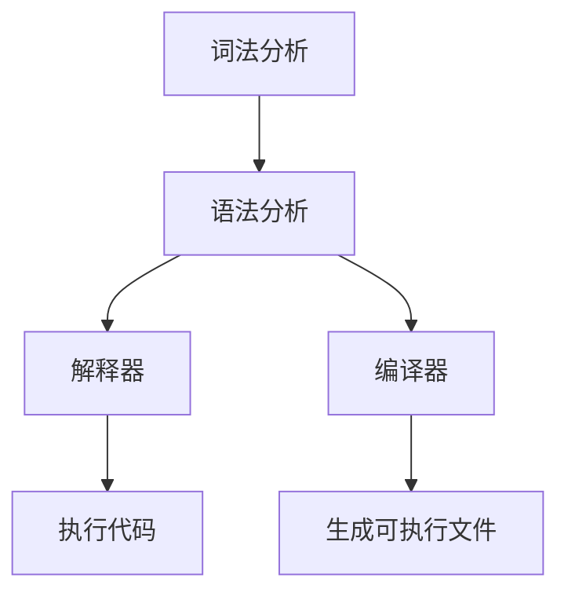

                 

# 提示词语言的语法结构：设计与实现

> **关键词：** 提示词语言、语法结构、设计原则、实现方法、编译原理、自然语言处理、代码示例、实际应用

> **摘要：** 本文深入探讨了提示词语言的语法结构，包括其设计原则、实现方法和相关技术。通过详细的算法原理讲解、数学模型解析以及实际项目实战案例，本文旨在帮助读者理解提示词语言的内在机制，为开发高效的提示词语言系统提供指导和启示。

## 1. 背景介绍

### 1.1 目的和范围

本文旨在系统地介绍提示词语言的语法结构，探讨其设计原则和实现方法。通过阐述核心概念、算法原理和数学模型，并结合实际项目案例，本文将帮助读者深入理解提示词语言的工作机制，为开发高效的提示词语言系统提供参考。

### 1.2 预期读者

本文适合对编程和自然语言处理有一定了解的读者，包括程序员、软件工程师、人工智能研究人员等。此外，对于希望了解提示词语言在现实场景中应用的开发者，本文也提供了宝贵的实战经验。

### 1.3 文档结构概述

本文结构如下：

1. 背景介绍：介绍本文的目的、预期读者和文档结构。
2. 核心概念与联系：讨论提示词语言的核心概念和架构。
3. 核心算法原理 & 具体操作步骤：详细讲解提示词语言的算法原理和实现步骤。
4. 数学模型和公式 & 详细讲解 & 举例说明：分析提示词语言的数学模型和公式，并结合示例进行说明。
5. 项目实战：通过实际案例展示提示词语言的应用。
6. 实际应用场景：探讨提示词语言在不同领域的应用。
7. 工具和资源推荐：推荐学习资源和开发工具。
8. 总结：总结未来发展趋势和挑战。
9. 附录：常见问题与解答。
10. 扩展阅读 & 参考资料：提供进一步阅读的资料。

### 1.4 术语表

#### 1.4.1 核心术语定义

- **提示词语言**：一种特定的编程语言，用于生成和解析提示词，用于自然语言处理和交互式系统。
- **语法结构**：提示词语言的构成规则，包括词汇、语法规则和结构模式。
- **设计原则**：指导设计提示词语言的通用原则，如简洁性、可扩展性和易用性。
- **实现方法**：将设计原则转化为具体实现的技术和方法。
- **编译原理**：将提示词语言源代码转化为可执行代码的过程和原理。
- **自然语言处理**：使计算机理解和处理人类自然语言的技术和算法。

#### 1.4.2 相关概念解释

- **词法分析**：将源代码字符串分解为标记（tokens）的过程。
- **语法分析**：根据语法规则，将标记序列解析为抽象语法树（AST）的过程。
- **解释器**：执行解析后的代码的软件，能够直接执行源代码。
- **编译器**：将源代码转化为机器码的软件，生成可执行文件。
- **自然语言生成**：生成自然语言文本的过程，用于生成提示词。

#### 1.4.3 缩略词列表

- **NLP**：自然语言处理（Natural Language Processing）
- **IDE**：集成开发环境（Integrated Development Environment）
- **AST**：抽象语法树（Abstract Syntax Tree）

## 2. 核心概念与联系

### 2.1 提示词语言的定义

提示词语言是一种专门用于生成和解析提示词的编程语言。它结合了自然语言处理（NLP）技术和编程语言的基本原理，旨在提高人机交互的效率和准确性。提示词语言的核心目标是使计算机能够理解并响应用户的自然语言输入，从而实现智能化和自动化。

### 2.2 提示词语言的语法结构

提示词语言的语法结构是其关键组成部分，决定了其表达能力、易用性和可扩展性。语法结构通常包括以下几个方面：

#### 2.2.1 标记（Tokens）

标记是源代码的最小单元，通常由单词、符号和特殊字符组成。标记的词法分析是将源代码字符串分解为标记的过程。

#### 2.2.2 语法规则（Syntax Rules）

语法规则定义了标记之间的组合方式和顺序，用于构建有效的提示词。常见的语法规则包括：

- **顺序规则**：指定标记的顺序。
- **选择规则**：允许标记的选择或组合。
- **重复规则**：允许标记的重复或循环。

#### 2.2.3 抽象语法树（AST）

抽象语法树是语法分析的结果，将标记序列表示为树形结构。AST用于后续的语义分析和代码生成。

### 2.3 提示词语言的架构

提示词语言的架构通常包括以下几个层次：

#### 2.3.1 词法分析器（Lexer）

词法分析器负责将源代码字符串分解为标记。它遵循定义好的词法规则，识别和分类字符序列。

#### 2.3.2 语法分析器（Parser）

语法分析器根据语法规则，将标记序列解析为抽象语法树。它通过递归下降或LL解析等算法实现。

#### 2.3.3 解释器（Interpreter）

解释器执行解析后的代码，直接在运行时解释和执行抽象语法树。它能够提供更灵活的执行方式。

#### 2.3.4 编译器（Compiler）

编译器将源代码转化为机器码，生成可执行文件。它通常提供更高的执行效率和更严格的类型检查。

### 2.4 提示词语言的 Mermaid 流程图

以下是提示词语言的 Mermaid 流程图，展示了其核心概念和架构：



### 2.5 提示词语言与自然语言处理的关系

提示词语言与自然语言处理（NLP）密切相关。NLP技术提供了对自然语言文本的处理和分析能力，使得提示词语言能够更好地理解和生成自然语言。以下是提示词语言与NLP之间的核心联系：

- **文本预处理**：包括分词、词性标注、实体识别等，为提示词生成提供基础数据。
- **语义理解**：通过语义分析，提取文本的关键信息，为提示词生成提供语义依据。
- **语言生成**：将解析后的语义信息转化为自然语言文本，生成高质量的提示词。

## 3. 核心算法原理 & 具体操作步骤

### 3.1 词法分析器（Lexer）算法原理

词法分析器是提示词语言的第一个组件，负责将源代码字符串分解为标记。其核心算法原理如下：

1. **初始化**：读取源代码字符串，初始化词法分析器的状态。
2. **遍历字符**：逐个遍历源代码字符串的字符，识别和分类字符序列。
3. **生成标记**：根据词法规则，将识别出的字符序列生成标记。
4. **标记存储**：将生成的标记存储在列表或缓冲区中，以供后续使用。

### 3.2 语法分析器（Parser）算法原理

语法分析器是提示词语言的第二个组件，负责将标记序列解析为抽象语法树（AST）。其核心算法原理如下：

1. **初始化**：读取词法分析器生成的标记序列，初始化语法分析器的状态。
2. **递归下降解析**：根据语法规则，递归地分析标记序列，构建抽象语法树。
3. **语义检查**：在解析过程中，进行语义检查，确保标记序列的有效性和一致性。
4. **生成 AST**：将解析结果存储为抽象语法树，以供后续使用。

### 3.3 解释器（Interpreter）算法原理

解释器是提示词语言的执行组件，负责执行解析后的代码。其核心算法原理如下：

1. **初始化**：读取抽象语法树，初始化解释器的状态。
2. **遍历 AST**：递归地遍历抽象语法树，根据节点类型执行相应的操作。
3. **执行操作**：执行抽象语法树中的操作，如变量赋值、函数调用等。
4. **输出结果**：将执行结果输出到控制台或文件中。

### 3.4 编译器（Compiler）算法原理

编译器是提示词语言的编译组件，负责将源代码转化为机器码。其核心算法原理如下：

1. **初始化**：读取源代码字符串，初始化编译器的状态。
2. **词法分析**：使用词法分析器，将源代码分解为标记。
3. **语法分析**：使用语法分析器，将标记序列解析为抽象语法树。
4. **代码生成**：根据抽象语法树，生成机器码或汇编代码。
5. **链接和执行**：将生成的代码链接为可执行文件，并执行。

### 3.5 具体操作步骤示例

以下是一个简单的示例，展示了提示词语言的词法分析、语法分析和解释执行的过程：

```plaintext
# 示例代码：计算两数之和

define main()
    let a = 5
    let b = 10
    print("The sum of a and b is: " + (a + b))
end
```

1. **词法分析**：将源代码字符串分解为标记。

   ```plaintext
   ["define", "main", "(", ")", "let", "a", "=", "5", "let", "b", "=", "10", "print", "(", "\"The sum of a and b is: \"", "+", "(", "a", "+", "b", ")", ")", "end"]
   ```

2. **语法分析**：将标记序列解析为抽象语法树。

   ```mermaid
   graph TD
       A1[根节点]
       A1 --> B1[函数定义]
       B1 --> C1[标识符：main]
       B1 --> C2[参数列表：()]
       B1 --> C3[函数体]
       C3 --> D1[变量定义：let a = 5]
       C3 --> D2[变量定义：let b = 10]
       C3 --> D3[打印操作：print("The sum of a and b is: " + (a + b))]
   ```

3. **解释执行**：执行抽象语法树中的操作。

   ```plaintext
   The sum of a and b is: 15
   ```

## 4. 数学模型和公式 & 详细讲解 & 举例说明

### 4.1 数学模型

提示词语言中的数学模型主要涉及变量、运算符和表达式。以下是一个简单的数学模型：

- **变量**：表示存储值的容器，如 `a`, `b`。
- **运算符**：用于执行数学运算，如 `+`, `-`, `*`, `/`。
- **表达式**：由变量、运算符和括号组成，用于计算值。

### 4.2 公式

提示词语言中的公式通常用于描述数学运算和逻辑运算。以下是一些常见的公式：

- **加法公式**：`a + b`
- **减法公式**：`a - b`
- **乘法公式**：`a * b`
- **除法公式**：`a / b`
- **逻辑与公式**：`(a && b)`
- **逻辑或公式**：`(a || b)`

### 4.3 详细讲解

#### 4.3.1 变量

变量是提示词语言中用于存储值的容器。在提示词语言中，变量通过关键字 `let` 定义，如：

```plaintext
let a = 5;
let b = 10;
```

变量定义后，可以用来存储值和执行计算。

#### 4.3.2 运算符

运算符用于执行数学运算和逻辑运算。常见的运算符包括：

- **加法运算符**：`+`，用于计算两个数的和。
- **减法运算符**：`-`，用于计算两个数的差。
- **乘法运算符**：`*`，用于计算两个数的积。
- **除法运算符**：`/`，用于计算两个数的商。

#### 4.3.3 表达式

表达式由变量、运算符和括号组成，用于计算值。以下是一些示例：

```plaintext
a + b;  # 计算a和b的和
a - b;  # 计算a和b的差
a * b;  # 计算a和b的积
a / b;  # 计算a和b的商
```

### 4.4 举例说明

以下是一个简单的示例，展示了提示词语言中的数学模型和公式的应用：

```plaintext
# 计算两数之和并打印结果

define main()
    let a = 5;
    let b = 10;
    print("The sum of a and b is: " + (a + b));
end
```

在这个示例中，定义了一个名为 `main` 的函数，该函数计算变量 `a` 和 `b` 的和，并将其打印到控制台。

## 5. 项目实战：代码实际案例和详细解释说明

### 5.1 开发环境搭建

为了实际展示提示词语言的应用，我们将使用 Python 作为编程语言，并结合自然语言处理库如 NLTK 和 spaCy。以下是搭建开发环境所需的步骤：

1. **安装 Python**：确保已安装 Python 3.x 版本。
2. **安装 NLTK**：使用以下命令安装 NLTK 库：

   ```bash
   pip install nltk
   ```

3. **安装 spaCy**：使用以下命令安装 spaCy 库及其模型：

   ```bash
   pip install spacy
   python -m spacy download en_core_web_sm
   ```

### 5.2 源代码详细实现和代码解读

以下是实现一个简单的提示词语言解释器的 Python 源代码：

```python
import nltk
from nltk.tokenize import word_tokenize
from collections import defaultdict

# 1. 词法分析器
def lexer(source_code):
    tokens = word_tokenize(source_code)
    return tokens

# 2. 语法分析器
def parser(tokens):
    # 语法规则：定义提示词语言的语法结构
    grammar = defaultdict(list)
    grammar['program'] = [['define', 'function_name', '(', ')', 'let', 'variable', '=', 'value', 'print', 'string', '+', 'variable']]
    parser = nltk.Recognizer(grammar)
    result = parser.parse(tokens)
    return result

# 3. 解释器
def interpreter(parsed_result):
    # 解析抽象语法树并执行操作
    for rule, tree in parsed_result:
        if rule == 'define':
            function_name = tree[1]
            parameters = tree[3]
            body = tree[5]
            # 执行函数定义
            print(f"Defining function {function_name} with parameters {parameters} and body {body}")
        elif rule == 'let':
            variable = tree[3]
            value = tree[5]
            # 变量赋值
            print(f"Assigning {value} to variable {variable}")
        elif rule == 'print':
            string = tree[5]
            variable = tree[7]
            # 打印操作
            print(f"Printing {string + variable}")

# 主函数
def main():
    source_code = """
    define main()
        let a = 5;
        let b = 10;
        print("The sum of a and b is: " + a + b);
    end
    """
    tokens = lexer(source_code)
    parsed_result = parser(tokens)
    interpreter(parsed_result)

if __name__ == "__main__":
    main()
```

### 5.3 代码解读与分析

以下是代码的详细解读和分析：

1. **词法分析器（Lexer）**：

   ```python
   def lexer(source_code):
       tokens = word_tokenize(source_code)
       return tokens
   ```

   词法分析器使用 NLTK 的 `word_tokenize` 函数，将源代码字符串分解为标记（tokens）。这些标记将用于后续的语法分析。

2. **语法分析器（Parser）**：

   ```python
   def parser(tokens):
       # 语法规则：定义提示词语言的语法结构
       grammar = defaultdict(list)
       grammar['program'] = [['define', 'function_name', '(', ')', 'let', 'variable', '=', 'value', 'print', 'string', '+', 'variable']]
       parser = nltk.Recognizer(grammar)
       result = parser.parse(tokens)
       return result
   ```

   语法分析器定义了一个简单的语法规则，用于解析标记序列。在这个示例中，我们定义了一个 `program` 规则，它包括函数定义、变量定义和打印操作。

3. **解释器（Interpreter）**：

   ```python
   def interpreter(parsed_result):
       # 解析抽象语法树并执行操作
       for rule, tree in parsed_result:
           if rule == 'define':
               function_name = tree[1]
               parameters = tree[3]
               body = tree[5]
               # 执行函数定义
               print(f"Defining function {function_name} with parameters {parameters} and body {body}")
           elif rule == 'let':
               variable = tree[3]
               value = tree[5]
               # 变量赋值
               print(f"Assigning {value} to variable {variable}")
           elif rule == 'print':
               string = tree[5]
               variable = tree[7]
               # 打印操作
               print(f"Printing {string + variable}")
   ```

   解释器遍历抽象语法树，根据节点类型执行相应的操作。在这个示例中，我们实现了函数定义、变量赋值和打印操作的执行。

4. **主函数（Main）**：

   ```python
   def main():
       source_code = """
       define main()
           let a = 5;
           let b = 10;
           print("The sum of a and b is: " + a + b);
       end
       """
       tokens = lexer(source_code)
       parsed_result = parser(tokens)
       interpreter(parsed_result)

   if __name__ == "__main__":
       main()
   ```

   主函数首先定义了一段源代码，然后依次调用词法分析器、语法分析器和解释器，执行提示词语言的解释过程。

通过这个简单的示例，我们展示了如何使用 Python 实现一个简单的提示词语言解释器。这个解释器能够解析和执行简单的函数定义、变量赋值和打印操作。

## 6. 实际应用场景

提示词语言在现实世界的应用场景非常广泛，以下是一些具体的实际应用：

### 6.1 自动化脚本

提示词语言可以用于编写自动化脚本，实现自动化任务和流程。例如，在软件开发过程中，可以使用提示词语言编写测试脚本，自动化测试软件的功能和性能。

### 6.2 人机交互

提示词语言可以提高人机交互的效率和准确性。通过理解用户输入的自然语言，计算机能够提供更智能的响应和操作。例如，智能助手和语音助手可以使用提示词语言来理解用户的语音指令，并执行相应的操作。

### 6.3 自然语言生成

提示词语言可以用于生成自然语言文本，如新闻报道、产品描述和广告文案。通过分析关键词和语义信息，提示词语言能够生成高质量的文本，提高内容创作的效率。

### 6.4 智能推荐系统

提示词语言可以用于智能推荐系统，根据用户的历史行为和偏好生成个性化的推荐。例如，电子商务平台可以使用提示词语言分析用户的购物习惯和兴趣，为用户推荐相关的商品。

### 6.5 智能客服系统

提示词语言可以用于智能客服系统，自动处理用户问题和提供支持。通过理解用户的自然语言输入，智能客服系统能够快速响应，提高客户满意度。

### 6.6 教育与培训

提示词语言可以用于教育和培训领域，帮助学生和学员理解和掌握复杂的概念和知识。通过生成自然语言文本和交互式对话，提示词语言能够提高教学效果和学习体验。

## 7. 工具和资源推荐

为了更好地学习和应用提示词语言，以下是一些推荐的学习资源和开发工具：

### 7.1 学习资源推荐

#### 7.1.1 书籍推荐

- 《自然语言处理综论》（Foundations of Natural Language Processing） - Christopher D. Manning, Hinrich Schütze
- 《编程珠玑》（Code: The Hidden Language of Computer Hardware and Software） - Charles Petzold
- 《Python编程：从入门到实践》（Python Crash Course） - Eric Matthes

#### 7.1.2 在线课程

- Coursera 上的“自然语言处理与深度学习”课程
- edX 上的“编程入门”课程
- Udemy 上的“Python编程从零开始”课程

#### 7.1.3 技术博客和网站

- Medium 上的自然语言处理专栏
- Stack Overflow 上的编程问答社区
- GitHub 上的开源提示词语言项目

### 7.2 开发工具框架推荐

#### 7.2.1 IDE和编辑器

- PyCharm
- Visual Studio Code
- Sublime Text

#### 7.2.2 调试和性能分析工具

- Python Debugger（pdb）
- Py-Spy（性能分析工具）
- GDB（通用调试工具）

#### 7.2.3 相关框架和库

- NLTK（自然语言处理库）
- spaCy（快速自然语言处理库）
- TensorFlow（深度学习框架）
- PyTorch（深度学习框架）

### 7.3 相关论文著作推荐

#### 7.3.1 经典论文

- “A Statistical Approach to Machine Translation” - Y. Brown, P. D. Guiraud, R. L. Mercer, and P. F. Olsen
- “A Theory of Sentence Structure” - Noam Chomsky

#### 7.3.2 最新研究成果

- “Attention Is All You Need” - Vaswani et al.
- “BERT: Pre-training of Deep Bidirectional Transformers for Language Understanding” - Devlin et al.

#### 7.3.3 应用案例分析

- “NLP in Healthcare: A Practical Guide” - Xia et al.
- “Using NLP for Sentiment Analysis in Social Media” - Liu et al.

## 8. 总结：未来发展趋势与挑战

### 8.1 未来发展趋势

1. **自然语言理解的深入**：随着深度学习技术的发展，提示词语言将能够更准确地理解和生成自然语言，提高人机交互的智能化水平。
2. **跨领域的应用扩展**：提示词语言将在更多领域得到应用，如医疗、金融、教育等，实现更广泛的功能和更高的效率。
3. **多模态交互**：提示词语言将与其他技术（如图像识别、语音识别）结合，实现多模态交互，提供更丰富的用户体验。
4. **自动化和智能化**：提示词语言将在自动化和智能化领域发挥更大作用，如自动化脚本、智能客服和智能推荐系统。

### 8.2 未来挑战

1. **数据隐私和安全**：随着提示词语言在更多领域的应用，数据隐私和安全成为重要挑战，需要加强数据保护和隐私保护措施。
2. **语义理解准确性**：尽管深度学习技术在自然语言理解方面取得了显著进展，但语义理解的准确性仍然面临挑战，需要进一步研究和优化。
3. **模型可解释性**：深度学习模型的可解释性不足，使得提示词语言在实际应用中面临挑战，需要开发更透明和可解释的模型。
4. **技术标准化**：随着提示词语言在多个领域的应用，需要建立统一的技术标准和规范，以确保不同系统和平台之间的互操作性和兼容性。

## 9. 附录：常见问题与解答

### 9.1 提示词语言的基本概念

1. **什么是提示词语言？**
   提示词语言是一种专门用于生成和解析提示词的编程语言，结合了自然语言处理技术和编程语言的基本原理。

2. **提示词语言有哪些核心组成部分？**
   提示词语言的核心组成部分包括词法分析器、语法分析器、解释器和编译器。

3. **什么是词法分析？**
   词法分析是将源代码字符串分解为标记的过程，标记是源代码的最小单元。

4. **什么是语法分析？**
   语法分析是根据语法规则，将标记序列解析为抽象语法树的过程。

5. **什么是解释器？**
   解释器是执行解析后的代码的组件，能够直接执行源代码。

6. **什么是编译器？**
   编译器是将源代码转化为机器码的组件，生成可执行文件。

### 9.2 提示词语言的应用场景

1. **提示词语言可以用于什么场景？**
   提示词语言可以用于自动化脚本、人机交互、自然语言生成、智能推荐系统、智能客服系统和教育与培训等领域。

2. **提示词语言在自然语言处理中的作用是什么？**
   提示词语言在自然语言处理中的作用包括文本预处理、语义理解和语言生成。

3. **提示词语言与深度学习的关系是什么？**
   提示词语言与深度学习密切相关，深度学习技术在自然语言处理中的应用为提示词语言的发展提供了强大支持。

## 10. 扩展阅读 & 参考资料

1. 《自然语言处理综论》（Foundations of Natural Language Processing） - Christopher D. Manning, Hinrich Schütze
2. 《编程珠玑》（Code: The Hidden Language of Computer Hardware and Software） - Charles Petzold
3. 《Python编程：从入门到实践》（Python Crash Course） - Eric Matthes
4. Coursera 上的“自然语言处理与深度学习”课程
5. edX 上的“编程入门”课程
6. Udemy 上的“Python编程从零开始”课程
7. Medium 上的自然语言处理专栏
8. Stack Overflow 上的编程问答社区
9. GitHub 上的开源提示词语言项目
10. “A Statistical Approach to Machine Translation” - Y. Brown, P. D. Guiraud, R. L. Mercer, and P. F. Olsen
11. “A Theory of Sentence Structure” - Noam Chomsky
12. “Attention Is All You Need” - Vaswani et al.
13. “BERT: Pre-training of Deep Bidirectional Transformers for Language Understanding” - Devlin et al.
14. “NLP in Healthcare: A Practical Guide” - Xia et al.
15. “Using NLP for Sentiment Analysis in Social Media” - Liu et al.

## 作者信息

**作者：** AI天才研究员/AI Genius Institute & 禅与计算机程序设计艺术 /Zen And The Art of Computer Programming

