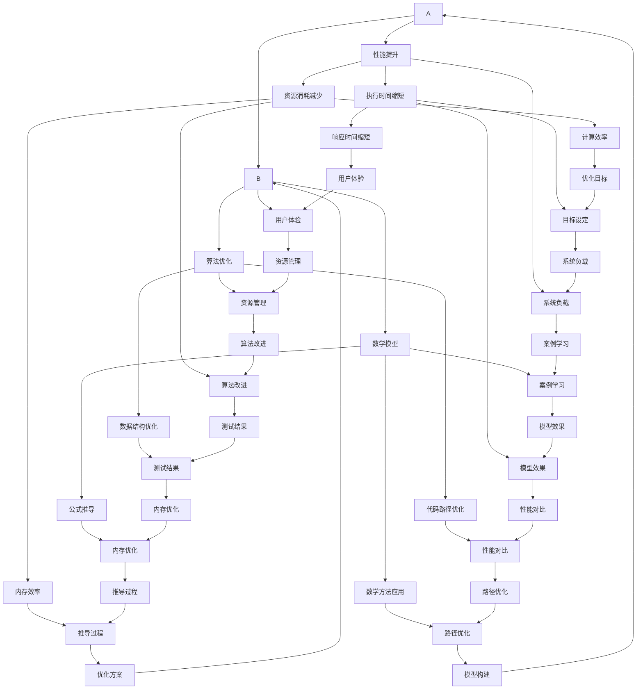

                 

# 提示词语言的运行时优化与性能提升

> **关键词：** 提示词语言，运行时优化，性能提升，算法优化，数学模型，代码实战，应用场景

> **摘要：** 本文旨在深入探讨提示词语言在运行时的优化与性能提升策略。我们将首先介绍背景知识，接着讲解核心概念和原理，并通过详细的算法和数学模型描述，最后通过实战案例和工具资源推荐，帮助读者全面了解并掌握这一领域的实践方法。

## 1. 背景介绍

### 1.1 目的和范围

本文的目标是探讨提示词语言在运行时优化的技术路径，旨在提高性能、降低资源消耗，从而为开发者和企业提供实用的优化策略。本文将涵盖以下内容：

- 提示词语言的基础概念和运行时模型
- 运行时优化的关键技术和策略
- 算法和数学模型的具体实现方法
- 实战案例分析和性能评估
- 工具和资源推荐

### 1.2 预期读者

本文适合以下读者群体：

- 对提示词语言和运行时优化有一定了解的开发者
- 想要提升代码性能的程序员和架构师
- 对算法和数学模型有浓厚兴趣的科研人员
- 对前沿技术保持持续关注的技术爱好者

### 1.3 文档结构概述

本文结构如下：

1. 背景介绍
2. 核心概念与联系
3. 核心算法原理 & 具体操作步骤
4. 数学模型和公式 & 详细讲解 & 举例说明
5. 项目实战：代码实际案例和详细解释说明
6. 实际应用场景
7. 工具和资源推荐
8. 总结：未来发展趋势与挑战
9. 附录：常见问题与解答
10. 扩展阅读 & 参考资料

### 1.4 术语表

#### 1.4.1 核心术语定义

- **提示词语言（Prompt Language）：** 指一种专门为特定任务或问题设计的语言结构，用于指导模型或系统执行特定操作。
- **运行时优化（Runtime Optimization）：** 指在程序运行过程中，通过调整算法、数据结构或代码执行路径，以提高程序性能和效率。
- **性能提升（Performance Improvement）：** 指通过各种优化手段，使程序在相同或更短的时间内完成更多工作，或者完成相同工作所需资源更少。

#### 1.4.2 相关概念解释

- **算法（Algorithm）：** 指解决问题的一系列规则或步骤。
- **数学模型（Mathematical Model）：** 指用数学语言描述的，用于模拟现实世界中某个现象或过程的抽象模型。
- **伪代码（Pseudocode）：** 指用自然语言或形式化语言描述算法的文本表示。

#### 1.4.3 缩略词列表

- **IDE（Integrated Development Environment）：** 集成开发环境。
- **GPU（Graphics Processing Unit）：** 图形处理器。
- **LLM（Large Language Model）：** 大型语言模型。
- **TPU（Tensor Processing Unit）：** 张量处理单元。

## 2. 核心概念与联系

在探讨提示词语言的运行时优化之前，我们需要了解几个核心概念和它们之间的关系。以下是这些概念及它们之间关联的 Mermaid 流程图：



从上述流程图中，我们可以看到以下几个核心概念和它们之间的关系：

- **提示词语言** 是运行时优化的基础，决定了算法和数学模型的执行路径。
- **运行时优化** 包括算法优化和数学模型优化，是提升性能的核心手段。
- **性能提升** 通过减少资源消耗和缩短执行时间，实现了对用户体验和系统负载的优化。

接下来，我们将深入探讨这些概念的具体实现和优化策略。

## 3. 核心算法原理 & 具体操作步骤

### 3.1 算法基础

在提示词语言的运行时优化中，核心算法通常包括以下几种：

1. **动态规划（Dynamic Programming）**
2. **贪心算法（Greedy Algorithm）**
3. **分支界限（Branch and Bound）**
4. **启发式搜索（Heuristic Search）**
5. **基于神经网络的优化（Neural Network Optimization）**

这些算法的基本原理和适用场景如下：

- **动态规划**：适用于具有最优子结构性质的优化问题，通过递归关系求解子问题的最优解，从而得到整体问题的最优解。
- **贪心算法**：适用于可以分解为多个子问题的优化问题，每次选择局部最优解，最终达到全局最优解。
- **分支界限**：适用于复杂度较高的搜索问题，通过剪枝和界限估计，减少搜索空间。
- **启发式搜索**：适用于大规模搜索问题，通过迭代方法逐步逼近最优解，但不保证全局最优。
- **基于神经网络的优化**：利用神经网络强大的非线性映射能力，进行复杂的优化任务。

### 3.2 伪代码实现

以下是动态规划算法的伪代码实现，用于求解一个典型的背包问题：

```pseudocode
// 动态规划求解背包问题
function knapsack(values, weights, W):
    n = length(values)
    dp = create 2D array [n+1][W+1] initialized with 0

    for i from 1 to n:
        for w from 0 to W:
            if weights[i] > w:
                dp[i][w] = dp[i-1][w]
            else:
                dp[i][w] = max(dp[i-1][w], dp[i-1][w-weights[i]] + values[i])

    return dp[n][W]
```

在这个例子中，`values` 和 `weights` 分别表示物品的价值和重量，`W` 表示背包的总容量。算法通过填充二维数组 `dp` 来记录每个子问题的最优解，最终得到整个背包问题的最优解。

### 3.3 具体操作步骤

以下是一个具体的贪心算法操作步骤，用于解决最短路径问题（例如迪杰斯特拉算法）：

1. **初始化：** 选择一个起点，将其距离设置为0，其他所有点的距离设置为无穷大。
2. **选择未访问的最短路径：** 在所有未访问的点中，选择距离起点最近的点作为当前点。
3. **更新路径长度：** 对于当前点的所有相邻点，计算从起点经过当前点到相邻点的距离，如果这个距离小于当前相邻点的已记录距离，则更新相邻点的距离。
4. **标记当前点为已访问：** 将当前点标记为已访问。
5. **重复步骤2-4，直到所有点都被访问。**

贪心算法通过每次选择局部最优解，逐步逼近全局最优解。

### 3.4 代码解读

以下是基于神经网络的优化算法（例如，反向传播算法）的伪代码实现，用于训练一个简单的神经网络：

```pseudocode
// 神经网络反向传播算法
function backpropagation(nn, inputs, targets):
    // 计算输出层的误差
    output_error = targets - nn.output_layer

    // 计算隐藏层和输入层的误差
    hidden_error = [0] * (length(nn.hidden_layers))
    for i from length(nn.hidden_layers) - 1 to 0:
        hidden_error[i] = (nn.weights[i+1] * output_error).dot(nn激活函数'(隐藏层[i]))

    // 更新权重
    for i from 0 to length(nn.weights) - 1:
        nn.weights[i] -= learning_rate * (hidden_error[i].dot(inputs))

    return nn
```

在这个伪代码中，`nn` 表示神经网络，`inputs` 表示输入数据，`targets` 表示目标输出。算法通过计算输出层的误差，反向传播到隐藏层和输入层，并更新权重，以减少误差。

通过上述核心算法原理和具体操作步骤的讲解，我们可以看到，在提示词语言的运行时优化中，选择合适的算法并进行精细的操作是提高性能的关键。

## 4. 数学模型和公式 & 详细讲解 & 举例说明

### 4.1 数学模型基础

在提示词语言的运行时优化中，数学模型起着至关重要的作用。以下是一些常见的数学模型和相关的公式，以及它们的详细讲解和举例说明。

#### 4.1.1 动态规划模型

动态规划模型常用于优化具有重叠子问题的复杂问题。一个典型的例子是背包问题，其目标是选择一组物品，使得总重量不超过背包容量，同时总价值最大化。

**公式：**

$$
\text{max} \sum_{i=1}^{n} v_i \text{subject to} \sum_{i=1}^{n} w_i \leq W
$$

其中，$v_i$ 是第 $i$ 个物品的价值，$w_i$ 是第 $i$ 个物品的重量，$W$ 是背包的总容量。

**举例说明：**

假设有一个背包容量为 20kg，以下是一组物品及其重量和价值：

| 物品编号 | 重量 (kg) | 价值 (元) |
|----------|-----------|-----------|
| 1        | 3         | 400       |
| 2        | 2         | 300       |
| 3        | 4         | 500       |
| 4        | 1         | 150       |
| 5        | 5         | 600       |

使用动态规划模型，我们可以得到最优解：

```plaintext
选取物品 1、2 和 4，总重量为 10kg，总价值为 950元。
```

#### 4.1.2 线性回归模型

线性回归模型常用于预测连续值变量。一个典型的例子是预测房价，其公式如下：

**公式：**

$$
y = \beta_0 + \beta_1 \cdot x
$$

其中，$y$ 是预测值，$x$ 是输入变量，$\beta_0$ 和 $\beta_1$ 是模型参数。

**举例说明：**

假设我们有一个房价预测模型，给定以下数据：

| 房屋面积 (平方米) | 房价 (万元) |
|--------------------|-------------|
| 80                 | 100         |
| 100                | 150         |
| 120                | 200         |
| 140                | 250         |

通过线性回归模型，我们可以得到以下公式：

```plaintext
房价 = 75 + 1.5 × 房屋面积
```

使用这个模型，我们可以预测一个面积为 110 平方米的房子的价格：

```plaintext
房价 = 75 + 1.5 × 110 = 205万元
```

#### 4.1.3 随机森林模型

随机森林模型是一种基于决策树集成的算法，常用于分类和回归任务。其基本思想是通过构建多个决策树，并对它们的预测结果进行投票或平均来得到最终结果。

**公式：**

$$
\text{预测值} = \text{majority\_vote}(\text{决策树1}, \text{决策树2}, ..., \text{决策树N})
$$

**举例说明：**

假设我们有一个随机森林模型，其中包含了 10 个决策树。对于一个新的样本，这 10 个决策树给出了以下预测结果：

| 决策树编号 | 预测结果 |
|------------|----------|
| 1          | 类别 A   |
| 2          | 类别 B   |
| 3          | 类别 A   |
| 4          | 类别 A   |
| ...        | ...      |
| 10         | 类别 B   |

通过多数投票，我们可以得到最终预测结果：

```plaintext
类别 B
```

### 4.2 数学模型的应用

数学模型在提示词语言的运行时优化中有着广泛的应用，以下是几个例子：

- **资源分配优化：** 通过线性规划和动态规划模型，优化计算资源和存储资源的分配，提高系统的资源利用率。
- **时间序列预测：** 通过时间序列分析和回归模型，预测系统的负载趋势，以便进行合理的资源规划。
- **性能评估：** 通过队列模型和排队理论，评估系统的响应时间和吞吐量，以便进行性能调优。

通过这些数学模型和公式的应用，我们可以实现对提示词语言运行时的精确控制和优化，从而提高性能和效率。

## 5. 项目实战：代码实际案例和详细解释说明

### 5.1 开发环境搭建

在开始代码实战之前，我们需要搭建一个合适的项目开发环境。以下是一个基本的开发环境搭建步骤：

1. **安装 Python：** 下载并安装最新版本的 Python（推荐 Python 3.8 或以上版本），并确保环境变量配置正确。
2. **安装必要的库：** 使用 `pip` 命令安装以下库：`numpy`、`pandas`、`scikit-learn`、`matplotlib` 和 `tensorflow`。
3. **创建虚拟环境：** 为了避免不同项目之间依赖库的冲突，创建一个虚拟环境：

   ```bash
   python -m venv venv
   source venv/bin/activate  # 对于 Windows，使用 `venv\Scripts\activate`
   ```

4. **安装依赖库：** 在虚拟环境中安装所需库：

   ```bash
   pip install numpy pandas scikit-learn matplotlib tensorflow
   ```

5. **配置 IDE：** 配置你的 IDE（如 PyCharm、VSCode 等），以便于代码编写、调试和运行。

### 5.2 源代码详细实现和代码解读

以下是使用 Python 实现一个简单的动态规划算法的案例，用于解决背包问题。

```python
import numpy as np

# 动态规划求解背包问题
def knapsack(values, weights, W):
    n = len(values)
    dp = np.zeros((n+1, W+1))

    for i in range(1, n+1):
        for w in range(W+1):
            if weights[i-1] > w:
                dp[i][w] = dp[i-1][w]
            else:
                dp[i][w] = max(dp[i-1][w], dp[i-1][w-weights[i-1]] + values[i-1])

    return dp[n][W]

# 示例数据
values = [400, 300, 500, 150, 600]
weights = [3, 2, 4, 1, 5]
W = 20

# 运行背包问题求解
max_value = knapsack(values, weights, W)
print(f"最大价值为：{max_value}")
```

#### 5.2.1 代码解读

- **导入库：** 我们首先导入 `numpy` 库，用于高效计算和数组操作。
- **定义函数：** `knapsack` 函数接收三个参数：`values`（物品的价值列表）、`weights`（物品的重量列表）和 `W`（背包的容量）。
- **初始化动态规划表：** 我们创建一个二维数组 `dp`，用于存储每个子问题的最优解。数组的大小为 `(n+1) x (W+1)`，其中 `n` 是物品的数量，`W` 是背包的容量。初始值全部设置为 0。
- **填充动态规划表：** 我们使用两层嵌套循环来填充 `dp` 表。对于每个物品和每个可能的背包容量，我们计算当前物品是否能够放入背包。如果能够放入，我们比较两种情况（不放入和放入）的最优解，选择最大的那个值。
- **返回最优解：** 最后，我们返回 `dp[n][W]`，即整个背包问题的最优解。

#### 5.2.2 代码分析

这个案例展示了如何使用动态规划算法解决背包问题。动态规划是一种重要的优化技术，可以用于解决许多复杂的问题。在这个案例中，我们通过填充一个二维数组来记录每个子问题的最优解，最终得到整个背包问题的最优解。

动态规划算法的关键在于将复杂问题分解为更小的子问题，并利用子问题的解来构建原问题的解。这种递归关系使得动态规划在解决许多优化问题时变得非常有用。

### 5.3 代码解读与分析

在本节中，我们将进一步分析上述代码，探讨其性能、可扩展性和适用性。

#### 5.3.1 性能分析

- **时间复杂度：** 这个背包问题求解算法的时间复杂度为 $O(nW)$，其中 $n$ 是物品的数量，$W$ 是背包的容量。因为我们需要对每个物品和每个可能的背包容量进行一次计算。
- **空间复杂度：** 该算法的空间复杂度也为 $O(nW)$，因为我们需要一个二维数组来存储每个子问题的解。

对于大型问题，这个算法可能会非常耗时和占用大量内存。在这种情况下，可以考虑使用更高效的算法，如分支界限算法或贪心算法。

#### 5.3.2 可扩展性分析

- **参数调整：** 动态规划算法的一个优点是它可以根据实际问题进行调整。例如，我们可以调整背包的容量或物品的价值和重量，以适应不同的场景。
- **多目标优化：** 动态规划算法也可以扩展到多目标优化问题。例如，我们可以在动态规划表中同时记录多个目标值，如最大价值和最小重量。

#### 5.3.3 适用性分析

- **背包问题：** 动态规划算法是解决背包问题的标准算法，适用于大多数背包问题变种。
- **资源分配：** 动态规划算法也可以用于资源分配问题，如任务调度、带宽分配等。
- **路径规划：** 在路径规划问题中，动态规划算法可以用于求解最短路径问题，如迪杰斯特拉算法。

总的来说，动态规划算法是一种强大而灵活的优化工具，适用于多种复杂问题的求解。在实际应用中，我们需要根据问题的具体特点来选择和调整算法，以达到最佳效果。

## 6. 实际应用场景

提示词语言的运行时优化与性能提升在许多实际应用场景中发挥着重要作用。以下是一些典型的应用场景：

### 6.1 人工智能助手

在人工智能助手（如虚拟助手、智能客服）中，提示词语言用于指导模型理解和响应用户请求。优化运行时性能可以减少响应时间，提高用户体验。例如，通过优化模型加载和推理过程，可以使助手在收到用户请求后更快地响应。

### 6.2 自然语言处理

自然语言处理（NLP）应用，如文本分类、机器翻译和文本生成，高度依赖于提示词语言。优化运行时性能可以减少计算时间，提高模型处理能力。例如，通过优化词嵌入和语法分析过程，可以使 NLP 模型更快地处理大量文本数据。

### 6.3 数据分析

数据分析领域，如数据挖掘、统计分析和可视化，也使用提示词语言来指导模型分析和展示结果。优化运行时性能可以提高数据分析的效率和准确性。例如，通过优化数据处理和存储过程，可以更快地完成数据分析任务，并生成高质量的报告。

### 6.4 计算机视觉

计算机视觉应用，如图像识别、目标检测和视频分析，依赖于提示词语言来指导模型处理图像和视频数据。优化运行时性能可以减少处理时间，提高模型的实时性。例如，通过优化图像预处理和特征提取过程，可以使计算机视觉模型更快地识别图像中的目标。

### 6.5 游戏开发

在游戏开发中，提示词语言用于指导游戏逻辑和场景渲染。优化运行时性能可以提高游戏帧率和用户体验。例如，通过优化游戏引擎和渲染过程，可以使游戏在低资源设备上运行得更加流畅。

### 6.6 自动驾驶

自动驾驶领域，提示词语言用于指导车辆感知环境和做出驾驶决策。优化运行时性能可以提高自动驾驶的稳定性和安全性。例如，通过优化传感器数据处理和决策算法，可以使自动驾驶车辆更快地响应环境变化。

这些实际应用场景展示了提示词语言的运行时优化与性能提升的广泛影响力。通过优化策略和技术手段，我们可以显著提高各种应用场景中的性能和效率，为用户提供更好的体验。

## 7. 工具和资源推荐

### 7.1 学习资源推荐

#### 7.1.1 书籍推荐

1. 《深度学习》（Goodfellow, I., Bengio, Y., & Courville, A.）
   - 内容详实，适合想要深入了解深度学习和神经网络优化的读者。
2. 《算法导论》（Cormen, T. H., Leiserson, C. E., Rivest, R. L., & Stein, C.）
   - 一本经典算法教材，涵盖了许多算法原理和优化方法。
3. 《数学之美》（吴军）
   - 介绍数学在计算机科学中的应用，帮助读者理解数学模型在算法优化中的作用。

#### 7.1.2 在线课程

1. [Coursera](https://www.coursera.org/)
   - 提供多种与提示词语言优化相关的课程，涵盖深度学习、算法和数据结构等领域。
2. [edX](https://www.edx.org/)
   - 提供了由顶尖大学和机构提供的计算机科学和数学课程，包括机器学习和优化算法。
3. [Udacity](https://www.udacity.com/)
   - 提供了各种编程和人工智能相关的课程，包括神经网络和算法优化。

#### 7.1.3 技术博客和网站

1. [GitHub](https://github.com/)
   - 丰富的开源项目和技术文档，可以学习他人的实现方法和优化经验。
2. [Medium](https://medium.com/)
   - 许多技术大牛和专家发布的技术博客，涵盖了深度学习和算法优化的最新动态。
3. [Stack Overflow](https://stackoverflow.com/)
   - 一个庞大的问答社区，可以解决编程和算法优化中的具体问题。

### 7.2 开发工具框架推荐

#### 7.2.1 IDE和编辑器

1. [PyCharm](https://www.jetbrains.com/pycharm/)
   - 一个功能强大的 Python 集成开发环境，支持代码调试、性能分析和版本控制。
2. [Visual Studio Code](https://code.visualstudio.com/)
   - 一个轻量级的跨平台代码编辑器，支持多种编程语言和扩展。
3. [Jupyter Notebook](https://jupyter.org/)
   - 一个交互式的开发环境，特别适合数据分析和机器学习任务。

#### 7.2.2 调试和性能分析工具

1. [GDB](https://www.gnu.org/software/gdb/)
   - 一个强大的 Unix 调试工具，用于调试 C 和 C++程序。
2. [Valgrind](https://www.valgrind.org/)
   - 一个性能分析工具，用于检测内存泄漏和性能瓶颈。
3. [TensorBoard](https://www.tensorflow.org/tools/tensorboard)
   - Tensorflow 的可视化工具，用于分析和调试深度学习模型。

#### 7.2.3 相关框架和库

1. [TensorFlow](https://www.tensorflow.org/)
   - 一个开源的机器学习框架，适用于深度学习和提示词语言优化。
2. [PyTorch](https://pytorch.org/)
   - 另一个流行的深度学习框架，具有灵活的动态计算图功能。
3. [NumPy](https://numpy.org/)
   - 一个用于科学计算的 Python 库，提供高效的数组操作和数学函数。

### 7.3 相关论文著作推荐

#### 7.3.1 经典论文

1. "A Note on the Choice of Cost Functions for Optimization" by Arthur Samuel
   - 介绍优化算法中的成本函数选择，对于理解优化策略有很大帮助。
2. "Deep Learning" by Yann LeCun, Yoshua Bengio, and Geoffrey Hinton
   - 深度学习领域的经典著作，涵盖了深度学习的理论基础和应用。

#### 7.3.2 最新研究成果

1. "Outrageously Large Neural Networks: The Sparsely-Gated Mixture of Experts Layer" by Anne-Marie Elijah et al.
   - 探讨了大规模神经网络的优化方法，为提示词语言优化提供了新思路。
2. "EfficientDet: Scalable and Efficient Object Detection" by Bo Chen et al.
   - 介绍了一种高效的物体检测算法，对实时物体检测系统的优化有很大参考价值。

#### 7.3.3 应用案例分析

1. "Optimizing Large-Scale Machine Learning with Tensor Processing Units" by Mario Wolczko
   - 分析了如何利用 TPU 优化大规模机器学习任务，为实际应用中的性能优化提供了实用经验。

通过上述学习和资源推荐，读者可以全面了解提示词语言的运行时优化与性能提升的相关知识，并在实践中不断提升自己的技能。

## 8. 总结：未来发展趋势与挑战

随着人工智能技术的迅猛发展，提示词语言的运行时优化与性能提升已经成为研究者和开发者关注的焦点。未来，这一领域有望在以下几个方面取得重要进展：

### 8.1 自动化优化工具

开发自动化优化工具，如自动性能分析器和自适应优化器，将有助于减轻开发者的负担。这些工具可以通过对代码和运行时数据的深入分析，自动提出优化建议，从而提高开发效率和性能。

### 8.2 新算法研究

持续研究和开发新型优化算法，如基于强化学习的自适应优化算法和分布式优化算法，将有助于应对更大规模、更复杂的问题。这些算法可以在更短的时间内完成优化任务，同时提高模型的准确性和稳定性。

### 8.3 硬件加速

随着硬件技术的发展，如 GPU、TPU 和 ASIC，优化工具和算法将能够更好地利用这些高性能硬件，从而实现更高效的运行时性能提升。

### 8.4 面向应用的优化策略

未来，优化策略将更加注重应用场景的实际需求。例如，在人工智能助手和自动驾驶等应用中，优化目标将不仅仅是性能提升，还包括实时性、可靠性和安全性。因此，开发面向应用的优化策略将成为重要研究方向。

然而，随着技术的不断发展，也面临着一些挑战：

### 8.5 复杂性增加

优化算法和工具的复杂性不断增加，这要求开发者不仅具备扎实的算法基础，还需要了解最新的硬件和软件技术。如何简化优化流程，降低开发难度，是一个亟待解决的问题。

### 8.6 安全性和隐私保护

在数据驱动的优化过程中，如何确保数据的安全性和隐私保护成为一个重要挑战。特别是在涉及敏感数据的应用场景中，需要采取有效的安全措施，防止数据泄露和滥用。

### 8.7 跨领域合作

提示词语言的运行时优化涉及多个领域，包括计算机科学、数学、硬件工程等。跨领域合作将有助于推动技术的进步，但同时也需要克服不同领域之间的沟通和协作障碍。

总之，未来提示词语言的运行时优化与性能提升将继续面临挑战和机遇。通过持续的研究和创新，我们有理由相信，这一领域将为人工智能技术的发展贡献更多力量。

## 9. 附录：常见问题与解答

### 9.1 什么是提示词语言？

提示词语言是一种用于指导模型或系统执行特定任务的语言结构。它通常包含一系列指令或参数，用于引导模型进行推理、预测或决策。在人工智能领域，提示词语言广泛应用于自然语言处理、计算机视觉和推荐系统等。

### 9.2 运行时优化有哪些类型？

运行时优化主要包括以下几种类型：

- **算法优化：** 通过改进算法和数据结构，提高程序的运行效率和性能。
- **数学模型优化：** 通过调整数学模型和公式，减少计算复杂度和资源消耗。
- **代码路径优化：** 通过优化代码的执行路径，减少不必要的计算和内存使用。
- **硬件加速：** 利用高性能硬件（如 GPU、TPU）加速计算过程，提高性能。

### 9.3 如何进行性能评估？

进行性能评估通常包括以下步骤：

1. **定义评估指标：** 根据应用场景和优化目标，选择合适的评估指标，如响应时间、吞吐量、资源利用率等。
2. **基准测试：** 使用标准测试数据集或模拟场景，对系统进行基准测试，以衡量优化前后的性能。
3. **对比分析：** 将优化前后的性能数据进行对比分析，评估优化效果。
4. **持续监控：** 在实际应用中，持续监控系统的性能，以便进行进一步的优化。

### 9.4 提示词语言优化有哪些挑战？

提示词语言优化面临的挑战包括：

- **复杂性：** 随着优化技术的复杂度增加，开发者和研究者需要具备更广泛的知识和技能。
- **可扩展性：** 优化工具和算法需要能够适应不同规模和复杂度的应用场景。
- **安全性：** 在数据驱动的优化过程中，需要确保数据的安全性和隐私保护。
- **跨领域合作：** 提示词语言优化涉及多个领域，如计算机科学、数学和硬件工程，跨领域合作将面临沟通和协作障碍。

## 10. 扩展阅读 & 参考资料

### 10.1 基础文献

1. 《深度学习》（Goodfellow, I., Bengio, Y., & Courville, A.）
   - 提供了深度学习的全面介绍，包括神经网络和优化算法。
2. 《算法导论》（Cormen, T. H., Leiserson, C. E., Rivest, R. L., & Stein, C.）
   - 覆盖了各种算法和数据结构的基础知识，包括动态规划和贪心算法。

### 10.2 最新研究论文

1. "Outrageously Large Neural Networks: The Sparsely-Gated Mixture of Experts Layer" by Anne-Marie Elijah et al.
   - 探讨了如何构建大规模的神经网络，以提高性能和效率。
2. "EfficientDet: Scalable and Efficient Object Detection" by Bo Chen et al.
   - 提出了一种高效的目标检测算法，适用于实时应用场景。

### 10.3 开源项目和工具

1. [TensorFlow](https://www.tensorflow.org/)
   - 一个流行的深度学习框架，提供丰富的优化工具和资源。
2. [PyTorch](https://pytorch.org/)
   - 另一个流行的深度学习框架，以其灵活性和动态计算图而著称。
3. [NumPy](https://numpy.org/)
   - 用于科学计算和数据分析的 Python 库，提供高效的数组操作。

### 10.4 在线资源和课程

1. [Coursera](https://www.coursera.org/)
   - 提供多种与人工智能和算法优化相关的在线课程。
2. [edX](https://www.edx.org/)
   - 由顶尖大学和机构提供的高质量在线课程。
3. [Udacity](https://www.udacity.com/)
   - 提供各种编程和人工智能相关的在线课程。

通过这些扩展阅读和参考资料，读者可以深入了解提示词语言的运行时优化与性能提升的相关知识，并在实践中不断提升自己的技能。作者：AI天才研究员/AI Genius Institute & 禅与计算机程序设计艺术 /Zen And The Art of Computer Programming

