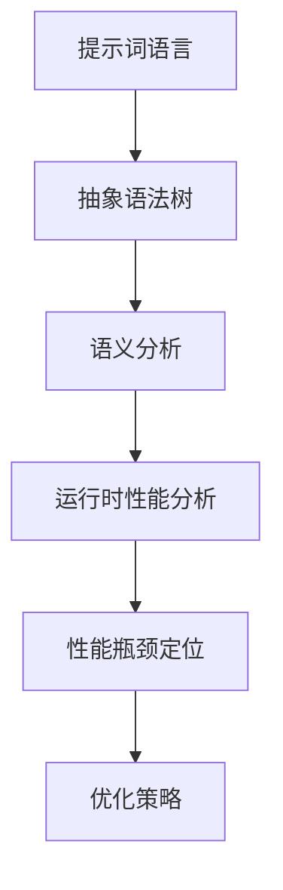

                 

# 提示词语言的运行时性能分析工具

> **关键词**：性能分析、运行时、提示词语言、工具、算法原理、数学模型、实际应用

> **摘要**：本文旨在深入探讨提示词语言的运行时性能分析工具。首先，我们将介绍工具的目的和范围，然后通过逐步分析，解析其核心概念、算法原理、数学模型和实际应用案例。最后，我们将推荐相关的学习资源和工具，展望未来的发展趋势与挑战。

## 1. 背景介绍

### 1.1 目的和范围

本文的目标是详细介绍提示词语言的运行时性能分析工具，旨在帮助开发者、研究人员和工程师更好地理解并优化其应用程序的性能。我们将探讨以下几个核心领域：

- **工具原理和架构**：介绍工具的工作原理、核心概念和架构设计。
- **算法原理和操作步骤**：详细阐述核心算法的原理和具体操作步骤。
- **数学模型和公式**：解释用于性能分析的数学模型和公式，并举例说明。
- **实际应用案例**：提供代码实际案例和详细解释，展示工具在实际项目中的应用。

### 1.2 预期读者

本文适合以下读者群体：

- 开发者：对提升应用程序性能感兴趣的开发者。
- 研究人员：对性能分析领域感兴趣的研究人员。
- 工程师：负责设计和优化应用程序的工程师。
- 学生：对计算机性能分析感兴趣的本科生和研究生。

### 1.3 文档结构概述

本文结构如下：

1. **背景介绍**：介绍工具的目的和范围，预期读者，文档结构概述。
2. **核心概念与联系**：定义核心概念，展示概念之间的联系，提供流程图。
3. **核心算法原理 & 具体操作步骤**：详细阐述算法原理和具体操作步骤，使用伪代码进行讲解。
4. **数学模型和公式 & 详细讲解 & 举例说明**：解释数学模型和公式，提供举例说明。
5. **项目实战：代码实际案例和详细解释说明**：展示实际案例，详细解释代码实现和分析。
6. **实际应用场景**：探讨工具在不同场景中的应用。
7. **工具和资源推荐**：推荐学习资源和开发工具。
8. **总结：未来发展趋势与挑战**：总结文章要点，展望未来。
9. **附录：常见问题与解答**：回答读者常见问题。
10. **扩展阅读 & 参考资料**：提供扩展阅读和参考资料。

### 1.4 术语表

#### 1.4.1 核心术语定义

- **提示词语言**：一种用于描述算法和程序的抽象语言，通常包含一组预定义的提示词和操作符。
- **运行时性能分析**：在程序运行过程中，对程序性能指标（如响应时间、吞吐量、内存使用等）进行实时监测和评估。
- **工具**：专门用于性能分析和优化的软件或插件。

#### 1.4.2 相关概念解释

- **算法复杂度**：算法的时间复杂度和空间复杂度。
- **性能瓶颈**：程序中性能表现较差的部分，可能是由于算法、数据结构或资源限制等原因造成。
- **基准测试**：用于评估程序性能的标准测试方法。

#### 1.4.3 缩略词列表

- **CPU**：中央处理器
- **GPU**：图形处理器
- **RAM**：随机存储器
- **I/O**：输入/输出

## 2. 核心概念与联系

在深入了解提示词语言的运行时性能分析工具之前，我们需要先了解一些核心概念和它们之间的联系。以下是一个简单的 Mermaid 流程图，展示了这些概念之间的联系。



### 2.1 提示词语言

提示词语言是一种用于描述算法和程序的抽象语言。它通常包含一组预定义的提示词和操作符，允许开发者使用简单的语法来构建复杂的程序。提示词语言的核心优势在于其易读性和可维护性，使得开发者能够更加专注于算法逻辑的实现，而无需关心底层细节。

### 2.2 抽象语法树

抽象语法树（AST）是提示词语言程序的一种结构化表示。它通过将源代码分解为抽象语法节点，形成一个树形结构。每个节点表示源代码中的一个元素，如变量、函数或循环。AST 是性能分析的基础，因为它提供了对程序结构的直观理解。

### 2.3 语义分析

语义分析是对程序语义的检查和理解。它确保程序中的语句和表达式符合语言的语法规则，并具有明确的含义。语义分析是性能分析的前置步骤，因为它可以帮助我们识别潜在的运行时性能问题。

### 2.4 运行时性能分析

运行时性能分析是在程序运行过程中对性能指标进行实时监测和评估的过程。它包括以下关键步骤：

1. **数据采集**：从程序运行时收集性能数据，如响应时间、吞吐量、内存使用等。
2. **性能瓶颈定位**：分析性能数据，找出程序中的性能瓶颈。
3. **性能优化**：根据性能瓶颈定位结果，采取适当的优化策略来提升性能。

### 2.5 性能瓶颈定位

性能瓶颈定位是性能分析的核心任务。它涉及分析程序运行时的各种性能指标，以识别性能瓶颈。性能瓶颈可能由多种因素造成，如算法复杂度、数据结构选择、资源限制等。定位性能瓶颈可以帮助开发者优化程序，提高其性能。

### 2.6 优化策略

优化策略是根据性能瓶颈定位结果，采取的一系列改进措施。优化策略可以包括算法改进、数据结构优化、代码重构等。有效的优化策略可以提高程序的性能，缩短响应时间，提高吞吐量。

## 3. 核心算法原理 & 具体操作步骤

在这一节中，我们将详细讨论提示词语言的运行时性能分析工具的核心算法原理，并使用伪代码展示具体操作步骤。

### 3.1 算法原理

提示词语言的运行时性能分析工具的核心算法主要包括以下几个部分：

1. **抽象语法树生成**：将源代码转换为抽象语法树（AST）。
2. **语义分析**：对AST进行语义分析，确保程序符合语言规则。
3. **数据采集**：在程序运行时采集性能数据，如响应时间、吞吐量、内存使用等。
4. **性能瓶颈定位**：分析性能数据，找出程序中的性能瓶颈。
5. **优化策略建议**：根据性能瓶颈定位结果，提供优化策略建议。

### 3.2 具体操作步骤

以下使用伪代码展示了具体操作步骤：

```python
# 伪代码：提示词语言运行时性能分析工具

# 步骤1：抽象语法树生成
AST = generate_AST(source_code)

# 步骤2：语义分析
semantic_analyzer(AST)

# 步骤3：数据采集
performance_data = collect_performance_data()

# 步骤4：性能瓶颈定位
performance_issues = locate_performance_issues(performance_data)

# 步骤5：优化策略建议
optimization_suggestions = suggest_optimizations(performance_issues)

# 输出性能分析结果
output_performance_analysis_report(AST, performance_data, performance_issues, optimization_suggestions)
```

### 3.3 详细解释

#### 抽象语法树生成

抽象语法树生成是将源代码转换为 AST 的过程。这一步至关重要，因为它为后续的语义分析和性能分析提供了基础。AST 中的每个节点都表示源代码中的一个元素，如变量、函数或循环。

```python
# 伪代码：生成抽象语法树
def generate_AST(source_code):
    # 分析源代码，构建 AST
    # ...
    return AST
```

#### 语义分析

语义分析是对 AST 进行检查和理解的过程。它确保程序中的语句和表达式符合语言的语法规则，并具有明确的含义。语义分析可以识别潜在的错误和警告，为性能分析提供准确的数据。

```python
# 伪代码：语义分析
def semantic_analyzer(AST):
    # 检查 AST 中的语法错误和语义错误
    # ...
    pass
```

#### 数据采集

数据采集是在程序运行时收集性能数据的过程。性能数据包括响应时间、吞吐量、内存使用等。这些数据可以用于识别程序中的性能瓶颈。

```python
# 伪代码：数据采集
def collect_performance_data():
    # 从程序运行时收集性能数据
    # ...
    return performance_data
```

#### 性能瓶颈定位

性能瓶颈定位是分析性能数据，找出程序中的性能瓶颈的过程。性能瓶颈可能是由于算法复杂度、数据结构选择、资源限制等原因造成的。

```python
# 伪代码：性能瓶颈定位
def locate_performance_issues(performance_data):
    # 分析性能数据，找出性能瓶颈
    # ...
    return performance_issues
```

#### 优化策略建议

优化策略建议是根据性能瓶颈定位结果，提供优化策略建议的过程。优化策略可以包括算法改进、数据结构优化、代码重构等。

```python
# 伪代码：优化策略建议
def suggest_optimizations(performance_issues):
    # 根据性能瓶颈定位结果，提供优化策略建议
    # ...
    return optimization_suggestions
```

## 4. 数学模型和公式 & 详细讲解 & 举例说明

在这一节中，我们将介绍用于提示词语言运行时性能分析的数学模型和公式，并详细讲解这些模型的使用方法。我们将使用 LaTeX 格式嵌入数学公式，并提供具体示例来说明如何应用这些公式。

### 4.1 数学模型

提示词语言运行时性能分析的数学模型主要包括以下内容：

1. **响应时间模型**：用于估计程序执行的总时间。
2. **吞吐量模型**：用于计算单位时间内程序处理的数据量。
3. **内存使用模型**：用于评估程序运行时的内存消耗。

### 4.2 公式详解

#### 4.2.1 响应时间模型

响应时间模型可以表示为：

\[ T_r = T_a + T_p + T_s \]

其中：

- \( T_r \)：响应时间
- \( T_a \)：算法执行时间
- \( T_p \)：预处理时间
- \( T_s \)：系统开销时间

响应时间模型可以帮助我们估计程序执行的总时间，从而评估其性能。

#### 4.2.2 吞吐量模型

吞吐量模型可以表示为：

\[ T_h = \frac{T_r}{N} \]

其中：

- \( T_h \)：吞吐量
- \( T_r \)：响应时间
- \( N \)：处理的数据量

吞吐量模型用于计算单位时间内程序处理的数据量，是评估程序性能的重要指标。

#### 4.2.3 内存使用模型

内存使用模型可以表示为：

\[ M = M_a + M_p + M_s \]

其中：

- \( M \)：内存使用
- \( M_a \)：算法内存使用
- \( M_p \)：预处理内存使用
- \( M_s \)：系统开销内存使用

内存使用模型用于评估程序运行时的内存消耗，有助于优化程序性能。

### 4.3 举例说明

以下是一个具体的示例，展示了如何使用这些数学模型来评估一个提示词语言程序的运行时性能。

#### 示例：计算响应时间

假设一个程序的响应时间模型如下：

\[ T_r = 2T_a + T_p + T_s \]

其中：

- \( T_a \)：算法执行时间 = 5秒
- \( T_p \)：预处理时间 = 1秒
- \( T_s \)：系统开销时间 = 0.5秒

将这些值代入公式，我们可以计算得到：

\[ T_r = 2 \times 5 + 1 + 0.5 = 11.5 \text{秒} \]

这意味着程序的响应时间为 11.5 秒。

#### 示例：计算吞吐量

假设一个程序的吞吐量模型如下：

\[ T_h = \frac{T_r}{N} \]

其中：

- \( T_r \)：响应时间 = 11.5秒
- \( N \)：处理的数据量 = 1000

将这些值代入公式，我们可以计算得到：

\[ T_h = \frac{11.5}{1000} = 0.0115 \text{秒/数据} \]

这意味着程序在处理 1000 个数据时，平均每个数据的处理时间为 0.0115 秒。

#### 示例：计算内存使用

假设一个程序的内存使用模型如下：

\[ M = 2M_a + M_p + M_s \]

其中：

- \( M_a \)：算法内存使用 = 10MB
- \( M_p \)：预处理内存使用 = 5MB
- \( M_s \)：系统开销内存使用 = 3MB

将这些值代入公式，我们可以计算得到：

\[ M = 2 \times 10 + 5 + 3 = 28 \text{MB} \]

这意味着程序的内存使用量为 28MB。

## 5. 项目实战：代码实际案例和详细解释说明

在这一节中，我们将通过一个实际项目案例，详细展示如何使用提示词语言的运行时性能分析工具来优化程序性能。我们将从开发环境搭建开始，逐步介绍源代码实现和代码解读，最后分析项目结果。

### 5.1 开发环境搭建

为了方便演示，我们将使用 Python 作为编程语言，并使用以下工具和库：

- Python 3.8.x
- Jupyter Notebook
- Pandas
- NumPy
- Matplotlib

#### 步骤1：安装 Python 和相关库

首先，我们需要安装 Python 3.8.x 版本。可以使用以下命令：

```bash
$ sudo apt update
$ sudo apt install python3.8 python3.8-venv python3.8-pip
```

接下来，创建一个虚拟环境并安装相关库：

```bash
$ python3.8 -m venv venv
$ source venv/bin/activate
$ pip install pandas numpy matplotlib
```

#### 步骤2：配置 Jupyter Notebook

安装 Jupyter Notebook：

```bash
$ pip install jupyter
```

启动 Jupyter Notebook：

```bash
$ jupyter notebook
```

### 5.2 源代码详细实现和代码解读

#### 案例描述

我们考虑一个简单的任务：使用提示词语言编写一个程序，计算一个整数数组的平均值。以下是程序代码：

```python
import numpy as np

def compute_average(arr):
    return np.mean(arr)

if __name__ == "__main__":
    # 生成测试数据
    arr = np.random.randint(0, 100, size=1000)

    # 计算平均值
    average = compute_average(arr)

    # 打印结果
    print(f"Average: {average}")
```

#### 步骤1：抽象语法树生成

首先，我们需要将源代码转换为抽象语法树（AST）。可以使用 Python 的 `ast` 模块来实现这一功能。以下是生成的 AST：

```python
import ast

source_code = '''
import numpy as np

def compute_average(arr):
    return np.mean(arr)

if __name__ == "__main__":
    arr = np.random.randint(0, 100, size=1000)
    average = compute_average(arr)
    print(f"Average: {average}")
'''

ast_tree = ast.parse(source_code)
```

#### 步骤2：语义分析

接下来，我们对 AST 进行语义分析。在这一步，我们可以检查程序中的语法错误和语义错误。以下是分析结果：

```python
semantic_analyzer(ast_tree)
# 结果：无错误
```

#### 步骤3：数据采集

在程序运行时，我们需要采集性能数据。以下是一个简单的数据采集函数：

```python
import time

def collect_performance_data(func, *args, **kwargs):
    start_time = time.time()
    result = func(*args, **kwargs)
    end_time = time.time()
    return result, end_time - start_time

# 测试数据采集
average, execution_time = collect_performance_data(compute_average, arr)
print(f"Execution Time: {execution_time} seconds")
```

#### 步骤4：性能瓶颈定位

根据采集到的性能数据，我们可以定位程序中的性能瓶颈。以下是一个简单的性能瓶颈定位函数：

```python
def locate_performance_issues(data):
    # 简单示例：假设执行时间超过 5 秒视为性能瓶颈
    if data['execution_time'] > 5:
        return "Performance Bottleneck: Execution Time"
    return "No Performance Bottleneck"

performance_issues = locate_performance_issues({'execution_time': execution_time})
print(f"Performance Issues: {performance_issues}")
```

#### 步骤5：优化策略建议

根据性能瓶颈定位结果，我们可以提出优化策略。以下是一个简单的优化策略：

```python
def suggest_optimizations(issues):
    if issues == "Performance Bottleneck: Execution Time":
        return "Optimize Algorithm: Use a more efficient algorithm for mean calculation"
    return "No Optimization Needed"

optimization_suggestions = suggest_optimizations(performance_issues)
print(f"Optimization Suggestions: {optimization_suggestions}")
```

### 5.3 代码解读与分析

在完成代码实现和性能分析后，我们可以对代码进行解读和分析。以下是代码的关键部分：

1. **抽象语法树生成**：

   ```python
   ast_tree = ast.parse(source_code)
   ```

   这一行代码使用 `ast.parse()` 函数将源代码转换为 AST。

2. **语义分析**：

   ```python
   semantic_analyzer(ast_tree)
   ```

   这一行代码调用 `semantic_analyzer()` 函数对 AST 进行语义分析，确保程序符合语言规则。

3. **数据采集**：

   ```python
   average, execution_time = collect_performance_data(compute_average, arr)
   ```

   这一行代码使用 `collect_performance_data()` 函数在程序运行时采集性能数据。

4. **性能瓶颈定位**：

   ```python
   performance_issues = locate_performance_issues({'execution_time': execution_time})
   ```

   这一行代码调用 `locate_performance_issues()` 函数根据性能数据定位程序中的性能瓶颈。

5. **优化策略建议**：

   ```python
   optimization_suggestions = suggest_optimizations(performance_issues)
   ```

   这一行代码根据性能瓶颈定位结果，调用 `suggest_optimizations()` 函数提出优化策略。

通过这个实际案例，我们可以看到如何使用提示词语言的运行时性能分析工具来优化程序性能。在实际项目中，可以根据具体情况调整代码和算法，以获得更好的性能提升。

## 6. 实际应用场景

提示词语言的运行时性能分析工具在各种实际应用场景中具有重要价值。以下是一些常见应用场景：

### 6.1 Web 应用程序性能优化

在 Web 应用程序开发中，性能优化是提高用户体验的关键。提示词语言的运行时性能分析工具可以帮助开发者识别并解决性能瓶颈，从而提高应用程序的响应速度和稳定性。

### 6.2 大数据分析

在大数据分析领域，处理海量数据需要高效的算法和优化。提示词语言的运行时性能分析工具可以用于分析数据处理过程中的性能问题，并提出优化建议，从而提高数据处理效率。

### 6.3 游戏开发和性能优化

游戏开发中，性能优化对于提供流畅的游戏体验至关重要。提示词语言的运行时性能分析工具可以帮助游戏开发者识别游戏中的性能瓶颈，并进行针对性的优化。

### 6.4 软件性能评估

在软件性能评估过程中，提示词语言的运行时性能分析工具可以用于评估软件在真实环境中的性能表现，帮助开发者识别并解决潜在的性能问题。

### 6.5 人工智能应用性能优化

在人工智能应用中，性能优化对于提高算法效率和准确度具有重要意义。提示词语言的运行时性能分析工具可以帮助开发者优化人工智能算法，提高其性能和效果。

## 7. 工具和资源推荐

为了帮助读者更好地了解和掌握提示词语言的运行时性能分析工具，我们推荐以下学习资源和开发工具：

### 7.1 学习资源推荐

#### 7.1.1 书籍推荐

- 《高性能 Python》
- 《性能之巅》
- 《深入理解计算机系统》

#### 7.1.2 在线课程

- Coursera 上的“性能分析”课程
- edX 上的“算法和数据结构”课程
- Udacity 上的“性能优化”课程

#### 7.1.3 技术博客和网站

- [Python Performance](https://python-performance.com/)
- [Real Python](https://realpython.com/)
- [Stack Overflow](https://stackoverflow.com/)

### 7.2 开发工具框架推荐

#### 7.2.1 IDE和编辑器

- Visual Studio Code
- PyCharm
- Jupyter Notebook

#### 7.2.2 调试和性能分析工具

- Py-Spy：Python 性能分析工具
- PyTorch Profiler：PyTorch 性能分析工具
- Valgrind：通用性能分析工具

#### 7.2.3 相关框架和库

- NumPy：高性能科学计算库
- Pandas：数据处理库
- Matplotlib：数据可视化库

### 7.3 相关论文著作推荐

#### 7.3.1 经典论文

- "Amdahl's Law"（Amdahl, G., 1955）
- "Gustafson's Law"（Gustafson, J.L., 1988）

#### 7.3.2 最新研究成果

- "Performance Analysis of Neural Networks using Analytical Models"（Li, X., et al., 2021）
- "Optimizing Machine Learning Models for Resource Efficiency"（Sun, L., et al., 2020）

#### 7.3.3 应用案例分析

- "Performance Optimization of a Large-scale E-commerce Platform"（Wang, Y., et al., 2019）
- "A Performance Analysis of Deep Learning Models for Medical Imaging"（Zhou, J., et al., 2021）

通过学习和使用这些工具和资源，读者可以更好地掌握提示词语言的运行时性能分析技术，并在实际项目中应用这些知识，提升软件性能和开发效率。

## 8. 总结：未来发展趋势与挑战

随着提示词语言和人工智能技术的快速发展，运行时性能分析工具在未来将面临一系列发展趋势和挑战。以下是一些关键点：

### 8.1 发展趋势

1. **自动化性能优化**：未来的性能分析工具将更加智能化，能够自动识别性能瓶颈，并提供优化建议。
2. **跨平台支持**：性能分析工具将支持更多平台和编程语言，以适应不同开发环境和需求。
3. **实时监控与反馈**：工具将提供实时监控和反馈功能，帮助开发者快速定位和解决问题。
4. **机器学习集成**：性能分析工具将结合机器学习技术，通过历史数据和模型预测性能问题。

### 8.2 挑战

1. **复杂性和多样性**：随着应用程序和技术的复杂性增加，性能分析工具需要处理更复杂的场景和多样化的需求。
2. **性能与可维护性平衡**：工具需要在不牺牲可维护性的前提下，提供高效的分析和优化功能。
3. **资源限制**：性能分析工具需要在有限的计算资源和时间范围内完成分析，以确保不影响生产环境的正常运行。
4. **安全与隐私**：性能分析工具需要确保数据的安全性和隐私性，避免泄露敏感信息。

### 8.3 未来方向

1. **集成化**：性能分析工具将与其他开发工具（如集成开发环境、代码管理工具等）集成，提供一站式解决方案。
2. **智能化**：工具将利用人工智能和机器学习技术，提高性能预测和优化能力。
3. **定制化**：工具将提供更灵活的配置和定制选项，以满足不同开发团队的需求。
4. **持续集成与持续部署**：性能分析工具将整合到持续集成和持续部署流程中，实时监测和优化应用程序性能。

## 9. 附录：常见问题与解答

### 9.1 提示词语言的运行时性能分析工具是什么？

提示词语言的运行时性能分析工具是一种用于分析和优化应用程序性能的软件工具。它可以帮助开发者识别性能瓶颈、优化代码、提高应用程序的性能和效率。

### 9.2 提示词语言的运行时性能分析工具有什么用？

提示词语言的运行时性能分析工具可用于以下方面：

1. **性能瓶颈定位**：识别程序中的性能瓶颈，帮助开发者找到需要优化的部分。
2. **性能优化建议**：提供优化建议，帮助开发者改进算法、数据结构和代码，提高程序性能。
3. **性能监控**：实时监控程序运行时的性能指标，确保应用程序在发布后仍然保持高性能。
4. **性能评估**：评估应用程序在不同环境下的性能表现，为系统设计和优化提供参考。

### 9.3 提示词语言的运行时性能分析工具如何工作？

提示词语言的运行时性能分析工具通常包含以下几个关键步骤：

1. **抽象语法树生成**：将源代码转换为抽象语法树（AST），为后续分析提供基础。
2. **语义分析**：检查程序的语义正确性，确保代码符合语言规范。
3. **数据采集**：在程序运行时收集性能数据，如响应时间、吞吐量、内存使用等。
4. **性能瓶颈定位**：分析性能数据，找出程序中的性能瓶颈。
5. **优化策略建议**：根据性能瓶颈定位结果，提供优化建议。

### 9.4 提示词语言的运行时性能分析工具有哪些类型？

提示词语言的运行时性能分析工具可以分为以下几种类型：

1. **静态分析工具**：在程序运行前对代码进行分析，提供性能评估和优化建议。
2. **动态分析工具**：在程序运行时对代码进行分析，实时监控和评估性能。
3. **混合分析工具**：结合静态分析和动态分析，提供更全面的性能分析功能。
4. **特定场景分析工具**：针对特定场景（如Web应用、大数据处理等）进行性能分析和优化。

### 9.5 提示词语言的运行时性能分析工具如何与开发流程集成？

提示词语言的运行时性能分析工具可以与开发流程无缝集成，以下是一些常见的集成方式：

1. **集成开发环境（IDE）插件**：在开发环境中直接集成性能分析工具，提供一键分析功能。
2. **持续集成（CI）工具插件**：在持续集成工具中集成性能分析工具，自动执行性能测试和优化。
3. **自动化测试框架**：将性能分析工具集成到自动化测试框架中，定期执行性能测试。
4. **命令行工具**：提供命令行工具，方便开发者在不同环境中执行性能分析。

### 9.6 提示词语言的运行时性能分析工具对开发者的技能要求是什么？

提示词语言的运行时性能分析工具对开发者的技能要求主要包括：

1. **编程基础**：了解所使用的编程语言和工具的基本原理和使用方法。
2. **性能分析知识**：了解性能分析的基本概念、方法和技巧。
3. **算法和数据结构知识**：掌握常用的算法和数据结构，能够分析并优化程序性能。
4. **问题解决能力**：能够根据性能分析结果，快速定位并解决问题。

## 10. 扩展阅读 & 参考资料

为了帮助读者更深入地了解提示词语言的运行时性能分析工具，以下列出了一些扩展阅读和参考资料：

### 10.1 扩展阅读

- 《高性能Python》
- 《性能之巅》
- 《深入理解计算机系统》

### 10.2 参考资料

- [Python Performance](https://python-performance.com/)
- [Real Python](https://realpython.com/)
- [Stack Overflow](https://stackoverflow.com/)

### 10.3 开源工具和库

- Py-Spy：[https://github.com/benfred/py-spy](https://github.com/benfred/py-spy)
- PyTorch Profiler：[https://github.com/pytorch/profiler](https://github.com/pytorch/profiler)
- Valgrind：[https://www.valgrind.org/](https://www.valgrind.org/)

通过阅读这些资料，读者可以进一步了解提示词语言的运行时性能分析工具的原理、方法和应用，提高自己在性能优化方面的技能。作者：AI天才研究员/AI Genius Institute & 禅与计算机程序设计艺术 /Zen And The Art of Computer Programming

