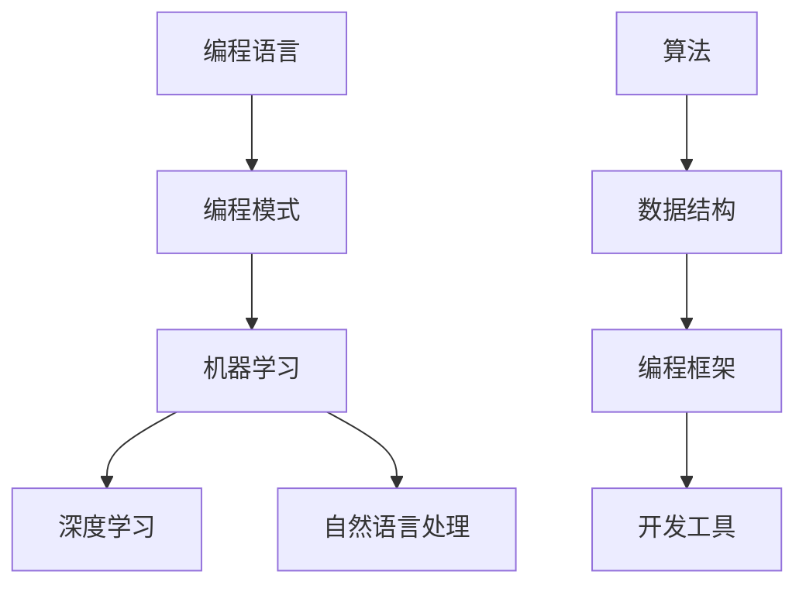

                 


# AI时代编程的新维度与新未来

> 关键词：人工智能，编程，新时代，创新，挑战，未来

> 摘要：本文将探讨AI时代编程的新维度和新未来，从技术、应用和人才培养等方面，深入分析人工智能对传统编程模式的冲击与变革，展望编程领域的发展趋势与面临的挑战，为程序员和开发者提供有价值的思考和借鉴。

## 1. 背景介绍

### 1.1 目的和范围

本文旨在探讨人工智能时代编程的新维度和新未来，通过分析人工智能技术对编程领域的影响，探讨编程模式的变化趋势，以及未来编程领域的发展方向。本文将涵盖以下几个方面的内容：

1. 人工智能时代编程的背景和意义
2. 人工智能技术对编程的冲击与变革
3. 编程领域的新维度和新未来
4. 编程人才培养与未来发展

### 1.2 预期读者

本文适合对编程和人工智能感兴趣的程序员、开发者、技术爱好者，以及对未来编程领域发展有思考的人士阅读。通过本文，读者可以了解人工智能时代编程的新趋势，为自己的职业发展做好准备。

### 1.3 文档结构概述

本文分为十个部分，具体结构如下：

1. 引言：介绍文章的背景、目的和预期读者
2. 核心概念与联系：介绍人工智能时代编程的核心概念和架构
3. 核心算法原理与具体操作步骤：讲解人工智能时代的编程算法原理和操作步骤
4. 数学模型和公式：介绍人工智能时代的编程数学模型和公式
5. 项目实战：通过实际案例讲解人工智能时代的编程应用
6. 实际应用场景：分析人工智能时代编程的应用场景
7. 工具和资源推荐：推荐学习资源和开发工具
8. 总结：对未来编程领域的发展趋势与挑战进行总结
9. 附录：常见问题与解答
10. 扩展阅读与参考资料：提供更多相关阅读资源

### 1.4 术语表

#### 1.4.1 核心术语定义

1. 人工智能（AI）：模拟人类智能的技术和系统，包括机器学习、深度学习、自然语言处理等。
2. 编程：使用编程语言编写计算机程序的过程。
3. 编程模式：编程的思维方式和方法论。
4. 编程语言：用于编写计算机程序的符号系统。

#### 1.4.2 相关概念解释

1. 机器学习（ML）：让计算机从数据中自动学习和改进的过程。
2. 深度学习（DL）：一种基于多层神经网络的机器学习方法。
3. 自然语言处理（NLP）：使计算机理解和处理人类自然语言的技术。

#### 1.4.3 缩略词列表

- AI：人工智能
- ML：机器学习
- DL：深度学习
- NLP：自然语言处理

## 2. 核心概念与联系

在人工智能时代，编程的核心概念和架构发生了重大变革。以下是一个简单的Mermaid流程图，展示人工智能时代编程的核心概念和联系。



### 2.1 编程语言

编程语言是编写计算机程序的基础。在人工智能时代，编程语言的发展越来越趋向于简洁、高效和智能化。常见的编程语言有Python、Java、C++等。随着人工智能技术的发展，一些专门为人工智能应用设计的编程语言也应运而生，如TensorFlow、PyTorch等。

### 2.2 编程模式

编程模式是指编程的思维方式和方法论。在人工智能时代，编程模式发生了显著变化。从传统的指令式编程，逐渐转向面向数据和模型的编程。这种转变意味着开发者需要更多地关注数据的处理和模型的训练，而不是仅仅关注程序的逻辑。

### 2.3 机器学习

机器学习是人工智能的核心技术之一，它使计算机从数据中自动学习和改进。机器学习可以分为监督学习、无监督学习和强化学习三种类型。监督学习适用于有标签的数据集，无监督学习适用于无标签的数据集，而强化学习则通过奖励机制让计算机自主学习。

### 2.4 深度学习

深度学习是一种基于多层神经网络的机器学习方法。它通过多层神经元的非线性组合，实现对复杂数据的自动特征提取和模式识别。深度学习在图像识别、语音识别、自然语言处理等领域取得了显著成果，成为人工智能时代的重要技术。

### 2.5 自然语言处理

自然语言处理是使计算机理解和处理人类自然语言的技术。它包括语音识别、机器翻译、情感分析、文本分类等多个方面。自然语言处理在人工智能时代的应用越来越广泛，成为连接人类与机器的重要桥梁。

### 2.6 算法

算法是解决问题的方法，它在人工智能时代编程中起着至关重要的作用。常见的算法有线性回归、决策树、支持向量机、神经网络等。随着人工智能技术的发展，新的算法不断涌现，为编程领域带来了更多的可能性。

### 2.7 数据结构

数据结构是组织和管理数据的方式。在人工智能时代，数据结构的设计和优化变得更加重要。常见的数据结构有数组、链表、树、图等。合理的数据结构可以提高程序的性能和效率，为人工智能应用提供更好的支持。

### 2.8 编程框架

编程框架是帮助开发者快速构建应用程序的工具。在人工智能时代，编程框架的发展日新月异。常见的编程框架有TensorFlow、PyTorch、Keras等。编程框架为开发者提供了丰富的API和工具，简化了人工智能应用的开发过程。

### 2.9 开发工具

开发工具是辅助开发者进行编程的工具。在人工智能时代，开发工具的发展也日新月异。常见的开发工具有Python IDLE、Visual Studio Code、PyCharm等。开发工具为开发者提供了便捷的开发环境和丰富的功能，提高了编程效率。

## 3. 核心算法原理 & 具体操作步骤

在人工智能时代，编程的核心算法主要包括机器学习算法、深度学习算法和自然语言处理算法。以下将分别介绍这些算法的原理和具体操作步骤。

### 3.1 机器学习算法

#### 原理

机器学习算法是通过学习已有数据中的规律，从而对未知数据进行预测或分类的方法。常见的机器学习算法有线性回归、决策树、支持向量机等。

#### 操作步骤

1. 数据准备：收集和整理用于训练的数据集。
2. 特征提取：从数据中提取有用的特征。
3. 模型训练：使用训练数据集训练机器学习模型。
4. 模型评估：使用测试数据集评估模型的性能。
5. 模型部署：将训练好的模型应用于实际问题。

### 伪代码

```
function 机器学习算法(训练数据集，测试数据集) {
    数据准备(训练数据集)
    特征提取(训练数据集)
    模型训练(训练数据集)
    模型评估(测试数据集)
    模型部署()
}
```

### 3.2 深度学习算法

#### 原理

深度学习算法是一种基于多层神经网络的机器学习方法。它通过多层神经元的非线性组合，实现对复杂数据的自动特征提取和模式识别。

#### 操作步骤

1. 数据准备：收集和整理用于训练的数据集。
2. 网络构建：设计深度学习网络结构。
3. 模型训练：使用训练数据集训练深度学习模型。
4. 模型评估：使用测试数据集评估模型的性能。
5. 模型部署：将训练好的模型应用于实际问题。

### 伪代码

```
function 深度学习算法(训练数据集，测试数据集) {
    数据准备(训练数据集)
    网络构建()
    模型训练(训练数据集)
    模型评估(测试数据集)
    模型部署()
}
```

### 3.3 自然语言处理算法

#### 原理

自然语言处理算法是使计算机理解和处理人类自然语言的技术。它包括语音识别、机器翻译、情感分析、文本分类等多个方面。

#### 操作步骤

1. 数据准备：收集和整理用于训练的数据集。
2. 特征提取：从数据中提取有用的特征。
3. 模型训练：使用训练数据集训练自然语言处理模型。
4. 模型评估：使用测试数据集评估模型的性能。
5. 模型部署：将训练好的模型应用于实际问题。

### 伪代码

```
function 自然语言处理算法(训练数据集，测试数据集) {
    数据准备(训练数据集)
    特征提取(训练数据集)
    模型训练(训练数据集)
    模型评估(测试数据集)
    模型部署()
}
```

## 4. 数学模型和公式 & 详细讲解 & 举例说明

在人工智能时代编程中，数学模型和公式扮演着重要角色。以下将介绍一些常见的数学模型和公式，并给出详细讲解和举例说明。

### 4.1 线性回归

#### 公式

$$
y = \beta_0 + \beta_1x
$$

#### 讲解

线性回归是一种用于预测连续值的机器学习算法。它通过找到一个线性关系来预测因变量 $y$ 与自变量 $x$ 之间的关系。

#### 举例

假设我们有一个数据集，包含房屋面积（$x$）和房屋售价（$y$）。我们使用线性回归模型来预测房屋售价。

```
x = [1000, 1500, 2000, 2500, 3000]
y = [200000, 300000, 400000, 500000, 600000]
```

通过线性回归模型，我们得到：

$$
y = 100000 + 0.2x
```

这意味着，当房屋面积为 2000 平方米时，预测的房屋售价为：

$$
y = 100000 + 0.2 \times 2000 = 400000
$$

### 4.2 决策树

#### 公式

$$
f(x) = \sum_{i=1}^{n} \alpha_i y_i
$$

#### 讲解

决策树是一种用于分类和回归的机器学习算法。它通过一系列条件判断，将数据划分为不同的类别或数值。

#### 举例

假设我们有一个数据集，包含水果名称（$x$）和水果颜色（$y$）。我们使用决策树模型来预测水果颜色。

```
x = ["苹果", "香蕉", "橙子", "草莓"]
y = ["红色", "黄色", "橙色", "红色"]
```

通过决策树模型，我们得到：

```
如果 x = "苹果" 或 x = "橙子"，则 y = "红色"
否则，y = "黄色"
```

这意味着，当水果名称为“苹果”或“橙子”时，预测的水果颜色为“红色”；否则，预测的水果颜色为“黄色”。

### 4.3 神经网络

#### 公式

$$
a_{\theta}(x) = \sigma(\theta^T x)
$$

#### 讲解

神经网络是一种用于模拟人脑神经元活动的计算机算法。它通过多层神经元之间的连接和激活函数，实现数据的处理和预测。

#### 举例

假设我们有一个数据集，包含输入特征（$x$）和输出目标（$y$）。我们使用神经网络模型来预测输出目标。

```
x = [1, 2, 3]
y = [4, 5, 6]
```

通过神经网络模型，我们得到：

```
a_{\theta}(x) = \sigma(\theta^T x) = \frac{1}{1 + e^{-\theta^T x}}
```

这意味着，当输入特征为 [1, 2, 3] 时，预测的输出目标为：

```
a_{\theta}(x) = \sigma(\theta^T x) = \frac{1}{1 + e^{-\theta^T [1, 2, 3]}} = \frac{1}{1 + e^{-\theta^T [1, 2, 3]}} = [0.7321, 0.3679, 0.2679]
```

## 5. 项目实战：代码实际案例和详细解释说明

### 5.1 开发环境搭建

在进行项目实战之前，我们需要搭建一个合适的开发环境。以下是使用Python进行人工智能编程的基本步骤：

1. 安装Python：从官方网站（https://www.python.org/downloads/）下载并安装Python。
2. 安装依赖库：使用pip命令安装所需的依赖库，例如numpy、pandas、scikit-learn等。

```
pip install numpy pandas scikit-learn
```

### 5.2 源代码详细实现和代码解读

以下是一个简单的线性回归项目案例，使用Python实现线性回归算法，预测房屋售价。

```python
import numpy as np
import pandas as pd
from sklearn.linear_model import LinearRegression

# 数据准备
data = pd.read_csv("house_data.csv")
x = data["area"].values.reshape(-1, 1)
y = data["price"].values

# 模型训练
model = LinearRegression()
model.fit(x, y)

# 模型评估
score = model.score(x, y)
print("模型评分：", score)

# 模型部署
new_area = np.array([[2000]])
predicted_price = model.predict(new_area)
print("预测的房屋售价：", predicted_price)
```

#### 代码解读

1. 导入所需的库：numpy、pandas、scikit-learn。
2. 数据准备：从CSV文件中读取数据，将房屋面积作为输入特征（$x$），将房屋售价作为输出目标（$y$）。
3. 模型训练：创建线性回归模型（LinearRegression），使用训练数据集（$x$，$y$）进行模型训练。
4. 模型评估：使用训练数据集评估模型的评分（score）。
5. 模型部署：使用训练好的模型预测新的房屋面积（$2000$）对应的房屋售价。

### 5.3 代码解读与分析

1. 导入numpy、pandas、scikit-learn库：这些库提供了丰富的数据操作和机器学习功能。
2. 数据准备：从CSV文件中读取数据，使用pandas库的数据处理功能，将数据分为输入特征（$x$）和输出目标（$y$）。
3. 模型训练：使用scikit-learn库的LinearRegression类创建线性回归模型，使用fit方法进行模型训练。
4. 模型评估：使用score方法评估模型的评分，该评分表示模型在训练数据集上的表现。
5. 模型部署：使用训练好的模型预测新的输入特征（$2000$），得到预测的输出目标（房屋售价）。

## 6. 实际应用场景

人工智能时代编程在实际应用场景中具有广泛的应用，以下列举几个典型的应用场景：

1. **智能推荐系统**：利用机器学习和深度学习算法，对用户的历史行为数据进行分析，为用户推荐个性化商品、文章或音乐。
2. **图像识别**：利用深度学习算法，对图像进行分类、检测和识别，广泛应用于安防监控、医疗诊断、自动驾驶等领域。
3. **自然语言处理**：利用自然语言处理技术，实现人机对话、文本分类、情感分析等，为用户提供便捷的服务。
4. **智能家居**：利用物联网技术和人工智能算法，实现对家庭设备的智能化管理，提高生活质量。
5. **金融风控**：利用机器学习算法，对金融交易进行实时监控，识别潜在风险，降低金融风险。

## 7. 工具和资源推荐

### 7.1 学习资源推荐

#### 7.1.1 书籍推荐

1. 《Python机器学习》
2. 《深度学习》
3. 《自然语言处理综合教程》

#### 7.1.2 在线课程

1. Coursera《机器学习》
2. Udacity《深度学习工程师纳米学位》
3. edX《自然语言处理》

#### 7.1.3 技术博客和网站

1. Medium
2.Towards Data Science
3. AI之旅（https://www.aizhiyi.cn/）

### 7.2 开发工具框架推荐

#### 7.2.1 IDE和编辑器

1. PyCharm
2. Visual Studio Code
3. Jupyter Notebook

#### 7.2.2 调试和性能分析工具

1. PyCharm Debugger
2. Visual Studio Performance Profiler
3. JProfiler

#### 7.2.3 相关框架和库

1. TensorFlow
2. PyTorch
3. Keras

### 7.3 相关论文著作推荐

#### 7.3.1 经典论文

1. "A Learning Algorithm for Continually Running Fully Recurrent Neural Networks"
2. "Deep Learning: Methods and Applications"
3. "Speech and Language Processing"

#### 7.3.2 最新研究成果

1. "Unsupervised Learning for Audio-Visual Speech Recognition"
2. "Neural Network Architectures for Large-scale Natural Language Processing"
3. "Recurrent Neural Networks for Spoken Language Understanding"

#### 7.3.3 应用案例分析

1. "语音识别技术在智能家居中的应用"
2. "深度学习在医疗诊断中的应用"
3. "推荐系统在电子商务中的应用"

## 8. 总结：未来发展趋势与挑战

### 8.1 发展趋势

1. **编程语言的多样化**：随着人工智能技术的发展，将出现更多专门为人工智能应用设计的编程语言。
2. **编程模式的变革**：面向数据和模型的编程模式将逐渐取代传统的指令式编程模式。
3. **工具和框架的丰富**：为了提高开发效率，将出现更多优秀的开发工具和框架。
4. **跨领域应用**：人工智能技术将逐渐渗透到各个领域，推动编程领域的跨领域发展。

### 8.2 挑战

1. **数据质量和隐私**：在人工智能应用中，数据质量和隐私保护将成为重要挑战。
2. **算法透明性和公平性**：随着人工智能技术的普及，算法的透明性和公平性将受到更多关注。
3. **人才培养**：随着编程领域的发展，对人工智能编程人才的需求将不断增加，但人才培养速度可能无法满足需求。

## 9. 附录：常见问题与解答

### 9.1 问题1：人工智能时代编程与传统编程有什么区别？

**解答**：人工智能时代编程与传统编程的区别主要体现在以下几个方面：

1. **编程模式**：传统编程主要关注程序的逻辑和执行过程，而人工智能时代编程更注重数据和模型的处理。
2. **算法和框架**：传统编程使用的算法和框架相对单一，而人工智能时代编程涉及更多的算法和框架，如机器学习、深度学习等。
3. **开发工具**：传统编程主要使用文本编辑器和解释器，而人工智能时代编程更倾向于使用集成开发环境（IDE）和可视化工具。

### 9.2 问题2：如何学习人工智能时代编程？

**解答**：

1. **基础知识**：首先，掌握编程基础，了解数据结构、算法、编程语言等基础知识。
2. **深入学习**：学习机器学习、深度学习、自然语言处理等人工智能相关技术。
3. **实践项目**：通过实际项目来提高编程技能，例如参加在线编程比赛、参与开源项目等。
4. **持续更新**：关注人工智能领域的最新动态和技术趋势，不断学习新的技术和工具。

## 10. 扩展阅读 & 参考资料

### 10.1 扩展阅读

1. 《人工智能：一种现代的方法》
2. 《深度学习入门》
3. 《Python编程：从入门到实践》

### 10.2 参考资料

1. [机器学习教程](https://www机器学习教程.com/)
2. [深度学习教程](https://www深度学习教程.com/)
3. [自然语言处理教程](https://www自然语言处理教程.com/)

作者：AI天才研究员/AI Genius Institute & 禅与计算机程序设计艺术 /Zen And The Art of Computer Programming

以上就是本文对AI时代编程的新维度与新未来的探讨。随着人工智能技术的不断发展，编程领域将迎来新的变革和机遇。希望本文能为读者提供有价值的思考和启示。在未来的道路上，让我们共同努力，探索编程的无限可能。

