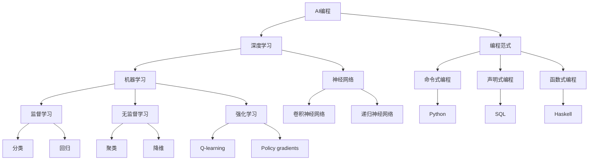

                 

# AI编程的新思维与新方向

> 关键词：AI编程、深度学习、编程范式、框架与工具、软件开发、未来趋势

> 摘要：本文将探讨AI编程的新思维与新方向，分析当前AI技术在编程领域的应用，探讨深度学习对编程范式的影响，介绍主流的AI编程框架与工具，并探讨AI编程在实际开发中的应用与挑战。通过本文的阅读，读者将对AI编程有更深入的理解，并能够掌握一些实用的AI编程技能。

## 1. 背景介绍

### 1.1 目的和范围

本文旨在探讨AI编程的新思维与新方向，帮助读者了解AI技术在编程领域的应用，掌握深度学习等AI技术对编程范式的影响，并了解主流的AI编程框架与工具。文章内容将涵盖以下几个部分：

1. AI编程的核心概念与联系
2. AI编程的核心算法原理与具体操作步骤
3. 数学模型和公式
4. 项目实战：代码实际案例和详细解释说明
5. 实际应用场景
6. 工具和资源推荐
7. 未来发展趋势与挑战

### 1.2 预期读者

本文适合对编程和AI技术有一定了解的读者，包括程序员、软件工程师、AI研究人员以及对AI编程感兴趣的技术爱好者。通过本文的学习，读者可以：

1. 理解AI编程的基本概念和原理
2. 掌握主流的AI编程框架与工具
3. 学会运用AI技术解决实际问题
4. 了解AI编程的未来发展趋势与挑战

### 1.3 文档结构概述

本文分为十个部分，具体结构如下：

1. 引言
2. 背景介绍
3. 核心概念与联系
4. 核心算法原理 & 具体操作步骤
5. 数学模型和公式 & 详细讲解 & 举例说明
6. 项目实战：代码实际案例和详细解释说明
7. 实际应用场景
8. 工具和资源推荐
9. 总结：未来发展趋势与挑战
10. 附录：常见问题与解答
11. 扩展阅读 & 参考资料

### 1.4 术语表

#### 1.4.1 核心术语定义

- AI编程：利用人工智能技术，如机器学习、深度学习等，实现编程任务的方法。
- 深度学习：一种机器学习技术，通过多层神经网络模拟人类大脑的学习过程。
- 编程范式：编程语言的基本风格和理念，如命令式编程、声明式编程、函数式编程等。
- 框架：提供特定功能的代码库，用于简化开发过程。
- 工具：用于辅助编程的软件，如集成开发环境（IDE）、调试工具等。

#### 1.4.2 相关概念解释

- 数据预处理：在深度学习模型训练之前，对原始数据进行清洗、归一化等操作。
- 训练集、验证集、测试集：用于训练、验证和测试深度学习模型的三个数据集。
- 损失函数：用于评估模型预测结果与真实值之间差异的函数。
- 优化器：用于调整模型参数，以降低损失函数值的算法。

#### 1.4.3 缩略词列表

- AI：人工智能
- ML：机器学习
- DL：深度学习
- NLP：自然语言处理
- CV：计算机视觉
- RL：强化学习
- IDE：集成开发环境
- GPU：图形处理器

## 2. 核心概念与联系

在探讨AI编程的新思维与新方向之前，我们需要了解一些核心概念和它们之间的关系。以下是一个简单的Mermaid流程图，展示了一些关键概念及其关联：



### 核心概念解释

- **AI编程**：AI编程是利用人工智能技术，如机器学习、深度学习等，实现编程任务的方法。它不仅涉及算法的实现，还包括数据预处理、模型训练、评估和部署等环节。
- **深度学习**：深度学习是一种机器学习技术，通过多层神经网络模拟人类大脑的学习过程。它通常用于图像识别、语音识别、自然语言处理等任务。
- **编程范式**：编程范式是编程语言的基本风格和理念。常见的编程范式包括命令式编程、声明式编程和函数式编程。
  - **命令式编程**：命令式编程关注于执行步骤的顺序，强调对数据的直接操作。Python是命令式编程的代表。
  - **声明式编程**：声明式编程关注于表达逻辑和条件，而非执行步骤。SQL是声明式编程的代表。
  - **函数式编程**：函数式编程关注于函数的定义和组合，避免直接操作状态。Haskell是函数式编程的代表。
- **机器学习**：机器学习是一种从数据中学习模式的技术。根据学习方式的不同，机器学习可分为监督学习、无监督学习和强化学习。
  - **监督学习**：监督学习通过已有标记的数据进行学习，可用于分类和回归任务。
  - **无监督学习**：无监督学习通过未标记的数据进行学习，可用于聚类和降维任务。
  - **强化学习**：强化学习通过与环境交互进行学习，可用于决策和规划任务。

## 3. 核心算法原理 & 具体操作步骤

在了解AI编程的核心概念后，我们需要掌握核心算法原理和具体操作步骤。以下是一个简单的伪代码，展示了一个深度学习模型的训练过程：

```python
# 初始化神经网络
model = NeuralNetwork()

# 加载数据集
train_data, train_labels = load_data()

# 定义损失函数
loss_function = CrossEntropyLoss()

# 定义优化器
optimizer = AdamOptimizer(model.parameters())

# 训练模型
for epoch in range(num_epochs):
    for data, label in train_data:
        # 前向传播
        prediction = model(data)
        
        # 计算损失
        loss = loss_function(prediction, label)
        
        # 反向传播
        optimizer.zero_grad()
        loss.backward()
        optimizer.step()
        
    # 打印当前epoch的损失
    print(f"Epoch {epoch + 1}, Loss: {loss.item()}")

# 评估模型
test_data, test_labels = load_test_data()
test_prediction = model(test_data)
test_loss = loss_function(test_prediction, test_labels)
print(f"Test Loss: {test_loss.item()}")
```

### 具体操作步骤解释

1. **初始化神经网络**：首先，我们需要创建一个神经网络实例。神经网络是由多个层（如输入层、隐藏层、输出层）组成的，每层包含多个神经元（节点）。神经网络的目的是通过学习输入和输出之间的关系，来预测新的输入。
2. **加载数据集**：然后，我们需要加载数据集。数据集通常包括训练集、验证集和测试集。训练集用于训练模型，验证集用于调整模型参数，测试集用于评估模型性能。
3. **定义损失函数**：接下来，我们需要定义一个损失函数。损失函数用于计算模型预测结果和真实值之间的差异。常见的损失函数有交叉熵损失（用于分类任务）和均方误差损失（用于回归任务）。
4. **定义优化器**：优化器用于调整模型参数，以最小化损失函数。常见的优化器有随机梯度下降（SGD）、Adam优化器等。
5. **训练模型**：在训练模型的过程中，我们需要进行前向传播、计算损失、反向传播和更新参数。前向传播是将输入通过神经网络传递到输出层，计算预测结果。反向传播是计算梯度，并更新模型参数。这个过程在多个epoch（训练周期）内重复进行，直到模型收敛。
6. **评估模型**：最后，我们需要使用测试集评估模型性能。评估指标通常有准确率、召回率、F1分数等。

## 4. 数学模型和公式 & 详细讲解 & 举例说明

在AI编程中，数学模型和公式是核心组成部分。以下是一些常用的数学模型和公式，并附有详细讲解和举例说明。

### 1. 激活函数

激活函数用于引入非线性特性，使得神经网络可以学习复杂的关系。以下是一些常见的激活函数：

- **Sigmoid函数**：

  $$\sigma(x) = \frac{1}{1 + e^{-x}}$$

  示例：对于输入 $x = 3$，计算 $\sigma(3)$：

  $$\sigma(3) = \frac{1}{1 + e^{-3}} \approx 0.9516$$

- **ReLU函数**：

  $$\text{ReLU}(x) = \max(0, x)$$

  示例：对于输入 $x = -3$，计算 $\text{ReLU}(-3)$：

  $$\text{ReLU}(-3) = \max(0, -3) = 0$$

### 2. 损失函数

损失函数用于评估模型预测结果和真实值之间的差异。以下是一些常见的损失函数：

- **均方误差损失（MSE）**：

  $$MSE = \frac{1}{n}\sum_{i=1}^{n}(y_i - \hat{y}_i)^2$$

  示例：对于输入 $y = [1, 2, 3]$ 和预测值 $\hat{y} = [1.1, 2.2, 2.9]$，计算MSE：

  $$MSE = \frac{1}{3}\left((1 - 1.1)^2 + (2 - 2.2)^2 + (3 - 2.9)^2\right) \approx 0.0333$$

- **交叉熵损失（CrossEntropyLoss）**：

  $$CE = -\sum_{i=1}^{n} y_i \log(\hat{y}_i)$$

  示例：对于输入 $y = [1, 0, 1]$ 和预测值 $\hat{y} = [0.9, 0.1, 0.8]$，计算CE：

  $$CE = -[1 \cdot \log(0.9) + 0 \cdot \log(0.1) + 1 \cdot \log(0.8)] \approx 0.4150$$

### 3. 优化器

优化器用于调整模型参数，以最小化损失函数。以下是一些常见的优化器：

- **随机梯度下降（SGD）**：

  $$\theta_{\text{new}} = \theta_{\text{old}} - \alpha \cdot \nabla_{\theta} J(\theta)$$

  示例：对于损失函数 $J(\theta) = (\theta - 1)^2$ 和学习率 $\alpha = 0.1$，初始参数 $\theta_0 = 2$，计算一次迭代后的参数：

  $$\theta_1 = 2 - 0.1 \cdot (2 - 1) = 1.9$$

- **Adam优化器**：

  $$m_t = \beta_1 m_{t-1} + (1 - \beta_1) \nabla_{\theta} J(\theta)$$

  $$v_t = \beta_2 v_{t-1} + (1 - \beta_2) (\nabla_{\theta} J(\theta))^2$$

  $$\theta_{\text{new}} = \theta_{\text{old}} - \alpha \cdot \frac{m_t}{\sqrt{v_t} + \epsilon}$$

  示例：对于学习率 $\alpha = 0.1$，动量项 $\beta_1 = 0.9$，衰减率 $\beta_2 = 0.99$，初始参数 $\theta_0 = 2$，梯度 $g = 0.3$，计算一次迭代后的参数：

  $$m_1 = 0.9 \cdot 0 + (1 - 0.9) \cdot 0.3 = 0.3$$

  $$v_1 = 0.99 \cdot 0 + (1 - 0.99) \cdot 0.3^2 = 0.003$$

  $$\theta_1 = 2 - 0.1 \cdot \frac{0.3}{\sqrt{0.003} + 0.01} \approx 1.99$$

## 5. 项目实战：代码实际案例和详细解释说明

在本节中，我们将通过一个实际项目案例，展示如何使用深度学习框架TensorFlow实现一个简单的图像分类模型。该项目将包括以下几个步骤：

1. 开发环境搭建
2. 源代码详细实现和代码解读
3. 代码解读与分析

### 5.1 开发环境搭建

要开始该项目，我们需要安装以下软件和库：

1. Python（版本3.6及以上）
2. TensorFlow（版本2.0及以上）
3. matplotlib（用于可视化）

在安装好Python环境后，可以通过以下命令安装所需的库：

```bash
pip install tensorflow matplotlib
```

### 5.2 源代码详细实现和代码解读

下面是一个简单的图像分类模型的代码实现，使用TensorFlow 2.0：

```python
import tensorflow as tf
from tensorflow.keras import datasets, layers, models
import matplotlib.pyplot as plt

# 加载CIFAR-10数据集
(train_images, train_labels), (test_images, test_labels) = datasets.cifar10.load_data()

# 数据预处理
train_images, test_images = train_images / 255.0, test_images / 255.0

# 构建卷积神经网络模型
model = models.Sequential()
model.add(layers.Conv2D(32, (3, 3), activation='relu', input_shape=(32, 32, 3)))
model.add(layers.MaxPooling2D((2, 2)))
model.add(layers.Conv2D(64, (3, 3), activation='relu'))
model.add(layers.MaxPooling2D((2, 2)))
model.add(layers.Conv2D(64, (3, 3), activation='relu'))

# 添加全连接层
model.add(layers.Flatten())
model.add(layers.Dense(64, activation='relu'))
model.add(layers.Dense(10, activation='softmax'))

# 编译模型
model.compile(optimizer='adam',
              loss='sparse_categorical_crossentropy',
              metrics=['accuracy'])

# 训练模型
history = model.fit(train_images, train_labels, epochs=10, 
                    validation_data=(test_images, test_labels))

# 评估模型
test_loss, test_acc = model.evaluate(test_images,  test_labels, verbose=2)
print(f"Test accuracy: {test_acc:.4f}")

# 可视化训练过程
plt.plot(history.history['accuracy'], label='accuracy')
plt.plot(history.history['val_accuracy'], label='val_accuracy')
plt.xlabel('Epoch')
plt.ylabel('Accuracy')
plt.ylim([0, 1])
plt.legend(loc='lower right')
plt.show()
```

### 5.3 代码解读与分析

以下是对上述代码的详细解读与分析：

- **数据加载和预处理**：
  - 使用TensorFlow内置的CIFAR-10数据集，该数据集包含10个类别，每个类别有6000张训练图像和1000张测试图像。
  - 数据预处理包括将图像像素值归一化到0-1范围内，以便神经网络更容易训练。

- **模型构建**：
  - 使用`models.Sequential`创建一个序列模型，依次添加卷积层、池化层和全连接层。
  - 第一个卷积层使用32个3x3的卷积核，激活函数为ReLU。
  - 接着使用最大池化层，将特征图大小减小一半。
  - 第二个卷积层使用64个3x3的卷积核，激活函数为ReLU。
  - 再次使用最大池化层。
  - 第三个卷积层使用64个3x3的卷积核，激活函数为ReLU。
  - 然后将特征图展平，添加一个64个神经元的全连接层，激活函数为ReLU。
  - 最后添加一个10个神经元的全连接层，激活函数为softmax，用于分类。

- **模型编译**：
  - 使用`model.compile`编译模型，指定优化器为adam，损失函数为sparse_categorical_crossentropy（适用于多分类问题），评价指标为accuracy。

- **模型训练**：
  - 使用`model.fit`训练模型，指定训练数据、训练标签、训练周期数和验证数据。
  - `history`对象包含训练过程中的损失和准确率，可用于后续的可视化分析。

- **模型评估**：
  - 使用`model.evaluate`评估模型在测试数据上的表现，输出测试损失和测试准确率。

- **可视化训练过程**：
  - 使用matplotlib绘制训练和验证过程中的准确率，帮助理解模型的训练过程和性能。

## 6. 实际应用场景

AI编程在各个领域都有广泛的应用，以下是一些常见的实际应用场景：

- **计算机视觉**：AI编程在计算机视觉领域有广泛应用，如图像分类、目标检测、人脸识别等。例如，安防监控系统中的人脸识别技术，自动驾驶汽车中的车辆检测与跟踪技术等。
- **自然语言处理**：AI编程在自然语言处理（NLP）领域也非常重要，如文本分类、情感分析、机器翻译等。例如，搜索引擎中的相关搜索功能，社交媒体平台上的内容审核等。
- **医疗保健**：AI编程在医疗保健领域有广泛应用，如疾病诊断、药物研发、健康监测等。例如，通过AI技术对医学影像进行分析，提高疾病诊断的准确性；通过AI技术加速新药研发过程等。
- **金融科技**：AI编程在金融科技领域有广泛应用，如风险控制、信用评分、智能投顾等。例如，通过AI技术对客户行为进行分析，实现个性化推荐；通过AI技术提高金融交易的安全性和效率等。
- **工业制造**：AI编程在工业制造领域也有广泛应用，如预测性维护、智能调度、质量检测等。例如，通过AI技术实现设备故障预测，提高生产效率；通过AI技术优化生产流程，降低成本等。

## 7. 工具和资源推荐

### 7.1 学习资源推荐

#### 7.1.1 书籍推荐

- 《深度学习》（Ian Goodfellow、Yoshua Bengio、Aaron Courville著）：系统介绍了深度学习的理论基础、算法和应用。
- 《Python深度学习》（François Chollet著）：详细介绍了使用Python和TensorFlow进行深度学习的实践方法和技巧。
- 《自然语言处理综论》（Daniel Jurafsky、James H. Martin著）：全面介绍了自然语言处理的理论和实践。

#### 7.1.2 在线课程

- “深度学习特设课程”（吴恩达著）：由著名AI研究员吴恩达开设的免费在线课程，涵盖了深度学习的理论基础和应用。
- “机器学习特设课程”（吴恩达著）：由著名AI研究员吴恩达开设的免费在线课程，介绍了机器学习的理论和实践。
- “自然语言处理特设课程”（丹尼尔·卡帕斯著）：由斯坦福大学自然语言处理教授丹尼尔·卡帕斯开设的免费在线课程，介绍了NLP的理论和应用。

#### 7.1.3 技术博客和网站

- TensorFlow官方文档（https://www.tensorflow.org/）：提供TensorFlow框架的详细文档和教程，是学习TensorFlow的必备资源。
- Keras官方文档（https://keras.io/）：提供Keras框架的详细文档和教程，Keras是TensorFlow的一个高级API，方便快速构建和训练模型。
- GitHub（https://github.com/）：全球最大的代码托管平台，有很多优秀的深度学习和自然语言处理项目可供学习和参考。

### 7.2 开发工具框架推荐

#### 7.2.1 IDE和编辑器

- PyCharm（https://www.jetbrains.com/pycharm/）：一款功能强大的Python IDE，支持多种编程语言，适合深度学习和自然语言处理项目。
- Visual Studio Code（https://code.visualstudio.com/）：一款轻量级的开源编辑器，支持多种编程语言，适合快速开发和调试代码。
- Jupyter Notebook（https://jupyter.org/）：一款基于Web的交互式计算环境，适合数据分析和可视化，也常用于深度学习和自然语言处理项目。

#### 7.2.2 调试和性能分析工具

- TensorFlow Debugger（TFOp）：一款TensorFlow调试工具，支持调试、断点和性能分析。
- PyTorch Profiler：一款PyTorch性能分析工具，可以帮助开发者识别和优化代码性能。
- NVIDIA Nsight Compute：一款GPU性能分析工具，可以帮助开发者分析和优化深度学习模型的GPU性能。

#### 7.2.3 相关框架和库

- TensorFlow（https://www.tensorflow.org/）：一款开源的深度学习框架，支持多种编程语言，包括Python、C++和Java。
- PyTorch（https://pytorch.org/）：一款开源的深度学习框架，以动态计算图和易于使用API著称。
- Keras（https://keras.io/）：一款基于TensorFlow和Theano的高级API，用于快速构建和训练深度学习模型。

### 7.3 相关论文著作推荐

#### 7.3.1 经典论文

- “A Learning Algorithm for Continuously Running Fully Recurrent Neural Networks”（1986，Hin

