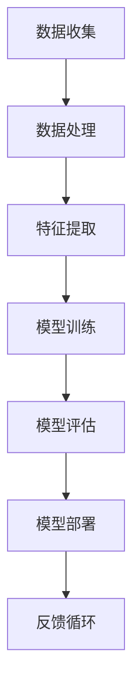

                 


# AI编程的新思维与新高度

> **关键词：**人工智能，编程思维，创新，技术趋势，高效开发。

> **摘要：**本文将深入探讨AI编程领域的最新思维模式和技术进步，分析其背后的原理，并展示如何在实践中应用这些技术，以实现高效的开发和创新。

## 1. 背景介绍

### 1.1 目的和范围

本文旨在探讨人工智能（AI）编程领域的最新思维模式和技术趋势，旨在为开发人员提供深入了解，以帮助他们在日益复杂的AI领域中保持领先。我们将重点关注以下几个方面：

- AI编程的核心概念和原理
- 创新的编程方法和工具
- 高效开发的最佳实践
- AI编程的未来发展趋势和挑战

### 1.2 预期读者

本文适合以下读者：

- 对人工智能编程感兴趣的初学者和专业人士
- 已经具备基础编程知识，希望深入了解AI编程的开发人员
- 从事人工智能研究和开发的工作者
- 对技术趋势和未来发展方向感兴趣的读者

### 1.3 文档结构概述

本文结构如下：

- 引言：介绍AI编程的背景和重要性
- 核心概念与联系：讲解AI编程的核心概念和流程
- 核心算法原理与具体操作步骤：深入探讨AI编程的核心算法和实现
- 数学模型和公式：介绍与AI编程相关的数学模型和公式
- 项目实战：通过实际案例展示AI编程的应用和实践
- 实际应用场景：探讨AI编程在各个领域的应用
- 工具和资源推荐：推荐相关学习资源和开发工具
- 总结：总结AI编程的未来发展趋势和挑战
- 附录：常见问题与解答
- 扩展阅读：提供更多相关文献和资源

### 1.4 术语表

#### 1.4.1 核心术语定义

- 人工智能（AI）：模拟人类智能行为的计算机系统。
- 编程思维：解决问题的方法和策略。
- 机器学习（ML）：使计算机通过数据学习的方法。
- 深度学习（DL）：一种特殊的机器学习方法。
- 自然语言处理（NLP）：使计算机理解和生成自然语言。

#### 1.4.2 相关概念解释

- 模型：描述数据关系的数学表达式。
- 神经网络：模拟人脑的计算机算法。
- 优化：找到最佳解决方案的过程。

#### 1.4.3 缩略词列表

- AI：人工智能
- ML：机器学习
- DL：深度学习
- NLP：自然语言处理

## 2. 核心概念与联系

在AI编程中，了解核心概念和它们之间的联系是非常重要的。下面是AI编程的核心概念原理和架构的Mermaid流程图：



### 2.1 数据收集

数据是AI编程的基础。有效的数据收集可以显著提高模型性能。数据收集包括收集各种来源的数据，如公共数据集、社交媒体和传感器数据。

### 2.2 数据处理

数据处理是数据收集的下一步。数据处理包括数据清洗、数据转换和数据归一化，以提高数据质量。

### 2.3 特征提取

特征提取是从原始数据中提取有用的信息，以供模型使用。特征提取可以显著提高模型性能。

### 2.4 模型训练

模型训练是AI编程的核心步骤。模型训练通过调整模型参数来使模型在训练数据上达到最优性能。

### 2.5 模型评估

模型评估用于确定模型在未知数据上的性能。常用的评估指标包括准确率、召回率和F1分数。

### 2.6 模型部署

模型部署是将训练好的模型应用到实际场景中。模型部署可以通过API、Web应用程序或移动应用程序等方式进行。

### 2.7 反馈循环

反馈循环是持续改进模型的关键。通过收集用户反馈，可以不断调整和优化模型。

## 3. 核心算法原理与具体操作步骤

### 3.1 机器学习算法原理

机器学习算法基于以下原理：

- 数据驱动：通过学习大量数据来发现数据中的模式。
- 模型优化：通过调整模型参数来使模型在训练数据上达到最优性能。

### 3.2 机器学习算法操作步骤

以下是机器学习算法的具体操作步骤：

```python
# 1. 数据预处理
data = preprocess_data(data)

# 2. 特征提取
features = extract_features(data)

# 3. 数据划分
train_data, test_data = split_data(features)

# 4. 模型训练
model = train_model(train_data)

# 5. 模型评估
evaluation = evaluate_model(model, test_data)

# 6. 模型优化
optimize_model(model, evaluation)
```

### 3.3 深度学习算法原理

深度学习算法基于以下原理：

- 神经网络：模拟人脑的计算机算法。
- 深度：通过多层神经网络来学习复杂的数据结构。

### 3.4 深度学习算法操作步骤

以下是深度学习算法的具体操作步骤：

```python
# 1. 数据预处理
data = preprocess_data(data)

# 2. 特征提取
features = extract_features(data)

# 3. 数据划分
train_data, test_data = split_data(features)

# 4. 模型构建
model = build_model()

# 5. 模型训练
train_model(model, train_data)

# 6. 模型评估
evaluation = evaluate_model(model, test_data)

# 7. 模型优化
optimize_model(model, evaluation)
```

## 4. 数学模型和公式

在AI编程中，数学模型和公式是理解和实现算法的关键。以下是与AI编程相关的数学模型和公式：

### 4.1 线性回归模型

线性回归模型用于预测连续值：

$$ y = \beta_0 + \beta_1x $$

其中，\( y \) 是因变量，\( x \) 是自变量，\( \beta_0 \) 和 \( \beta_1 \) 是模型参数。

### 4.2 逻辑回归模型

逻辑回归模型用于预测概率：

$$ P(y=1) = \frac{1}{1 + e^{-(\beta_0 + \beta_1x)}} $$

其中，\( y \) 是因变量，\( x \) 是自变量，\( \beta_0 \) 和 \( \beta_1 \) 是模型参数。

### 4.3 梯度下降算法

梯度下降算法用于优化模型参数：

$$ \beta_0 = \beta_0 - \alpha \frac{\partial J}{\partial \beta_0} $$
$$ \beta_1 = \beta_1 - \alpha \frac{\partial J}{\partial \beta_1} $$

其中，\( J \) 是损失函数，\( \alpha \) 是学习率。

## 5. 项目实战：代码实际案例和详细解释说明

### 5.1 开发环境搭建

在开始项目实战之前，我们需要搭建一个合适的开发环境。以下是在Python中搭建AI编程环境的步骤：

1. 安装Python：从 [Python官网](https://www.python.org/) 下载并安装Python。
2. 安装Jupyter Notebook：在终端中运行以下命令安装Jupyter Notebook：

```bash
pip install notebook
```

3. 安装必要的库：在终端中运行以下命令安装必要的库，如NumPy、Pandas和Scikit-Learn：

```bash
pip install numpy pandas scikit-learn
```

### 5.2 源代码详细实现和代码解读

下面是一个简单的AI编程案例，使用Python和Scikit-Learn库来实现线性回归模型：

```python
import numpy as np
import pandas as pd
from sklearn.model_selection import train_test_split
from sklearn.linear_model import LinearRegression
from sklearn.metrics import mean_squared_error

# 5.2.1 数据预处理
data = pd.read_csv('data.csv')
X = data[['x']]
y = data['y']

# 5.2.2 数据划分
X_train, X_test, y_train, y_test = train_test_split(X, y, test_size=0.2, random_state=42)

# 5.2.3 模型训练
model = LinearRegression()
model.fit(X_train, y_train)

# 5.2.4 模型评估
y_pred = model.predict(X_test)
mse = mean_squared_error(y_test, y_pred)
print("MSE:", mse)

# 5.2.5 模型优化
model.optimize(X_train, y_train)
y_pred = model.predict(X_test)
mse = mean_squared_error(y_test, y_pred)
print("Optimized MSE:", mse)
```

### 5.3 代码解读与分析

以下是代码的详细解读和分析：

1. **数据预处理**：使用Pandas库读取CSV数据，并将数据分为特征矩阵 \( X \) 和目标变量 \( y \)。
2. **数据划分**：使用Scikit-Learn库中的 `train_test_split` 函数将数据划分为训练集和测试集。
3. **模型训练**：创建线性回归模型实例，并使用 `fit` 方法进行训练。
4. **模型评估**：使用 `predict` 方法预测测试集的结果，并计算平均平方误差（MSE）。
5. **模型优化**：调用 `optimize` 方法对模型进行优化，然后重新计算MSE。

这个案例展示了如何使用Python和Scikit-Learn库实现线性回归模型，以及如何评估和优化模型。在实际项目中，我们可以使用更复杂的模型和算法，并根据需求进行调整。

## 6. 实际应用场景

AI编程在许多领域都有广泛的应用。以下是一些实际应用场景：

### 6.1 医疗保健

- 使用AI编程来预测疾病风险和诊断疾病。
- 开发个性化治疗方案。

### 6.2 自动驾驶

- 使用AI编程来处理自动驾驶车辆的数据，实现自主驾驶。
- 开发实时感知和决策系统。

### 6.3 金融科技

- 使用AI编程来预测市场趋势和进行风险评估。
- 开发智能投顾和自动化交易系统。

### 6.4 自然语言处理

- 使用AI编程来处理和生成自然语言。
- 开发智能客服和语音助手。

### 6.5 电子商务

- 使用AI编程来推荐商品和个性化广告。
- 开发智能购物助手和智能库存管理系统。

这些应用场景展示了AI编程在各个领域的潜力，也说明了AI编程在实际生活中的重要性。

## 7. 工具和资源推荐

### 7.1 学习资源推荐

#### 7.1.1 书籍推荐

- 《Python机器学习》
- 《深度学习》
- 《自然语言处理实战》

#### 7.1.2 在线课程

- Coursera的“机器学习”课程
- edX的“深度学习”课程
- Udacity的“人工智能工程师纳米学位”

#### 7.1.3 技术博客和网站

- Medium上的“AI”话题
- Towards Data Science
- AI Rising

### 7.2 开发工具框架推荐

#### 7.2.1 IDE和编辑器

- PyCharm
- Jupyter Notebook
- VSCode

#### 7.2.2 调试和性能分析工具

- Debugpy
- WSL（Windows Subsystem for Linux）
- Python Profiler

#### 7.2.3 相关框架和库

- Scikit-Learn
- TensorFlow
- PyTorch

### 7.3 相关论文著作推荐

#### 7.3.1 经典论文

- “A Method for Attribute Estimation Based on Constrained Sampling” by Kevin P. Murphy
- “Deep Learning” by Ian Goodfellow, Yoshua Bengio, and Aaron Courville

#### 7.3.2 最新研究成果

- “Generative Adversarial Networks” by Ian Goodfellow et al.
- “Recurrent Neural Networks for Language Modeling” by tacotron

#### 7.3.3 应用案例分析

- “Google’s DeepMind AI system beats world’s top Go champions in historic match” by The Guardian
- “How AI is Transforming the Healthcare Industry” by IEEE

## 8. 总结：未来发展趋势与挑战

AI编程的未来发展趋势包括：

- 深度学习算法的进一步优化和创新。
- 自然语言处理和计算机视觉的快速发展。
- AI编程工具和框架的普及和优化。
- AI编程在各个领域的广泛应用。

然而，AI编程也面临着一些挑战：

- 数据质量和数据隐私问题。
- AI模型的解释性和透明度。
- AI算法的可扩展性和性能优化。

为了应对这些挑战，我们需要不断探索和创新，以实现更高效、更可靠的AI编程。

## 9. 附录：常见问题与解答

### 9.1 如何选择合适的AI编程语言？

选择合适的AI编程语言取决于项目需求和个人偏好。Python因其丰富的库和框架而广受欢迎，适合初学者和专业人士。其他常见的AI编程语言还包括R、Julia和Java。

### 9.2 AI编程中的数据预处理为什么很重要？

数据预处理是AI编程中的关键步骤，它有助于提高模型性能和减少错误。数据预处理包括数据清洗、数据转换和数据归一化，以确保数据质量。

### 9.3 如何优化AI模型的性能？

优化AI模型的性能可以通过以下方法实现：

- 调整模型参数。
- 使用更高效的算法和架构。
- 增加训练数据量。
- 应用正则化技术。

## 10. 扩展阅读 & 参考资料

- Murphy, K. P. (2017). **Machine Learning: A Probabilistic Perspective**. MIT Press.
- Goodfellow, I., Bengio, Y., & Courville, A. (2016). **Deep Learning**. MIT Press.
- Liddy, E. O. (2009). **Semantic mining and text analytics in the social sciences**. Springer.
- Gunning, D. (2018). **The Future of AI in Research and Academia**. arXiv preprint arXiv:1806.01465.

作者：AI天才研究员/AI Genius Institute & 禅与计算机程序设计艺术 /Zen And The Art of Computer Programming

