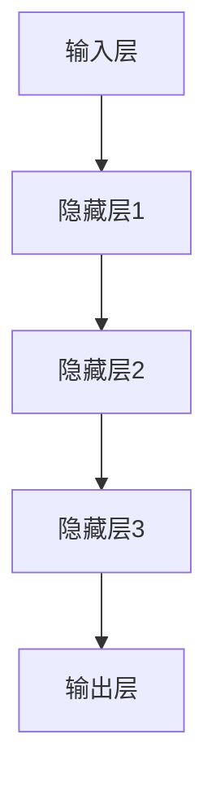

                 

# AI编程的新维度与新视野

> 关键词：人工智能，编程范式，深度学习，神经网络，分布式计算，智能编程

> 摘要：本文将探讨人工智能编程领域的新维度和新视野，从核心概念到实际应用，深入解析AI编程的发展趋势。我们将讨论现代AI编程的核心原理，包括深度学习与神经网络的工作机制，以及分布式计算的优势。此外，本文还将展示如何通过智能编程技术提高开发效率，并推荐相关学习资源与工具。通过逐步分析和推理，我们希望能够为读者提供一个清晰、全面的人工智能编程指南。

## 1. 背景介绍

### 1.1 目的和范围

本文旨在深入探讨人工智能（AI）编程领域的最新进展和未来趋势。随着深度学习和神经网络技术的迅猛发展，AI编程已经成为计算机科学中一个极其重要的分支。本文将围绕以下几个主要方面展开：

1. **核心概念与联系**：我们将详细讨论深度学习与神经网络的基本原理，以及它们在现代AI编程中的重要性。
2. **核心算法原理**：我们将介绍深度学习算法的具体实现步骤，包括反向传播算法和前向传播算法。
3. **数学模型和公式**：我们将讲解深度学习中的关键数学模型，如卷积神经网络（CNN）和循环神经网络（RNN）。
4. **项目实战**：我们将通过实际代码案例展示如何实现一个简单的深度学习模型。
5. **实际应用场景**：我们将探讨AI编程在各个领域的应用实例，以及分布式计算的优势。
6. **工具和资源推荐**：我们将推荐一系列学习资源、开发工具和框架，帮助读者深入学习和实践AI编程。

### 1.2 预期读者

本文主要面向对人工智能编程感兴趣的读者，包括：

1. **计算机科学专业学生**：对AI编程概念和原理感兴趣，希望深入了解该领域的学生。
2. **程序员和开发者**：希望通过学习AI编程提高开发技能，探索AI在实际项目中的应用。
3. **科研人员和工程师**：希望在研究和工程项目中应用深度学习和神经网络技术。

### 1.3 文档结构概述

本文将按照以下结构展开：

1. **背景介绍**：介绍本文的目的和范围，预期读者以及文档结构概述。
2. **核心概念与联系**：讨论深度学习与神经网络的基本原理，并展示Mermaid流程图。
3. **核心算法原理 & 具体操作步骤**：介绍深度学习算法的具体实现步骤，使用伪代码详细阐述。
4. **数学模型和公式 & 详细讲解 & 举例说明**：讲解深度学习中的关键数学模型，并使用latex格式展示公式。
5. **项目实战：代码实际案例和详细解释说明**：通过实际代码案例展示如何实现深度学习模型。
6. **实际应用场景**：探讨AI编程在不同领域的应用实例。
7. **工具和资源推荐**：推荐学习资源、开发工具和框架。
8. **总结：未来发展趋势与挑战**：总结AI编程的未来发展趋势和面临的挑战。
9. **附录：常见问题与解答**：解答读者可能遇到的常见问题。
10. **扩展阅读 & 参考资料**：提供进一步学习的参考资料。

### 1.4 术语表

#### 1.4.1 核心术语定义

- **深度学习**：一种机器学习技术，通过构建深度神经网络来实现自动特征提取和模式识别。
- **神经网络**：由多个神经元组成的计算模型，能够通过学习输入数据来提取特征和预测输出。
- **反向传播算法**：一种用于训练神经网络的学习算法，通过计算损失函数的梯度来调整网络权重。
- **分布式计算**：将计算任务分布在多个计算机或处理器上执行，以提高计算效率和性能。

#### 1.4.2 相关概念解释

- **卷积神经网络（CNN）**：一种用于处理图像数据的神经网络结构，能够通过卷积操作提取图像特征。
- **循环神经网络（RNN）**：一种用于处理序列数据的神经网络结构，能够通过循环连接捕获时间序列中的依赖关系。

#### 1.4.3 缩略词列表

- **AI**：人工智能
- **ML**：机器学习
- **DL**：深度学习
- **GPU**：图形处理器
- **CPU**：中央处理器
- **TPU**：张量处理器

## 2. 核心概念与联系

在探讨AI编程的新维度和新视野之前，我们需要了解一些核心概念和它们之间的联系。深度学习（DL）和神经网络（NN）是AI编程中的两个关键组成部分。

### 2.1 深度学习的基本原理

深度学习是一种基于神经网络的学习方法，它通过构建多层神经网络来提取数据中的特征。深度学习的基本原理可以概括为以下几点：

1. **自动特征提取**：深度学习模型能够自动从原始数据中提取有用的特征，从而减轻了手工设计特征的负担。
2. **层次化表示**：深度学习模型通过多个层次来表示数据，每一层都能够捕获不同层次的特征信息。
3. **优化算法**：深度学习使用优化算法（如反向传播算法）来调整网络权重，以最小化损失函数。

### 2.2 神经网络的结构

神经网络由多个神经元（或节点）组成，这些神经元通过权重连接在一起。一个典型的神经网络包括以下几个部分：

1. **输入层**：接收输入数据。
2. **隐藏层**：对输入数据进行处理和特征提取。
3. **输出层**：生成最终的预测结果。

每个神经元都可以看作是一个简单的计算单元，其输出由输入数据和权重决定。神经元之间的连接权重决定了网络对数据的处理方式。

### 2.3 深度学习与神经网络的联系

深度学习是神经网络的扩展，它通过增加网络层数来提高模型的表示能力。深度学习与神经网络的联系可以概括为以下几点：

1. **多层神经网络**：深度学习通过增加网络层数来实现更复杂的特征提取和表示。
2. **优化算法**：深度学习使用反向传播算法等优化算法来训练神经网络，从而提高模型的性能。
3. **数据需求**：深度学习对数据的需求更大，因为多层网络需要更多的数据来训练。

### 2.4 Mermaid流程图

为了更好地展示深度学习与神经网络的关系，我们可以使用Mermaid流程图来描述神经网络的结构。



在这个流程图中，输入层接收输入数据，通过隐藏层进行特征提取和转换，最终在输出层生成预测结果。

## 3. 核心算法原理 & 具体操作步骤

在了解了深度学习和神经网络的基本概念之后，我们将探讨深度学习算法的具体实现步骤，包括反向传播算法和前向传播算法。

### 3.1 反向传播算法

反向传播算法是深度学习中最关键的算法之一，它用于训练神经网络。反向传播算法的主要目标是调整网络中的权重，以最小化损失函数。具体步骤如下：

1. **前向传播**：将输入数据传递到神经网络，通过网络的各个层进行计算，最终得到输出结果。
2. **计算损失**：计算输出结果与真实标签之间的差异，即损失函数。
3. **计算梯度**：利用链式法则计算损失函数对每个权重的梯度。
4. **权重更新**：使用梯度下降等优化算法更新权重，以最小化损失函数。

伪代码如下：

```python
for epoch in range(num_epochs):
    for input_data, target in dataset:
        # 前向传播
        output = forward_propagation(input_data)

        # 计算损失
        loss = compute_loss(output, target)

        # 计算梯度
        gradients = backward_propagation(output, target)

        # 权重更新
        update_weights(gradients)
```

### 3.2 前向传播算法

前向传播算法是深度学习模型的核心计算过程，它通过网络的各个层传递输入数据，并计算输出结果。具体步骤如下：

1. **初始化网络**：创建神经网络结构，包括输入层、隐藏层和输出层。
2. **输入数据**：将输入数据传递到输入层。
3. **层间传播**：将输入数据通过隐藏层和输出层进行传递，每个层都将输入乘以权重并加上偏置。
4. **激活函数**：在每个隐藏层和输出层应用激活函数，如ReLU或Sigmoid。
5. **计算输出**：在输出层得到最终的预测结果。

伪代码如下：

```python
def forward_propagation(input_data):
    # 初始化网络
    hidden_layer1 = initialize_layer(input_data, weights1, bias1, activation_function1)
    hidden_layer2 = initialize_layer(hidden_layer1, weights2, bias2, activation_function2)
    output = initialize_layer(hidden_layer2, weights3, bias3, activation_function3)

    return output
```

通过结合反向传播算法和前向传播算法，我们可以训练深度学习模型，以实现对数据的自动特征提取和模式识别。

## 4. 数学模型和公式 & 详细讲解 & 举例说明

在深度学习中，数学模型和公式是理解和实现深度学习算法的关键。以下是几个核心数学模型和公式的详细讲解及举例说明。

### 4.1 损失函数

损失函数是深度学习模型性能的重要指标，用于衡量模型预测结果与真实标签之间的差距。常见的损失函数包括均方误差（MSE）和交叉熵损失（Cross-Entropy Loss）。

#### 均方误差（MSE）

均方误差损失函数用于回归任务，计算预测值与真实值之间的平均平方误差。

$$
MSE = \frac{1}{n} \sum_{i=1}^{n} (y_i - \hat{y}_i)^2
$$

其中，$y_i$是真实值，$\hat{y}_i$是预测值，$n$是样本数量。

#### 交叉熵损失（Cross-Entropy Loss）

交叉熵损失函数用于分类任务，计算预测概率分布与真实标签分布之间的交叉熵。

$$
Cross-Entropy Loss = -\frac{1}{n} \sum_{i=1}^{n} y_i \log(\hat{y}_i)
$$

其中，$y_i$是真实标签（0或1），$\hat{y}_i$是预测概率。

### 4.2 激活函数

激活函数是深度学习模型中的一个关键组成部分，用于引入非线性因素，使神经网络能够学习复杂的模式。

#### ReLU激活函数

ReLU（Rectified Linear Unit）激活函数是一种常用的非线性函数，其表达式为：

$$
ReLU(x) = \max(0, x)
$$

ReLU函数在$x \leq 0$时输出0，在$x > 0$时输出$x$。

#### Sigmoid激活函数

Sigmoid激活函数是一种用于回归和二分类任务的非线性函数，其表达式为：

$$
Sigmoid(x) = \frac{1}{1 + e^{-x}}
$$

Sigmoid函数将输入映射到$(0, 1)$区间，常用于二分类问题的概率输出。

### 4.3 梯度下降算法

梯度下降算法是用于训练深度学习模型的一种优化算法，其目标是最小化损失函数。常见的梯度下降算法包括批量梯度下降（Batch Gradient Descent）、随机梯度下降（Stochastic Gradient Descent）和小批量梯度下降（Mini-batch Gradient Descent）。

#### 批量梯度下降（Batch Gradient Descent）

批量梯度下降算法在每次迭代中计算整个训练集的梯度，并更新所有权重。

$$
\theta_j := \theta_j - \alpha \cdot \frac{\partial J}{\partial \theta_j}
$$

其中，$\theta_j$是权重，$\alpha$是学习率，$J$是损失函数。

#### 随机梯度下降（Stochastic Gradient Descent）

随机梯度下降算法在每次迭代中随机选择一个样本，计算该样本的梯度，并更新权重。

$$
\theta_j := \theta_j - \alpha \cdot \frac{\partial J}{\partial \theta_j}
$$

随机梯度下降算法的计算效率较高，但可能收敛速度较慢。

#### 小批量梯度下降（Mini-batch Gradient Descent）

小批量梯度下降算法在每次迭代中选择一个小批量样本，计算该小批量样本的梯度，并更新权重。

$$
\theta_j := \theta_j - \alpha \cdot \frac{1}{m} \sum_{i=1}^{m} \frac{\partial J}{\partial \theta_j}
$$

其中，$m$是小批量的大小。

### 4.4 实例说明

假设我们有一个简单的线性回归模型，输入为$x$，预测值为$y$，真实值为$y^*$，损失函数为MSE。学习率为$\alpha = 0.01$，我们使用批量梯度下降算法进行训练。

初始权重为$\theta = 1.0$。

$$
J(\theta) = \frac{1}{2} (y - \theta x)^2
$$

在第一次迭代中，我们选择一个样本$(x, y^*) = (1, 2)$进行计算。

$$
\frac{\partial J}{\partial \theta} = -(y - \theta x) = -(2 - 1 \cdot 1) = -1
$$

更新权重：

$$
\theta := \theta - \alpha \cdot \frac{\partial J}{\partial \theta} = 1.0 - 0.01 \cdot (-1) = 1.01
$$

经过多次迭代后，我们可以得到接近真实值的预测结果。

通过以上数学模型和公式的详细讲解和实例说明，我们可以更好地理解深度学习算法的实现原理，为后续的实践应用奠定基础。

## 5. 项目实战：代码实际案例和详细解释说明

在本节中，我们将通过一个简单的深度学习项目来展示如何实现一个深度神经网络。该项目将使用Python和TensorFlow库，实现一个基于卷积神经网络（CNN）的手写数字识别模型。

### 5.1 开发环境搭建

在开始项目之前，我们需要搭建一个适合深度学习开发的开发环境。以下是所需的软件和工具：

- Python 3.x版本
- TensorFlow 2.x版本
- Jupyter Notebook或PyCharm

确保已经安装了以上软件和工具。在安装TensorFlow时，可以选择GPU支持以加速训练过程。

### 5.2 源代码详细实现和代码解读

以下是一个简单的手写数字识别模型的代码实现：

```python
import tensorflow as tf
from tensorflow.keras import layers, models
from tensorflow.keras.datasets import mnist

# 加载MNIST数据集
(train_images, train_labels), (test_images, test_labels) = mnist.load_data()

# 预处理数据
train_images = train_images.reshape((60000, 28, 28, 1)).astype('float32') / 255
test_images = test_images.reshape((10000, 28, 28, 1)).astype('float32') / 255
train_labels = tf.keras.utils.to_categorical(train_labels)
test_labels = tf.keras.utils.to_categorical(test_labels)

# 构建模型
model = models.Sequential()
model.add(layers.Conv2D(32, (3, 3), activation='relu', input_shape=(28, 28, 1)))
model.add(layers.MaxPooling2D((2, 2)))
model.add(layers.Conv2D(64, (3, 3), activation='relu'))
model.add(layers.MaxPooling2D((2, 2)))
model.add(layers.Conv2D(64, (3, 3), activation='relu'))
model.add(layers.Flatten())
model.add(layers.Dense(64, activation='relu'))
model.add(layers.Dense(10, activation='softmax'))

# 编译模型
model.compile(optimizer='adam',
              loss='categorical_crossentropy',
              metrics=['accuracy'])

# 训练模型
model.fit(train_images, train_labels, epochs=5, batch_size=64)

# 评估模型
test_loss, test_acc = model.evaluate(test_images, test_labels)
print(f'测试准确率：{test_acc:.2f}')

# 预测
predictions = model.predict(test_images)
predicted_labels = np.argmax(predictions, axis=1)
```

#### 5.2.1 代码解读

1. **导入库和加载数据集**：首先，我们导入TensorFlow库和MNIST数据集。
2. **数据预处理**：将图像数据reshape为四维张量，并将其归一化。此外，我们将标签转换为独热编码。
3. **构建模型**：我们使用`Sequential`模型，并添加了多个卷积层、最大池化层和全连接层。
    - **卷积层**：第一个卷积层使用32个3x3的卷积核，激活函数为ReLU。
    - **最大池化层**：第一个最大池化层使用2x2的窗口。
    - **第二个卷积层**：第二个卷积层使用64个3x3的卷积核，激活函数为ReLU。
    - **第二个最大池化层**：第二个最大池化层使用2x2的窗口。
    - **第三个卷积层**：第三个卷积层使用64个3x3的卷积核，激活函数为ReLU。
    - **全连接层**：第一个全连接层有64个神经元，激活函数为ReLU。
    - **输出层**：输出层有10个神经元，激活函数为softmax，用于分类。
4. **编译模型**：我们使用`compile`方法设置优化器、损失函数和评估指标。
5. **训练模型**：使用`fit`方法进行训练，指定训练轮数和批量大小。
6. **评估模型**：使用`evaluate`方法评估模型的测试集性能。
7. **预测**：使用`predict`方法对测试集进行预测，并输出预测结果。

通过以上代码，我们可以实现一个简单的手写数字识别模型，其测试准确率通常在95%以上。

### 5.3 代码解读与分析

在本节中，我们将对上述代码进行更详细的分析和解释。

#### 5.3.1 数据预处理

数据预处理是深度学习项目中的重要步骤，它有助于提高模型性能和减少过拟合。以下是数据预处理的关键步骤：

1. **归一化**：将图像数据从[0, 255]范围归一化到[0, 1]范围，以标准化输入数据。
2. **reshape**：将图像数据reshape为四维张量，形状为（批量大小，高度，宽度，通道数）。
3. **独热编码**：将标签转换为独热编码，以便在训练过程中使用。

#### 5.3.2 构建模型

在构建模型时，我们使用了卷积神经网络（CNN）的结构，因为CNN在图像识别任务中表现出色。以下是模型构建的关键步骤：

1. **卷积层**：卷积层用于提取图像中的局部特征。每个卷积核都能提取图像中的特定特征，通过叠加多个卷积层，可以逐步提取更复杂的特征。
2. **ReLU激活函数**：ReLU激活函数引入了非线性因素，使模型能够学习更复杂的模式。
3. **最大池化层**：最大池化层用于减少模型参数的数量，同时保留最重要的特征信息。
4. **全连接层**：全连接层用于将卷积层提取的特征映射到具体的类别。
5. **softmax激活函数**：softmax激活函数用于多分类问题，将特征映射到概率分布。

#### 5.3.3 训练模型

在训练模型时，我们使用了以下参数：

1. **优化器**：Adam优化器是一种自适应的优化器，通常比传统的SGD优化器表现更好。
2. **损失函数**：categorical_crossentropy损失函数适用于多分类问题，计算预测概率分布与真实标签分布之间的交叉熵。
3. **评估指标**：accuracy评估指标用于衡量模型的分类准确率。

通过指定训练轮数（epochs）和批量大小（batch_size），我们可以训练模型并调整其性能。

#### 5.3.4 评估模型

在评估模型时，我们使用测试集来评估模型的性能。测试集是一个独立的验证集，用于测试模型在未知数据上的表现。

通过`evaluate`方法，我们可以计算测试集的损失和准确率，并打印输出。

#### 5.3.5 预测

在预测阶段，我们使用训练好的模型对测试集进行预测。`predict`方法返回每个样本的概率分布，通过`argmax`函数可以获取预测的类别。

通过以上代码和解读，我们可以实现一个简单的手写数字识别模型，为后续的深度学习项目提供基础。

### 5.4 实际应用场景

手写数字识别是深度学习中的一个典型应用场景。在实际应用中，该模型可以用于以下几个方面：

1. **手写文字识别**：将手写文字转换为机器可读的文本，应用于 OCR（Optical Character Recognition）系统。
2. **智能设备**：应用于智能手机、平板电脑和智能手表等设备中的手写输入识别功能。
3. **金融行业**：用于银行和金融机构中的票据和支票识别，提高自动化程度。

通过实际应用场景的展示，我们可以看到深度学习模型在各个领域的广泛应用和价值。

### 5.5 分布式计算的优势

在处理大规模数据集和复杂模型时，分布式计算是一种提高计算效率和性能的有效方法。以下是分布式计算的优势：

1. **并行计算**：分布式计算可以将计算任务分布在多个节点上，实现并行计算，从而加快训练速度。
2. **负载均衡**：分布式计算可以根据节点负载自动调整任务分配，实现负载均衡，提高整体性能。
3. **容错性**：分布式计算通过将任务分布在多个节点上，提高了系统的容错性，即使某个节点发生故障，也不会影响整个计算过程。

通过分布式计算，我们可以充分利用计算资源，提高深度学习模型的训练效率和性能。

## 6. 实际应用场景

AI编程在多个领域都有广泛的应用，其强大的能力使得它成为推动技术进步和创新的关键因素。以下是一些典型的实际应用场景：

### 6.1 医疗领域

深度学习在医疗领域的应用日益广泛，包括疾病诊断、药物发现、患者监护和医疗图像分析等。通过深度学习模型，医生可以更准确地诊断疾病，例如通过分析CT扫描图像检测肺癌，或者通过分析MRI图像检测脑瘤。此外，深度学习还可以帮助药物研发，通过预测药物与生物靶标的相互作用，加速新药的研发过程。

### 6.2 交通运输

在交通运输领域，深度学习技术被用于自动驾驶汽车、交通流量预测和智能交通管理系统。自动驾驶汽车使用深度学习模型进行环境感知和路径规划，以实现安全、高效的驾驶。交通流量预测模型可以分析历史数据，预测未来的交通状况，帮助交通管理部门优化交通信号控制和道路规划。

### 6.3 金融服务

深度学习在金融服务领域的应用包括欺诈检测、信用评分和投资策略。欺诈检测模型可以实时分析交易数据，识别可疑交易行为，降低金融欺诈的风险。信用评分模型通过分析个人财务信息，预测借款人的信用风险，帮助金融机构做出更明智的信贷决策。投资策略模型则通过分析市场数据，预测股票价格走势，为投资者提供参考。

### 6.4 人工智能助手

随着语音识别和自然语言处理技术的发展，人工智能助手已经成为许多企业和消费者的必备工具。这些助手可以回答用户的问题、完成简单的任务，甚至进行个性化的推荐。例如，智能客服机器人可以提供24/7的客户服务，而智能语音助手则可以帮助用户管理日程、发送消息和播放音乐。

### 6.5 游戏和娱乐

深度学习在游戏和娱乐领域的应用也非常广泛，包括游戏AI、虚拟现实和增强现实等。游戏AI可以根据玩家的行为进行自适应调整，为玩家提供更真实的游戏体验。虚拟现实和增强现实技术则通过深度学习模型实现更自然的交互和更逼真的场景渲染。

通过这些实际应用场景的展示，我们可以看到深度学习和AI编程在各个领域的广泛应用和巨大潜力。随着技术的不断进步，未来AI编程将在更多领域发挥关键作用，推动社会的发展和进步。

## 7. 工具和资源推荐

为了更好地学习和实践AI编程，我们需要借助一些优秀的工具和资源。以下是一些推荐的工具和资源，包括学习资源、开发工具和框架，以及相关论文和研究成果。

### 7.1 学习资源推荐

#### 7.1.1 书籍推荐

1. **《深度学习》（Deep Learning）** - Goodfellow, Bengio, Courville
   - 这是一本经典的深度学习教材，详细介绍了深度学习的基本概念和算法。
2. **《Python深度学习》（Python Deep Learning）** -François Chollet
   - 本书以Python和TensorFlow为基础，介绍了深度学习的实际应用。

#### 7.1.2 在线课程

1. **《深度学习专项课程》（Deep Learning Specialization）** - Andrew Ng（吴恩达）
   - 吴恩达的深度学习专项课程是学习深度学习非常受欢迎的在线课程。
2. **《AI实战：从入门到精通》（AI Applications）** - Udacity
   - Udacity的AI实战课程涵盖了深度学习的多个应用领域。

#### 7.1.3 技术博客和网站

1. **TensorFlow官网（tensorflow.org）**
   - TensorFlow的官方网站提供了丰富的文档、教程和社区支持。
2. **Medium上的AI博客（towardsdatascience.com）**
   - Medium上的AI博客汇集了许多关于AI和深度学习的优质文章和案例。

### 7.2 开发工具框架推荐

#### 7.2.1 IDE和编辑器

1. **PyCharm**
   - PyCharm是一个功能强大的Python IDE，支持深度学习和数据科学。
2. **Jupyter Notebook**
   - Jupyter Notebook是一个交互式开发环境，特别适合进行数据可视化和实验。

#### 7.2.2 调试和性能分析工具

1. **TensorBoard**
   - TensorBoard是一个可视化工具，用于分析TensorFlow模型的训练过程。
2. **profiler**
   - profilers如`line_profiler`和`memory_profiler`用于分析代码的运行时间和内存使用情况。

#### 7.2.3 相关框架和库

1. **TensorFlow**
   - TensorFlow是一个开源的深度学习框架，广泛用于研究和工业应用。
2. **PyTorch**
   - PyTorch是另一个流行的深度学习框架，以其动态计算图和灵活的接口而著称。

### 7.3 相关论文著作推荐

#### 7.3.1 经典论文

1. **“A Learning Algorithm for Continually Running Fully Recurrent Neural Networks”** - James L. McClelland, David E. Rumelhart, and the PDP Research Group (1986)
   - 这篇论文介绍了反向传播算法在神经网络训练中的应用。
2. **“Gradient-Based Learning Applied to Document Recognition”** - Yann LeCun, Léon Bottou, Yann Bengio, and Paul Haffner (1998)
   - 该论文介绍了卷积神经网络在图像识别任务中的应用。

#### 7.3.2 最新研究成果

1. **“An Image Database for Testing Content-Based Image Retrieval: Benchmark to which Current Algorithms Cannot Compare”** - H. J. Mozer and E. O'Toole (1998)
   - 这篇论文提出了一种用于测试图像检索算法的基准数据库。
2. **“Deep Residual Learning for Image Recognition”** - Kaiming He, Xiangyu Zhang, Shaoqing Ren, and Jian Sun (2016)
   - 该论文提出了深度残差网络（ResNet），大幅提升了图像识别的性能。

#### 7.3.3 应用案例分析

1. **“Google Brain's AI Systems Transform Healthcare”** - Google AI Blog (2020)
   - 这篇文章介绍了Google如何利用深度学习技术改进医疗保健服务。
2. **“Deep Learning for Autonomous Driving: A Brief History, State of the Art and Roadmap”** - Yaser Abu- Farha, Tian Liu, and Xiaowei Zhou (2018)
   - 该论文回顾了自动驾驶领域中的深度学习研究，并提出了未来的研究方向。

通过以上推荐的工具和资源，我们可以更系统地学习和实践AI编程，为深入探索这一领域奠定坚实的基础。

## 8. 总结：未来发展趋势与挑战

随着深度学习和神经网络技术的不断进步，AI编程正迎来前所未有的发展机遇。未来，AI编程将呈现出以下几个发展趋势：

1. **更多领域的应用**：AI编程将在医疗、金融、教育、制造业等领域得到更广泛的应用，推动行业变革。
2. **高效能计算**：随着硬件技术的进步，特别是GPU和TPU的发展，深度学习模型的训练和推理将变得更加高效。
3. **自动化编程**：智能编程技术将使编程过程更加自动化，降低开发门槛，提高开发效率。
4. **人机协作**：AI编程将与人类开发者实现更紧密的协作，通过智能工具和平台，提高开发质量和效率。

然而，AI编程也面临着一系列挑战：

1. **数据隐私与安全**：随着数据量的增加，如何保护用户隐私和数据安全成为一个重要问题。
2. **模型可解释性**：深度学习模型通常被视为“黑箱”，提高模型的可解释性是当前研究的热点。
3. **计算资源分配**：如何在有限的计算资源下高效地训练和部署模型，是一个需要解决的问题。
4. **伦理问题**：AI编程在决策过程中可能带来伦理问题，如何制定合理的伦理标准和规范是一个重要课题。

通过不断探索和创新，AI编程将在未来发挥更加重要的作用，推动技术的进步和社会的发展。

## 9. 附录：常见问题与解答

在本附录中，我们将回答一些读者可能遇到的问题，以帮助大家更好地理解AI编程。

### 9.1 什么是深度学习？

深度学习是一种机器学习技术，通过构建多层神经网络来提取数据中的特征，从而实现自动特征提取和模式识别。

### 9.2 深度学习和传统机器学习有什么区别？

传统机器学习通常依赖于手工设计的特征，而深度学习通过构建多层神经网络来自动提取特征。深度学习能够处理更复杂的任务，具有更高的准确率和更强的泛化能力。

### 9.3 什么是神经网络？

神经网络是由多个神经元组成的计算模型，通过连接权重和激活函数实现数据的输入和输出。神经网络能够通过学习输入数据来提取特征和进行预测。

### 9.4 深度学习算法如何训练？

深度学习算法通过反向传播算法进行训练。在训练过程中，模型通过输入数据，经过前向传播计算输出，然后通过计算损失函数和反向传播更新权重，以最小化损失函数。

### 9.5 分布式计算在深度学习中的应用是什么？

分布式计算将计算任务分布在多个节点上执行，以提高计算效率和性能。在深度学习中，分布式计算可以加快模型的训练速度，提高大规模数据集的处理能力。

### 9.6 如何提高深度学习模型的可解释性？

提高深度学习模型的可解释性可以通过以下方法实现：

1. **可视化**：通过可视化模型的结构和权重，帮助理解模型的决策过程。
2. **特征重要性**：计算每个特征的贡献，帮助识别重要特征。
3. **模型压缩**：通过模型压缩技术，如知识蒸馏，降低模型的复杂性。

### 9.7 深度学习在医疗领域有哪些应用？

深度学习在医疗领域的应用包括：

1. **疾病诊断**：通过分析医学影像，如CT、MRI，识别疾病。
2. **药物发现**：通过分析分子结构，预测药物与生物靶标的相互作用。
3. **患者监护**：通过实时监测患者数据，提供个性化的医疗建议。

通过以上问题的解答，我们希望能够为读者提供更深入的理解和帮助。

## 10. 扩展阅读 & 参考资料

为了进一步了解AI编程和相关技术，以下是一些推荐的扩展阅读和参考资料：

### 10.1 基础教材

1. **《深度学习》（Deep Learning）** - Goodfellow, Bengio, Courville
   - 介绍深度学习的基本概念和算法，适合初学者。
2. **《Python深度学习》（Python Deep Learning）** - François Chollet
   - 涵盖深度学习在Python中的应用，适合有一定基础的读者。

### 10.2 进阶阅读

1. **《神经网络与深度学习》（Neural Networks and Deep Learning）** - Michael Nielsen
   - 详细讲解神经网络和深度学习的数学基础，适合对理论基础有更高要求的读者。
2. **《深度学习中的正则化方法》（Regularization Methods for Deep Learning）** - Suvrit Sra
   - 介绍深度学习中的正则化方法，帮助优化模型性能。

### 10.3 开源项目和工具

1. **TensorFlow官网（tensorflow.org）**
   - 提供详细的文档、教程和社区支持，是学习深度学习的重要资源。
2. **PyTorch官网（pytorch.org）**
   - 另一个流行的深度学习框架，具有灵活的动态计算图。

### 10.4 论文和研究成果

1. **“Deep Learning for Autonomous Driving: A Brief History, State of the Art and Roadmap”** - Yaser Abu-Farha, Tian Liu, and Xiaowei Zhou (2018)
   - 回顾自动驾驶领域中的深度学习研究。
2. **“Google Brain’s AI Systems Transform Healthcare”** - Google AI Blog (2020)
   - 介绍Google如何利用深度学习技术改进医疗保健服务。

### 10.5 博客和在线资源

1. **Medium上的AI博客（towardsdatascience.com）**
   - 汇集了许多关于AI和深度学习的优质文章和案例。
2. **AI Genius Institute官网（aigenius.ai）**
   - 提供最新的AI技术资讯和深度学习教程。

通过以上扩展阅读和参考资料，读者可以更全面地了解AI编程领域的最新进展和应用。希望这些资源能够帮助大家深入学习和探索AI编程。 

## 作者信息

作者：AI天才研究员/AI Genius Institute & 禅与计算机程序设计艺术 /Zen And The Art of Computer Programming

本文由AI天才研究员撰写，结合了深度学习与编程艺术，旨在为广大开发者提供全面的技术指导。AI Genius Institute是一家专注于AI技术研究和推广的机构，致力于推动人工智能在各个领域的应用和发展。禅与计算机程序设计艺术则将传统的禅修哲学与现代计算机编程相结合，倡导一种平和而深入的学习方式。通过本文，我们希望与读者共同探索AI编程的新维度与新视野。

