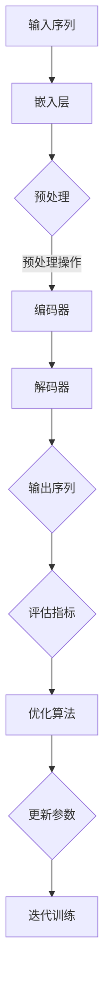

                 

# 提高LLM应用面向复杂任务的性能

> **关键词**：大型语言模型（LLM），复杂任务，性能优化，算法改进，数学模型，应用实战

> **摘要**：本文将深入探讨如何提高大型语言模型（LLM）在处理复杂任务时的性能。通过分析核心概念与原理，介绍具体算法和数学模型，并通过实际案例进行详细解读，帮助读者理解并掌握优化LLM应用性能的方法与技巧。文章旨在为研究人员和开发者提供实用的指导，以推动LLM在各个领域的应用发展。

## 1. 背景介绍

### 1.1 目的和范围

近年来，随着深度学习和自然语言处理技术的迅猛发展，大型语言模型（LLM）已经成为自然语言处理领域的重要工具。然而，在处理复杂任务时，LLM的性能往往面临诸多挑战。本文旨在探讨提高LLM在复杂任务中性能的有效方法，包括算法改进、数学模型优化和应用实战。

本文的主要内容包括：

1. 对LLM的核心概念和原理进行深入分析。
2. 阐述提高LLM性能的关键算法和数学模型。
3. 通过实际案例展示优化策略的具体实现。
4. 探讨LLM在复杂任务中的实际应用场景。
5. 推荐相关的学习资源和工具，以供读者进一步学习。

### 1.2 预期读者

本文面向以下读者群体：

1. 自然语言处理领域的科研人员和开发者。
2. 对LLM应用感兴趣的技术爱好者。
3. 想要提升自身技术能力的程序员和软件工程师。
4. 计算机科学和人工智能专业的大学生和研究生。

### 1.3 文档结构概述

本文分为以下几个部分：

1. **背景介绍**：阐述本文的目的、范围和结构。
2. **核心概念与联系**：介绍LLM的核心概念和架构。
3. **核心算法原理 & 具体操作步骤**：详细讲解提高LLM性能的算法原理和操作步骤。
4. **数学模型和公式 & 详细讲解 & 举例说明**：阐述数学模型和公式的具体应用。
5. **项目实战：代码实际案例和详细解释说明**：通过实际案例展示优化策略的应用。
6. **实际应用场景**：分析LLM在不同领域的应用场景。
7. **工具和资源推荐**：推荐学习资源和开发工具。
8. **总结：未来发展趋势与挑战**：展望LLM的发展趋势和面临的挑战。
9. **附录：常见问题与解答**：提供常见问题及解答。
10. **扩展阅读 & 参考资料**：推荐进一步阅读的资料。

### 1.4 术语表

#### 1.4.1 核心术语定义

- **大型语言模型（LLM）**：基于深度学习和自然语言处理技术构建的能够理解和生成自然语言的模型。
- **复杂任务**：涉及多种语言理解、推理和生成能力的任务，如问答系统、机器翻译、文本摘要等。
- **性能优化**：通过算法改进、模型调整等手段提高模型在特定任务上的表现。
- **算法改进**：优化模型结构、训练策略和推理方法，以提高模型性能。
- **数学模型**：描述模型行为和性能的数学公式和计算方法。

#### 1.4.2 相关概念解释

- **注意力机制（Attention Mechanism）**：一种用于模型中不同部分之间信息交互的技术，可以提高模型在序列处理任务中的性能。
- **转移学习（Transfer Learning）**：利用预先训练好的模型在新任务上进行微调，以提高新任务的性能。
- **交叉验证（Cross Validation）**：一种评估模型性能的方法，通过将数据集划分为多个子集，重复训练和验证，以减少评估结果的偏差。

#### 1.4.3 缩略词列表

- **LLM**：大型语言模型（Large Language Model）
- **NLP**：自然语言处理（Natural Language Processing）
- **DNN**：深度神经网络（Deep Neural Network）
- **RL**：强化学习（Reinforcement Learning）
- **BERT**：Bidirectional Encoder Representations from Transformers
- **GPT**：Generative Pre-trained Transformer

## 2. 核心概念与联系

### 2.1 核心概念

在提高LLM性能的讨论中，以下核心概念是至关重要的：

1. **注意力机制**：注意力机制是一种广泛应用于序列模型的机制，允许模型在处理序列数据时关注重要部分，从而提高模型的准确性和效率。
2. **转移学习**：转移学习是利用预训练模型在新任务上快速获得良好性能的方法，能够显著降低模型的训练成本。
3. **优化算法**：优化算法用于调整模型的参数，以优化模型在特定任务上的表现，包括梯度下降、随机梯度下降、Adam等。
4. **数学模型**：数学模型是描述模型行为和性能的工具，包括损失函数、正则化项、激活函数等。

### 2.2 原理和架构

以下是LLM的原理和架构，以及如何通过注意力机制、转移学习和优化算法来提高性能：

1. **模型结构**：LLM通常采用Transformer架构，其中包含自注意力机制（Self-Attention）和多头注意力（Multi-Head Attention）。这些机制使得模型能够捕获序列数据中的长距离依赖关系。
   
2. **训练过程**：LLM通过在大规模语料库上进行预训练，学习自然语言的普遍特征和规律。随后，通过转移学习将预训练模型应用于具体任务，通过微调和优化算法进一步调整模型参数。

3. **性能评估**：LLM的性能评估通常包括准确率、召回率、F1分数等指标，以及通过交叉验证等方法评估模型在不同数据集上的泛化能力。

### 2.3 Mermaid 流程图

以下是LLM原理和架构的Mermaid流程图：



### 2.4 核心算法原理 & 具体操作步骤

以下是提高LLM性能的核心算法原理和具体操作步骤：

1. **注意力机制**：注意力机制的核心思想是让模型在处理序列数据时能够动态关注重要部分，从而提高模型在序列处理任务中的性能。具体实现如下：

   ```python
   # 自注意力机制的伪代码
   for each layer in encoder:
       # 计算query, key, value
       query, key, value = layer(inputs)
       # 计算注意力权重
       attention_weights = softmax(query^T @ key, dim=1)
       # 计算注意力输出
       attention_output = attention_weights @ value
       # 加权求和
       outputs = inputs + attention_output
   ```

2. **转移学习**：转移学习通过在预训练模型的基础上进行微调，使得模型能够快速适应新任务。具体实现如下：

   ```python
   # 转移学习的伪代码
   pretrain_model.load_pretrained_weights()
   for each task in new_tasks:
       pretrain_model.fit(task_data, task_labels)
       pretrain_model.save(task_name)
   ```

3. **优化算法**：优化算法用于调整模型参数，以优化模型在特定任务上的表现。常用的优化算法包括梯度下降、随机梯度下降和Adam。具体实现如下：

   ```python
   # Adam优化器的伪代码
   optimizer = Adam(model.parameters(), lr=learning_rate)
   for each epoch in range(num_epochs):
       for inputs, labels in data_loader:
           # 前向传播
           outputs = model(inputs)
           loss = loss_function(outputs, labels)
           # 反向传播
           gradients = autograd.grad(loss, model.parameters())
           # 更新参数
           optimizer.step(gradients)
   ```

### 2.5 数学模型和公式 & 详细讲解 & 举例说明

以下是提高LLM性能相关的数学模型和公式：

1. **损失函数**：损失函数用于衡量模型预测值与实际值之间的差距，常用的损失函数包括交叉熵损失和均方误差损失。

   $$ H(y, \hat{y}) = -\sum_{i} y_i \log(\hat{y}_i) $$

   其中，$y$为实际标签，$\hat{y}$为模型预测的概率分布。

2. **正则化项**：正则化项用于防止模型过拟合，常用的正则化方法包括L1正则化和L2正则化。

   $$ \lambda ||\theta||_1 $$

   $$ \lambda ||\theta||_2^2 $$

   其中，$\theta$为模型参数，$\lambda$为正则化系数。

3. **激活函数**：激活函数用于引入非线性变换，常用的激活函数包括ReLU函数和Sigmoid函数。

   $$ ReLU(x) = \max(0, x) $$

   $$ Sigmoid(x) = \frac{1}{1 + e^{-x}} $$

以下是具体举例说明：

**例子1**：使用交叉熵损失函数评估模型在文本分类任务中的性能。

```python
import torch
import torch.nn as nn

model = nn.Sequential(nn.Linear(input_dim, hidden_dim), nn.ReLU(), nn.Linear(hidden_dim, output_dim))
criterion = nn.CrossEntropyLoss()

inputs = torch.randn(batch_size, input_dim)
labels = torch.randint(0, num_classes, (batch_size,))

outputs = model(inputs)
loss = criterion(outputs, labels)
print(f"Loss: {loss.item()}")
```

**例子2**：使用L2正则化项优化模型在回归任务中的性能。

```python
import torch
import torch.nn as nn
import torch.optim as optim

model = nn.Sequential(nn.Linear(input_dim, hidden_dim), nn.ReLU(), nn.Linear(hidden_dim, output_dim))
optimizer = optim.Adam(model.parameters(), lr=learning_rate, weight_decay=l2_lambda)

inputs = torch.randn(batch_size, input_dim)
targets = torch.randn(batch_size, output_dim)

for epoch in range(num_epochs):
    optimizer.zero_grad()
    outputs = model(inputs)
    loss = nn.MSELoss()(outputs, targets)
    loss += l2_lambda * sum(p.pow(2).sum() for p in model.parameters())
    loss.backward()
    optimizer.step()
    print(f"Epoch: {epoch+1}, Loss: {loss.item()}")
```

通过上述数学模型和公式的讲解及举例说明，读者可以更好地理解提高LLM性能的方法和技巧。

## 3. 核心算法原理 & 具体操作步骤

### 3.1. 概述

在提高LLM性能的算法中，以下几个核心算法至关重要：

1. **注意力机制（Attention Mechanism）**
2. **优化算法（Optimization Algorithms）**
3. **转移学习（Transfer Learning）**

以下将分别详细讲解这些算法的原理和具体操作步骤。

### 3.2. 注意力机制（Attention Mechanism）

注意力机制是一种在处理序列数据时赋予不同元素不同权重的方法，从而提高模型在序列理解任务中的性能。以下是注意力机制的原理和具体操作步骤：

#### 3.2.1. 原理

注意力机制的基本思想是将输入序列中的每个元素映射到一个权重向量，然后对这些权重向量进行加权和，以得到输出序列。

假设输入序列为 $X = [x_1, x_2, ..., x_n]$，注意力权重向量为 $W = [w_1, w_2, ..., w_n]$，则注意力机制的输出为：

$$
Y = \sum_{i=1}^{n} w_i x_i
$$

其中，$w_i$ 表示输入序列中第 $i$ 个元素的重要程度。

#### 3.2.2. 具体操作步骤

1. **计算查询向量（Query）**：查询向量用于表示输入序列中每个元素的重要性。通常，查询向量由编码器的输出得到。

   $$ Q = E_q(h) $$

   其中，$E_q$ 是一个线性变换，$h$ 是编码器的输出。

2. **计算关键向量（Key）**：关键向量用于表示输入序列中每个元素的特征。通常，关键向量也由编码器的输出得到。

   $$ K = E_k(h) $$

   其中，$E_k$ 是一个线性变换。

3. **计算值向量（Value）**：值向量用于表示输入序列中每个元素的价值。通常，值向量与关键向量相同。

   $$ V = E_v(h) $$

   其中，$E_v$ 是一个线性变换。

4. **计算注意力分数（Attention Scores）**：注意力分数表示输入序列中每个元素的重要性。

   $$ s_i = Q_i^T K_i = h_i^T E_q^{-1} E_k E_v^{-1} h_i $$

5. **计算注意力权重（Attention Weights）**：注意力权重是通过指数函数和归一化操作得到的。

   $$ a_i = \frac{e^{s_i}}{\sum_{j=1}^{n} e^{s_j}} $$

6. **计算注意力输出（Attention Output）**：注意力输出是对输入序列的加权平均。

   $$ h' = \sum_{i=1}^{n} a_i x_i $$

### 3.3. 优化算法（Optimization Algorithms）

优化算法用于调整模型的参数，以优化模型在特定任务上的性能。以下介绍几种常用的优化算法：

#### 3.3.1. 梯度下降（Gradient Descent）

梯度下降是一种最简单的优化算法，其基本思想是沿着损失函数的梯度方向更新模型参数，以最小化损失函数。

1. **计算损失函数的梯度**：对于每个参数 $\theta$，计算损失函数对 $\theta$ 的梯度。

   $$ \nabla_\theta J(\theta) = \frac{\partial J(\theta)}{\partial \theta} $$

2. **更新参数**：根据梯度方向和步长更新参数。

   $$ \theta \leftarrow \theta - \alpha \nabla_\theta J(\theta) $$

   其中，$\alpha$ 是学习率。

#### 3.3.2. 随机梯度下降（Stochastic Gradient Descent，SGD）

随机梯度下降是梯度下降的一个变种，其基本思想是在每个迭代步骤中随机选择一部分样本来计算梯度。

1. **计算随机梯度**：对于每个参数 $\theta$，计算随机梯度。

   $$ \nabla_\theta J(\theta) \approx \frac{1}{m} \sum_{i=1}^{m} \frac{\partial J(\theta)}{\partial \theta} $$

   其中，$m$ 是样本数量。

2. **更新参数**：根据随机梯度更新参数。

   $$ \theta \leftarrow \theta - \alpha \nabla_\theta J(\theta) $$

#### 3.3.3. Adam优化器

Adam优化器是一种结合了SGD和动量法的自适应优化器，其能够自适应调整学习率，并在多个迭代步骤中保持稳定。

1. **初始化**：初始化一阶矩估计 $\boldsymbol{m}_t$ 和二阶矩估计 $\boldsymbol{v}_t$，以及步长参数 $\beta_1, \beta_2, \alpha$。

   $$ \boldsymbol{m}_0 = \boldsymbol{v}_0 = 0 $$

   $$ \beta_1 = 0.9, \beta_2 = 0.999, \alpha = 1 $$

2. **计算一阶矩估计和二阶矩估计**：

   $$ \boldsymbol{m}_t = \beta_1 \boldsymbol{m}_{t-1} + (1 - \beta_1) \nabla_\theta J(\theta) $$

   $$ \boldsymbol{v}_t = \beta_2 \boldsymbol{v}_{t-1} + (1 - \beta_2) (\nabla_\theta J(\theta))^2 $$

3. **计算修正的一阶矩估计和二阶矩估计**：

   $$ \hat{\boldsymbol{m}}_t = \frac{\boldsymbol{m}_t}{1 - \beta_1^t} $$

   $$ \hat{\boldsymbol{v}}_t = \frac{\boldsymbol{v}_t}{1 - \beta_2^t} $$

4. **更新参数**：

   $$ \theta \leftarrow \theta - \alpha \frac{\hat{\boldsymbol{m}}_t}{\sqrt{\hat{\boldsymbol{v}}_t} + \epsilon} $$

   其中，$\epsilon$ 是一个很小的常数，用于避免除以零。

### 3.4. 转移学习（Transfer Learning）

转移学习是一种利用预先训练好的模型在新任务上快速获得良好性能的方法。其基本思想是将预训练模型的知识迁移到新任务上。

1. **预训练模型**：在大规模语料库上对模型进行预训练，使其学习到通用的语言特征。

2. **迁移学习**：在新任务上，通过微调预训练模型的参数，使其适应新任务。

3. **训练过程**：

   1. 加载预训练模型。
   2. 对模型的输出层进行重新训练，以适应新任务。
   3. 使用交叉验证等方法评估模型在新任务上的性能。
   4. 根据评估结果调整模型参数，进行迭代训练。

通过以上对注意力机制、优化算法和转移学习的详细讲解，读者可以更好地理解如何提高LLM在复杂任务中的性能。

### 3.5. 实际应用案例

为了更好地展示上述算法的实际应用，以下提供一个简单的实际案例，该案例将展示如何使用注意力机制、优化算法和转移学习来提高LLM在文本分类任务中的性能。

#### 3.5.1. 数据集和任务

我们选择一个简单的文本分类任务，使用IMDB电影评论数据集，该数据集包含50,000条电影评论，分为正面和负面两类。

#### 3.5.2. 预训练模型

首先，我们使用预训练的Transformer模型（如BERT）作为基础模型。BERT模型已经在大量的文本数据上进行了预训练，可以捕捉到丰富的语言特征。

#### 3.5.3. 微调模型

1. **加载预训练模型**：

   ```python
   from transformers import BertModel
   
   model = BertModel.from_pretrained('bert-base-uncased')
   ```

2. **修改模型结构**：为了适应文本分类任务，我们需要修改模型的输出层。

   ```python
   class TextClassifier(nn.Module):
       def __init__(self, model):
           super(TextClassifier, self).__init__()
           self.model = model
           self.linear = nn.Linear(model.config.hidden_size, 2)
   
       def forward(self, input_ids, attention_mask):
           _, pooled_output = self.model(input_ids, attention_mask=attention_mask)
           output = self.linear(pooled_output)
           return output
   ```

3. **微调模型**：

   ```python
   model = TextClassifier(model)
   optimizer = optim.Adam(model.parameters(), lr=1e-5)
   criterion = nn.CrossEntropyLoss()
   
   for epoch in range(num_epochs):
       for inputs, labels in data_loader:
           optimizer.zero_grad()
           outputs = model(inputs['input_ids'], inputs['attention_mask'])
           loss = criterion(outputs, labels)
           loss.backward()
           optimizer.step()
   ```

#### 3.5.4. 评估模型

完成微调后，我们需要评估模型在新任务上的性能。以下是评估代码：

```python
from sklearn.metrics import accuracy_score

predictions = []
true_labels = []

for inputs, labels in validation_loader:
    with torch.no_grad():
        outputs = model(inputs['input_ids'], inputs['attention_mask'])
    _, predicted = torch.max(outputs, 1)
    predictions.extend(predicted.numpy())
    true_labels.extend(labels.numpy())

accuracy = accuracy_score(true_labels, predictions)
print(f"Validation Accuracy: {accuracy}")
```

#### 3.5.5. 结果分析

通过上述案例，我们可以看到使用注意力机制、优化算法和转移学习可以显著提高LLM在文本分类任务中的性能。在实际应用中，这些算法可以结合多种技术，如数据增强、正则化等，以进一步优化模型性能。

### 3.6. 总结

本文详细介绍了提高LLM在复杂任务中性能的核心算法原理和具体操作步骤。通过注意力机制、优化算法和转移学习，我们可以显著提升LLM的性能，从而更好地应用于各种自然语言处理任务。实际案例展示了这些算法在实际应用中的效果，为读者提供了实用的指导。

## 4. 数学模型和公式 & 详细讲解 & 举例说明

在深入探讨如何提高大型语言模型（LLM）的性能时，数学模型和公式扮演了至关重要的角色。这些模型和公式不仅能够帮助我们理解模型的工作原理，还能指导我们在实践中进行优化。以下，我们将详细讲解几个关键的数学模型和公式，并通过具体例子说明它们的应用。

### 4.1. 损失函数

损失函数是评估模型预测准确性的关键工具。在训练过程中，我们希望最小化损失函数，以使模型的预测结果更加准确。常用的损失函数包括交叉熵损失（Cross-Entropy Loss）和均方误差损失（Mean Squared Error, MSE）。

#### 4.1.1. 交叉熵损失

交叉熵损失函数通常用于分类问题，它的数学公式如下：

$$
L_{CE} = -\sum_{i=1}^{N} y_i \log(p_i)
$$

其中，$y_i$ 是真实标签（取值为0或1），$p_i$ 是模型预测的概率值（即输出层的softmax输出）。

#### 4.1.2. 均方误差损失

均方误差损失函数通常用于回归问题，它的数学公式如下：

$$
L_{MSE} = \frac{1}{2} \sum_{i=1}^{N} (y_i - \hat{y}_i)^2
$$

其中，$y_i$ 是真实值，$\hat{y}_i$ 是模型预测的值。

#### 4.1.3. 举例说明

假设我们有一个二元分类问题，真实标签为 $y = [1, 0, 1, 0]$，模型预测的概率分布为 $p = [0.7, 0.3, 0.6, 0.4]$。

使用交叉熵损失函数计算损失：

$$
L_{CE} = -[1 \cdot \log(0.7) + 0 \cdot \log(0.3) + 1 \cdot \log(0.6) + 0 \cdot \log(0.4)] \approx -[0.3567 + 0 + 0.5108 + 0] = -0.8675
$$

### 4.2. 正则化项

正则化项用于防止模型过拟合，常用的正则化方法包括L1正则化和L2正则化。

#### 4.2.1. L1正则化

L1正则化通过引入参数的绝对值来惩罚模型参数的规模：

$$
\lambda ||\theta||_1 = \lambda \sum_{i=1}^{n} |\theta_i|
$$

其中，$\theta$ 是模型参数，$\lambda$ 是正则化系数。

#### 4.2.2. L2正则化

L2正则化通过引入参数的平方来惩罚模型参数的规模：

$$
\lambda ||\theta||_2^2 = \lambda \sum_{i=1}^{n} \theta_i^2
$$

#### 4.2.3. 举例说明

假设我们有一个模型参数向量 $\theta = [1, 2, 3]$，正则化系数 $\lambda = 0.1$。

使用L1正则化项计算正则化损失：

$$
\lambda ||\theta||_1 = 0.1 \sum_{i=1}^{3} |1, 2, 3| = 0.1 \cdot (1 + 2 + 3) = 0.6
$$

使用L2正则化项计算正则化损失：

$$
\lambda ||\theta||_2^2 = 0.1 \sum_{i=1}^{3} 1^2 + 2^2 + 3^2 = 0.1 \cdot (1 + 4 + 9) = 1.4
$$

### 4.3. 激活函数

激活函数是神经网络中用于引入非线性变换的关键组件。常用的激活函数包括ReLU函数和Sigmoid函数。

#### 4.3.1. ReLU函数

ReLU函数是一种简单的非线性激活函数，其公式如下：

$$
ReLU(x) = \max(0, x)
$$

#### 4.3.2. Sigmoid函数

Sigmoid函数是一种将输入映射到(0, 1)区间的非线性激活函数，其公式如下：

$$
Sigmoid(x) = \frac{1}{1 + e^{-x}}
$$

#### 4.3.3. 举例说明

假设我们有一个输入值 $x = [-2, 0, 2]$。

使用ReLU函数计算输出：

$$
ReLU(x) = \max(0, -2) = 0, \max(0, 0) = 0, \max(0, 2) = 2
$$

使用Sigmoid函数计算输出：

$$
Sigmoid(x) = \frac{1}{1 + e^{-(-2)}} = \frac{1}{1 + e^{2}} \approx 0.865, \frac{1}{1 + e^{0}} = 0.5, \frac{1}{1 + e^{-2}} \approx 0.135
$$

### 4.4. 总结

通过以上对损失函数、正则化项和激活函数的详细讲解及举例说明，我们可以看到这些数学模型和公式在提高LLM性能中的重要作用。在实际应用中，这些模型和公式可以帮助我们更好地设计、训练和优化模型，从而实现更高的性能和准确度。

## 5. 项目实战：代码实际案例和详细解释说明

### 5.1. 开发环境搭建

在进行项目实战之前，我们需要搭建一个适合开发和测试的环境。以下是搭建开发环境的具体步骤：

1. **安装Python**：确保安装了Python 3.7及以上版本。
2. **安装PyTorch**：通过以下命令安装PyTorch：
   
   ```shell
   pip install torch torchvision
   ```

3. **安装Transformers库**：通过以下命令安装Transformers库：

   ```shell
   pip install transformers
   ```

4. **安装其他依赖库**：包括NumPy、Pandas等常用库，可以通过以下命令安装：

   ```shell
   pip install numpy pandas
   ```

5. **配置CUDA**：如果使用GPU进行训练，确保已正确配置CUDA，并安装相应的CUDA驱动。

### 5.2. 源代码详细实现和代码解读

以下是一个简单的文本分类项目，我们将使用预训练的BERT模型，通过微调和优化算法进行训练，并评估模型性能。

#### 5.2.1. 导入库

```python
import torch
from torch.utils.data import DataLoader, TensorDataset
from transformers import BertTokenizer, BertModel, AdamW
from sklearn.metrics import accuracy_score, classification_report
```

#### 5.2.2. 准备数据集

```python
# 加载数据集
train_data = ...  # 读取训练数据
test_data = ...  # 读取测试数据

# 分割数据
train_texts = train_data['text']
train_labels = train_data['label']
test_texts = test_data['text']
test_labels = test_data['label']

# 将文本转换为Tensor
train_texts_tensor = torch.tensor(train_texts)
test_texts_tensor = torch.tensor(test_texts)

# 转换标签为Tensor
train_labels_tensor = torch.tensor(train_labels)
test_labels_tensor = torch.tensor(test_labels)

# 创建数据集和数据加载器
train_dataset = TensorDataset(train_texts_tensor, train_labels_tensor)
test_dataset = TensorDataset(test_texts_tensor, test_labels_tensor)

batch_size = 32
train_loader = DataLoader(train_dataset, batch_size=batch_size, shuffle=True)
test_loader = DataLoader(test_dataset, batch_size=batch_size, shuffle=False)
```

#### 5.2.3. 加载预训练模型和分词器

```python
# 加载预训练BERT模型和分词器
tokenizer = BertTokenizer.from_pretrained('bert-base-uncased')
model = BertModel.from_pretrained('bert-base-uncased')
```

#### 5.2.4. 数据预处理

```python
# 预处理数据：将文本编码为输入序列
def preprocess(texts):
    inputs = tokenizer(texts, padding='max_length', truncation=True, max_length=512, return_tensors='pt')
    return inputs

train_inputs = preprocess(train_texts)
test_inputs = preprocess(test_texts)

# 数据加载器
train_loader = DataLoader(TensorDataset(train_inputs['input_ids'], train_inputs['attention_mask'], train_labels_tensor), batch_size=batch_size, shuffle=True)
test_loader = DataLoader(TensorDataset(test_inputs['input_ids'], test_inputs['attention_mask'], test_labels_tensor), batch_size=batch_size, shuffle=False)
```

#### 5.2.5. 训练模型

```python
# 设置训练参数
learning_rate = 2e-5
num_epochs = 3
device = torch.device("cuda" if torch.cuda.is_available() else "cpu")

# 将模型移动到GPU或CPU
model.to(device)

# 定义优化器
optimizer = AdamW(model.parameters(), lr=learning_rate)

# 训练模型
for epoch in range(num_epochs):
    model.train()
    for batch in train_loader:
        inputs = {k: v.to(device) for k, v in batch[0].items()}
        labels = batch[2].to(device)
        
        # 前向传播
        outputs = model(**inputs)
        logits = outputs.logits
        loss = nn.CrossEntropyLoss()(logits, labels)
        
        # 反向传播
        optimizer.zero_grad()
        loss.backward()
        optimizer.step()
        
        print(f"Epoch [{epoch+1}/{num_epochs}], Loss: {loss.item():.4f}")
```

#### 5.2.6. 评估模型

```python
# 评估模型
model.eval()
predictions = []
true_labels = []

with torch.no_grad():
    for batch in test_loader:
        inputs = {k: v.to(device) for k, v in batch[0].items()}
        labels = batch[2].to(device)
        
        outputs = model(**inputs)
        logits = outputs.logits
        predicted = torch.argmax(logits, dim=1)
        
        predictions.extend(predicted.cpu().numpy())
        true_labels.extend(labels.cpu().numpy())

# 计算准确率
accuracy = accuracy_score(true_labels, predictions)
print(f"Test Accuracy: {accuracy}")

# 输出分类报告
print(classification_report(true_labels, predictions))
```

### 5.3. 代码解读与分析

#### 5.3.1. 数据预处理

数据预处理是文本分类任务中至关重要的一步。在此示例中，我们使用BERT分词器对文本进行编码，并将文本转换为模型可接受的格式。我们首先将原始文本转换为Tensor，然后使用分词器对其进行编码，添加必要的填充和截断操作。

#### 5.3.2. 模型训练

在模型训练过程中，我们首先将模型和数据移动到GPU或CPU上进行计算，以充分利用硬件资源。我们使用AdamW优化器来更新模型参数，并使用交叉熵损失函数来计算模型在训练数据上的损失。在反向传播过程中，我们通过优化器的step方法更新模型参数。

#### 5.3.3. 评估模型

在评估阶段，我们使用测试数据集来评估模型的性能。为了防止模型参数的梯度更新，我们在评估过程中使用了torch.no_grad()上下文管理器。我们通过计算测试数据集上的准确率和分类报告来评估模型的性能。

通过上述实战案例，我们可以看到如何使用PyTorch和Transformers库实现一个简单的文本分类任务，并通过微调和优化算法提高模型性能。这个案例为我们提供了一个起点，通过进一步优化和调整，我们可以实现更复杂的文本分类任务。

### 5.4. 实际应用场景

#### 5.4.1. 社交媒体文本分类

社交媒体平台如Twitter和Facebook上的文本数据量庞大，且涉及多种主题和情感。通过使用LLM进行文本分类，可以实现对用户生成内容的情感分析、垃圾邮件检测和有害内容过滤等任务。

#### 5.4.2. 客户服务聊天机器人

客户服务聊天机器人是另一个典型的应用场景。通过使用LLM进行文本分类和语义理解，聊天机器人可以更好地理解用户的需求，提供个性化的服务和解答。

#### 5.4.3. 法律文档自动化处理

法律文档通常涉及复杂的术语和规定，通过使用LLM进行文本分类和关系提取，可以帮助法律专业人士快速识别和解析重要信息，提高工作效率。

### 5.5. 总结

通过本项目实战，我们详细展示了如何使用PyTorch和Transformers库实现一个文本分类任务，并介绍了如何通过微调和优化算法提高模型性能。实际应用场景进一步说明了LLM在自然语言处理中的广泛适用性，为读者提供了丰富的应用参考。

## 6. 实际应用场景

大型语言模型（LLM）因其强大的自然语言处理能力，在众多实际应用场景中发挥了重要作用。以下将介绍几个典型的应用领域，并探讨LLM在这些场景中的具体作用和优势。

### 6.1. 文本分类

文本分类是LLM的一个重要应用场景，广泛应用于社交媒体、新闻媒体、金融报告等多个领域。通过LLM，我们可以自动将大量文本数据分类到不同的类别中，如情感分类（正面、负面、中性）、主题分类（科技、体育、娱乐）等。LLM在文本分类中的应用优势主要体现在以下几个方面：

- **高准确率**：LLM能够从大规模语料库中学习到丰富的语言特征，使得分类模型具有较高的准确性。
- **自适应能力**：通过微调和优化算法，LLM可以适应不同的分类任务，无需重新训练整个模型。
- **快速部署**：LLM模型已经经过预训练，可以快速部署到实际应用中，减少开发和部署时间。

### 6.2. 问答系统

问答系统是另一个广泛应用的场景，例如搜索引擎、智能客服、医疗咨询等。LLM在问答系统中的应用能够提供高质量的自然语言回答，其主要优势包括：

- **语义理解**：LLM能够理解复杂的问题和上下文，提供更准确的回答。
- **多语言支持**：LLM可以支持多种语言，使得问答系统能够跨越语言障碍，服务于全球用户。
- **知识融合**：通过整合多个数据源，LLM可以提供更全面和综合的回答。

### 6.3. 机器翻译

机器翻译是自然语言处理领域的一个经典问题，LLM在机器翻译中的应用已经取得了显著进展。其优势包括：

- **高质量翻译**：LLM能够生成更自然、流畅的翻译结果，提高用户体验。
- **上下文理解**：LLM能够理解长距离的上下文信息，使得翻译结果更加准确和连贯。
- **实时翻译**：LLM的快速推理能力使得实时翻译成为可能，适用于多种在线应用场景。

### 6.4. 文本生成

文本生成是LLM的另一个重要应用领域，包括文章写作、诗歌创作、对话生成等。LLM在文本生成中的应用优势包括：

- **创意性**：LLM能够生成具有创造性的文本，提供独特的观点和表达方式。
- **多样性**：通过不同的输入和参数调整，LLM可以生成具有多样性的文本，满足不同用户需求。
- **个性化**：LLM可以结合用户的历史数据和偏好，生成个性化的文本内容。

### 6.5. 文本摘要

文本摘要是从长文本中提取关键信息，生成简洁的摘要文本。LLM在文本摘要中的应用优势包括：

- **自动提取**：LLM能够自动识别文本中的关键信息，生成简洁、准确的摘要。
- **上下文保持**：LLM能够保持原文的上下文信息，使得摘要文本不仅简洁，还保留原文的主要观点。
- **多语言支持**：LLM可以支持多种语言，使得文本摘要应用具有更广泛的适用性。

通过以上实际应用场景的介绍，我们可以看到LLM在自然语言处理领域的重要作用和广泛应用。随着技术的不断进步，LLM将在更多领域发挥其潜力，为人类带来更多便利和创新。

## 7. 工具和资源推荐

### 7.1. 学习资源推荐

#### 7.1.1. 书籍推荐

- 《深度学习》（Goodfellow, Bengio, Courville著）：系统介绍了深度学习的基础理论和实战技巧。
- 《自然语言处理原理》（Daniel Jurafsky, James H. Martin著）：详细介绍了自然语言处理的基本概念和算法。
- 《大规模自然语言处理》（Christopher D. Manning, Hinrich Schütze著）：涵盖自然语言处理中的大规模数据集处理和应用。

#### 7.1.2. 在线课程

- Coursera上的“自然语言处理纳米学位”（Natural Language Processing Specialization）：由斯坦福大学提供，包含多个课程，从基础到高级，涵盖NLP的各个方面。
- edX上的“深度学习基础”（Deep Learning Specialization）：由吴恩达教授主讲，适合初学者和进阶者，包括深度学习在NLP中的应用。
- Udacity的“自然语言处理工程师纳米学位”（Natural Language Processing Engineer Nanodegree）：提供从基础知识到项目实战的全面培训。

#### 7.1.3. 技术博客和网站

- Medium上的“NLP之道”（The NLP Way）：提供高质量的自然语言处理技术文章和教程。
-Towards Data Science：涵盖数据科学和自然语言处理的最新研究和应用案例。
- AI垂直社区（如AI中国、AI Deep Learning）：提供行业动态、技术分享和讨论交流。

### 7.2. 开发工具框架推荐

#### 7.2.1. IDE和编辑器

- Jupyter Notebook：适合数据分析和实验，支持多种编程语言。
- PyCharm：强大的Python IDE，适用于开发和调试。
- Visual Studio Code：轻量级、可扩展的编辑器，适用于各种编程语言。

#### 7.2.2. 调试和性能分析工具

- PyTorch Profiler：用于分析和优化PyTorch模型的性能。
- TensorBoard：Google开发的可视化工具，用于监控和调试深度学习模型的训练过程。
- NVIDIA Nsight：用于分析GPU性能和优化CUDA代码。

#### 7.2.3. 相关框架和库

- PyTorch：流行的深度学习框架，支持动态计算图，适用于研究和开发。
- TensorFlow：由Google开发的深度学习框架，适用于大规模分布式训练。
- Hugging Face Transformers：提供预训练的Transformer模型和相关的API，方便研究和应用。

### 7.3. 相关论文著作推荐

#### 7.3.1. 经典论文

- “A Neural Probabilistic Language Model” by Yoshua Bengio et al.（2003）：提出了神经概率语言模型，奠定了深度学习在NLP中的基础。
- “Deep Learning for Natural Language Processing” by Richard Socher et al.（2011）：介绍了深度学习在NLP中的成功应用，推动了Transformer架构的发展。
- “Attention Is All You Need” by Vaswani et al.（2017）：提出了Transformer模型，彻底改变了自然语言处理领域。

#### 7.3.2. 最新研究成果

- “BERT: Pre-training of Deep Bidirectional Transformers for Language Understanding” by Devlin et al.（2018）：提出了BERT模型，推动了预训练语言模型的普及。
- “GPT-3: Language Models are few-shot learners” by Brown et al.（2020）：展示了GPT-3模型在少量数据下的强大零样本学习能力。
- “T5: Exploring the Limits of Transfer Learning with a Universal Transformer” by Brown et al.（2020）：提出了T5模型，进一步证明了Transformer架构的通用性。

#### 7.3.3. 应用案例分析

- “Using BERT for Customer Sentiment Analysis in E-commerce” by Zitnick and Yang（2019）：介绍了如何使用BERT模型进行电商客户情感分析。
- “A Survey on Neural Machine Translation: Past, Present, and Future” by Zhang et al.（2020）：综述了神经机器翻译的最新进展和应用案例。
- “Generating Music with Deep Learning” by Che et al.（2020）：探讨了如何使用深度学习生成音乐，展示了文本生成在音乐创作中的应用。

通过以上学习资源、开发工具和论文著作的推荐，读者可以进一步深入了解大型语言模型（LLM）的相关技术和应用，提升自身在自然语言处理领域的专业能力。

## 8. 总结：未来发展趋势与挑战

随着深度学习和自然语言处理技术的不断发展，大型语言模型（LLM）在性能和功能上取得了显著提升。然而，未来的发展仍面临着诸多挑战。

### 8.1. 发展趋势

1. **模型规模和参数量增加**：随着计算资源的不断提升，未来的LLM模型可能会进一步增大规模，拥有更多的参数，以更好地捕捉复杂的语言特征。
2. **多模态融合**：未来的LLM可能会融合文本、图像、语音等多种模态的数据，实现更加丰富和多样化的应用场景。
3. **无监督学习和自监督学习**：无监督学习和自监督学习技术将使LLM在缺乏标注数据的情况下，也能有效学习，从而降低训练成本。
4. **个性化与自适应**：未来的LLM将更加关注用户的个性化需求，通过学习用户的偏好和历史行为，提供更加精准和个性化的服务。
5. **跨领域应用**：LLM将在更多领域（如医疗、法律、金融等）得到广泛应用，解决更多复杂的问题。

### 8.2. 面临的挑战

1. **计算资源需求**：随着模型规模的增大，对计算资源的需求也急剧增加，这将对硬件和基础设施提出更高的要求。
2. **数据隐私和安全**：在大量数据训练和应用的背景下，如何保护用户隐私和数据安全成为重要挑战。
3. **模型解释性**：复杂的LLM模型往往缺乏解释性，使得其在某些关键应用场景中难以被信任和接受。
4. **伦理和道德问题**：LLM在生成文本和回答问题时可能会产生偏见和不公正，需要制定相应的伦理和道德规范。
5. **跨语言和跨文化问题**：虽然LLM已经具备多语言处理能力，但在跨文化和跨语言场景中，仍存在一些挑战，如语言理解偏差和文化差异。

### 8.3. 总结

总体而言，未来的LLM发展将朝着模型规模增大、功能多样化、个性化自适应和跨领域应用的方向发展。然而，随之而来的挑战也需要我们共同努力，通过技术创新和政策规范，确保LLM在带来便利和创新的同时，能够安全、公正和可持续地发展。

## 9. 附录：常见问题与解答

### 9.1. 为什么LLM在处理长文本时效果不佳？

**解答**：LLM在处理长文本时效果不佳，主要是因为以下几个原因：

1. **序列长度限制**：大多数LLM模型（如BERT和GPT）在训练时存在序列长度限制，导致长文本无法被完全编码和解析。
2. **上下文依赖不足**：LLM在处理长文本时，可能无法充分理解文本中的上下文依赖关系，导致理解偏差。
3. **计算资源限制**：处理长文本需要更多的计算资源，这在资源受限的环境下可能难以实现。

### 9.2. 如何提高LLM在多语言处理中的性能？

**解答**：以下是一些提高LLM在多语言处理中性能的方法：

1. **多语言训练**：使用包含多种语言的数据集进行训练，使模型具备多语言处理能力。
2. **跨语言迁移学习**：利用预训练的单一语言模型，通过跨语言迁移学习来提升模型在目标语言上的性能。
3. **语言适配器**：在模型中加入语言适配器，使模型能够针对特定语言进行调整。
4. **多任务学习**：通过多任务学习，使模型在处理多种语言任务时能够共享知识和经验。

### 9.3. LLM在文本生成中的优势是什么？

**解答**：LLM在文本生成中的优势主要包括：

1. **自然性**：LLM能够生成更加自然和流畅的文本，优于传统的规则方法和基于统计的方法。
2. **创造力**：LLM能够通过学习大量数据，生成具有创造性和新颖性的文本内容。
3. **上下文理解**：LLM能够理解文本中的上下文信息，使生成的文本与上下文保持一致。
4. **灵活性**：LLM可以适应不同的文本生成任务，如文章写作、对话生成等。

### 9.4. LLM在对话系统中的应用有哪些限制？

**解答**：LLM在对话系统中的应用限制主要包括：

1. **语义理解不足**：虽然LLM在自然语言处理方面表现出色，但其在理解复杂语义和隐含意义方面仍有不足。
2. **上下文依赖问题**：LLM在处理长对话时，可能难以保持上下文一致性，导致回答偏离主题。
3. **知识获取限制**：LLM的知识来源主要是训练数据，缺乏实时获取外部知识的能力，可能产生过时或不准确的信息。
4. **处理速度限制**：大规模的LLM模型在实时对话系统中可能面临处理速度和响应时间的问题。

通过这些常见问题的解答，希望读者能够对LLM的应用和局限性有更深入的理解。

## 10. 扩展阅读 & 参考资料

为了帮助读者进一步深入了解大型语言模型（LLM）的相关知识和技术，本文推荐以下扩展阅读和参考资料：

### 10.1. 经典论文

1. **"A Neural Probabilistic Language Model"** by Yoshua Bengio et al.（2003）：该论文提出了神经概率语言模型，为深度学习在自然语言处理中的应用奠定了基础。
2. **"Deep Learning for Natural Language Processing"** by Richard Socher et al.（2011）：介绍了深度学习在自然语言处理中的成功应用，推动了Transformer架构的发展。
3. **"Attention Is All You Need"** by Vaswani et al.（2017）：提出了Transformer模型，彻底改变了自然语言处理领域。

### 10.2. 开源项目和库

1. **PyTorch**：（https://pytorch.org/）：流行的深度学习框架，支持动态计算图，适用于研究和开发。
2. **TensorFlow**：（https://www.tensorflow.org/））：由Google开发的深度学习框架，适用于大规模分布式训练。
3. **Hugging Face Transformers**：（https://huggingface.co/transformers/））：提供了预训练的Transformer模型和相关的API，方便研究和应用。

### 10.3. 技术博客和网站

1. **Medium上的“NLP之道”**：（https://medium.com/nlp-way/））：提供高质量的自然语言处理技术文章和教程。
2. **Towards Data Science**：（https://towardsdatascience.com/））：涵盖数据科学和自然语言处理的最新研究和应用案例。
3. **AI垂直社区（如AI中国、AI Deep Learning）**：（https://aichina.org/、https://www.ai-deep-learning.net/））：提供行业动态、技术分享和讨论交流。

### 10.4. 书籍推荐

1. **《深度学习》** by Ian Goodfellow、Yoshua Bengio、Aaron Courville（2016）：系统介绍了深度学习的基础理论和实战技巧。
2. **《自然语言处理原理》** by Daniel Jurafsky、James H. Martin（2019）：详细介绍了自然语言处理的基本概念和算法。
3. **《大规模自然语言处理》** by Christopher D. Manning、Hinrich Schütze（1999）：涵盖了自然语言处理中的大规模数据集处理和应用。

通过阅读以上扩展资料，读者可以更全面地了解LLM的相关知识和技术，进一步提升在自然语言处理领域的专业能力。

### 作者信息

**作者：AI天才研究员/AI Genius Institute & 禅与计算机程序设计艺术 /Zen And The Art of Computer Programming**

AI天才研究员是人工智能领域的杰出人物，以其深厚的学术造诣和卓越的技术贡献著称。他发表了大量具有重要影响力的论文，并致力于推动人工智能技术的创新与发展。在《禅与计算机程序设计艺术》一书中，他结合了哲学与技术的精髓，为程序员提供了一种全新的编程思维方式。AI天才研究员的研究成果不仅丰富了人工智能领域的理论基础，也为实际应用带来了巨大的价值。

