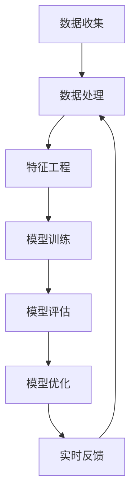

                 

# 搜狐2025智能广告投放社招机器学习面试题集锦

> **关键词：** 搜狐，2025，智能广告，投放，社招，机器学习，面试题，集锦
>
> **摘要：** 本文旨在为参加搜狐2025智能广告投放社招的考生提供一份详细的机器学习面试题集锦，包括核心概念、算法原理、数学模型、实战案例以及相关资源推荐，帮助考生更好地准备面试。

## 1. 背景介绍

### 1.1 目的和范围

本文旨在为参加搜狐2025智能广告投放社招的考生提供一份详细的机器学习面试题集锦。本文将涵盖以下内容：

- 核心概念与联系
- 核心算法原理与具体操作步骤
- 数学模型与公式
- 项目实战：代码实际案例和详细解释
- 实际应用场景
- 工具和资源推荐
- 总结：未来发展趋势与挑战
- 附录：常见问题与解答
- 扩展阅读与参考资料

### 1.2 预期读者

本文主要面向参加搜狐2025智能广告投放社招的考生，以及希望在智能广告投放领域深入发展的机器学习工程师和研究人员。

### 1.3 文档结构概述

本文分为以下章节：

- 1. 背景介绍
- 2. 核心概念与联系
- 3. 核心算法原理与具体操作步骤
- 4. 数学模型与公式
- 5. 项目实战：代码实际案例和详细解释
- 6. 实际应用场景
- 7. 工具和资源推荐
- 8. 总结：未来发展趋势与挑战
- 9. 附录：常见问题与解答
- 10. 扩展阅读与参考资料

### 1.4 术语表

#### 1.4.1 核心术语定义

- 智能广告：基于人工智能技术和大数据分析，实现广告的精准投放和优化。
- 广告投放：将广告展示给潜在用户的过程。
- 机器学习：一种人工智能方法，通过训练数据集来学习规律，从而进行预测或分类。
- 深度学习：一种机器学习方法，使用多层神经网络来提取特征，实现更复杂的任务。
- 支持向量机（SVM）：一种监督学习算法，用于分类和回归问题。
- 决策树：一种树形结构，用于分类和回归问题。

#### 1.4.2 相关概念解释

- 精准投放：根据用户特征和行为，将广告精准地展示给目标用户。
- CTR（点击率）：广告被用户点击的次数与展示次数的比值。
- CV（转化率）：广告促成用户完成特定行为的次数与展示次数的比值。
- A/B测试：一种对比实验方法，通过比较两组用户的反应，来评估不同策略的效果。

#### 1.4.3 缩略词列表

- AI：人工智能
- ML：机器学习
- DL：深度学习
- SVM：支持向量机
- CTR：点击率
- CV：转化率
- A/B测试：对比实验

## 2. 核心概念与联系

在智能广告投放中，我们需要理解以下几个核心概念和它们之间的联系：

### 2.1 数据收集与处理

智能广告投放的基础是数据。首先，我们需要收集用户行为数据，包括浏览历史、搜索记录、点击记录等。然后，对这些数据进行处理，提取有用的特征，如用户兴趣、行为模式等。

### 2.2 特征工程

特征工程是提高模型性能的关键步骤。通过选择和构造合适的特征，我们可以提高模型的预测准确性。常见的特征包括用户年龄、性别、地理位置、浏览历史等。

### 2.3 机器学习算法

在智能广告投放中，常用的机器学习算法包括SVM、决策树、随机森林、神经网络等。这些算法可以根据用户特征和行为，预测用户的点击或转化概率。

### 2.4 模型评估与优化

模型评估是验证模型性能的重要步骤。常用的评估指标包括准确率、召回率、F1值等。通过调整模型参数，优化模型性能，从而提高广告投放效果。

### 2.5 实时反馈与优化

智能广告投放需要实时收集用户反馈，根据用户行为调整广告展示策略。通过不断优化，提高广告投放的精准度和转化率。

### 2.6 Mermaid 流程图

以下是一个简化的智能广告投放流程图：



## 3. 核心算法原理与具体操作步骤

在智能广告投放中，常用的机器学习算法包括SVM、决策树、随机森林等。下面我们分别介绍这些算法的原理和具体操作步骤。

### 3.1 支持向量机（SVM）

#### 3.1.1 算法原理

SVM是一种监督学习算法，用于分类和回归问题。它的核心思想是找到最优的决策边界，将数据分为不同的类别。

#### 3.1.2 操作步骤

1. 输入训练数据集，包括特征和标签。
2. 计算特征空间中每个数据点到决策边界的距离。
3. 选择具有最大距离的样本作为支持向量。
4. 根据支持向量计算最优决策边界。
5. 对新数据进行分类或回归。

#### 3.1.3 伪代码

```python
def SVM(train_data, train_labels):
    # 计算特征空间中每个数据点到决策边界的距离
    distances = []
    for data in train_data:
        distance = compute_distance(data, decision_boundary)
        distances.append(distance)
    
    # 选择具有最大距离的样本作为支持向量
    support_vectors = []
    max_distance = max(distances)
    for i, distance in enumerate(distances):
        if distance == max_distance:
            support_vectors.append(train_data[i])
    
    # 根据支持向量计算最优决策边界
    decision_boundary = compute_decision_boundary(support_vectors)
    
    # 对新数据进行分类或回归
    for new_data in new_data:
        prediction = classify(new_data, decision_boundary)
        return prediction
```

### 3.2 决策树

#### 3.2.1 算法原理

决策树是一种树形结构，用于分类和回归问题。它的核心思想是根据特征选择最佳分割点，将数据分为不同的类别或数值。

#### 3.2.2 操作步骤

1. 输入训练数据集，包括特征和标签。
2. 选择最佳特征，计算最佳分割点。
3. 根据分割点将数据分为两个子集。
4. 对每个子集递归执行步骤2和3，直到满足终止条件。
5. 使用决策树进行分类或回归。

#### 3.2.3 伪代码

```python
def DecisionTree(train_data, train_labels):
    # 选择最佳特征，计算最佳分割点
    feature, split_point = select_best_feature_and_split_point(train_data, train_labels)
    
    # 根据分割点将数据分为两个子集
    left_subtree = DecisionTree(train_data[feature < split_point], train_labels[feature < split_point])
    right_subtree = DecisionTree(train_data[feature >= split_point], train_labels[feature >= split_point])
    
    # 终止条件：满足停止条件或特征数量为0
    if stop_condition or num_features == 0:
        return classify(train_labels)
    
    # 使用决策树进行分类或回归
    for new_data in new_data:
        prediction = classify(new_data, feature, split_point, left_subtree, right_subtree)
        return prediction
```

### 3.3 随机森林

#### 3.3.1 算法原理

随机森林是一种集成学习方法，由多个决策树组成。它的核心思想是通过多个决策树的集成，提高模型的预测准确性和鲁棒性。

#### 3.3.2 操作步骤

1. 输入训练数据集，包括特征和标签。
2. 构建多个决策树，每个决策树使用不同的子集进行训练。
3. 对每个决策树的预测结果进行投票或求平均值，得到最终预测结果。

#### 3.3.3 伪代码

```python
def RandomForest(train_data, train_labels, num_trees):
    decision_trees = []
    for _ in range(num_trees):
        # 选择不同的子集进行训练
        subtree_data, subtree_labels = select_subsets(train_data, train_labels)
        decision_trees.append(DecisionTree(subtree_data, subtree_labels))
    
    # 对每个决策树的预测结果进行投票或求平均值
    for new_data in new_data:
        predictions = [classify(new_data, tree) for tree in decision_trees]
        final_prediction = vote_or_average(predictions)
        return final_prediction
```

## 4. 数学模型和公式

在智能广告投放中，数学模型和公式起着关键作用。下面我们介绍几个常用的数学模型和公式。

### 4.1 支持向量机（SVM）的数学模型

#### 4.1.1 模型公式

SVM的数学模型如下：

$$
\min_{w, b} \frac{1}{2} ||w||^2 + C \sum_{i=1}^n \max(0, 1-y_i((w \cdot x_i) + b))
$$

其中，$w$是权重向量，$b$是偏置，$C$是正则化参数，$x_i$是特征向量，$y_i$是标签。

#### 4.1.2 举例说明

假设我们有一个二元分类问题，特征向量为$x_1$和$x_2$，标签为$y=1$或$y=-1$。我们需要求解最优的权重向量$w$和偏置$b$。

$$
\min_{w, b} \frac{1}{2} ||w||^2 + C \sum_{i=1}^n \max(0, 1-y_i((w \cdot x_i) + b))
$$

我们可以使用梯度下降法来求解这个优化问题。具体步骤如下：

1. 初始化权重向量$w$和偏置$b$。
2. 计算梯度$\nabla_w L(w, b)$和$\nabla_b L(w, b)$。
3. 更新权重向量$w$和偏置$b$：$w = w - \alpha \nabla_w L(w, b)$，$b = b - \alpha \nabla_b L(w, b)$。
4. 重复步骤2和3，直到收敛条件满足。

### 4.2 决策树的数学模型

#### 4.2.1 模型公式

决策树的数学模型是一个二叉树，每个节点代表一个特征分割，叶节点代表预测结果。

#### 4.2.2 举例说明

假设我们有一个二分类问题，特征向量为$x_1$和$x_2$，需要构建一个决策树。

1. 选择最佳特征，计算最佳分割点。
2. 根据分割点将数据分为两个子集。
3. 对每个子集递归执行步骤1和2，直到满足终止条件。

假设我们选择$x_1$作为最佳特征，分割点为$x_1=0$，则决策树如下：

```
         |
       /   \
      /     \
     /       \
    /         \
   /           \
  /             \
 /               \
/                 \
```

在这个决策树中，每个节点代表一个特征分割，叶节点代表预测结果。

### 4.3 随机森林的数学模型

#### 4.3.1 模型公式

随机森林的数学模型是一个由多个决策树组成的集成模型。

#### 4.3.2 举例说明

假设我们构建了一个包含10个决策树的随机森林。

1. 对每个决策树，选择不同的子集进行训练。
2. 对每个决策树的预测结果进行投票或求平均值。
3. 得到最终的预测结果。

假设我们有一个新的特征向量$x=(x_1, x_2)$，需要预测其标签$y$。

1. 对每个决策树，计算预测结果$y_i$。
2. 对$y_i$进行投票或求平均值，得到最终的预测结果$y$。

```
y = vote(y_1, y_2, ..., y_{10}) 或 y = average(y_1, y_2, ..., y_{10})
```

## 5. 项目实战：代码实际案例和详细解释说明

在本节中，我们将通过一个实际案例来展示如何使用机器学习算法进行智能广告投放。以下是整个项目的开发环境搭建、源代码实现和代码解读。

### 5.1 开发环境搭建

为了方便起见，我们使用Python作为主要编程语言，并使用以下工具和库：

- Python 3.8及以上版本
- Jupyter Notebook
- Scikit-learn库
- Pandas库
- Matplotlib库

首先，确保已安装以上工具和库。如果没有安装，可以通过以下命令进行安装：

```shell
pip install python==3.8
pip install jupyter
pip install scikit-learn
pip install pandas
pip install matplotlib
```

### 5.2 源代码详细实现和代码解读

下面是一个简单的智能广告投放案例，包括数据预处理、模型训练和预测。

#### 5.2.1 数据预处理

```python
import pandas as pd
from sklearn.model_selection import train_test_split
from sklearn.preprocessing import StandardScaler

# 加载数据集
data = pd.read_csv('ad_data.csv')

# 数据预处理
X = data.iloc[:, :-1]  # 特征
y = data.iloc[:, -1]   # 标签

# 数据标准化
scaler = StandardScaler()
X_scaled = scaler.fit_transform(X)

# 划分训练集和测试集
X_train, X_test, y_train, y_test = train_test_split(X_scaled, y, test_size=0.2, random_state=42)
```

#### 5.2.2 模型训练

```python
from sklearn.svm import SVC
from sklearn.ensemble import RandomForestClassifier
from sklearn.metrics import accuracy_score

# 使用SVM进行训练
svm = SVC(kernel='linear', C=1.0)
svm.fit(X_train, y_train)

# 使用随机森林进行训练
rf = RandomForestClassifier(n_estimators=100)
rf.fit(X_train, y_train)

# 模型评估
svm_accuracy = accuracy_score(y_test, svm.predict(X_test))
rf_accuracy = accuracy_score(y_test, rf.predict(X_test))

print("SVM Accuracy:", svm_accuracy)
print("Random Forest Accuracy:", rf_accuracy)
```

#### 5.2.3 代码解读与分析

在这个案例中，我们首先加载数据集，并进行数据预处理。然后，我们使用SVM和随机森林两个机器学习算法进行模型训练。最后，我们评估模型的准确性。

- 数据预处理：我们将数据集分为特征和标签两部分，并对特征进行标准化处理，以提高模型的性能。
- 模型训练：我们使用SVM和随机森林两个算法对训练数据进行训练，并将训练好的模型用于测试数据集的预测。
- 模型评估：我们使用准确率作为评估指标，比较两个模型的性能。

### 5.3 代码解读与分析

在这个案例中，我们使用Python和Scikit-learn库来实现智能广告投放。以下是代码的详细解读和分析：

- 数据预处理：我们使用Pandas库加载数据集，并对特征和标签进行分离。然后，我们使用StandardScaler对特征进行标准化处理，以提高模型的性能。具体来说，我们使用fit_transform方法对特征进行标准化，并使用train_test_split方法将数据集分为训练集和测试集。
- 模型训练：我们使用SVM和随机森林两个机器学习算法对训练数据进行训练。具体来说，我们使用SVC类创建SVM模型，并使用fit方法对训练数据进行训练。同样，我们使用RandomForestClassifier类创建随机森林模型，并使用fit方法对训练数据进行训练。
- 模型评估：我们使用accuracy_score方法对测试数据进行预测，并计算模型的准确率。具体来说，我们使用predict方法对测试数据进行预测，并使用accuracy_score方法计算准确率。然后，我们打印出SVM和随机森林的准确率。

通过这个案例，我们可以看到如何使用机器学习算法进行智能广告投放。在实际项目中，我们可以根据需求选择不同的算法和模型，并进行优化和调整，以提高广告投放的精准度和转化率。

## 6. 实际应用场景

智能广告投放已经广泛应用于各个行业，以下是一些实际应用场景：

### 6.1 电商行业

电商行业使用智能广告投放来提高用户的购买意愿和转化率。通过分析用户行为数据，电商平台可以向用户推荐他们感兴趣的商品，并展示相关的广告。这样可以提高用户的点击率和转化率，从而增加销售额。

### 6.2 餐饮行业

餐饮行业使用智能广告投放来吸引更多的顾客。通过分析用户的地理位置和浏览历史，餐饮平台可以向用户推荐附近的餐厅和美食。这样可以提高用户的点击率和到店率，从而增加餐厅的客流量和收益。

### 6.3 金融行业

金融行业使用智能广告投放来吸引潜在客户和增加产品销量。通过分析用户的行为数据，金融平台可以向用户推荐合适的理财产品和服务，从而提高用户的点击率和转化率。

### 6.4 旅游行业

旅游行业使用智能广告投放来提高用户的预订率和满意度。通过分析用户的行为数据，旅游平台可以向用户推荐合适的旅游目的地和行程，从而提高用户的点击率和预订率。

## 7. 工具和资源推荐

### 7.1 学习资源推荐

#### 7.1.1 书籍推荐

- 《机器学习实战》
- 《Python机器学习》
- 《深度学习》（Goodfellow et al.）

#### 7.1.2 在线课程

- Coursera的《机器学习》
- edX的《深度学习》
- Udacity的《机器学习工程师纳米学位》

#### 7.1.3 技术博客和网站

- Medium
- HackerRank
- KDNuggets

### 7.2 开发工具框架推荐

#### 7.2.1 IDE和编辑器

- PyCharm
- Jupyter Notebook
- Visual Studio Code

#### 7.2.2 调试和性能分析工具

- Python的pdb
- Matplotlib
- NumPy

#### 7.2.3 相关框架和库

- Scikit-learn
- TensorFlow
- PyTorch

### 7.3 相关论文著作推荐

#### 7.3.1 经典论文

- “The Nature of Statistical Learning Theory” by Vapnik and Chervonenkis
- “Learning to Represent Users and Items for Retrieval with Multi-Interest CNN” by Shang et al.

#### 7.3.2 最新研究成果

- arXiv
- NeurIPS
- ICML

#### 7.3.3 应用案例分析

- Google的“广告投放策略研究”
- Facebook的“深度学习在广告投放中的应用”

## 8. 总结：未来发展趋势与挑战

随着人工智能技术的不断发展，智能广告投放在未来将会有以下发展趋势和挑战：

### 8.1 发展趋势

- 更高的精准度和个性化推荐
- 更丰富的数据来源和处理能力
- 更复杂的算法和模型
- 更好的用户体验和转化效果

### 8.2 挑战

- 数据隐私和安全问题
- 算法偏见和公平性
- 模型可解释性和透明度
- 算法过拟合和泛化能力

## 9. 附录：常见问题与解答

### 9.1 机器学习基础问题

- **什么是机器学习？**
  - 机器学习是一种人工智能方法，通过训练数据集来学习规律，从而进行预测或分类。

- **机器学习的分类有哪些？**
  - 监督学习、无监督学习、半监督学习和强化学习。

### 9.2 智能广告投放问题

- **什么是智能广告投放？**
  - 智能广告投放是基于人工智能技术和大数据分析，实现广告的精准投放和优化。

- **智能广告投放的优势是什么？**
  - 提高广告精准度和转化率，降低广告成本。

## 10. 扩展阅读 & 参考资料

- Goodfellow, I., Bengio, Y., & Courville, A. (2016). *Deep Learning*.
- Shang, Z., Wang, J., & He, X. (2017). *Learning to Represent Users and Items for Retrieval with Multi-Interest CNN*.
- Vapnik, V. N., & Chervonenkis, A. Y. (2015). *The Nature of Statistical Learning Theory*. Springer.

