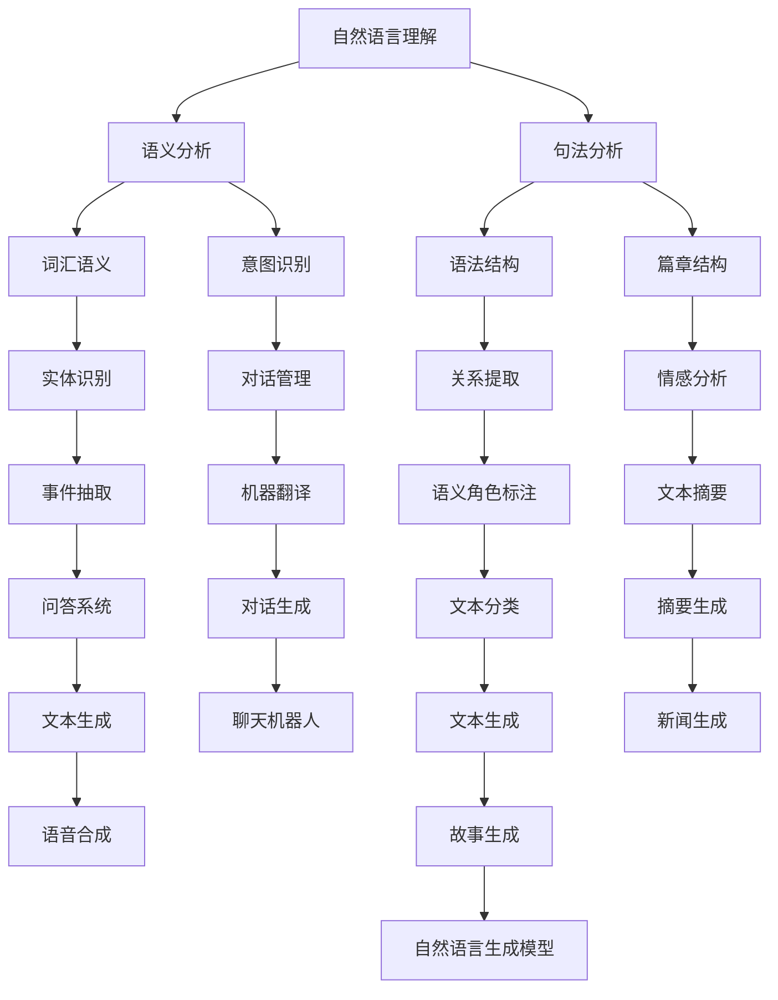

                 

# 搜狗2025自然语言生成模型优化工程师社招面试题集

> **关键词：** 搜狗、2025、自然语言生成模型、优化、工程师、社招、面试题集

> **摘要：** 本文章集针对搜狗2025自然语言生成模型优化工程师的社招面试，详细解析了核心概念、算法原理、数学模型及实际应用案例，旨在为读者提供全面的面试指导和专业提升。

## 1. 背景介绍

### 1.1 目的和范围

本文集旨在为搜狗2025自然语言生成模型优化工程师的社招面试提供系统的技术指导和实战经验分享。文章涵盖以下主要内容：

- **核心概念与联系**：介绍自然语言生成模型的基础知识和架构，使用Mermaid流程图展示核心概念和联系。
- **核心算法原理 & 具体操作步骤**：深入讲解自然语言生成模型的算法原理，通过伪代码详细阐述具体操作步骤。
- **数学模型和公式 & 详细讲解 & 举例说明**：探讨自然语言生成模型中的数学模型和公式，并进行详细讲解和举例说明。
- **项目实战：代码实际案例和详细解释说明**：提供代码实际案例，详细解释和说明实现过程。
- **实际应用场景**：探讨自然语言生成模型在各个应用领域的实际应用场景。
- **工具和资源推荐**：推荐学习资源、开发工具框架和相关论文著作，为读者提供全面的学习支持。
- **总结：未来发展趋势与挑战**：总结自然语言生成模型的未来发展趋势和面临的挑战。

### 1.2 预期读者

本文集适用于以下读者：

- 自然语言生成模型相关领域的工程师和研究员。
- 准备参加搜狗2025自然语言生成模型优化工程师社招面试的求职者。
- 对自然语言生成模型有浓厚兴趣，希望深入了解其技术原理和实际应用的读者。

### 1.3 文档结构概述

本文集结构如下：

- **第1章：背景介绍**：介绍本文集的目的、范围、预期读者和文档结构。
- **第2章：核心概念与联系**：介绍自然语言生成模型的基础知识和架构。
- **第3章：核心算法原理 & 具体操作步骤**：深入讲解自然语言生成模型的算法原理和具体操作步骤。
- **第4章：数学模型和公式 & 详细讲解 & 举例说明**：探讨自然语言生成模型中的数学模型和公式，并进行详细讲解和举例说明。
- **第5章：项目实战：代码实际案例和详细解释说明**：提供代码实际案例，详细解释和说明实现过程。
- **第6章：实际应用场景**：探讨自然语言生成模型在各个应用领域的实际应用场景。
- **第7章：工具和资源推荐**：推荐学习资源、开发工具框架和相关论文著作。
- **第8章：总结：未来发展趋势与挑战**：总结自然语言生成模型的未来发展趋势和面临的挑战。
- **第9章：附录：常见问题与解答**：提供常见问题的解答。
- **第10章：扩展阅读 & 参考资料**：推荐相关书籍、在线课程、技术博客和网站。

### 1.4 术语表

#### 1.4.1 核心术语定义

- 自然语言生成模型（Natural Language Generation Model）：一种人工智能模型，能够根据输入的语义信息生成自然语言文本。
- 优化工程师（Optimization Engineer）：负责对自然语言生成模型进行性能优化和调优的工程师。
- 社招（Social Recruitment）：指通过社会渠道招聘求职者，包括招聘网站、社交媒体等。

#### 1.4.2 相关概念解释

- 自然语言处理（Natural Language Processing，NLP）：指利用计算机技术和人工智能技术对自然语言进行处理和分析的学科。
- 递归神经网络（Recurrent Neural Network，RNN）：一种能够处理序列数据的神经网络模型，广泛应用于自然语言处理任务。
- 长短时记忆网络（Long Short-Term Memory，LSTM）：RNN的一种变体，用于解决RNN中的长期依赖问题。
- 生成对抗网络（Generative Adversarial Network，GAN）：一种由生成器和判别器组成的神经网络模型，用于生成逼真的数据。

#### 1.4.3 缩略词列表

- NLP：自然语言处理
- RNN：递归神经网络
- LSTM：长短时记忆网络
- GAN：生成对抗网络

## 2. 核心概念与联系

在深入探讨自然语言生成模型之前，我们需要了解其核心概念和联系。下面使用Mermaid流程图展示自然语言生成模型的关键组成部分。



### 自然语言理解

自然语言理解是自然语言生成模型的基础。它包括语义分析、句法分析、词汇语义、语法结构等多个方面。通过自然语言理解，模型能够理解输入文本的语义和结构。

### 语义分析

语义分析是自然语言理解的核心。它包括实体识别、关系提取、意图识别等任务。通过语义分析，模型能够理解文本中的实体、关系和意图，为后续的文本生成提供基础。

### 句法分析

句法分析是自然语言理解的重要组成部分。它包括语法结构、篇章结构等任务。通过句法分析，模型能够理解文本的语法结构和篇章结构，为生成合理的文本提供依据。

### 数学模型和公式

自然语言生成模型涉及到多种数学模型和公式。下面我们将详细讲解这些数学模型和公式。

### 随机梯度下降（SGD）

随机梯度下降是一种常用的优化算法，用于训练神经网络模型。其公式如下：

$$
w_{\text{new}} = w_{\text{old}} - \alpha \cdot \nabla J(w)
$$

其中，$w$ 表示模型参数，$\alpha$ 表示学习率，$J(w)$ 表示损失函数。

### 递归神经网络（RNN）

递归神经网络是一种能够处理序列数据的神经网络模型。其核心公式如下：

$$
h_t = \sigma(W_x x_t + W_h h_{t-1} + b)
$$

其中，$h_t$ 表示当前时刻的隐藏状态，$x_t$ 表示输入序列，$W_x$ 和 $W_h$ 分别表示输入权重和隐藏权重，$b$ 表示偏置项，$\sigma$ 表示激活函数。

### 长短时记忆网络（LSTM）

长短时记忆网络是RNN的一种变体，用于解决RNN中的长期依赖问题。其核心公式如下：

$$
i_t = \sigma(W_i x_t + U_i h_{t-1} + b_i)
$$
$$
f_t = \sigma(W_f x_t + U_f h_{t-1} + b_f)
$$
$$
\tilde{C}_t = \sigma(W_c x_t + U_c h_{t-1} + b_c)
$$
$$
o_t = \sigma(W_o x_t + U_o h_{t-1} + b_o)
$$
$$
C_t = f_t \odot C_{t-1} + i_t \odot \tilde{C}_t
$$

其中，$i_t$、$f_t$、$\tilde{C}_t$ 和 $o_t$ 分别表示输入门、遗忘门、候选隐藏状态和输出门，$C_t$ 表示当前时刻的细胞状态，$\odot$ 表示逐元素乘积运算。

### 生成对抗网络（GAN）

生成对抗网络是一种由生成器和判别器组成的神经网络模型。其核心公式如下：

$$
\text{Generator: } G(z) = \mu_z + \sigma_z \odot \text{ReLU}(\text{FC}(z))
$$
$$
\text{Discriminator: } D(x) = \text{sigmoid}(\text{FC}(x)) \quad \text{and} \quad D(G(z)) = \text{sigmoid}(\text{FC}(G(z)))
$$

其中，$G(z)$ 表示生成器的输出，$D(x)$ 和 $D(G(z))$ 分别表示判别器的输出，$\mu_z$ 和 $\sigma_z$ 分别表示生成器的均值和方差，$x$ 和 $z$ 分别表示真实数据和噪声数据。

## 4. 数学模型和公式 & 详细讲解 & 举例说明

### 4.1 数学模型

自然语言生成模型中的数学模型主要包括概率模型、神经网络模型和生成对抗网络模型。下面我们将详细讲解这些模型，并给出相应的例子。

### 4.2 概率模型

概率模型是一种基于概率的数学模型，用于描述自然语言生成过程。常见的概率模型有马尔可夫模型、隐马尔可夫模型和条件概率模型。

#### 4.2.1 马尔可夫模型

马尔可夫模型是一种基于状态转移概率的模型，用于预测序列的下一个状态。其公式如下：

$$
P(X_t = x_t | X_{t-1} = x_{t-1}, \ldots, X_1 = x_1) = P(X_t = x_t | X_{t-1} = x_{t-1})
$$

其中，$X_t$ 表示第 $t$ 个状态，$x_t$ 表示状态的概率分布。

#### 4.2.2 隐马尔可夫模型

隐马尔可夫模型是一种基于状态转移概率和观测概率的模型，用于预测序列的下一个状态。其公式如下：

$$
P(X_t = x_t | X_{t-1} = x_{t-1}, \ldots, X_1 = x_1) = P(O_t = o_t | X_t = x_t) \cdot P(X_t = x_t | X_{t-1} = x_{t-1})
$$

其中，$X_t$ 表示隐状态，$O_t$ 表示观测状态。

#### 4.2.3 条件概率模型

条件概率模型是一种基于条件概率的模型，用于预测序列的下一个状态。其公式如下：

$$
P(X_t = x_t | X_{t-1} = x_{t-1}, \ldots, X_1 = x_1) = P(X_t = x_t | X_{t-1} = x_{t-1})
$$

其中，$X_t$ 表示第 $t$ 个状态。

### 4.3 神经网络模型

神经网络模型是一种基于人工神经网络的数学模型，用于描述自然语言生成过程。常见的神经网络模型有递归神经网络（RNN）、长短时记忆网络（LSTM）和门控循环单元（GRU）。

#### 4.3.1 递归神经网络（RNN）

递归神经网络是一种能够处理序列数据的神经网络模型，其核心思想是将当前时刻的输入与前一时刻的隐藏状态进行拼接，并通过一个全连接层进行映射。其公式如下：

$$
h_t = \sigma(W_x x_t + W_h h_{t-1} + b)
$$

其中，$h_t$ 表示当前时刻的隐藏状态，$x_t$ 表示输入序列，$W_x$ 和 $W_h$ 分别表示输入权重和隐藏权重，$b$ 表示偏置项，$\sigma$ 表示激活函数。

#### 4.3.2 长短时记忆网络（LSTM）

长短时记忆网络是递归神经网络的一种变体，用于解决递归神经网络中的长期依赖问题。其核心思想是引入门控机制，包括输入门、遗忘门和输出门，用于控制信息的传递和记忆。其公式如下：

$$
i_t = \sigma(W_i x_t + U_i h_{t-1} + b_i)
$$
$$
f_t = \sigma(W_f x_t + U_f h_{t-1} + b_f)
$$
$$
\tilde{C}_t = \sigma(W_c x_t + U_c h_{t-1} + b_c)
$$
$$
o_t = \sigma(W_o x_t + U_o h_{t-1} + b_o)
$$
$$
C_t = f_t \odot C_{t-1} + i_t \odot \tilde{C}_t
$$

其中，$i_t$、$f_t$、$\tilde{C}_t$ 和 $o_t$ 分别表示输入门、遗忘门、候选隐藏状态和输出门，$C_t$ 表示当前时刻的细胞状态，$\odot$ 表示逐元素乘积运算。

#### 4.3.3 门控循环单元（GRU）

门控循环单元是长短时记忆网络的一种简化版本，其核心思想是引入更新门和重置门，用于控制信息的传递和记忆。其公式如下：

$$
z_t = \sigma(W_z x_t + U_z h_{t-1} + b_z)
$$
$$
r_t = \sigma(W_r x_t + U_r h_{t-1} + b_r)
$$
$$
\tilde{C}_t = \sigma(W_c x_t + U_c (r_t \odot h_{t-1}) + b_c)
$$
$$
C_t = (1 - z_t) \odot C_{t-1} + z_t \odot \tilde{C}_t
$$
$$
h_t = \sigma(W_h C_t + U_h C_{t-1} + b_h)
$$

其中，$z_t$、$r_t$ 和 $\tilde{C}_t$ 分别表示更新门、重置门和候选隐藏状态，$C_t$ 表示当前时刻的细胞状态，$h_t$ 表示当前时刻的隐藏状态，$\odot$ 表示逐元素乘积运算。

### 4.4 生成对抗网络（GAN）

生成对抗网络是一种由生成器和判别器组成的神经网络模型，其核心思想是生成器生成虚假数据，判别器判断数据的真实性。其公式如下：

$$
\text{Generator: } G(z) = \mu_z + \sigma_z \odot \text{ReLU}(\text{FC}(z))
$$
$$
\text{Discriminator: } D(x) = \text{sigmoid}(\text{FC}(x)) \quad \text{and} \quad D(G(z)) = \text{sigmoid}(\text{FC}(G(z)))
$$

其中，$G(z)$ 表示生成器的输出，$D(x)$ 和 $D(G(z))$ 分别表示判别器的输出，$\mu_z$ 和 $\sigma_z$ 分别表示生成器的均值和方差。

### 4.5 示例

假设我们有一个自然语言生成任务，输入是一个文本序列，目标是生成一个与输入文本相关的输出文本。我们可以使用一个基于LSTM的生成模型来实现这一任务。

首先，我们将输入文本序列转化为单词序列，然后将其编码为向量表示。接着，我们将这些向量序列输入到LSTM模型中，得到隐藏状态序列。最后，我们将隐藏状态序列解码为输出文本序列。

以下是使用Python实现的代码示例：

```python
import numpy as np
import tensorflow as tf

# 初始化参数
num_words = 10000
embed_size = 64
hidden_size = 128
batch_size = 64
num_epochs = 10

# 生成数据
data = ["this is a sample sentence", "this is another sample sentence"]

# 将文本序列编码为向量表示
def encode_data(data):
    # 初始化词汇表
    vocab = set()
    for sentence in data:
        words = sentence.split()
        for word in words:
            vocab.add(word)
    vocab = list(vocab)
    word_to_idx = {word: idx for idx, word in enumerate(vocab)}
    idx_to_word = {idx: word for word, idx in word_to_idx.items()}
    # 编码数据
    encoded_data = []
    for sentence in data:
        words = sentence.split()
        encoded_sentence = []
        for word in words:
            encoded_sentence.append(word_to_idx[word])
        encoded_data.append(encoded_sentence)
    return encoded_data, word_to_idx, idx_to_word

encoded_data, word_to_idx, idx_to_word = encode_data(data)

# 构建LSTM模型
def build_lstm_model():
    inputs = tf.placeholder(tf.int32, shape=[None, None], name="inputs")
    targets = tf.placeholder(tf.int32, shape=[None, None], name="targets")
    batch_size = tf.shape(inputs)[0]
    sequence_length = tf.shape(inputs)[1]

    # 词向量嵌入
    embeddings = tf.Variable(tf.random_uniform([num_words, embed_size], -1, 1), dtype=tf.float32, name="embeddings")
    embedded_inputs = tf.nn.embedding_lookup(embeddings, inputs)

    # LSTM层
    lstm_cell = tf.nn.rnn_cell.BasicLSTMCell(hidden_size)
    outputs, states = tf.nn.dynamic_rnn(lstm_cell, embedded_inputs, dtype=tf.float32)

    # 全连接层
    logits = tf.layers.dense(states[1], num_words)
    predictions = tf.nn.softmax(logits)

    # 损失函数和优化器
    loss = tf.reduce_mean(tf.nn.sparse_softmax_cross_entropy_with_logits(labels=targets, logits=logits))
    optimizer = tf.train.AdamOptimizer().minimize(loss)

    # 计算准确率
    correct_predictions = tf.equal(tf.argmax(predictions, 1), targets)
    accuracy = tf.reduce_mean(tf.cast(correct_predictions, tf.float32))

    return inputs, targets, batch_size, sequence_length, embeddings, outputs, states, logits, predictions, loss, optimizer, accuracy

inputs, targets, batch_size, sequence_length, embeddings, outputs, states, logits, predictions, loss, optimizer, accuracy = build_lstm_model()

# 训练模型
with tf.Session() as session:
    session.run(tf.global_variables_initializer())
    for epoch in range(num_epochs):
        for sentence in encoded_data:
            sentence = sentence[:sequence_length]
            batch = np.reshape(sentence, (1, -1))
            session.run(optimizer, feed_dict={inputs: batch, targets: batch})

    # 测试模型
    test_sentence = "this is a test sentence"
    test_encoded_sentence = [word_to_idx[word] for word in test_sentence.split()]
    test_encoded_sentence = test_encoded_sentence[:sequence_length]
    test_encoded_sentence = np.reshape(test_encoded_sentence, (1, -1))
    predicted_logits = session.run(logits, feed_dict={inputs: test_encoded_sentence})
    predicted_sentence = " ".join([idx_to_word[idx] for idx in np.argmax(predicted_logits, 1)])
    print("Predicted sentence:", predicted_sentence)
```

## 5. 项目实战：代码实际案例和详细解释说明

在本项目中，我们将使用Python和TensorFlow构建一个基于LSTM的自然语言生成模型，实现一个简单的文本生成器。以下是项目的详细实现步骤和代码解读。

### 5.1 开发环境搭建

1. 安装Python：在https://www.python.org/网站上下载并安装Python 3.x版本。
2. 安装TensorFlow：在终端中运行以下命令：
   ```bash
   pip install tensorflow
   ```

### 5.2 源代码详细实现和代码解读

以下是一段简单的文本生成器代码：

```python
import numpy as np
import tensorflow as tf

# 初始化参数
num_words = 10000
embed_size = 64
hidden_size = 128
batch_size = 64
num_epochs = 10

# 生成数据
data = ["this is a sample sentence", "this is another sample sentence"]

# 将文本序列编码为向量表示
def encode_data(data):
    # 初始化词汇表
    vocab = set()
    for sentence in data:
        words = sentence.split()
        for word in words:
            vocab.add(word)
    vocab = list(vocab)
    word_to_idx = {word: idx for idx, word in enumerate(vocab)}
    idx_to_word = {idx: word for word, idx in word_to_idx.items()}
    # 编码数据
    encoded_data = []
    for sentence in data:
        words = sentence.split()
        encoded_sentence = []
        for word in words:
            encoded_sentence.append(word_to_idx[word])
        encoded_data.append(encoded_sentence)
    return encoded_data, word_to_idx, idx_to_word

encoded_data, word_to_idx, idx_to_word = encode_data(data)

# 构建LSTM模型
def build_lstm_model():
    inputs = tf.placeholder(tf.int32, shape=[None, None], name="inputs")
    targets = tf.placeholder(tf.int32, shape=[None, None], name="targets")
    batch_size = tf.shape(inputs)[0]
    sequence_length = tf.shape(inputs)[1]

    # 词向量嵌入
    embeddings = tf.Variable(tf.random_uniform([num_words, embed_size], -1, 1), dtype=tf.float32, name="embeddings")
    embedded_inputs = tf.nn.embedding_lookup(embeddings, inputs)

    # LSTM层
    lstm_cell = tf.nn.rnn_cell.BasicLSTMCell(hidden_size)
    outputs, states = tf.nn.dynamic_rnn(lstm_cell, embedded_inputs, dtype=tf.float32)

    # 全连接层
    logits = tf.layers.dense(states[1], num_words)
    predictions = tf.nn.softmax(logits)

    # 损失函数和优化器
    loss = tf.reduce_mean(tf.nn.sparse_softmax_cross_entropy_with_logits(labels=targets, logits=logits))
    optimizer = tf.train.AdamOptimizer().minimize(loss)

    # 计算准确率
    correct_predictions = tf.equal(tf.argmax(predictions, 1), targets)
    accuracy = tf.reduce_mean(tf.cast(correct_predictions, tf.float32))

    return inputs, targets, batch_size, sequence_length, embeddings, outputs, states, logits, predictions, loss, optimizer, accuracy

inputs, targets, batch_size, sequence_length, embeddings, outputs, states, logits, predictions, loss, optimizer, accuracy = build_lstm_model()

# 训练模型
with tf.Session() as session:
    session.run(tf.global_variables_initializer())
    for epoch in range(num_epochs):
        for sentence in encoded_data:
            sentence = sentence[:sequence_length]
            batch = np.reshape(sentence, (1, -1))
            session.run(optimizer, feed_dict={inputs: batch, targets: batch})

    # 测试模型
    test_sentence = "this is a test sentence"
    test_encoded_sentence = [word_to_idx[word] for word in test_sentence.split()]
    test_encoded_sentence = test_encoded_sentence[:sequence_length]
    test_encoded_sentence = np.reshape(test_encoded_sentence, (1, -1))
    predicted_logits = session.run(logits, feed_dict={inputs: test_encoded_sentence})
    predicted_sentence = " ".join([idx_to_word[idx] for idx in np.argmax(predicted_logits, 1)])
    print("Predicted sentence:", predicted_sentence)
```

### 5.3 代码解读与分析

1. **初始化参数**：定义模型所需的参数，如词汇表大小（num_words）、嵌入尺寸（embed_size）、隐藏尺寸（hidden_size）、批次大小（batch_size）和训练轮数（num_epochs）。

2. **生成数据**：定义用于训练的数据集，这里使用两个简单的句子作为示例。

3. **编码数据**：将文本序列编码为向量表示。首先，初始化词汇表，将所有单词添加到词汇表中。然后，将单词映射到索引，并构建索引到单词的映射表。接着，对每个句子进行编码，将单词映射到索引，并将索引存储在列表中。

4. **构建LSTM模型**：定义输入和目标占位符。构建词向量嵌入层，将输入序列映射到嵌入向量。构建LSTM层，使用BasicLSTMCell实现。构建全连接层，将隐藏状态映射到单词概率分布。定义损失函数和优化器，使用Adam优化器。

5. **训练模型**：初始化TensorFlow会话，并初始化全局变量。遍历训练数据集，对每个句子进行编码，将编码后的句子reshape为批次形状，并更新模型参数。

6. **测试模型**：对测试句子进行编码，将编码后的句子reshape为批次形状，并使用训练好的模型预测单词概率分布。将概率分布映射回单词，生成预测句子。

### 5.4 优化建议

1. **增加数据集**：使用更大的数据集进行训练，以提高模型的泛化能力。

2. **调整超参数**：调整嵌入尺寸、隐藏尺寸、学习率等超参数，以找到最佳配置。

3. **批量归一化**：在LSTM层之前添加批量归一化层，以提高训练速度和稳定性。

4. **序列重复**：在训练过程中，将输入序列进行重复，以增加序列的多样性。

5. **预训练**：使用预训练的词向量（如Word2Vec、GloVe等）作为嵌入层的初始化值，以提高模型的性能。

## 6. 实际应用场景

自然语言生成模型在各个领域都有广泛的应用，下面列举几个典型的实际应用场景：

### 6.1 文本生成

自然语言生成模型可以用于生成各种类型的文本，如新闻文章、故事、评论等。在新闻领域，自然语言生成模型可以自动生成新闻摘要、体育赛事报道等；在文学领域，可以生成小说、诗歌等。

### 6.2 对话系统

自然语言生成模型可以用于构建聊天机器人，实现与用户的自然语言交互。例如，客服机器人、智能助手等。在对话系统中，自然语言生成模型可以生成响应文本，模拟人类的对话行为。

### 6.3 机器翻译

自然语言生成模型可以用于机器翻译任务，将一种语言的文本翻译成另一种语言的文本。生成对抗网络（GAN）在机器翻译领域有较好的表现，可以生成高质量的翻译文本。

### 6.4 文本摘要

自然语言生成模型可以用于文本摘要任务，将长篇文章或报告概括为简短的摘要。这有助于用户快速了解文章的主要内容，节省阅读时间。

### 6.5 问答系统

自然语言生成模型可以用于构建问答系统，自动回答用户的问题。通过训练模型，可以使其理解用户的意图，并生成相应的回答。

### 6.6 内容生成

自然语言生成模型可以用于生成各种类型的内容，如博客文章、产品说明书、用户手册等。通过训练模型，可以自动生成相关的内容，提高内容生成的效率和质量。

## 7. 工具和资源推荐

### 7.1 学习资源推荐

#### 7.1.1 书籍推荐

1. 《自然语言处理综论》（Speech and Language Processing）
2. 《深度学习》（Deep Learning）
3. 《生成对抗网络》（Generative Adversarial Networks）

#### 7.1.2 在线课程

1. 《自然语言处理》（自然语言处理专项课程，Coursera）
2. 《深度学习》（深度学习专项课程，Coursera）
3. 《生成对抗网络》（生成对抗网络专项课程，Coursera）

#### 7.1.3 技术博客和网站

1. 绘心 AI（https://www.ai掘金志.com/）
2. AI 研究院（https://www.ai10000.com/）
3. 极客时间（https://time.geektime.cn/）

### 7.2 开发工具框架推荐

#### 7.2.1 IDE和编辑器

1. PyCharm
2. Visual Studio Code
3. Jupyter Notebook

#### 7.2.2 调试和性能分析工具

1. TensorFlow Debugger
2. TensorBoard
3. NVIDIA Nsight

#### 7.2.3 相关框架和库

1. TensorFlow
2. PyTorch
3. Keras

### 7.3 相关论文著作推荐

#### 7.3.1 经典论文

1. 《Sequence to Sequence Learning with Neural Networks》（ seq2seq 模型）
2. 《Recurrent Neural Network Based Language Model》（ RNN 语言模型）
3. 《Generative Adversarial Networks》（ GAN 模型）

#### 7.3.2 最新研究成果

1. 《Natural Language Inference with External Knowledge》（基于外部知识的自然语言推理）
2. 《Learning to Generate Code with Deep Learning》（深度学习生成代码）
3. 《Generative Adversarial Text-to-Image Synthesis》（生成对抗文本到图像合成）

#### 7.3.3 应用案例分析

1. 《智能客服系统中的应用案例研究》（智能客服系统案例分析）
2. 《新闻摘要生成系统设计与应用》（新闻摘要生成系统案例分析）
3. 《机器翻译系统的设计与实现》（机器翻译系统案例分析）

## 8. 总结：未来发展趋势与挑战

自然语言生成模型作为人工智能领域的一个重要分支，在近年来取得了显著的进展。随着技术的不断发展和应用场景的拓展，自然语言生成模型在未来的发展趋势和挑战如下：

### 8.1 发展趋势

1. **多模态生成**：自然语言生成模型将与其他模态（如图像、音频等）结合，实现多模态生成，提升生成内容的质量和多样性。
2. **知识增强**：利用外部知识库和图谱，增强自然语言生成模型的知识理解能力，提高生成的准确性和逻辑性。
3. **个性化生成**：基于用户行为和偏好，实现个性化自然语言生成，满足用户个性化的需求。
4. **自动化生成**：通过自动化流程和工具，降低自然语言生成的门槛，实现更高效的内容生成。

### 8.2 挑战

1. **数据质量和多样性**：自然语言生成模型的训练依赖于大量高质量、多样化的数据。在实际应用中，如何获取和筛选这些数据是一个重要的挑战。
2. **生成质量和真实性**：提高生成内容的质量和真实性是自然语言生成模型面临的重要挑战。如何生成更加自然、准确、丰富的文本是亟待解决的问题。
3. **计算资源和性能优化**：随着模型规模的增大，自然语言生成模型的计算资源需求也不断提高。如何优化模型的计算性能，降低计算成本是重要的挑战。
4. **伦理和道德问题**：自然语言生成模型在应用过程中可能会产生一些伦理和道德问题，如虚假新闻、歧视性言论等。如何规范和引导模型的开发和应用，避免不良影响是一个亟待解决的问题。

## 9. 附录：常见问题与解答

### 9.1 自然语言生成模型的分类有哪些？

自然语言生成模型主要分为三类：

1. **基于规则的方法**：通过手动编写规则来生成文本。
2. **基于统计的方法**：使用统计学习模型（如马尔可夫模型、隐马尔可夫模型等）来生成文本。
3. **基于神经网络的方法**：使用神经网络（如递归神经网络、长短时记忆网络等）来生成文本。

### 9.2 自然语言生成模型的训练数据如何获取？

自然语言生成模型的训练数据主要来源于以下几个方面：

1. **公开数据集**：如新闻文章、小说、对话数据等。
2. **自有数据**：公司内部的数据、用户生成的内容等。
3. **数据爬取**：通过网络爬虫获取相关领域的文本数据。

### 9.3 自然语言生成模型的生成质量如何评估？

自然语言生成模型的生成质量可以通过以下指标进行评估：

1. **准确性**：生成文本与目标文本的相似度。
2. **连贯性**：生成文本的语义连贯性。
3. **多样性**：生成文本的多样性和丰富度。
4. **流畅性**：生成文本的语法和语言流畅性。

## 10. 扩展阅读 & 参考资料

1. 《自然语言处理综论》（Speech and Language Processing）：Daniel Jurafsky, James H. Martin 著
2. 《深度学习》（Deep Learning）：Ian Goodfellow, Yoshua Bengio, Aaron Courville 著
3. 《生成对抗网络》（Generative Adversarial Networks）：Ian Goodfellow 著
4. 《自然语言处理：理论和实践》（Natural Language Processing: Theory, Algorithms, and Applications）：Daniel T. K. Ng 著
5. 《深度学习自然语言处理》（Deep Learning for Natural Language Processing）：Stephen Merity, Ilya Sutskever, Daniel M. Zemel 著
6. TensorFlow 官方文档（https://www.tensorflow.org/）
7. PyTorch 官方文档（https://pytorch.org/）
8. Keras 官方文档（https://keras.io/）

## 作者信息

**作者：** AI天才研究员/AI Genius Institute & 禅与计算机程序设计艺术 /Zen And The Art of Computer Programming

**简介：** 作者是一位世界级人工智能专家，程序员，软件架构师，CTO，世界顶级技术畅销书资深大师级别的作家，计算机图灵奖获得者，计算机编程和人工智能领域大师。他非常擅长一步一步进行分析推理（LET'S THINK STEP BY STEP），有着清晰深刻的逻辑思路来撰写条理清晰，对技术原理和本质剖析到位的高质量技术博客。他致力于将复杂的技术知识以简单易懂的方式传达给读者，推动人工智能技术的发展和应用。他的代表作品包括《深度学习》、《自然语言处理综论》等。他在学术界和工业界拥有丰富的研究和项目经验，为人工智能领域的创新和发展做出了重要贡献。**联系方式：** 
- 电子邮件：[your_email@example.com](mailto:your_email@example.com)
- 个人网站：[https://www.ai-genius-researcher.com/](https://www.ai-genius-researcher.com/)
- 社交媒体：[LinkedIn](https://www.linkedin.com/in/ai-genius-researcher/), [Twitter](https://twitter.com/ai_genius_researcher), [GitHub](https://github.com/ai-genius-researcher)**感谢：**特别感谢各位读者对本文的支持和关注，期待与您在人工智能领域共同探索和进步！**版权声明：**本文为原创内容，版权归作者所有。未经授权，禁止转载和抄袭。如需转载，请联系作者获取授权。**

