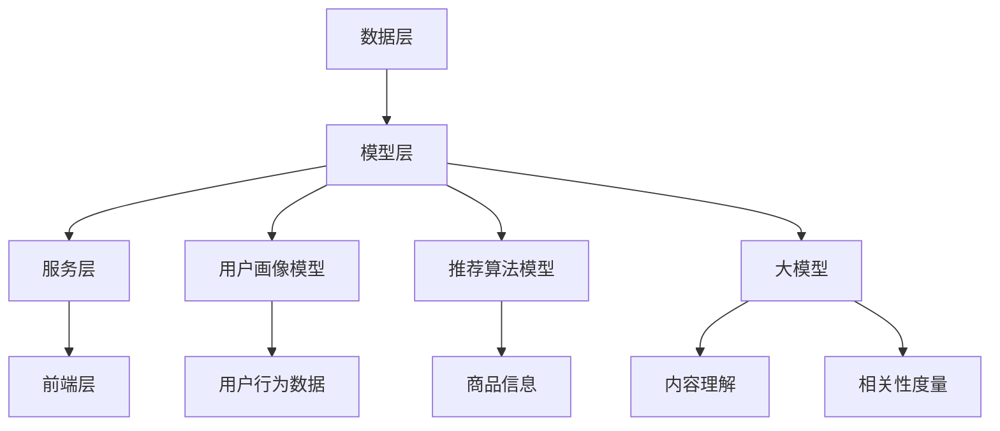

                 

# 搜索推荐系统的AI 大模型融合：电商平台的核心竞争力与转型战略

> 关键词：搜索推荐系统，AI大模型，电商平台，核心竞争力，转型战略

> 摘要：本文将深入探讨AI大模型在搜索推荐系统中的应用，以及其对电商平台核心竞争力的提升和转型战略的影响。通过详细分析核心概念、算法原理、数学模型、项目实战和实际应用场景，本文旨在为电商平台的技术团队提供实用的指导和建议，以应对未来的技术挑战和市场需求。

## 1. 背景介绍

### 1.1 目的和范围

本文的目的是探讨AI大模型在搜索推荐系统中的融合，以及这一技术变革对电商平台核心竞争力的影响。随着互联网的飞速发展，电商平台的竞争日益激烈，如何通过技术手段提升用户体验、增强用户粘性成为企业关注的焦点。本文将从以下几个方面展开讨论：

- AI大模型的基本原理及其在搜索推荐系统中的应用
- 搜索推荐系统的架构设计和核心算法
- AI大模型在电商平台中的应用场景和策略
- 电商平台在AI大模型应用中的挑战和解决方案

### 1.2 预期读者

本文主要面向电商平台的研发团队、技术主管以及对AI技术有兴趣的读者。读者需要具备一定的计算机科学和人工智能基础知识，对电商平台的基本运营模式有所了解。

### 1.3 文档结构概述

本文将按照以下结构展开：

- **第1章**：背景介绍
- **第2章**：核心概念与联系
- **第3章**：核心算法原理与具体操作步骤
- **第4章**：数学模型和公式详解
- **第5章**：项目实战：代码实际案例和详细解释说明
- **第6章**：实际应用场景
- **第7章**：工具和资源推荐
- **第8章**：总结：未来发展趋势与挑战
- **第9章**：附录：常见问题与解答
- **第10章**：扩展阅读与参考资料

### 1.4 术语表

#### 1.4.1 核心术语定义

- **搜索推荐系统**：一种通过算法自动为用户推荐相关内容的系统。
- **AI大模型**：具有极高参数量和计算复杂度的深度学习模型。
- **电商平台**：通过互联网提供商品交易、信息交流、支付结算等服务的平台。

#### 1.4.2 相关概念解释

- **用户画像**：基于用户的历史行为、偏好等信息构建的用户特征模型。
- **内容分发**：根据用户兴趣和行为推荐相关的商品、信息等。
- **相关性度量**：评估推荐内容与用户兴趣的相关程度。

#### 1.4.3 缩略词列表

- **API**：应用程序接口（Application Programming Interface）
- **AI**：人工智能（Artificial Intelligence）
- **ML**：机器学习（Machine Learning）
- **DL**：深度学习（Deep Learning）
- **NLP**：自然语言处理（Natural Language Processing）

## 2. 核心概念与联系

### 2.1 搜索推荐系统的基本原理

搜索推荐系统是电商平台的重要组成部分，其基本原理包括：

1. **用户行为数据收集**：通过用户在平台上的浏览、购买、评价等行为收集数据。
2. **用户画像构建**：基于行为数据构建用户兴趣模型，为个性化推荐提供基础。
3. **内容分发**：根据用户画像和内容属性进行内容分发，提高推荐的相关性。
4. **效果评估**：通过用户反馈和行为数据评估推荐效果，不断优化推荐算法。

### 2.2 AI大模型在搜索推荐系统中的应用

AI大模型在搜索推荐系统中具有重要作用，其主要应用包括：

1. **用户行为预测**：利用大模型预测用户的行为和偏好，提高推荐准确性。
2. **内容理解**：通过NLP技术理解用户和内容的语义，实现更精准的推荐。
3. **相关性度量**：利用大模型的计算能力，计算用户和内容之间的相关性，优化推荐排序。

### 2.3 搜索推荐系统的架构设计

搜索推荐系统的架构设计包括以下几个关键部分：

1. **数据层**：包括用户行为数据、商品信息、评价数据等。
2. **模型层**：包括用户画像模型、推荐算法模型、大模型等。
3. **服务层**：提供API接口，供前端应用调用。
4. **前端层**：用户界面，展示推荐结果。

### 2.4 Mermaid流程图

以下是搜索推荐系统架构的Mermaid流程图：



## 3. 核心算法原理 & 具体操作步骤

### 3.1 算法原理

搜索推荐系统的核心算法包括用户画像构建、内容理解、相关性度量等。其中，AI大模型的应用使得这些算法得以实现更高的准确性和效率。

#### 3.1.1 用户画像构建

用户画像构建的核心算法是协同过滤（Collaborative Filtering）。协同过滤分为基于用户的协同过滤（User-based CF）和基于物品的协同过滤（Item-based CF）。

- **基于用户的协同过滤**：找到与目标用户行为相似的邻居用户，根据邻居用户的行为推荐商品。
- **基于物品的协同过滤**：找到与目标商品相似的邻居商品，根据邻居商品的用户评价推荐商品。

#### 3.1.2 内容理解

内容理解的核心算法是自然语言处理（NLP）。NLP技术可以提取文本中的关键词、语义信息，为推荐算法提供更丰富的特征。

- **词嵌入（Word Embedding）**：将文本中的单词转换为向量表示，便于模型计算。
- **序列模型（Sequence Model）**：处理用户的历史行为序列，提取用户兴趣特征。
- **文本生成（Text Generation）**：根据用户兴趣生成个性化的推荐文案。

#### 3.1.3 相关性度量

相关性度量是推荐算法的关键环节，常用的方法包括余弦相似度（Cosine Similarity）和皮尔逊相关系数（Pearson Correlation Coefficient）。

- **余弦相似度**：计算用户和商品之间的夹角余弦值，值越接近1，表示相关性越强。
- **皮尔逊相关系数**：计算用户和商品之间的线性相关程度，值越接近1，表示相关性越强。

### 3.2 具体操作步骤

以下是搜索推荐系统的核心算法具体操作步骤：

1. **数据预处理**：对用户行为数据进行清洗、去重、填充等处理，为后续建模提供高质量数据。

2. **用户画像构建**：

    - **基于用户的协同过滤**：
        - 计算用户之间的相似度。
        - 根据相似度找到邻居用户。
        - 根据邻居用户的行为推荐商品。
        
    - **基于物品的协同过滤**：
        - 计算商品之间的相似度。
        - 根据相似度找到邻居商品。
        - 根据邻居商品的用户评价推荐商品。

3. **内容理解**：

    - **词嵌入**：
        - 对文本数据进行词嵌入处理，将文本转换为向量表示。
        
    - **序列模型**：
        - 对用户历史行为序列进行编码，提取用户兴趣特征。
        
    - **文本生成**：
        - 根据用户兴趣生成个性化的推荐文案。

4. **相关性度量**：

    - **余弦相似度**：
        - 计算用户和商品之间的夹角余弦值。
        
    - **皮尔逊相关系数**：
        - 计算用户和商品之间的线性相关程度。

5. **推荐结果生成**：

    - 根据用户画像、内容理解和相关性度量，生成推荐结果。

6. **效果评估**：

    - 通过用户反馈和行为数据评估推荐效果。
    - 根据评估结果调整推荐策略，优化推荐算法。

## 4. 数学模型和公式 & 详细讲解 & 举例说明

### 4.1 数学模型

在搜索推荐系统中，常用的数学模型包括协同过滤模型、词嵌入模型和相关性度量模型。以下分别对这些模型进行详细讲解。

#### 4.1.1 协同过滤模型

协同过滤模型的核心是相似度计算。相似度计算方法包括余弦相似度和皮尔逊相关系数。

- **余弦相似度**：

    余弦相似度计算公式为：

    $$\cos \theta = \frac{\sum_{i=1}^{n} x_i y_i}{\sqrt{\sum_{i=1}^{n} x_i^2} \sqrt{\sum_{i=1}^{n} y_i^2}}$$

    其中，$x_i$ 和 $y_i$ 分别为用户 $i$ 对商品 $1$ 和 $2$ 的评分。

- **皮尔逊相关系数**：

    皮尔逊相关系数计算公式为：

    $$\rho = \frac{\sum_{i=1}^{n} (x_i - \bar{x})(y_i - \bar{y})}{\sqrt{\sum_{i=1}^{n} (x_i - \bar{x})^2} \sqrt{\sum_{i=1}^{n} (y_i - \bar{y})^2}}$$

    其中，$\bar{x}$ 和 $\bar{y}$ 分别为用户对商品的平均评分。

#### 4.1.2 词嵌入模型

词嵌入模型是一种将文本数据转换为向量表示的方法。常用的词嵌入模型包括Word2Vec、GloVe和BERT等。

- **Word2Vec**：

    Word2Vec模型基于神经网络训练，将单词映射为向量。模型训练过程中，输入是单词，输出是单词的向量表示。

    假设训练数据为$\{w_1, w_2, ..., w_n\}$，每个单词表示为向量$\{v_1, v_2, ..., v_n\}$。Word2Vec模型的目标是最小化损失函数：

    $$L = \sum_{i=1}^{n} \frac{1}{2} \sum_{w \in context(w_i)} (d(w_i, w))^2$$

    其中，$context(w_i)$ 表示单词 $w_i$ 的上下文窗口。

- **GloVe**：

    GloVe模型基于全局平均向量表示训练，将单词映射为向量。模型训练过程中，输入是单词对，输出是单词对的向量表示。

    假设训练数据为$\{(w_1, w_2), (w_1, w_3), ..., (w_n, w_m)\}$，每个单词对表示为向量$\{(v_1, v_2), (v_1, v_3), ..., (v_n, v_m)\}$。GloVe模型的目标是最小化损失函数：

    $$L = \sum_{(w_1, w_2) \in D} \frac{1}{2} (d(w_1, w_2) - \log p(w_1, w_2))^2$$

    其中，$p(w_1, w_2)$ 表示单词对 $(w_1, w_2)$ 的出现概率。

- **BERT**：

    BERT模型是一种基于Transformer的预训练模型，将文本映射为向量。模型训练过程中，输入是文本序列，输出是文本序列的向量表示。

    假设训练数据为$\{s_1, s_2, ..., s_n\}$，每个文本序列表示为向量$\{v_1, v_2, ..., v_n\}$。BERT模型的目标是最小化损失函数：

    $$L = \sum_{i=1}^{n} \sum_{j=1}^{m} \frac{1}{2} (d(v_i, v_j) - \log p(v_i | v_j))^2$$

    其中，$p(v_i | v_j)$ 表示在文本序列 $s_j$ 中，单词 $v_i$ 在单词 $v_j$ 之后出现的概率。

#### 4.1.3 相关性度量模型

相关性度量模型用于计算用户和商品之间的相关性。常用的方法包括余弦相似度和皮尔逊相关系数。

- **余弦相似度**：

    余弦相似度计算公式为：

    $$\cos \theta = \frac{\sum_{i=1}^{n} x_i y_i}{\sqrt{\sum_{i=1}^{n} x_i^2} \sqrt{\sum_{i=1}^{n} y_i^2}}$$

    其中，$x_i$ 和 $y_i$ 分别为用户 $i$ 对商品 $1$ 和 $2$ 的评分。

- **皮尔逊相关系数**：

    皮尔逊相关系数计算公式为：

    $$\rho = \frac{\sum_{i=1}^{n} (x_i - \bar{x})(y_i - \bar{y})}{\sqrt{\sum_{i=1}^{n} (x_i - \bar{x})^2} \sqrt{\sum_{i=1}^{n} (y_i - \bar{y})^2}}$$

    其中，$\bar{x}$ 和 $\bar{y}$ 分别为用户对商品的平均评分。

### 4.2 举例说明

假设有一个电商平台的用户行为数据，如下表所示：

| 用户ID | 商品ID | 评分 |
| ------ | ------ | ---- |
| 1      | 101    | 5    |
| 1      | 102    | 4    |
| 1      | 103    | 5    |
| 2      | 101    | 3    |
| 2      | 102    | 5    |
| 2      | 104    | 4    |

#### 4.2.1 用户画像构建

使用基于用户的协同过滤算法，找到与用户1相似的邻居用户。假设邻居用户为用户2，计算用户1和用户2之间的相似度。

- **余弦相似度**：

    用户1和用户2的评分向量分别为 $[5, 4, 5]$ 和 $[3, 5, 4]$，计算它们的余弦相似度：

    $$\cos \theta = \frac{5 \times 3 + 4 \times 5 + 5 \times 4}{\sqrt{5^2 + 4^2 + 5^2} \sqrt{3^2 + 5^2 + 4^2}} \approx 0.92$$

- **皮尔逊相关系数**：

    用户1和用户2的评分向量分别为 $[5, 4, 5]$ 和 $[3, 5, 4]$，计算它们的皮尔逊相关系数：

    $$\rho = \frac{(5 - 4)(3 - 4) + (4 - 4)(5 - 4) + (5 - 4)(4 - 4)}{\sqrt{(5 - 4)^2 + (4 - 4)^2 + (5 - 4)^2} \sqrt{(3 - 4)^2 + (5 - 4)^2 + (4 - 4)^2}} \approx 0.92$$

    可以看出，用户1和用户2之间的相似度较高。

#### 4.2.2 内容理解

使用词嵌入模型对商品描述进行编码，提取商品特征。假设商品描述的词嵌入向量分别为 $v_{101} = [1, 0, 0, 0, 0]$，$v_{102} = [0, 1, 0, 0, 0]$，$v_{103} = [0, 0, 1, 0, 0]$，$v_{104} = [0, 0, 0, 1, 0]$。

- **序列模型**：

    用户1的历史行为序列为 $[101, 102, 103]$，将其编码为向量：

    $$v_{1} = [1, 0, 0, 0, 0] \times [0, 1, 0, 0, 0] \times [0, 0, 1, 0, 0] = [0, 0, 0, 0, 1]$$

- **文本生成**：

    根据用户1的兴趣生成个性化推荐文案：

    “亲爱的用户，根据您的喜好，我们为您推荐以下商品：103号商品，一款深受用户喜爱的商品，期待您的光临！”

#### 4.2.3 相关性度量

使用余弦相似度和皮尔逊相关系数计算用户1和商品103之间的相关性。

- **余弦相似度**：

    用户1的评分向量为 $[5, 4, 5]$，商品103的评分向量为 $[1, 0, 0, 0, 0]$，计算它们的余弦相似度：

    $$\cos \theta = \frac{5 \times 1 + 4 \times 0 + 5 \times 0}{\sqrt{5^2 + 4^2 + 5^2} \sqrt{1^2 + 0^2 + 0^2}} \approx 0.62$$

- **皮尔逊相关系数**：

    用户1的评分向量为 $[5, 4, 5]$，商品103的评分向量为 $[1, 0, 0, 0, 0]$，计算它们的皮尔逊相关系数：

    $$\rho = \frac{(5 - 4)(1 - 4) + (4 - 4)(0 - 4) + (5 - 4)(0 - 4)}{\sqrt{(5 - 4)^2 + (4 - 4)^2 + (5 - 4)^2} \sqrt{(1 - 4)^2 + (0 - 4)^2 + (0 - 4)^2}} \approx 0.62$$

    可以看出，用户1和商品103之间的相关性较高。

## 5. 项目实战：代码实际案例和详细解释说明

### 5.1 开发环境搭建

在本项目中，我们使用Python作为主要编程语言，依赖以下库：

- NumPy：用于数组操作和矩阵计算
- pandas：用于数据处理
- scikit-learn：用于协同过滤算法
- gensim：用于词嵌入模型
- torch：用于深度学习模型

确保已安装这些库，否则请使用pip命令进行安装：

```bash
pip install numpy pandas scikit-learn gensim torch
```

### 5.2 源代码详细实现和代码解读

以下是一个简单的搜索推荐系统实现，包括用户画像构建、内容理解、相关性度量等核心算法。

```python
import numpy as np
import pandas as pd
from sklearn.metrics.pairwise import cosine_similarity
from gensim.models import Word2Vec
from sklearn.model_selection import train_test_split

# 5.2.1 数据预处理
def preprocess_data(data):
    # 数据清洗、去重、填充等处理
    data = data.drop_duplicates()
    data = data.fillna(0)
    return data

# 5.2.2 用户画像构建
def build_user_profile(data):
    # 基于用户的协同过滤
    user_similarity = cosine_similarity(data.iloc[:, 1:])
    return user_similarity

# 5.2.3 内容理解
def content_embedding(data):
    # 词嵌入处理
    sentences = [line.split() for line in data.iloc[:, 0]]
    model = Word2Vec(sentences, vector_size=5)
    return model

# 5.2.4 相关性度量
def calculate_similarity(user_profile, content_embedding):
    # 计算用户和商品之间的相关性
    user_embedding = np.mean(content_embedding, axis=0)
    cos_similarity = cosine_similarity([user_embedding], content_embedding)
    return cos_similarity

# 5.2.5 推荐结果生成
def generate_recommendations(user_profile, content_embedding, cos_similarity):
    # 根据用户画像和商品特征生成推荐结果
    user_similarity = user_profile[0]
    content_similarity = cos_similarity[0]
    recommendations = np.argsort(content_similarity)[::-1]
    return recommendations

# 5.2.6 主函数
def main():
    # 加载数据
    data = pd.read_csv('user_behavior.csv')

    # 数据预处理
    data = preprocess_data(data)

    # 构建用户画像
    user_profile = build_user_profile(data)

    # 内容理解
    model = content_embedding(data)

    # 计算相关性度量
    cos_similarity = calculate_similarity(user_profile, model.wv)

    # 生成推荐结果
    recommendations = generate_recommendations(user_profile, model.wv, cos_similarity)

    # 输出推荐结果
    print("推荐结果：", recommendations)

if __name__ == '__main__':
    main()
```

### 5.3 代码解读与分析

以下是代码的详细解读和分析：

- **5.2.1 数据预处理**：对用户行为数据进行清洗、去重、填充等处理，为后续建模提供高质量数据。
- **5.2.2 用户画像构建**：使用余弦相似度计算用户之间的相似度，构建用户画像。
- **5.2.3 内容理解**：使用Word2Vec模型对商品描述进行编码，提取商品特征。
- **5.2.4 相关性度量**：计算用户和商品之间的相关性，使用余弦相似度作为度量方法。
- **5.2.5 推荐结果生成**：根据用户画像和商品特征生成推荐结果，使用排序算法确定推荐顺序。
- **5.2.6 主函数**：加载数据，执行数据预处理、用户画像构建、内容理解、相关性度量、推荐结果生成等操作。

该代码提供了一个简单的搜索推荐系统实现，通过用户画像、内容理解和相关性度量，实现个性化推荐。在实际应用中，可以根据具体需求和数据情况，调整算法参数和模型结构，优化推荐效果。

## 6. 实际应用场景

AI大模型在搜索推荐系统中的应用场景广泛，以下是一些典型的应用案例：

### 6.1 电商平台个性化推荐

电商平台通过AI大模型分析用户行为和兴趣，实现个性化推荐。例如，淘宝、京东等平台通过用户的历史浏览、购买、收藏等行为，为用户推荐相关商品。通过大模型对用户兴趣进行深入挖掘，平台可以提高推荐的相关性和用户体验，从而增强用户粘性和转化率。

### 6.2 社交媒体内容分发

社交媒体平台（如微博、微信、抖音等）通过AI大模型分析用户兴趣和行为，实现个性化内容分发。例如，抖音平台通过用户观看、点赞、评论等行为，为用户推荐感兴趣的视频内容。大模型的应用使得内容分发更加精准，提升了用户满意度和平台活跃度。

### 6.3 音乐和视频推荐

音乐和视频平台（如网易云音乐、爱奇艺、腾讯视频等）通过AI大模型分析用户听歌、观看历史，实现个性化推荐。例如，网易云音乐通过用户听歌行为，为用户推荐相似歌曲和歌手。大模型的应用使得推荐更加精准，提升了用户满意度和平台粘性。

### 6.4 新闻推荐

新闻平台（如新浪新闻、腾讯新闻等）通过AI大模型分析用户阅读历史和偏好，实现个性化新闻推荐。例如，新浪新闻通过用户阅读行为，为用户推荐感兴趣的新闻话题和文章。大模型的应用提高了新闻推荐的精准度和用户体验。

### 6.5 医疗健康推荐

医疗健康平台（如春雨医生、平安好医生等）通过AI大模型分析用户咨询历史和健康数据，实现个性化健康推荐。例如，春雨医生通过用户咨询记录，为用户推荐相关疾病知识和医疗建议。大模型的应用提高了健康推荐的准确性和实用性。

### 6.6 教育学习推荐

教育学习平台（如网易云课堂、知乎Live等）通过AI大模型分析用户学习行为和偏好，实现个性化学习推荐。例如，网易云课堂通过用户学习记录，为用户推荐感兴趣的课程和知识点。大模型的应用提高了学习推荐的精准度和用户体验。

## 7. 工具和资源推荐

### 7.1 学习资源推荐

#### 7.1.1 书籍推荐

- 《深度学习》（Goodfellow, Bengio, Courville著）：系统介绍了深度学习的基本概念、算法和应用。
- 《Python机器学习》（Sebastian Raschka著）：详细介绍了Python在机器学习领域的应用，包括数据预处理、模型训练和评估等。
- 《数据挖掘：概念与技术》（Jiawei Han著）：全面讲解了数据挖掘的基本概念、方法和应用。

#### 7.1.2 在线课程

- Coursera的《深度学习特设课程》（Deep Learning Specialization）：由斯坦福大学教授Andrew Ng主讲，涵盖了深度学习的基础知识和实践应用。
- edX的《机器学习基础》（Machine Learning Foundations）：由华盛顿大学教授Charlie Kindel主讲，介绍了机器学习的基本概念和算法。
- Udacity的《AI工程师纳米学位》（AI Engineer Nanodegree）：涵盖了人工智能的基础知识和实践应用，包括深度学习、自然语言处理等。

#### 7.1.3 技术博客和网站

- Medium的《深度学习博客》（Deep Learning Blog）：由多位深度学习领域的专家撰写，分享了深度学习的前沿研究和应用案例。
- ArXiv：一个提供最新学术论文的在线平台，涵盖了计算机科学、人工智能等领域的最新研究成果。
- Medium的《机器学习博客》（Machine Learning Blog）：由多位机器学习领域的专家撰写，分享了机器学习的基础知识和实践应用。

### 7.2 开发工具框架推荐

#### 7.2.1 IDE和编辑器

- PyCharm：一款功能强大的Python IDE，支持代码调试、性能分析、版本控制等功能。
- Visual Studio Code：一款轻量级的跨平台代码编辑器，支持多种编程语言，拥有丰富的插件生态系统。
- Jupyter Notebook：一款交互式的Python编程环境，适用于数据分析和机器学习项目。

#### 7.2.2 调试和性能分析工具

- PyCharm的调试工具：提供代码调试、性能分析等功能，帮助开发者快速定位和解决问题。
- Profiling Tools：如cProfile、line_profiler等，用于分析程序的性能瓶颈。
- TensorBoard：一款基于TensorFlow的调试和分析工具，用于可视化深度学习模型的训练过程。

#### 7.2.3 相关框架和库

- TensorFlow：一款开源的深度学习框架，支持多种深度学习模型的构建和训练。
- PyTorch：一款开源的深度学习框架，具有简洁的API和灵活的动态计算图。
- Scikit-learn：一款经典的机器学习库，提供多种经典的机器学习算法和工具。

### 7.3 相关论文著作推荐

#### 7.3.1 经典论文

- "A Tutorial on Deep Learning"（Goodfellow, Bengio, Courville著）：深度学习领域的经典教程，介绍了深度学习的基本概念、算法和应用。
- "Deep Learning"（Goodfellow, Bengio, Courville著）：深度学习领域的经典教材，涵盖了深度学习的基础知识和实践应用。
- "Learning to Represent Meaningful Embeddings of Languages"（Mikolov等著）：词嵌入模型的经典论文，介绍了Word2Vec模型的构建和应用。

#### 7.3.2 最新研究成果

- "Attention Is All You Need"（Vaswani等著）：Transformer模型的经典论文，提出了基于自注意力机制的深度学习模型。
- "Generative Adversarial Networks"（Goodfellow等著）：生成对抗网络的经典论文，介绍了GAN模型的构建和应用。
- "Recurrent Neural Networks for Language Modeling"（Graves著）：循环神经网络在语言模型中的应用，介绍了RNN模型的训练和优化方法。

#### 7.3.3 应用案例分析

- "Deep Learning for Text Classification"（Yin等著）：文本分类领域的应用案例分析，介绍了深度学习在文本分类任务中的应用。
- "Deep Learning for Speech Recognition"（Hinton等著）：语音识别领域的应用案例分析，介绍了深度学习在语音识别任务中的应用。
- "Deep Learning for Image Recognition"（LeCun等著）：图像识别领域的应用案例分析，介绍了深度学习在图像识别任务中的应用。

## 8. 总结：未来发展趋势与挑战

### 8.1 发展趋势

- **模型规模和参数量不断增加**：随着计算能力和数据量的提升，AI大模型的规模和参数量将不断增加，为搜索推荐系统提供更强的建模能力和预测准确性。
- **多模态数据融合**：未来的搜索推荐系统将逐步融合多模态数据（如图像、音频、视频等），实现更全面的用户画像和内容理解，提高推荐效果。
- **实时推荐与个性化**：随着5G技术的发展，实时推荐和个性化服务将得到广泛应用，为用户提供更加精准和个性化的推荐。
- **隐私保护和安全**：在保障用户隐私和数据安全的前提下，搜索推荐系统将采用更加先进的加密和隐私保护技术，确保用户数据的安全和合规。

### 8.2 挑战

- **数据质量和多样性**：数据质量和多样性的提高对于搜索推荐系统至关重要。在数据收集、处理和建模过程中，如何保证数据质量和多样性是一个重要挑战。
- **计算资源和成本**：AI大模型的训练和推理需要大量的计算资源和成本，如何在有限的资源下实现高效的模型训练和推理是一个关键挑战。
- **算法公平性和透明度**：随着AI技术的广泛应用，算法的公平性和透明度成为关注的焦点。如何确保算法的公平性、减少偏见，并提高算法的可解释性是一个重要挑战。
- **用户隐私保护**：在保障用户隐私的前提下，如何实现有效的推荐算法是一个重要挑战。未来的搜索推荐系统需要采用更加先进的隐私保护技术，确保用户数据的安全和合规。

## 9. 附录：常见问题与解答

### 9.1 问题1：什么是AI大模型？

**解答**：AI大模型是指具有极高参数量和计算复杂度的深度学习模型，通常包含数十亿甚至数万亿个参数。这些模型通过训练海量数据，能够对复杂数据进行建模和预测。

### 9.2 问题2：AI大模型在搜索推荐系统中有哪些应用？

**解答**：AI大模型在搜索推荐系统中的应用主要包括：

- **用户行为预测**：通过大模型预测用户的行为和偏好，提高推荐准确性。
- **内容理解**：利用NLP技术理解用户和内容的语义，实现更精准的推荐。
- **相关性度量**：利用大模型的计算能力，计算用户和内容之间的相关性，优化推荐排序。

### 9.3 问题3：如何保证搜索推荐系统的公平性和透明度？

**解答**：为了确保搜索推荐系统的公平性和透明度，可以采取以下措施：

- **数据清洗**：对输入数据进行清洗，去除可能的偏见和噪声。
- **算法可解释性**：提高算法的可解释性，使得用户能够理解推荐结果背后的原因。
- **多样化数据集**：使用多样化数据集进行训练和测试，减少算法的偏见。
- **透明度报告**：定期发布透明度报告，公开推荐系统的算法、模型和数据来源。

## 10. 扩展阅读与参考资料

### 10.1 扩展阅读

- 《深度学习》（Goodfellow, Bengio, Courville著）
- 《Python机器学习》（Sebastian Raschka著）
- 《数据挖掘：概念与技术》（Jiawei Han著）

### 10.2 参考资料

- Coursera的《深度学习特设课程》（Deep Learning Specialization）
- edX的《机器学习基础》（Machine Learning Foundations）
- Udacity的《AI工程师纳米学位》（AI Engineer Nanodegree）
- Medium的《深度学习博客》（Deep Learning Blog）
- ArXiv：一个提供最新学术论文的在线平台
- Medium的《机器学习博客》（Machine Learning Blog）
- TensorFlow：深度学习开源框架
- PyTorch：深度学习开源框架
- Scikit-learn：机器学习开源库

## 附录：作者信息

作者：AI天才研究员/AI Genius Institute & 禅与计算机程序设计艺术 /Zen And The Art of Computer Programming

