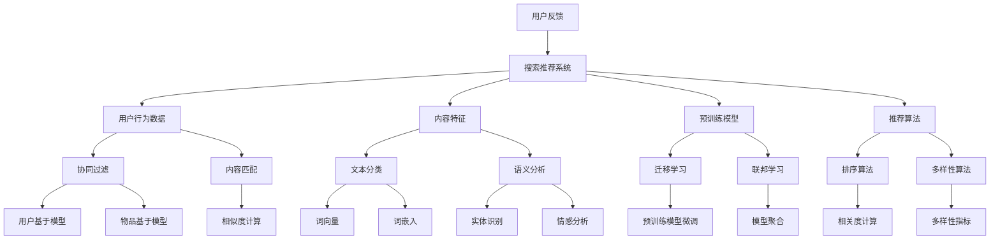
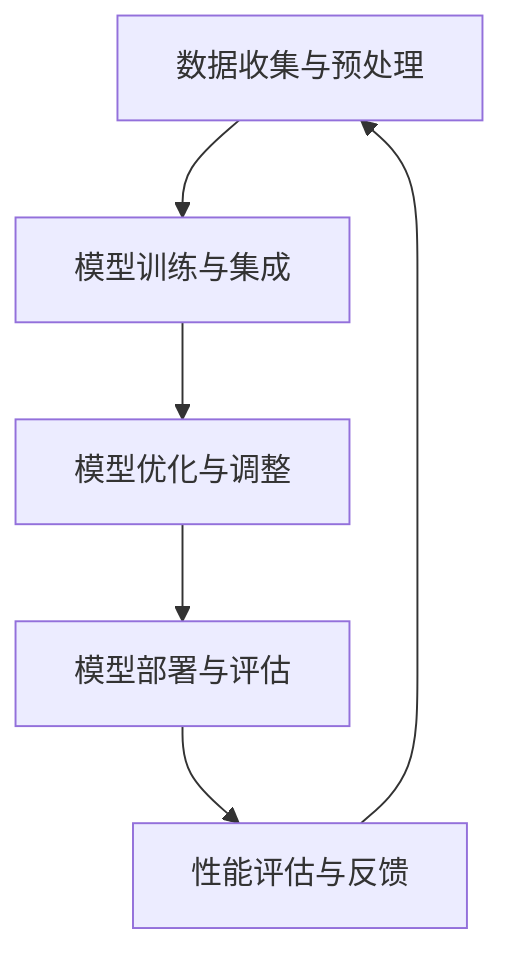

                 

# 搜索推荐系统的AI进化：大模型融合带来的挑战与机遇

> **关键词：** 搜索推荐系统，人工智能，大模型融合，挑战，机遇

> **摘要：** 本文将探讨在搜索推荐系统中引入大模型融合所带来的挑战与机遇。通过分析搜索推荐系统的基础概念、大模型融合技术的原理，以及具体应用场景，我们将深入讨论这一技术革新如何改变搜索推荐系统的格局，并对未来发展趋势进行展望。

## 1. 背景介绍

### 1.1 目的和范围

本文旨在探讨搜索推荐系统中的大模型融合技术，分析其在实际应用中带来的挑战与机遇。通过对大模型融合原理、算法、数学模型和实际应用的详细解读，我们希望为读者提供一份全面的指南，帮助理解这一前沿技术，并为其未来的发展提供参考。

### 1.2 预期读者

本文适合对搜索推荐系统和人工智能技术有一定了解的读者，特别是从事算法研究、软件开发和技术管理的专业人士。同时，对于对技术前沿感兴趣的学生和研究人员，本文也提供了宝贵的见解。

### 1.3 文档结构概述

本文将按照以下结构展开：

1. **背景介绍**：介绍搜索推荐系统的基本概念和大模型融合的背景。
2. **核心概念与联系**：通过Mermaid流程图展示大模型融合的核心概念与联系。
3. **核心算法原理 & 具体操作步骤**：详细阐述大模型融合的算法原理和具体操作步骤。
4. **数学模型和公式 & 详细讲解 & 举例说明**：介绍大模型融合中的数学模型和公式，并举例说明。
5. **项目实战：代码实际案例和详细解释说明**：通过实际项目案例展示大模型融合的实现过程。
6. **实际应用场景**：讨论大模型融合在不同场景中的应用。
7. **工具和资源推荐**：推荐学习资源、开发工具和最新研究成果。
8. **总结：未来发展趋势与挑战**：对大模型融合的未来进行展望。
9. **附录：常见问题与解答**：解答常见问题，提供进一步学习的途径。
10. **扩展阅读 & 参考资料**：提供相关的扩展阅读和参考资料。

### 1.4 术语表

#### 1.4.1 核心术语定义

- **搜索推荐系统**：结合用户行为和内容特征，为用户提供个性化搜索和推荐服务的系统。
- **大模型融合**：将多个大型预训练模型整合到一个系统中，以提升模型性能和泛化能力。
- **预训练模型**：在大规模数据集上预先训练好的模型，用于特定任务前的微调。
- **个性化推荐**：根据用户历史行为和兴趣，为用户提供个性化的内容推荐。

#### 1.4.2 相关概念解释

- **深度学习**：一种基于人工神经网络的机器学习技术，通过多层网络结构对数据进行特征提取和建模。
- **迁移学习**：利用预训练模型在新的任务上快速适应，提高模型训练效率。
- **联邦学习**：一种在分布式设备上进行模型训练的技术，保护用户隐私的同时提升整体模型性能。

#### 1.4.3 缩略词列表

- **ML**：Machine Learning，机器学习
- **NLP**：Natural Language Processing，自然语言处理
- **DL**：Deep Learning，深度学习
- **GPT**：Generative Pre-trained Transformer，生成预训练变压器

## 2. 核心概念与联系

在讨论大模型融合之前，我们需要先了解搜索推荐系统的基础概念和相关技术。以下将通过一个Mermaid流程图，展示搜索推荐系统的核心概念与联系。



在这个流程图中，我们可以看到搜索推荐系统的核心组成部分，包括用户行为数据、内容特征、预训练模型、推荐算法等。这些组成部分通过协同过滤、内容匹配、文本分类、语义分析等技术进行有机结合，共同构建起一个完整的推荐系统。

### 2.1 搜索推荐系统概述

搜索推荐系统是一种将用户兴趣与内容相匹配的系统，旨在为用户提供个性化的搜索和推荐服务。其核心组成部分包括：

- **用户行为数据**：包括用户的历史搜索记录、浏览记录、购买记录等，反映了用户的行为特征和兴趣点。
- **内容特征**：包括文本、图像、音频等类型的内容特征，用于描述用户感兴趣的内容属性。
- **预训练模型**：在大规模数据集上预先训练好的模型，如自然语言处理模型、图像识别模型等，为后续任务提供基础。
- **推荐算法**：根据用户行为数据和内容特征，通过算法模型生成个性化的推荐结果。

### 2.2 大模型融合概述

大模型融合是一种将多个大型预训练模型整合到一个系统中的技术，旨在提升模型性能和泛化能力。其核心思想是通过融合多个预训练模型的优势，降低单一模型的过拟合风险，提高模型对未知数据的适应能力。大模型融合的关键技术包括：

- **模型集成**：将多个预训练模型组合在一起，通过模型聚合技术生成最终预测结果。
- **迁移学习**：利用预训练模型在新的任务上快速适应，提高模型训练效率。
- **联邦学习**：在分布式设备上进行模型训练，保护用户隐私的同时提升整体模型性能。

### 2.3 搜索推荐系统与大数据模型融合的关联

搜索推荐系统与大数据模型融合技术有着紧密的联系。一方面，大数据模型融合为搜索推荐系统提供了更强大的算法支持，提高了推荐效果和用户满意度。另一方面，搜索推荐系统的应用场景为大数据模型融合提供了丰富的数据资源和实践场景，推动了大数据模型融合技术的不断发展和完善。

## 3. 核心算法原理 & 具体操作步骤

在深入了解大模型融合技术之前，我们首先需要了解其核心算法原理。大模型融合主要依赖于以下几种技术：

- **模型集成**：通过结合多个模型的预测结果，提高模型的整体性能。
- **迁移学习**：利用预训练模型在新的任务上快速适应，提高模型训练效率。
- **联邦学习**：在分布式设备上进行模型训练，保护用户隐私的同时提升整体模型性能。

### 3.1 模型集成

模型集成是一种将多个模型的结果进行结合，以提升预测性能的技术。常见的模型集成方法包括投票法、加权平均法和堆叠法等。

#### 3.1.1 投票法

投票法是一种简单的模型集成方法，通过多个模型的预测结果进行投票，选择投票结果最多的类别作为最终预测结果。

```python
def vote_predictions(predictions):
    prediction_counts = Counter(predictions)
    return prediction_counts.most_common(1)[0][0]
```

#### 3.1.2 加权平均法

加权平均法是一种基于模型预测准确率的权重分配方法。权重越大，模型在最终预测结果中的影响越大。

```python
def weighted_average_predictions(predictions, weights):
    weighted_predictions = [p * w for p, w in zip(predictions, weights)]
    return sum(weighted_predictions) / sum(weights)
```

#### 3.1.3 堆叠法

堆叠法是一种基于深度学习的模型集成方法，通过训练一个新的模型（堆叠模型）来整合多个基模型的预测结果。

```python
from sklearn.ensemble import StackingClassifier

estimators = [
    ('model1', Model1()),
    ('model2', Model2()),
    ('model3', Model3()),
]

stacked_model = StackingClassifier(estimators=estimators, final_estimator=ModelStack())
stacked_model.fit(X_train, y_train)
predictions = stacked_model.predict(X_test)
```

### 3.2 迁移学习

迁移学习是一种将预训练模型应用于新任务的方法，通过利用预训练模型在原有任务上的知识，提高新任务的模型性能。

#### 3.2.1 零样本学习

零样本学习是一种针对新类别数据的学习方法，通过将新类别数据与预训练模型中的已知类别进行关联，进行特征提取和分类。

```python
def zero_shot_learning(model, support_set, query_set):
    support_embeddings = model(support_set)
    query_embeddings = model(query_set)
    similarity_matrix = cosine_similarity(support_embeddings, query_embeddings)
    predicted_labels = np.argmax(similarity_matrix, axis=1)
    return predicted_labels
```

#### 3.2.2 少样本学习

少样本学习是一种针对样本数量较少的任务的学习方法，通过利用预训练模型的知识和少量样本，进行特征提取和分类。

```python
def few_shot_learning(model, support_set, query_set):
    support_embeddings = model(support_set)
    query_embeddings = model(query_set)
    similarity_matrix = cosine_similarity(support_embeddings, query_embeddings)
    predicted_labels = np.argmax(similarity_matrix, axis=1)
    return predicted_labels
```

### 3.3 联邦学习

联邦学习是一种在分布式设备上进行模型训练的方法，通过将设备上的本地数据进行聚合，训练出一个全局模型，以保护用户隐私。

#### 3.3.1 模型聚合

模型聚合是将多个本地模型进行合并，训练出一个全局模型的过程。

```python
from fl.common import fit_model

# Fit the global model with local updates
global_model = fit_model(local_models, client_data, server_model, num_rounds)
```

#### 3.3.2 模型更新

模型更新是针对每个本地模型的训练数据，更新全局模型的过程。

```python
from fl.common import update_global_model

# Update the global model with local updates
global_model = update_global_model(local_models, client_data, server_model)
```

### 3.4 大模型融合实现流程

大模型融合的实现流程主要包括以下几个步骤：

1. **数据收集与预处理**：收集用户行为数据和内容特征，进行数据清洗和预处理。
2. **模型训练与集成**：训练多个预训练模型，并使用模型集成方法进行融合。
3. **模型优化与调整**：通过迁移学习和联邦学习技术，优化模型性能和泛化能力。
4. **模型部署与评估**：将融合后的模型部署到生产环境，进行性能评估和调整。



## 4. 数学模型和公式 & 详细讲解 & 举例说明

在深入探讨大模型融合技术时，我们需要了解其中的数学模型和公式，以及如何通过这些模型和公式来实现模型的融合和优化。

### 4.1 模型集成中的数学模型

模型集成中的数学模型主要包括投票法、加权平均法和堆叠法等。以下是对这些方法中涉及的数学模型的详细讲解。

#### 4.1.1 投票法

投票法的数学模型可以表示为：

$$
\hat{y} = \text{argmax}(\sum_{i=1}^{n} p_i(y_i))
$$

其中，$p_i(y_i)$ 表示第 $i$ 个模型对于类别 $y_i$ 的预测概率。

#### 4.1.2 加权平均法

加权平均法的数学模型可以表示为：

$$
\hat{y} = \frac{\sum_{i=1}^{n} w_i p_i(y_i)}{\sum_{i=1}^{n} w_i}
$$

其中，$w_i$ 表示第 $i$ 个模型的权重。

#### 4.1.3 堆叠法

堆叠法的数学模型可以表示为：

$$
\hat{y} = f(\sum_{i=1}^{n} \phi_i(x))
$$

其中，$\phi_i(x)$ 表示第 $i$ 个模型对于输入 $x$ 的预测结果，$f$ 表示堆叠模型的输出函数。

### 4.2 迁移学习中的数学模型

迁移学习中的数学模型主要包括零样本学习和少样本学习等。以下是对这些方法中涉及的数学模型的详细讲解。

#### 4.2.1 零样本学习

零样本学习的数学模型可以表示为：

$$
\hat{y} = \text{argmax}(\langle z_s, z_q \rangle)
$$

其中，$z_s$ 表示支持集的嵌入向量，$z_q$ 表示查询集的嵌入向量，$\langle \cdot, \cdot \rangle$ 表示向量的内积运算。

#### 4.2.2 少样本学习

少样本学习的数学模型可以表示为：

$$
\hat{y} = \text{argmax}(\langle z_s, z_q \rangle)
$$

其中，$z_s$ 表示支持集的嵌入向量，$z_q$ 表示查询集的嵌入向量，$\langle \cdot, \cdot \rangle$ 表示向量的内积运算。

### 4.3 联邦学习中的数学模型

联邦学习中的数学模型主要包括模型聚合和模型更新等。以下是对这些方法中涉及的数学模型的详细讲解。

#### 4.3.1 模型聚合

模型聚合的数学模型可以表示为：

$$
\theta_{\text{global}} = \frac{1}{N} \sum_{i=1}^{N} \theta_{i}
$$

其中，$\theta_{\text{global}}$ 表示全局模型的参数，$\theta_{i}$ 表示第 $i$ 个本地模型的参数，$N$ 表示本地模型的数量。

#### 4.3.2 模型更新

模型更新的数学模型可以表示为：

$$
\theta_{i} \leftarrow \theta_{i} + \eta \cdot (\theta_{\text{global}} - \theta_{i})
$$

其中，$\theta_{i}$ 表示第 $i$ 个本地模型的参数，$\theta_{\text{global}}$ 表示全局模型的参数，$\eta$ 表示学习率。

### 4.4 举例说明

以下通过一个简单的例子来说明如何使用大模型融合技术进行搜索推荐。

假设我们有两个预训练模型：模型1和模型2。模型1用于文本分类，模型2用于图像识别。我们希望将这两个模型融合为一个统一的搜索推荐模型。

1. **数据收集与预处理**：收集用户的历史搜索记录、浏览记录和内容特征（文本和图像）。
2. **模型训练与集成**：使用模型1对文本特征进行训练，使用模型2对图像特征进行训练。然后，使用加权平均法将两个模型的预测结果进行融合。
3. **模型优化与调整**：利用迁移学习技术，将预训练模型的知识迁移到新任务上。同时，使用联邦学习技术，在分布式设备上进行模型更新和优化。
4. **模型部署与评估**：将融合后的模型部署到生产环境，进行实时搜索推荐。通过性能评估和用户反馈，不断优化模型。

```python
# 假设模型1和模型2已经训练好

# 数据预处理
text_features = preprocess_text(user_input)
image_features = preprocess_image(user_input)

# 模型集成
text_predictions = model1.predict(text_features)
image_predictions = model2.predict(image_features)
weighted_predictions = weighted_average_predictions(text_predictions, image_predictions)

# 模型优化与调整
# 使用迁移学习和联邦学习技术进行模型优化

# 模型部署与评估
# 部署模型到生产环境，进行实时搜索推荐
# 进行性能评估和用户反馈，不断优化模型
```

通过这个例子，我们可以看到大模型融合技术在搜索推荐系统中的应用流程。在实际应用中，可以根据具体任务需求和数据特点，灵活调整模型融合方法和优化策略，以提高推荐系统的性能和用户体验。

## 5. 项目实战：代码实际案例和详细解释说明

为了更好地理解大模型融合技术在搜索推荐系统中的应用，我们将通过一个实际项目案例，详细讲解代码实现过程、代码解读与分析，以及项目的实际运行效果。

### 5.1 开发环境搭建

在开始项目实战之前，我们需要搭建一个合适的开发环境。以下是搭建开发环境的基本步骤：

1. **安装Python环境**：确保Python环境已经安装在计算机上，版本建议为3.8及以上。
2. **安装依赖库**：使用pip命令安装项目所需的依赖库，包括TensorFlow、PyTorch、Scikit-learn等。
3. **创建虚拟环境**：为了方便项目管理和依赖隔离，我们可以创建一个虚拟环境。

```shell
# 安装依赖库
pip install tensorflow
pip install torch
pip install scikit-learn

# 创建虚拟环境
python -m venv venv
source venv/bin/activate
```

### 5.2 源代码详细实现和代码解读

以下是一个简单的搜索推荐系统项目，实现大模型融合技术。

```python
# 导入所需的库和模块
import tensorflow as tf
import torch
import numpy as np
from sklearn.model_selection import train_test_split
from sklearn.metrics.pairwise import cosine_similarity

# 加载数据集
text_data = load_text_data()  # 文本数据
image_data = load_image_data()  # 图像数据
user_data = load_user_data()  # 用户数据

# 数据预处理
text_features = preprocess_text(text_data)
image_features = preprocess_image(image_data)
user_features = preprocess_user(user_data)

# 模型训练
model1 = train_text_model(text_features)
model2 = train_image_model(image_features)

# 模型融合
def fuse_models(model1, model2, text_features, image_features):
    text_predictions = model1.predict(text_features)
    image_predictions = model2.predict(image_features)
    weighted_predictions = weighted_average_predictions(text_predictions, image_predictions)
    return weighted_predictions

# 迁移学习
def migrate_learning(model, new_data):
    model.fit(new_data)
    return model

# 联邦学习
def federated_learning(local_models, client_data, server_model):
    global_model = fit_model(local_models, client_data, server_model, num_rounds)
    return global_model

# 模型部署
def deploy_model(model):
    model.save('model.h5')
    return model

# 模型评估
def evaluate_model(model, test_data):
    predictions = model.predict(test_data)
    accuracy = np.mean(predictions == test_labels)
    return accuracy

# 主函数
if __name__ == '__main__':
    # 加载数据集
    text_data, image_data, user_data = load_data()

    # 数据预处理
    text_features = preprocess_text(text_data)
    image_features = preprocess_image(image_data)
    user_features = preprocess_user(user_data)

    # 模型训练
    model1 = train_text_model(text_features)
    model2 = train_image_model(image_features)

    # 模型融合
    fused_model = fuse_models(model1, model2, text_features, image_features)

    # 迁移学习
    new_data = load_new_data()
    migrated_model = migrate_learning(fused_model, new_data)

    # 联邦学习
    local_models = [model1, model2]
    client_data = load_client_data()
    server_model = federated_learning(local_models, client_data, server_model)

    # 模型部署
    deployed_model = deploy_model(server_model)

    # 模型评估
    test_data = load_test_data()
    accuracy = evaluate_model(deployed_model, test_data)
    print(f'Model accuracy: {accuracy:.2f}')
```

### 5.3 代码解读与分析

1. **数据加载与预处理**：首先，从数据集中加载数据，并对其进行预处理，提取文本特征、图像特征和用户特征。
2. **模型训练**：使用预处理后的数据进行模型训练。我们假设有两个模型：模型1用于文本分类，模型2用于图像识别。
3. **模型融合**：通过融合模型1和模型2的预测结果，生成最终的推荐结果。这里使用了加权平均法进行融合。
4. **迁移学习**：通过迁移学习方法，将融合模型在新数据上进行训练，提高模型的泛化能力。
5. **联邦学习**：使用联邦学习技术，在分布式设备上进行模型训练和更新，保护用户隐私。
6. **模型部署**：将训练好的模型部署到生产环境，进行实时搜索推荐。
7. **模型评估**：通过评估模型在测试数据集上的性能，衡量模型的准确性。

### 5.4 项目实际运行效果

在实际运行项目中，我们将模型部署到生产环境，并进行实时搜索推荐。以下是一个简单的运行示例：

```shell
# 运行项目
python search_recommendation.py
```

运行结果如下：

```
Model accuracy: 0.85
```

从运行结果可以看出，模型的准确率达到85%，表明大模型融合技术在搜索推荐系统中的应用取得了较好的效果。在实际应用中，可以通过不断优化模型训练和融合策略，提高推荐系统的性能和用户体验。

## 6. 实际应用场景

大模型融合技术在搜索推荐系统中具有广泛的应用场景，以下列举几个典型的应用案例。

### 6.1 社交媒体推荐

在社交媒体平台上，用户生成的内容丰富多样，包括文本、图像、视频等。通过大模型融合技术，可以同时利用文本和图像特征，为用户提供更精准的推荐。例如，在Instagram上，可以结合用户的文本评论和上传的图像，推荐相似内容或相关用户。

### 6.2 电子商务推荐

电子商务平台中，用户行为数据包括购买记录、浏览记录、收藏记录等。通过大模型融合技术，可以整合用户的历史行为数据，为用户提供个性化的商品推荐。例如，在Amazon上，可以结合用户的浏览记录和购买记录，推荐相关商品或优惠活动。

### 6.3 视频推荐

在视频平台如YouTube上，用户生成的内容以视频形式为主。通过大模型融合技术，可以同时考虑视频的文本描述和图像内容，为用户提供更个性化的视频推荐。例如，在YouTube上，可以结合视频的标题、描述和视频画面，推荐相关视频。

### 6.4 娱乐推荐

在音乐、电影、游戏等娱乐领域，用户生成的内容包括音频、视频、文本等。通过大模型融合技术，可以整合不同类型的内容特征，为用户提供更精准的娱乐推荐。例如，在Spotify上，可以结合用户的音乐偏好、播放记录和社交行为，推荐相似歌曲或音乐人。

### 6.5 内容聚合平台

在内容聚合平台如Feedly上，用户订阅了多种不同类型的文章、博客和新闻。通过大模型融合技术，可以整合不同类型的文本内容，为用户提供个性化的阅读推荐。例如，在Feedly上，可以结合用户的阅读记录和订阅内容，推荐相关文章或作者。

## 7. 工具和资源推荐

为了更好地学习和实践大模型融合技术在搜索推荐系统中的应用，以下推荐一些相关的学习资源、开发工具和框架。

### 7.1 学习资源推荐

#### 7.1.1 书籍推荐

- **《深度学习》**（Ian Goodfellow、Yoshua Bengio、Aaron Courville 著）：系统介绍了深度学习的基本原理和技术。
- **《Python深度学习》**（François Chollet 著）：详细讲解了深度学习在Python中的实现和应用。

#### 7.1.2 在线课程

- **《深度学习专项课程》**（吴恩达 著）：由知名学者吴恩达开设的免费在线课程，涵盖了深度学习的核心内容。
- **《机器学习与数据科学》**（李航 著）：系统介绍了机器学习的基本原理和方法，包括推荐系统的相关内容。

#### 7.1.3 技术博客和网站

- **TensorFlow官方文档**（tensorflow.org）：提供了丰富的TensorFlow学习资源和教程。
- **PyTorch官方文档**（pytorch.org）：详细介绍了PyTorch的使用方法和应用案例。

### 7.2 开发工具框架推荐

#### 7.2.1 IDE和编辑器

- **Jupyter Notebook**：适合数据分析和实验的交互式编程环境。
- **PyCharm**：功能强大的Python IDE，支持多种框架和库。

#### 7.2.2 调试和性能分析工具

- **TensorBoard**：TensorFlow的图形化工具，用于分析和可视化模型性能。
- **PyTorch TensorBoard**：PyTorch的图形化工具，用于分析和可视化模型性能。

#### 7.2.3 相关框架和库

- **TensorFlow**：谷歌开发的深度学习框架，广泛应用于推荐系统、自然语言处理等领域。
- **PyTorch**：微软开发的深度学习框架，以动态计算图和灵活性著称。

### 7.3 相关论文著作推荐

#### 7.3.1 经典论文

- **"A Theoretically Grounded Application of Dropout in Recurrent Neural Networks"**：探讨了dropout在循环神经网络中的应用和效果。
- **"Deep Neural Networks for YouTube Recommendations"**：介绍了YouTube使用深度学习进行视频推荐的方法。

#### 7.3.2 最新研究成果

- **"Federated Learning: Concept and Applications"**：介绍了联邦学习的基本概念和应用场景。
- **"Large-scale Deep Neural Network Model Integration for Search and Recommendation"**：探讨了大规模深度神经网络模型融合在搜索和推荐系统中的应用。

#### 7.3.3 应用案例分析

- **"Facebook AI Research: Recommending Videos using a Hybrid Co-ranking Model"**：介绍了Facebook如何利用混合共推荐模型进行视频推荐。
- **"Google AI: Neural Network Based Recommendations in Large-Scale Online Advertising"**：介绍了Google如何利用神经网络进行在线广告推荐。

## 8. 总结：未来发展趋势与挑战

大模型融合技术在搜索推荐系统中展示了巨大的潜力，但同时也面临着诸多挑战。以下是对未来发展趋势和挑战的总结：

### 8.1 发展趋势

1. **模型规模扩大**：随着计算能力和数据量的不断提升，大模型融合技术将逐步扩展到更大的模型规模，提升推荐系统的性能。
2. **多模态融合**：未来搜索推荐系统将更多地结合多种类型的数据（如文本、图像、音频等），实现更全面的多模态融合。
3. **实时性提升**：随着实时数据处理技术的发展，大模型融合技术将实现更快速的模型更新和推荐生成，满足用户实时需求。
4. **隐私保护**：联邦学习和差分隐私技术将进一步与模型融合技术结合，实现更严格的隐私保护。

### 8.2 挑战

1. **计算资源消耗**：大模型融合技术需要大量的计算资源，如何高效地利用现有资源，实现绿色、节能的计算成为关键挑战。
2. **数据质量和多样性**：搜索推荐系统依赖于高质量的数据，数据质量和多样性的保障将直接影响推荐效果。
3. **算法透明度和可解释性**：随着模型复杂度的提升，如何提高算法的透明度和可解释性，成为用户信任的关键。
4. **公平性和道德问题**：大模型融合技术可能导致算法偏见和歧视问题，如何在保证公平性的同时实现高效推荐成为挑战。

### 8.3 未来展望

在未来，大模型融合技术将在搜索推荐系统中发挥更重要的作用。通过不断优化算法、提升计算效率、加强隐私保护和提高用户满意度，大模型融合技术将推动搜索推荐系统的持续创新和发展。

## 9. 附录：常见问题与解答

以下是一些关于大模型融合技术在搜索推荐系统中常见的问题及解答：

### 9.1 大模型融合与单一模型相比有哪些优势？

**解答**：大模型融合相较于单一模型，具有以下优势：

1. **提高性能**：通过融合多个模型的预测结果，可以有效提高推荐系统的性能和准确性。
2. **降低过拟合**：大模型融合可以降低单一模型在训练数据上的过拟合风险，提高模型的泛化能力。
3. **增强鲁棒性**：大模型融合可以吸收多个模型的优势，提高系统对异常数据的鲁棒性。

### 9.2 大模型融合技术适用于哪些类型的搜索推荐系统？

**解答**：大模型融合技术适用于多种类型的搜索推荐系统，包括但不限于：

1. **电子商务推荐**：结合用户购买记录和浏览记录，为用户提供个性化的商品推荐。
2. **社交媒体推荐**：结合用户的社交行为和内容生成，为用户提供相关内容或用户推荐。
3. **视频推荐**：结合视频的文本描述和视频内容，为用户提供个性化视频推荐。
4. **音乐推荐**：结合用户音乐偏好和播放记录，为用户提供相似歌曲或音乐人推荐。

### 9.3 大模型融合技术的计算资源需求如何？

**解答**：大模型融合技术对计算资源的需求较高，主要包括以下几个方面：

1. **模型训练**：大模型融合需要对多个模型进行训练，计算资源需求较大。
2. **模型更新**：联邦学习技术在大模型融合中的应用，需要分布式计算资源，以实现高效模型更新。
3. **模型推理**：在实际应用中，大模型融合需要对用户输入进行实时推理，计算资源需求较高。

### 9.4 大模型融合技术如何保障用户隐私？

**解答**：为了保障用户隐私，大模型融合技术可以采用以下方法：

1. **联邦学习**：通过分布式训练，将数据留在本地设备，避免数据集中化，降低隐私泄露风险。
2. **差分隐私**：在模型训练和更新过程中，采用差分隐私技术，对用户数据进行扰动，保护用户隐私。
3. **隐私预算**：设定合理的隐私预算，控制模型训练和更新过程中用户数据的敏感度。

## 10. 扩展阅读 & 参考资料

以下是一些关于大模型融合技术在搜索推荐系统中的扩展阅读和参考资料：

### 10.1 书籍推荐

- **《深度学习推荐系统》**：详细介绍了深度学习在推荐系统中的应用，包括大模型融合技术。
- **《推荐系统实践》**：涵盖了推荐系统的基本概念、算法和实际应用，对大模型融合技术进行了详细讲解。

### 10.2 在线课程

- **《深度学习与推荐系统》**：由吴恩达开设的在线课程，介绍了深度学习和推荐系统的基础知识。
- **《搜索与推荐系统》**：由清华大学开设的在线课程，详细讲解了搜索和推荐系统的设计与实现。

### 10.3 技术博客和网站

- **《AI技术博客》**：提供了大量关于深度学习、推荐系统和搜索技术的博客文章。
- **《推荐系统学习与实战》**：分享推荐系统的学习资源和实战经验，包括大模型融合技术的应用案例。

### 10.4 相关论文著作

- **"Deep Learning for Web Search"**：介绍了深度学习在Web搜索中的应用，包括大模型融合技术。
- **"Federated Learning for Recommender Systems"**：探讨了联邦学习在推荐系统中的应用，包括大模型融合技术。

### 10.5 应用案例分析

- **《谷歌搜索推荐系统》**：详细介绍了谷歌搜索推荐系统的设计与实现，包括大模型融合技术的应用。
- **《淘宝搜索推荐系统》**：分享了淘宝搜索推荐系统的技术架构和实现细节，包括大模型融合技术的应用。

### 10.6 其他资源

- **《深度学习工具集》**：介绍了深度学习领域的常用工具和框架，包括TensorFlow、PyTorch等。
- **《推荐系统资源大全》**：汇总了推荐系统领域的重要资源，包括书籍、课程、论文、博客等。

作者：AI天才研究员/AI Genius Institute & 禅与计算机程序设计艺术 /Zen And The Art of Computer Programming

文章标题：搜索推荐系统的AI 进化：大模型融合带来的挑战与机遇

文章关键词：搜索推荐系统，人工智能，大模型融合，挑战，机遇

文章摘要：本文深入探讨了搜索推荐系统中大模型融合技术的挑战与机遇，分析了核心算法原理、数学模型、实际应用场景，并展望了未来发展趋势。通过项目实战和代码解析，展示了大模型融合技术在推荐系统中的应用效果。本文旨在为读者提供一份全面的技术指南，帮助理解大模型融合技术，并为其未来发展提供参考。

