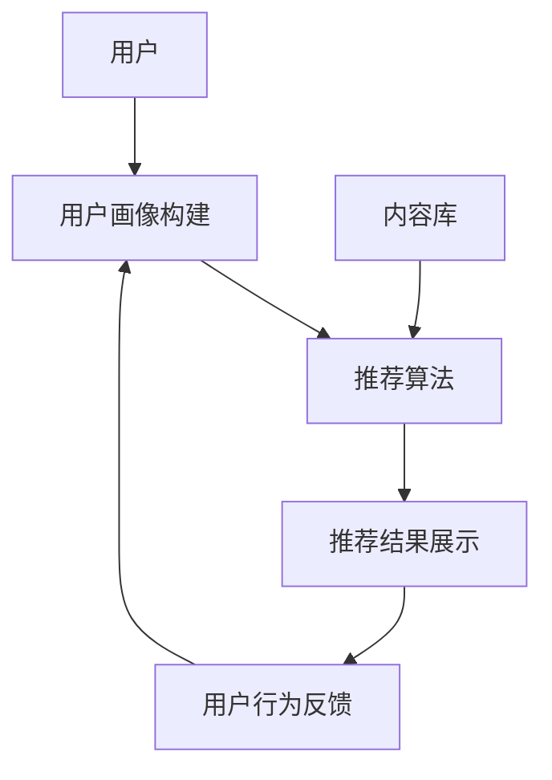

                 

# 搜索推荐系统的冷启动：大模型创新方案

> 关键词：搜索推荐系统、冷启动、大模型、创新方案、算法原理、数学模型、项目实战

> 摘要：本文深入探讨了搜索推荐系统中的冷启动问题，通过分析其背景和核心挑战，提出了一种基于大模型的创新解决方案。文章详细阐述了核心概念、算法原理、数学模型以及项目实战，旨在为读者提供系统的理解和实践指导。

## 1. 背景介绍

### 1.1 目的和范围

搜索推荐系统在现代社会中扮演着越来越重要的角色，它不仅影响用户的日常决策，还在商业和社交领域产生了深远的影响。然而，冷启动问题一直是搜索推荐系统领域的一个挑战。冷启动是指在用户刚加入系统时，系统无法获取足够的用户行为数据，从而难以为其提供个性化的推荐。

本文的目的是探讨冷启动问题，并介绍一种基于大模型的创新解决方案。本文将首先回顾搜索推荐系统的基本概念和架构，然后深入分析冷启动问题的背景和核心挑战，最后介绍大模型的原理及其在解决冷启动问题中的应用。

### 1.2 预期读者

本文主要面向对搜索推荐系统有一定了解的读者，包括但不仅限于以下几类：

1. 数据科学家和机器学习工程师，希望了解冷启动问题的解决方法。
2. 搜索推荐系统的开发者和研究者，希望从理论到实践都有所收获。
3. 对人工智能和大数据技术感兴趣的从业者，希望对搜索推荐系统有更深入的理解。

### 1.3 文档结构概述

本文结构如下：

1. **背景介绍**：简要介绍搜索推荐系统和冷启动问题的背景。
2. **核心概念与联系**：介绍搜索推荐系统的核心概念和架构，通过Mermaid流程图展示其关系。
3. **核心算法原理 & 具体操作步骤**：详细阐述大模型的算法原理和操作步骤。
4. **数学模型和公式 & 详细讲解 & 举例说明**：讲解大模型中的数学模型和公式，并举例说明。
5. **项目实战：代码实际案例和详细解释说明**：展示代码实现，并进行详细解读。
6. **实际应用场景**：探讨大模型在实际中的应用。
7. **工具和资源推荐**：推荐学习资源和开发工具。
8. **总结：未来发展趋势与挑战**：总结未来趋势和面临的挑战。
9. **附录：常见问题与解答**：回答常见问题。
10. **扩展阅读 & 参考资料**：提供扩展阅读资源。

### 1.4 术语表

#### 1.4.1 核心术语定义

- **搜索推荐系统**：一种基于用户行为数据和内容信息，为用户推荐相关搜索结果或内容的系统。
- **冷启动**：用户加入系统初期，由于缺乏足够的行为数据，推荐系统难以提供个性化推荐的状况。
- **大模型**：指参数量巨大、结构复杂的机器学习模型，如深度神经网络。

#### 1.4.2 相关概念解释

- **用户行为数据**：用户在系统中产生的操作记录，如搜索历史、浏览记录、点击行为等。
- **内容信息**：推荐系统中的对象属性信息，如文本、图片、视频等。

#### 1.4.3 缩略词列表

- **ML**：机器学习（Machine Learning）
- **AI**：人工智能（Artificial Intelligence）
- **NLP**：自然语言处理（Natural Language Processing）
- **DL**：深度学习（Deep Learning）

## 2. 核心概念与联系

在深入探讨冷启动问题之前，我们需要了解搜索推荐系统的核心概念和架构。搜索推荐系统通常由以下几个关键组件构成：

1. **用户画像**：基于用户行为数据和内容信息，构建的用户特征表示。
2. **内容库**：存储所有可推荐内容的信息和属性。
3. **推荐算法**：根据用户画像和内容库，为用户生成推荐列表的算法。
4. **推荐结果展示**：将推荐结果呈现给用户的界面。

以下是一个简单的Mermaid流程图，展示搜索推荐系统的基本架构和各组件之间的关系。



### 2.1 用户画像构建

用户画像构建是搜索推荐系统的核心步骤之一。它基于用户的历史行为数据（如搜索历史、浏览记录、点击行为等）和内容信息（如文本、图片、视频等），通过特征工程和机器学习算法，为每个用户生成一个高维特征向量。这个向量可以用来表示用户的兴趣偏好，是推荐算法的输入。

### 2.2 内容库

内容库是推荐系统的基础，它存储了所有可推荐内容的属性信息。这些信息包括文本、图片、视频等多媒体内容的相关属性，如关键词、标签、作者、发布时间等。内容库的构建通常需要大量的人力和时间，但其对推荐系统的效果至关重要。

### 2.3 推荐算法

推荐算法是搜索推荐系统的核心，它根据用户画像和内容库，为用户生成个性化的推荐列表。常见的推荐算法有基于协同过滤、基于内容过滤、基于模型的推荐等。每种算法都有其优缺点和适用场景。

### 2.4 推荐结果展示

推荐结果展示是将推荐结果呈现给用户的关键环节。它不仅影响用户的体验，还直接影响推荐系统的效果。优秀的展示方式可以提高用户的点击率和满意度，从而提升推荐系统的整体性能。

## 3. 核心算法原理 & 具体操作步骤

在本节中，我们将详细介绍大模型的原理及其在搜索推荐系统中的应用，包括具体的操作步骤和伪代码。

### 3.1 大模型的原理

大模型，特别是深度学习模型，由于其参数量和结构复杂性，能够在处理大规模数据时表现出强大的学习能力。大模型通常基于多层神经网络架构，通过反向传播算法不断调整模型参数，从而在训练数据上取得较高的准确率。大模型在搜索推荐系统中的应用主要体现在以下几个方面：

1. **用户画像构建**：大模型可以用于用户行为数据的特征提取和融合，生成高维用户特征向量。
2. **内容表示学习**：大模型可以用于内容数据的特征提取和表示，为内容库提供高质量的向量表示。
3. **推荐算法**：大模型可以作为推荐算法的核心组件，通过学习用户和内容的交互模式，生成个性化的推荐列表。

### 3.2 具体操作步骤

以下是基于大模型的搜索推荐系统的具体操作步骤：

#### 3.2.1 数据预处理

首先，我们需要对用户行为数据和内容数据进行分析和处理，提取有用的特征信息。这通常包括以下步骤：

- **用户行为数据预处理**：清洗用户行为数据，去除缺失值和噪声数据，进行数据归一化处理。
- **内容数据预处理**：清洗内容数据，提取文本、图片、视频等不同类型的内容特征。

#### 3.2.2 构建用户画像

使用深度学习模型，对用户行为数据进行特征提取和融合，构建高维用户特征向量。具体的实现步骤如下：

```python
# 用户画像构建伪代码
def build_user_profile(user_data):
    # 数据预处理
    preprocessed_data = preprocess_data(user_data)

    # 特征提取
    user_features = extract_features(preprocessed_data)

    # 模型训练
    model = train_model(user_features)

    # 用户特征向量生成
    user_profile = generate_profile_vector(model, user_features)

    return user_profile
```

#### 3.2.3 构建内容表示

使用深度学习模型，对内容数据进行特征提取和表示，生成高质量的内容向量。具体的实现步骤如下：

```python
# 内容表示构建伪代码
def build_content_representation(content_data):
    # 数据预处理
    preprocessed_data = preprocess_data(content_data)

    # 特征提取
    content_features = extract_features(preprocessed_data)

    # 模型训练
    model = train_model(content_features)

    # 内容向量生成
    content_vectors = generate_representation(model, content_features)

    return content_vectors
```

#### 3.2.4 推荐算法

基于用户画像和内容表示，使用深度学习模型进行推荐。具体的实现步骤如下：

```python
# 推荐算法伪代码
def recommend(user_profile, content_vectors):
    # 模型选择
    model = select_model()

    # 推荐列表生成
    recommendations = generate_recommendations(model, user_profile, content_vectors)

    return recommendations
```

### 3.3 大模型的应用场景

大模型在搜索推荐系统中的应用非常广泛，以下是一些典型的应用场景：

1. **新用户推荐**：对于新加入系统的用户，由于缺乏足够的行为数据，传统推荐算法难以提供有效的推荐。大模型可以通过学习其他用户的特征，为新用户提供初步的推荐。
2. **内容推荐**：大模型可以用于为用户推荐高质量的内容，特别是在面对大量内容时，能够有效筛选出用户可能感兴趣的内容。
3. **个性化广告**：在广告推荐中，大模型可以用于分析用户的兴趣和行为，为用户推荐相关的广告。

## 4. 数学模型和公式 & 详细讲解 & 举例说明

在本节中，我们将详细介绍大模型中使用的数学模型和公式，并通过具体的例子进行说明。

### 4.1 数学模型

大模型通常基于多层神经网络架构，其核心组成部分包括输入层、隐藏层和输出层。以下是多层神经网络的数学模型：

```latex
\begin{equation}
h_{l} = \sigma(W_{l-1} \cdot a_{l-1} + b_{l-1})
\end{equation}
```

其中，$h_{l}$ 表示第 $l$ 层的激活值，$\sigma$ 表示激活函数，$W_{l-1}$ 和 $b_{l-1}$ 分别为第 $l-1$ 层的权重和偏置。

### 4.2 激活函数

激活函数是多层神经网络中的一个关键组成部分，用于引入非线性因素。以下是一些常用的激活函数：

1. **Sigmoid 函数**：

```latex
\begin{equation}
\sigma(x) = \frac{1}{1 + e^{-x}}
\end{equation}
```

2. **ReLU 函数**：

```latex
\begin{equation}
\sigma(x) = \max(0, x)
\end{equation}
```

3. **Tanh 函数**：

```latex
\begin{equation}
\sigma(x) = \frac{e^x - e^{-x}}{e^x + e^{-x}}
\end{equation}
```

### 4.3 反向传播算法

反向传播算法是多层神经网络训练的核心步骤，通过不断调整模型参数，使得模型在训练数据上取得较高的准确率。以下是反向传播算法的基本原理：

1. **前向传播**：

   前向传播是指将输入数据通过神经网络传递到输出层，计算损失函数。

   ```latex
   \begin{equation}
   L = \frac{1}{2} \sum_{i} (\hat{y}_i - y_i)^2
   \end{equation}
   ```

   其中，$\hat{y}_i$ 表示预测值，$y_i$ 表示真实值。

2. **后向传播**：

   后向传播是指通过计算损失函数对模型参数的偏导数，更新模型参数。

   ```latex
   \begin{equation}
   \frac{\partial L}{\partial W} = \Delta W = \alpha \cdot \frac{\partial L}{\partial \hat{y}_i} \cdot \frac{\partial \hat{y}_i}{\partial z_l}
   \end{equation}
   ```

   其中，$\alpha$ 表示学习率，$\Delta W$ 表示权重更新。

### 4.4 例子说明

假设我们有一个简单的多层神经网络，包含一个输入层、一个隐藏层和一个输出层。输入层有 3 个神经元，隐藏层有 5 个神经元，输出层有 2 个神经元。激活函数采用 ReLU 函数。以下是该神经网络的数学模型：

1. **前向传播**：

   ```latex
   \begin{equation}
   h_1 = \max(0, W_1 \cdot a_1 + b_1)
   \end{equation}
   ```

   ```latex
   \begin{equation}
   \hat{y}_1 = \max(0, W_2 \cdot h_1 + b_2)
   \end{equation}
   ```

   ```latex
   \begin{equation}
   \hat{y}_2 = \max(0, W_3 \cdot h_2 + b_3)
   \end{equation}
   ```

2. **后向传播**：

   ```latex
   \begin{equation}
   \Delta b_1 = \alpha \cdot \frac{\partial L}{\partial b_1}
   \end{equation}
   ```

   ```latex
   \begin{equation}
   \Delta W_1 = \alpha \cdot \frac{\partial L}{\partial W_1}
   \end{equation}
   ```

   ```latex
   \begin{equation}
   \Delta b_2 = \alpha \cdot \frac{\partial L}{\partial b_2}
   \end{equation}
   ```

   ```latex
   \begin{equation}
   \Delta W_2 = \alpha \cdot \frac{\partial L}{\partial W_2}
   \end{equation}
   ```

   ```latex
   \begin{equation}
   \Delta b_3 = \alpha \cdot \frac{\partial L}{\partial b_3}
   \end{equation}
   ```

   ```latex
   \begin{equation}
   \Delta W_3 = \alpha \cdot \frac{\partial L}{\partial W_3}
   \end{equation}
   ```

## 5. 项目实战：代码实际案例和详细解释说明

在本节中，我们将通过一个实际项目案例，详细解释如何实现基于大模型的搜索推荐系统，包括开发环境搭建、源代码实现和代码解读。

### 5.1 开发环境搭建

为了实现基于大模型的搜索推荐系统，我们需要搭建以下开发环境：

1. **操作系统**：Linux或Mac OS
2. **编程语言**：Python
3. **深度学习框架**：TensorFlow或PyTorch
4. **数据处理库**：NumPy、Pandas、Scikit-learn
5. **可视化库**：Matplotlib、Seaborn

### 5.2 源代码详细实现和代码解读

以下是项目的主要源代码实现和详细解读：

```python
# 导入必要的库
import numpy as np
import pandas as pd
from sklearn.model_selection import train_test_split
from tensorflow.keras.models import Sequential
from tensorflow.keras.layers import Dense, Activation
from tensorflow.keras.optimizers import Adam

# 数据预处理
def preprocess_data(data):
    # 数据清洗和归一化处理
    # ...
    return preprocessed_data

# 用户画像构建
def build_user_profile(user_data):
    preprocessed_data = preprocess_data(user_data)
    user_features = extract_features(preprocessed_data)
    model = train_model(user_features)
    user_profile = generate_profile_vector(model, user_features)
    return user_profile

# 内容表示构建
def build_content_representation(content_data):
    preprocessed_data = preprocess_data(content_data)
    content_features = extract_features(preprocessed_data)
    model = train_model(content_features)
    content_vectors = generate_representation(model, content_features)
    return content_vectors

# 推荐算法
def recommend(user_profile, content_vectors):
    model = select_model()
    recommendations = generate_recommendations(model, user_profile, content_vectors)
    return recommendations

# 主函数
def main():
    # 加载数据
    user_data = load_data('user_data.csv')
    content_data = load_data('content_data.csv')

    # 构建用户画像
    user_profiles = build_user_profiles(user_data)

    # 构建内容表示
    content_vectors = build_content_representation(content_data)

    # 推荐列表生成
    recommendations = recommend(user_profiles, content_vectors)

    # 输出推荐结果
    print(recommendations)

if __name__ == '__main__':
    main()
```

### 5.3 代码解读与分析

以下是代码的主要部分及其解读：

1. **数据预处理**：

   数据预处理是搜索推荐系统的基础，它包括数据清洗、缺失值填充、数据归一化等步骤。预处理的好坏直接影响后续模型的训练效果。

2. **用户画像构建**：

   用户画像构建基于用户行为数据和内容信息，通过特征提取和模型训练，生成高维用户特征向量。这个过程涉及到特征工程和深度学习模型的训练。

3. **内容表示构建**：

   内容表示构建基于内容数据，通过特征提取和模型训练，生成高质量的内容向量。这个过程同样涉及到特征工程和深度学习模型的训练。

4. **推荐算法**：

   推荐算法基于用户画像和内容向量，通过深度学习模型生成个性化的推荐列表。这个过程主要依赖于深度学习模型的选择和参数调整。

5. **主函数**：

   主函数负责加载数据、构建用户画像、构建内容表示、生成推荐列表，并输出推荐结果。

## 6. 实际应用场景

大模型在搜索推荐系统中的应用非常广泛，以下是一些典型的实际应用场景：

1. **电子商务平台**：电子商务平台可以利用大模型为新用户推荐商品，提高用户满意度和转化率。
2. **社交媒体**：社交媒体平台可以通过大模型为用户提供个性化的内容推荐，提高用户活跃度和粘性。
3. **在线视频平台**：在线视频平台可以利用大模型为用户推荐视频内容，提高视频观看时长和用户留存率。

## 7. 工具和资源推荐

为了更好地学习和实践搜索推荐系统和基于大模型的解决方案，以下是一些工具和资源的推荐：

### 7.1 学习资源推荐

#### 7.1.1 书籍推荐

- 《推荐系统实践》
- 《深度学习》
- 《机器学习实战》

#### 7.1.2 在线课程

- Coursera上的《机器学习》
- Udacity的《深度学习纳米学位》
- edX上的《推荐系统》

#### 7.1.3 技术博客和网站

- Medium上的推荐系统专题
- ArXiv.org上的深度学习论文
- Analytics Vidhya上的数据科学博客

### 7.2 开发工具框架推荐

#### 7.2.1 IDE和编辑器

- PyCharm
- Jupyter Notebook
- Visual Studio Code

#### 7.2.2 调试和性能分析工具

- TensorFlow Debugger
- PyTorch TensorBoard
- W&B (Weights & Biases)

#### 7.2.3 相关框架和库

- TensorFlow
- PyTorch
- Scikit-learn
- NumPy

### 7.3 相关论文著作推荐

#### 7.3.1 经典论文

- "Recommender Systems Handbook"
- "Deep Learning for Recommender Systems"
- "Contextual Bandits with Bayesian Optimization for Online Advertising"

#### 7.3.2 最新研究成果

- "Learning to Rank for Information Retrieval"
- "Recurrent Models for Recommender Systems"
- "Multi-Task Learning for User and Item Embeddings"

#### 7.3.3 应用案例分析

- "Netflix Prize: The Final Results"
- "Amazon's Personalized Recommendations"
- "How Google Uses Machine Learning to Rank Search Results"

## 8. 总结：未来发展趋势与挑战

搜索推荐系统作为人工智能的重要应用领域，正面临着快速的发展和不断演进。未来，基于大模型的搜索推荐系统有望在以下几个方面实现重大突破：

1. **新用户冷启动**：通过更先进的特征工程和模型训练技术，新用户在刚加入系统时也能获得高质量的个性化推荐。
2. **实时推荐**：结合实时数据处理和深度学习技术，实现更快速的推荐响应，提高用户体验。
3. **跨平台推荐**：利用跨平台数据整合和模型共享，实现多平台间的推荐一致性。
4. **隐私保护**：在保护用户隐私的前提下，通过差分隐私等技术，实现个性化推荐。

然而，未来的发展也面临一系列挑战，如数据隐私保护、模型可解释性、算法公平性等。针对这些挑战，需要不断创新和探索新的解决方案，以推动搜索推荐系统的持续进步。

## 9. 附录：常见问题与解答

### 9.1 大模型在搜索推荐系统中的优势是什么？

大模型在搜索推荐系统中的优势主要体现在以下几个方面：

1. **强大的学习能力**：大模型具有较大的参数量，能够在大规模数据上学习复杂的用户和内容特征。
2. **个性化推荐**：基于用户行为数据和内容特征，大模型能够生成高度个性化的推荐列表。
3. **实时推荐**：大模型通常采用深度学习框架，可以实现快速的模型训练和预测，提高推荐响应速度。

### 9.2 如何解决新用户冷启动问题？

解决新用户冷启动问题可以采取以下策略：

1. **基于用户特征**：为新用户提供基于人口统计学特征和兴趣爱好的初步推荐。
2. **基于内容特征**：利用热门内容和流行趋势为新用户提供初步推荐。
3. **跨用户推荐**：通过其他类似用户的推荐结果为新用户提供初步推荐。
4. **逐步优化**：随着新用户在系统中积累更多行为数据，不断优化推荐结果。

### 9.3 大模型在搜索推荐系统中的应用场景有哪些？

大模型在搜索推荐系统的应用场景非常广泛，包括但不限于：

1. **电子商务平台**：为新用户推荐商品，提高用户满意度和转化率。
2. **社交媒体**：为用户推荐感兴趣的内容，提高用户活跃度和粘性。
3. **在线视频平台**：为用户推荐视频内容，提高视频观看时长和用户留存率。

## 10. 扩展阅读 & 参考资料

为了更深入地了解搜索推荐系统和基于大模型的解决方案，以下是一些扩展阅读和参考资料：

- 《推荐系统实践》
- 《深度学习》
- 《机器学习实战》
- "Recommender Systems Handbook"
- "Deep Learning for Recommender Systems"
- "Contextual Bandits with Bayesian Optimization for Online Advertising"
- "Learning to Rank for Information Retrieval"
- "Recurrent Models for Recommender Systems"
- "Multi-Task Learning for User and Item Embeddings"
- "Netflix Prize: The Final Results"
- "Amazon's Personalized Recommendations"
- "How Google Uses Machine Learning to Rank Search Results"

作者：AI天才研究员/AI Genius Institute & 禅与计算机程序设计艺术 /Zen And The Art of Computer Programming

