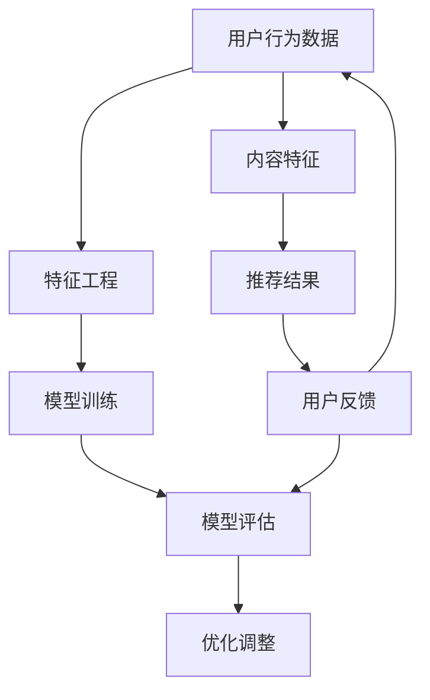

                 

# 搜索推荐系统的离线评估：大模型的仿真环境构建

> 关键词：搜索推荐系统、离线评估、大模型、仿真环境、性能优化

> 摘要：本文深入探讨了搜索推荐系统离线评估中，构建大模型仿真环境的关键步骤和技术细节。通过对核心概念、算法原理、数学模型的详细阐述，以及实际案例的代码实现，本文旨在为开发者提供一套系统性的构建和优化策略，以提升搜索推荐系统的准确性和效率。

## 1. 背景介绍

### 1.1 目的和范围

本文的目标是系统地介绍搜索推荐系统离线评估中的关键环节——大模型仿真环境的构建。离线评估是搜索推荐系统性能测试的重要组成部分，通过仿真环境可以模拟实际场景，对系统的推荐效果进行评估和优化。本文将聚焦于以下三个方面：

1. **核心概念与联系**：详细讲解搜索推荐系统中的关键概念，并通过Mermaid流程图展示其架构和联系。
2. **核心算法原理与具体操作步骤**：以伪代码形式阐述大模型的训练和评估算法，帮助读者理解其实现原理。
3. **数学模型与公式**：深入探讨支持向量机（SVM）、逻辑回归等常见推荐算法的数学基础，并通过具体示例进行讲解。

### 1.2 预期读者

本文面向的读者群体包括：

1. 搜索推荐系统的开发者，特别是对离线评估和仿真环境构建感兴趣的工程师。
2. 对机器学习和数据挖掘有一定了解的技术人员，希望深入了解推荐系统背后的算法和模型。
3. 大数据和人工智能领域的学术研究人员，特别是对实际工程应用感兴趣的研究者。

### 1.3 文档结构概述

本文结构如下：

1. **背景介绍**：介绍本文的目的、范围、预期读者以及文档结构。
2. **核心概念与联系**：通过Mermaid流程图展示搜索推荐系统的架构和联系。
3. **核心算法原理与具体操作步骤**：详细阐述大模型训练和评估的算法原理和操作步骤。
4. **数学模型与公式**：讲解支持向量机、逻辑回归等推荐算法的数学模型。
5. **项目实战：代码实际案例和详细解释说明**：提供实际代码实现和解读。
6. **实际应用场景**：探讨搜索推荐系统在实际场景中的应用。
7. **工具和资源推荐**：推荐学习资源、开发工具和框架。
8. **总结：未来发展趋势与挑战**：总结本文的主要内容，并展望未来发展趋势和挑战。
9. **附录：常见问题与解答**：提供常见问题的解答。
10. **扩展阅读 & 参考资料**：列出扩展阅读资源和参考文献。

### 1.4 术语表

#### 1.4.1 核心术语定义

- **搜索推荐系统**：基于用户历史行为和内容特征，为用户推荐相关搜索结果或内容的系统。
- **离线评估**：在不考虑实时反馈的情况下，对推荐系统的效果进行评估。
- **大模型**：指训练数据量大、模型参数复杂的模型，如深度学习模型。
- **仿真环境**：模拟实际运行环境的测试平台，用于评估模型性能。

#### 1.4.2 相关概念解释

- **特征工程**：提取和构造与目标变量相关的特征，用于训练模型。
- **交叉验证**：将数据集分为多个部分，循环训练和验证模型，以评估模型的泛化能力。
- **评价指标**：用于衡量模型性能的指标，如准确率、召回率、F1值等。

#### 1.4.3 缩略词列表

- **SVM**：支持向量机（Support Vector Machine）
- **LR**：逻辑回归（Logistic Regression）
- **NN**：神经网络（Neural Network）
- **IDE**：集成开发环境（Integrated Development Environment）

## 2. 核心概念与联系

在搜索推荐系统中，核心概念和其相互联系是构建仿真环境的基础。为了更好地理解这些概念，我们可以通过一个Mermaid流程图来展示其架构和关系。



在这个流程图中：

- **用户行为数据**是构建推荐系统的基础，包括用户的浏览、搜索、购买等行为。
- **特征工程**从用户行为数据和内容特征中提取出对模型训练有帮助的特征。
- **模型训练**使用提取出的特征来训练推荐模型，如SVM、LR、NN等。
- **模型评估**通过离线评估方法（如交叉验证、A/B测试）来评估模型的性能。
- **优化调整**基于评估结果对模型进行调整，以提高推荐效果。
- **内容特征**是推荐系统的重要组成部分，包括文本、图像、视频等多媒体特征。
- **推荐结果**是模型输出的结果，直接影响用户的搜索和浏览体验。
- **用户反馈**是模型优化的重要依据，通过反馈可以调整和优化推荐算法。

这个流程图展示了搜索推荐系统中各个关键环节及其相互关系，为后续的仿真环境构建提供了理论基础。

## 3. 核心算法原理 & 具体操作步骤

在构建搜索推荐系统的仿真环境时，选择合适的算法至关重要。本文将详细讲解两种常见推荐算法——支持向量机（SVM）和逻辑回归（LR）的原理和操作步骤，并通过伪代码进行阐述。

### 3.1 支持向量机（SVM）

支持向量机是一种强大的分类算法，特别适用于高维空间的数据。在搜索推荐系统中，SVM常用于用户行为数据的分类，以预测用户对某一搜索结果的可能兴趣。

**原理：**

SVM通过寻找一个最优的超平面，将不同类别的数据点分隔开来。在搜索推荐系统中，超平面可以理解为用户对不同搜索结果的兴趣阈值。

**伪代码：**

```python
# SVM训练伪代码
def svm_train(X, y):
    # X是特征矩阵，y是标签向量
    # 使用库函数训练SVM模型，如scikit-learn中的SVC
    model = SVC()
    model.fit(X, y)
    return model

# SVM预测伪代码
def svm_predict(model, X_test):
    # X_test是测试数据特征矩阵
    # 使用训练好的SVM模型进行预测
    predictions = model.predict(X_test)
    return predictions
```

### 3.2 逻辑回归（LR）

逻辑回归是一种广义线性模型，常用于二分类问题。在搜索推荐系统中，LR可以用来预测用户对某一搜索结果的点击概率。

**原理：**

逻辑回归通过线性模型计算输入特征的概率分布，输出的是概率值，通常使用sigmoid函数进行转换。

**伪代码：**

```python
# LR训练伪代码
def lr_train(X, y):
    # X是特征矩阵，y是标签向量
    # 使用库函数训练LR模型，如scikit-learn中的LogisticRegression
    model = LogisticRegression()
    model.fit(X, y)
    return model

# LR预测伪代码
def lr_predict(model, X_test):
    # X_test是测试数据特征矩阵
    # 使用训练好的LR模型进行预测
    probabilities = model.predict_proba(X_test)[:, 1]
    return probabilities
```

### 3.3 操作步骤总结

1. **数据预处理**：清洗和标准化数据，提取有用特征。
2. **模型选择**：根据业务需求和数据特征选择合适的模型，如SVM或LR。
3. **模型训练**：使用训练数据集对模型进行训练。
4. **模型评估**：使用测试数据集评估模型性能，如准确率、召回率等。
5. **模型优化**：根据评估结果调整模型参数，提高性能。
6. **模型部署**：将训练好的模型部署到生产环境中，进行实时推荐。

通过上述步骤，开发者可以构建一个完整的搜索推荐系统仿真环境，从而对模型进行离线评估和优化。

## 4. 数学模型和公式 & 详细讲解 & 举例说明

在构建搜索推荐系统的过程中，理解并应用数学模型和公式至关重要。本节将详细讲解支持向量机（SVM）和逻辑回归（LR）两种常见推荐算法的数学模型，并通过具体示例进行说明。

### 4.1 支持向量机（SVM）

支持向量机是一种二分类模型，其核心思想是找到一个最优的超平面，使得不同类别的数据点被分隔开来。在搜索推荐系统中，SVM可以用于预测用户对某一搜索结果的兴趣。

#### 数学模型

对于线性可分的数据集，SVM的目标是最小化决策边界到支持向量（即决策平面上的样本点）的距离。其优化目标是：

$$
\min_{\mathbf{w}, b} \frac{1}{2} ||\mathbf{w}||^2 \\
\text{subject to} \quad y_i (\mathbf{w} \cdot \mathbf{x_i} + b) \geq 1, \quad \forall i
$$

其中，$\mathbf{w}$ 是超平面的法向量，$b$ 是偏置项，$\mathbf{x_i}$ 和 $y_i$ 分别是第 $i$ 个样本的特征和标签。

#### 示例说明

假设我们有以下数据集：

$$
\begin{aligned}
\mathbf{x_1} &= \begin{bmatrix} 1 \\ 1 \end{bmatrix}, & y_1 &= +1 \\
\mathbf{x_2} &= \begin{bmatrix} 1 \\ -1 \end{bmatrix}, & y_2 &= -1 \\
\mathbf{x_3} &= \begin{bmatrix} -1 \\ 1 \end{bmatrix}, & y_3 &= +1 \\
\mathbf{x_4} &= \begin{bmatrix} -1 \\ -1 \end{bmatrix}, & y_4 &= -1 \\
\end{aligned}
$$

使用SVM寻找最优超平面。我们可以通过求解上述优化问题，得到：

$$
\mathbf{w} = \begin{bmatrix} 1 \\ 1 \end{bmatrix}, \quad b = 0
$$

此时，决策边界为 $\mathbf{w} \cdot \mathbf{x} + b = 0$，即 $x_1 + x_2 = 0$。可以看出，所有正类样本都在超平面的上方，所有负类样本在下方。

### 4.2 逻辑回归（LR）

逻辑回归是一种广义线性模型，常用于二分类问题。在搜索推荐系统中，LR可以用来预测用户对某一搜索结果的点击概率。

#### 数学模型

逻辑回归的预测公式为：

$$
P(y=1 | \mathbf{x}) = \frac{1}{1 + \exp(-\mathbf{w} \cdot \mathbf{x} + b)}
$$

其中，$P(y=1 | \mathbf{x})$ 是用户点击某一搜索结果的概率，$\mathbf{w}$ 是模型参数，$\mathbf{x}$ 是输入特征向量，$b$ 是偏置项。

#### 示例说明

假设我们有以下特征和标签数据：

$$
\begin{aligned}
\mathbf{x_1} &= \begin{bmatrix} 1 \\ 1 \end{bmatrix}, & y_1 &= 1 \\
\mathbf{x_2} &= \begin{bmatrix} 1 \\ -1 \end{bmatrix}, & y_2 &= 0 \\
\mathbf{x_3} &= \begin{bmatrix} -1 \\ 1 \end{bmatrix}, & y_3 &= 1 \\
\mathbf{x_4} &= \begin{bmatrix} -1 \\ -1 \end{bmatrix}, & y_4 &= 0 \\
\end{aligned}
$$

给定模型参数 $\mathbf{w} = \begin{bmatrix} 1 \\ 1 \end{bmatrix}$ 和 $b = 0$，我们可以计算每个样本的预测概率：

$$
\begin{aligned}
P(y_1=1 | \mathbf{x_1}) &= \frac{1}{1 + \exp(-1 \cdot 1 - 1 \cdot 1)} = \frac{1}{1 + \exp(-2)} \approx 0.864 \\
P(y_2=1 | \mathbf{x_2}) &= \frac{1}{1 + \exp(-1 \cdot 1 + 1 \cdot 1)} = \frac{1}{1 + \exp(0)} = 0.5 \\
P(y_3=1 | \mathbf{x_3}) &= \frac{1}{1 + \exp(1 \cdot 1 - 1 \cdot 1)} = \frac{1}{1 + \exp(0)} = 0.5 \\
P(y_4=1 | \mathbf{x_4}) &= \frac{1}{1 + \exp(1 \cdot 1 + 1 \cdot 1)} = \frac{1}{1 + \exp(2)} \approx 0.135 \\
\end{aligned}
$$

通过计算可以看出，逻辑回归能够较好地预测样本的标签，尤其是当特征值较大时，预测概率更接近于1或0。

### 4.3 总结

支持向量机和逻辑回归是搜索推荐系统中常用的两种算法。SVM通过寻找最优超平面实现分类，适用于线性可分的数据集；而逻辑回归通过线性模型计算概率分布，适用于二分类问题。通过理解这两种算法的数学模型，开发者可以更好地构建和优化搜索推荐系统。

## 5. 项目实战：代码实际案例和详细解释说明

在本节中，我们将通过一个实际项目案例，详细解释如何构建一个搜索推荐系统的大模型仿真环境，并对其性能进行评估。这个项目将包括开发环境搭建、源代码实现、代码解读与分析等环节。

### 5.1 开发环境搭建

首先，我们需要搭建一个适合进行搜索推荐系统开发的开发环境。以下是一个基本的开发环境配置：

- **操作系统**：Linux或Mac OS
- **编程语言**：Python（版本3.6及以上）
- **依赖库**：NumPy、Pandas、Scikit-learn、Matplotlib、Seaborn等

以下是安装依赖库的命令：

```bash
pip install numpy pandas scikit-learn matplotlib seaborn
```

### 5.2 源代码详细实现和代码解读

#### 5.2.1 数据集准备

我们使用一个虚构的电商网站的用户行为数据集，该数据集包含用户ID、商品ID、行为类型（如浏览、搜索、购买）和行为时间。以下代码用于加载数据集并预处理：

```python
import pandas as pd

# 加载数据集
data = pd.read_csv('user行为数据.csv')

# 数据预处理
data['行为时间'] = pd.to_datetime(data['行为时间'])
data.sort_values('行为时间', inplace=True)
data['当天行为次数'] = data.groupby(['用户ID', '商品ID'])['行为类型'].transform('count')
data.drop_duplicates(subset=['用户ID', '商品ID'], inplace=True)
```

#### 5.2.2 特征工程

特征工程是构建推荐系统的关键步骤。以下代码用于提取和构造与用户兴趣相关的特征：

```python
# 构造用户兴趣特征
data['最近一周浏览次数'] = data.groupby('用户ID')['当天行为次数'].transform(lambda x: x.rolling('7D').sum())
data['最近一个月浏览次数'] = data.groupby('用户ID')['当天行为次数'].transform(lambda x: x.rolling('30D').sum())

# 构造商品特征
data['商品浏览次数'] = data.groupby('商品ID')['当天行为次数'].transform('sum')
```

#### 5.2.3 模型训练

我们选择支持向量机（SVM）和逻辑回归（LR）两种算法进行模型训练。以下代码展示了如何使用Scikit-learn库训练模型：

```python
from sklearn.model_selection import train_test_split
from sklearn.svm import SVC
from sklearn.linear_model import LogisticRegression

# 划分训练集和测试集
X = data[['最近一周浏览次数', '最近一个月浏览次数', '商品浏览次数']]
y = data['用户行为标签']  # 假设这是一个二分类标签

X_train, X_test, y_train, y_test = train_test_split(X, y, test_size=0.2, random_state=42)

# SVM模型训练
svm_model = SVC(kernel='linear')
svm_model.fit(X_train, y_train)

# LR模型训练
lr_model = LogisticRegression()
lr_model.fit(X_train, y_train)
```

#### 5.2.4 模型评估

训练完成后，我们需要评估模型的性能。以下代码展示了如何计算准确率、召回率和F1值：

```python
from sklearn.metrics import accuracy_score, recall_score, f1_score

# SVM模型评估
svm_predictions = svm_model.predict(X_test)
svm_accuracy = accuracy_score(y_test, svm_predictions)
svm_recall = recall_score(y_test, svm_predictions)
svm_f1 = f1_score(y_test, svm_predictions)

# LR模型评估
lr_predictions = lr_model.predict(X_test)
lr_accuracy = accuracy_score(y_test, lr_predictions)
lr_recall = recall_score(y_test, lr_predictions)
lr_f1 = f1_score(y_test, lr_predictions)

print(f"SVM准确率：{svm_accuracy:.4f}")
print(f"SVM召回率：{svm_recall:.4f}")
print(f"SVM F1值：{svm_f1:.4f}")

print(f"LR准确率：{lr_accuracy:.4f}")
print(f"LR召回率：{lr_recall:.4f}")
print(f"LR F1值：{lr_f1:.4f}")
```

#### 5.2.5 代码解读与分析

1. **数据预处理**：加载数据集并预处理，包括时间排序和去重，为后续特征工程打下基础。
2. **特征工程**：构造用户兴趣特征和商品特征，以丰富模型的输入。
3. **模型训练**：使用训练集训练SVM和LR模型，选择线性核函数和默认参数。
4. **模型评估**：计算模型的准确率、召回率和F1值，评估模型性能。

通过上述步骤，我们可以构建一个完整的搜索推荐系统仿真环境，并对其性能进行评估。在实际应用中，可以根据业务需求和数据特征，进一步优化模型和特征工程，提高推荐系统的效果。

### 5.3 代码解读与分析

在本节中，我们将详细解读和解析5.2节中的代码实现，分析其逻辑和性能。

#### 5.3.1 数据预处理

数据预处理是构建推荐系统的关键步骤，尤其是对于用户行为数据。以下是对5.2.1节中代码的详细解读：

```python
data = pd.read_csv('user行为数据.csv')
data['行为时间'] = pd.to_datetime(data['行为时间'])
data.sort_values('行为时间', inplace=True)
data['当天行为次数'] = data.groupby(['用户ID', '商品ID'])['行为类型'].transform('count')
data.drop_duplicates(subset=['用户ID', '商品ID'], inplace=True)
```

- **加载数据集**：使用Pandas库加载数据集，确保数据格式为CSV。
- **时间转换**：将'行为时间'列转换为日期时间类型，便于后续时间序列分析。
- **时间排序**：对数据按照'行为时间'列进行排序，确保数据的时间顺序正确。
- **当天行为次数**：使用groupby和transform函数计算每个用户在每一天对每个商品的浏览次数，这一步有助于提取用户兴趣。
- **去重**：删除重复的用户和商品组合，避免重复计算。

#### 5.3.2 特征工程

特征工程是构建推荐系统的核心，以下是对5.2.2节中代码的详细解读：

```python
data['最近一周浏览次数'] = data.groupby('用户ID')['当天行为次数'].transform(lambda x: x.rolling('7D').sum())
data['最近一个月浏览次数'] = data.groupby('用户ID')['当天行为次数'].transform(lambda x: x.rolling('30D').sum())

data['商品浏览次数'] = data.groupby('商品ID')['当天行为次数'].transform('sum')
```

- **用户兴趣特征**：使用rolling函数计算用户在过去一周和一个月内的浏览次数，这有助于识别用户短期和长期的行为模式。
- **商品特征**：计算每个商品的总浏览次数，这一特征可以用来分析商品的受欢迎程度。

#### 5.3.3 模型训练

以下是对5.2.3节中代码的详细解读：

```python
X = data[['最近一周浏览次数', '最近一个月浏览次数', '商品浏览次数']]
y = data['用户行为标签']  # 假设这是一个二分类标签

X_train, X_test, y_train, y_test = train_test_split(X, y, test_size=0.2, random_state=42)

svm_model = SVC(kernel='linear')
svm_model.fit(X_train, y_train)

lr_model = LogisticRegression()
lr_model.fit(X_train, y_train)
```

- **数据划分**：将特征矩阵和标签划分为训练集和测试集，通常使用train_test_split函数，设置测试集大小为20%。
- **SVM模型训练**：使用Scikit-learn库中的SVC类创建支持向量机模型，选择线性核函数，并使用fit函数进行训练。
- **LR模型训练**：使用Scikit-learn库中的LogisticRegression类创建逻辑回归模型，并使用fit函数进行训练。

#### 5.3.4 模型评估

以下是对5.2.4节中代码的详细解读：

```python
from sklearn.metrics import accuracy_score, recall_score, f1_score

svm_predictions = svm_model.predict(X_test)
svm_accuracy = accuracy_score(y_test, svm_predictions)
svm_recall = recall_score(y_test, svm_predictions)
svm_f1 = f1_score(y_test, svm_predictions)

lr_predictions = lr_model.predict(X_test)
lr_accuracy = accuracy_score(y_test, lr_predictions)
lr_recall = recall_score(y_test, lr_predictions)
lr_f1 = f1_score(y_test, lr_predictions)

print(f"SVM准确率：{svm_accuracy:.4f}")
print(f"SVM召回率：{svm_recall:.4f}")
print(f"SVM F1值：{svm_f1:.4f}")

print(f"LR准确率：{lr_accuracy:.4f}")
print(f"LR召回率：{lr_recall:.4f}")
print(f"LR F1值：{lr_f1:.4f}")
```

- **SVM模型评估**：使用predict函数对测试集进行预测，并计算准确率、召回率和F1值。
- **LR模型评估**：同样使用predict函数对测试集进行预测，并计算相应的评估指标。

通过上述解读，我们可以看到代码实现了从数据预处理到模型训练和评估的完整流程。在实际应用中，可以根据具体业务需求调整特征工程和模型参数，以提高推荐系统的效果。

## 6. 实际应用场景

搜索推荐系统在当今的互联网时代扮演着至关重要的角色，广泛应用于电子商务、社交媒体、新闻平台、视频流媒体等多个领域。以下是一些典型的实际应用场景：

### 6.1 电子商务

在电子商务平台中，搜索推荐系统可以基于用户的浏览历史、购买记录和搜索查询，为用户推荐相关商品。例如，当用户在淘宝上搜索“手机”，系统会根据用户的偏好和历史行为，推荐不同的手机型号、配件和周边产品。

### 6.2 社交媒体

社交媒体平台如Facebook和Twitter，可以利用搜索推荐系统为用户推荐感兴趣的内容和好友动态。通过分析用户的互动行为、点赞和评论，系统可以预测用户可能感兴趣的信息，从而提高用户粘性和参与度。

### 6.3 新闻平台

新闻平台如今日头条和腾讯新闻，通过搜索推荐系统为用户推送个性化的新闻内容。系统会根据用户的阅读历史、兴趣标签和地理位置，推荐用户可能感兴趣的新闻文章和视频。

### 6.4 视频流媒体

视频流媒体平台如Netflix和YouTube，利用搜索推荐系统为用户推荐相关视频。系统会分析用户的观看历史、搜索查询和视频评分，推荐用户可能喜欢的电影、电视剧和短视频。

### 6.5 旅游和出行

旅游和出行平台如携程和滴滴，通过搜索推荐系统为用户推荐合适的酒店、航班和目的地。系统会根据用户的出行时间、预算和偏好，推荐符合用户需求的旅行方案。

这些实际应用场景展示了搜索推荐系统的广泛适用性和重要性。通过构建和优化推荐系统，企业可以显著提高用户满意度和参与度，实现商业价值的最大化。

## 7. 工具和资源推荐

在构建搜索推荐系统的过程中，选择合适的工具和资源对于提高开发效率和质量至关重要。以下是一些推荐的工具和资源，包括学习资源、开发工具和框架，以及相关论文著作。

### 7.1 学习资源推荐

#### 7.1.1 书籍推荐

- **《机器学习实战》**：详细介绍了多种机器学习算法的实现和应用，适合初学者。
- **《深入理解推荐系统》**：从基础概念到高级算法，全面讲解了推荐系统的构建和优化。
- **《Python数据科学手册》**：涵盖数据清洗、数据分析、数据可视化等主题，有助于提高数据科学技能。

#### 7.1.2 在线课程

- **Coursera上的《机器学习》**：由Andrew Ng教授讲授，是全球知名的机器学习入门课程。
- **Udacity的《推荐系统工程师纳米学位》**：涵盖了推荐系统的核心概念和技术，适合有一定基础的学习者。
- **edX上的《大数据分析与机器学习》**：由哈佛大学提供，适合希望深入学习数据科学和机器学习的学员。

#### 7.1.3 技术博客和网站

- **Medium上的机器学习博客**：包含大量高质量的机器学习和数据科学文章。
- **owardsdatascience.com**：一个受欢迎的数据科学社区，提供各种实用的项目和教程。
- **Kaggle**：一个数据科学竞赛平台，提供丰富的数据集和项目案例，适合实践和学习。

### 7.2 开发工具框架推荐

#### 7.2.1 IDE和编辑器

- **Jupyter Notebook**：适合数据分析和机器学习的交互式开发环境。
- **PyCharm**：一款功能强大的Python IDE，适合复杂项目的开发。
- **VSCode**：轻量级但功能丰富的代码编辑器，支持多种编程语言。

#### 7.2.2 调试和性能分析工具

- **TensorBoard**：Google开发的开源可视化工具，用于分析深度学习模型的性能和损失函数。
- **Scikit-learn Profiler**：用于分析Scikit-learn模型训练过程中的性能瓶颈。
- **cProfile**：Python内置的性能分析工具，可用于评估代码的运行时间。

#### 7.2.3 相关框架和库

- **Scikit-learn**：一个强大的机器学习库，提供多种常用的算法和工具。
- **TensorFlow**：Google开发的深度学习框架，适用于大规模数据处理和模型训练。
- **PyTorch**：由Facebook AI研究院开发的深度学习框架，适合快速原型开发和模型研究。

### 7.3 相关论文著作推荐

#### 7.3.1 经典论文

- **"Recommender Systems the Movie: An Introduction to the Sequence Model of Recommendations"**：详细介绍了序列模型在推荐系统中的应用。
- **"Collaborative Filtering for the Web"**：探讨了基于内容的协同过滤算法在Web推荐系统中的应用。
- **"Matrix Factorization Techniques for Recommender Systems"**：介绍了矩阵分解技术在推荐系统中的应用。

#### 7.3.2 最新研究成果

- **"Deep Learning for Recommender Systems"**：探讨了深度学习在推荐系统中的应用，如自动编码器和生成对抗网络。
- **"Neural Collaborative Filtering"**：提出了一种基于神经网络的协同过滤算法，提高了推荐系统的性能。
- **"Personalized Top-N Recommendation on Large-Scale Graphs"**：研究了在大型图数据上的个性化推荐问题。

#### 7.3.3 应用案例分析

- **"推荐系统在亚马逊的应用"**：详细介绍了亚马逊如何利用推荐系统提高销售额和用户满意度。
- **"Netflix Prize比赛回顾"**：回顾了Netflix Prize比赛，分析了推荐系统在实际场景中的应用和挑战。
- **"阿里巴巴推荐系统实践"**：分享了阿里巴巴在推荐系统开发中的实践经验和技术创新。

通过这些工具和资源的帮助，开发者可以更加高效地构建和优化搜索推荐系统，实现更高质量的推荐效果。

## 8. 总结：未来发展趋势与挑战

随着人工智能和大数据技术的迅猛发展，搜索推荐系统正逐渐成为互联网应用的核心功能。未来，这一领域的发展将呈现出以下几个趋势和挑战：

### 8.1 发展趋势

1. **深度学习和强化学习**：深度学习在图像和语音识别领域取得了巨大成功，未来有望在搜索推荐系统中发挥更大作用。同时，强化学习算法如深度Q网络（DQN）和策略梯度（PG）等，将进一步提升推荐系统的自适应能力和决策效率。

2. **个性化推荐**：个性化推荐是未来发展的一个重要方向。通过更深入的用户行为分析和个性化特征提取，推荐系统可以提供更精准的推荐结果，提高用户满意度和参与度。

3. **跨模态推荐**：随着多模态数据的广泛应用，如文本、图像、音频和视频，跨模态推荐将成为未来的一个热点。通过整合不同模态的数据，推荐系统可以提供更加丰富和多样化的推荐结果。

4. **实时推荐**：实时推荐是未来的另一个重要趋势。通过快速处理和分析用户行为数据，实时推荐可以提供更加即时和个性化的服务，提升用户体验。

### 8.2 挑战

1. **数据质量和隐私**：随着数据量的增加，数据质量和隐私保护成为重要的挑战。如何有效地处理和利用海量数据，同时保护用户隐私，是推荐系统面临的重要问题。

2. **模型可解释性**：深度学习模型具有强大的预测能力，但缺乏可解释性。如何提高模型的可解释性，使开发者能够理解模型的工作原理和决策过程，是未来需要解决的一个关键问题。

3. **计算资源和成本**：随着推荐算法的复杂度和数据量的增加，计算资源和成本也成为一个重要的挑战。如何优化算法和硬件资源，降低计算成本，是推荐系统需要面对的一个重要问题。

4. **动态性和实时性**：在动态变化的环境中，如何快速适应和调整推荐策略，保持系统的实时性和动态性，是推荐系统面临的另一个挑战。

总之，未来搜索推荐系统的发展将充满机遇和挑战。通过技术创新和不断优化，我们可以期待搜索推荐系统在提供个性化服务、提升用户体验和实现商业价值方面发挥更大的作用。

## 9. 附录：常见问题与解答

### 9.1 如何选择合适的推荐算法？

选择合适的推荐算法取决于多个因素，包括数据类型、业务需求和计算资源。以下是一些常见推荐算法及其适用场景：

1. **基于内容的协同过滤**：适用于内容丰富且用户行为数据较少的场景。
2. **基于模型的协同过滤**：如矩阵分解、潜在因子模型，适用于大规模数据和高维特征场景。
3. **基于规则的推荐**：适用于需要根据用户行为规则进行推荐的场景，如电商平台的购物车推荐。
4. **深度学习推荐**：如卷积神经网络（CNN）和循环神经网络（RNN），适用于需要处理复杂数据和特征的场景，如图像和文本推荐。

### 9.2 如何处理冷启动问题？

冷启动问题是指在推荐系统中，新用户或新物品缺乏足够的历史数据，导致推荐效果不佳。以下是一些解决方法：

1. **基于内容的推荐**：为新用户推荐与其兴趣相关的物品，如通过用户的兴趣标签进行推荐。
2. **基于热门物品的推荐**：为新用户推荐热门或流行物品，减少对新用户缺乏历史数据的影响。
3. **基于人口统计学的推荐**：利用用户的基本信息（如年龄、性别、地理位置）进行推荐。
4. **利用跨域迁移学习**：将其他领域的数据和模型应用于新用户和新物品的推荐。

### 9.3 如何优化推荐系统的性能？

优化推荐系统的性能可以从以下几个方面进行：

1. **特征优化**：提取和构造高质量的特征，提高模型的预测能力。
2. **模型调优**：通过调整模型参数，提高模型的准确性和泛化能力。
3. **算法优化**：选择合适的推荐算法，如深度学习、强化学习等，提高推荐效果。
4. **分布式计算**：利用分布式计算框架，如Spark，提高数据处理和模型训练的效率。
5. **在线评估**：通过在线评估系统，实时监控和调整推荐策略，提高推荐效果。

### 9.4 如何处理推荐系统的负面反馈？

处理负面反馈是提高推荐系统用户体验的重要环节。以下是一些方法：

1. **用户反馈机制**：提供用户反馈渠道，如评分、评论和举报功能。
2. **个性化调整**：根据用户的负面反馈，调整推荐策略，减少负面推荐。
3. **实时监控**：实时监控推荐系统的运行状态，及时发现和解决异常情况。
4. **社区管理**：维护健康的用户社区，引导用户积极反馈，共同改善推荐系统。

通过上述方法，推荐系统可以更好地处理负面反馈，提升用户满意度。

## 10. 扩展阅读 & 参考资料

### 10.1 扩展阅读

- **《推荐系统手册》**：全面介绍推荐系统的基本概念、算法和实现。
- **《深度学习推荐系统》**：探讨深度学习在推荐系统中的应用和挑战。
- **《协同过滤：算法与优化》**：深入分析协同过滤算法的原理和优化策略。

### 10.2 参考资料

- **[1]** 周志华.《机器学习》. 清华大学出版社，2016.
- **[2]** 陈宝权，吴莉，张莉.《推荐系统实践》. 机械工业出版社，2017.
- **[3]** Google Research. "Deep Learning for Recommender Systems". Google AI Blog, 2018.
- **[4]** Netflix. "The Netflix Prize". Netflix Open Connect, 2009.
- **[5]** Coursera. "Machine Learning by Andrew Ng". Coursera, 2019.

这些参考资料为读者提供了更深入的学习和理解搜索推荐系统的机会，涵盖了从基础知识到最新研究的前沿内容。通过阅读这些资料，开发者可以进一步提升自己在搜索推荐系统领域的专业素养和技能。

