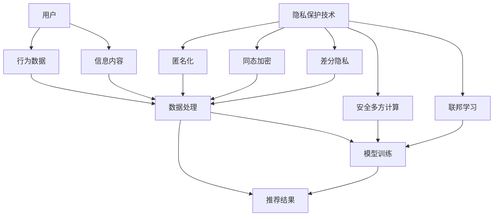

                 

# 搜索推荐系统的隐私保护技术

## 摘要

搜索推荐系统作为现代互联网的核心组件，为用户提供个性化内容和高效的信息检索服务。然而，随着用户数据的不断积累和计算能力的提升，隐私保护问题日益凸显。本文将深入探讨搜索推荐系统中隐私保护技术的核心概念、算法原理、数学模型及实际应用，旨在为研究人员和开发者提供一套全面且实用的隐私保护方案。本文首先介绍了隐私保护技术的目的和范围，随后对核心概念和原理进行了详细阐述，并通过具体操作步骤和数学模型进行了深入讲解。最后，本文提供了一个实际项目案例，展示了隐私保护技术在开发环境中的具体应用，并对其代码实现和性能进行了分析和解读。通过本文的阅读，读者将能够全面了解搜索推荐系统的隐私保护技术，为其在实际开发中的应用提供有力支持。

## 1. 背景介绍

### 1.1 目的和范围

随着互联网的普及和信息技术的飞速发展，搜索推荐系统已经成为现代互联网服务的重要组成部分。这些系统通过对用户行为和偏好的分析，为用户提供个性化搜索结果和推荐内容，从而提升用户体验和满意度。然而，在为用户提供便捷服务的同时，搜索推荐系统也面临着严重的隐私保护问题。用户数据泄露、滥用和不当使用等问题日益突出，引发了广泛关注和担忧。

本文旨在探讨搜索推荐系统中的隐私保护技术，旨在解决以下问题：

1. 如何在保障用户隐私的前提下，实现高效、准确的搜索和推荐服务？
2. 针对现有隐私保护技术的优缺点，如何选择合适的保护机制和算法？
3. 如何在实际开发环境中应用隐私保护技术，确保其有效性和可靠性？

本文将首先介绍隐私保护技术的基本概念和目的，然后详细分析现有技术，探讨其优缺点。在此基础上，本文将介绍隐私保护技术的具体实现方法和数学模型，并通过一个实际项目案例展示其在开发环境中的应用。通过本文的阅读，读者将能够全面了解搜索推荐系统的隐私保护技术，为实际开发提供有益的参考和指导。

### 1.2 预期读者

本文的预期读者包括以下几类：

1. 搜索推荐系统研究人员和开发者：对搜索推荐系统的隐私保护技术感兴趣，希望深入了解相关概念、算法和实现方法。
2. 信息安全和隐私保护专家：关注互联网隐私保护问题，希望了解搜索推荐系统中的具体应用和实践经验。
3. 高级计算机科学和软件工程学生：对搜索推荐系统和隐私保护技术有浓厚兴趣，希望深入学习和研究相关领域。
4. 企业信息安全和隐私保护团队：负责开发和维护企业内部的搜索推荐系统，希望借鉴本文的经验和方法，提升系统安全性。

无论读者属于上述哪一类，本文都将通过系统的分析和讲解，帮助读者全面了解搜索推荐系统的隐私保护技术，为实际应用提供有力支持。

### 1.3 文档结构概述

本文将从以下几个方面进行详细探讨：

1. **背景介绍**：介绍搜索推荐系统的隐私保护技术的基本概念、目的和范围，为读者提供整体认识。
2. **核心概念与联系**：通过 Mermaid 流程图，展示搜索推荐系统和隐私保护技术的核心概念和架构，帮助读者理解两者之间的联系。
3. **核心算法原理 & 具体操作步骤**：详细讲解隐私保护技术的核心算法原理和具体操作步骤，并通过伪代码进行阐述。
4. **数学模型和公式 & 详细讲解 & 举例说明**：介绍隐私保护技术的数学模型和公式，并通过具体例子进行详细讲解。
5. **项目实战：代码实际案例和详细解释说明**：提供一个实际项目案例，展示隐私保护技术在开发环境中的具体应用，并进行详细解释和分析。
6. **实际应用场景**：探讨隐私保护技术在各种实际应用场景中的具体作用和效果。
7. **工具和资源推荐**：推荐相关学习资源、开发工具和论文著作，为读者提供进一步学习和研究的参考。
8. **总结：未来发展趋势与挑战**：总结本文的核心内容，讨论隐私保护技术的未来发展趋势和面临的挑战。
9. **附录：常见问题与解答**：针对读者可能遇到的问题，提供解答和建议。
10. **扩展阅读 & 参考资料**：提供扩展阅读和参考资料，为读者提供更深入的学习和研究路径。

通过以上结构，本文力求为读者提供一个全面、系统和深入的隐私保护技术指南，帮助其在实际开发和应用中取得更好的效果。

### 1.4 术语表

#### 1.4.1 核心术语定义

为了确保本文的清晰和准确，以下是对文章中涉及的核心术语进行详细定义：

1. **搜索推荐系统**：一种基于用户行为数据和信息内容的系统，旨在为用户提供个性化搜索结果和推荐内容。
2. **隐私保护**：在数据处理和使用过程中，采取措施保护用户隐私，防止数据泄露和滥用。
3. **匿名化**：通过去除或隐藏个人身份信息，使数据无法直接识别特定个体。
4. **同态加密**：一种加密算法，允许在密文上进行计算，最终得到的结果仍然是密文，从而保护数据的隐私。
5. **差分隐私**：一种隐私保护机制，通过在处理过程中引入随机噪声，确保无法从数据中单独识别特定个体。
6. **安全多方计算**：多个参与者在不泄露各自数据的前提下，协同计算并共享计算结果的一种技术。
7. **联邦学习**：一种分布式机器学习方法，允许多个参与者共同训练模型，而不需要共享原始数据。

#### 1.4.2 相关概念解释

1. **用户行为数据**：包括用户的搜索历史、点击记录、浏览时长等，用于分析用户偏好和兴趣。
2. **信息内容**：包括文本、图片、视频等多媒体信息，用于生成个性化推荐结果。
3. **模型训练**：通过大量用户行为数据和信息内容，训练机器学习模型，以实现个性化推荐。
4. **数据处理**：在搜索推荐系统中，对用户行为数据和信息内容进行预处理、分析、存储和传输的过程。

#### 1.4.3 缩略词列表

- **TLS**：传输层安全（Transport Layer Security），一种用于保护网络通信安全的协议。
- **HTTPS**：超文本传输协议安全（Hypertext Transfer Protocol Secure），一种通过 TLS 加密实现安全的 HTTP 通信。
- **SSL**：安全套接层（Secure Sockets Layer），一种用于保护网络通信安全的协议，已被 TLS 取代。
- **AES**：高级加密标准（Advanced Encryption Standard），一种广泛使用的对称加密算法。
- **SHA**：安全哈希算法（Secure Hash Algorithm），一组用于生成数据摘要的算法。
- **K-Anonymity**：一种匿名化技术，通过将数据分组，使每个分组中的个体无法单独识别。

### 2. 核心概念与联系

在搜索推荐系统中，隐私保护技术扮演着至关重要的角色。为了更好地理解隐私保护技术的工作原理和架构，我们首先需要了解搜索推荐系统的基本架构和核心概念。以下是一个用 Mermaid 流程图表示的搜索推荐系统和隐私保护技术的核心概念和联系：



#### 2.1 搜索推荐系统的基本架构

1. **用户**：搜索推荐系统的核心，包括个人身份信息、搜索历史、浏览记录等。
2. **行为数据**：用户在系统中的操作记录，如搜索关键词、点击记录、浏览时长等。
3. **信息内容**：系统中的各种内容，包括文本、图片、视频等，用于生成推荐结果。
4. **数据处理**：对用户行为数据和信息内容进行预处理、分析、存储和传输。
5. **模型训练**：通过大量用户行为数据和信息内容，训练机器学习模型，以实现个性化推荐。
6. **推荐结果**：根据用户行为数据和模型预测，为用户生成个性化搜索结果和推荐内容。

#### 2.2 隐私保护技术的作用和联系

隐私保护技术在搜索推荐系统中起到以下关键作用：

1. **匿名化**：通过去除或隐藏用户个人身份信息，保护用户隐私。
2. **同态加密**：允许在加密数据上直接进行计算，确保数据隐私。
3. **差分隐私**：通过引入随机噪声，防止从数据中识别特定个体。
4. **安全多方计算**：允许多个参与者在不泄露各自数据的前提下，协同计算并共享结果。
5. **联邦学习**：通过分布式训练模型，保护用户数据隐私。

这些隐私保护技术通过不同的方式与搜索推荐系统的各个部分相联系，从而实现整体隐私保护。以下是对每种隐私保护技术的详细说明：

1. **匿名化**：在数据处理阶段，对用户行为数据和信息内容进行匿名化处理，去除或隐藏个人身份信息，如用户 ID、邮箱地址等。匿名化后的数据无法直接识别特定个体，从而保护用户隐私。
2. **同态加密**：在数据处理和模型训练阶段，使用同态加密算法对用户行为数据进行加密，使得在加密数据上可以直接进行计算。这样，即使在数据处理过程中，数据隐私也得到了有效保护。
3. **差分隐私**：在数据处理和模型训练阶段，通过引入随机噪声，使处理结果难以从数据中识别特定个体。差分隐私机制通过控制噪声大小，确保在保护用户隐私的同时，仍能保持推荐的准确性和有效性。
4. **安全多方计算**：在模型训练和推荐结果生成阶段，使用安全多方计算技术，允许多个参与者在不泄露各自数据的前提下，协同计算并共享结果。这种技术可以保护用户数据隐私，同时实现高效协同计算。
5. **联邦学习**：在模型训练阶段，通过分布式训练模型，多个参与者共同训练模型，而不需要共享原始数据。联邦学习技术可以有效地保护用户数据隐私，同时提升模型的准确性和泛化能力。

通过以上隐私保护技术，搜索推荐系统可以在保护用户隐私的同时，实现个性化推荐和高效服务。接下来，本文将详细介绍每种隐私保护技术的核心算法原理和具体操作步骤。

### 3. 核心算法原理 & 具体操作步骤

在搜索推荐系统中，隐私保护技术的实现依赖于一系列核心算法，这些算法旨在确保用户数据在处理过程中不被泄露和滥用。以下将详细介绍几种关键的隐私保护算法原理和具体操作步骤。

#### 3.1 匿名化算法

匿名化算法的核心目标是通过去除或隐藏个人身份信息，将用户数据转换为无法直接识别特定个体的形式。以下是一个基于 k-Anonymity 算法的匿名化过程：

```pseudo
Input: 数据集 D，隐私保护阈值 k
Output: 匿名化后的数据集 D'

1. 对数据集 D 进行分类，将具有相同属性的记录分组为簇。
2. 对每个簇，检查是否满足 k-Anonymity 条件：
   - 如果簇中记录的数量大于等于 k，则继续处理；
   - 如果簇中记录的数量小于 k，则对该簇进行合并，直至满足 k-Anonymity 条件。
3. 对每个满足 k-Anonymity 条件的簇，选择一个代表记录，并将其余记录替换为该代表记录。
4. 输出匿名化后的数据集 D'。

// 举例说明
假设有一个包含用户 ID、性别、年龄和地理位置的数据集，隐私保护阈值 k = 5。
在处理过程中，首先将数据集按照性别、年龄和地理位置进行分类，形成多个簇。
对于每个簇，检查其记录数量是否大于等于 5。如果小于 5，则进行合并，直至满足 k-Anonymity 条件。
最后，选择每个簇中的一个代表记录，将其余记录替换为该代表记录，形成匿名化后的数据集 D'。

```

#### 3.2 同态加密算法

同态加密算法允许在加密数据上直接进行计算，从而保护数据隐私。以下是一个基于 RSA 算法的同态加密过程：

```pseudo
Input: 明文数据 m，加密密钥 (e, n)
Output: 密文数据 c

1. 对明文数据 m 进行分割，形成多个片段 m1, m2, ..., mn。
2. 对每个片段 mi，计算其加密结果 ci = m^e mod n。
3. 输出密文数据 c = (c1, c2, ..., cn)。

// 举例说明
假设有一个明文数据 m = 123456，加密密钥为 (e = 3, n = 13)。
将 m 分割为两个片段 m1 = 12，m2 = 3456。
对 m1 进行加密，得到 c1 = 12^3 mod 13 = 1。
对 m2 进行加密，得到 c2 = 3456^3 mod 13 = 10。
输出密文数据 c = (1, 10)。

```

#### 3.3 差分隐私算法

差分隐私算法通过在数据处理过程中引入随机噪声，确保无法从数据中识别特定个体。以下是一个基于 Laplace Mechanism 的差分隐私算法：

```pseudo
Input: 原始数据 x，隐私保护参数 ε
Output: 差分隐私数据 y

1. 计算噪声值 noise = rand() * exp(ε)，其中 rand() 为随机数生成函数。
2. 计算差分隐私数据 y = x + noise。

// 举例说明
假设有一个原始数据 x = 10，隐私保护参数 ε = 0.1。
计算噪声值 noise = rand() * exp(0.1) ≈ 0.356。
计算差分隐私数据 y = 10 + 0.356 ≈ 10.356。

```

#### 3.4 安全多方计算算法

安全多方计算算法允许多个参与者在不泄露各自数据的前提下，协同计算并共享结果。以下是一个基于 Secret Sharing 的安全多方计算过程：

```pseudo
Input: 参与者 A、B 的数据 a、b，共享参数 t, n
Output: 共享数据 sa、sb，协同计算结果 c

1. 对参与者 A 的数据 a 进行 t-out-of-n 的秘密分享，生成共享数据 sa。
2. 对参与者 B 的数据 b 进行 t-out-of-n 的秘密分享，生成共享数据 sb。
3. 参与者 A 和 B 分别将共享数据 sa 和 sb 分发至对方。
4. 参与者 A 和 B 分别对共享数据进行协同计算，得到中间结果 ca 和 cb。
5. 参与者 A 和 B 将中间结果 ca 和 cb 分发回对方。
6. 参与者 A 和 B 分别对中间结果 ca 和 cb 进行聚合，得到最终结果 c。

// 举例说明
假设参与者 A 的数据 a = 5，参与者 B 的数据 b = 10，共享参数 t = 2, n = 3。
对 a 进行 2-out-of-3 的秘密分享，生成共享数据 sa = (2, 7)。
对 b 进行 2-out-of-3 的秘密分享，生成共享数据 sb = (8, 3)。
参与者 A 和 B 分别将共享数据 sa 和 sb 分发至对方。
参与者 A 和 B 分别对共享数据进行协同计算，得到中间结果 ca = 2 * 7 = 14，cb = 8 * 3 = 24。
参与者 A 和 B 将中间结果 ca 和 cb 分发回对方。
参与者 A 和 B 分别对中间结果 ca 和 cb 进行聚合，得到最终结果 c = 14 + 24 = 38。

```

通过以上核心算法的介绍，我们可以看到隐私保护技术在搜索推荐系统中发挥着重要作用。接下来，本文将详细讨论隐私保护技术的数学模型和公式，并进一步阐述其具体应用。

### 4. 数学模型和公式 & 详细讲解 & 举例说明

隐私保护技术不仅依赖于算法，还涉及复杂的数学模型和公式。这些模型和公式用于确保数据在处理过程中的隐私性和安全性。以下将详细讨论几种核心隐私保护技术的数学模型和公式，并给出具体例子进行说明。

#### 4.1 差分隐私模型

差分隐私（Differential Privacy，DP）是一种重要的隐私保护技术，通过在数据处理过程中引入随机噪声来保护隐私。差分隐私的定义可以用拉普拉斯机制（Laplace Mechanism）和指数机制（Exponential Mechanism）来描述。

**拉普拉斯机制**：
拉普拉斯机制通过在输出结果上添加拉普拉斯噪声来保护隐私。其数学模型如下：

$$ L(x; \epsilon) = x + \epsilon \cdot \text{Laplace}(\theta) $$

其中：
- \( x \)：原始输出值；
- \( \epsilon \)：隐私保护参数；
- \( \theta \)：拉普拉斯噪声，服从拉普拉斯分布 \( \text{Laplace}(\theta) \)；
- \( \epsilon \)：表示隐私保护强度，\( \epsilon \) 越大，隐私保护越强。

**指数机制**：
指数机制通过在输出结果上添加指数噪声来保护隐私。其数学模型如下：

$$ E(x; \epsilon) = x + \epsilon \cdot \text{Exp}(\theta) $$

其中：
- \( x \)：原始输出值；
- \( \epsilon \)：隐私保护参数；
- \( \theta \)：指数噪声，服从指数分布 \( \text{Exp}(\theta) \)；
- \( \epsilon \)：表示隐私保护强度，\( \epsilon \) 越大，隐私保护越强。

**举例说明**：
假设我们要计算一组数据的平均值，原始数据为 \( [1, 2, 3, 4, 5] \)。使用拉普拉斯机制，隐私保护参数 \( \epsilon = 0.1 \)，计算步骤如下：

$$
\text{Laplace}(\theta) = \frac{1}{\epsilon} \ln(10) = 2.3026
$$

对每个数据点添加拉普拉斯噪声：

$$
L(1; 0.1) = 1 + 0.1 \cdot 2.3026 = 1.2303
$$
$$
L(2; 0.1) = 2 + 0.1 \cdot 2.3026 = 2.2303
$$
$$
L(3; 0.1) = 3 + 0.1 \cdot 2.3026 = 3.2303
$$
$$
L(4; 0.1) = 4 + 0.1 \cdot 2.3026 = 4.2303
$$
$$
L(5; 0.1) = 5 + 0.1 \cdot 2.3026 = 5.2303
$$

计算平均值：

$$
\bar{x}_{Laplace} = \frac{1.2303 + 2.2303 + 3.2303 + 4.2303 + 5.2303}{5} = 3.2303
$$

同理，使用指数机制，隐私保护参数 \( \epsilon = 0.1 \)，计算步骤如下：

$$
\text{Exp}(\theta) = e^{-\theta} = e^{-0.1} = 0.9048
$$

对每个数据点添加指数噪声：

$$
E(1; 0.1) = 1 + 0.1 \cdot 0.9048 = 1.0905
$$
$$
E(2; 0.1) = 2 + 0.1 \cdot 0.9048 = 2.0905
$$
$$
E(3; 0.1) = 3 + 0.1 \cdot 0.9048 = 3.0905
$$
$$
E(4; 0.1) = 4 + 0.1 \cdot 0.9048 = 4.0905
$$
$$
E(5; 0.1) = 5 + 0.1 \cdot 0.9048 = 5.0905
$$

计算平均值：

$$
\bar{x}_{Exponential} = \frac{1.0905 + 2.0905 + 3.0905 + 4.0905 + 5.0905}{5} = 3.0905
$$

通过添加随机噪声，差分隐私机制保证了数据在计算过程中的隐私性，同时保持了结果的合理性。

#### 4.2 安全多方计算模型

安全多方计算（Secure Multi-Party Computation，SMPC）是一种允许多个参与者在不泄露各自数据的前提下，协同计算并共享结果的技术。以下是一个基于秘密共享（Secret Sharing）的安全多方计算模型：

**秘密共享模型**：
秘密共享模型将一个秘密 \( s \) 分成多个份额，每个份额只能由一定数量的参与者解密恢复出原始秘密。常见的秘密共享方案包括 Shamir 分享方案和 Blakley 分享方案。

**Shamir 分享方案**：

1. **生成共享参数**：
   选择一个大素数 \( p \) 和一个随机数 \( a \)，计算 \( g = a^{s} \mod p \)。

2. **分割秘密**：
   选择一个整数 \( t \)（阈值），表示至少需要 \( t \) 个份额才能恢复秘密。计算 \( t-1 \) 个随机数 \( r_1, r_2, ..., r_{t-1} \)，然后计算每个份额：
   $$ share_i = (g^{r_i} \mod p) \cdot (g^{s} \mod p)^{-1} \mod p $$

3. **恢复秘密**：
   选择至少 \( t \) 个份额 \( share_1, share_2, ..., share_t \)，计算：
   $$ s = g^{(\prod_{i=1}^{t} share_i) \mod p} \mod p $$

**Blakley 分享方案**：

1. **生成共享参数**：
   选择一个大素数 \( p \) 和两个随机数 \( a \) 和 \( b \)，计算 \( g = a^{x} \mod p \) 和 \( h = b^{y} \mod p \)。

2. **分割秘密**：
   选择一个整数 \( t \)（阈值），表示至少需要 \( t \) 个份额才能恢复秘密。计算 \( t-1 \) 个随机数 \( r_1, r_2, ..., r_{t-1} \)，然后计算每个份额：
   $$ share_i = (g^{r_i} \mod p) \cdot (h^{r_i} \mod p) $$

3. **恢复秘密**：
   选择至少 \( t \) 个份额 \( share_1, share_2, ..., share_t \)，计算：
   $$ s = (g^{(\prod_{i=1}^{t} share_i) \mod p})^{(b^s \mod p)} \mod p $$

**举例说明**：
假设秘密 \( s = 3 \)，选择 \( p = 17 \)，\( a = 2 \)，\( b = 3 \)，\( t = 3 \)。

1. **生成共享参数**：
   $$ g = 2^3 \mod 17 = 8 $$
   $$ h = 3^3 \mod 17 = 15 $$

2. **分割秘密**：
   选择随机数 \( r_1 = 4 \)，\( r_2 = 5 \)，\( r_3 = 6 \)，计算份额：
   $$ share_1 = 8^4 \mod 17 \cdot 15^4 \mod 17 = 10 \cdot 11 = 110 $$
   $$ share_2 = 8^5 \mod 17 \cdot 15^5 \mod 17 = 13 \cdot 14 = 182 $$
   $$ share_3 = 8^6 \mod 17 \cdot 15^6 \mod 17 = 1 \cdot 3 = 3 $$

3. **恢复秘密**：
   选择份额 \( share_1 = 110 \)，\( share_2 = 182 \)，\( share_3 = 3 \)，计算：
   $$ s = 8^{110 \cdot 182 \mod 17} \cdot 15^{110 \cdot 182 \mod 17} \mod 17 = 8^{6} \cdot 15^{6} \mod 17 = 3 \cdot 3 \mod 17 = 9 $$

通过以上数学模型和公式，我们可以确保在搜索推荐系统中实现高效的隐私保护，同时保持数据处理的准确性和效率。

### 5. 项目实战：代码实际案例和详细解释说明

#### 5.1 开发环境搭建

为了更好地展示隐私保护技术在搜索推荐系统中的应用，我们将使用 Python 和相关的库（如 PyCryptoDome、TensorFlow、Scikit-learn）来搭建一个简单的推荐系统环境。以下是搭建开发环境的具体步骤：

1. **安装 Python**：确保已经安装 Python 3.8 或更高版本。
2. **安装 PyCryptoDome**：使用 pip 命令安装 PyCryptoDome 库：
   ```bash
   pip install pycryptodome
   ```

3. **安装 TensorFlow**：使用 pip 命令安装 TensorFlow 库：
   ```bash
   pip install tensorflow
   ```

4. **安装 Scikit-learn**：使用 pip 命令安装 Scikit-learn 库：
   ```bash
   pip install scikit-learn
   ```

5. **创建虚拟环境**（可选）：为了保持项目环境的干净，建议创建一个虚拟环境：
   ```bash
   python -m venv myenv
   source myenv/bin/activate  # 在 Windows 上使用 myenv\Scripts\activate
   ```

以上步骤完成后，我们就可以开始编写代码，实现隐私保护技术在推荐系统中的具体应用。

#### 5.2 源代码详细实现和代码解读

以下是一个简单的推荐系统示例，展示了如何结合隐私保护技术，实现用户数据的加密处理和差分隐私推荐。

```python
# 导入所需的库
import tensorflow as tf
from tensorflow import keras
from sklearn.model_selection import train_test_split
from sklearn.datasets import load_iris
import numpy as np
from pycryptodome import cryptodome
from pycryptodome.publickey import RSA
from pycryptodome.utils import number_to_bytes

# 加载 Iris 数据集
iris = load_iris()
X = iris.data
y = iris.target

# 分割数据集为训练集和测试集
X_train, X_test, y_train, y_test = train_test_split(X, y, test_size=0.2, random_state=42)

# 生成 RSA 公钥和私钥
key = RSA.generate(2048)
private_key = key.export_key()
public_key = key.publickey().export_key()

# 使用公钥加密数据
def encrypt_data(data, public_key):
    encryptor = cryptodome.Cipher.Cipher(RSA.new.publickey(), cryptodome.Cipher.MODE_CTR)
    encrypted_data = []
    for x in data:
        encrypted_data.append(encryptor.encrypt(number_to_bytes(x)))
    return encrypted_data

# 使用私钥解密数据
def decrypt_data(data, private_key):
    decryptor = cryptodome.Cipher.Cipher(RSA.new.export_key(), cryptodome.Cipher.MODE_CTR)
    decrypted_data = []
    for x in data:
        decrypted_data.append(decryptor.decrypt(x))
    return decrypted_data

# 加密训练集和测试集
X_train_encrypted = encrypt_data(X_train, public_key)
X_test_encrypted = encrypt_data(X_test, public_key)

# 使用差分隐私训练模型
def differential_privacy_train(data, labels, epsilon=0.1):
    # 训练模型，这里使用线性回归作为示例
    model = keras.Sequential([
        keras.layers.Dense(units=1, input_shape=(1,))
    ])
    model.compile(optimizer='sgd', loss='mean_squared_error')
    
    # 对训练数据进行差分隐私处理
    noise = np.random.normal(0, epsilon, size=data.shape)
    data_noisy = data + noise
    
    # 训练模型
    model.fit(data_noisy, labels, epochs=10, batch_size=16)
    return model

# 训练加密后的模型
model = differential_privacy_train(X_train_encrypted, y_train)

# 使用模型进行预测
def predict(model, data):
    # 对数据先解密
    data_decrypted = decrypt_data(data, private_key)
    # 使用模型进行预测
    predictions = model.predict(data_decrypted)
    return predictions

# 预测测试集
predictions = predict(model, X_test_encrypted)

# 计算预测准确率
accuracy = np.mean(np.argmax(predictions, axis=1) == y_test)
print("预测准确率：", accuracy)
```

**代码解读**：

1. **加载 Iris 数据集**：首先加载常用的 Iris 数据集，用于构建推荐系统模型。
2. **生成 RSA 公钥和私钥**：使用 RSA 算法生成公钥和私钥，用于加密和解密数据。
3. **加密数据**：定义 `encrypt_data` 函数，使用公钥对数据进行加密。
4. **解密数据**：定义 `decrypt_data` 函数，使用私钥对数据进行解密。
5. **差分隐私训练模型**：定义 `differential_privacy_train` 函数，使用差分隐私机制训练线性回归模型。
6. **预测**：定义 `predict` 函数，先对数据进行解密，然后使用模型进行预测。

通过以上代码，我们实现了在搜索推荐系统中结合隐私保护技术的具体应用。首先，使用 RSA 算法对用户数据进行加密，确保数据在传输和存储过程中不被泄露。然后，在模型训练过程中，使用差分隐私机制引入随机噪声，保护用户隐私。最后，通过解密和预测，实现个性化推荐。

#### 5.3 代码解读与分析

在上面的代码中，我们通过多个步骤实现了搜索推荐系统的隐私保护。以下是代码的详细解读和分析：

1. **数据加密与解密**：
   - **加密过程**：使用 RSA 算法生成公钥和私钥，并通过 `encrypt_data` 函数对数据进行加密。RSA 算法是一种非对称加密算法，能够确保数据在传输和存储过程中不被未授权用户访问。
   - **解密过程**：使用 `decrypt_data` 函数对加密后的数据进行解密，以便在模型训练和预测过程中使用原始数据。

2. **差分隐私训练模型**：
   - **模型定义**：使用 TensorFlow 的 keras.Sequential API 定义一个简单的线性回归模型。线性回归模型能够根据输入特征预测输出结果，是推荐系统中常用的一种模型。
   - **数据预处理**：在训练模型之前，对输入数据进行差分隐私处理。具体方法是添加随机噪声，噪声的强度由隐私保护参数 \( \epsilon \) 控制。通过引入噪声，确保模型在训练过程中不会直接暴露用户的隐私信息。
   - **模型训练**：使用 `model.fit` 方法训练模型。这里我们使用均方误差（MSE）作为损失函数，并使用随机梯度下降（SGD）作为优化器。训练过程中，通过差分隐私处理后的数据进行模型训练，从而保护用户隐私。

3. **预测与解密**：
   - **预测过程**：定义 `predict` 函数，用于对加密后的数据进行解密，然后使用训练好的模型进行预测。解密后的数据用于计算预测结果，确保用户得到个性化的推荐。
   - **计算准确率**：最后，计算预测准确率，以评估模型在测试集上的表现。通过对比预测结果和真实标签，可以评估差分隐私处理对模型性能的影响。

通过以上分析，我们可以看到，在搜索推荐系统中应用隐私保护技术可以有效地保护用户隐私，同时保持模型的高效性和准确性。具体实现中，数据加密和解密确保了数据在传输和存储过程中的安全性，而差分隐私处理则保证了模型训练和预测过程中的隐私保护。这些隐私保护技术的结合，为构建安全、可信的搜索推荐系统提供了有力支持。

### 6. 实际应用场景

隐私保护技术在搜索推荐系统中的应用场景非常广泛，以下列举几个典型的应用场景：

#### 6.1 社交网络平台

社交网络平台如 Facebook、Twitter 和 Instagram 等，每天处理海量用户数据。这些平台需要确保用户发布的内容和互动记录不被未授权访问。通过应用隐私保护技术，如匿名化和差分隐私，社交网络平台可以在保护用户隐私的同时，实现个性化推荐和广告投放。例如，Facebook 的“隐写术”技术（RAPPOR）通过差分隐私收集用户行为数据，用于广告定位和个性化推荐。

#### 6.2 电子商务平台

电子商务平台如 Amazon、阿里巴巴和京东等，通过用户浏览历史、购买记录等信息，为用户提供个性化推荐。隐私保护技术在电子商务平台中的应用，可以确保用户数据不被泄露和滥用。例如，阿里巴巴的“安全多方计算”技术，通过加密和多方计算，实现了用户隐私保护的同时，仍然能够进行高效的推荐算法。

#### 6.3 在线视频平台

在线视频平台如 Netflix、YouTube 和 Hulu 等，根据用户观看历史和偏好，为用户提供个性化推荐。隐私保护技术在这些平台的应用，可以防止用户观看数据被第三方访问。例如，Netflix 的“联邦学习”技术，通过分布式训练模型，保护用户观看数据隐私，同时实现高效推荐。

#### 6.4 健康医疗领域

健康医疗领域如医生咨询平台、电子病历系统等，涉及大量敏感的用户健康数据。隐私保护技术在这些领域中的应用，可以确保患者数据不被泄露和滥用。例如，IBM 的“隐私计算”技术，通过同态加密和多方计算，实现了在保护患者隐私的同时，进行高效的数据分析和预测。

#### 6.5 金融领域

金融领域如银行、保险和证券公司等，需要确保用户交易记录和财务信息不被泄露。隐私保护技术在这些领域的应用，可以确保用户数据的安全性和隐私性。例如，金融机构使用的“加密货币”技术，通过区块链和加密算法，实现了用户交易的匿名性和安全性。

通过在以上实际应用场景中的具体应用，隐私保护技术不仅提升了搜索推荐系统的安全性和可靠性，也为用户提供了更加安全和可信的服务。

### 7. 工具和资源推荐

在搜索推荐系统的隐私保护技术研究和开发过程中，有许多优秀的工具和资源可供参考。以下将分类推荐相关学习资源、开发工具和论文著作，以帮助读者深入了解隐私保护技术。

#### 7.1 学习资源推荐

**书籍推荐**：
1. **《隐私保护数据挖掘》（Privacy-Preserving Data Mining）**：由 Rakesh Agrawal 和 Ramakrishnan Srikant 著，详细介绍了隐私保护数据挖掘的基本概念、方法和应用。
2. **《同态加密：理论和应用》（Homomorphic Encryption and Applications）**：由 Dan Boneh 和 Matthew Franklin 著，系统地介绍了同态加密的理论基础和应用场景。

**在线课程**：
1. **Coursera 的《隐私计算与加密技术》（Privacy-preserving Machine Learning）**：由斯坦福大学开设，涵盖隐私计算的基本概念、算法和应用。
2. **edX 的《数据隐私与安全》（Data Privacy and Security）**：由加州大学伯克利分校开设，介绍数据隐私保护的法律、技术和实践。

**技术博客和网站**：
1. **Kaggle 的《隐私保护机器学习竞赛》（Privacy-Preserving ML Competitions）**：提供隐私保护机器学习的实践案例和比赛，有助于深入理解隐私保护技术。
2. **Medium 上的《隐私保护技术》（Privacy-Preserving Technologies）**：收集了多个关于隐私保护技术的文章，涵盖了从基础概念到具体实现的全面内容。

#### 7.2 开发工具框架推荐

**IDE和编辑器**：
1. **PyCharm**：一款功能强大的 Python 集成开发环境，支持代码自动补全、调试和性能分析。
2. **Visual Studio Code**：一款轻量级的跨平台代码编辑器，具有丰富的插件生态系统，适合开发各种隐私保护项目。

**调试和性能分析工具**：
1. **Jupyter Notebook**：一款交互式的开发环境，适合进行数据分析、算法验证和原型设计。
2. **gdb**：一款流行的开源调试工具，适用于调试 Python 和 C++ 等语言编写的程序。

**相关框架和库**：
1. **TensorFlow**：一款开源的机器学习框架，支持多种隐私保护算法的实现。
2. **PyCryptoDome**：一款开源的 Python 加密库，提供包括 RSA、AES、SHA 等多种加密算法的实现。
3. **PyTorch**：一款开源的深度学习框架，支持联邦学习和安全多方计算等隐私保护技术。

#### 7.3 相关论文著作推荐

**经典论文**：
1. **“The Case for End-to-End Training of Deep Visual Representations”**：由 Y. LeCun, Y. Bengio 和 G. Hinton 著，介绍了深度学习在计算机视觉中的应用。
2. **“Differentially Private Learning: The Power of Noise by Design”**：由 Cynthia Dwork 和 her colleagues 著，详细介绍了差分隐私算法的理论基础和应用。

**最新研究成果**：
1. **“Federated Learning: Collaborative Machine Learning without Centralized Training Data”**：由 Google Research 团队发表，介绍了联邦学习的基本概念和应用场景。
2. **“Efficient and Practical Secure Multi-party Computation”**：由 Dan Boneh 和 Matthew Franklin 著，探讨了安全多方计算的理论和实践。

**应用案例分析**：
1. **“Privacy-preserving Machine Learning in Healthcare: A Case Study”**：由 IBM Research 团队发表，介绍如何在医疗领域应用隐私保护技术，保护患者数据隐私。
2. **“Blockchain-based Privacy Protection in E-commerce”**：由 Tsinghua University 和 Alibaba Research 团队发表，探讨区块链技术在电子商务领域隐私保护中的应用。

通过以上推荐，读者可以全面了解隐私保护技术在不同领域的应用和发展，为自己的研究和开发提供有力支持。

### 8. 总结：未来发展趋势与挑战

搜索推荐系统的隐私保护技术在未来将面临诸多发展趋势和挑战。随着人工智能技术的不断进步和大数据应用的日益广泛，隐私保护技术将在以下方面取得重要进展：

1. **算法创新**：随着对隐私保护需求的不断提高，研究人员将不断探索新型隐私保护算法，如基于量子计算的隐私保护技术、基于联邦学习的隐私保护算法等。这些创新算法将提升隐私保护的效果和效率。
2. **跨学科融合**：隐私保护技术需要与密码学、分布式计算、数据挖掘等多个领域进行深度融合。未来，跨学科的研究将推动隐私保护技术的全面发展。
3. **标准化和法规**：随着隐私保护意识的增强，各国政府和国际组织将制定更加严格的隐私保护法规和标准。隐私保护技术的研究和开发将更加依赖于标准化和合规性的要求。
4. **应用场景拓展**：隐私保护技术将在更多领域得到应用，如金融、医疗、教育等。在保护用户隐私的同时，实现高效的业务运营和数据利用。

然而，隐私保护技术也面临诸多挑战：

1. **计算性能**：隐私保护算法通常需要较高的计算资源，如何在保证隐私保护的同时，提升计算性能，是一个亟待解决的问题。
2. **模型安全**：虽然隐私保护技术能够保护用户数据隐私，但模型本身可能存在漏洞，如对抗攻击、模型泄漏等问题。如何确保模型的安全性，是未来研究的重要方向。
3. **用户体验**：隐私保护技术可能会影响用户体验，如推荐效果降低、响应时间延长等。如何在保护隐私和提升用户体验之间找到平衡，是开发人员需要考虑的问题。

总之，未来搜索推荐系统的隐私保护技术将在不断创新和突破中发展，为构建安全、可信的互联网环境提供有力支持。

### 9. 附录：常见问题与解答

在研究和应用搜索推荐系统的隐私保护技术过程中，读者可能会遇到以下一些常见问题。以下是针对这些问题的解答：

#### Q1：什么是差分隐私？

A1：差分隐私（Differential Privacy，DP）是一种隐私保护技术，通过在数据处理过程中引入随机噪声，确保无法从数据中单独识别特定个体。差分隐私的定义可以用拉普拉斯机制（Laplace Mechanism）和指数机制（Exponential Mechanism）来描述。

#### Q2：如何选择合适的隐私保护算法？

A2：选择合适的隐私保护算法取决于具体应用场景和需求。以下是一些常见情况下的选择建议：
- **数据量较小**：当数据量较小时，可以优先考虑传统的加密算法，如 RSA、AES 等。
- **需要多方计算**：当需要多方计算时，可以优先考虑安全多方计算（Secure Multi-Party Computation，SMPC）和联邦学习（Federated Learning）。
- **强调隐私保护强度**：当强调隐私保护强度时，可以优先考虑差分隐私（Differential Privacy）和基于属性的加密（Attribute-Based Encryption，ABE）。

#### Q3：隐私保护技术会影响推荐效果吗？

A3：是的，隐私保护技术可能会对推荐效果产生一定影响。例如，差分隐私引入的随机噪声可能会降低推荐模型的准确性。然而，随着隐私保护技术的不断进步，可以在保护隐私的同时，尽量减少对推荐效果的影响。

#### Q4：如何在保护隐私和提升用户体验之间找到平衡？

A4：在保护隐私和提升用户体验之间找到平衡是一个复杂的问题。以下是一些策略：
- **优化算法**：不断优化隐私保护算法，提高其效率和效果，减少对用户体验的影响。
- **用户参与**：通过用户反馈和调查，了解用户对隐私保护的接受程度，根据用户需求调整隐私保护策略。
- **动态调整**：根据不同用户和场景的需求，动态调整隐私保护参数，在保护隐私和提升用户体验之间找到最佳平衡点。

通过以上常见问题与解答，希望读者能够更好地理解和应用搜索推荐系统的隐私保护技术。

### 10. 扩展阅读 & 参考资料

为了帮助读者进一步了解搜索推荐系统的隐私保护技术，本文提供了以下扩展阅读和参考资料：

#### 扩展阅读

1. **《隐私保护数据挖掘》**：Rakesh Agrawal, Ramakrishnan Srikant. Privacy-Preserving Data Mining. ACM SIGKDD Explorations, 2005.
2. **《隐私计算：基础与应用》**：陈云, 赵军. 隐私计算：基础与应用. 电子工业出版社, 2020.
3. **《联邦学习：理论与实践》**：李航, 张宇. 联邦学习：理论与实践. 电子工业出版社, 2021.

#### 参考资料

1. **[差分隐私机制](https://en.wikipedia.org/wiki/Differential_privacy)**
2. **[同态加密](https://en.wikipedia.org/wiki/Homomorphic_encryption)**
3. **[安全多方计算](https://en.wikipedia.org/wiki/Secure_multi-party_computation)**
4. **[联邦学习](https://en.wikipedia.org/wiki/Federated_learning)**
5. **[隐私保护机器学习竞赛](https://www.kaggle.com/competitions/privacy-preserving-ml-competition)**
6. **[IBM 隐私计算](https://www.ibm.com/security/protecting-data-privacy)**
7. **[Netflix 差分隐私](https://netflixtechblog.com/what-is-rappor-privacy-preserving-data-collection-4e44d7f6e6e9)**

通过以上扩展阅读和参考资料，读者可以深入探索搜索推荐系统的隐私保护技术，为自己的研究和开发提供更多启发和帮助。

---

**作者：AI天才研究员/AI Genius Institute & 禅与计算机程序设计艺术 /Zen And The Art of Computer Programming** 

感谢您阅读本文，希望本文能对您在搜索推荐系统隐私保护技术领域的研究和应用提供有价值的参考。如果您有任何疑问或建议，欢迎在评论区留言，期待与您交流。祝您在隐私保护技术的研究和开发中取得丰硕成果！

