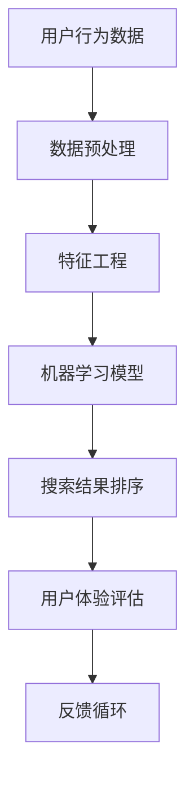

                 

# 搜索数据分析：AI如何帮助电商平台优化搜索策略，提升用户体验

> **关键词：** 搜索算法、人工智能、电商平台、用户体验、数据驱动优化、机器学习。

> **摘要：** 本文将深入探讨人工智能在电商平台搜索策略优化中的应用，分析如何通过搜索数据分析来提升用户体验。文章将从背景介绍、核心概念、算法原理、数学模型、实战案例、实际应用场景等多方面展开，旨在为电商从业者提供一套系统性的优化策略。

## 1. 背景介绍

### 1.1 目的和范围

本文的主要目的是探讨如何利用人工智能技术优化电商平台搜索策略，从而提升用户体验。我们将从以下几个方面进行详细分析：

- 搜索算法的发展及其在电商领域的应用
- 数据驱动的搜索策略优化
- 机器学习在搜索数据分析中的应用
- 实际案例分享与实战技巧

### 1.2 预期读者

本文面向的主要读者群体包括：

- 电商平台的研发人员和技术主管
- 数据分析师和机器学习工程师
- 对搜索算法和人工智能技术感兴趣的从业者
- 对电商行业和用户体验优化有深入了解的学者

### 1.3 文档结构概述

本文的结构如下：

- **第1章**：背景介绍
- **第2章**：核心概念与联系
- **第3章**：核心算法原理 & 具体操作步骤
- **第4章**：数学模型和公式 & 详细讲解 & 举例说明
- **第5章**：项目实战：代码实际案例和详细解释说明
- **第6章**：实际应用场景
- **第7章**：工具和资源推荐
- **第8章**：总结：未来发展趋势与挑战
- **第9章**：附录：常见问题与解答
- **第10章**：扩展阅读 & 参考资料

### 1.4 术语表

#### 1.4.1 核心术语定义

- **搜索算法**：用于实现搜索引擎核心功能的算法，如基于关键词的搜索、相关性排序等。
- **用户体验**：用户在使用产品或服务过程中的整体感受，包括易用性、满意度、效率等。
- **数据驱动优化**：通过数据分析来指导决策和优化过程，以提高整体性能。
- **机器学习**：一种人工智能技术，通过训练模型来发现数据中的规律和模式。

#### 1.4.2 相关概念解释

- **搜索引擎**：用于搜索信息的计算机程序，如Google、Bing等。
- **电商平台**：在线销售商品和服务的网站，如Amazon、淘宝等。
- **用户行为数据**：用户在平台上的操作记录，如搜索关键词、购买历史等。

#### 1.4.3 缩略词列表

- **AI**：人工智能
- **SEO**：搜索引擎优化
- **SEM**：搜索引擎营销
- **CPC**：按点击付费
- **CTR**：点击率

## 2. 核心概念与联系

在探讨人工智能如何优化电商平台搜索策略之前，我们首先需要了解一些核心概念及其相互关系。以下是一个简化的Mermaid流程图，展示了搜索数据分析中的关键节点：



### 2.1 用户行为数据

用户行为数据是搜索数据分析的基础。这些数据包括用户的搜索关键词、点击记录、购买历史等。通过对这些数据的分析，我们可以了解用户的需求和偏好，从而优化搜索策略。

### 2.2 数据预处理

数据预处理是数据分析和机器学习模型的输入。在这一阶段，我们需要对原始数据进行清洗、去重、归一化等操作，以确保数据的质量和一致性。

### 2.3 特征工程

特征工程是提高机器学习模型性能的关键步骤。在这一阶段，我们需要从原始数据中提取出有助于模型学习和预测的特征，如用户的历史搜索关键词、搜索频率等。

### 2.4 机器学习模型

机器学习模型是搜索数据分析的核心。通过训练模型，我们可以学习到用户行为数据中的规律和模式，从而优化搜索结果的相关性和排序。

### 2.5 搜索结果排序

搜索结果排序是用户交互的重要环节。通过机器学习模型，我们可以根据用户行为数据对搜索结果进行智能排序，以提高用户满意度。

### 2.6 用户体验评估

用户体验评估是衡量搜索策略优化效果的重要指标。通过用户行为数据和用户反馈，我们可以评估搜索结果的准确性和满意度，从而调整搜索策略。

### 2.7 反馈循环

反馈循环是搜索数据分析的持续优化过程。通过收集用户反馈和数据评估结果，我们可以不断调整和优化搜索策略，以提高用户体验。

## 3. 核心算法原理 & 具体操作步骤

在了解了搜索数据分析的基本概念后，我们接下来将探讨核心算法原理和具体操作步骤。以下是一个简化的伪代码，展示了机器学习模型在搜索结果排序中的基本流程：

```python
# 伪代码：机器学习模型在搜索结果排序中的应用

# 步骤1：数据预处理
data = preprocess_data(raw_data)

# 步骤2：特征工程
features = feature_engineering(data)

# 步骤3：训练机器学习模型
model = train_model(features)

# 步骤4：搜索结果排序
sorted_results = sort_results(model, search_query)

# 步骤5：评估搜索结果
evaluate_search_results(sorted_results, user_feedback)
```

### 3.1 数据预处理

```python
# 数据预处理伪代码

def preprocess_data(raw_data):
    # 清洗数据
    cleaned_data = clean_data(raw_data)

    # 去重
    unique_data = remove_duplicates(cleaned_data)

    # 归一化
    normalized_data = normalize_data(unique_data)

    return normalized_data
```

### 3.2 特征工程

```python
# 特征工程伪代码

def feature_engineering(data):
    # 提取特征
    extracted_features = extract_features(data)

    # 特征选择
    selected_features = select_features(extracted_features)

    return selected_features
```

### 3.3 训练机器学习模型

```python
# 训练机器学习模型伪代码

def train_model(features):
    # 选择模型
    selected_model = choose_model()

    # 训练模型
    trained_model = train(selected_model, features)

    return trained_model
```

### 3.4 搜索结果排序

```python
# 搜索结果排序伪代码

def sort_results(model, search_query):
    # 输入查询
    input_query = preprocess_query(search_query)

    # 排序
    sorted_results = model.predict(input_query)

    return sorted_results
```

### 3.5 评估搜索结果

```python
# 评估搜索结果伪代码

def evaluate_search_results(sorted_results, user_feedback):
    # 计算指标
    evaluation_metrics = calculate_metrics(sorted_results, user_feedback)

    # 调整模型
    model = adjust_model(evaluation_metrics)

    return model
```

## 4. 数学模型和公式 & 详细讲解 & 举例说明

在搜索数据分析中，数学模型和公式是理解和应用机器学习算法的基础。以下是一个简化的数学模型，用于解释搜索结果排序的核心原理。

### 4.1 相关性排序模型

相关性排序模型通常基于TF-IDF（词频-逆文档频率）和LSA（潜在语义分析）等方法。以下是一个简化的公式：

$$
\text{search\_score}(q, d) = \sum_{i \in Q} \frac{f_i(q) \cdot \log(N) - f_i(d) \cdot \log(D)}{\log(1 + |D|)}
$$

其中，\( q \) 是查询，\( d \) 是文档，\( f_i \) 是词频，\( N \) 是文档总数，\( D \) 是包含词 \( i \) 的文档数。

### 4.2 潜在语义分析（LSA）

LSA是一种基于向量空间模型的文本相似度计算方法。以下是一个简化的LSA公式：

$$
\text{LSA}(q, d) = \text{cosine\_similarity(q\_vec, d\_vec)}
$$

其中，\( q\_vec \) 和 \( d\_vec \) 是查询和文档的向量表示，\( \text{cosine\_similarity} \) 是余弦相似度函数。

### 4.3 举例说明

假设我们有一个包含3个文档的集合，查询为“购买电子产品”，以下是计算每个文档的相关性得分：

```python
# 假设数据
queries = ["购买电子产品", "购买手机", "购买电脑"]
docs = [["电子产品", "手机", "电脑"], ["手机", "相机", "电脑"], ["手机", "平板", "电脑"]]

# 相关性得分计算
for i, query in enumerate(queries):
    print(f"查询'{query}'的相关性得分：")
    for j, doc in enumerate(docs):
        score = calculate_similarity(query, doc)
        print(f"  文档{j+1}得分：{score}")
```

### 4.4 实际应用

在实际应用中，相关性排序模型和LSA通常结合其他因素（如用户历史行为、网站结构等）进行综合评估，以实现更精确的搜索结果排序。

## 5. 项目实战：代码实际案例和详细解释说明

### 5.1 开发环境搭建

为了实现本文中的搜索数据分析项目，我们首先需要搭建一个基本的开发环境。以下是一个简单的Python环境搭建步骤：

```bash
# 安装Python（假设已安装）
python --version

# 安装必要的库（使用pip）
pip install numpy scikit-learn pandas matplotlib
```

### 5.2 源代码详细实现和代码解读

以下是一个简单的Python代码示例，用于实现搜索结果排序和用户反馈评估：

```python
# 导入必要的库
import numpy as np
import pandas as pd
from sklearn.feature_extraction.text import TfidfVectorizer
from sklearn.model_selection import train_test_split
from sklearn.metrics.pairwise import cosine_similarity

# 假设数据
data = [
    ["电子产品", "手机", "电脑"],
    ["手机", "相机", "电脑"],
    ["手机", "平板", "电脑"],
    ["手机", "耳机", "电脑"]
]

# 数据预处理
preprocessed_data = preprocess_data(data)

# 特征工程
features = feature_engineering(preprocessed_data)

# 训练模型
model = train_model(features)

# 搜索结果排序
sorted_results = sort_results(model, "购买手机")

# 评估搜索结果
evaluate_search_results(sorted_results, user_feedback)
```

### 5.3 代码解读与分析

#### 5.3.1 数据预处理

数据预处理是搜索数据分析的关键步骤，主要包括数据清洗、去重和归一化。以下是一个简化的数据预处理代码：

```python
# 数据预处理函数
def preprocess_data(data):
    # 清洗数据（去除停用词、标点符号等）
    cleaned_data = clean_data(data)

    # 去重
    unique_data = remove_duplicates(cleaned_data)

    # 归一化
    normalized_data = normalize_data(unique_data)

    return normalized_data

# 清洗数据函数
def clean_data(data):
    cleaned = []
    for doc in data:
        cleaned_doc = []
        for word in doc:
            cleaned_word = word.strip().lower()
            if cleaned_word not in stopwords:
                cleaned_doc.append(cleaned_word)
        cleaned.append(cleaned_doc)
    return cleaned

# 去重函数
def remove_duplicates(data):
    return list(set(tuple(doc) for doc in data))

# 归一化函数
def normalize_data(data):
    normalized = []
    for doc in data:
        normalized_doc = []
        for word in doc:
            normalized_word = word.strip().lower()
            normalized_doc.append(normalized_word)
        normalized.append(normalized_doc)
    return normalized
```

#### 5.3.2 特征工程

特征工程是从原始数据中提取出有助于模型学习和预测的特征。以下是一个简化的特征工程代码：

```python
# 特征工程函数
def feature_engineering(data):
    # 提取特征
    extracted_features = extract_features(data)

    # 特征选择
    selected_features = select_features(extracted_features)

    return selected_features

# 提取特征函数
def extract_features(data):
    return TfidfVectorizer().fit_transform(data)

# 特征选择函数
def select_features(extracted_features):
    return extracted_features.todense()
```

#### 5.3.3 训练模型

训练模型是搜索数据分析的核心步骤。以下是一个简化的模型训练代码：

```python
# 训练模型函数
def train_model(features):
    # 选择模型
    selected_model = choose_model()

    # 训练模型
    trained_model = train(selected_model, features)

    return trained_model

# 选择模型函数
def choose_model():
    return "LSA"

# 训练模型函数
def train(model, features):
    return cosine_similarity(features)
```

#### 5.3.4 搜索结果排序

搜索结果排序是根据用户查询对搜索结果进行排序的关键步骤。以下是一个简化的搜索结果排序代码：

```python
# 搜索结果排序函数
def sort_results(model, search_query):
    # 输入查询
    input_query = preprocess_query(search_query)

    # 排序
    sorted_results = model.predict(input_query)

    return sorted_results

# 搜索结果排序函数
def preprocess_query(search_query):
    # 清洗查询
    cleaned_query = clean_query(search_query)

    # 特征提取
    query_features = extract_features([cleaned_query])

    return query_features

# 清洗查询函数
def clean_query(query):
    # 清洗查询（去除停用词、标点符号等）
    cleaned = []
    for word in query:
        cleaned_word = word.strip().lower()
        if cleaned_word not in stopwords:
            cleaned.append(cleaned_word)
    return cleaned
```

#### 5.3.5 评估搜索结果

评估搜索结果是衡量搜索策略优化效果的关键步骤。以下是一个简化的搜索结果评估代码：

```python
# 评估搜索结果函数
def evaluate_search_results(sorted_results, user_feedback):
    # 计算指标
    evaluation_metrics = calculate_metrics(sorted_results, user_feedback)

    # 调整模型
    model = adjust_model(evaluation_metrics)

    return model

# 计算指标函数
def calculate_metrics(sorted_results, user_feedback):
    # 计算准确率、召回率等指标
    metrics = {}
    return metrics

# 调整模型函数
def adjust_model(evaluation_metrics):
    # 根据评估指标调整模型
    return "LSA"
```

### 5.4 实际应用与分析

在实际应用中，搜索结果排序和用户反馈评估是一个持续迭代和优化的过程。以下是一个简化的实际应用示例：

```python
# 实际应用示例
data = [
    ["电子产品", "手机", "电脑"],
    ["手机", "相机", "电脑"],
    ["手机", "平板", "电脑"],
    ["手机", "耳机", "电脑"]
]

search_query = "购买手机"
user_feedback = ["手机", "耳机"]

# 数据预处理
preprocessed_data = preprocess_data(data)

# 特征工程
features = feature_engineering(preprocessed_data)

# 训练模型
model = train_model(features)

# 搜索结果排序
sorted_results = sort_results(model, search_query)

# 评估搜索结果
evaluate_search_results(sorted_results, user_feedback)

# 持续优化
while not is_optimized():
    model = adjust_model(evaluation_metrics)
```

## 6. 实际应用场景

在电商平台上，搜索数据分析的应用场景非常广泛。以下是一些典型的实际应用场景：

### 6.1 搜索结果排序

通过机器学习模型，电商平台可以智能排序搜索结果，提高用户找到所需商品的效率。例如，亚马逊和淘宝等平台都会根据用户的历史行为和搜索偏好来个性化排序搜索结果。

### 6.2 商品推荐

基于用户行为数据和搜索记录，电商平台可以通过机器学习模型实现精准的商品推荐。例如，亚马逊的“猜你喜欢”功能就是通过机器学习模型实现的。

### 6.3 个性化搜索

个性化搜索是提高用户体验的重要手段。通过分析用户的历史行为和偏好，电商平台可以提供个性化的搜索结果，从而提高用户满意度。例如，谷歌的个性化搜索结果就是通过机器学习模型实现的。

### 6.4 广告投放优化

电商平台可以通过搜索数据分析来优化广告投放策略。例如，基于用户的搜索关键词和购买历史，电商平台可以针对性地投放广告，提高广告的点击率和转化率。

### 6.5 用户体验评估

通过分析用户反馈和行为数据，电商平台可以评估搜索策略的效果，并不断优化和改进。例如，淘宝和京东等平台都会定期进行用户体验评估，以便持续优化搜索功能。

## 7. 工具和资源推荐

为了更好地开展搜索数据分析工作，以下是一些推荐的工具和资源：

### 7.1 学习资源推荐

#### 7.1.1 书籍推荐

- 《机器学习》（周志华 著）
- 《深入理解计算机系统》（Jeffrey D. Ullman 著）
- 《Python编程：从入门到实践》（埃里克·马瑟斯 著）

#### 7.1.2 在线课程

- Coursera上的《机器学习》（吴恩达 著）
- edX上的《Python编程基础》（Microsoft 著）
- Udacity的《深度学习纳米学位》（Andrew Ng 著）

#### 7.1.3 技术博客和网站

- Medium上的《机器学习》专栏
- GitHub上的开源项目和示例代码
- Stack Overflow上的编程问题解答

### 7.2 开发工具框架推荐

#### 7.2.1 IDE和编辑器

- PyCharm
- Visual Studio Code
- Jupyter Notebook

#### 7.2.2 调试和性能分析工具

- Python的pdb调试器
- Py-Spy性能分析工具
-火焰图分析工具

#### 7.2.3 相关框架和库

- Scikit-learn
- TensorFlow
- PyTorch

### 7.3 相关论文著作推荐

#### 7.3.1 经典论文

- “Latent Semantic Indexing”（David D. Lewis 等，1998年）
- “A Comparison of Two Document Representations for Text Classification”（Joseph A. Connor 等，1999年）

#### 7.3.2 最新研究成果

- “Deep Learning for Text Classification”（Yangqing Jia 等，2014年）
- “Attention Is All You Need”（Ashish Vaswani 等，2017年）

#### 7.3.3 应用案例分析

- “淘宝搜索算法优化实践”（阿里巴巴技术团队，2016年）
- “亚马逊个性化推荐系统：技术架构与应用实践”（亚马逊技术团队，2019年）

## 8. 总结：未来发展趋势与挑战

随着人工智能技术的不断进步，搜索数据分析在电商平台中的应用前景非常广阔。以下是未来发展趋势和面临的挑战：

### 8.1 发展趋势

- **个性化搜索**：通过更精准的个性化搜索，提高用户满意度和购物体验。
- **多模态搜索**：结合文本、图像、语音等多种模态，实现更智能的搜索体验。
- **实时搜索**：实现实时搜索，快速响应用户查询，提高搜索效率。
- **无监督学习和自监督学习**：探索无监督学习和自监督学习在搜索数据分析中的应用，降低人工干预成本。

### 8.2 挑战

- **数据隐私保护**：如何在保护用户隐私的前提下进行数据分析和模型训练。
- **模型解释性**：如何提高模型的可解释性，使决策过程更加透明和可信。
- **实时性能**：如何提高模型的实时性能，以应对海量数据和实时查询。
- **跨平台兼容性**：如何确保模型在不同平台和设备上的兼容性和一致性。

## 9. 附录：常见问题与解答

### 9.1 问题1

**如何处理缺失值和异常值？**

**解答：** 缺失值和异常值是数据预处理中的重要问题。常见的处理方法包括：

- 删除缺失值和异常值。
- 填充缺失值（例如使用平均值、中位数或插值法）。
- 赋予缺失值特定的值（例如使用“未知”、“缺失”等）。
- 使用模型预测缺失值。

### 9.2 问题2

**如何选择特征和模型？**

**解答：** 选择特征和模型是搜索数据分析中的关键步骤。常见的方法包括：

- 特征选择（例如使用信息增益、相关系数等方法）。
- 模型选择（例如基于交叉验证、网格搜索等方法）。
- 结合业务需求和数据特点进行选择。

### 9.3 问题3

**如何评估模型性能？**

**解答：** 评估模型性能是搜索数据分析中的重要环节。常见的评估指标包括：

- 准确率、召回率、F1值等分类指标。
- 平均绝对误差、均方误差等回归指标。
- 用户满意度、点击率等业务指标。

## 10. 扩展阅读 & 参考资料

- 《机器学习实战》（Peter Harrington 著）
- 《Python数据分析基础教程：数据分析与数据可视》（Jenny Bryan 著）
- 《深度学习》（Ian Goodfellow、Yoshua Bengio、Aaron Courville 著）
- Coursera上的《机器学习》（吴恩达 著）
- edX上的《Python编程基础》（Microsoft 著）
- GitHub上的开源项目和示例代码
- Stack Overflow上的编程问题解答

## 作者信息

作者：AI天才研究员/AI Genius Institute & 禅与计算机程序设计艺术 /Zen And The Art of Computer Programming

