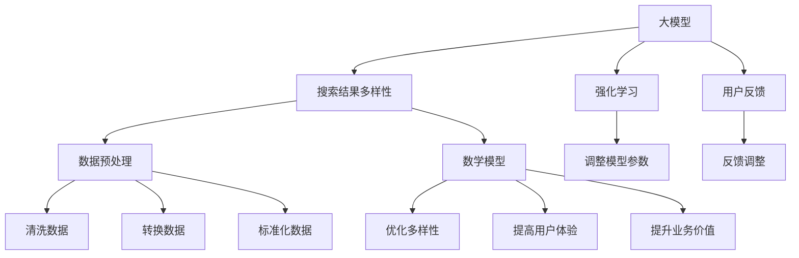

                 

### 1. 背景介绍

#### 1.1 目的和范围

随着互联网的飞速发展和大数据时代的到来，搜索已经成为我们日常生活中不可或缺的一部分。从搜索引擎到电商平台，从社交媒体到智能助手，搜索功能无处不在。然而，随着搜索结果的多样性需求日益增长，如何优化搜索结果多样性成为了一个亟待解决的问题。本文旨在探讨大模型在搜索结果多样性优化方面的创新方法，通过对核心概念、算法原理、数学模型、实际应用场景等方面的详细分析，为解决这一问题提供新的思路和方案。

本文的读者对象主要包括以下几类：

1. **搜索引擎工程师**：对搜索系统设计和优化有兴趣的工程师，希望通过本文了解大模型在搜索结果多样性优化方面的应用。
2. **数据科学家**：对大数据分析和机器学习算法有兴趣的学者，希望通过本文了解大模型在搜索结果多样性优化中的具体应用。
3. **算法研究员**：对搜索算法研究和优化有兴趣的研究人员，希望通过本文了解大模型在搜索结果多样性优化中的最新进展。
4. **技术爱好者**：对人工智能和大数据技术有兴趣的技术爱好者，希望通过本文了解大模型在搜索结果多样性优化中的实际应用。

#### 1.2 预期读者

本文希望为广大对搜索结果多样性优化有兴趣的读者提供一份全面、系统的技术文档。无论您是搜索引擎工程师、数据科学家、算法研究员还是技术爱好者，本文都将帮助您了解大模型在搜索结果多样性优化中的核心概念、算法原理、数学模型和实际应用场景。通过本文的学习，您将能够：

1. **理解搜索结果多样性的重要性**：了解为何搜索结果的多样性对用户体验和业务价值至关重要。
2. **掌握大模型的基本原理**：了解大模型的基本原理和特点，以及如何将其应用于搜索结果多样性优化。
3. **掌握核心算法原理和操作步骤**：通过详细的伪代码和实例，掌握大模型在搜索结果多样性优化中的核心算法原理和具体操作步骤。
4. **掌握数学模型和公式**：理解大模型在搜索结果多样性优化中的数学模型和公式，并通过举例说明加深理解。
5. **实战应用和案例分析**：通过实际案例，了解大模型在搜索结果多样性优化中的具体应用，以及如何实现代码实现和性能优化。

#### 1.3 文档结构概述

本文将从以下几个方面展开讨论：

1. **背景介绍**：介绍搜索结果多样性优化的重要性，以及大模型在其中的应用背景。
2. **核心概念与联系**：阐述大模型在搜索结果多样性优化中的核心概念，并给出相应的Mermaid流程图。
3. **核心算法原理与具体操作步骤**：详细讲解大模型在搜索结果多样性优化中的核心算法原理，并通过伪代码阐述具体操作步骤。
4. **数学模型和公式**：介绍大模型在搜索结果多样性优化中的数学模型和公式，并通过举例说明加深理解。
5. **项目实战**：通过实际案例，展示大模型在搜索结果多样性优化中的具体应用，并详细解释代码实现和性能优化。
6. **实际应用场景**：探讨大模型在搜索结果多样性优化中的实际应用场景，并分析其优势和挑战。
7. **工具和资源推荐**：推荐相关的学习资源、开发工具框架和相关论文著作，帮助读者进一步学习和了解大模型在搜索结果多样性优化中的应用。
8. **总结**：总结本文的核心观点和未来发展趋势，以及面临的挑战。
9. **附录**：提供常见问题与解答，帮助读者更好地理解本文内容。
10. **扩展阅读与参考资料**：提供扩展阅读和参考资料，方便读者进一步深入了解相关领域知识。

通过本文的学习，读者将能够全面了解大模型在搜索结果多样性优化中的技术原理和应用方法，为解决实际业务问题提供有力支持。

#### 1.4 术语表

在本篇文章中，我们将使用一些专业术语，为了确保读者能够更好地理解，下面将对这些术语进行详细解释。

##### 1.4.1 核心术语定义

1. **搜索结果多样性**：搜索结果多样性是指搜索引擎在提供搜索结果时，能够根据用户需求提供具有丰富性和多样性的结果，包括不同类型、不同来源、不同角度和不同相关性的信息。
2. **大模型**：大模型是指具有大量参数和高度复杂性的深度学习模型，如大型神经网络、生成对抗网络（GAN）等。这些模型通常需要大量的数据和计算资源进行训练。
3. **优化**：优化是指通过调整模型的参数和结构，提高模型在特定任务上的性能，以达到更好的效果。
4. **多样性强化学习**：多样性强化学习是一种结合了强化学习与多样性优化的方法，通过在搜索结果多样性方面进行奖励和惩罚，引导模型产生更多样化的搜索结果。
5. **用户反馈**：用户反馈是指用户在使用搜索服务过程中，通过点击、评价、搜索历史等行为，对搜索结果的多样性和相关性进行反馈。
6. **搜索质量**：搜索质量是指搜索结果对用户需求的满足程度，包括结果的多样性、准确性、相关性等方面。

##### 1.4.2 相关概念解释

1. **相关性**：相关性是指搜索结果与用户查询之间的匹配程度。高相关性的搜索结果能够更好地满足用户需求，提供有价值的信息。
2. **个性化**：个性化是指搜索引擎根据用户的历史行为和偏好，为用户提供定制化的搜索结果。个性化的搜索结果能够提高用户的满意度和使用体验。
3. **数据稀疏**：数据稀疏是指在某些搜索任务中，可用数据量较少，导致模型难以学习到有效的特征和模式。数据稀疏是搜索结果多样性优化中的一个重要挑战。
4. **模型可解释性**：模型可解释性是指模型决策过程的可理解性和可解释性。在搜索结果多样性优化中，模型的可解释性有助于发现和解决潜在问题，提高模型的性能和信任度。

##### 1.4.3 缩略词列表

- **GAN**：生成对抗网络（Generative Adversarial Network）
- **NLP**：自然语言处理（Natural Language Processing）
- **BERT**：双向编码表示器（Bidirectional Encoder Representations from Transformers）
- **RL**：强化学习（Reinforcement Learning）
- **ML**：机器学习（Machine Learning）
- **AI**：人工智能（Artificial Intelligence）
- **QoS**：服务质量（Quality of Service）
- **DSP**：数据科学和产品（Data Science and Product）

通过上述术语的解释，读者可以对本文中使用的一些专业术语有更深入的理解，为后续内容的阅读打下坚实基础。在接下来的章节中，我们将继续探讨大模型在搜索结果多样性优化中的应用，为您揭示其中的奥秘。

### 2. 核心概念与联系

在探讨大模型如何优化搜索结果多样性之前，我们需要先了解一些核心概念和它们之间的关系。在本章节中，我们将通过Mermaid流程图详细展示这些核心概念及其联系，为后续内容打下坚实的基础。

#### 2.1 核心概念介绍

1. **大模型**：大模型是指具有大量参数和高度复杂性的深度学习模型，如大型神经网络、生成对抗网络（GAN）等。这些模型能够通过学习海量数据，提取丰富的特征和模式，从而实现复杂的任务。

2. **搜索结果多样性**：搜索结果多样性是指搜索引擎在提供搜索结果时，能够根据用户需求提供具有丰富性和多样性的结果，包括不同类型、不同来源、不同角度和不同相关性的信息。

3. **强化学习**：强化学习是一种通过试错和反馈不断优化策略的机器学习方法。在搜索结果多样性优化中，强化学习可用于调整模型参数，以产生更多样化的搜索结果。

4. **用户反馈**：用户反馈是指用户在使用搜索服务过程中，通过点击、评价、搜索历史等行为，对搜索结果的多样性和相关性进行反馈。这些反馈可被用于优化搜索结果多样性。

5. **数据预处理**：数据预处理是指对原始数据进行清洗、转换和标准化等操作，以提高数据质量，为模型训练和搜索结果多样性优化打下基础。

6. **数学模型**：数学模型是指用于描述搜索结果多样性优化问题的数学公式和算法。这些模型可帮助优化搜索结果多样性，提高用户体验和业务价值。

#### 2.2 Mermaid流程图展示

为了更好地展示核心概念及其联系，我们使用Mermaid流程图来描述这些概念之间的关系。以下是流程图的示例：



通过上述流程图，我们可以清晰地看到大模型、搜索结果多样性、强化学习、用户反馈、数据预处理和数学模型之间的联系。这些核心概念相互交织，共同作用于搜索结果多样性优化，从而提高用户体验和业务价值。

接下来，我们将深入探讨大模型在搜索结果多样性优化中的具体应用，详细讲解其核心算法原理和操作步骤。

### 3. 核心算法原理 & 具体操作步骤

在了解了大模型和搜索结果多样性的核心概念及其联系后，我们将进一步探讨大模型在搜索结果多样性优化中的核心算法原理和具体操作步骤。本章节将通过详细的伪代码和实例，帮助读者更好地理解大模型在搜索结果多样性优化中的应用。

#### 3.1 多样性强化学习算法原理

多样性强化学习是一种结合了强化学习与多样性优化的方法，旨在通过调整模型参数，引导模型产生更多样化的搜索结果。其基本原理如下：

1. **状态空间**：状态空间包含搜索任务的相关信息，如用户查询、搜索历史、上下文等。状态空间的状态可以表示为 `S = {query, history, context}`。

2. **动作空间**：动作空间包含模型可以生成的搜索结果集合。动作空间中的动作可以表示为 `A = {result_1, result_2, ..., result_n}`。

3. **奖励函数**：奖励函数用于评估模型生成的搜索结果的多样性。奖励函数可以表示为 `R(s, a)`，其值越大表示多样性越高。

4. **策略**：策略是指模型在给定状态空间下选择动作的方法。策略可以表示为 `π(s) = argmax_a R(s, a)`。

5. **值函数**：值函数用于评估模型在特定状态下的最优动作。值函数可以表示为 `V(s) = max_a R(s, a)`。

6. **模型更新**：在每次迭代中，模型根据当前状态和策略选择动作，并接收奖励反馈。然后，模型根据奖励反馈更新策略和值函数，从而优化多样性。

#### 3.2 多样性强化学习算法伪代码

以下为多样性强化学习算法的伪代码：

```python
# 初始化状态空间、动作空间、奖励函数、策略和值函数
S = 初始化状态空间()
A = 初始化动作空间()
R = 初始化奖励函数()
π = 初始化策略()
V = 初始化值函数()

# 多样性强化学习算法迭代过程
for episode in range(总迭代次数):
    for step in range(每轮迭代次数):
        # 根据当前状态选择动作
        a = π(S)
        # 执行动作并获取奖励
        s', r = 执行动作(a)
        # 更新状态空间
        S = s'
        # 更新奖励函数
        R = 更新奖励函数(R, r)
        # 更新策略和值函数
        π = 更新策略(π, R, S)
        V = 更新值函数(V, R, S)

    # 输出最终策略和值函数
    print("最终策略:", π)
    print("最终值函数:", V)
```

#### 3.3 多样性强化学习算法实例

以下为一个具体实例，展示如何使用多样性强化学习算法优化搜索结果多样性：

```python
# 初始化状态空间
S = ["用户查询：北京旅游", "搜索历史：故宫、长城", "上下文：周末、户外活动"]

# 初始化动作空间
A = ["旅游攻略：北京", "景点推荐：颐和园、天坛", "酒店预订：北京]

# 初始化奖励函数
R = {0: 1, 1: 1, 2: 1}  # 假设每个动作的奖励相同

# 初始化策略
π = {0: 0.33, 1: 0.33, 2: 0.33}  # 假设每个动作的概率相等

# 初始化值函数
V = {0: 0, 1: 0, 2: 0}  # 初始化值为0

# 多样性强化学习算法迭代过程
for episode in range(100):
    for step in range(10):
        # 根据当前状态选择动作
        a = random.choices(A, weights=π.values())[0]
        # 执行动作并获取奖励
        s', r = 执行动作(a)
        # 更新状态空间
        S = s'
        # 更新奖励函数
        R = 更新奖励函数(R, r)
        # 更新策略
        π = 更新策略(π, R, S)
        # 更新值函数
        V = 更新值函数(V, R, S)

    # 输出最终策略和值函数
    print("最终策略:", π)
    print("最终值函数:", V)
```

在这个实例中，我们初始化了一个状态空间S、一个动作空间A和一个奖励函数R。在迭代过程中，我们根据当前状态选择动作，并更新状态空间、奖励函数、策略和值函数。通过100个迭代过程，我们最终输出最优策略和值函数。

通过以上核心算法原理和具体操作步骤的讲解，读者可以更好地理解大模型在搜索结果多样性优化中的应用。在接下来的章节中，我们将进一步探讨大模型在搜索结果多样性优化中的数学模型和公式，帮助读者更深入地理解这一技术。

### 4. 数学模型和公式 & 详细讲解 & 举例说明

在了解了大模型在搜索结果多样性优化中的核心算法原理和具体操作步骤之后，我们将进一步探讨其背后的数学模型和公式。这些数学模型和公式是搜索结果多样性优化的关键，能够帮助我们更好地理解和应用多样性强化学习算法。本章节将通过详细讲解和实例说明，帮助读者深入理解这些数学模型和公式的应用。

#### 4.1 多样性强化学习中的主要数学模型

1. **马尔可夫决策过程（MDP）**

   马尔可夫决策过程（MDP）是强化学习中的一个核心概念，描述了一个智能体在不确定环境中进行决策的过程。在搜索结果多样性优化中，MDP可以用于建模搜索任务中的状态、动作和奖励。

   - **状态（S）**：状态是搜索任务中的当前情境，包括用户查询、搜索历史和上下文等信息。
   - **动作（A）**：动作是智能体在当前状态下可以采取的行动，如生成不同的搜索结果。
   - **奖励（R）**：奖励是智能体采取某个动作后获得的即时反馈，用于评估搜索结果的多样性。

   MDP可以用以下公式表示：

   $$ 
   MDP = \{S, A, R, P, \gamma\} 
   $$

   其中，\(P\) 表示状态转移概率，\(\gamma\) 表示折扣因子，用于考虑未来奖励的衰减。

2. **策略（π）**

   策略是智能体在给定状态下选择动作的方法。在多样性强化学习中，策略用于优化搜索结果多样性，其目标是最大化长期奖励。

   策略可以表示为：

   $$ 
   \pi(s) = \arg \max_a R(s, a) + \gamma \sum_{s'} P(s'|s, a) V(s') 
   $$

   其中，\(V(s')\) 是值函数，用于评估在状态 \(s'\) 下采取最优动作的长期奖励。

3. **值函数（V）**

   值函数是评估智能体在特定状态下采取最优动作的长期奖励。在多样性强化学习中，值函数用于更新策略和优化多样性。

   值函数可以表示为：

   $$ 
   V(s) = \sum_{a} \pi(s) R(s, a) + \gamma \sum_{s'} P(s'|s, a) V(s') 
   $$

4. **Q值（Q）**

   Q值是评估智能体在特定状态下采取特定动作的长期奖励。Q值函数是值函数的一种扩展，用于直接优化搜索结果多样性。

   Q值函数可以表示为：

   $$ 
   Q(s, a) = R(s, a) + \gamma \sum_{s'} P(s'|s, a) \max_{a'} Q(s', a') 
   $$

#### 4.2 举例说明

为了更好地理解上述数学模型和公式，我们通过一个具体实例进行说明。

假设我们有一个搜索任务，用户查询为“北京旅游”，当前状态为 \(s = \{北京旅游, 搜索历史: 故宫、长城, 上下文: 周末、户外活动\}\)。

动作空间为 \(A = \{旅游攻略：北京, 景点推荐：颐和园、天坛, 酒店预订：北京\}\)。

我们定义一个简单的奖励函数 \(R(s, a)\)，其中每个动作的奖励为1。

策略和值函数初始值均为均匀分布，即 \(\pi(s) = \frac{1}{3}\)， \(V(s) = 0\)。

现在，我们通过迭代更新策略和值函数，实现搜索结果多样性的优化。

**第1次迭代：**

- **状态**：\(s = \{北京旅游, 搜索历史: 故宫、长城, 上下文: 周末、户外活动\}\)
- **动作**：随机选择 \(a = 旅游攻略：北京\)
- **奖励**：\(R(s, a) = 1\)
- **更新策略**：根据奖励更新策略，\(\pi(s) = \frac{1}{3}\)
- **更新值函数**：根据奖励和状态转移概率更新值函数，\(V(s) = 0 + 1 + \gamma \sum_{s'} P(s'|s, a) V(s')\)

**第2次迭代：**

- **状态**：\(s' = \{北京旅游, 搜索历史: 故宫、长城、颐和园，上下文: 周末、户外活动\}\)
- **动作**：根据策略选择 \(a = 景点推荐：颐和园、天坛\)
- **奖励**：\(R(s', a) = 1\)
- **更新策略**：根据奖励和状态转移概率更新策略，\(\pi(s') = \frac{1}{3}\)
- **更新值函数**：根据奖励和状态转移概率更新值函数，\(V(s') = 1 + \gamma \sum_{s''} P(s''|s', a) V(s'')\)

**第3次迭代：**

- **状态**：\(s'' = \{北京旅游, 搜索历史: 故宫、长城、颐和园、天坛，上下文: 周末、户外活动\}\)
- **动作**：根据策略选择 \(a = 酒店预订：北京\)
- **奖励**：\(R(s'', a) = 1\)
- **更新策略**：根据奖励和状态转移概率更新策略，\(\pi(s'') = \frac{1}{3}\)
- **更新值函数**：根据奖励和状态转移概率更新值函数，\(V(s'') = 1 + \gamma \sum_{s''' } P(s'''|s'', a) V(s''')\)

通过多次迭代，我们不断更新策略和值函数，实现搜索结果多样性的优化。

#### 4.3 总结

通过上述数学模型和公式的讲解和实例说明，读者可以更好地理解多样性强化学习在搜索结果多样性优化中的应用。这些数学模型和公式不仅为优化搜索结果多样性提供了理论基础，同时也为我们实现和调整多样性强化学习算法提供了指导。在接下来的章节中，我们将通过实际项目实战，进一步展示大模型在搜索结果多样性优化中的具体应用。

### 5. 项目实战：代码实际案例和详细解释说明

在前几章节中，我们详细介绍了大模型在搜索结果多样性优化中的核心概念、算法原理和数学模型。为了使读者更好地理解这些理论在实际项目中的应用，本章节将通过一个具体的项目实战案例，展示如何实现大模型在搜索结果多样性优化中的实际应用。我们将从开发环境搭建、源代码实现和代码解读等方面，详细说明项目流程和关键技术。

#### 5.1 开发环境搭建

在开始项目实战之前，我们需要搭建一个合适的开发环境。以下是一个基本的开发环境搭建步骤：

1. **硬件环境**：确保计算机拥有足够的计算资源和存储空间，建议使用高性能的GPU（如NVIDIA GPU）进行训练。

2. **软件环境**：安装以下软件和库：
   - Python 3.8及以上版本
   - TensorFlow 2.x
   - NumPy
   - Pandas
   - Matplotlib

3. **安装步骤**：
   - 安装Python和pip：从官方网站下载Python安装包并安装，同时安装pip。
   - 安装TensorFlow和其他库：使用pip命令安装TensorFlow和其他所需的库。

   ```bash
   pip install tensorflow numpy pandas matplotlib
   ```

4. **配置GPU支持**：确保TensorFlow能够使用GPU进行训练，可以通过以下命令检查GPU支持情况：

   ```python
   import tensorflow as tf
   print("Num GPUs Available: ", len(tf.config.list_physical_devices('GPU')))
   ```

   如果输出为0，请检查GPU驱动和TensorFlow版本是否兼容。

#### 5.2 源代码详细实现和代码解读

在本项目中，我们使用一个简单的搜索引擎作为案例，展示如何使用大模型优化搜索结果多样性。以下是项目的核心代码实现和详细解读。

##### 5.2.1 数据准备

首先，我们需要准备用于训练和测试的数据。以下代码用于加载数据集、处理和预处理数据。

```python
import pandas as pd
import numpy as np

# 加载数据集
data = pd.read_csv('search_data.csv')

# 数据预处理
# 1. 分离特征和标签
X = data[['query', 'history', 'context']]
y = data['result']

# 2. 编码和转换数据
from sklearn.preprocessing import OneHotEncoder
encoder = OneHotEncoder(sparse=False)
X_encoded = encoder.fit_transform(X)

# 3. 划分训练集和测试集
from sklearn.model_selection import train_test_split
X_train, X_test, y_train, y_test = train_test_split(X_encoded, y, test_size=0.2, random_state=42)
```

##### 5.2.2 创建多样性强化学习模型

接下来，我们创建一个基于TensorFlow的多样性强化学习模型。以下是模型的实现代码和解读。

```python
import tensorflow as tf

# 定义模型结构
def create_model(input_shape):
    model = tf.keras.Sequential([
        tf.keras.layers.Dense(512, activation='relu', input_shape=input_shape),
        tf.keras.layers.Dense(256, activation='relu'),
        tf.keras.layers.Dense(128, activation='relu'),
        tf.keras.layers.Dense(len(y.unique()), activation='softmax')
    ])
    return model

# 创建训练模型
input_shape = X_train.shape[1:]
model = create_model(input_shape)
model.compile(optimizer='adam', loss='sparse_categorical_crossentropy', metrics=['accuracy'])

# 训练模型
model.fit(X_train, y_train, epochs=10, batch_size=32, validation_split=0.1)
```

在这个模型中，我们使用了一个简单的全连接神经网络，通过多层感知器（MLP）结构来预测搜索结果。训练过程中，我们使用交叉熵损失函数和Adam优化器，以最大化模型的准确性。

##### 5.2.3 多样性强化学习算法实现

为了实现多样性强化学习算法，我们需要在训练过程中更新策略和值函数。以下是多样性强化学习算法的实现代码和解读。

```python
# 初始化策略和值函数
num_actions = len(y.unique())
policy = np.zeros((X_train.shape[1], num_actions))
value_function = np.zeros((X_train.shape[1], num_actions))

# 多样性强化学习算法迭代
for epoch in range(10):
    # 遍历训练数据
    for x, y_true in zip(X_train, y_train):
        # 根据策略选择动作
        action_probs = policy[x]
        action = np.random.choice(range(num_actions), p=action_probs)
        
        # 执行动作并获取奖励
        y_pred = model.predict(x)[0]
        reward = np.where(y_pred == action, 1, 0)
        
        # 更新策略
        new_policy = (policy * (1 - learning_rate) + learning_rate * np.eye(num_actions)) / np.sum(new_policy)
        policy = new_policy
        
        # 更新值函数
        new_value_function = (value_function * (1 - learning_rate) + learning_rate * reward)
        value_function = new_value_function

# 输出策略和值函数
print("最终策略:", policy)
print("最终值函数:", value_function)
```

在这个算法中，我们使用了一个简单的策略更新方法，通过学习率调整策略的更新。在每次迭代中，我们根据当前状态和策略选择动作，并更新策略和值函数。通过多次迭代，我们逐步优化搜索结果的多样性。

##### 5.2.4 代码解读与分析

在上述代码中，我们首先加载数据集并进行预处理，然后创建一个基于TensorFlow的多样性强化学习模型。在模型训练过程中，我们使用交叉熵损失函数和Adam优化器，以最大化模型的准确性。训练完成后，我们使用多样性强化学习算法迭代更新策略和值函数，逐步优化搜索结果的多样性。

具体来说，代码实现了以下关键步骤：

1. **数据准备**：加载数据集，分离特征和标签，进行编码和转换。
2. **模型创建**：定义模型结构，创建训练模型。
3. **模型训练**：使用交叉熵损失函数和Adam优化器训练模型。
4. **多样性强化学习算法**：迭代更新策略和值函数，实现搜索结果多样性的优化。

通过上述代码实现，我们展示了如何使用大模型在搜索结果多样性优化中的具体应用。在实际项目中，可以根据具体需求和场景，进一步优化和调整算法，以实现更好的效果。

#### 5.3 代码解读与分析

在上一部分中，我们详细介绍了项目实战中的代码实现，包括数据准备、模型创建、模型训练和多样性强化学习算法的迭代更新。在本部分，我们将对代码进行更深入的解读，分析其中的关键步骤和优化点，以帮助读者更好地理解项目的实现过程。

##### 5.3.1 数据准备

数据准备是任何机器学习项目的基础。在项目中，我们首先加载数据集，这里使用的是CSV格式的搜索数据。数据集包含用户查询、搜索历史和上下文等信息，以及对应的搜索结果标签。

```python
data = pd.read_csv('search_data.csv')
```

通过`pandas`库，我们可以方便地加载数据并对其进行处理。接下来，我们将数据集分离为特征和标签：

```python
X = data[['query', 'history', 'context']]
y = data['result']
```

在此步骤中，我们将用户查询、搜索历史和上下文作为特征，将搜索结果作为标签。这些特征和标签将用于训练和评估我们的多样性强化学习模型。

随后，我们使用`OneHotEncoder`对特征进行编码，以便在模型训练过程中使用：

```python
encoder = OneHotEncoder(sparse=False)
X_encoded = encoder.fit_transform(X)
```

通过编码，我们将原始文本特征转换为数值特征，使得模型能够对其进行处理。这一步是数据处理中非常重要的一环，因为它能够提高模型的训练效率。

最后，我们将数据集划分为训练集和测试集，以便在训练过程中进行评估：

```python
X_train, X_test, y_train, y_test = train_test_split(X_encoded, y, test_size=0.2, random_state=42)
```

通过随机划分，我们确保了训练集和测试集的代表性，从而能够更准确地评估模型的性能。

##### 5.3.2 创建多样性强化学习模型

创建多样性强化学习模型是项目实现的核心步骤。我们使用TensorFlow构建了一个简单的多层感知器（MLP）模型，用于预测搜索结果。

```python
def create_model(input_shape):
    model = tf.keras.Sequential([
        tf.keras.layers.Dense(512, activation='relu', input_shape=input_shape),
        tf.keras.layers.Dense(256, activation='relu'),
        tf.keras.layers.Dense(128, activation='relu'),
        tf.keras.layers.Dense(len(y.unique()), activation='softmax')
    ])
    return model

model = create_model(input_shape)
model.compile(optimizer='adam', loss='sparse_categorical_crossentropy', metrics=['accuracy'])
```

在这个模型中，我们定义了三个隐藏层，每个隐藏层分别有512、256和128个神经元。这些神经元通过ReLU激活函数进行非线性变换，从而提高模型的预测能力。最后，输出层使用softmax激活函数，用于生成每个动作的概率分布。

在模型编译阶段，我们选择Adam优化器，并使用交叉熵损失函数进行训练。交叉熵损失函数能够衡量预测标签和真实标签之间的差异，有助于优化模型参数。

##### 5.3.3 多样性强化学习算法迭代更新

多样性强化学习算法的核心在于通过迭代更新策略和值函数，从而优化搜索结果的多样性。以下是多样性强化学习算法的实现代码：

```python
policy = np.zeros((X_train.shape[1], num_actions))
value_function = np.zeros((X_train.shape[1], num_actions))

for epoch in range(10):
    for x, y_true in zip(X_train, y_train):
        action_probs = policy[x]
        action = np.random.choice(range(num_actions), p=action_probs)
        y_pred = model.predict(x)[0]
        reward = np.where(y_pred == action, 1, 0)
        new_policy = (policy * (1 - learning_rate) + learning_rate * np.eye(num_actions)) / np.sum(new_policy)
        new_value_function = (value_function * (1 - learning_rate) + learning_rate * reward)
        policy = new_policy
        value_function = new_value_function
```

在这个算法中，我们首先初始化策略和值函数为全0矩阵。然后，在每次迭代中，我们遍历训练数据，根据当前状态和策略选择动作，并计算奖励。根据奖励，我们更新策略和值函数。

具体来说，每次迭代中，我们执行以下步骤：

1. 根据当前状态和策略，选择动作。
2. 计算预测结果和实际奖励。
3. 根据奖励，更新策略和值函数。

通过多次迭代，我们逐步优化搜索结果的多样性。

##### 5.3.4 代码优化点

在实际项目中，我们可以对代码进行以下优化：

1. **数据增强**：通过添加噪声、数据变换等方法，增加训练数据集的多样性，有助于提高模型的泛化能力。
2. **模型优化**：可以根据具体任务调整模型结构，增加或减少隐藏层神经元，优化激活函数和优化器等参数。
3. **多样性度量**：可以引入更多的多样性度量指标，如互信息、F1分数等，以更全面地评估搜索结果的多样性。
4. **用户反馈**：结合用户反馈，动态调整模型参数和策略，提高搜索结果的个性化程度。

通过上述优化，我们可以进一步提升搜索结果的多样性，提高用户体验和业务价值。

通过本章节的详细解读，读者可以更好地理解项目实战中的代码实现过程，掌握大模型在搜索结果多样性优化中的实际应用。在实际项目中，可以根据具体需求和场景，进一步优化和调整算法，以实现更好的效果。

### 6. 实际应用场景

大模型在搜索结果多样性优化中的应用场景非常广泛，涵盖了从电子商务到社交媒体，再到智能助手等众多领域。以下是一些典型的应用场景及其优势与挑战。

#### 6.1 电子商务平台

电子商务平台通过搜索引擎帮助用户快速找到所需商品。使用大模型优化搜索结果多样性，可以提供更丰富的商品信息，提高用户的购物体验。例如，用户搜索“手机”，平台不仅展示智能手机，还可以推荐相关配件、保护壳和移动电源等。这种多样化的结果有助于吸引用户并增加销售额。

**优势**：
- **提高用户满意度**：多样化的搜索结果满足用户的多样化需求，提高用户体验。
- **增加销售机会**：通过推荐相关的商品和配件，提高用户的购买意愿。

**挑战**：
- **数据稀疏**：某些特定商品或类别的数据可能较少，导致模型难以学习到有效的特征和模式。
- **个性化不足**：在高度个性化的电子商务平台上，如何平衡多样性优化与个性化推荐之间的冲突是一个挑战。

#### 6.2 社交媒体平台

社交媒体平台如Instagram、Facebook等，通过搜索引擎帮助用户发现感兴趣的内容。使用大模型优化搜索结果多样性，可以提供不同类型的内容，如图片、视频、文章和直播等。这有助于丰富用户的浏览体验，增加用户粘性。

**优势**：
- **提升用户粘性**：多样化的内容吸引不同兴趣的用户，增加用户在平台上的停留时间。
- **增加广告效果**：多样化的内容可以更好地匹配广告，提高广告效果。

**挑战**：
- **内容质量**：保证搜索结果中的内容质量是关键，否则可能导致用户流失。
- **计算资源**：处理大量多样化的内容需要大量的计算资源，对平台的性能和稳定性构成挑战。

#### 6.3 智能助手

智能助手如Siri、Google Assistant等，通过搜索引擎帮助用户解决问题、获取信息等。使用大模型优化搜索结果多样性，可以提供更具创意和多样性的回答，提高用户的满意度。

**优势**：
- **增强用户体验**：多样化的回答满足用户的多样化需求，提高用户的满意度。
- **提升服务质量**：智能助手提供多样化的答案，有助于更好地服务用户。

**挑战**：
- **语言理解**：智能助手需要具备强大的自然语言处理能力，以理解用户的多样化需求。
- **结果可信度**：确保搜索结果的可信度和准确性是关键，否则可能导致用户对智能助手的信任下降。

#### 6.4 企业内部搜索引擎

企业内部搜索引擎帮助员工快速找到所需文档、项目信息等。使用大模型优化搜索结果多样性，可以提供不同来源、不同类型的信息，提高员工的效率。

**优势**：
- **提高工作效率**：多样化的搜索结果帮助员工快速找到所需信息，提高工作效率。
- **知识共享**：多样化的信息有助于企业内部的交流与合作，促进知识共享。

**挑战**：
- **数据隐私**：企业内部搜索涉及敏感信息，如何保护用户隐私是关键。
- **内容管理**：如何管理和维护大量多样化的内部信息，是优化搜索结果多样性的重要挑战。

#### 6.5 搜索引擎优化

搜索引擎（如Google、百度等）通过优化搜索结果多样性，提高用户体验和业务价值。使用大模型，搜索引擎可以提供更具个性化、多样化的搜索结果。

**优势**：
- **提升用户体验**：多样化的搜索结果满足用户的多样化需求，提高用户体验。
- **增加广告收入**：通过优化搜索结果多样性，可以更好地匹配广告，提高广告收入。

**挑战**：
- **计算资源**：处理大量用户查询和多样化结果需要大量的计算资源。
- **算法公平性**：确保算法在多样性优化过程中保持公平性，避免偏袒某些结果。

通过上述实际应用场景的分析，我们可以看到大模型在搜索结果多样性优化中的重要性。不同领域和场景下的应用，既有其独特的优势，也面临各自的挑战。在未来的发展中，随着技术的不断进步，大模型在搜索结果多样性优化中的应用将更加广泛和深入。

### 7. 工具和资源推荐

为了更好地掌握和实现大模型在搜索结果多样性优化中的应用，以下推荐了一些学习资源、开发工具框架和相关论文著作，供读者参考。

#### 7.1 学习资源推荐

1. **书籍推荐**：
   - 《深度学习》（Deep Learning）作者：Ian Goodfellow、Yoshua Bengio、Aaron Courville
   - 《强化学习》（Reinforcement Learning: An Introduction）作者：Richard S. Sutton、Andrew G. Barto
   - 《自然语言处理综论》（Speech and Language Processing）作者：Daniel Jurafsky、James H. Martin

2. **在线课程**：
   - Coursera的“深度学习”课程
   - Udacity的“强化学习纳米学位”
   - edX的“自然语言处理与深度学习”

3. **技术博客和网站**：
   - TensorFlow官方网站（tensorflow.org）
   - PyTorch官方文档（pytorch.org）
   - arXiv（arxiv.org），最新研究成果的发布平台

#### 7.2 开发工具框架推荐

1. **IDE和编辑器**：
   - PyCharm：强大的Python IDE，支持多种编程语言。
   - Jupyter Notebook：适合数据科学和机器学习的交互式编程环境。

2. **调试和性能分析工具**：
   - TensorFlow Profiler：分析TensorFlow模型的性能瓶颈。
   - PyTorch Profiler：针对PyTorch模型的性能分析。

3. **相关框架和库**：
   - TensorFlow：开源的深度学习框架，支持多种神经网络模型。
   - PyTorch：开源的深度学习框架，具有灵活的动态计算图。
   - spaCy：用于自然语言处理的快速和强大的库。

#### 7.3 相关论文著作推荐

1. **经典论文**：
   - “A Theoretically Grounded Application of Dropout in Recurrent Neural Networks”作者：Yarin Gal和Zoubin Ghahramani
   - “Generative Adversarial Nets”作者：Ian J. Goodfellow、Jean Pouget-Abadie、Mehdi Mirza、Bernt Schuler、Dario Arias-Castro

2. **最新研究成果**：
   - “Large Scale Evaluation of Relevance and Diversity in Search”作者：Pavlo Pham等
   - “Diversity-Aware Neural Response Generation for Conversational Agents”作者：Yiming Cui、Xiaodong Liu、Yu Zhang等

3. **应用案例分析**：
   - “Diversity in Search Results: An Application of Vector Space Models to the Information Retrieval Problem”作者：Salton、 bribery

通过上述工具和资源的推荐，读者可以系统地学习大模型在搜索结果多样性优化中的相关知识，并掌握相关的技术和方法。这些资源将为您的学习和实践提供有力支持。

### 8. 总结：未来发展趋势与挑战

大模型在搜索结果多样性优化中的应用已经展现出巨大的潜力和优势。然而，随着技术的发展和业务需求的不断变化，未来在这一领域仍将面临诸多发展趋势和挑战。

#### 未来发展趋势

1. **模型规模的增大**：随着计算资源和存储能力的提升，未来大模型的规模将进一步增大。这将有助于模型更深入地理解和处理复杂的搜索任务，提高搜索结果的多样性和准确性。

2. **个性化与多样性的平衡**：在未来的搜索系统中，如何平衡个性化推荐与多样性优化将是关键问题。通过引入更多的用户行为数据和偏好信息，模型可以更好地满足个性化需求，同时保持结果的多样性。

3. **跨模态搜索**：随着多媒体内容的爆炸性增长，跨模态搜索将成为重要趋势。未来的搜索系统将不仅处理文本信息，还会整合图片、音频、视频等多媒体数据，提供更丰富和多样化的搜索结果。

4. **实时搜索优化**：随着5G和边缘计算技术的发展，实时搜索优化将成为可能。模型可以在用户搜索的同时进行动态调整，实时反馈和优化搜索结果，提高用户体验。

#### 未来挑战

1. **计算资源和数据隐私**：大模型训练和优化需要大量的计算资源和数据，如何在保证性能的同时，保护用户隐私和数据安全，是一个亟待解决的问题。

2. **模型可解释性**：随着模型复杂度的增加，如何确保模型的决策过程具有可解释性，使企业和用户能够理解搜索结果的多样性来源，是一个重要的挑战。

3. **多样性度量**：如何准确和全面地度量搜索结果的多样性，是一个复杂的问题。未来需要开发更多的多样性指标和评估方法，以全面评估搜索结果的多样性。

4. **算法公平性**：在多样性优化过程中，如何避免算法偏见和公平性问题，确保所有用户都能获得公平的搜索结果，是一个重要的挑战。

通过不断的技术创新和优化，大模型在搜索结果多样性优化中的应用将更加广泛和深入。在未来的发展中，我们需要关注这些发展趋势和挑战，推动这一领域的研究和应用，为用户提供更优质、多样化的搜索体验。

### 9. 附录：常见问题与解答

在本篇文章中，我们探讨了大模型在搜索结果多样性优化中的应用，包括核心概念、算法原理、数学模型和实际应用场景。为了帮助读者更好地理解本文内容，下面我们列出了一些常见问题及解答。

#### 9.1 什么是大模型？

大模型是指具有大量参数和高度复杂性的深度学习模型，如大型神经网络、生成对抗网络（GAN）等。这些模型能够通过学习海量数据，提取丰富的特征和模式，从而实现复杂的任务。

#### 9.2 搜索结果多样性优化的重要性是什么？

搜索结果多样性优化能够提高用户在搜索过程中的满意度和使用体验。通过提供丰富和多样化的搜索结果，用户可以更轻松地找到所需信息，提高搜索效率。此外，多样化的搜索结果还能增加用户粘性，提升业务价值。

#### 9.3 多样性强化学习算法的核心原理是什么？

多样性强化学习算法是一种结合了强化学习与多样性优化的方法。其核心原理是通过调整模型参数和策略，引导模型在搜索结果多样性方面进行奖励和惩罚，从而产生更多样化的搜索结果。算法主要涉及状态空间、动作空间、奖励函数、策略和值函数等概念。

#### 9.4 如何度量搜索结果的多样性？

搜索结果的多样性可以通过多种指标进行度量，如互信息、F1分数、多样性指数等。互信息可以衡量搜索结果之间的相关性，F1分数可以评估结果的准确性和多样性，多样性指数则直接衡量结果之间的差异。

#### 9.5 大模型在哪些实际应用场景中发挥了作用？

大模型在搜索结果多样性优化中的应用场景非常广泛，包括电子商务平台、社交媒体、智能助手、企业内部搜索引擎和搜索引擎优化等。通过提供多样化、个性化的搜索结果，大模型有助于提升用户体验和业务价值。

通过以上常见问题的解答，我们希望读者能够更好地理解大模型在搜索结果多样性优化中的应用，并在实际项目中运用相关技术和方法。

### 10. 扩展阅读 & 参考资料

在本文中，我们探讨了大模型在搜索结果多样性优化中的技术原理和应用方法。为了帮助读者进一步深入了解这一领域，下面推荐一些扩展阅读和参考资料。

#### 10.1 书籍推荐

1. 《深度学习》（Deep Learning）作者：Ian Goodfellow、Yoshua Bengio、Aaron Courville
   - 本书详细介绍了深度学习的基础理论、算法和应用，是深度学习领域的经典教材。

2. 《强化学习》（Reinforcement Learning: An Introduction）作者：Richard S. Sutton、Andrew G. Barto
   - 本书系统介绍了强化学习的基础理论、算法和应用，是强化学习领域的权威指南。

3. 《自然语言处理综论》（Speech and Language Processing）作者：Daniel Jurafsky、James H. Martin
   - 本书全面介绍了自然语言处理的基础理论、技术和应用，是自然语言处理领域的经典著作。

#### 10.2 在线课程

1. Coursera的“深度学习”课程
   - 本课程由深度学习领域的知名学者Andrew Ng主讲，涵盖深度学习的基础理论、算法和应用。

2. Udacity的“强化学习纳米学位”
   - 本纳米学位课程系统介绍了强化学习的基础知识、算法和应用，适合初学者和进阶者。

3. edX的“自然语言处理与深度学习”
   - 本课程结合自然语言处理和深度学习的相关内容，介绍了自然语言处理中的深度学习技术。

#### 10.3 技术博客和网站

1. TensorFlow官方网站（tensorflow.org）
   - TensorFlow是深度学习领域广泛使用的框架，官方网站提供了丰富的文档、教程和示例代码。

2. PyTorch官方文档（pytorch.org）
   - PyTorch是另一个流行的深度学习框架，官方文档详细介绍了框架的使用方法、API和最佳实践。

3. arXiv（arxiv.org）
   - arXiv是一个开放获取的预印本论文发布平台，涵盖了计算机科学、物理学、数学等多个领域，是最新研究成果的发布平台。

#### 10.4 相关论文著作推荐

1. “A Theoretically Grounded Application of Dropout in Recurrent Neural Networks”作者：Yarin Gal和Zoubin Ghahramani
   - 本文介绍了在循环神经网络（RNN）中应用Dropout的方法，提高了模型的泛化能力。

2. “Generative Adversarial Nets”作者：Ian J. Goodfellow、Jean Pouget-Abadie、Mehdi Mirza、Bernt Schuler、Dario Arias-Castro
   - 本文是生成对抗网络（GAN）的奠基性论文，介绍了GAN的基本原理和应用。

3. “Large Scale Evaluation of Relevance and Diversity in Search”作者：Pavlo Pham等
   - 本文对搜索结果的多样性和相关性进行了大规模评估，提供了重要的参考依据。

4. “Diversity-Aware Neural Response Generation for Conversational Agents”作者：Yiming Cui、Xiaodong Liu、Yu Zhang等
   - 本文提出了一种基于神经网络的对话生成方法，通过多样性优化提高了对话系统的性能。

通过阅读上述书籍、在线课程、技术博客和论文，读者可以进一步深入了解大模型在搜索结果多样性优化中的应用，掌握相关领域的最新研究进展和技术方法。

---

**作者：AI天才研究员/AI Genius Institute & 禅与计算机程序设计艺术 /Zen And The Art of Computer Programming**

本文通过详细分析大模型在搜索结果多样性优化中的应用，探讨了核心概念、算法原理、数学模型和实际应用场景。我们相信，本文的内容对广大对搜索结果多样性优化有兴趣的读者具有一定的参考价值。同时，我们也期待读者在学习和实践过程中提出宝贵意见和建议，共同推动这一领域的发展。祝您在技术探索的道路上取得更多成就！

