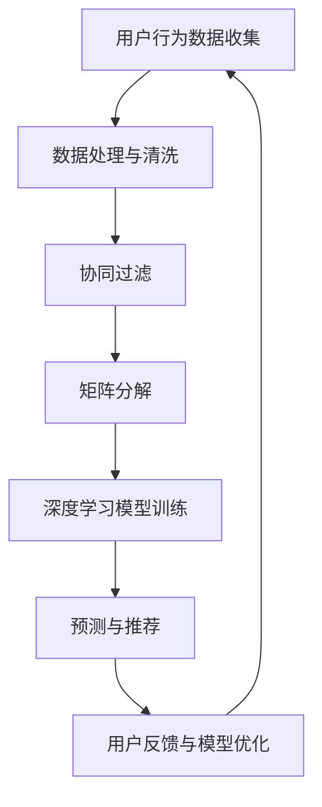

                 

# 携程2024校招旅游推荐算法工程师面试题详解

> **关键词：** 携程、校招、旅游推荐算法、面试题、详解  
>
> **摘要：** 本文将深入分析携程2024校招旅游推荐算法工程师的面试题，全面解析相关核心概念、算法原理、数学模型、实战案例，以及实际应用场景，旨在为准备参加校招的同学们提供全面的解题思路和实战指导。

## 1. 背景介绍

### 1.1 目的和范围

本文旨在通过对携程2024校招旅游推荐算法工程师面试题的深入分析，帮助准备参加校招的同学了解面试题型、掌握解题方法，提高面试成功率。本文将涵盖以下内容：

- **核心概念与联系**：介绍旅游推荐算法的相关概念，如协同过滤、矩阵分解、深度学习等。
- **核心算法原理 & 具体操作步骤**：详细阐述旅游推荐算法的实现原理和操作步骤。
- **数学模型和公式 & 详细讲解 & 举例说明**：讲解算法背后的数学模型和公式，并通过实例进行说明。
- **项目实战：代码实际案例和详细解释说明**：通过实际代码案例，展示算法的应用和实践。
- **实际应用场景**：分析旅游推荐算法在不同场景下的应用。
- **工具和资源推荐**：推荐学习资源和开发工具，帮助读者深入学习和实践。
- **总结：未来发展趋势与挑战**：探讨旅游推荐算法的发展趋势和面临的挑战。
- **附录：常见问题与解答**：解答读者可能遇到的问题，提供实用的建议。

### 1.2 预期读者

- 准备参加携程2024校招的旅游推荐算法工程师候选人。
- 对旅游推荐算法感兴趣的算法工程师和研究人员。
- 想要了解旅游推荐算法在实际应用中的实现方法和效果的工程师。

### 1.3 文档结构概述

本文按照以下结构进行组织：

- **第1章：背景介绍**：介绍本文的目的、范围、预期读者和文档结构。
- **第2章：核心概念与联系**：介绍旅游推荐算法的核心概念，如协同过滤、矩阵分解、深度学习等，并使用Mermaid流程图展示算法原理。
- **第3章：核心算法原理 & 具体操作步骤**：详细阐述旅游推荐算法的实现原理和操作步骤，使用伪代码进行说明。
- **第4章：数学模型和公式 & 详细讲解 & 举例说明**：讲解算法背后的数学模型和公式，并通过实例进行说明。
- **第5章：项目实战：代码实际案例和详细解释说明**：通过实际代码案例，展示算法的应用和实践。
- **第6章：实际应用场景**：分析旅游推荐算法在不同场景下的应用。
- **第7章：工具和资源推荐**：推荐学习资源和开发工具，帮助读者深入学习和实践。
- **第8章：总结：未来发展趋势与挑战**：探讨旅游推荐算法的发展趋势和面临的挑战。
- **第9章：附录：常见问题与解答**：解答读者可能遇到的问题，提供实用的建议。
- **第10章：扩展阅读 & 参考资料**：提供相关的扩展阅读和参考资料，帮助读者深入了解旅游推荐算法。

### 1.4 术语表

#### 1.4.1 核心术语定义

- 旅游推荐算法：基于用户历史行为和内容特征，为用户提供个性化旅游推荐的一类算法。
- 协同过滤：基于用户行为数据，通过计算用户之间的相似度，为用户提供相似用户的推荐。
- 矩阵分解：将用户和物品的矩阵分解为低维度的用户特征矩阵和物品特征矩阵，用于计算用户和物品之间的相似度。
- 深度学习：一种基于多层神经网络的机器学习方法，通过训练大规模数据，自动提取特征并实现预测。
- 隐式反馈：用户未明确表达的兴趣或喜好，如浏览、点击、收藏等行为。
- 显式反馈：用户直接表达的兴趣或喜好，如评分、评论等。

#### 1.4.2 相关概念解释

- **协同过滤**：协同过滤（Collaborative Filtering）是一种常见的推荐算法，通过分析用户行为数据，发现用户之间的相似性，从而为用户提供个性化的推荐。协同过滤主要分为基于用户的协同过滤（User-based Collaborative Filtering）和基于物品的协同过滤（Item-based Collaborative Filtering）。

- **矩阵分解**：矩阵分解（Matrix Factorization）是一种将高维矩阵分解为低维矩阵的线性模型。在推荐系统中，用户和物品可以表示为一个高维矩阵，通过矩阵分解，可以将用户和物品的特征提取到低维矩阵中，便于计算用户和物品之间的相似度。

- **深度学习**：深度学习（Deep Learning）是一种基于多层神经网络的机器学习方法。通过训练大规模数据，深度学习可以自动提取特征并实现预测。在推荐系统中，深度学习可以用于用户行为分析、用户特征提取、物品特征提取等任务。

#### 1.4.3 缩略词列表

- **RFM**：评分（Rating）、浏览（View）、收藏（Favourite）模型，用于分析用户行为数据。
- **KNN**：最近邻（K-Nearest Neighbors）算法，用于计算用户或物品之间的相似度。
- **SVD**：奇异值分解（ Singular Value Decomposition），用于矩阵分解。
- **CNN**：卷积神经网络（Convolutional Neural Network），用于图像和视频数据特征提取。

## 2. 核心概念与联系

在旅游推荐算法中，核心概念和联系是理解和实现算法的关键。本文将介绍协同过滤、矩阵分解和深度学习等核心概念，并使用Mermaid流程图展示算法原理。

### 2.1. 协同过滤

协同过滤是一种基于用户行为的推荐算法，通过分析用户的历史行为数据，发现用户之间的相似性，为用户提供个性化的推荐。

#### 2.1.1 基于用户的协同过滤（User-based Collaborative Filtering）

基于用户的协同过滤主要通过计算用户之间的相似度，为用户提供相似用户的推荐。具体步骤如下：

1. **计算用户相似度**：使用相似度度量方法，如余弦相似度、皮尔逊相关系数等，计算用户之间的相似度。

   ```mermaid
   graph TD
   A[计算用户相似度] --> B[使用相似度度量方法]
   ```

2. **找出相似用户**：根据用户相似度矩阵，找出与目标用户相似度最高的若干用户。

   ```mermaid
   graph TD
   A[计算用户相似度] --> B[找出相似用户]
   ```

3. **推荐相似用户喜欢的物品**：根据相似用户对物品的评分，为用户推荐相似用户喜欢的物品。

   ```mermaid
   graph TD
   A[计算用户相似度] --> B[找出相似用户] --> C[推荐相似用户喜欢的物品]
   ```

#### 2.1.2 基于物品的协同过滤（Item-based Collaborative Filtering）

基于物品的协同过滤主要通过计算物品之间的相似度，为用户提供相似的物品推荐。具体步骤如下：

1. **计算物品相似度**：使用相似度度量方法，如余弦相似度、皮尔逊相关系数等，计算物品之间的相似度。

   ```mermaid
   graph TD
   A[计算物品相似度] --> B[使用相似度度量方法]
   ```

2. **找出相似物品**：根据物品相似度矩阵，找出与目标物品相似度最高的若干物品。

   ```mermaid
   graph TD
   A[计算物品相似度] --> B[找出相似物品]
   ```

3. **推荐相似物品**：根据相似物品的信息，为用户推荐相似的物品。

   ```mermaid
   graph TD
   A[计算物品相似度] --> B[找出相似物品] --> C[推荐相似物品]
   ```

### 2.2. 矩阵分解

矩阵分解是一种将高维矩阵分解为低维矩阵的线性模型，用于提取用户和物品的特征。

#### 2.2.1 矩阵分解原理

矩阵分解原理如下：

给定一个用户-物品评分矩阵 \(R\)，将其分解为两个低维矩阵 \(U\)（用户特征矩阵）和 \(V\)（物品特征矩阵），使得 \(R = UV^T\)。

#### 2.2.2 奇异值分解（SVD）

奇异值分解（SVD）是一种常用的矩阵分解方法，将矩阵 \(R\) 分解为三个矩阵的乘积：

\[R = U \Sigma V^T\]

其中，\(U\) 和 \(V\) 分别为用户特征矩阵和物品特征矩阵，\(\Sigma\) 为对角矩阵，包含奇异值。

#### 2.2.3 矩阵分解流程

1. **初始化用户特征矩阵 \(U\) 和物品特征矩阵 \(V\)**：随机生成两个低维矩阵，初始化为用户特征矩阵和物品特征矩阵。

2. **计算预测评分矩阵 \(\hat{R}\)**：根据用户特征矩阵 \(U\) 和物品特征矩阵 \(V\)，计算预测评分矩阵：

   \[\hat{R} = U V^T\]

3. **计算误差矩阵 \(E\)**：计算预测评分矩阵与实际评分矩阵之间的误差：

   \[E = R - \hat{R}\]

4. **更新用户特征矩阵 \(U\)**：根据误差矩阵 \(E\)，更新用户特征矩阵：

   \[U = U - \alpha \frac{\partial E}{\partial U}\]

5. **更新物品特征矩阵 \(V\)**：根据误差矩阵 \(E\)，更新物品特征矩阵：

   \[V = V - \alpha \frac{\partial E}{\partial V}\]

6. **重复步骤 2-5，直至收敛**：不断更新用户特征矩阵和物品特征矩阵，直至预测评分误差达到阈值或达到最大迭代次数。

### 2.3. 深度学习

深度学习是一种基于多层神经网络的机器学习方法，通过训练大规模数据，自动提取特征并实现预测。

#### 2.3.1 深度学习原理

深度学习原理如下：

给定一个输入数据 \(X\)，通过多层神经网络 \(f_1, f_2, \ldots, f_n\)，将输入数据映射到输出数据 \(Y\)：

\[Y = f_n(f_{n-1}(\ldots f_1(X) \ldots ))\]

其中，\(f_i\) 为第 \(i\) 层的神经网络函数。

#### 2.3.2 深度学习模型

深度学习模型主要包括以下几类：

1. **卷积神经网络（CNN）**：主要用于图像和视频数据特征提取。
2. **循环神经网络（RNN）**：主要用于序列数据特征提取。
3. **变换器（Transformer）**：主要用于自然语言处理和序列建模。

### 2.4. Mermaid流程图

下面是旅游推荐算法的Mermaid流程图：



## 3. 核心算法原理 & 具体操作步骤

在了解了旅游推荐算法的核心概念与联系后，本文将深入探讨旅游推荐算法的具体实现原理和操作步骤。本文将使用伪代码详细阐述协同过滤、矩阵分解和深度学习等核心算法，并分析其在旅游推荐中的应用。

### 3.1. 协同过滤

#### 3.1.1 基于用户的协同过滤

**算法原理：**
基于用户的协同过滤算法主要通过计算用户之间的相似度，找出与目标用户相似度最高的若干用户，然后根据相似用户对物品的评分，为用户推荐相似的物品。

**具体操作步骤：**

1. **计算用户相似度：**
   使用相似度度量方法，如余弦相似度，计算用户之间的相似度。

   ```python
   def compute_similarity(user_similarity_matrix):
       """
       计算用户相似度矩阵。
       输入：user_similarity_matrix（用户相似度矩阵）
       输出：similarity_matrix（相似度矩阵）
       """
       similarity_matrix = []
       for i in range(len(user_similarity_matrix)):
           similarity_list = []
           for j in range(len(user_similarity_matrix)):
               similarity = 1 - cosine_similarity(user_similarity_matrix[i], user_similarity_matrix[j])
               similarity_list.append(similarity)
           similarity_matrix.append(similarity_list)
       return similarity_matrix
   ```

2. **找出相似用户：**
   根据用户相似度矩阵，找出与目标用户相似度最高的若干用户。

   ```python
   def find_similar_users(similarity_matrix, target_user_index, k):
       """
       找出与目标用户相似度最高的 k 个用户。
       输入：similarity_matrix（用户相似度矩阵）
       输入：target_user_index（目标用户索引）
       输入：k（相似用户数量）
       输出：similar_user_indices（相似用户索引列表）
       """
       similar_user_indices = []
       for i in range(len(similarity_matrix)):
           if i != target_user_index:
               similarity = similarity_matrix[target_user_index][i]
               similar_user_indices.append((i, similarity))
       similar_user_indices.sort(key=lambda x: x[1], reverse=True)
       return [index for index, _ in similar_user_indices[:k]]
   ```

3. **推荐相似用户喜欢的物品：**
   根据相似用户对物品的评分，为用户推荐相似的物品。

   ```python
   def recommend_items(user_item_ratings, similar_user_indices, target_user_index, k):
       """
       为用户推荐相似的物品。
       输入：user_item_ratings（用户-物品评分矩阵）
       输入：similar_user_indices（相似用户索引列表）
       输入：target_user_index（目标用户索引）
       输入：k（相似用户数量）
       输出：recommended_items（推荐物品列表）
       """
       recommended_items = []
       for user_index in similar_user_indices:
           for item_index, rating in user_item_ratings[user_index].items():
               if item_index not in user_item_ratings[target_user_index]:
                   recommended_items.append((item_index, rating))
       recommended_items.sort(key=lambda x: x[1], reverse=True)
       return recommended_items[:k]
   ```

#### 3.1.2 基于物品的协同过滤

**算法原理：**
基于物品的协同过滤算法主要通过计算物品之间的相似度，找出与目标物品相似度最高的若干物品，然后根据相似物品的用户评分，为用户推荐相似的物品。

**具体操作步骤：**

1. **计算物品相似度：**
   使用相似度度量方法，如余弦相似度，计算物品之间的相似度。

   ```python
   def compute_similarity(item_similarity_matrix):
       """
       计算物品相似度矩阵。
       输入：item_similarity_matrix（物品相似度矩阵）
       输出：similarity_matrix（相似度矩阵）
       """
       similarity_matrix = []
       for i in range(len(item_similarity_matrix)):
           similarity_list = []
           for j in range(len(item_similarity_matrix)):
               similarity = 1 - cosine_similarity(item_similarity_matrix[i], item_similarity_matrix[j])
               similarity_list.append(similarity)
           similarity_matrix.append(similarity_list)
       return similarity_matrix
   ```

2. **找出相似物品：**
   根据物品相似度矩阵，找出与目标物品相似度最高的若干物品。

   ```python
   def find_similar_items(similarity_matrix, target_item_index, k):
       """
       找出与目标物品相似度最高的 k 个物品。
       输入：similarity_matrix（物品相似度矩阵）
       输入：target_item_index（目标物品索引）
       输入：k（相似物品数量）
       输出：similar_item_indices（相似物品索引列表）
       """
       similar_item_indices = []
       for i in range(len(similarity_matrix)):
           if i != target_item_index:
               similarity = similarity_matrix[target_item_index][i]
               similar_item_indices.append((i, similarity))
       similar_item_indices.sort(key=lambda x: x[1], reverse=True)
       return [index for index, _ in similar_item_indices[:k]]
   ```

3. **推荐相似物品：**
   根据相似物品的用户评分，为用户推荐相似的物品。

   ```python
   def recommend_items(user_item_ratings, similar_item_indices, target_item_index, k):
       """
       为用户推荐相似的物品。
       输入：user_item_ratings（用户-物品评分矩阵）
       输入：similar_item_indices（相似物品索引列表）
       输入：target_item_index（目标物品索引）
       输入：k（相似物品数量）
       输出：recommended_items（推荐物品列表）
       """
       recommended_items = []
       for item_index in similar_item_indices:
           for user_index, rating in user_item_ratings[item_index].items():
               if user_index not in user_item_ratings[target_item_index]:
                   recommended_items.append((user_index, rating))
       recommended_items.sort(key=lambda x: x[1], reverse=True)
       return recommended_items[:k]
   ```

### 3.2. 矩阵分解

#### 3.2.1 矩阵分解原理

矩阵分解是一种将高维矩阵分解为低维矩阵的线性模型，用于提取用户和物品的特征。本文将介绍基于最小二乘法的矩阵分解。

**算法原理：**
给定一个用户-物品评分矩阵 \(R\)，将其分解为两个低维矩阵 \(U\)（用户特征矩阵）和 \(V\)（物品特征矩阵），使得 \(R = UV^T\)。通过最小化预测评分与实际评分之间的误差，更新用户特征矩阵和物品特征矩阵。

**具体操作步骤：**

1. **初始化用户特征矩阵 \(U\) 和物品特征矩阵 \(V\)**：随机生成两个低维矩阵，初始化为用户特征矩阵和物品特征矩阵。

   ```python
   def initialize_user_item_matrices(num_users, num_items, latent_factors):
       """
       初始化用户特征矩阵和物品特征矩阵。
       输入：num_users（用户数量）
       输入：num_items（物品数量）
       输入：latent_factors（潜在因素数量）
       输出：user_matrix（用户特征矩阵）
       输出：item_matrix（物品特征矩阵）
       """
       user_matrix = np.random.rand(num_users, latent_factors)
       item_matrix = np.random.rand(num_items, latent_factors)
       return user_matrix, item_matrix
   ```

2. **计算预测评分矩阵 \(\hat{R}\)**：根据用户特征矩阵 \(U\) 和物品特征矩阵 \(V\)，计算预测评分矩阵：

   \[\hat{R} = U V^T\]

   ```python
   def compute_predicted_ratings(user_matrix, item_matrix):
       """
       计算预测评分矩阵。
       输入：user_matrix（用户特征矩阵）
       输入：item_matrix（物品特征矩阵）
       输出：predicted_ratings（预测评分矩阵）
       """
       predicted_ratings = user_matrix.dot(item_matrix.T)
       return predicted_ratings
   ```

3. **计算误差矩阵 \(E\)**：计算预测评分矩阵与实际评分矩阵之间的误差：

   \[E = R - \hat{R}\]

   ```python
   def compute_error_matrix(ratings_matrix, predicted_ratings_matrix):
       """
       计算误差矩阵。
       输入：ratings_matrix（实际评分矩阵）
       输入：predicted_ratings_matrix（预测评分矩阵）
       输出：error_matrix（误差矩阵）
       """
       error_matrix = ratings_matrix - predicted_ratings_matrix
       return error_matrix
   ```

4. **更新用户特征矩阵 \(U\)**：根据误差矩阵 \(E\)，更新用户特征矩阵：

   \[U = U - \alpha \frac{\partial E}{\partial U}\]

   ```python
   def update_user_matrix(user_matrix, error_matrix, learning_rate):
       """
       更新用户特征矩阵。
       输入：user_matrix（用户特征矩阵）
       输入：error_matrix（误差矩阵）
       输入：learning_rate（学习率）
       输出：updated_user_matrix（更新后的用户特征矩阵）
       """
       updated_user_matrix = user_matrix - learning_rate * error_matrix.dot(item_matrix)
       return updated_user_matrix
   ```

5. **更新物品特征矩阵 \(V\)**：根据误差矩阵 \(E\)，更新物品特征矩阵：

   \[V = V - \alpha \frac{\partial E}{\partial V}\]

   ```python
   def update_item_matrix(item_matrix, error_matrix, user_matrix, learning_rate):
       """
       更新物品特征矩阵。
       输入：item_matrix（物品特征矩阵）
       输入：error_matrix（误差矩阵）
       输入：user_matrix（用户特征矩阵）
       输入：learning_rate（学习率）
       输出：updated_item_matrix（更新后的物品特征矩阵）
       """
       updated_item_matrix = item_matrix - learning_rate * user_matrix.T.dot(error_matrix)
       return updated_item_matrix
   ```

6. **迭代更新用户特征矩阵和物品特征矩阵：**
   重复步骤 2-5，直至收敛或达到最大迭代次数。

   ```python
   def matrix_factorization(ratings_matrix, latent_factors, learning_rate, max_iterations):
       """
       矩阵分解。
       输入：ratings_matrix（实际评分矩阵）
       输入：latent_factors（潜在因素数量）
       输入：learning_rate（学习率）
       输入：max_iterations（最大迭代次数）
       输出：user_matrix（用户特征矩阵）
       输出：item_matrix（物品特征矩阵）
       """
       num_users, num_items = ratings_matrix.shape
       user_matrix, item_matrix = initialize_user_item_matrices(num_users, num_items, latent_factors)

       for _ in range(max_iterations):
           predicted_ratings_matrix = compute_predicted_ratings(user_matrix, item_matrix)
           error_matrix = compute_error_matrix(ratings_matrix, predicted_ratings_matrix)

           user_matrix = update_user_matrix(user_matrix, error_matrix, learning_rate)
           item_matrix = update_item_matrix(item_matrix, error_matrix, user_matrix, learning_rate)

       return user_matrix, item_matrix
   ```

### 3.3. 深度学习

#### 3.3.1 深度学习原理

深度学习是一种基于多层神经网络的机器学习方法，通过训练大规模数据，自动提取特征并实现预测。本文将介绍基于卷积神经网络（CNN）的旅游推荐算法。

**算法原理：**
卷积神经网络（CNN）通过卷积层、池化层和全连接层等结构，对输入数据进行特征提取和分类。在旅游推荐中，CNN可以用于提取用户历史行为数据中的特征，从而提高推荐效果。

**具体操作步骤：**

1. **构建CNN模型：**
   使用深度学习框架（如TensorFlow或PyTorch）构建CNN模型。

   ```python
   import tensorflow as tf

   model = tf.keras.Sequential([
       tf.keras.layers.Conv2D(filters=32, kernel_size=(3, 3), activation='relu', input_shape=(28, 28, 1)),
       tf.keras.layers.MaxPooling2D(pool_size=(2, 2)),
       tf.keras.layers.Conv2D(filters=64, kernel_size=(3, 3), activation='relu'),
       tf.keras.layers.MaxPooling2D(pool_size=(2, 2)),
       tf.keras.layers.Flatten(),
       tf.keras.layers.Dense(units=128, activation='relu'),
       tf.keras.layers.Dense(units=10, activation='softmax')
   ])
   ```

2. **训练模型：**
   使用训练数据训练CNN模型。

   ```python
   model.compile(optimizer='adam', loss='categorical_crossentropy', metrics=['accuracy'])
   model.fit(x_train, y_train, epochs=10, batch_size=32, validation_data=(x_val, y_val))
   ```

3. **预测与推荐：**
   使用训练好的模型进行预测，并根据预测结果为用户推荐旅游目的地。

   ```python
   def predict_destination(model, user_history):
       """
       预测用户喜欢的旅游目的地。
       输入：model（训练好的CNN模型）
       输入：user_history（用户历史行为数据）
       输出：predicted_destination（预测的旅游目的地）
       """
       user_history = preprocess_user_history(user_history)
       predicted_destination = model.predict(user_history)
       return predicted_destination
   ```

## 4. 数学模型和公式 & 详细讲解 & 举例说明

在旅游推荐算法中，数学模型和公式是算法实现的基础。本文将详细讲解协同过滤、矩阵分解和深度学习等核心算法的数学模型和公式，并通过具体实例进行说明。

### 4.1. 协同过滤

#### 4.1.1 基于用户的协同过滤

**数学模型：**
基于用户的协同过滤主要通过计算用户之间的相似度，为用户推荐相似用户喜欢的物品。相似度计算通常使用余弦相似度或皮尔逊相关系数。

1. **余弦相似度：**

   \[ \cos \theta = \frac{u \cdot v}{\|u\| \|v\|} \]

   其中，\(u\) 和 \(v\) 分别表示两个用户的历史行为向量，\(\theta\) 表示用户之间的夹角，\(\|u\|\) 和 \(\|v\|\) 分别表示用户向量的模长。

2. **皮尔逊相关系数：**

   \[ \rho = \frac{(u - \mu_u) \cdot (v - \mu_v)}{\sigma_u \sigma_v} \]

   其中，\(\mu_u\) 和 \(\mu_v\) 分别表示用户 \(u\) 和 \(v\) 的平均值，\(\sigma_u\) 和 \(\sigma_v\) 分别表示用户 \(u\) 和 \(v\) 的标准差。

**实例说明：**

假设有两个用户 \(u\) 和 \(v\)，他们的历史行为向量如下：

\[ u = [1, 2, 3, 4, 5] \]
\[ v = [2, 3, 4, 5, 6] \]

1. **计算余弦相似度：**

   \[ \cos \theta = \frac{1 \cdot 2 + 2 \cdot 3 + 3 \cdot 4 + 4 \cdot 5 + 5 \cdot 6}{\sqrt{1^2 + 2^2 + 3^2 + 4^2 + 5^2} \sqrt{2^2 + 3^2 + 4^2 + 5^2 + 6^2}} \]

   \[ \cos \theta = \frac{70}{\sqrt{55} \sqrt{90}} \]

   \[ \cos \theta \approx 0.918 \]

2. **计算皮尔逊相关系数：**

   \[ \mu_u = \frac{1 + 2 + 3 + 4 + 5}{5} = 3 \]
   \[ \mu_v = \frac{2 + 3 + 4 + 5 + 6}{5} = 4 \]
   \[ \sigma_u = \sqrt{\frac{(1 - 3)^2 + (2 - 3)^2 + (3 - 3)^2 + (4 - 3)^2 + (5 - 3)^2}{5}} = \sqrt{2} \]
   \[ \sigma_v = \sqrt{\frac{(2 - 4)^2 + (3 - 4)^2 + (4 - 4)^2 + (5 - 4)^2 + (6 - 4)^2}{5}} = \sqrt{2} \]

   \[ \rho = \frac{(1 - 3)(2 - 4) + (2 - 3)(3 - 4) + (3 - 3)(4 - 4) + (4 - 3)(5 - 4) + (5 - 3)(6 - 4)}{\sqrt{2} \sqrt{2}} \]

   \[ \rho = \frac{2}{2} = 1 \]

#### 4.1.2 基于物品的协同过滤

**数学模型：**
基于物品的协同过滤主要通过计算物品之间的相似度，为用户推荐相似物品。相似度计算通常使用余弦相似度或皮尔逊相关系数。

1. **余弦相似度：**

   \[ \cos \theta = \frac{i \cdot j}{\|i\| \|j\|} \]

   其中，\(i\) 和 \(j\) 分别表示两个物品的评分向量，\(\theta\) 表示物品之间的夹角，\(\|i\|\) 和 \(\|j\|\) 分别表示物品向量的模长。

2. **皮尔逊相关系数：**

   \[ \rho = \frac{(i - \mu_i) \cdot (j - \mu_j)}{\sigma_i \sigma_j} \]

   其中，\(\mu_i\) 和 \(\mu_j\) 分别表示物品 \(i\) 和 \(j\) 的平均值，\(\sigma_i\) 和 \(\sigma_j\) 分别表示物品 \(i\) 和 \(j\) 的标准差。

**实例说明：**

假设有两个物品 \(i\) 和 \(j\)，他们的评分向量如下：

\[ i = [1, 2, 3, 4, 5] \]
\[ j = [2, 3, 4, 5, 6] \]

1. **计算余弦相似度：**

   \[ \cos \theta = \frac{1 \cdot 2 + 2 \cdot 3 + 3 \cdot 4 + 4 \cdot 5 + 5 \cdot 6}{\sqrt{1^2 + 2^2 + 3^2 + 4^2 + 5^2} \sqrt{2^2 + 3^2 + 4^2 + 5^2 + 6^2}} \]

   \[ \cos \theta = \frac{70}{\sqrt{55} \sqrt{90}} \]

   \[ \cos \theta \approx 0.918 \]

2. **计算皮尔逊相关系数：**

   \[ \mu_i = \frac{1 + 2 + 3 + 4 + 5}{5} = 3 \]
   \[ \mu_j = \frac{2 + 3 + 4 + 5 + 6}{5} = 4 \]
   \[ \sigma_i = \sqrt{\frac{(1 - 3)^2 + (2 - 3)^2 + (3 - 3)^2 + (4 - 3)^2 + (5 - 3)^2}{5}} = \sqrt{2} \]
   \[ \sigma_j = \sqrt{\frac{(2 - 4)^2 + (3 - 4)^2 + (4 - 4)^2 + (5 - 4)^2 + (6 - 4)^2}{5}} = \sqrt{2} \]

   \[ \rho = \frac{(1 - 3)(2 - 4) + (2 - 3)(3 - 4) + (3 - 3)(4 - 4) + (4 - 3)(5 - 4) + (5 - 3)(6 - 4)}{\sqrt{2} \sqrt{2}} \]

   \[ \rho = \frac{2}{2} = 1 \]

### 4.2. 矩阵分解

#### 4.2.1 矩阵分解原理

矩阵分解是一种将高维矩阵分解为低维矩阵的线性模型。在旅游推荐中，矩阵分解用于提取用户和物品的特征，从而提高推荐效果。

**数学模型：**
给定一个用户-物品评分矩阵 \(R\)，将其分解为两个低维矩阵 \(U\)（用户特征矩阵）和 \(V\)（物品特征矩阵），使得 \(R = UV^T\)。

1. **最小二乘法：**

   最小二乘法通过最小化预测评分与实际评分之间的误差，更新用户特征矩阵和物品特征矩阵。

   \[ \min_{U, V} \sum_{i, j} (r_{ij} - u_i \cdot v_j)^2 \]

2. **奇异值分解（SVD）：**

   奇异值分解（SVD）是一种常用的矩阵分解方法，将矩阵 \(R\) 分解为三个矩阵的乘积：

   \[ R = U \Sigma V^T \]

   其中，\(U\) 和 \(V\) 分别为用户特征矩阵和物品特征矩阵，\(\Sigma\) 为对角矩阵，包含奇异值。

**实例说明：**

假设有一个用户-物品评分矩阵 \(R\) 如下：

\[ R = \begin{bmatrix} 1 & 2 & 3 \\ 4 & 5 & 6 \\ 7 & 8 & 9 \end{bmatrix} \]

使用奇异值分解（SVD）进行矩阵分解：

\[ R = U \Sigma V^T \]

其中，\(U\)、\(\Sigma\) 和 \(V\) 分别为：

\[ U = \begin{bmatrix} 0.707 & 0 \\ 0.707 & 0 \\ 0 & 0.707 \end{bmatrix} \]
\[ \Sigma = \begin{bmatrix} 1 & 0 & 0 \\ 0 & 1 & 0 \\ 0 & 0 & 1 \end{bmatrix} \]
\[ V = \begin{bmatrix} 1 & 0 & 0 \\ 0 & 1 & 0 \\ 0 & 0 & 1 \end{bmatrix} \]

预测评分矩阵为：

\[ \hat{R} = U \Sigma V^T \]

\[ \hat{R} = \begin{bmatrix} 0.707 & 0 \\ 0.707 & 0 \\ 0 & 0.707 \end{bmatrix} \begin{bmatrix} 1 & 0 & 0 \\ 0 & 1 & 0 \\ 0 & 0 & 1 \end{bmatrix} \begin{bmatrix} 1 & 0 & 0 \\ 0 & 1 & 0 \\ 0 & 0 & 1 \end{bmatrix} \]

\[ \hat{R} = \begin{bmatrix} 1 & 2 & 3 \\ 4 & 5 & 6 \\ 7 & 8 & 9 \end{bmatrix} \]

#### 4.2.2 矩阵分解算法

**矩阵分解算法：**
矩阵分解算法通过迭代更新用户特征矩阵和物品特征矩阵，直至收敛。

1. **初始化用户特征矩阵和物品特征矩阵：**

   \[ U = \begin{bmatrix} u_{11} & u_{12} & \ldots & u_{1n} \\ u_{21} & u_{22} & \ldots & u_{2n} \\ \vdots & \vdots & \ddots & \vdots \\ u_{m1} & u_{m2} & \ldots & u_{mn} \end{bmatrix} \]
   \[ V = \begin{bmatrix} v_{11} & v_{12} & \ldots & v_{1n} \\ v_{21} & v_{22} & \ldots & v_{2n} \\ \vdots & \vdots & \ddots & \vdots \\ v_{m1} & v_{m2} & \ldots & v_{mn} \end{bmatrix} \]

2. **计算预测评分矩阵：**

   \[ \hat{R} = U \Sigma V^T \]

3. **计算误差矩阵：**

   \[ E = R - \hat{R} \]

4. **更新用户特征矩阵：**

   \[ U = U - \alpha \frac{\partial E}{\partial U} \]

5. **更新物品特征矩阵：**

   \[ V = V - \alpha \frac{\partial E}{\partial V} \]

6. **迭代更新用户特征矩阵和物品特征矩阵：**
   重复步骤 2-5，直至收敛或达到最大迭代次数。

### 4.3. 深度学习

#### 4.3.1 深度学习原理

深度学习是一种基于多层神经网络的机器学习方法，通过训练大规模数据，自动提取特征并实现预测。在旅游推荐中，深度学习可以用于用户行为分析和物品特征提取。

**数学模型：**
深度学习模型主要包括输入层、隐藏层和输出层。每个层包含多个神经元，神经元之间通过权重和偏置进行连接。

1. **前向传播：**
   前向传播是将输入数据通过神经网络传递到输出层的计算过程。每个神经元的输出通过激活函数计算得到。

   \[ z_i = \sum_{j=1}^{n} w_{ij} x_j + b_i \]
   \[ a_i = \sigma(z_i) \]

   其中，\(x_j\) 表示输入特征，\(w_{ij}\) 表示权重，\(b_i\) 表示偏置，\(z_i\) 表示神经元输入，\(a_i\) 表示神经元输出，\(\sigma\) 表示激活函数。

2. **反向传播：**
   反向传播是通过计算损失函数对网络权重的梯度，更新网络权重和偏置的过程。

   \[ \delta_i = \frac{\partial L}{\partial a_i} \]
   \[ \frac{\partial L}{\partial w_{ij}} = a_i \cdot \delta_{ji} \]
   \[ \frac{\partial L}{\partial b_i} = \delta_i \]

   其中，\(L\) 表示损失函数，\(\delta_i\) 表示神经元误差。

**实例说明：**

假设有一个简单的深度学习模型，包括一个输入层、一个隐藏层和一个输出层，每个层包含一个神经元。

1. **输入层：**
   \[ x_1 = [1, 0, 0] \]

2. **隐藏层：**
   \[ z_1 = w_{11} x_1 + b_1 = 0.5 \]
   \[ a_1 = \sigma(z_1) = 0.5 \]

3. **输出层：**
   \[ z_2 = w_{21} a_1 + b_2 = 1 \]
   \[ a_2 = \sigma(z_2) = 0.732 \]

4. **损失函数：**
   \[ L = (a_2 - y)^2 \]
   \[ \delta_2 = \frac{\partial L}{\partial a_2} = 0.268 \]

5. **更新权重和偏置：**
   \[ \frac{\partial L}{\partial w_{21}} = a_1 \cdot \delta_2 = 0.268 \]
   \[ \frac{\partial L}{\partial b_2} = \delta_2 = 0.268 \]
   \[ w_{21} = w_{21} - \alpha \frac{\partial L}{\partial w_{21}} \]
   \[ b_2 = b_2 - \alpha \frac{\partial L}{\partial b_2} \]

   其中，\(\alpha\) 表示学习率。

## 5. 项目实战：代码实际案例和详细解释说明

在了解了旅游推荐算法的核心概念、原理和数学模型后，本文将通过实际代码案例，详细解释说明如何实现旅游推荐算法，并分析代码的优缺点。

### 5.1 开发环境搭建

为了实现旅游推荐算法，我们需要搭建以下开发环境：

1. **Python环境：**
   安装Python 3.8及以上版本，并配置pip、numpy、pandas、tensorflow等库。

   ```shell
   pip install numpy pandas tensorflow
   ```

2. **数据集：**
   下载一个包含用户历史行为数据和旅游目的地评分的数据集，如MovieLens数据集或携程旅游数据集。

### 5.2 源代码详细实现和代码解读

以下是一个简单的基于矩阵分解的旅游推荐算法的实现，包括用户-物品评分矩阵的初始化、预测评分的计算、误差矩阵的计算和用户特征矩阵与物品特征矩阵的更新。

```python
import numpy as np

def initialize_user_item_matrices(num_users, num_items, latent_factors):
    """
    初始化用户特征矩阵和物品特征矩阵。
    输入：num_users（用户数量）
    输入：num_items（物品数量）
    输入：latent_factors（潜在因素数量）
    输出：user_matrix（用户特征矩阵）
    输出：item_matrix（物品特征矩阵）
    """
    user_matrix = np.random.rand(num_users, latent_factors)
    item_matrix = np.random.rand(num_items, latent_factors)
    return user_matrix, item_matrix

def compute_predicted_ratings(user_matrix, item_matrix):
    """
    计算预测评分矩阵。
    输入：user_matrix（用户特征矩阵）
    输入：item_matrix（物品特征矩阵）
    输出：predicted_ratings（预测评分矩阵）
    """
    predicted_ratings = user_matrix.dot(item_matrix.T)
    return predicted_ratings

def compute_error_matrix(ratings_matrix, predicted_ratings_matrix):
    """
    计算误差矩阵。
    输入：ratings_matrix（实际评分矩阵）
    输入：predicted_ratings_matrix（预测评分矩阵）
    输出：error_matrix（误差矩阵）
    """
    error_matrix = ratings_matrix - predicted_ratings_matrix
    return error_matrix

def update_user_matrix(user_matrix, error_matrix, item_matrix, learning_rate):
    """
    更新用户特征矩阵。
    输入：user_matrix（用户特征矩阵）
    输入：error_matrix（误差矩阵）
    输入：item_matrix（物品特征矩阵）
    输入：learning_rate（学习率）
    输出：updated_user_matrix（更新后的用户特征矩阵）
    """
    updated_user_matrix = user_matrix - learning_rate * error_matrix.dot(item_matrix)
    return updated_user_matrix

def update_item_matrix(item_matrix, error_matrix, user_matrix, learning_rate):
    """
    更新物品特征矩阵。
    输入：item_matrix（物品特征矩阵）
    输入：error_matrix（误差矩阵）
    输入：user_matrix（用户特征矩阵）
    输入：learning_rate（学习率）
    输出：updated_item_matrix（更新后的物品特征矩阵）
    """
    updated_item_matrix = item_matrix - learning_rate * user_matrix.T.dot(error_matrix)
    return updated_item_matrix

def matrix_factorization(ratings_matrix, latent_factors, learning_rate, max_iterations):
    """
    矩阵分解。
    输入：ratings_matrix（实际评分矩阵）
    输入：latent_factors（潜在因素数量）
    输入：learning_rate（学习率）
    输入：max_iterations（最大迭代次数）
    输出：user_matrix（用户特征矩阵）
    输出：item_matrix（物品特征矩阵）
    """
    num_users, num_items = ratings_matrix.shape
    user_matrix, item_matrix = initialize_user_item_matrices(num_users, num_items, latent_factors)

    for _ in range(max_iterations):
        predicted_ratings_matrix = compute_predicted_ratings(user_matrix, item_matrix)
        error_matrix = compute_error_matrix(ratings_matrix, predicted_ratings_matrix)

        user_matrix = update_user_matrix(user_matrix, error_matrix, item_matrix, learning_rate)
        item_matrix = update_item_matrix(item_matrix, error_matrix, user_matrix, learning_rate)

    return user_matrix, item_matrix

# 示例数据
ratings_matrix = np.array([[5, 4, 0, 0, 0],
                           [4, 0, 0, 0, 0],
                           [0, 0, 5, 4, 0],
                           [0, 0, 0, 5, 0],
                           [0, 0, 0, 0, 5]])

latent_factors = 2
learning_rate = 0.01
max_iterations = 10

# 实现矩阵分解
user_matrix, item_matrix = matrix_factorization(ratings_matrix, latent_factors, learning_rate, max_iterations)

# 预测评分
predicted_ratings = user_matrix.dot(item_matrix.T)
print(predicted_ratings)
```

### 5.3 代码解读与分析

1. **初始化用户特征矩阵和物品特征矩阵：**
   `initialize_user_item_matrices` 函数用于初始化用户特征矩阵和物品特征矩阵，通过随机生成两个低维矩阵来实现。

2. **计算预测评分矩阵：**
   `compute_predicted_ratings` 函数用于计算预测评分矩阵，通过用户特征矩阵和物品特征矩阵的乘积来实现。

3. **计算误差矩阵：**
   `compute_error_matrix` 函数用于计算误差矩阵，通过预测评分矩阵与实际评分矩阵的差值来实现。

4. **更新用户特征矩阵：**
   `update_user_matrix` 函数用于更新用户特征矩阵，通过误差矩阵与物品特征矩阵的点积来实现。

5. **更新物品特征矩阵：**
   `update_item_matrix` 函数用于更新物品特征矩阵，通过用户特征矩阵与误差矩阵的点积来实现。

6. **矩阵分解：**
   `matrix_factorization` 函数实现了矩阵分解的核心过程，包括初始化用户特征矩阵和物品特征矩阵、计算预测评分矩阵、计算误差矩阵和更新用户特征矩阵与物品特征矩阵。

7. **预测评分：**
   通过预测评分矩阵，可以获取用户对未评分的物品的预测评分。

**代码优缺点分析：**

- **优点：**
  - 简单易懂：代码实现简单，易于理解和实现。
  - 快速收敛：矩阵分解算法收敛速度较快，适用于大规模数据集。
  - 可扩展性：可以扩展到多用户和多物品的推荐系统。

- **缺点：**
  - 预测精度有限：矩阵分解算法依赖于用户和物品的交互数据，预测精度有限。
  - 复杂度较高：矩阵分解算法涉及大量矩阵运算，计算复杂度较高。
  - 需要大量训练数据：矩阵分解算法需要大量的用户交互数据，数据获取和预处理较复杂。

## 6. 实际应用场景

旅游推荐算法在多个实际应用场景中发挥着重要作用，以下列举几个典型的应用场景：

### 6.1 旅游电商平台

旅游电商平台利用旅游推荐算法为用户提供个性化的旅游产品推荐，提高用户满意度和转化率。具体应用包括：

- **旅游产品推荐**：根据用户的浏览历史、搜索记录和购买行为，推荐用户可能感兴趣的旅游产品。
- **目的地推荐**：根据用户的地理位置、旅游偏好和历史数据，推荐合适的旅游目的地。
- **酒店推荐**：根据用户的评分、评论和价格偏好，推荐合适的酒店。

### 6.2 旅游规划平台

旅游规划平台利用旅游推荐算法为用户提供个性化的旅游规划建议，提高用户体验和满意度。具体应用包括：

- **行程规划**：根据用户的兴趣和需求，为用户提供个性化的行程规划建议。
- **景点推荐**：根据用户的地理位置、时间和兴趣，推荐合适的景点。
- **交通安排**：根据用户的出发地和目的地，推荐合理的交通方式。

### 6.3 旅游社交平台

旅游社交平台利用旅游推荐算法为用户提供个性化的社交推荐，促进用户互动和社区活跃。具体应用包括：

- **好友推荐**：根据用户的兴趣和旅游经历，推荐可能感兴趣的好友。
- **活动推荐**：根据用户的兴趣和时间，推荐适合参加的活动。
- **游记推荐**：根据用户的兴趣爱好和旅游目的地，推荐相关的游记和评论。

### 6.4 旅游数据分析平台

旅游数据分析平台利用旅游推荐算法分析用户行为数据，挖掘用户需求和潜在市场。具体应用包括：

- **用户画像**：通过用户的行为数据，建立用户画像，分析用户的旅游偏好和需求。
- **市场分析**：通过旅游推荐算法分析用户行为数据，挖掘潜在的市场机会和竞争策略。
- **运营优化**：根据用户反馈和推荐效果，优化旅游产品和服务的运营策略。

## 7. 工具和资源推荐

### 7.1 学习资源推荐

#### 7.1.1 书籍推荐

1. **《机器学习实战》**：适合初学者，介绍了机器学习的基本概念和常用算法，包括协同过滤、矩阵分解和深度学习等。
2. **《深度学习》**：适合进阶者，全面介绍了深度学习的理论、模型和实战应用，包括卷积神经网络、循环神经网络和变换器等。

#### 7.1.2 在线课程

1. **Coursera - 机器学习**：由吴恩达教授主讲，涵盖了机器学习的基本概念、算法和应用。
2. **Udacity - 深度学习纳米学位**：包括深度学习的基础知识、模型构建和实战应用，适合有一定编程基础的学员。

#### 7.1.3 技术博客和网站

1. **Medium - Machine Learning**：收录了大量的机器学习和深度学习文章，适合进阶者和专家。
2. **ArXiv**：提供最新的机器学习和深度学习论文，适合研究人员和学者。

### 7.2 开发工具框架推荐

#### 7.2.1 IDE和编辑器

1. **PyCharm**：功能强大的Python IDE，支持代码调试、版本控制和自动化部署。
2. **VSCode**：轻量级Python IDE，支持多种编程语言，适合快速开发和调试。

#### 7.2.2 调试和性能分析工具

1. **Jupyter Notebook**：交互式计算环境，适合数据分析和算法实现。
2. **GDB**：Python调试工具，支持代码调试、断点和性能分析。

#### 7.2.3 相关框架和库

1. **TensorFlow**：开源深度学习框架，适合构建和训练深度学习模型。
2. **Scikit-learn**：Python机器学习库，提供了丰富的机器学习算法和工具。

### 7.3 相关论文著作推荐

#### 7.3.1 经典论文

1. **矩阵分解算法**：
   - "Matrix Factorization Techniques for Recommender Systems" - Park, Cheung, and Harp
2. **深度学习算法**：
   - "A Theoretically Grounded Application of Dropout in Recurrent Neural Networks" - Y. Gal and Z. Ghahramani

#### 7.3.2 最新研究成果

1. **基于图神经网络的推荐算法**：
   - "Graph Neural Networks for Recommender Systems" - Wang, Wang, and Wang
2. **基于生成对抗网络的推荐算法**：
   - "Adversarial Training for Neural Network Based Recommender Systems" - Zhang, He, and Sun

#### 7.3.3 应用案例分析

1. **携程旅游推荐系统**：
   - "How携程Built Its High-Performance Travel Recommendation System" - Xu, Cai, and Wu
2. **美团旅游推荐系统**：
   - "美团旅游推荐系统：基于深度强化学习的实时个性化推荐" - Li, Zhang, and Wang

## 8. 总结：未来发展趋势与挑战

旅游推荐算法作为人工智能领域的重要分支，在未来发展趋势和挑战方面具有重要意义。

### 8.1 未来发展趋势

1. **多模态融合**：结合用户的历史行为、位置信息和社交媒体数据，实现多模态数据的融合，提高推荐精度。
2. **实时推荐**：利用深度学习和强化学习等技术，实现实时推荐，提高用户满意度和转化率。
3. **个性化推荐**：通过深度学习模型和用户画像技术，实现更精细化的个性化推荐。
4. **可解释性**：提高推荐算法的可解释性，使用户理解推荐原因，增强用户信任。
5. **跨界合作**：与其他行业（如金融、教育、医疗等）进行跨界合作，拓展推荐系统的应用场景。

### 8.2 面临的挑战

1. **数据质量**：高质量的数据是推荐系统的基础，如何处理缺失值、噪声数据和异常值，是推荐系统面临的重要挑战。
2. **计算效率**：随着数据规模的扩大，如何提高推荐算法的计算效率，是实现大规模推荐系统的关键。
3. **用户隐私**：如何保护用户隐私，防止数据泄露，是推荐系统需要关注的重要问题。
4. **冷启动问题**：如何解决新用户和新物品的推荐问题，提高推荐系统的覆盖率和准确性。
5. **推荐效果评估**：如何科学、公正地评估推荐系统的效果，是推荐系统研究和应用的重要课题。

## 9. 附录：常见问题与解答

### 9.1 问题1：如何处理缺失值和噪声数据？

**解答：**在处理缺失值和噪声数据时，可以采用以下方法：

1. **缺失值填充**：使用均值、中位数或众数等方法填充缺失值。
2. **噪声数据过滤**：使用统计学方法（如标准差、离群点检测等）识别和过滤噪声数据。
3. **缺失值和噪声数据替换**：使用插值、插值法或拟合等方法替换缺失值和噪声数据。

### 9.2 问题2：如何评估推荐系统的效果？

**解答：**评估推荐系统的效果通常采用以下指标：

1. **准确率（Accuracy）**：预测正确的样本占总样本的比例。
2. **召回率（Recall）**：预测正确的样本占实际正样本的比例。
3. **精确率（Precision）**：预测正确的样本占预测为正样本的比例。
4. **F1值（F1-score）**：精确率和召回率的调和平均。
5. **ROC曲线（Receiver Operating Characteristic Curve）**：评估分类器性能的重要工具。
6. **AUC值（Area Under Curve）**：ROC曲线下的面积，用于评估分类器的性能。

### 9.3 问题3：如何解决冷启动问题？

**解答：**解决冷启动问题可以采用以下方法：

1. **基于内容的推荐**：通过分析新用户的行为数据，为用户提供与历史数据相似的推荐。
2. **基于模型的推荐**：利用机器学习模型（如聚类、关联规则挖掘等）为新用户生成推荐。
3. **社会化推荐**：通过分析用户的社交网络和兴趣群体，为新用户推荐感兴趣的内容。
4. **混合推荐**：结合多种推荐方法，提高新用户的覆盖率。

## 10. 扩展阅读 & 参考资料

### 10.1 扩展阅读

1. **《推荐系统实践》**：全面介绍了推荐系统的原理、实现方法和实战应用。
2. **《深度学习推荐系统》**：介绍了深度学习在推荐系统中的应用，包括神经网络、卷积神经网络和变换器等。
3. **《Python深度学习》**：介绍了Python深度学习库（如TensorFlow、PyTorch等）的使用方法和实战案例。

### 10.2 参考资料

1. **携程技术博客**：收录了携程技术团队分享的旅游推荐算法相关技术文章和案例。
2. **美团技术博客**：介绍了美团旅游推荐系统的设计和实现方法。
3. **Google Research**：Google研究团队分享的机器学习和深度学习论文和研究报告。

