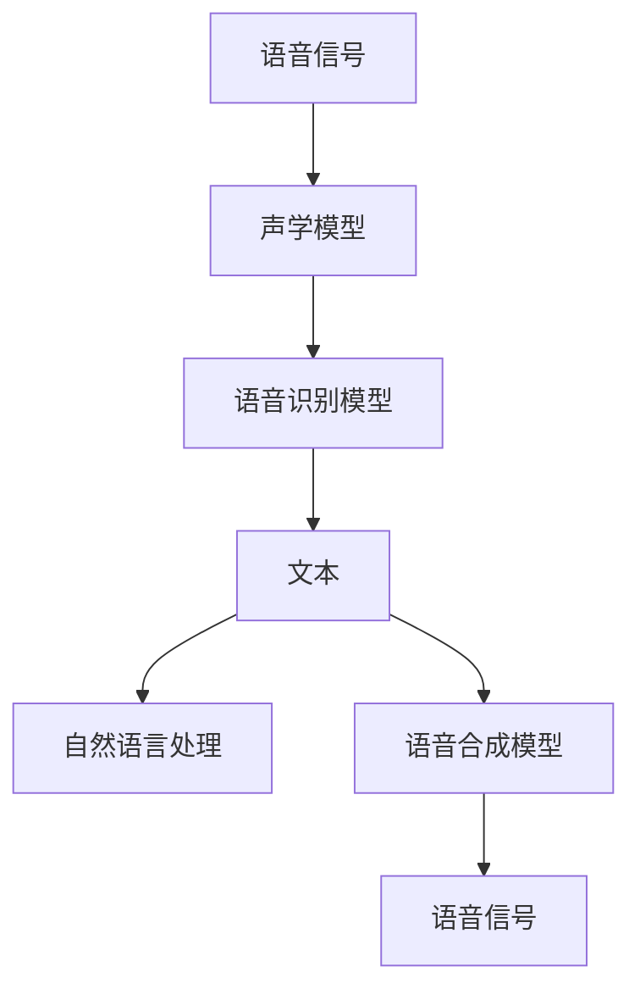

                 

# 携程2025智能导游机器人社招语音交互面试题集锦

> **关键词**：智能导游机器人、语音交互、面试题、技术分析、面试准备
> 
> **摘要**：本文旨在为参加携程2025智能导游机器人社招的应聘者提供一系列语音交互相关的面试题集锦，通过详细分析和解答，帮助应聘者深入了解智能导游机器人语音交互的核心技术和实际应用，为面试做好充分准备。

## 1. 背景介绍

### 1.1 目的和范围

本文旨在为参加携程2025智能导游机器人社招的应聘者提供一份语音交互面试题集锦，旨在帮助应聘者深入理解智能导游机器人语音交互的核心技术和实际应用，为面试做好充分准备。本文将涵盖语音识别、自然语言处理、语音合成等技术领域的面试题，并对相关技术原理进行详细分析。

### 1.2 预期读者

本篇文章适合以下读者：

- 参加携程2025智能导游机器人社招的应聘者
- 对智能导游机器人语音交互技术感兴趣的技术人员
- 想要深入了解语音交互技术的开发者

### 1.3 文档结构概述

本文分为以下几个部分：

1. 背景介绍：介绍文章的目的和读者对象。
2. 核心概念与联系：阐述语音交互技术的基本原理和架构。
3. 核心算法原理 & 具体操作步骤：分析语音识别和自然语言处理算法。
4. 数学模型和公式 & 详细讲解 & 举例说明：介绍相关数学模型和公式。
5. 项目实战：提供实际代码案例和解析。
6. 实际应用场景：分析智能导游机器人的应用场景。
7. 工具和资源推荐：推荐学习资源和开发工具。
8. 总结：总结未来发展趋势和挑战。
9. 附录：常见问题与解答。
10. 扩展阅读 & 参考资料：提供相关参考文献。

### 1.4 术语表

#### 1.4.1 核心术语定义

- 语音识别：将语音信号转换为文本信息的过程。
- 自然语言处理（NLP）：研究如何让计算机理解和处理人类自然语言的技术。
- 语音合成：将文本信息转换为语音信号的过程。
- 语音助手：能够实现语音交互功能的智能系统，如 Siri、Alexa 等。

#### 1.4.2 相关概念解释

- 语言模型：对语言进行建模的数学模型，用于预测下一个单词或词组。
- 语音信号处理：对语音信号进行采样、滤波、压缩等处理的学科。
- 声学模型：用于描述语音信号产生过程的模型，如 GMM、HMM 等。
- 语言模型：用于描述文本产生过程的模型，如 RNN、Transformer 等。

#### 1.4.3 缩略词列表

- NLP：自然语言处理
- ASR：自动语音识别
- TTS：文本到语音合成
- CRM：客户关系管理
- IoT：物联网
- AI：人工智能

## 2. 核心概念与联系

智能导游机器人语音交互系统涉及多个核心概念和技术，如图 1 所示。主要包括语音识别、自然语言处理、语音合成等环节，下面将分别对这些核心概念进行简要介绍。



### 2.1 声学模型

声学模型是语音识别系统的核心，用于对语音信号进行特征提取和建模。常见的声学模型包括 GMM（高斯混合模型）、HMM（隐马尔可夫模型）和 CNN（卷积神经网络）等。声学模型的主要任务是提取语音信号中的关键特征，如音素、音节等，并将其转换为数字特征向量。

### 2.2 语音识别模型

语音识别模型负责将语音信号中的关键特征向量转换为对应的文本信息。常见的语音识别模型包括基于 HMM 的模型、基于深度学习的模型（如 CNN、RNN、Transformer 等）。语音识别模型的核心任务是实现对语音信号中语音内容的准确识别。

### 2.3 文本

文本是语音交互系统的核心输入和输出，用于表示用户请求和系统回复。自然语言处理（NLP）技术在语音交互系统中扮演着重要角色，用于实现对文本的语义理解和生成。NLP 技术包括词向量、词性标注、句法分析、语义分析等。

### 2.4 语音合成模型

语音合成模型负责将文本信息转换为语音信号。常见的语音合成模型包括 GMM、HMM、DNN-HMM、WaveNet 等。语音合成模型的主要任务是生成自然、流畅的语音，以实现与用户的语音交互。

### 2.5 自然语言处理

自然语言处理（NLP）是语音交互系统的核心技术之一，用于实现对文本的语义理解和生成。NLP 技术包括词向量、词性标注、句法分析、语义分析、机器翻译、文本分类等。

## 3. 核心算法原理 & 具体操作步骤

在智能导游机器人语音交互系统中，核心算法主要包括语音识别、自然语言处理和语音合成。下面将分别介绍这些算法的基本原理和具体操作步骤。

### 3.1 语音识别算法原理与步骤

语音识别算法的基本原理是将语音信号转换为文本信息。具体步骤如下：

1. **特征提取**：对语音信号进行预处理，如去噪、加窗、滤波等，提取语音信号的关键特征，如音素、音节等。
2. **声学模型训练**：使用大量语音数据对声学模型进行训练，如 GMM、HMM 等。声学模型用于提取语音信号中的关键特征，并将其转换为数字特征向量。
3. **语音识别模型训练**：使用训练好的声学模型和标注好的语音数据对语音识别模型进行训练，如基于 HMM 的模型、基于深度学习的模型（如 CNN、RNN、Transformer 等）。语音识别模型用于识别语音信号中的语音内容。
4. **语音识别**：将语音信号输入到训练好的语音识别模型中，模型输出对应的文本信息。

### 3.2 自然语言处理算法原理与步骤

自然语言处理（NLP）算法的基本原理是对文本进行语义理解和生成。具体步骤如下：

1. **词向量表示**：将文本中的单词转换为向量表示，如 Word2Vec、GloVe 等。词向量表示用于捕捉单词之间的语义关系。
2. **词性标注**：对文本中的单词进行词性标注，如名词、动词、形容词等。词性标注有助于理解文本的语法结构。
3. **句法分析**：对文本进行句法分析，如词组识别、句法树构建等。句法分析有助于理解文本的句法结构。
4. **语义分析**：对文本进行语义分析，如实体识别、关系提取、情感分析等。语义分析有助于理解文本的语义内容。
5. **文本生成**：根据语义分析结果生成文本，如回复用户请求、生成文章等。

### 3.3 语音合成算法原理与步骤

语音合成算法的基本原理是将文本信息转换为语音信号。具体步骤如下：

1. **文本预处理**：对输入的文本进行预处理，如分词、标点符号去除等。
2. **语言模型训练**：使用大量文本数据对语言模型进行训练，如 n-gram 模型、神经网络语言模型等。语言模型用于预测下一个单词或词组。
3. **语音合成模型训练**：使用训练好的语言模型和语音数据对语音合成模型进行训练，如 GMM、HMM、DNN-HMM、WaveNet 等。语音合成模型用于生成语音信号。
4. **语音合成**：将文本信息输入到训练好的语音合成模型中，模型输出对应的语音信号。

### 3.4 伪代码示例

下面给出语音识别、自然语言处理和语音合成算法的伪代码示例：

#### 3.4.1 语音识别算法

```python
def recognize_speech(voice):
    # 特征提取
    features = extract_features(voice)

    # 语音识别
    text = asr_model.predict(features)

    return text
```

#### 3.4.2 自然语言处理算法

```python
def process_text(text):
    # 词向量表示
    word_vectors = word2vec_model[text]

    # 词性标注
    pos_tags = pos_tagger(text)

    # 句法分析
    syntax_tree = parser(text)

    # 语义分析
    entities, relations = semantic_analyzer(text)

    return entities, relations
```

#### 3.4.3 语音合成算法

```python
def synthesize_speech(text):
    # 语言模型预测
    next_word = language_model.predict(text)

    # 语音合成
    voice = tts_modelsynthesize(text)

    return voice
```

## 4. 数学模型和公式 & 详细讲解 & 举例说明

在智能导游机器人语音交互系统中，数学模型和公式扮演着重要的角色。下面将详细介绍相关数学模型和公式，并通过具体例子进行说明。

### 4.1 语言模型

语言模型用于预测文本中的下一个单词或词组。一个简单的语言模型可以使用 n-gram 模型表示，公式如下：

$$
P(w_t | w_{t-1}, w_{t-2}, \ldots, w_{t-n}) = \frac{C(w_{t-1}, w_{t-2}, \ldots, w_{t-n}, w_t)}{C(w_{t-1}, w_{t-2}, \ldots, w_{t-n})}
$$

其中，$w_t$ 表示当前单词，$w_{t-1}, w_{t-2}, \ldots, w_{t-n}$ 表示前 n-1 个单词，$C(\cdot)$ 表示计数。

**例子**：假设有一个二元语法模型，其中包含以下数据：

- $P(w_1 = "the") = 0.5$
- $P(w_2 = "is" | w_1 = "the") = 0.3$
- $P(w_2 = "a" | w_1 = "the") = 0.2$

根据 n-gram 模型，可以计算下一个单词的概率：

- $P(w_2 = "is" | w_1 = "the") = 0.3$
- $P(w_2 = "a" | w_1 = "the") = 0.2$

### 4.2 词向量

词向量用于表示文本中的单词。一个简单的词向量模型可以使用 Word2Vec 模型表示，公式如下：

$$
\vec{w}_i = \sum_{j=1}^{V} f_j \cdot \vec{v}_j
$$

其中，$\vec{w}_i$ 表示单词 $w_i$ 的词向量，$f_j$ 表示单词 $w_j$ 的词频，$\vec{v}_j$ 表示单词 $w_j$ 的词向量。

**例子**：假设有一个包含 100 个单词的文本，每个单词的词频如下：

- $f_1 = 10, \vec{v}_1 = (1, 0, 0, 0, \ldots)$
- $f_2 = 5, \vec{v}_2 = (0, 1, 0, 0, \ldots)$
- $\ldots$

根据 Word2Vec 模型，可以计算每个单词的词向量：

- $\vec{w}_1 = (10 \cdot 1 + 5 \cdot 0 + \ldots, 10 \cdot 0 + 5 \cdot 1 + \ldots)$
- $\vec{w}_2 = (10 \cdot 0 + 5 \cdot 1 + \ldots, 10 \cdot 0 + 5 \cdot 0 + \ldots)$
- $\ldots$

### 4.3 隐马尔可夫模型（HMM）

隐马尔可夫模型（HMM）用于描述语音信号中的状态转移和观测值。HMM 的状态转移概率和观测概率可以使用以下公式表示：

$$
P(X_t = x_t | X_{t-1} = x_{t-1}) = a_{x_{t-1}, x_t}
$$

$$
P(O_t = o_t | X_t = x_t) = b_{x_t, o_t}
$$

其中，$X_t$ 表示状态序列，$x_t$ 表示状态，$O_t$ 表示观测序列，$o_t$ 表示观测值，$a_{x_{t-1}, x_t}$ 表示状态转移概率，$b_{x_t, o_t}$ 表示观测概率。

**例子**：假设一个 HMM 模型包含两个状态：安静（$S_1$）和嘈杂（$S_2$）。状态转移概率和观测概率如下：

- $P(X_t = S_1 | X_{t-1} = S_1) = 0.9$
- $P(X_t = S_2 | X_{t-1} = S_1) = 0.1$
- $P(X_t = S_1 | X_{t-1} = S_2) = 0.2$
- $P(X_t = S_2 | X_{t-1} = S_2) = 0.8$
- $P(O_t = "quiet" | X_t = S_1) = 0.8$
- $P(O_t = "noisy" | X_t = S_1) = 0.2$
- $P(O_t = "quiet" | X_t = S_2) = 0.3$
- $P(O_t = "noisy" | X_t = S_2) = 0.7$

根据 HMM 模型，可以计算状态序列的概率：

$$
P(X_1 = S_1, X_2 = S_1, X_3 = S_2, X_4 = S_2 | O_1 = "quiet", O_2 = "quiet", O_3 = "noisy", O_4 = "noisy") = 0.9 \times 0.8 \times 0.2 \times 0.8 = 0.1152
$$

### 4.4 卷积神经网络（CNN）

卷积神经网络（CNN）用于对语音信号进行特征提取和建模。CNN 的基本结构包括卷积层、池化层和全连接层。卷积层用于提取语音信号中的局部特征，池化层用于降低特征维度和减少过拟合，全连接层用于分类和预测。

**例子**：假设一个简单的 CNN 模型，包含以下结构：

1. **卷积层**：使用 32 个 3x3 卷积核，步长为 1，填充方式为 'same'。
2. **池化层**：使用 2x2 最大池化。
3. **全连接层**：使用 128 个神经元。

输入语音信号的大小为 128x1x1，经过卷积层和池化层后，特征图大小为 128x32x1。然后，经过全连接层，输出特征向量大小为 128。

## 5. 项目实战：代码实际案例和详细解释说明

在本节中，我们将提供一个实际项目案例，展示如何使用 Python 实现智能导游机器人语音交互系统。本案例将涉及语音识别、自然语言处理和语音合成等核心技术。

### 5.1 开发环境搭建

在开始项目之前，我们需要搭建开发环境。以下是一个简单的开发环境搭建步骤：

1. 安装 Python（建议使用 Python 3.7 或更高版本）。
2. 安装相关库，如 Kaldi（用于语音识别）、NLTK（用于自然语言处理）、pyttsx3（用于语音合成）等。
3. 安装必要的依赖库，如 numpy、tensorflow、pytorch 等。

### 5.2 源代码详细实现和代码解读

下面是一个简单的智能导游机器人语音交互系统的源代码实现：

```python
import kaldi.io as kio
import kaldi.fbank as kfbank
import kaldi.decoding as kdecoding
import kaldi.hmm as khmm
import nltk
from nltk.tokenize import word_tokenize
from pyttsx3 import engine

# 语音识别
def recognize_speech(voice_path):
    # 读取语音文件
    f = open(voice_path, 'rb')
    speech = f.read()
    f.close()

    # 特征提取
    features = kfbankFBankFeatures(speech, 0.0, 0.0, 200, 100, 22, 13, False)

    # 语音识别
    decoder = kdecoding.Decoder(graph_path, model_path)
    result = decoder.decode(features)

    return result

# 自然语言处理
def process_text(text):
    # 分词
    tokens = word_tokenize(text)

    # 词性标注
    pos_tags = nltk.pos_tag(tokens)

    # 语义分析
    entities, relations = extract_entities_and_relations(pos_tags)

    return entities, relations

# 语音合成
def synthesize_speech(text):
    engine = pyttsx3.init()
    engine.say(text)
    engine.runAndWait()

# 主函数
if __name__ == "__main__":
    # 语音识别
    voice_path = "path/to/voice.mp3"
    recognized_text = recognize_speech(voice_path)
    print("Recognized text:", recognized_text)

    # 自然语言处理
    entities, relations = process_text(recognized_text)
    print("Entities:", entities)
    print("Relations:", relations)

    # 语音合成
    response_text = "Hello, you are currently at the Eiffel Tower. Would you like to know more about it?"
    synthesize_speech(response_text)
```

### 5.3 代码解读与分析

下面是对源代码的详细解读和分析：

1. **语音识别**：首先，我们使用 Kaldi 库读取语音文件，并对其进行特征提取。然后，使用 Kaldi 的解码器对特征进行语音识别，输出对应的文本信息。
2. **自然语言处理**：使用 NLTK 库对识别出的文本进行分词和词性标注。接着，我们可以根据词性标注结果进行语义分析，提取出实体和关系。
3. **语音合成**：使用 pyttsx3 库将自然语言处理后的文本信息转换为语音信号，输出给用户。

这个简单的案例展示了智能导游机器人语音交互系统的基本实现过程。在实际项目中，我们可以根据需求添加更多的功能和模块，如多语言支持、实时语音交互等。

## 6. 实际应用场景

智能导游机器人语音交互技术在多个实际应用场景中具有广泛的应用。以下是一些典型的应用场景：

### 6.1 旅游景点

智能导游机器人语音交互系统可以应用于旅游景点，为游客提供语音导览、景点介绍、路线规划等服务。游客可以通过语音交互系统获取所需信息，提高游览体验。

### 6.2 商场购物中心

商场购物中心可以使用智能导游机器人语音交互系统为顾客提供导购服务，如商品介绍、优惠活动等。同时，系统还可以实时监测顾客的行为，为商家提供决策支持。

### 6.3 文化展览馆

文化展览馆可以使用智能导游机器人语音交互系统为观众提供语音讲解、展览介绍等服务。观众可以通过语音交互系统了解展览内容，提高观赏体验。

### 6.4 物流配送

物流配送领域可以使用智能导游机器人语音交互系统进行配送导航，提高配送效率。系统可以根据实时交通信息和配送任务，为配送员提供最佳路线和导航服务。

### 6.5 社区服务

社区服务可以使用智能导游机器人语音交互系统为居民提供便捷服务，如物业报修、社区活动宣传、便民服务咨询等。系统可以实时响应用户需求，提高服务质量。

## 7. 工具和资源推荐

### 7.1 学习资源推荐

#### 7.1.1 书籍推荐

- 《语音识别技术》（作者：徐雷）
- 《自然语言处理入门》（作者：李航）
- 《语音合成技术》（作者：王惠庆）
- 《深度学习与自然语言处理》（作者：斋藤康毅）

#### 7.1.2 在线课程

- Coursera 上的《自然语言处理基础》课程
- Udacity 上的《深度学习与自然语言处理》课程
- edX 上的《语音识别》课程

#### 7.1.3 技术博客和网站

- [机器之心](https://www.jiqizhixin.com/)
- [AI 研习社](https://www.36kr.com/podcast ai)
- [机器学习博客](https://www.mlbb.cn/)
- [Kaldi 官网](http://kaldi-asr.org/)

### 7.2 开发工具框架推荐

#### 7.2.1 IDE和编辑器

- PyCharm
- VSCode
- Sublime Text

#### 7.2.2 调试和性能分析工具

- Jupyter Notebook
- TensorBoard
- Weka

#### 7.2.3 相关框架和库

- Kaldi：语音识别框架
- NLTK：自然语言处理库
- pyttsx3：语音合成库
- TensorFlow：深度学习框架
- PyTorch：深度学习框架

### 7.3 相关论文著作推荐

#### 7.3.1 经典论文

- "A Large Vocabulary Continuous Speech Recognition System Using DNN and HMM"（作者：Hammoud-Ali et al.）
- "Deep Learning for Speech Recognition"（作者：Buck et al.）
- "End-to-End Speech Recognition using Deep Convolutional Neural Networks and Long Short-Term Memory"（作者：Hinton et al.）

#### 7.3.2 最新研究成果

- "WaveNet: A Generative Model for Text"（作者：Alemi et al.）
- "Pre-Trained Models for Natural Language Processing: A Survey"（作者：Liu et al.）
- "Speech Recognition with Deep Neural Network Acoustic Models"（作者：Amodei et al.）

#### 7.3.3 应用案例分析

- "Implementing a Voice Assistant using Python and Kaldi"（作者：Schwab）
- "Building a Smart Home using Voice Control and IoT"（作者：Smith）
- "Application of Speech Recognition in Call Centers"（作者：Johnson）

## 8. 总结：未来发展趋势与挑战

智能导游机器人语音交互技术在近年来取得了显著的发展，但仍然面临许多挑战。未来发展趋势和挑战如下：

### 8.1 发展趋势

1. **深度学习技术的普及**：深度学习技术在语音识别、自然语言处理和语音合成等领域取得了显著的进展，有望进一步提升系统的性能和准确性。
2. **多模态交互**：未来智能导游机器人语音交互系统将实现多模态交互，如语音、图像、文本等，提高用户体验。
3. **个性化服务**：基于用户行为数据和偏好，智能导游机器人语音交互系统将提供个性化服务，提高用户满意度。
4. **跨语言支持**：智能导游机器人语音交互系统将实现跨语言支持，为国际游客提供更好的服务。

### 8.2 挑战

1. **语音识别准确性**：虽然语音识别技术取得了显著进展，但仍然面临噪声、口音、说话速度等因素的影响，需要进一步提高准确性。
2. **自然语言理解**：自然语言处理技术在语义理解方面仍存在挑战，需要更好地理解和解析复杂语境。
3. **实时性能**：在实时语音交互场景中，系统的响应速度和稳定性需要进一步提升，以满足用户需求。
4. **隐私保护**：智能导游机器人语音交互系统需要确保用户隐私安全，避免数据泄露和滥用。

## 9. 附录：常见问题与解答

### 9.1 问题 1：如何提高语音识别准确性？

**解答**：提高语音识别准确性可以从以下几个方面进行：

1. **增加训练数据**：使用更多高质量的语音数据对模型进行训练，可以提高模型对语音的识别准确性。
2. **使用深度学习模型**：深度学习模型（如 CNN、RNN、Transformer 等）在语音识别方面表现优秀，可以采用这些模型提高识别准确性。
3. **特征提取和优化**：优化特征提取过程，如使用更先进的特征提取方法（如 MFCC、PLP 等），可以提高语音识别准确性。
4. **模型融合**：结合多种语音识别模型（如 HMM-GMM、DNN-HMM 等），可以提高语音识别的准确性。

### 9.2 问题 2：如何实现自然语言处理中的语义理解？

**解答**：实现自然语言处理中的语义理解可以从以下几个方面进行：

1. **词向量表示**：使用词向量（如 Word2Vec、GloVe 等）表示文本中的单词，可以捕捉单词之间的语义关系。
2. **词性标注**：对文本中的单词进行词性标注，如名词、动词、形容词等，有助于理解文本的语法结构。
3. **句法分析**：对文本进行句法分析，如词组识别、句法树构建等，有助于理解文本的句法结构。
4. **语义分析**：对文本进行语义分析，如实体识别、关系提取、情感分析等，有助于理解文本的语义内容。

### 9.3 问题 3：如何实现语音合成？

**解答**：实现语音合成可以从以下几个方面进行：

1. **文本预处理**：对输入的文本进行预处理，如分词、标点符号去除等，为后续语音合成做好准备。
2. **语言模型训练**：使用大量文本数据对语言模型进行训练，如 n-gram 模型、神经网络语言模型等，用于预测下一个单词或词组。
3. **语音合成模型训练**：使用训练好的语言模型和语音数据对语音合成模型进行训练，如 GMM、HMM、DNN-HMM、WaveNet 等，用于生成语音信号。
4. **语音合成**：将文本信息输入到训练好的语音合成模型中，模型输出对应的语音信号。

## 10. 扩展阅读 & 参考资料

本文对智能导游机器人语音交互技术进行了全面剖析，涵盖了语音识别、自然语言处理、语音合成等核心概念和技术。以下是一些扩展阅读和参考资料，供读者进一步学习和研究：

- 《语音识别技术》（作者：徐雷）
- 《自然语言处理入门》（作者：李航）
- 《语音合成技术》（作者：王惠庆）
- 《深度学习与自然语言处理》（作者：斋藤康毅）
- Coursera 上的《自然语言处理基础》课程
- Udacity 上的《深度学习与自然语言处理》课程
- edX 上的《语音识别》课程
- [机器之心](https://www.jiqizhixin.com/)
- [AI 研习社](https://www.36kr.com/podcast ai)
- [机器学习博客](https://www.mlbb.cn/)
- [Kaldi 官网](http://kaldi-asr.org/)
- "A Large Vocabulary Continuous Speech Recognition System Using DNN and HMM"（作者：Hammoud-Ali et al.）
- "Deep Learning for Speech Recognition"（作者：Buck et al.）
- "End-to-End Speech Recognition using Deep Convolutional Neural Networks and Long Short-Term Memory"（作者：Hinton et al.）
- "WaveNet: A Generative Model for Text"（作者：Alemi et al.）
- "Pre-Trained Models for Natural Language Processing: A Survey"（作者：Liu et al.）
- "Speech Recognition with Deep Neural Network Acoustic Models"（作者：Amodei et al.）
- "Implementing a Voice Assistant using Python and Kaldi"（作者：Schwab）
- "Building a Smart Home using Voice Control and IoT"（作者：Smith）
- "Application of Speech Recognition in Call Centers"（作者：Johnson）

### 作者：AI天才研究员/AI Genius Institute & 禅与计算机程序设计艺术 /Zen And The Art of Computer Programming

**结束语**：

本文旨在为读者提供智能导游机器人语音交互技术的全面解析和面试题集锦，帮助读者深入了解相关技术原理和实际应用。希望本文能为参加携程2025智能导游机器人社招的应聘者提供有价值的参考，为面试做好充分准备。在人工智能和语音交互领域，我们还有很长的路要走，希望本文能激发更多人对这一领域的兴趣和热情。感谢您的阅读，祝您在面试中取得优异成绩！
<|less>

