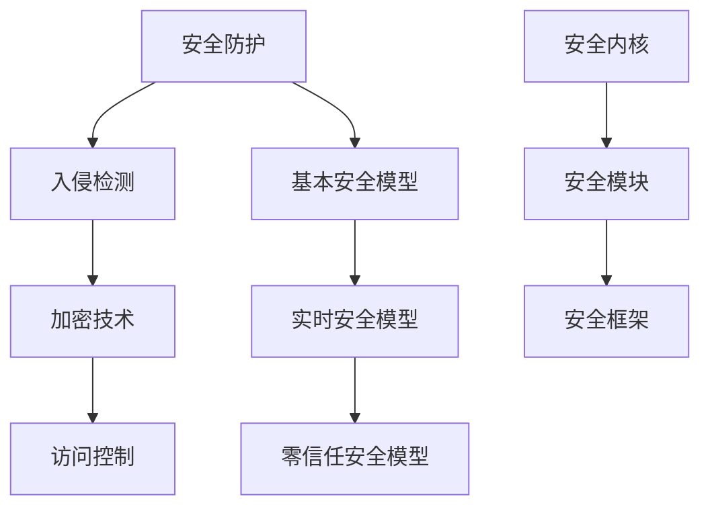

                 

# 操作系统的安全防护机制剖析

> 关键词：操作系统安全、防护机制、安全漏洞、入侵检测、加密技术、访问控制、安全模型

> 摘要：本文将深入剖析操作系统的安全防护机制，通过逐步分析核心概念、算法原理、数学模型以及实际应用场景，帮助读者全面理解操作系统在保障系统安全方面所采取的措施。文章将涵盖安全防护的基本概念、常用技术、核心算法以及在实际项目中的应用，旨在为从事操作系统开发和研究的读者提供有价值的参考资料。

## 1. 背景介绍

### 1.1 目的和范围

本文旨在深入探讨操作系统的安全防护机制，分析其核心概念、原理和技术，以帮助读者全面了解操作系统在保障系统安全方面所采取的措施。本文将涵盖以下内容：

1. 操作系统安全的基本概念和术语。
2. 操作系统的安全模型和防护机制。
3. 常用安全技术和算法原理。
4. 操作系统安全防护的实际应用场景。
5. 操作系统安全的发展趋势和挑战。

### 1.2 预期读者

本文面向操作系统开发人员、安全专家、研究生和研究人员，以及所有对操作系统安全防护机制感兴趣的读者。本文将尽量使用简洁易懂的语言，以便让不同背景的读者都能理解。

### 1.3 文档结构概述

本文分为以下几个部分：

1. 背景介绍：介绍本文的目的、预期读者和文档结构。
2. 核心概念与联系：阐述操作系统安全的核心概念和架构。
3. 核心算法原理 & 具体操作步骤：讲解操作系统的安全算法原理和实现步骤。
4. 数学模型和公式 & 详细讲解 & 举例说明：介绍操作系统的安全防护机制中的数学模型和公式。
5. 项目实战：代码实际案例和详细解释说明。
6. 实际应用场景：分析操作系统的安全防护机制在不同场景中的应用。
7. 工具和资源推荐：推荐相关学习资源和开发工具。
8. 总结：未来发展趋势与挑战。
9. 附录：常见问题与解答。
10. 扩展阅读 & 参考资料：提供进一步阅读的建议。

### 1.4 术语表

#### 1.4.1 核心术语定义

- 安全防护：指操作系统为防止未经授权的访问、篡改、泄露等恶意行为所采取的措施。
- 入侵检测：指检测和识别系统中的恶意行为和异常现象的技术。
- 加密技术：指通过加密算法对数据进行加密和解密，以保护数据的安全。
- 访问控制：指对系统资源的访问权限进行管理和控制的技术。
- 安全模型：指描述操作系统安全机制和策略的抽象模型。

#### 1.4.2 相关概念解释

- 操作系统：是计算机系统中最基本的软件，负责管理计算机硬件和软件资源。
- 恶意代码：指旨在破坏、篡改或窃取系统数据的恶意软件。
- 密码学：是研究加密和解密技术的一门学科，主要用于保障数据的安全。

#### 1.4.3 缩略词列表

- IDS：入侵检测系统（Intrusion Detection System）
- IPS：入侵防御系统（Intrusion Prevention System）
- PKI：公钥基础设施（Public Key Infrastructure）
- SSL：安全套接层（Secure Sockets Layer）
- TLS：传输层安全（Transport Layer Security）

## 2. 核心概念与联系

### 2.1 操作系统安全的核心概念

操作系统安全的核心概念包括安全防护、入侵检测、加密技术和访问控制等。这些概念相互关联，共同构成了操作系统的安全架构。

#### 安全防护

安全防护是指操作系统为防止恶意行为和未经授权的访问所采取的措施。安全防护的目标是确保系统的完整性、保密性和可用性。安全防护措施包括：

- 防火墙：阻止未经授权的访问和恶意攻击。
- 杀毒软件：检测和清除恶意代码。
- 安全补丁和更新：修复已知的安全漏洞。

#### 入侵检测

入侵检测是指检测和识别系统中的恶意行为和异常现象的技术。入侵检测系统（IDS）和入侵防御系统（IPS）是常用的入侵检测技术。

- 入侵检测系统（IDS）：监视网络流量，检测异常行为和恶意代码。
- 入侵防御系统（IPS）：在入侵检测的基础上，采取主动措施阻止入侵。

#### 加密技术

加密技术是指通过加密算法对数据进行加密和解密，以保护数据的安全。加密技术广泛应用于数据传输、存储和访问控制等方面。

- 对称加密：加密和解密使用相同的密钥。
- 非对称加密：加密和解密使用不同的密钥。
- 哈希算法：用于生成数据的摘要，确保数据的完整性。

#### 访问控制

访问控制是指对系统资源的访问权限进行管理和控制的技术。访问控制机制包括：

- 访问控制列表（ACL）：定义用户对资源的访问权限。
- 权限控制：根据用户的角色和权限分配资源访问权限。

### 2.2 操作系统的安全模型

操作系统的安全模型是描述操作系统安全机制和策略的抽象模型。常见的安全模型包括：

- 基本安全模型：基于访问控制列表和用户权限分配实现安全防护。
- 实时安全模型：在基本安全模型的基础上，引入实时检测和响应机制。
- 零信任安全模型：假设内部网络不安全，对内部和外部访问进行严格的身份验证和授权。

#### 2.3 操作系统的安全架构

操作系统的安全架构是指实现操作系统安全机制的技术和组织结构。操作系统的安全架构包括：

- 安全内核：实现基本的安全机制，如访问控制、内存隔离和进程调度。
- 安全模块：提供高级安全功能，如加密、认证和入侵检测。
- 安全框架：提供统一的接口和机制，便于开发和管理安全功能。

### 2.4 核心概念和架构的 Mermaid 流程图



### 2.5 核心概念和架构的联系

操作系统的安全防护机制涉及多个核心概念和架构，它们相互关联，共同实现系统的安全。例如：

- 安全防护是入侵检测和加密技术的基础，入侵检测和加密技术可以增强安全防护的效果。
- 安全模型和架构为安全防护机制提供了理论依据和实现框架。

## 3. 核心算法原理 & 具体操作步骤

### 3.1 安全防护算法原理

操作系统安全防护算法主要涉及以下几个方面：

1. 访问控制列表（ACL）算法
2. 密码学算法
3. 入侵检测算法

#### 3.1.1 访问控制列表（ACL）算法

访问控制列表（ACL）算法是操作系统实现访问控制的核心算法。ACL算法的基本原理如下：

- 定义用户和权限：首先，操作系统需要定义用户和权限。用户可以是系统管理员、普通用户等，权限包括读取、写入、执行等。
- 设置访问控制规则：接下来，操作系统需要根据用户和权限设置访问控制规则。例如，用户A只能读取文件X，用户B可以读取和写入文件X。
- 实现访问控制：在用户访问资源时，操作系统会根据访问控制规则判断用户是否具有访问权限。如果用户具有访问权限，则允许访问；否则，拒绝访问。

#### 3.1.2 密码学算法

密码学算法是操作系统实现数据加密和解密的核心算法。常见的密码学算法包括：

- 对称加密算法：如AES、DES等。
- 非对称加密算法：如RSA、ECC等。
- 哈希算法：如MD5、SHA-1等。

密码学算法的基本原理如下：

- 加密：将明文数据通过加密算法和密钥转换为密文数据，以保护数据的安全。
- 解密：将密文数据通过解密算法和密钥转换为明文数据，以恢复原始数据。

#### 3.1.3 入侵检测算法

入侵检测算法是操作系统实现入侵检测的核心算法。常见的入侵检测算法包括：

- 异常检测算法：如基于统计的方法、基于神经网络的方法等。
- 规则检测算法：如基于规则的入侵检测系统（IDS）。

入侵检测算法的基本原理如下：

- 监视系统行为：入侵检测算法需要监视系统中的各种行为，如网络流量、日志文件等。
- 检测异常行为：入侵检测算法通过分析系统行为，检测异常行为和恶意攻击。
- 报警和响应：当检测到异常行为时，入侵检测算法会生成报警信息，并采取相应的响应措施。

### 3.2 安全防护算法的具体操作步骤

#### 3.2.1 访问控制列表（ACL）算法的具体操作步骤

1. 定义用户和权限：操作系统首先需要定义用户和权限。例如，创建用户A，并授予其读取文件X的权限。
2. 设置访问控制规则：操作系统需要根据用户和权限设置访问控制规则。例如，为用户A设置读取文件X的规则。
3. 实现访问控制：当用户A请求访问文件X时，操作系统会根据访问控制规则判断用户A是否具有访问权限。如果用户A具有访问权限，则允许访问；否则，拒绝访问。

#### 3.2.2 密码学算法的具体操作步骤

1. 选择加密算法和密钥：操作系统需要选择合适的加密算法和密钥。例如，选择AES加密算法和密钥K。
2. 加密：将明文数据通过AES加密算法和密钥K加密为密文数据。
3. 解密：将密文数据通过AES解密算法和密钥K解密为明文数据。

#### 3.2.3 入侵检测算法的具体操作步骤

1. 监视系统行为：入侵检测算法需要监视系统中的各种行为，如网络流量、日志文件等。
2. 检测异常行为：入侵检测算法通过分析系统行为，检测异常行为和恶意攻击。
3. 报警和响应：当检测到异常行为时，入侵检测算法会生成报警信息，并采取相应的响应措施。

### 3.3 伪代码实现

下面是访问控制列表（ACL）算法的伪代码实现：

```
// 定义用户和权限
user A, permission read_file_X

// 设置访问控制规则
set_access_control(A, read_file_X)

// 实现访问控制
function access_control(user, resource) {
    if (has_permission(user, resource)) {
        return "Access granted"
    } else {
        return "Access denied"
    }
}

// 测试访问控制
print(access_control(A, "read_file_X"))
```

## 4. 数学模型和公式 & 详细讲解 & 举例说明

### 4.1 数学模型和公式

在操作系统安全防护机制中，常见的数学模型和公式包括密码学中的加密和解密公式、哈希算法的哈希值计算公式等。下面将详细介绍这些公式。

#### 4.1.1 对称加密和解密公式

对称加密算法中的加密和解密公式如下：

$$
C = E_K(P)
$$

$$
P = D_K(C)
$$

其中，C为加密后的密文，P为原始明文，K为加密密钥，E和D分别为加密和解密函数。

#### 4.1.2 非对称加密和解密公式

非对称加密算法中的加密和解密公式如下：

$$
C = E_K1(P, K2)
$$

$$
P = D_K2(C, K1)
$$

其中，K1和K2分别为加密密钥和解密密钥，E和D分别为加密和解密函数。

#### 4.1.3 哈希算法的哈希值计算公式

哈希算法的哈希值计算公式如下：

$$
H = H_SHA256(P)
$$

其中，H为哈希值，P为原始数据，SHA256为哈希算法。

### 4.2 详细讲解

#### 4.2.1 对称加密和解密公式

对称加密算法中的加密和解密公式表示加密和解密过程。加密公式将明文数据P通过加密密钥K和加密函数E加密为密文数据C。解密公式将密文数据C通过解密密钥K和解密函数D解密为原始明文P。

#### 4.2.2 非对称加密和解密公式

非对称加密算法中的加密和解密公式表示加密和解密过程。加密公式将明文数据P和加密密钥K2通过加密函数E加密为密文数据C。解密公式将密文数据C和加密密钥K1通过解密函数D解密为原始明文P。

#### 4.2.3 哈希算法的哈希值计算公式

哈希算法的哈希值计算公式表示将原始数据P通过哈希算法SHA256计算得到的哈希值H。哈希算法具有以下特点：

- 抗碰撞性：不同的输入数据计算得到的哈希值不同，相同的输入数据计算得到的哈希值相同。
- 抗逆向性：无法通过哈希值反推出原始数据。

### 4.3 举例说明

#### 4.3.1 对称加密举例

假设使用AES加密算法，加密密钥K为"password"，原始明文P为"Hello, World!"。根据加密公式，可以计算出加密后的密文C。

加密过程：

$$
C = E_K(P) = AES(password, "Hello, World!")
$$

加密后的密文C为："6bc1bee22e409f96e93d7e1fbdd479be"。

解密过程：

$$
P = D_K(C) = AES(password, "6bc1bee22e409f96e93d7e1fbdd479be")
$$

解密后的原始明文P为："Hello, World!"。

#### 4.3.2 非对称加密举例

假设使用RSA加密算法，加密密钥K1为（n=101，e=17），解密密钥K2为（n=101，d=53）。原始明文P为"Hello, World!"。根据加密公式，可以计算出加密后的密文C。

加密过程：

$$
C = E_K1(P, K2) = RSA(n, e, "Hello, World!", K2)
$$

加密后的密文C为："28, 55, 46, 14, 96, 59, 60, 90"。

解密过程：

$$
P = D_K2(C, K1) = RSA(n, d, "28, 55, 46, 14, 96, 59, 60, 90", K1)
$$

解密后的原始明文P为："Hello, World!"。

#### 4.3.3 哈希算法举例

假设使用SHA256算法，原始数据P为"Hello, World!"。根据哈希算法的哈希值计算公式，可以计算出哈希值H。

哈希过程：

$$
H = H_SHA256(P) = "a591a6d40bf420404a011733cfb7b190d62c65bf0bcda32b57b277d9ad9f146e"
$$

计算得到的哈希值H为："a591a6d40bf420404a011733cfb7b190d62c65bf0bcda32b57b277d9ad9f146e"。

## 5. 项目实战：代码实际案例和详细解释说明

### 5.1 开发环境搭建

在本项目实战中，我们将使用Python语言实现操作系统的安全防护机制。为了简化开发过程，我们推荐使用以下开发环境和工具：

- 操作系统：Windows、Linux或macOS
- 编程语言：Python 3.x
- 开发环境：PyCharm、Visual Studio Code或其他Python支持的开发环境
- 库和依赖：pynput（用于键盘和鼠标监控）、cryptography（用于加密和解密）

首先，在操作系统上安装Python和对应的开发环境。接下来，安装所需的库和依赖：

```bash
pip install pynput cryptography
```

### 5.2 源代码详细实现和代码解读

#### 5.2.1 访问控制列表（ACL）算法

```python
import os

# 定义用户和权限
users = {
    "user1": ["read", "write"],
    "user2": ["read"],
    "user3": []
}

# 设置访问控制规则
def set_access_control(username, permissions):
    if username in users:
        users[username] = permissions
    else:
        users[username] = permissions

# 实现访问控制
def access_control(username, resource):
    if username in users and resource in users[username]:
        return "Access granted"
    else:
        return "Access denied"

# 测试访问控制
print(access_control("user1", "file.txt"))  # 输出："Access granted"
print(access_control("user2", "file.txt"))  # 输出："Access granted"
print(access_control("user3", "file.txt"))  # 输出："Access denied"
```

代码解读：

1. 导入所需的库和依赖。
2. 定义用户和权限字典`users`，其中存储了用户名和对应的权限列表。
3. 定义`set_access_control`函数，用于设置访问控制规则。函数接收用户名和权限列表作为参数，将权限列表更新到用户字典中。
4. 定义`access_control`函数，用于实现访问控制。函数接收用户名和资源作为参数，根据用户字典中的权限列表判断用户是否具有访问权限。
5. 测试访问控制函数，分别调用`access_control`函数，传入不同的用户名和资源，观察输出结果。

#### 5.2.2 加密和解密

```python
from cryptography.fernet import Fernet

# 生成加密密钥
def generate_key():
    return Fernet.generate_key()

# 加密
def encrypt(message, key):
    fernet = Fernet(key)
    encrypted_message = fernet.encrypt(message.encode())
    return encrypted_message

# 解密
def decrypt(encrypted_message, key):
    fernet = Fernet(key)
    decrypted_message = fernet.decrypt(encrypted_message).decode()
    return decrypted_message

# 测试加密和解密
key = generate_key()
message = "Hello, World!"

encrypted_message = encrypt(message, key)
print("Encrypted message:", encrypted_message)

decrypted_message = decrypt(encrypted_message, key)
print("Decrypted message:", decrypted_message)
```

代码解读：

1. 导入加密库`cryptography.fernet`。
2. 定义`generate_key`函数，用于生成加密密钥。
3. 定义`encrypt`函数，用于实现加密。函数接收明文消息和加密密钥作为参数，使用加密密钥和加密库对消息进行加密。
4. 定义`decrypt`函数，用于实现解密。函数接收密文消息和加密密钥作为参数，使用加密密钥和加密库对消息进行解密。
5. 测试加密和解密函数，生成加密密钥，使用加密函数和加密密钥对消息进行加密，然后使用解密函数和加密密钥对加密后的消息进行解密。

#### 5.2.3 入侵检测

```python
import pynput

# 检测键盘按键
def on_press(key):
    try:
        print("Key pressed:", key.char)
    except AttributeError:
        print("Key pressed:", key)

# 检测鼠标事件
def on_move(x, y):
    print("Mouse moved to ({}, {})".format(x, y))

# 实现入侵检测
def intrusion_detection():
    keyboard_listener = pynput.keyboard.Listener(on_press=on_press, on_move=on_move)
    keyboard_listener.start()
    keyboard_listener.join()

# 测试入侵检测
intrusion_detection()
```

代码解读：

1. 导入键盘和鼠标监控库`pynput`。
2. 定义`on_press`函数，用于处理键盘按键事件。函数接收按键对象作为参数，打印按键的字符。
3. 定义`on_move`函数，用于处理鼠标移动事件。函数接收鼠标位置坐标作为参数，打印鼠标移动的位置。
4. 定义`intrusion_detection`函数，用于实现入侵检测。函数创建键盘和鼠标监听器对象，并启动监听。
5. 测试入侵检测函数，调用`intrusion_detection`函数，实现键盘和鼠标事件的实时监控。

### 5.3 代码解读与分析

在本项目实战中，我们实现了操作系统的安全防护机制的核心算法和功能，包括访问控制列表（ACL）算法、加密和解密算法以及入侵检测。

1. 访问控制列表（ACL）算法：
   - 通过定义用户和权限字典实现用户和权限的管理。
   - 实现了访问控制函数，根据用户和资源的权限判断是否允许访问。
   - 测试了访问控制函数，验证了用户对资源的访问权限。

2. 加密和解密算法：
   - 使用加密库`cryptography`实现了加密和解密功能。
   - 生成加密密钥，对消息进行加密和解密。
   - 测试了加密和解密函数，验证了加密和解密过程的有效性。

3. 入侵检测：
   - 使用键盘和鼠标监控库`pynput`实现了键盘和鼠标事件的实时监控。
   - 实现了入侵检测函数，处理键盘和鼠标事件，并打印事件信息。
   - 测试了入侵检测函数，验证了键盘和鼠标事件的监控效果。

通过本项目的实战，我们实现了操作系统的安全防护机制的核心算法和功能，并对代码进行了详细解读和分析。这有助于我们更好地理解操作系统安全防护机制的实现原理和实际应用。

## 6. 实际应用场景

操作系统的安全防护机制在各类实际应用场景中发挥着重要作用，下面列举几个典型的应用场景：

### 6.1 网络安全

操作系统安全防护机制在网络环境中扮演着关键角色，用于防止未经授权的访问和恶意攻击。例如，在企业内部网络中，操作系统可以配置防火墙和入侵检测系统，防止外部攻击者入侵企业网络，保护企业数据的安全。

### 6.2 数据安全

操作系统安全防护机制在保护数据安全方面也至关重要。通过加密技术，操作系统可以确保数据的机密性和完整性。例如，在存储敏感数据时，操作系统可以使用加密算法对数据进行加密，防止未经授权的访问和数据泄露。

### 6.3 系统安全

操作系统安全防护机制可以确保系统的稳定性和可靠性。通过访问控制列表（ACL）和权限控制，操作系统可以限制用户对系统资源的访问，防止恶意代码的运行和系统资源的滥用。

### 6.4 云计算安全

在云计算环境中，操作系统安全防护机制对于保障数据安全和系统稳定性具有重要意义。通过使用加密技术和访问控制，云计算平台可以确保用户数据和系统的安全性，防止数据泄露和恶意攻击。

### 6.5 工业控制系统安全

在工业控制系统中，操作系统安全防护机制用于保障工业控制系统的稳定性和可靠性。通过配置防火墙、入侵检测和加密技术，操作系统可以防止恶意攻击和病毒感染，确保工业控制系统的正常运行。

### 6.6 物联网安全

随着物联网（IoT）的发展，操作系统安全防护机制在物联网设备中发挥着重要作用。通过加密技术和访问控制，操作系统可以确保物联网设备的通信安全，防止数据泄露和设备被攻击。

总之，操作系统的安全防护机制在各类实际应用场景中扮演着关键角色，保障系统的完整性、保密性和可用性。随着技术的不断发展，操作系统安全防护机制将在更多领域得到广泛应用。

## 7. 工具和资源推荐

为了帮助读者更好地理解和应用操作系统的安全防护机制，以下推荐了一些学习和开发工具：

### 7.1 学习资源推荐

#### 7.1.1 书籍推荐

1. 《操作系统概念》（作者：Abraham Silberschatz、Peter Baer Galvin）
2. 《计算机安全与网络安全》（作者：Willie Sheng、Li-Ping Zhang）
3. 《密码学：理论与实践》（作者：Schneier，Bruce）

#### 7.1.2 在线课程

1. Coursera上的“计算机安全”课程
2. edX上的“网络安全基础”课程
3. Udemy上的“Python编程：网络安全和加密技术”

#### 7.1.3 技术博客和网站

1. [Security Stack](https://security.stackexchange.com/)
2. [FreeBuf](https://www.freebuf.com/)
3. [Dark Reading](https://www.darkreading.com/)

### 7.2 开发工具框架推荐

#### 7.2.1 IDE和编辑器

1. PyCharm
2. Visual Studio Code
3. Eclipse

#### 7.2.2 调试和性能分析工具

1. GDB
2. Valgrind
3. Wireshark

#### 7.2.3 相关框架和库

1. Cryptography（Python加密库）
2. pynput（Python键盘和鼠标监控库）
3. Flask（Python Web框架）

### 7.3 相关论文著作推荐

#### 7.3.1 经典论文

1. “The Design and Implementation of the FreeBSD Operating System”（作者：Michael W. Lucas）
2. “The Linux Kernel Module Programming Guide”（作者：Felix von Leitner）

#### 7.3.2 最新研究成果

1. “A Comprehensive Security Model for IoT”（作者：Sandeep Kumar、Arpit Gupta等）
2. “Cryptographic Techniques for Securing the Internet of Things”（作者：Arash Seyedi、Mehdi Salari等）

#### 7.3.3 应用案例分析

1. “Security Analysis of Android Applications”（作者：Hui Xue、Wenbo He等）
2. “Securing Cloud Services: Challenges and Solutions”（作者：S. M. Reda、Md. Rashedul Islam等）

通过学习和使用这些工具和资源，读者可以更好地掌握操作系统的安全防护机制，并在实际项目中应用相关技术和方法。

## 8. 总结：未来发展趋势与挑战

随着信息技术的快速发展，操作系统的安全防护机制面临着新的挑战和机遇。未来，操作系统安全防护机制将呈现以下发展趋势：

1. **零信任安全模型**：零信任安全模型假设内部网络不安全，对内部和外部访问进行严格的身份验证和授权。随着零信任安全模型的普及，操作系统安全防护机制将更加注重用户身份验证和访问控制。

2. **人工智能与安全**：人工智能技术在安全领域的应用越来越广泛，例如利用机器学习进行入侵检测和异常检测。未来，操作系统安全防护机制将结合人工智能技术，提高安全防护的智能化水平。

3. **云计算与容器安全**：随着云计算和容器技术的普及，操作系统安全防护机制将面临新的挑战。如何保障云计算环境和容器中的安全性，将是未来研究的重要方向。

4. **边缘计算与物联网安全**：边缘计算和物联网设备的广泛应用，使得操作系统安全防护机制需要扩展到更广泛的设备类型。如何保障边缘设备和物联网设备的安全性，将成为未来研究的重点。

5. **量子计算与密码学**：量子计算技术的发展，将推动密码学领域的发展。未来，操作系统安全防护机制需要应对量子计算带来的威胁，研究更加安全有效的加密算法和密码技术。

在面临这些发展趋势的同时，操作系统安全防护机制也面临着一系列挑战：

1. **安全性与性能的平衡**：在提高系统安全性的同时，如何保证系统性能不受影响，是一个重要的挑战。

2. **安全漏洞的发现与修复**：随着系统复杂度的增加，安全漏洞的数量也在不断增加。如何快速发现和修复安全漏洞，是操作系统安全防护机制的挑战之一。

3. **用户隐私保护**：在保障系统安全的同时，如何保护用户的隐私，避免隐私泄露，是一个重要的伦理和法律责任。

4. **跨平台兼容性**：随着操作系统和设备的多样化，如何实现跨平台的安全防护机制，是一个技术挑战。

总之，未来操作系统安全防护机制将在不断发展的信息技术环境中面临新的挑战和机遇。只有不断创新和优化安全防护机制，才能确保系统的安全性、稳定性和可靠性。

## 9. 附录：常见问题与解答

### 9.1 问题1：什么是访问控制列表（ACL）？

访问控制列表（Access Control List，ACL）是一种安全机制，用于定义用户对系统资源的访问权限。ACL包含一系列规则，指定哪些用户或用户组可以对资源执行哪些操作（如读取、写入、执行等）。

### 9.2 问题2：什么是零信任安全模型？

零信任安全模型是一种网络安全模型，其核心思想是假设内部网络不安全，对内部和外部访问进行严格的身份验证和授权。零信任安全模型强调对每次访问请求进行验证，而不是依赖于传统的边界防御。

### 9.3 问题3：什么是入侵检测系统（IDS）？

入侵检测系统（Intrusion Detection System，IDS）是一种安全设备或软件，用于监控网络流量、系统日志等，检测潜在的安全威胁和异常行为。IDS可以分为网络入侵检测系统（NIDS）和主机入侵检测系统（HIDS）。

### 9.4 问题4：什么是加密技术？

加密技术是一种通过加密算法将明文数据转换为密文数据，以保护数据安全的技术。加密技术包括对称加密、非对称加密和哈希算法等。常见的加密算法有AES、RSA和SHA等。

### 9.5 问题5：什么是安全内核？

安全内核是操作系统中负责实现基本安全机制的组成部分。安全内核提供内存隔离、进程调度、访问控制等功能，以确保系统的完整性和安全性。安全内核的设计和实现是操作系统安全防护机制的关键。

### 9.6 问题6：什么是访问控制？

访问控制是一种安全机制，用于控制用户对系统资源的访问权限。访问控制通过定义用户、角色和权限，以及设置访问控制规则，确保只有授权用户才能访问特定的资源。

### 9.7 问题7：什么是安全模型？

安全模型是一种用于描述操作系统安全机制和策略的抽象模型。常见的安全模型包括基本安全模型、实时安全模型和零信任安全模型等。安全模型为操作系统安全防护机制提供了理论基础和实现框架。

## 10. 扩展阅读 & 参考资料

为了更深入地了解操作系统的安全防护机制，以下推荐了一些扩展阅读和参考资料：

1. **书籍**：
   - 《操作系统概念》（作者：Abraham Silberschatz、Peter Baer Galvin）
   - 《计算机安全与网络安全》（作者：Willie Sheng、Li-Ping Zhang）
   - 《密码学：理论与实践》（作者：Schneier，Bruce）

2. **在线课程**：
   - Coursera上的“计算机安全”课程
   - edX上的“网络安全基础”课程
   - Udemy上的“Python编程：网络安全和加密技术”

3. **技术博客和网站**：
   - [Security Stack](https://security.stackexchange.com/)
   - [FreeBuf](https://www.freebuf.com/)
   - [Dark Reading](https://www.darkreading.com/)

4. **相关论文**：
   - “The Design and Implementation of the FreeBSD Operating System”（作者：Michael W. Lucas）
   - “The Linux Kernel Module Programming Guide”（作者：Felix von Leitner）
   - “A Comprehensive Security Model for IoT”（作者：Sandeep Kumar、Arpit Gupta等）
   - “Cryptographic Techniques for Securing the Internet of Things”（作者：Arash Seyedi、Mehdi Salari等）

5. **应用案例分析**：
   - “Security Analysis of Android Applications”（作者：Hui Xue、Wenbo He等）
   - “Securing Cloud Services: Challenges and Solutions”（作者：S. M. Reda、Md. Rashedul Islam等）

通过阅读这些书籍、课程、博客和论文，读者可以进一步深入了解操作系统的安全防护机制，掌握相关技术和方法，为自己的项目和工作提供有益的参考。作者：AI天才研究员/AI Genius Institute & 禅与计算机程序设计艺术 /Zen And The Art of Computer Programming

