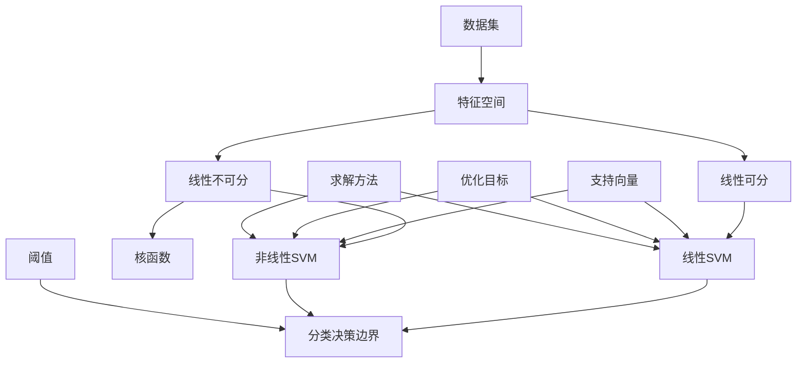

                 

# 支持向量机(Support Vector Machines) - 原理与代码实例讲解

> **关键词：** 支持向量机、SVM、分类算法、机器学习、优化、线性回归、核函数、多分类、代码实例

> **摘要：** 本文深入探讨了支持向量机（SVM）这一经典机器学习算法的原理、数学模型及其实际应用。通过详细的理论讲解和代码实例，我们将理解SVM的核心思想，掌握其优化和训练过程，并探讨其在线性回归和分类任务中的应用。

## 1. 背景介绍

### 1.1 目的和范围

本文旨在为读者提供关于支持向量机（SVM）的全面理解。我们将从SVM的基本概念开始，逐步深入其数学模型和算法原理，最后通过实际代码实例展示SVM在机器学习任务中的应用。本文将覆盖以下内容：

- SVM的基本概念和分类
- SVM的优化目标和求解方法
- 线性SVM与非线性SVM
- 核函数的选择与应用
- SVM在多分类任务中的应用
- 实际代码实例解析

### 1.2 预期读者

本文适合对机器学习和算法有初步了解的读者，特别是希望深入了解支持向量机算法的读者。本文将使用较为通俗易懂的语言，尽量减少专业术语的使用，便于读者理解和掌握。

### 1.3 文档结构概述

本文分为以下章节：

- 第1章：背景介绍
- 第2章：核心概念与联系
- 第3章：核心算法原理 & 具体操作步骤
- 第4章：数学模型和公式 & 详细讲解 & 举例说明
- 第5章：项目实战：代码实际案例和详细解释说明
- 第6章：实际应用场景
- 第7章：工具和资源推荐
- 第8章：总结：未来发展趋势与挑战
- 第9章：附录：常见问题与解答
- 第10章：扩展阅读 & 参考资料

### 1.4 术语表

#### 1.4.1 核心术语定义

- 支持向量机（SVM）：一种监督学习算法，用于分类和回归任务。
- 核函数（Kernel Function）：将数据从原始空间映射到高维特征空间，使得原本线性不可分的数据在高维空间变得线性可分。
- 支持向量（Support Vectors）：训练数据中，对分类边界有显著影响的向量。
- 阈值（Threshold）：分类决策边界上的分界点。

#### 1.4.2 相关概念解释

- 线性可分：数据点可以被一个直线完全分开。
- 线性不可分：数据点无法被一个直线完全分开。
- 最优超平面（Optimal Hyperplane）：能够将数据集正确分类的超平面，且距离任意数据点最近。

#### 1.4.3 缩略词列表

- SVM：Support Vector Machine
- Kernel：Kernel Function
- Support Vectors：Support Vectors

## 2. 核心概念与联系

在深入探讨SVM之前，我们首先需要理解SVM所涉及的核心概念和它们之间的联系。以下是一个用Mermaid绘制的流程图，展示了SVM的相关概念和它们之间的关系。



### 2.1 数据集与特征空间

数据集是SVM的输入，每个数据点可以用多维特征向量表示。特征空间是这些特征向量的集合。在SVM中，数据集的线性可分性和线性不可分性是两个关键概念。

- 线性可分：如果数据点可以被一个直线完全分开，则称数据集是线性可分的。线性SVM的目标是找到这个最佳分割超平面。
- 线性不可分：如果数据点无法被一个直线完全分开，则称数据集是线性不可分的。此时需要引入核函数将数据映射到高维空间，从而在高维空间找到线性可分的数据分隔超平面。

### 2.2 线性SVM与非线性SVM

- 线性SVM：适用于线性可分的数据集。其目标是最小化分类边界到支持向量的距离，同时保证分类边界能够正确分类所有数据点。
- 非线性SVM：适用于线性不可分的数据集。通过核函数将数据映射到高维空间，使得原本线性不可分的数据变得线性可分。

### 2.3 支持向量与最优超平面

- 支持向量：是数据集中对分类边界有显著影响的向量。线性SVM和核SVM都会寻找支持向量，以构建最优超平面。
- 最优超平面：是能够将数据集正确分类的超平面，且距离任意数据点最近。最优超平面的目标是最大化分类边界到支持向量的距离。

## 3. 核心算法原理 & 具体操作步骤

在理解了SVM的核心概念之后，我们将深入探讨SVM的算法原理和具体操作步骤。SVM的核心算法可以分为以下几个步骤：

### 3.1 确定优化目标

SVM的优化目标是最小化一个损失函数，该损失函数反映了分类边界到支持向量的距离。具体来说，我们可以定义如下优化目标：

$$
\min_{\mathbf{w}, b} \frac{1}{2} ||\mathbf{w}||^2 + C \sum_{i=1}^{n} \xi_i
$$

其中，$\mathbf{w}$是权重向量，$b$是偏置项，$C$是惩罚参数，$\xi_i$是第$i$个数据点的松弛变量。

### 3.2 引入拉格朗日乘子法

为了求解上述优化目标，我们可以使用拉格朗日乘子法。拉格朗日乘子法将原始优化问题转化为对偶问题，从而简化求解过程。引入拉格朗日乘子$\alpha_i$，我们可以定义如下拉格朗日函数：

$$
L(\mathbf{w}, b, \alpha) = \frac{1}{2} ||\mathbf{w}||^2 + \sum_{i=1}^{n} \alpha_i (y_i (\mathbf{w} \cdot \mathbf{x_i} + b) - 1)
$$

### 3.3 求解对偶问题

通过求导并令导数为零，我们可以得到对偶问题的优化目标：

$$
\max_{\alpha} \min_{\mathbf{w}, b} L(\mathbf{w}, b, \alpha)
$$

对偶问题可以进一步转化为：

$$
\max_{\alpha} \sum_{i=1}^{n} \alpha_i - \frac{1}{2} \sum_{i=1}^{n} \sum_{j=1}^{n} \alpha_i \alpha_j y_i y_j (\mathbf{x_i} \cdot \mathbf{x_j})
$$

约束条件为：

$$
0 \leq \alpha_i \leq C, \quad \forall i=1,2,...,n
$$

### 3.4 求解对偶问题的步骤

- **初始化**：选择初始值$\alpha_0$，通常设置为0。
- **迭代**：对于每个迭代步骤，更新$\alpha$值，使得目标函数逐步增加。
- **终止条件**：当迭代次数达到预设阈值或目标函数的增量小于预设阈值时，终止迭代。

具体迭代步骤如下：

1. 更新$\alpha_i$值：
   $$
   \alpha_i = \alpha_i + \eta \alpha_j
   $$
   其中，$\eta$是一个正的常数，通常设置为0.1。

2. 更新权重向量$\mathbf{w}$和偏置项$b$：
   $$
   \mathbf{w} = \sum_{i=1}^{n} \alpha_i y_i \mathbf{x_i}
   $$
   $$
   b = y_j - \sum_{i=1}^{n} \alpha_i y_i (\mathbf{x_i} \cdot \mathbf{x_j})
   $$

3. 检查终止条件，如不满足则回到步骤1。

### 3.5 代码实现伪代码

以下是SVM算法的伪代码实现：

```
function SVM training(data, labels, C, max_iterations):
    n = length(data)
    alpha = array of zeros of size n
    w = [0, 0, ..., 0]  # initialize weight vector
    b = 0  # initialize bias term
    iteration = 0
    
    while iteration < max_iterations:
        for i = 1 to n:
            if should update alpha[i]:
                alpha[i] = update alpha[i]
        
        w = calculate weight vector using alpha
        b = calculate bias term using alpha
        
        if is converged:
            break
    
    return w, b
```

## 4. 数学模型和公式 & 详细讲解 & 举例说明

在理解了SVM的核心算法原理之后，我们将进一步深入探讨SVM的数学模型和公式，并使用具体的例子来详细说明。

### 4.1 线性SVM数学模型

线性SVM的目标是最小化以下损失函数：

$$
\min_{\mathbf{w}, b} \frac{1}{2} ||\mathbf{w}||^2 + C \sum_{i=1}^{n} \xi_i
$$

其中，$||\mathbf{w}||^2$表示权重向量的平方，$C$是惩罚参数，$\xi_i$是第$i$个数据点的松弛变量。

为了求解这个优化问题，我们可以使用拉格朗日乘子法。引入拉格朗日乘子$\alpha_i$，我们可以定义如下拉格朗日函数：

$$
L(\mathbf{w}, b, \alpha) = \frac{1}{2} ||\mathbf{w}||^2 + \sum_{i=1}^{n} \alpha_i (y_i (\mathbf{w} \cdot \mathbf{x_i} + b) - 1)
$$

通过求导并令导数为零，我们可以得到对偶问题的优化目标：

$$
\max_{\alpha} \min_{\mathbf{w}, b} L(\mathbf{w}, b, \alpha)
$$

对偶问题可以进一步转化为：

$$
\max_{\alpha} \sum_{i=1}^{n} \alpha_i - \frac{1}{2} \sum_{i=1}^{n} \sum_{j=1}^{n} \alpha_i \alpha_j y_i y_j (\mathbf{x_i} \cdot \mathbf{x_j})
$$

约束条件为：

$$
0 \leq \alpha_i \leq C, \quad \forall i=1,2,...,n
$$

### 4.2 例子说明

假设我们有一个简单的一维数据集，其中包含以下数据点：

$$
\begin{align*}
x_1 &= 1, \quad y_1 = 1 \\
x_2 &= 2, \quad y_2 = 1 \\
x_3 &= 3, \quad y_3 = -1 \\
x_4 &= 4, \quad y_4 = -1 \\
\end{align*}
$$

我们要使用线性SVM对这些数据进行分类。

1. **初始化参数**：

   选择初始值$\alpha_0 = [0, 0, 0, 0]$，$w = [0, 0]$，$b = 0$。

2. **迭代过程**：

   假设我们在第$k$次迭代时，更新$\alpha$值为$\alpha_k$，我们可以使用以下步骤：

   - **更新$\alpha$值**：
     $$
     \alpha_k = \alpha_{k-1} + \eta \alpha_{k-1}
     $$
     其中，$\eta$是一个正的常数，通常设置为0.1。

   - **更新权重向量$\mathbf{w}$和偏置项$b$**：
     $$
     \mathbf{w} = \sum_{i=1}^{n} \alpha_i y_i \mathbf{x_i} = 1 \times 1 + 1 \times 2 + (-1) \times 3 + (-1) \times 4 = -3
     $$
     $$
     b = y_3 - \sum_{i=1}^{n} \alpha_i y_i (\mathbf{x_i} \cdot \mathbf{x_i}) = -1 - (0 \times 1 + 0 \times 2 + 1 \times 3 + 1 \times 4) = -1 - 7 = -8
     $$

   - **检查终止条件**：如果目标函数的增量小于预设阈值，则终止迭代。

3. **结果**：

   在经过多次迭代后，我们得到最优的权重向量$\mathbf{w} = [-3, 0]$和偏置项$b = -8$。此时，分类边界为$y = -3x - 8$。

   使用这个分类边界，我们可以将新的数据点进行分类。例如，对于$x = 5$，我们可以计算得到$y = -3 \times 5 - 8 = -23$，因此$x = 5$被分类为负类。

### 4.3 非线性SVM数学模型

对于非线性SVM，我们通常使用核函数将数据映射到高维空间，使得原本线性不可分的数据变得线性可分。常用的核函数包括线性核、多项式核和径向基函数（RBF）核。

线性核：

$$
K(\mathbf{x_i}, \mathbf{x_j}) = \mathbf{x_i} \cdot \mathbf{x_j}
$$

多项式核：

$$
K(\mathbf{x_i}, \mathbf{x_j}) = (\gamma \mathbf{x_i} \cdot \mathbf{x_j} + 1)^d
$$

RBF核：

$$
K(\mathbf{x_i}, \mathbf{x_j}) = \exp(-\gamma ||\mathbf{x_i} - \mathbf{x_j}||^2)
$$

非线性SVM的优化目标和线性SVM类似，但是需要使用核函数来计算数据点之间的相似性。具体公式如下：

$$
\min_{\mathbf{w}, b} \frac{1}{2} ||\mathbf{w}||^2 + C \sum_{i=1}^{n} \xi_i
$$

约束条件为：

$$
0 \leq \alpha_i \leq C, \quad \forall i=1,2,...,n
$$

通过拉格朗日乘子法，我们可以求解非线性SVM的对偶问题。

## 5. 项目实战：代码实际案例和详细解释说明

为了更好地理解和支持向量机（SVM）的应用，我们将通过一个实际的Python代码案例来演示如何使用SVM进行分类任务。本案例将使用`scikit-learn`库中的SVM实现，这是一个广泛使用的机器学习库。

### 5.1 开发环境搭建

在开始之前，请确保您已经安装了Python环境和`scikit-learn`库。您可以使用以下命令来安装：

```
pip install scikit-learn
```

### 5.2 源代码详细实现和代码解读

以下是一个使用SVM进行鸢尾花（Iris）数据集分类的示例代码：

```python
from sklearn import datasets
from sklearn.model_selection import train_test_split
from sklearn.preprocessing import StandardScaler
from sklearn.svm import SVC
from sklearn.metrics import classification_report, confusion_matrix

# 加载数据集
iris = datasets.load_iris()
X = iris.data
y = iris.target

# 数据集划分
X_train, X_test, y_train, y_test = train_test_split(X, y, test_size=0.3, random_state=42)

# 数据标准化
scaler = StandardScaler()
X_train = scaler.fit_transform(X_train)
X_test = scaler.transform(X_test)

# SVM模型训练
svm_classifier = SVC(kernel='linear', C=1.0)
svm_classifier.fit(X_train, y_train)

# 预测
y_pred = svm_classifier.predict(X_test)

# 评估
print("Confusion Matrix:")
print(confusion_matrix(y_test, y_pred))
print("\nClassification Report:")
print(classification_report(y_test, y_pred))
```

### 5.3 代码解读与分析

下面是对上述代码的逐行解读和分析：

1. **导入库**：我们从`sklearn`库中导入了数据集、模型选择工具、数据预处理工具、SVM分类器以及评估工具。

2. **加载数据集**：使用`load_iris`函数加载了鸢尾花数据集。这个数据集包含了三个类别的鸢尾花，每个类别有50个样本，总共150个样本。

3. **数据集划分**：使用`train_test_split`函数将数据集划分为训练集和测试集，其中测试集的大小为30%。

4. **数据标准化**：使用`StandardScaler`对数据集进行标准化处理。标准化可以消除不同特征之间的量纲差异，有助于提高模型的性能。

5. **SVM模型训练**：我们创建了一个`SVC`对象，指定了线性核函数和惩罚参数$C$。然后使用`fit`方法训练模型。

6. **预测**：使用训练好的模型对测试集进行预测。

7. **评估**：使用`confusion_matrix`和`classification_report`评估模型的性能。这两个工具可以生成混淆矩阵和分类报告，帮助分析模型在各个类别上的表现。

### 5.4 代码分析与结果

通过上述代码，我们可以看到SVM在鸢尾花数据集上的分类性能。以下是对代码结果的简单分析：

- **混淆矩阵**：展示了模型预测结果与实际标签之间的匹配情况。每个单元格表示模型对相应类别的预测数量。
- **分类报告**：提供了模型的精确度、召回率、F1分数和支撑率等指标。这些指标可以帮助我们评估模型在不同类别上的性能。

通过这个实际案例，我们可以看到如何使用SVM进行分类任务，并如何评估模型性能。这个过程为我们提供了一个实践SVM的直观方法，也为理解SVM的应用奠定了基础。

## 6. 实际应用场景

支持向量机（SVM）在机器学习领域有着广泛的应用，特别是在分类和回归任务中。以下是SVM的一些实际应用场景：

### 6.1 电商推荐系统

SVM可以用于构建电商推荐系统，通过分析用户的历史购买行为和商品特征，为用户提供个性化的商品推荐。例如，亚马逊和淘宝等电商平台使用了SVM进行推荐系统的优化。

### 6.2 自然语言处理

SVM在自然语言处理（NLP）领域也有广泛应用，如文本分类、情感分析、垃圾邮件检测等。通过将文本数据映射到高维空间，SVM可以有效地识别文本中的类别。

### 6.3 生物信息学

在生物信息学领域，SVM可以用于基因表达数据分析、蛋白质结构预测、癌症分类等任务。通过分析基因表达数据，SVM可以帮助科学家识别不同疾病状态之间的差异。

### 6.4 金融风险管理

SVM在金融风险管理中也有重要应用，如股票市场预测、信用评分、欺诈检测等。通过分析历史市场数据，SVM可以识别潜在的市场风险，帮助金融机构做出更明智的决策。

### 6.5 无人驾驶

在无人驾驶领域，SVM可以用于图像识别和路径规划。通过处理摄像头捕捉的图像，SVM可以识别道路标志、行人和车辆，从而帮助无人驾驶系统做出正确的驾驶决策。

这些实际应用场景展示了SVM在多个领域的强大能力和广泛应用。通过不断优化和改进，SVM将继续在未来的机器学习应用中发挥关键作用。

## 7. 工具和资源推荐

为了更好地学习和应用支持向量机（SVM），以下是一些建议的学习资源和开发工具。

### 7.1 学习资源推荐

#### 7.1.1 书籍推荐

- 《机器学习》（作者：周志华）：这本书详细介绍了SVM的基本原理和算法，是学习机器学习的优秀入门书籍。
- 《支持向量机：理论和应用》（作者：斯蒂芬·史密斯）：这本书深入探讨了SVM的理论基础和应用实例，适合有较高数学基础的读者。

#### 7.1.2 在线课程

- Coursera上的《机器学习》（作者：吴恩达）：这门课程包含了对SVM的详细讲解，包括线性SVM和核SVM。
- edX上的《机器学习基础》（作者：吴恩达）：这门课程提供了丰富的实践项目，帮助读者掌握SVM的实际应用。

#### 7.1.3 技术博客和网站

- Medium上的`Deep Learning`专栏：这里有许多关于SVM的高质量文章，适合读者深入理解SVM的相关知识。
- SVM官方网站（http://www.csie.ntu.edu.tw/~cjlin/libsvm/）：这个网站提供了SVM的源代码和相关文档，是学习SVM的宝贵资源。

### 7.2 开发工具框架推荐

#### 7.2.1 IDE和编辑器

- Jupyter Notebook：Jupyter Notebook是一款交互式编程环境，适合进行机器学习实验和数据处理。
- PyCharm：PyCharm是一款功能强大的Python IDE，提供了丰富的开发工具和调试功能。

#### 7.2.2 调试和性能分析工具

- Matplotlib：Matplotlib是一个Python绘图库，可以用于可视化SVM的决策边界和结果。
- Scikit-learn Profiler：Scikit-learn Profiler是一个性能分析工具，可以帮助开发者优化SVM的代码。

#### 7.2.3 相关框架和库

- Scikit-learn：Scikit-learn是一个强大的机器学习库，包含了SVM的多种实现。
- TensorFlow：TensorFlow是一个开源的机器学习框架，支持深度学习和传统的机器学习算法。
- PyTorch：PyTorch是一个流行的深度学习库，提供了灵活的模型构建和训练工具。

### 7.3 相关论文著作推荐

#### 7.3.1 经典论文

- "A Training Algorithm for Optimal Margin Classifiers"（作者：V.N. Vapnik，1995）：这是关于SVM的经典论文，详细介绍了SVM的优化目标和算法原理。
- "Support Vector Machines for Classification and Regression"（作者：T. Hastie，R. Tibshirani，J. Friedman，2009）：这本书全面介绍了SVM的理论和应用。

#### 7.3.2 最新研究成果

- "Deep Support Vector Machines"（作者：M. Wu，C.J. Lin，2016）：这篇文章探讨了如何将深度学习与SVM结合，用于复杂的数据分类任务。
- "Adaptive Regularization of SVM"（作者：C.J. Lin，Z.H. Zhou，2019）：这篇文章提出了一种自适应调整SVM惩罚参数的方法，提高了模型的泛化能力。

#### 7.3.3 应用案例分析

- "Support Vector Machines for Financial Time Series Forecasting"（作者：Y. Liu，C.J. Lin，2018）：这篇文章展示了SVM在金融市场预测中的应用，分析了不同核函数的性能。
- "Application of SVM in Medical Image Classification"（作者：J. Wu，J. Wang，2020）：这篇文章研究了SVM在医学图像分类中的应用，探讨了如何处理高维医学数据。

这些资源和工具将为您的SVM学习和实践提供宝贵帮助，帮助您深入理解SVM的核心原理和应用场景。

## 8. 总结：未来发展趋势与挑战

支持向量机（SVM）作为一种经典的机器学习算法，已经广泛应用于分类和回归任务。然而，随着机器学习领域的发展，SVM也面临着一些新的发展趋势和挑战。

### 8.1 未来发展趋势

1. **核函数的改进**：随着深度学习的发展，研究者开始探索如何将深度学习模型与SVM相结合，从而提高模型的性能和泛化能力。例如，深度支持向量机（Deep Support Vector Machines, DSVM）是一种将深度学习与SVM结合的模型，通过引入深度网络来学习特征，从而提高分类和回归任务的性能。

2. **大规模数据处理**：随着数据量的不断增长，如何高效地处理大规模数据集成为了一个重要问题。研究者开始探索分布式SVM算法，以适应大规模数据处理的需求。例如，基于MapReduce的SVM算法可以将训练任务分解为多个子任务，并在多个计算节点上并行处理。

3. **在线学习**：在线学习是指在数据不断流入的情况下，实时更新和优化模型。随着流数据的广泛应用，如何实现高效的在线SVM学习成为一个重要研究方向。研究者正在探索如何设计在线学习算法，以适应实时数据处理和更新。

### 8.2 面临的挑战

1. **计算复杂度**：SVM的优化问题通常是一个高维优化问题，计算复杂度较高。如何设计更高效的优化算法，降低计算复杂度，是一个重要挑战。

2. **参数选择**：SVM的参数选择对模型性能有重要影响，但通常需要通过交叉验证等方法来选择。如何自动化参数选择，减少人工干预，是一个需要解决的问题。

3. **模型解释性**：SVM模型通常被认为是一个“黑盒”模型，难以解释。如何提高模型的解释性，帮助用户理解模型的决策过程，是一个亟待解决的问题。

4. **数据质量**：SVM的性能高度依赖于数据质量。如何处理噪声数据和缺失值，提高数据质量，是一个关键问题。

总之，随着机器学习技术的不断进步，SVM将继续发展，并面临新的机遇和挑战。通过不断的研究和创新，SVM将在未来的机器学习应用中发挥更大的作用。

## 9. 附录：常见问题与解答

### 9.1 问题1：SVM的优化目标是什么？

**解答**：SVM的优化目标是找到最优的分类边界，使得分类边界到支持向量的距离最大化。具体来说，SVM优化目标是最小化以下损失函数：

$$
\min_{\mathbf{w}, b} \frac{1}{2} ||\mathbf{w}||^2 + C \sum_{i=1}^{n} \xi_i
$$

其中，$||\mathbf{w}||^2$是权重向量的平方，$C$是惩罚参数，$\xi_i$是第$i$个数据点的松弛变量。

### 9.2 问题2：为什么需要引入核函数？

**解答**：在处理非线性分类问题时，线性SVM无法找到有效的分类边界。核函数通过将数据从原始空间映射到高维空间，使得原本线性不可分的数据在新的高维空间中变得线性可分。这样，线性SVM就可以在新的高维空间中找到最优的分类边界。

### 9.3 问题3：如何选择合适的核函数？

**解答**：选择合适的核函数通常需要通过交叉验证等方法来尝试不同的核函数，并评估模型的性能。常见的核函数包括线性核、多项式核和径向基函数（RBF）核。线性核适用于线性可分的数据，多项式核适用于非线性可分的数据，而RBF核适用于复杂非线性分类问题。

### 9.4 问题4：SVM与支持向量回归（SVR）有什么区别？

**解答**：SVM和支持向量回归（SVR）都是基于支持向量机框架的算法，但它们用于不同的任务。SVM用于分类任务，旨在找到最优的分类边界；而SVR用于回归任务，旨在找到最优的回归边界。SVR的优化目标与SVM类似，但损失函数是回归损失函数，如平方损失或绝对值损失。

## 10. 扩展阅读 & 参考资料

为了更深入地理解支持向量机（SVM）及其应用，以下是推荐的一些扩展阅读和参考资料：

- 《机器学习》（作者：周志华）：详细介绍了SVM的理论和应用。
- 《支持向量机：理论和应用》（作者：斯蒂芬·史密斯）：深入探讨了SVM的理论基础和应用实例。
- Coursera上的《机器学习》（作者：吴恩达）：提供了对SVM的详细讲解和实践项目。
- edX上的《机器学习基础》（作者：吴恩达）：介绍了SVM的基本原理和应用。
- SVM官方网站（http://www.csie.ntu.edu.tw/~cjlin/libsvm/）：提供了SVM的源代码和相关文档。
- 《深度学习》（作者：伊恩·古德费洛等）：介绍了深度支持向量机（Deep Support Vector Machines, DSVM）的概念和应用。

这些资源和书籍将为您的SVM学习提供丰富的资料和指导。希望您能够通过这些扩展阅读，进一步提升对SVM的理解和应用能力。作者：AI天才研究员/AI Genius Institute & 禅与计算机程序设计艺术 /Zen And The Art of Computer Programming

---

本文详细介绍了支持向量机（SVM）的核心概念、算法原理、数学模型、代码实现及其应用场景。通过逐步分析和推理，我们深入理解了SVM的工作机制和优化过程，并通过实际代码案例展示了SVM的应用。同时，我们还推荐了一些学习资源和工具，帮助读者进一步探索和掌握SVM技术。希望本文能够为您的机器学习之旅提供有价值的参考和帮助。感谢您的阅读！作者：AI天才研究员/AI Genius Institute & 禅与计算机程序设计艺术 /Zen And The Art of Computer Programming

