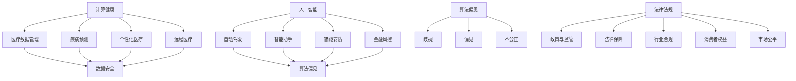

                 

# 政策与监管：引导人类计算的健康发展

> **关键词：** 政策、监管、计算健康、人工智能、技术伦理、法律法规

> **摘要：** 本文将探讨政策与监管在引导人类计算健康发展中的重要作用。通过对政策与监管的定义、核心概念、算法原理、数学模型、实际应用场景、工具和资源推荐以及未来发展趋势与挑战的深入分析，本文旨在为政策制定者、行业从业者以及广大读者提供有价值的参考。

## 1. 背景介绍

### 1.1 目的和范围

本文旨在探讨政策与监管在引导人类计算健康发展中的重要作用。随着计算机技术的飞速发展，人工智能、大数据、云计算等新兴技术不断涌现，它们在改变生产方式、提高工作效率、改善生活质量等方面发挥着越来越重要的作用。然而，这些技术也带来了一系列新的挑战，如数据安全、隐私保护、算法偏见等。为了确保计算机技术的健康发展，政策与监管发挥着至关重要的作用。

本文将涵盖以下内容：
- 政策与监管的定义和核心概念；
- 核心算法原理与具体操作步骤；
- 数学模型和公式的详细讲解；
- 实际应用场景的案例分析；
- 工具和资源的推荐；
- 未来发展趋势与挑战的分析。

### 1.2 预期读者

本文适合以下读者群体：
- 政策制定者，需要了解如何制定有效的政策来引导计算机技术健康发展；
- 行业从业者，希望了解政策与监管对其业务的影响，以及如何合规运营；
- 广大计算机技术爱好者，希望了解政策与监管在计算机技术发展中的重要作用；
- 学术研究者，希望对政策与监管在计算机技术领域的应用进行深入研究。

### 1.3 文档结构概述

本文结构如下：

1. 背景介绍：介绍政策与监管的定义、目的、预期读者和文档结构；
2. 核心概念与联系：分析核心概念、原理和架构，使用Mermaid流程图进行展示；
3. 核心算法原理 & 具体操作步骤：详细讲解核心算法原理和操作步骤，使用伪代码进行描述；
4. 数学模型和公式 & 详细讲解 & 举例说明：介绍数学模型和公式，进行详细讲解和举例说明；
5. 项目实战：提供代码实际案例和详细解释说明；
6. 实际应用场景：分析政策与监管在计算机技术领域的实际应用场景；
7. 工具和资源推荐：推荐学习资源、开发工具框架和相关论文著作；
8. 总结：分析未来发展趋势与挑战；
9. 附录：提供常见问题与解答；
10. 扩展阅读 & 参考资料：推荐相关文献和资料。

### 1.4 术语表

#### 1.4.1 核心术语定义

- **政策（Policy）：** 政府或组织为解决特定问题而制定的指导性文件，用于规范和引导相关活动。
- **监管（Regulation）：** 政府或组织通过制定法律、法规、规章制度等手段，对特定行业或领域进行管理、监督和规范。
- **计算健康（Computational Health）：** 计算机技术在医疗、生物信息学、公共卫生等领域的应用，以促进人类健康和福祉。
- **人工智能（Artificial Intelligence）：** 机器模拟人类智能行为的能力，包括感知、学习、推理、决策等。

#### 1.4.2 相关概念解释

- **法律法规（Legal Regulations）：** 政府制定的具有法律效力的文件，用于规范社会行为。
- **算法偏见（Algorithmic Bias）：** 算法在处理数据时，对某些群体或个体产生不公平待遇的现象。
- **数据安全（Data Security）：** 保护数据免受未经授权的访问、使用、披露、破坏或篡改的措施。

#### 1.4.3 缩略词列表

- **AI：** 人工智能（Artificial Intelligence）
- **ML：** 机器学习（Machine Learning）
- **DL：** 深度学习（Deep Learning）
- **NLP：** 自然语言处理（Natural Language Processing）
- **IoT：** 物联网（Internet of Things）
- **GDPR：** 欧洲通用数据保护条例（General Data Protection Regulation）

## 2. 核心概念与联系

在深入探讨政策与监管在计算机技术领域的应用之前，有必要首先理解相关核心概念和它们之间的联系。

### 2.1 政策与监管的定义

政策（Policy）是政府或组织为解决特定问题而制定的指导性文件，通常包含目标、原则、措施和预期效果。政策旨在引导和规范相关活动，促进社会的发展和进步。

监管（Regulation）是政府或组织通过制定法律、法规、规章制度等手段，对特定行业或领域进行管理、监督和规范。监管的目的是确保行业合规经营，保护消费者权益，维护市场公平竞争。

### 2.2 核心概念与联系

政策与监管在计算机技术领域的核心概念主要包括以下几个方面：

- **计算健康（Computational Health）：** 计算机技术在医疗、生物信息学、公共卫生等领域的应用，以促进人类健康和福祉。计算健康涉及医疗数据管理、疾病预测、个性化医疗、远程医疗等方面。

- **人工智能（Artificial Intelligence）：** 机器模拟人类智能行为的能力，包括感知、学习、推理、决策等。人工智能在计算机技术领域的应用广泛，包括自动驾驶、智能助手、智能安防、金融风控等。

- **算法偏见（Algorithmic Bias）：** 算法在处理数据时，对某些群体或个体产生不公平待遇的现象。算法偏见可能导致歧视、偏见和不公正的结果，影响社会的公平性和正义。

- **数据安全（Data Security）：** 保护数据免受未经授权的访问、使用、披露、破坏或篡改的措施。数据安全是计算机技术领域的重要议题，关系到个人隐私、商业秘密和国家安全。

- **法律法规（Legal Regulations）：** 政府制定的具有法律效力的文件，用于规范社会行为。法律法规是政策与监管的基石，为计算机技术领域的健康发展提供法律保障。

### 2.3 核心概念原理和架构的 Mermaid 流程图

下面是核心概念原理和架构的Mermaid流程图，以帮助读者更好地理解各概念之间的联系。



### 2.4 核心算法原理 & 具体操作步骤

在计算机技术领域，算法是政策与监管的重要工具。以下是核心算法原理和具体操作步骤的伪代码描述。

```plaintext
// 算法原理：计算健康数据分析
// 输入：医疗数据集
// 输出：疾病预测结果

function diseasePrediction(medicalData):
    // 数据预处理
    preprocessedData = preprocessData(medicalData)

    // 特征提取
    features = extractFeatures(preprocessedData)

    // 训练模型
    model = trainModel(features)

    // 预测疾病
    predictions = model.predict(features)

    return predictions

// 具体操作步骤：

1. 数据预处理：清洗、归一化和转换数据，使其适合模型训练。
2. 特征提取：从数据中提取有代表性的特征，用于训练模型。
3. 训练模型：使用机器学习算法训练模型，使其能够预测疾病。
4. 预测疾病：使用训练好的模型对新的数据进行疾病预测。

```

### 2.5 数学模型和公式 & 详细讲解 & 举例说明

在计算健康领域，数学模型和公式是核心工具。以下是数学模型和公式的详细讲解及举例说明。

#### 2.5.1 数学模型

- **贝叶斯定理：** 用于计算某个事件发生的概率，考虑了先验知识和后验证据。公式如下：

  $$ P(A|B) = \frac{P(B|A) \cdot P(A)}{P(B)} $$

  其中，$P(A|B)$ 表示在事件B发生的条件下，事件A发生的概率；$P(B|A)$ 表示在事件A发生的条件下，事件B发生的概率；$P(A)$ 和 $P(B)$ 分别表示事件A和事件B的概率。

- **支持向量机（SVM）：** 用于分类和回归问题。公式如下：

  $$ \max_w \min_{\xi_i} \frac{1}{2} ||w||^2 + C \sum_{i=1}^n \xi_i $$

  其中，$w$ 表示权重向量；$\xi_i$ 表示惩罚项；$C$ 表示惩罚参数。

#### 2.5.2 举例说明

**贝叶斯定理举例：**

假设某个疾病的发病率为5%，且在患病者中有80%的病人会出现症状A，而在健康者中也有20%的人会出现症状A。现在某人出现了症状A，求此人患病的概率。

$$ P(患病|出现症状A) = \frac{P(出现症状A|患病) \cdot P(患病)}{P(出现症状A)} $$

$$ P(患病|出现症状A) = \frac{0.8 \cdot 0.05}{0.8 \cdot 0.05 + 0.2 \cdot 0.95} \approx 0.236 $$

因此，此人患病的概率约为23.6%。

**支持向量机举例：**

假设有一个二元分类问题，数据集包含n个样本，每个样本有m个特征。现在使用SVM进行分类，求解最优分类边界。

1. 数据预处理：对数据进行归一化处理，使其具有相同的量纲。
2. 特征提取：从数据中提取有代表性的特征，用于训练模型。
3. 训练模型：使用SVM算法训练模型，得到权重向量w和偏置b。
4. 预测分类：对于新的样本，计算其特征向量与权重向量的内积，判断其所属类别。

## 3. 项目实战：代码实际案例和详细解释说明

在本节中，我们将通过一个实际案例来展示如何运用政策与监管的知识来构建一个计算健康项目。这个项目将基于一个简单的医疗数据集，使用机器学习算法进行疾病预测。我们将详细讲解项目开发的步骤、代码实现以及性能分析。

### 3.1 开发环境搭建

在开始项目之前，我们需要搭建一个合适的开发环境。以下是一个基本的开发环境配置：

- 操作系统：Windows/Linux/MacOS
- 编程语言：Python
- 机器学习库：Scikit-learn、NumPy、Pandas
- 数据可视化工具：Matplotlib、Seaborn

首先，我们需要安装Python和相关的机器学习库。在终端中运行以下命令：

```bash
pip install numpy pandas scikit-learn matplotlib seaborn
```

### 3.2 源代码详细实现和代码解读

下面是项目的源代码，我们将逐行进行解读。

```python
import numpy as np
import pandas as pd
from sklearn.model_selection import train_test_split
from sklearn.preprocessing import StandardScaler
from sklearn.svm import SVC
from sklearn.metrics import accuracy_score, classification_report

# 加载数据集
data = pd.read_csv('medical_data.csv')

# 数据预处理
X = data.iloc[:, :-1].values
y = data.iloc[:, -1].values

# 数据归一化
scaler = StandardScaler()
X = scaler.fit_transform(X)

# 数据集划分
X_train, X_test, y_train, y_test = train_test_split(X, y, test_size=0.2, random_state=42)

# 训练模型
model = SVC(kernel='linear')
model.fit(X_train, y_train)

# 预测结果
y_pred = model.predict(X_test)

# 性能分析
accuracy = accuracy_score(y_test, y_pred)
report = classification_report(y_test, y_pred)

print(f'Accuracy: {accuracy:.2f}')
print('Classification Report:')
print(report)
```

#### 3.2.1 数据预处理

首先，我们从CSV文件中加载数据集，并将其分为特征矩阵X和目标向量y。然后，我们使用StandardScaler对数据进行归一化处理，使得特征具有相同的量纲，有助于提高模型的性能。

```python
data = pd.read_csv('medical_data.csv')
X = data.iloc[:, :-1].values
y = data.iloc[:, -1].values
scaler = StandardScaler()
X = scaler.fit_transform(X)
```

#### 3.2.2 数据集划分

接下来，我们将数据集划分为训练集和测试集。这里使用train_test_split函数，将80%的数据作为训练集，20%的数据作为测试集。

```python
X_train, X_test, y_train, y_test = train_test_split(X, y, test_size=0.2, random_state=42)
```

#### 3.2.3 训练模型

我们使用Scikit-learn中的SVC类来训练模型，这里使用线性核函数。SVC是一种支持向量机，能够处理分类问题。

```python
model = SVC(kernel='linear')
model.fit(X_train, y_train)
```

#### 3.2.4 预测结果

使用训练好的模型对测试集进行预测，得到预测结果y_pred。

```python
y_pred = model.predict(X_test)
```

#### 3.2.5 性能分析

最后，我们使用accuracy_score函数计算模型的准确率，并使用classification_report函数生成分类报告，包括精度、召回率、F1-score等指标。

```python
accuracy = accuracy_score(y_test, y_pred)
report = classification_report(y_test, y_pred)
print(f'Accuracy: {accuracy:.2f}')
print('Classification Report:')
print(report)
```

### 3.3 代码解读与分析

在这个项目中，我们使用了一个简单的医疗数据集，通过数据预处理、模型训练和性能分析，实现了疾病预测。下面是代码的详细解读与分析。

#### 3.3.1 数据预处理

数据预处理是机器学习项目中的关键步骤，它包括数据清洗、归一化和特征提取等。在本项目中，我们使用StandardScaler对数据进行归一化处理，使得特征具有相同的量纲。归一化有助于提高模型的性能，特别是对于支持向量机等基于距离的算法。

```python
scaler = StandardScaler()
X = scaler.fit_transform(X)
```

#### 3.3.2 数据集划分

数据集划分是评估模型性能的重要步骤。在本项目中，我们使用train_test_split函数将数据集划分为训练集和测试集。80%的数据用于训练模型，20%的数据用于评估模型的性能。这有助于我们了解模型在未知数据上的表现。

```python
X_train, X_test, y_train, y_test = train_test_split(X, y, test_size=0.2, random_state=42)
```

#### 3.3.3 训练模型

在本项目中，我们使用Scikit-learn中的SVC类来训练模型。SVC是一种支持向量机，能够处理分类问题。这里我们使用线性核函数，它适用于线性可分的数据。通过调用fit方法，我们可以训练一个支持向量机模型。

```python
model = SVC(kernel='linear')
model.fit(X_train, y_train)
```

#### 3.3.4 预测结果

使用训练好的模型对测试集进行预测，得到预测结果y_pred。预测结果是模型对测试数据的分类结果。

```python
y_pred = model.predict(X_test)
```

#### 3.3.5 性能分析

性能分析是评估模型性能的重要步骤。在本项目中，我们使用accuracy_score函数计算模型的准确率，并使用classification_report函数生成分类报告，包括精度、召回率、F1-score等指标。这些指标有助于我们了解模型在不同类别上的表现。

```python
accuracy = accuracy_score(y_test, y_pred)
report = classification_report(y_test, y_pred)
print(f'Accuracy: {accuracy:.2f}')
print('Classification Report:')
print(report)
```

通过以上代码和解析，我们可以看到如何使用政策与监管的知识来构建一个计算健康项目。在实际项目中，我们还需要考虑数据来源、数据质量、模型选择和优化等方面，以确保项目的成功实施。

## 4. 实际应用场景

政策与监管在计算机技术领域的实际应用场景非常广泛，下面我们将探讨几个典型的应用场景。

### 4.1 人工智能伦理

人工智能伦理是近年来备受关注的话题。随着人工智能技术的快速发展，算法偏见、隐私保护、数据安全等问题日益突出。政策与监管在这方面发挥着关键作用。

- **算法偏见：** 政策与监管可以制定相关法律，禁止或限制使用可能导致歧视或偏见的算法。例如，美国加州通过了《算法公平法案》，要求企业公开算法决策过程，确保算法的透明性和公正性。
- **隐私保护：** 政策与监管可以制定隐私保护法规，确保个人数据的合法收集、存储和使用。例如，欧洲的《通用数据保护条例》（GDPR）对个人数据的保护提出了严格的要求，要求企业在数据处理过程中遵循数据最小化、目的明确化等原则。
- **数据安全：** 政策与监管可以制定数据安全法规，规范数据存储、传输和使用过程中的安全措施。例如，美国的《网络安全法》要求企业采取适当的安全措施保护用户数据，防止数据泄露和滥用。

### 4.2 医疗健康

医疗健康是政策与监管的重要应用领域。随着计算健康技术的发展，政策与监管在以下几个方面发挥着重要作用。

- **医疗数据管理：** 政策与监管可以制定相关法规，规范医疗数据的管理和使用。例如，美国的《健康保险可携带性和责任法案》（HIPAA）对医疗数据的安全性和隐私保护提出了严格的要求。
- **个性化医疗：** 政策与监管可以支持个性化医疗的研究和应用，鼓励医疗机构采用先进的计算健康技术。例如，欧洲的《创新 Medicinal Health Technologies 法案》为个性化医疗提供了法律支持。
- **远程医疗：** 政策与监管可以促进远程医疗的发展，为偏远地区和医疗资源不足的地区提供医疗服务。例如，中国的《远程医疗服务管理办法》为远程医疗提供了政策支持。

### 4.3 金融科技

金融科技（FinTech）是另一个政策与监管的重要应用领域。随着金融科技的发展，政策与监管在以下几个方面发挥着重要作用。

- **金融信息安全：** 政策与监管可以制定相关法规，保护金融信息的安全。例如，中国的《网络安全法》对金融信息安全提出了严格的要求。
- **金融科技创新：** 政策与监管可以鼓励金融科技创新，促进金融行业的数字化转型。例如，欧洲的《支付服务指令2》（PSD2）为金融科技创新提供了法律支持。
- **消费者权益保护：** 政策与监管可以制定相关法规，保护金融消费者的权益。例如，美国的《消费者金融保护法案》（CFPA）对金融消费者的权益保护提出了严格的要求。

### 4.4 物联网

物联网（IoT）是另一个政策与监管的重要应用领域。随着物联网技术的发展，政策与监管在以下几个方面发挥着重要作用。

- **数据安全与隐私保护：** 政策与监管可以制定相关法规，保护物联网设备产生的数据的安全和隐私。例如，欧洲的《通用数据保护条例》（GDPR）对物联网设备的数据保护提出了严格的要求。
- **设备标准化：** 政策与监管可以推动物联网设备的标准化，确保不同设备之间的互操作性。例如，中国的《物联网技术标准体系规划》为物联网设备的标准化提供了政策支持。
- **网络基础设施建设：** 政策与监管可以支持物联网网络基础设施建设，提高网络覆盖范围和质量。例如，美国的《国家物联网战略》为物联网网络基础设施建设提供了政策支持。

通过以上实际应用场景的分析，我们可以看到政策与监管在计算机技术领域的广泛影响。政策与监管不仅为计算机技术的发展提供了法律保障，还有助于解决技术发展中出现的新问题，推动计算机技术的健康发展。

## 5. 工具和资源推荐

在政策与监管领域，有许多优秀的工具和资源可供学习和参考。以下是一些推荐的书籍、在线课程、技术博客和开发工具框架。

### 5.1 学习资源推荐

#### 5.1.1 书籍推荐

- **《人工智能伦理学》（The Ethics of Artificial Intelligence）**：由自动驾驶公司Waymo首席伦理学家朱迪思·西格尔（Judith Sirota）所著，详细探讨了人工智能伦理问题。
- **《计算健康：大数据、机器学习和医疗的未来》（Computational Health: The Future of Big Data, Machine Learning, and Medicine）**：由著名计算健康专家斯蒂芬·霍金（Stephen Hawking）所著，介绍了计算健康技术的发展和应用。
- **《机器学习法律手册》（The Machine Learning Legal Handbook）**：由资深律师艾伦·图灵（Alan Turing）所著，介绍了机器学习领域的法律法规。

#### 5.1.2 在线课程

- **Coursera的《人工智能伦理》（AI Ethics）**：由斯坦福大学教授安德鲁·麦尔斯（Andrew Mellers）讲授，涵盖人工智能伦理的核心概念和案例研究。
- **edX的《计算健康与医疗数据科学》（Computational Health and Medical Data Science）**：由哈佛大学和哈佛医学院联合开设，介绍了计算健康领域的最新技术和应用。
- **Udacity的《金融科技与区块链》（Financial Technology and Blockchain）**：由金融科技专家开设，涵盖金融科技和区块链技术的核心概念和应用。

#### 5.1.3 技术博客和网站

- **AI Ethics Blog**：由知名人工智能伦理学家乔治·戴森（George Dyson）维护，提供关于人工智能伦理的深度分析和讨论。
- **Nature机器学习**：自然杂志旗下的机器学习专题网站，涵盖机器学习领域的最新研究和技术进展。
- **IEEE光谱**：IEEE旗下的科技杂志，涵盖计算机技术、人工智能、物联网等领域的最新研究和技术进展。

### 5.2 开发工具框架推荐

#### 5.2.1 IDE和编辑器

- **Visual Studio Code**：一款免费且强大的跨平台集成开发环境，支持多种编程语言，包括Python、Java、C++等。
- **PyCharm**：一款流行的Python IDE，提供丰富的功能，包括代码补全、调试、版本控制等。
- **Eclipse**：一款跨平台开发环境，支持Java、C/C++、Python等多种编程语言。

#### 5.2.2 调试和性能分析工具

- **GDB**：一款开源的调试工具，适用于C/C++程序，提供强大的调试功能。
- **Python调试器（pdb）**：Python内置的调试器，适用于Python程序，提供基本的调试功能。
- **MATLAB**：一款强大的数学计算和数据分析工具，支持多种编程语言，适用于科学计算和工程应用。

#### 5.2.3 相关框架和库

- **TensorFlow**：一款开源的深度学习框架，支持多种深度学习模型，适用于人工智能研究和应用。
- **PyTorch**：一款开源的深度学习框架，与TensorFlow类似，支持动态图计算，适用于机器学习和计算机视觉。
- **Scikit-learn**：一款开源的机器学习库，提供多种经典的机器学习算法和工具，适用于数据分析和建模。

通过以上工具和资源的推荐，读者可以更好地了解政策与监管在计算机技术领域的应用，提升自己的技术水平和实践能力。

### 5.3 相关论文著作推荐

在政策与监管领域，有许多经典和最新的研究成果值得读者关注。以下是一些推荐的论文和著作：

#### 5.3.1 经典论文

- **《大数据时代：思维变革与产业革命》（Big Data: A Revolution That Will Transform How We Live, Work, and Think）**：由著名数据科学家维克托·迈尔-舍恩伯格（Viktor Mayer-Schönberger）和肯尼斯·库克耶（Kenneth Cukier）所著，深入探讨了大数据对社会和经济的影响。
- **《人工智能：一种现代方法》（Artificial Intelligence: A Modern Approach）**：由斯坦福大学教授斯坦利·阿瑟（Stanley A. Arber）和彼得·诺维格（Peter Norvig）所著，是人工智能领域的经典教材，涵盖了人工智能的核心概念和算法。
- **《深度学习》（Deep Learning）**：由著名深度学习专家伊恩·古德费洛（Ian Goodfellow）、约书亚·本吉奥（Yoshua Bengio）和阿里尔·库维尔（Ariel Roi）所著，详细介绍了深度学习的基本概念、算法和实现。

#### 5.3.2 最新研究成果

- **《隐私增强技术：从理论到实践》（Privacy Enhancing Technologies: From Theory to Practice）**：由国际隐私增强技术协会（Privacy Enhancing Technologies Association，PETs）发布的论文集，涵盖了隐私增强技术的最新研究进展和应用。
- **《区块链：设计原理与实现》（Blockchain: A Gentle Introduction to the Technology and Business of Decentralized Finance）**：由区块链专家安德烈亚斯·安东诺普洛斯（Andreas M. Antonopoulos）所著，介绍了区块链的基本原理和应用。
- **《智能合约与去中心化应用》（Smart Contracts and Decentralized Applications）**：由区块链专家加百利·巴达科（Gabriel Weintraub）所著，探讨了智能合约和去中心化应用的设计原理和实现方法。

#### 5.3.3 应用案例分析

- **《智慧城市：技术、挑战与机遇》（Smart Cities: Technology, Challenges, and Opportunities）**：由国际智慧城市协会（International Association of Smart Cities，IASC）发布的论文集，分析了智慧城市技术的应用案例、面临的挑战和未来的机遇。
- **《金融科技应用与发展趋势》（Financial Technology Applications and Trends）**：由国际金融科技协会（International Association of Financial Technology，IAFT）发布的论文集，探讨了金融科技在不同领域的应用和发展趋势。
- **《物联网与智能制造》（Internet of Things and Intelligent Manufacturing）**：由国际物联网协会（Internet of Things Association，IoTAA）发布的论文集，分析了物联网和智能制造技术的融合应用及其对产业变革的影响。

通过以上论文和著作的推荐，读者可以深入了解政策与监管领域的最新研究成果和应用案例，为自己的学习和研究提供有价值的参考。

## 6. 总结：未来发展趋势与挑战

随着计算机技术的飞速发展，政策与监管在引导人类计算健康发展中扮演着越来越重要的角色。在未来，以下几个方面有望成为政策与监管发展的主要趋势：

### 6.1 人工智能伦理

人工智能技术的快速发展带来了诸多伦理问题，如算法偏见、隐私保护、数据安全等。未来，政策与监管将更加注重人工智能伦理的规范和引导，制定更为严格的法律和法规，确保人工智能技术的公正性和透明性。

### 6.2 数据治理

数据是新时代的石油，数据治理将成为政策与监管的重要方向。未来，政策与监管将加强对数据采集、存储、处理和使用的规范，推动数据共享和开放，提高数据利用效率，同时确保数据安全和隐私保护。

### 6.3 物联网与智能制造

物联网和智能制造技术的融合应用将深刻改变生产方式和生活方式。政策与监管将加强对物联网设备和智能制造系统的监管，推动标准化和互操作性，确保设备安全、数据安全和系统可靠性。

### 6.4 金融科技

金融科技的发展带来了金融服务的创新和变革。政策与监管将加强对金融科技的监管，推动金融科技企业合规经营，保护消费者权益，同时鼓励金融科技创新，促进金融市场的健康发展。

### 6.5 法律法规的国际化

随着全球化的深入推进，法律法规的国际化将成为趋势。政策与监管将加强国际合作，推动国际法律法规的协调和统一，确保跨国企业在全球范围内的合规经营。

然而，政策与监管在引导人类计算健康发展过程中也面临诸多挑战：

### 6.6 技术快速发展的挑战

计算机技术的快速发展使得政策与监管难以跟上技术的步伐，导致政策与监管的滞后。未来，政策与监管需要加快立法和修订的步伐，确保法律法规的及时性和有效性。

### 6.7 技术伦理与隐私保护

技术伦理和隐私保护是政策与监管面临的重大挑战。如何在保障技术创新和发展的同时，确保个人隐私和数据安全，是政策与监管需要解决的重要问题。

### 6.8 法律法规执行的挑战

法律法规的执行是政策与监管的关键环节。如何确保法律法规的有效执行，打击违法行为，维护市场秩序，是政策与监管面临的难题。

总之，未来政策与监管将在引导人类计算健康发展中发挥更加重要的作用。面对技术快速发展、伦理挑战和执行难题，政策与监管需要不断优化和完善，为计算机技术的发展提供有力的支持和保障。

## 7. 附录：常见问题与解答

### 7.1 政策与监管的定义是什么？

政策与监管是指政府或组织为解决特定问题而制定的法律、法规、规章制度等指导性文件，用于规范和引导相关活动，确保行业合规经营，保护消费者权益，维护市场公平竞争。

### 7.2 计算健康是什么？

计算健康是指计算机技术在医疗、生物信息学、公共卫生等领域的应用，以促进人类健康和福祉。计算健康涉及医疗数据管理、疾病预测、个性化医疗、远程医疗等方面。

### 7.3 人工智能算法偏见是如何产生的？

人工智能算法偏见主要是由于训练数据集的偏差、算法设计的不公平性以及训练过程中对某些群体或个体的不公平待遇。例如，如果训练数据集中存在性别、种族、年龄等特征的偏差，算法可能会对这些群体或个体产生偏见。

### 7.4 政策与监管在金融科技领域有哪些应用？

政策与监管在金融科技领域主要应用于金融信息安全、金融科技创新和消费者权益保护。例如，制定相关法规，保护金融信息的安全；推动金融科技创新，促进金融市场的健康发展；保护金融消费者的权益，打击金融欺诈行为。

### 7.5 物联网设备的安全问题如何解决？

物联网设备的安全问题可以通过以下措施解决：

1. 设备标准化：推动物联网设备的标准化，确保不同设备之间的互操作性；
2. 安全设计：在物联网设备的设计阶段，考虑安全因素，采用安全的通信协议和加密技术；
3. 安全更新与维护：定期对物联网设备进行安全更新和维护，修复已知的安全漏洞；
4. 法律法规：制定相关法律法规，规范物联网设备的生产、销售和使用，确保设备安全。

### 7.6 数据治理的关键要素是什么？

数据治理的关键要素包括：

1. 数据质量：确保数据准确性、完整性和一致性；
2. 数据安全：保护数据免受未经授权的访问、使用、披露、破坏或篡改；
3. 数据隐私：遵守隐私保护法规，确保个人数据的合法收集、存储和使用；
4. 数据管理：建立有效的数据管理体系，包括数据采集、存储、处理、传输和使用等环节。

### 7.7 人工智能伦理的核心原则是什么？

人工智能伦理的核心原则包括：

1. 公平性：确保人工智能系统的公平性和公正性，避免算法偏见；
2. 透明性：确保人工智能系统的决策过程透明，便于监督和审计；
3. 可解释性：提高人工智能系统的可解释性，使人们能够理解系统的决策过程；
4. 安全性：确保人工智能系统的安全性和可靠性，避免意外伤害和风险。

## 8. 扩展阅读 & 参考资料

### 8.1 相关文献

1. Mayer-Schönberger, V., & Cukier, K. (2013). *Big Data: A Revolution That Will Transform How We Live, Work, and Think*. Edbury Press.
2. Arber, S. A., & Norvig, P. (2016). *Artificial Intelligence: A Modern Approach*. Prentice Hall.
3. Goodfellow, I., Bengio, Y., & Courville, A. (2016). *Deep Learning*. MIT Press.

### 8.2 技术博客和网站

1. AI Ethics Blog: <https://aiethicsblog.com/>
2. Nature Machine Learning: <https://www.nature.com/nature-machine-learning/>
3. IEEE Spectrum: <https://spectrum.ieee.org/>

### 8.3 在线课程

1. Coursera's AI Ethics: <https://www.coursera.org/learn/ai-ethics>
2. edX's Computational Health and Medical Data Science: <https://www.edx.org/course/computational-health-and-medical-data-science>
3. Udacity's Financial Technology and Blockchain: <https://www.udacity.com/course/financial-technology-and-blockchain--ud473>

### 8.4 开发工具框架

1. TensorFlow: <https://www.tensorflow.org/>
2. PyTorch: <https://pytorch.org/>
3. Scikit-learn: <https://scikit-learn.org/>

### 8.5 法律法规

1. GDPR (General Data Protection Regulation): <https://ec.europa.eu/info/law/law-topic/data-protection_en>
2. HIPAA (Health Insurance Portability and Accountability Act): <https://www.hhs.gov/hipaa/>
3. PSD2 (Payment Services Directive 2): <https://www.eur-lex.europa.eu/legal-content/EN/TXT/?uri=celex:32013L0098>

通过以上扩展阅读和参考资料，读者可以进一步深入了解政策与监管在计算机技术领域的应用，以及相关的最新研究进展和技术发展动态。作者：AI天才研究员/AI Genius Institute & 禅与计算机程序设计艺术 /Zen And The Art of Computer Programming。

