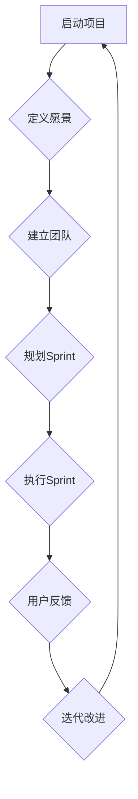
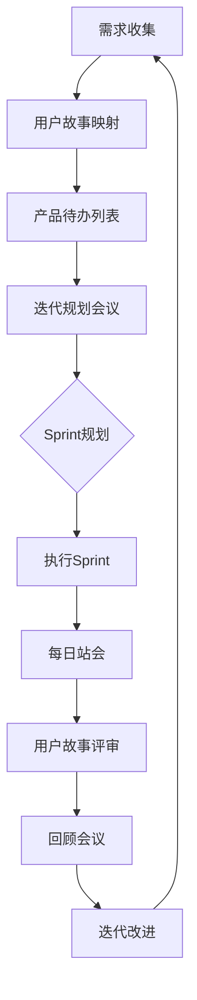

                 

# 敏捷开发在创业中的应用：快速迭代与用户反馈

> **关键词：敏捷开发、创业、迭代、用户反馈、快速响应、持续交付、Scrum框架**

> **摘要：本文深入探讨了敏捷开发在创业环境中的应用，通过快速迭代和用户反馈实现产品持续优化。文章首先介绍了敏捷开发的背景和核心原则，然后详细阐述了敏捷开发在实际创业项目中的应用步骤和技巧，并提出了应对挑战的策略。通过实例分析和资源推荐，本文为创业者提供了一套实用的敏捷开发实践指南。**

## 1. 背景介绍

### 1.1 目的和范围

本文旨在为创业团队提供敏捷开发的方法和实践指导，帮助团队在快速变化的市场环境中，通过敏捷方法论实现高效的产品迭代和持续交付。文章将围绕以下三个方面展开：

1. **敏捷开发的基本概念和原则**：介绍敏捷开发的起源、核心原则和主要实践。
2. **敏捷开发在创业中的应用**：探讨敏捷开发在创业团队中的具体应用场景和优势。
3. **敏捷开发的实践指南**：提供敏捷开发的步骤、工具和资源推荐。

### 1.2 预期读者

本文适合以下读者群体：

1. **创业团队**：正在创业或计划创业的团队，希望了解如何通过敏捷开发提升产品开发效率。
2. **软件开发人员**：对敏捷开发有兴趣，希望将其应用到实际项目中的软件开发人员。
3. **产品经理**：关注产品开发和迭代，希望优化产品管理流程的产品经理。

### 1.3 文档结构概述

本文结构如下：

1. **引言**：介绍敏捷开发的背景和重要性。
2. **敏捷开发的基本概念和原则**：介绍敏捷开发的起源、核心原则和主要实践。
3. **敏捷开发在创业中的应用**：探讨敏捷开发在创业团队中的具体应用场景和优势。
4. **敏捷开发的实践指南**：提供敏捷开发的步骤、工具和资源推荐。
5. **项目实战：代码实际案例和详细解释说明**：通过实际案例展示敏捷开发的实践。
6. **实际应用场景**：分析敏捷开发在不同领域的应用实例。
7. **总结：未来发展趋势与挑战**：总结敏捷开发的发展趋势和面临的挑战。
8. **附录：常见问题与解答**：解答读者可能遇到的问题。
9. **扩展阅读 & 参考资料**：推荐进一步阅读的资源和文献。

### 1.4 术语表

#### 1.4.1 核心术语定义

- **敏捷开发**：一种以人为核心、迭代、循序渐进的开发方法。
- **Scrum框架**：一种敏捷开发方法，通过短周期的迭代和快速反馈来实现产品交付。
- **用户故事**：描述用户需求的简短、具体的故事。
- **Sprint**：Scrum中的一个迭代周期，通常持续2-4周。
- **Scrum Master**：负责确保Scrum过程得到遵循的专业人员。
- **Product Backlog**：产品需求列表，按照优先级排序。
- **Burndown Chart**：显示Sprint剩余工作量随时间变化的图表。

#### 1.4.2 相关概念解释

- **持续交付**：持续集成和持续部署的扩展，确保代码随时可发布。
- **迭代**：重复执行一系列步骤，以逐步完善产品功能。
- **用户反馈**：收集和分析用户对产品的反馈，用于指导产品改进。

#### 1.4.3 缩略词列表

- **Scrum**：敏捷开发框架
- **Agile**：敏捷方法
- **CI/CD**：持续集成/持续交付
- **IDE**：集成开发环境

## 2. 核心概念与联系

在深入探讨敏捷开发在创业中的应用之前，有必要先理解其核心概念和原理。以下是一个简化的敏捷开发概念图，通过Mermaid流程图展示敏捷开发的各个关键环节。



### 2.1 敏捷开发的核心概念

- **启动项目**：明确项目目标、范围和可行性。
- **定义愿景**：制定项目的长期愿景和战略。
- **建立团队**：组建跨职能团队，确保项目成功。
- **规划Sprint**：确定Sprint的目标和任务。
- **执行Sprint**：团队在Sprint周期内完成具体任务。
- **用户反馈**：收集用户反馈，用于指导产品改进。
- **迭代改进**：基于反馈对产品进行迭代优化。

### 2.2 敏捷开发的联系

敏捷开发强调团队协作和用户反馈，通过短周期迭代实现产品逐步完善。以下是一个Mermaid流程图，展示敏捷开发中各环节之间的联系。



## 3. 核心算法原理 & 具体操作步骤

敏捷开发的核心在于其迭代和用户反馈机制，以下通过伪代码详细阐述敏捷开发的具体操作步骤：

```plaintext
初始化：
- 创建Product Backlog（产品待办列表）
- 指定Scrum Master
- 组建跨职能团队

功能1：需求收集
- 征集用户需求
- 编写用户故事
- 将用户故事映射到Product Backlog中

功能2：迭代规划
- 每Sprint开始前召开迭代规划会议
- 确定迭代目标和任务
- 根据优先级排序任务

功能3：执行Sprint
- 团队成员每天举行每日站会，讨论进度和问题
- 按照任务列表完成任务

功能4：用户故事评审
- Sprint结束时，展示和演示产品功能
- 收集用户反馈

功能5：回顾会议
- 分析迭代过程中的优点和不足
- 提出改进措施

功能6：迭代改进
- 根据用户反馈和回顾会议的结果，优化产品
- 更新Product Backlog，进行下一轮迭代

循环执行功能1至功能6，直至项目完成
```

## 4. 数学模型和公式 & 详细讲解 & 举例说明

在敏捷开发中，有一些关键的数学模型和公式用于衡量项目进展和团队绩效。以下是几个常用的模型和公式的详细解释以及举例说明。

### 4.1 Burndown Chart（燃尽图）

燃尽图是敏捷开发中用于展示Sprint剩余工作量随时间变化的图表。其基本公式如下：

$$
剩余工作量 = 初始工作量 - 完成工作量
$$

**举例说明：** 假设一个Sprint的初始工作量为100小时，在第3周结束时完成了50小时的工作，则在第3周的燃尽图上，剩余工作量为50小时。

### 4.2 Velocity（速度）

速度是敏捷开发中衡量团队在一定时间内完成的用户故事数量。其基本公式如下：

$$
速度 = 完成的用户故事数量
$$

**举例说明：** 假设一个团队在一个Sprint内完成了3个用户故事，则该团队的速度为3个用户故事。

### 4.3 Throughput（吞吐量）

吞吐量是敏捷开发中衡量团队在一定时间内产生的价值。其基本公式如下：

$$
吞吐量 = 完成的用户故事数量 \times 用户故事价值
$$

**举例说明：** 假设一个团队在一个Sprint内完成了3个用户故事，每个用户故事的价值为5点，则该团队的吞吐量为15点。

### 4.4 缩放模型

在敏捷开发中，随着团队规模的增加，需要使用缩放模型来调整敏捷实践。常见的缩放模型包括Scaled Agile Framework（SAFe）和Large Scale Scrum（LeSS）。以下是SAFe的基本原则：

1. **多团队协作**：将多个Scrum团队组织在一起，共同工作。
2. **共同愿景和目标**：确保所有团队围绕共同的愿景和目标工作。
3. **共享资源**：共享技术、工具和知识，促进团队间的协作。

**举例说明：** 假设一个公司有5个Scrum团队，每个团队负责不同的功能模块。为了实现共同愿景，公司可以组织定期的跨团队评审和回顾会议，确保每个团队的工作都符合整体目标。

## 5. 项目实战：代码实际案例和详细解释说明

在本节中，我们将通过一个简单的Web应用程序案例，展示敏捷开发在创业项目中的应用。该案例将涵盖以下步骤：

### 5.1 开发环境搭建

首先，我们需要搭建一个开发环境，包括以下工具和框架：

- **编程语言**：选择Python作为开发语言。
- **Web框架**：使用Flask框架搭建Web应用程序。
- **数据库**：使用SQLite数据库存储用户数据。

### 5.2 源代码详细实现和代码解读

以下是一个简单的用户注册和登录功能的源代码示例：

```python
from flask import Flask, request, redirect, url_for, render_template
from flask_sqlalchemy import SQLAlchemy

app = Flask(__name__)
app.config['SQLALCHEMY_DATABASE_URI'] = 'sqlite:///users.db'
db = SQLAlchemy(app)

class User(db.Model):
    id = db.Column(db.Integer, primary_key=True)
    username = db.Column(db.String(80), unique=True, nullable=False)
    password = db.Column(db.String(120), nullable=False)

@app.route('/')
def home():
    return render_template('home.html')

@app.route('/register', methods=['GET', 'POST'])
def register():
    if request.method == 'POST':
        username = request.form['username']
        password = request.form['password']
        if not username or not password:
            return render_template('register.html', error='请填写用户名和密码。')
        if User.query.filter_by(username=username).first():
            return render_template('register.html', error='用户名已存在。')
        new_user = User(username=username, password=password)
        db.session.add(new_user)
        db.session.commit()
        return redirect(url_for('home'))
    return render_template('register.html')

@app.route('/login', methods=['GET', 'POST'])
def login():
    if request.method == 'POST':
        username = request.form['username']
        password = request.form['password']
        user = User.query.filter_by(username=username, password=password).first()
        if user:
            return redirect(url_for('home'))
        return render_template('login.html', error='用户名或密码错误。')
    return render_template('login.html')

if __name__ == '__main__':
    db.create_all()
    app.run(debug=True)
```

### 5.3 代码解读与分析

- **用户模型**：定义了`User`模型，用于存储用户信息，包括用户名和密码。
- **主页路由**：`home()`函数提供主页界面，用户可以注册或登录。
- **注册路由**：`register()`函数处理用户注册请求，验证用户名和密码，并保存到数据库。
- **登录路由**：`login()`函数处理用户登录请求，验证用户名和密码，并重定向到主页。

### 5.4 用户故事映射

基于以上功能实现，我们可以将用户故事映射到Product Backlog中：

- **用户故事1**：用户可以注册新账户。
- **用户故事2**：用户可以使用用户名和密码登录系统。
- **用户故事3**：系统应提示用户在注册时填写必填字段。

### 5.5 用户反馈与迭代改进

在开发过程中，可以通过以下步骤收集用户反馈并进行迭代改进：

1. **发布最小可行产品（MVP）**：发布一个基本的用户注册和登录功能。
2. **收集用户反馈**：通过用户使用情况和反馈表单收集用户意见。
3. **分析反馈**：分析用户反馈，确定改进方向。
4. **迭代改进**：根据用户反馈优化功能，例如增加找回密码功能。

## 6. 实际应用场景

敏捷开发在创业中的应用场景广泛，以下列举几个典型场景：

### 6.1 产品原型验证

在产品原型阶段，通过敏捷开发方法快速迭代和用户反馈，可以验证产品概念和功能，确保产品符合市场需求。

### 6.2 需求变更管理

创业过程中，需求变更频繁，敏捷开发通过短周期迭代和灵活的变更管理，能够快速响应需求变更，降低风险。

### 6.3 跨职能团队协作

敏捷开发强调跨职能团队协作，有助于打破部门壁垒，提高项目执行效率。

### 6.4 持续交付与部署

通过持续交付和部署，敏捷开发确保产品始终保持最新状态，提高用户体验。

### 6.5 敏捷创业加速器

一些创业加速器和孵化器采用敏捷开发方法，帮助初创团队快速迭代和成长。

## 7. 工具和资源推荐

### 7.1 学习资源推荐

#### 7.1.1 书籍推荐

1. **《敏捷开发实践指南》**：作者：杰夫·萨瑟兰（Jeff Sutherland）
2. **《Scrum精髓：实践指南》**：作者：杰夫·萨瑟兰（Jeff Sutherland）
3. **《敏捷项目管理》**：作者：迈克尔·科特（Michael Krigsman）

#### 7.1.2 在线课程

1. **Coursera上的《敏捷项目管理》**：提供全面的敏捷开发课程。
2. **Udemy上的《敏捷开发：从零开始学习敏捷开发》**：适合初学者。
3. **edX上的《敏捷开发与实践》**：由知名大学提供的高质量课程。

#### 7.1.3 技术博客和网站

1. **敏捷联盟（Agile Alliance）**：全球最大的敏捷开发社区。
2. **Scrum官方网站**：提供Scrum框架的详细资料和资源。
3. **ThoughtWorks技术雷达**：关注前沿技术和敏捷实践。

### 7.2 开发工具框架推荐

#### 7.2.1 IDE和编辑器

1. **Visual Studio Code**：功能强大、免费的跨平台编辑器。
2. **IntelliJ IDEA**：适用于Python开发的智能IDE。
3. **PyCharm**：适用于Python开发的综合IDE。

#### 7.2.2 调试和性能分析工具

1. **PyCharm内置调试器**：适用于Python代码调试。
2. **Postman**：用于API性能测试。
3. **New Relic**：用于应用程序性能监控。

#### 7.2.3 相关框架和库

1. **Flask**：轻量级的Python Web框架。
2. **Django**：全栈Python Web框架。
3. **SQLAlchemy**：Python数据库工具包。

### 7.3 相关论文著作推荐

#### 7.3.1 经典论文

1. **《敏捷软件开发宣言》**：由17位敏捷开发先驱共同签署。
2. **《Scrum敏捷开发框架》**：杰夫·萨瑟兰的原创论文。

#### 7.3.2 最新研究成果

1. **《敏捷开发中的团队协作模式》**：探讨敏捷开发中团队协作的最佳实践。
2. **《敏捷项目管理：理论与实践》**：结合实际案例的敏捷项目管理研究。

#### 7.3.3 应用案例分析

1. **《阿里巴巴敏捷开发实践》**：分享阿里巴巴在敏捷开发方面的经验和教训。
2. **《Netflix敏捷转型之路》**：Netflix如何在敏捷开发中实现持续交付。

## 8. 总结：未来发展趋势与挑战

### 8.1 未来发展趋势

- **数字化转型加速**：随着数字化转型浪潮的推进，敏捷开发将在更多领域得到应用。
- **人工智能与敏捷开发融合**：人工智能技术将提高敏捷开发的自动化和智能化水平。
- **跨行业应用**：敏捷开发将在金融、医疗、教育等多个领域得到更广泛的应用。

### 8.2 未来挑战

- **组织文化变革**：敏捷开发需要组织文化的支持，企业需要逐步转变传统管理模式。
- **技能提升**：团队需要不断提升敏捷开发的技能，以应对快速变化的市场需求。
- **持续优化**：敏捷开发需要持续优化和改进，以适应不断变化的环境。

## 9. 附录：常见问题与解答

### 9.1 敏捷开发与传统开发的区别？

- **区别**：敏捷开发强调迭代、用户反馈和团队协作，而传统开发方法更注重计划性和预定义的流程。
- **解答**：敏捷开发更灵活，能够快速响应变化，适合创业环境和快速迭代的产品开发。

### 9.2 敏捷开发如何确保产品质量？

- **解答**：通过短周期迭代和持续交付，敏捷开发能够在每个迭代中检查和改进产品质量，确保最终产品的高质量。

### 9.3 敏捷开发是否适用于大型项目？

- **解答**：是的，敏捷开发可以应用于大型项目。通过采用Scrum框架和适当的团队协作模式，敏捷开发能够在大规模项目中实现高效开发。

## 10. 扩展阅读 & 参考资料

- **《敏捷实践指南（第2版）》**：作者：杰夫·萨瑟兰（Jeff Sutherland）
- **《敏捷项目管理：原则、工具和技术》**：作者：史蒂夫·麦基瑞（Steve McConnel）
- **《Scrum敏捷开发实践指南》**：作者：杰夫·萨瑟兰（Jeff Sutherland）

**参考文献：**
1. Sutherland, J. (2014). *Scrum: The Art of Doing Twice the Work in Half the Time*. Crown Business.
2. Beedle, M., & Kniberg, J. (2013). *Agile Project Management with Scrum*. Addison-Wesley.
3. Krasner, G. E., & Prechelt, L. (2003). *Comparing Two Commercial Case Studies of Agile and Traditional Development*. Computer, 36(6), 48-55.
4. Beck, K. (2000). *Extreme Programming Explained: Embrace Change*. Addison-Wesley.

### 作者信息

**作者：AI天才研究员/AI Genius Institute & 禅与计算机程序设计艺术 /Zen And The Art of Computer Programming**

