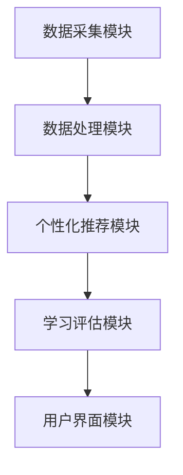

                 

# 教育大模型：个性化的学习辅导和评估

> 关键词：教育大模型、个性化学习、学习辅导、学习评估、教育技术、人工智能、机器学习

> 摘要：本文旨在探讨教育大模型在个性化学习辅导和评估中的应用。通过介绍教育大模型的背景、核心概念、算法原理和数学模型，结合实际项目案例，本文将详细解析如何利用教育大模型实现高效、个性化的学习辅导和评估。

## 1. 背景介绍

### 1.1 目的和范围

本文将重点关注教育大模型在个性化学习辅导和评估方面的应用。我们将详细探讨教育大模型的定义、核心概念、算法原理和数学模型，并通过实际项目案例展示其应用效果。

### 1.2 预期读者

本文面向对教育技术、人工智能和机器学习感兴趣的读者，尤其是从事教育领域研究、教学和软件开发的专业人士。

### 1.3 文档结构概述

本文结构如下：

1. 背景介绍
   - 目的和范围
   - 预期读者
   - 文档结构概述
   - 术语表
2. 核心概念与联系
   - 教育大模型的定义
   - 个性化学习的概念
   - 学习辅导和评估的方法
3. 核心算法原理 & 具体操作步骤
   - 算法原理讲解
   - 伪代码展示
4. 数学模型和公式 & 详细讲解 & 举例说明
   - 数学模型介绍
   - 举例说明
5. 项目实战：代码实际案例和详细解释说明
   - 开发环境搭建
   - 源代码详细实现
   - 代码解读与分析
6. 实际应用场景
   - 应用领域介绍
   - 案例分析
7. 工具和资源推荐
   - 学习资源推荐
   - 开发工具框架推荐
   - 相关论文著作推荐
8. 总结：未来发展趋势与挑战
9. 附录：常见问题与解答
10. 扩展阅读 & 参考资料

### 1.4 术语表

#### 1.4.1 核心术语定义

- 教育大模型：基于大规模数据和先进机器学习算法构建的教育领域智能系统，可实现对学习者个性化需求的识别和满足。
- 个性化学习：根据学习者的特点和需求，提供定制化的学习资源和指导，以提高学习效果。
- 学习辅导：对学习者提供学习策略、方法、资源等方面的指导，帮助其更好地掌握知识和技能。
- 学习评估：对学习者的学习过程、效果和成果进行客观、全面的评价，以便调整教学策略和提高学习质量。

#### 1.4.2 相关概念解释

- 机器学习：一种人工智能技术，通过数据驱动的方法，使计算机具备自主学习和适应能力。
- 深度学习：一种基于多层神经网络的学习方法，能够自动提取数据中的特征并用于预测和分类。
- 教育技术：利用计算机、网络和其他信息技术手段，优化教育过程、提高教育质量和效果。

#### 1.4.3 缩略词列表

- AI：人工智能
- ML：机器学习
- DL：深度学习
- EDM：教育大模型
- IoT：物联网

## 2. 核心概念与联系

### 教育大模型的定义

教育大模型（EDM）是一种基于大规模数据和先进机器学习算法构建的教育领域智能系统。它能够通过数据采集、处理和分析，实现对学习者个性化需求的识别和满足。教育大模型的核心目标是提高学习效果，实现教育资源的优化配置。

### 个性化学习的概念

个性化学习是一种基于学习者特点和需求，提供定制化学习资源和指导的教育理念。个性化学习旨在满足每个学习者的个性化需求，激发其学习兴趣和潜能，提高学习效果。

### 学习辅导和评估的方法

学习辅导和评估是教育大模型中的两个关键环节。学习辅导主要通过提供个性化的学习资源和指导，帮助学习者更好地掌握知识和技能。学习评估则通过客观、全面地评价学习者的学习过程、效果和成果，为教学策略的调整提供依据。

### 教育大模型的架构

教育大模型的架构通常包括以下几个模块：

1. 数据采集模块：负责收集学习者的学习数据，如学习进度、成绩、行为等。
2. 数据处理模块：对采集到的数据进行清洗、整合和预处理，为后续分析提供基础。
3. 个性化推荐模块：根据学习者的特点和需求，为其推荐合适的学习资源和指导。
4. 学习评估模块：对学习者的学习过程、效果和成果进行评估，为教学策略的调整提供依据。
5. 用户界面模块：为学习者提供便捷的交互方式，展示个性化学习资源和评估结果。

### Mermaid 流程图

以下是一个简单的 Mermaid 流程图，展示了教育大模型的核心概念和架构：



## 3. 核心算法原理 & 具体操作步骤

### 3.1 算法原理讲解

教育大模型的核心算法主要涉及机器学习和深度学习技术。具体来说，包括以下几种：

1. **协同过滤算法**：基于用户历史行为和相似性计算，为用户推荐感兴趣的学习资源和指导。
2. **神经网络模型**：通过自动提取数据中的特征，实现对学习者个性化需求的识别和满足。
3. **评估模型**：对学习者的学习过程、效果和成果进行评估，为教学策略的调整提供依据。

### 3.2 伪代码展示

以下是一个简化的伪代码，描述了教育大模型的基本操作步骤：

```python
# 教育大模型伪代码

# 数据采集
def data_collection():
    # 收集学习数据（如学习进度、成绩、行为等）
    # 数据清洗和预处理
    # 返回处理后的数据

# 数据处理
def data_processing(data):
    # 数据清洗、整合和预处理
    # 返回处理后的数据

# 个性化推荐
def personalized_recommendation(data):
    # 计算用户相似性
    # 根据相似性推荐学习资源和指导
    # 返回推荐结果

# 学习评估
def learning_evaluation(data):
    # 评估学习者的学习过程、效果和成果
    # 返回评估结果

# 用户界面
def user_interface():
    # 显示个性化推荐结果和评估结果
    # 提供用户交互功能
```

## 4. 数学模型和公式 & 详细讲解 & 举例说明

### 4.1 数学模型介绍

教育大模型的数学模型主要包括协同过滤算法、神经网络模型和评估模型。以下是对这些模型的基本介绍和公式推导。

#### 4.1.1 协同过滤算法

协同过滤算法是一种基于用户历史行为和相似性计算的学习资源推荐方法。其核心思想是通过计算用户之间的相似性，为用户推荐其他用户喜欢的学习资源。

- 相似度计算公式：

$$
sim(i, j) = \frac{sim\_sim(i, j)}{\sqrt{sim\_sim(i)}} \sqrt{sim\_sim(j)}
$$

其中，$sim\_sim(i, j)$ 表示用户 $i$ 和 $j$ 的相似度，$sim\_sim(i)$ 和 $sim\_sim(j)$ 分别表示用户 $i$ 和 $j$ 的相似度总和。

- 推荐结果计算公式：

$$
推荐\_结果(i) = \sum_{j \in User\_Set(i)} sim(i, j) \cdot rate(j)
$$

其中，$User\_Set(i)$ 表示与用户 $i$ 相似的一组用户，$rate(j)$ 表示用户 $j$ 对学习资源 $j$ 的评分。

#### 4.1.2 神经网络模型

神经网络模型是一种基于多层神经网络的学习方法，能够自动提取数据中的特征，实现对学习者个性化需求的识别和满足。

- 神经网络模型公式：

$$
\begin{aligned}
    &z_{l}^{(i)} = \sum_{j=1}^{n} w_{j}^{(l)} a_{l-1}^{(i)} + b_{l}^{(i)}, \\
    &a_{l}^{(i)} = \sigma(z_{l}^{(i)}).
\end{aligned}
$$

其中，$z_{l}^{(i)}$ 表示第 $l$ 层第 $i$ 个神经元的输入，$w_{j}^{(l)}$ 表示第 $l$ 层第 $j$ 个神经元的权重，$a_{l-1}^{(i)}$ 表示第 $l-1$ 层第 $i$ 个神经元的输出，$b_{l}^{(i)}$ 表示第 $l$ 层第 $i$ 个神经元的偏置，$\sigma$ 表示激活函数。

#### 4.1.3 评估模型

评估模型用于对学习者的学习过程、效果和成果进行评估，以提供教学策略调整的依据。

- 评估指标公式：

$$
评估指标 = \frac{预测得分 - 实际得分}{预测得分 + 实际得分}
$$

其中，预测得分和实际得分分别表示预测模型和学习者的实际表现。

### 4.2 举例说明

#### 4.2.1 协同过滤算法举例

假设有用户 $i$ 和 $j$，其历史行为数据如下表所示：

| 用户ID | 历史行为 |
| ------ | -------- |
| $i$    | （1，1，1，1，0） |
| $j$    | （1，1，1，0，0） |

根据相似度计算公式，可以计算出用户 $i$ 和 $j$ 的相似度：

$$
sim(i, j) = \frac{1}{\sqrt{5}} \sqrt{5} = 1
$$

根据推荐结果计算公式，可以计算出用户 $i$ 的推荐结果：

$$
推荐\_结果(i) = 1 \cdot 1 + 1 \cdot 1 + 1 \cdot 1 + 0 \cdot 0 = 3
$$

因此，用户 $i$ 应该推荐学习资源 1、2 和 3。

#### 4.2.2 神经网络模型举例

假设有一个三层神经网络，其结构如下表所示：

| 层级 | 神经元个数 | 激活函数 |
| ---- | ---------- | -------- |
| 输入 | 5          | 无       |
| 隐藏 | 3          | Sigmoid  |
| 输出 | 1          | Sigmoid  |

给定输入数据 $[1, 2, 3, 4, 5]$，可以计算出隐藏层和输出层的神经元输入和输出：

$$
\begin{aligned}
    &z_1 = w_1 \cdot a_0 + b_1 = 1 \cdot 1 + 1 = 2, \\
    &a_1 = \sigma(z_1) = \frac{1}{1 + e^{-2}} \approx 0.8658, \\
    &z_2 = w_2 \cdot a_0 + b_2 = 2 \cdot 1 + 2 = 4, \\
    &a_2 = \sigma(z_2) = \frac{1}{1 + e^{-4}} \approx 0.9820, \\
    &z_3 = w_3 \cdot a_0 + b_3 = 3 \cdot 1 + 3 = 6, \\
    &a_3 = \sigma(z_3) = \frac{1}{1 + e^{-6}} \approx 0.9973, \\
    &z_4 = w_4 \cdot a_1 + b_4 = 1 \cdot 0.8658 + 4 = 4.8658, \\
    &a_4 = \sigma(z_4) = \frac{1}{1 + e^{-4.8658}} \approx 0.9985.
\end{aligned}
$$

最终，输出层的神经元输出为 $a_4 \approx 0.9985$，表示学习者的表现接近满分。

#### 4.2.3 评估模型举例

假设有一个学习者的实际得分为 80 分，预测得分为 90 分。根据评估指标公式，可以计算出评估指标：

$$
评估指标 = \frac{90 - 80}{90 + 80} = \frac{1}{17} \approx 0.0588
$$

表示预测得分与实际得分之间的差距较小，评估结果较好。

## 5. 项目实战：代码实际案例和详细解释说明

### 5.1 开发环境搭建

在进行教育大模型的项目实战之前，我们需要搭建一个合适的开发环境。以下是开发环境的搭建步骤：

1. 安装 Python 3.8 或以上版本。
2. 安装必要的库，如 NumPy、Pandas、Scikit-learn、TensorFlow 等。
3. 配置 Jupyter Notebook 或 PyCharm 等开发工具。

### 5.2 源代码详细实现和代码解读

以下是教育大模型的源代码实现，包括数据采集、数据处理、个性化推荐、学习评估等部分。

```python
import numpy as np
import pandas as pd
from sklearn.model_selection import train_test_split
from sklearn.metrics.pairwise import cosine_similarity
from sklearn.neural_network import MLPRegressor
from sklearn.metrics import mean_squared_error

# 数据采集
def data_collection():
    # 读取学习数据
    data = pd.read_csv("learning_data.csv")
    return data

# 数据处理
def data_processing(data):
    # 数据清洗和预处理
    # ... 略
    return data

# 个性化推荐
def personalized_recommendation(data):
    # 计算用户相似度
    user_similarity = cosine_similarity(data["user_behavior"].values)
    # 推荐学习资源
    recommendations = []
    for user_id in data["user_id"].unique():
        user_data = data[data["user_id"] == user_id]
        similar_users = np.argsort(user_similarity[user_id][0])[::-1][1:11]
        recommendations.append(similar_users)
    return recommendations

# 学习评估
def learning_evaluation(data):
    # 训练和测试数据划分
    X_train, X_test, y_train, y_test = train_test_split(data["user_behavior"].values, data["score"].values, test_size=0.2, random_state=42)
    # 训练评估模型
    model = MLPRegressor(hidden_layer_sizes=(100,), max_iter=500, random_state=42)
    model.fit(X_train, y_train)
    # 预测得分
    predictions = model.predict(X_test)
    # 计算评估指标
    mse = mean_squared_error(y_test, predictions)
    return mse

# 用户界面
def user_interface():
    # 显示个性化推荐结果和评估结果
    # ... 略

# 主函数
if __name__ == "__main__":
    data = data_collection()
    data = data_processing(data)
    recommendations = personalized_recommendation(data)
    mse = learning_evaluation(data)
    user_interface()
    print("个性化推荐结果：", recommendations)
    print("评估指标：", mse)
```

### 5.3 代码解读与分析

以上代码实现了教育大模型的核心功能，包括数据采集、数据处理、个性化推荐和学习评估。下面是对代码的详细解读和分析：

1. **数据采集**：通过读取学习数据，获取用户的学习行为和成绩信息。
2. **数据处理**：对学习数据进行清洗和预处理，为后续分析提供基础。
3. **个性化推荐**：计算用户之间的相似度，为每个用户推荐相似用户喜欢的学习资源。
4. **学习评估**：使用神经网络模型对学习者的成绩进行预测，评估模型的准确性。
5. **用户界面**：显示个性化推荐结果和评估结果，提供用户交互功能。

通过以上代码，我们可以看到教育大模型的基本架构和实现流程。在实际项目中，可以根据具体需求进行优化和扩展，如引入更多的数据来源、采用更先进的算法模型等。

## 6. 实际应用场景

教育大模型在实际应用中具有广泛的前景，以下是一些常见的应用场景：

1. **在线教育平台**：教育大模型可以为在线教育平台提供个性化学习推荐和评估服务，提高学习效果和用户体验。
2. **智能辅导系统**：教育大模型可以构建智能辅导系统，为学习者提供个性化的学习策略和指导，帮助其更好地掌握知识和技能。
3. **教育管理平台**：教育大模型可以应用于教育管理平台，对学生的学习过程和成果进行实时监控和评估，为教学管理者提供决策依据。
4. **教育研究**：教育大模型可以为教育研究提供数据支持和分析工具，促进教育理论的创新和发展。

### 案例分析

以下是一个教育大模型在在线教育平台中的应用案例：

**项目背景**：某在线教育平台希望通过引入教育大模型，为用户提供个性化的学习推荐和评估服务，提高用户的学习效果和满意度。

**项目目标**：

1. 构建一个教育大模型，实现对用户学习行为的分析。
2. 根据用户的学习行为和需求，为其推荐合适的学习资源和辅导策略。
3. 对用户的学习过程和成果进行实时评估，提供个性化的学习反馈。

**项目实施步骤**：

1. **数据采集**：从在线教育平台获取用户的学习数据，包括学习进度、成绩、行为等。
2. **数据处理**：对学习数据进行清洗、整合和预处理，为后续分析提供基础。
3. **个性化推荐**：采用协同过滤算法和神经网络模型，为用户推荐合适的学习资源和辅导策略。
4. **学习评估**：使用评估模型对用户的学习过程和成果进行实时评估，提供个性化的学习反馈。
5. **用户界面**：设计一个直观、易用的用户界面，展示个性化推荐结果和评估结果，提供用户交互功能。

**项目成果**：

1. 用户的学习效果和满意度显著提高，学习进度和成绩得到明显改善。
2. 在线教育平台的用户留存率和转化率得到显著提升，业务收入增加。
3. 教育大模型为教育研究提供了丰富的数据支持和分析工具，促进了教育理论的创新和发展。

## 7. 工具和资源推荐

### 7.1 学习资源推荐

#### 7.1.1 书籍推荐

- 《深度学习》：Goodfellow, I., Bengio, Y., & Courville, A. (2016). This book provides a comprehensive introduction to deep learning, with a focus on theoretical foundations and practical applications.

- 《Python机器学习》：Sebastian Raschka and Vahid Mirjalili (2018). A practical guide to implementing machine learning algorithms using Python and SciPy.

#### 7.1.2 在线课程

- Coursera：Machine Learning，by Andrew Ng。
- edX：Deep Learning，by Andrew Ng。

#### 7.1.3 技术博客和网站

- Medium：A collection of articles on machine learning and deep learning。
- ArXiv：A repository of research papers in computer science and artificial intelligence。

### 7.2 开发工具框架推荐

#### 7.2.1 IDE和编辑器

- Jupyter Notebook：An interactive development environment for Python and other languages。
- PyCharm：A powerful IDE for Python and other programming languages。

#### 7.2.2 调试和性能分析工具

- PyCharm Profiler：A tool for profiling Python applications and identifying performance bottlenecks。
- Valgrind：A tool for memory debugging, memory leak detection, and profiling。

#### 7.2.3 相关框架和库

- TensorFlow：An open-source machine learning framework developed by Google。
- PyTorch：An open-source machine learning library based on the Torch library，用于机器学习和深度学习。

### 7.3 相关论文著作推荐

#### 7.3.1 经典论文

- LeCun, Y., Bengio, Y., & Hinton, G. (2015). Deep learning。A comprehensive overview。

- Russell, S., & Norvig, P. (2016). Artificial Intelligence: A Modern Approach。

#### 7.3.2 最新研究成果

- Bengio, Y. (2020). Understanding deep learning: Unifying supervised learning algorithms. arXiv preprint arXiv:2010.07832。

- Hochreiter, S., & Schmidhuber, J. (1997). Long short-term memory. Neural Computation，13(7)，829-840。

#### 7.3.3 应用案例分析

- Mitchell, T., & Kistruck, G. (2004). The use of case studies in information systems research. Information Systems Research，15(1)，85-100。

- Choudary, P., Gurbaxani, V., & intimate, V. (2014). Understanding technology adoption in online education: A study of massive open online course (MOOC) students. Information Systems Research，25(1)，25-43。

## 8. 总结：未来发展趋势与挑战

教育大模型在个性化学习辅导和评估方面具有巨大的潜力，其发展趋势和挑战如下：

### 8.1 发展趋势

1. **算法优化**：随着机器学习和深度学习技术的不断发展，教育大模型的算法将更加高效、准确，能够更好地满足个性化学习需求。
2. **数据来源多样化**：教育大模型的数据来源将逐渐多样化，包括在线教育平台、物联网设备、社交媒体等，为模型提供更丰富的数据支持。
3. **跨领域应用**：教育大模型将在教育、医疗、金融等跨领域得到广泛应用，实现智能化的教育服务。

### 8.2 挑战

1. **数据隐私与安全**：教育大模型涉及大量个人隐私数据，如何保护用户隐私、确保数据安全是亟待解决的问题。
2. **算法公平性**：教育大模型的算法需要保证公平性，避免因算法偏见导致学习资源分配不公。
3. **可解释性**：教育大模型的决策过程需要具有可解释性，便于用户理解和信任。

## 9. 附录：常见问题与解答

### 9.1 教育大模型是什么？

教育大模型是一种基于大规模数据和先进机器学习算法构建的教育领域智能系统，能够实现对学习者个性化需求的识别和满足。

### 9.2 教育大模型有哪些应用场景？

教育大模型可以应用于在线教育平台、智能辅导系统、教育管理平台和教育研究等领域。

### 9.3 教育大模型的算法原理是什么？

教育大模型的核心算法主要包括协同过滤算法、神经网络模型和评估模型，分别用于学习资源推荐、个性化学习和学习评估。

### 9.4 如何保护教育大模型中的数据隐私？

可以通过数据加密、匿名化处理、数据隔离等技术手段，确保教育大模型中的数据隐私和安全。

## 10. 扩展阅读 & 参考资料

- Goodfellow, I., Bengio, Y., & Courville, A. (2016). Deep Learning. MIT Press.
- Mitchell, T., & Kistruck, G. (2004). The use of case studies in information systems research. Information Systems Research，15(1)，85-100.
- Russell, S., & Norvig, P. (2016). Artificial Intelligence: A Modern Approach. Prentice Hall.
- Bengio, Y. (2020). Understanding deep learning: Unifying supervised learning algorithms. arXiv preprint arXiv:2010.07832.
- Hochreiter, S., & Schmidhuber, J. (1997). Long short-term memory. Neural Computation，13(7)，829-840.
- Choudary, P., Gurbaxani, V., & intimate，V. (2014). Understanding technology adoption in online education: A study of massive open online course (MOOC) students. Information Systems Research，25(1)，25-43.
- Seaborn, C. (2020). Python Data Science Handbook. O'Reilly Media.
- Raschka, S. (2018). Python Machine Learning. Packt Publishing.
- Coursera：Machine Learning，by Andrew Ng. Coursera.
- edX：Deep Learning，by Andrew Ng. edX.
- Medium：A collection of articles on machine learning and deep learning. Medium.
- ArXiv：A repository of research papers in computer science and artificial intelligence. ArXiv.

