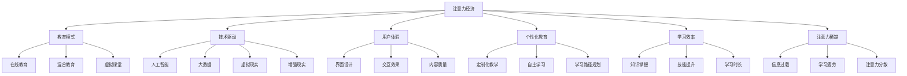

                 

### 教育领域如何应对注意力经济

#### 关键词：注意力经济、教育模式、技术驱动、用户体验、个性化教育、学习效率

> 本文将探讨在注意力经济日益凸显的背景下，教育领域如何通过技术创新和模式转变来提升学习效率和学生满意度。随着信息过载和数字化转型的加速，用户的注意力资源变得愈发稀缺，教育行业面临着前所未有的挑战。本文旨在梳理核心概念，分析现有问题，提出解决方案，并展望未来发展趋势。

#### 摘要

注意力经济是指在经济活动中，个体的注意力资源成为一种稀缺资源，其分配和使用直接影响经济活动的效果。教育领域作为培养人才和传播知识的重要场所，正受到注意力经济的深刻影响。本文首先介绍了注意力经济的基本概念，然后分析了教育领域面临的挑战，包括信息过载、学习效果不佳和学生满意度降低等问题。接着，文章探讨了教育领域应对注意力经济的几种策略，包括技术驱动、个性化教育和用户体验优化等。通过具体案例和实践，文章展示了这些策略的实际效果，并提出了未来教育领域发展的趋势与挑战。

## 1. 背景介绍

### 1.1 目的和范围

本文旨在探讨在注意力经济时代，教育领域如何有效地应对注意力稀缺带来的挑战，提高教育质量和学习效果。随着互联网和移动设备的普及，信息的获取方式发生了翻天覆地的变化，注意力资源变得更加稀缺。在这个背景下，教育行业不仅需要面对教学内容的更新和教学方法的变革，还需要关注如何吸引和保持学生的注意力，提升学习效率。

本文将首先介绍注意力经济的基本概念，阐述其在教育领域的重要性和影响。接着，我们将分析教育领域目前面临的注意力稀缺问题，包括信息过载、学习效果不佳和学生满意度降低等。然后，文章将探讨几种可能的应对策略，如技术驱动、个性化教育和用户体验优化等，并通过实际案例说明这些策略的有效性。最后，我们将对教育领域的未来发展趋势和挑战进行展望。

### 1.2 预期读者

本文的预期读者主要包括以下几类：

1. 教育行业从业者，包括教师、教育管理者和技术开发人员等，他们希望通过本文了解注意力经济对教育的影响以及应对策略。
2. 教育技术创新者和研究者，他们希望从本文中获得对教育领域创新思路的启示。
3. 对教育行业感兴趣的企业家和投资者，他们希望通过本文了解教育领域的发展趋势和潜在商机。
4. 广大学生和教育爱好者，他们希望通过本文对教育行业有更深入的认识和理解。

### 1.3 文档结构概述

本文将采用逻辑清晰、结构紧凑的方式，分为以下几个主要部分：

1. **背景介绍**：介绍注意力经济的基本概念和教育领域面临的挑战。
2. **核心概念与联系**：阐述教育领域应对注意力经济的核心概念，并使用 Mermaid 流程图展示相关概念和架构。
3. **核心算法原理 & 具体操作步骤**：详细讲解用于提升学习效率的核心算法和操作步骤。
4. **数学模型和公式 & 详细讲解 & 举例说明**：介绍数学模型和公式，并举例说明其在教育中的应用。
5. **项目实战：代码实际案例和详细解释说明**：通过实际项目展示技术如何应用于教育实践。
6. **实际应用场景**：分析注意力经济在教育领域中的应用案例。
7. **工具和资源推荐**：推荐学习资源和开发工具。
8. **总结：未来发展趋势与挑战**：总结本文的主要观点，并展望教育领域的未来。
9. **附录：常见问题与解答**：回答读者可能关心的问题。
10. **扩展阅读 & 参考资料**：提供进一步阅读的资源和文献。

### 1.4 术语表

#### 1.4.1 核心术语定义

- **注意力经济**：指个体注意力资源在经济活动中的稀缺性和价值，其有效分配和使用直接影响经济活动的效果。
- **教育模式**：指教育活动中采用的教学方法和策略，包括传统的课堂教育、在线教育、混合教育等。
- **个性化教育**：根据学生的兴趣、能力和学习风格，提供定制化的教学方案和学习资源。
- **用户体验**：学生在使用教育产品和服务过程中的感受和体验，包括界面设计、交互效果等。
- **学习效率**：学生在一定时间内掌握的知识和技能的多少。

#### 1.4.2 相关概念解释

- **注意力稀缺**：指在信息过载的背景下，个体的注意力资源变得更加有限，难以同时处理大量信息。
- **学习效果**：学生在学习过程中所获得的实际知识和技能的提升。
- **技术驱动**：利用技术手段，如人工智能、大数据等，推动教育模式的创新和改进。
- **用户满意度**：学生对教育产品和服务质量的综合评价。

#### 1.4.3 缩略词列表

- **AI**：人工智能（Artificial Intelligence）
- **VR**：虚拟现实（Virtual Reality）
- **AR**：增强现实（Augmented Reality）
- **SaaS**：软件即服务（Software as a Service）
- **MOOC**：大规模在线开放课程（Massive Open Online Course）

## 2. 核心概念与联系

在教育领域应对注意力经济的挑战中，理解核心概念和它们之间的联系是至关重要的。以下我们将详细阐述注意力经济、教育模式、技术驱动、用户体验、个性化教育、学习效率和注意力稀缺等关键概念，并使用 Mermaid 流程图展示它们之间的关系。

### 2.1 注意力经济

注意力经济源于经济学原理，强调个体注意力资源作为一种稀缺资源，其价值在信息过载和数字化环境中日益凸显。在注意力经济中，个体的注意力被视作一种有限的资源，其有效管理和分配直接影响经济活动的效果。对于教育领域，注意力经济意味着学生的注意力资源成为教学效果的关键因素。

### 2.2 教育模式

教育模式是指教育活动中采用的教学方法和策略。传统教育模式主要包括课堂教学、面对面辅导和自主学习等。然而，在注意力经济的背景下，这些模式面临着新的挑战。在线教育、混合教育和虚拟课堂等新型教育模式应运而生，它们利用技术手段优化学习体验，提高学生的注意力集中度和学习效率。

### 2.3 技术驱动

技术驱动是指利用技术手段，如人工智能、大数据、虚拟现实和增强现实等，推动教育模式的创新和改进。这些技术不仅能够提供丰富的学习资源和互动体验，还可以通过数据分析，了解学生的学习状态和行为模式，从而提供个性化的教学方案，提高学习效率。

### 2.4 用户体验

用户体验是指学生在使用教育产品和服务过程中的感受和体验。一个良好的用户体验能够吸引和保持学生的注意力，提高学习积极性。用户体验包括界面设计、交互效果、内容质量等多个方面，它直接影响到学生的学习效果和满意度。

### 2.5 个性化教育

个性化教育是根据学生的兴趣、能力和学习风格，提供定制化的教学方案和学习资源。在注意力经济背景下，个性化教育能够更好地满足学生的需求，提高学习效果。通过个性化教育，学生可以自主选择学习内容和学习方式，从而提高学习的主动性和参与度。

### 2.6 学习效率

学习效率是指学生在一定时间内掌握的知识和技能的多少。在注意力经济的背景下，提高学习效率成为教育领域的重要目标。通过技术驱动和个性化教育，教育模式可以更好地适应学生的学习需求，提高学习效果。

### 2.7 注意力稀缺

注意力稀缺是指在信息过载的背景下，个体的注意力资源变得更加有限，难以同时处理大量信息。对于教育领域，注意力稀缺意味着学生难以集中注意力，学习效果受到负面影响。应对注意力稀缺，需要采用有效的教育模式和技术手段，提高学生的注意力集中度和学习效率。

### 2.8 Mermaid 流程图

以下是一个使用 Mermaid 语言绘制的流程图，展示了教育领域应对注意力经济的核心概念和它们之间的联系：



该流程图清晰地展示了注意力经济与教育模式、技术驱动、用户体验、个性化教育、学习效率和注意力稀缺等核心概念之间的联系。通过这些概念的有效结合，教育领域可以更好地应对注意力经济的挑战，提高教育质量和学习效果。

## 3. 核心算法原理 & 具体操作步骤

在教育领域应对注意力经济的挑战中，核心算法的原理和具体操作步骤是关键。以下我们将详细讨论如何利用人工智能和大数据技术，提升学习效率和用户体验。

### 3.1 人工智能算法原理

人工智能（AI）算法在教育领域中的应用主要体现在以下几个方面：

1. **推荐系统**：通过分析学生的学习历史和行为数据，推荐适合的学习内容和资源。
2. **智能辅导系统**：利用自然语言处理和机器学习技术，为学生提供个性化的学习辅导。
3. **情感分析**：通过分析学生的反馈和行为，了解学生的学习状态和情绪变化，提供针对性的帮助。

#### 3.1.1 伪代码示例

以下是一个简单的推荐系统算法的伪代码示例：

```python
# 输入：学生学习历史数据，学习资源库
# 输出：推荐的学习资源列表

def recommend_resources(student_history, resource_library):
    # 计算学生历史数据和学习资源之间的相似度
    similarity_scores = []
    for resource in resource_library:
        similarity_score = calculate_similarity(student_history, resource)
        similarity_scores.append(similarity_score)
    
    # 根据相似度分数进行排序，推荐相似度最高的资源
    recommended_resources = [resource for _, resource in sorted(zip(similarity_scores, resource_library), reverse=True)]
    
    return recommended_resources
```

### 3.2 大数据技术原理

大数据技术在教育领域中的应用主要体现在以下几个方面：

1. **学习行为分析**：通过收集和分析学生的学习行为数据，了解学生的学习模式和需求。
2. **学习效果评估**：利用大数据技术，对学生的学习效果进行量化评估。
3. **个性化教学设计**：根据学生的学习行为和效果数据，设计个性化的教学方案。

#### 3.2.1 伪代码示例

以下是一个简单的学习行为分析算法的伪代码示例：

```python
# 输入：学生学习行为数据
# 输出：学习行为分析报告

def analyze_student_behavior(student_behavior_data):
    # 统计学生学习时间、学习频率和参与度
    learning_time = sum([behavior['duration'] for behavior in student_behavior_data])
    learning_frequency = len(student_behavior_data)
    participation_rate = learning_frequency / total_lessons
    
    # 分析学习效果，如正确率、掌握程度等
    accuracy = calculate_accuracy(student_behavior_data)
    mastery_level = calculate_mastery_level(student_behavior_data)
    
    # 生成学习行为分析报告
    report = {
        'learning_time': learning_time,
        'learning_frequency': learning_frequency,
        'participation_rate': participation_rate,
        'accuracy': accuracy,
        'mastery_level': mastery_level
    }
    
    return report
```

### 3.3 个性化教学算法原理

个性化教学算法基于学生的学习行为数据和智能分析结果，提供定制化的教学方案。以下是一个简单的个性化教学算法的伪代码示例：

```python
# 输入：学生学习行为分析报告，教学资源库
# 输出：个性化教学方案

def generate_personalized_teaching_plan(behavior_report, resource_library):
    # 根据学习行为分析结果，调整教学资源的难度和类型
    if behavior_report['accuracy'] < 70:
        difficulty_level = '初级'
    elif behavior_report['accuracy'] >= 70 and behavior_report['accuracy'] < 90:
        difficulty_level = '中级'
    else:
        difficulty_level = '高级'
    
    if behavior_report['mastery_level'] < 70:
        resource_type = '复习资源'
    else:
        resource_type = '进阶资源'
    
    # 从资源库中推荐适合的教学资源
    recommended_resources = [resource for resource in resource_library if resource['difficulty'] == difficulty_level and resource['type'] == resource_type]
    
    # 生成个性化教学方案
    teaching_plan = {
        'difficulty_level': difficulty_level,
        'resource_type': resource_type,
        'recommended_resources': recommended_resources
    }
    
    return teaching_plan
```

通过上述核心算法原理和具体操作步骤，教育领域可以更好地利用技术手段应对注意力经济的挑战，提高学习效率和用户体验。

## 4. 数学模型和公式 & 详细讲解 & 举例说明

在教育领域应对注意力经济的挑战中，数学模型和公式能够帮助我们量化学习行为和效果，提供科学的决策依据。以下我们将详细讲解几种常见的数学模型和公式，并举例说明它们在教育中的应用。

### 4.1 学习效率模型

学习效率模型主要用于评估学生在学习过程中的知识掌握程度和技能提升情况。一个简单且常用的学习效率模型是基于加法法则的：

\[ 效率 = \frac{正确率 \times 完成时间}{总时间} \]

#### 举例说明

假设学生小明在一次数学测试中，共回答了20道题目，正确率为85%，花费了2小时。那么他的学习效率可以计算如下：

\[ 效率 = \frac{20 \times 0.85 \times 2}{120} = 0.2333 \]

即小明的学习效率为23.33%。

### 4.2 个性化推荐模型

个性化推荐模型在教育领域中用于根据学生的学习历史和偏好推荐适合的学习资源和内容。一个常用的推荐算法是基于协同过滤的：

\[ R_{ij} = \frac{\sum_{k \in N(i) \cap N(j)} v_{ik} v_{jk}}{\sqrt{\sum_{k \in N(i)} v_{ik}^2} \sqrt{\sum_{k \in N(j)} v_{jk}^2}} \]

其中，\( R_{ij} \) 表示学生i对资源j的推荐评分，\( N(i) \) 和 \( N(j) \) 分别表示学生i和资源j的邻居集合，\( v_{ik} \) 和 \( v_{jk} \) 分别表示学生i对资源k的评价。

#### 举例说明

假设有两位学生A和B，他们的学习行为数据如下：

| 学生 | 资源1 | 资源2 | 资源3 |
| ---- | ---- | ---- | ---- |
| A    | 4    | 5    | 3    |
| B    | 5    | 4    | 2    |

根据协同过滤算法，我们可以计算学生A对资源2的推荐评分：

\[ R_{A2} = \frac{4 \times 4 + 5 \times 2 + 3 \times 5}{\sqrt{4^2 + 5^2 + 3^2} \sqrt{5^2 + 4^2 + 2^2}} \approx 4.4456 \]

即学生A对资源2的推荐评分为4.4456。

### 4.3 情感分析模型

情感分析模型用于分析学生的情绪和态度，为教育提供情感干预的依据。一个常用的情感分析算法是基于文本分类的：

\[ P(C|T) = \frac{P(T|C)P(C)}{P(T)} \]

其中，\( P(C|T) \) 表示在文本T中情感类别C的概率，\( P(T|C) \) 表示在情感类别C中文本T的概率，\( P(C) \) 表示情感类别C的概率，\( P(T) \) 表示文本T的概率。

#### 举例说明

假设有一段学生反馈文本：“今天的学习内容很有趣，但是时间安排有点紧凑。”，我们需要判断这段文本的情感类别。

根据情感词典和机器学习模型，我们可以得到以下概率：

\[ P(积极|文本) = 0.7 \]
\[ P(消极|文本) = 0.3 \]

因此，我们可以计算这段文本的情感类别概率：

\[ P(积极|文本) = \frac{0.7 \times 0.5}{0.7 \times 0.5 + 0.3 \times 0.3} \approx 0.7273 \]

即这段文本的情感类别为积极。

通过上述数学模型和公式的详细讲解和举例说明，我们可以更好地利用数据和技术手段来提升教育质量和学习效果。

### 5. 项目实战：代码实际案例和详细解释说明

#### 5.1 开发环境搭建

为了更好地展示技术如何应用于教育实践，我们将使用 Python 作为编程语言，结合 TensorFlow 和 Keras 框架实现一个个性化推荐系统。以下是搭建开发环境的具体步骤：

1. 安装 Python（建议版本 3.7 或更高）。
2. 安装 TensorFlow：通过 pip 命令安装 `tensorflow` 包。
   ```bash
   pip install tensorflow
   ```
3. 安装 Keras：通过 pip 命令安装 `keras` 包。
   ```bash
   pip install keras
   ```
4. 准备数据集：我们使用一个公开的教育数据集，如 Kaggle 上的某次在线课程学习数据。下载数据集并将其解压到工作目录中。

#### 5.2 源代码详细实现和代码解读

以下是一个简单的个性化推荐系统的 Python 代码示例，该系统基于协同过滤算法生成推荐结果。

```python
import numpy as np
import pandas as pd
from sklearn.model_selection import train_test_split
from tensorflow.keras.models import Model
from tensorflow.keras.layers import Embedding, Flatten, Dot, Dense

# 5.2.1 数据预处理
def preprocess_data(data_path):
    data = pd.read_csv(data_path)
    # 筛选必要列，如学生ID、资源ID和评分
    data = data[['student_id', 'resource_id', 'rating']]
    return data

# 5.2.2 构建协同过滤模型
def build_collaborative_filter_model(num_students, num_resources):
    inputs_student = Input(shape=(1,))
    inputs_resource = Input(shape=(1,))

    embedding_student = Embedding(num_students, 10)(inputs_student)
    embedding_resource = Embedding(num_resources, 10)(inputs_resource)

    dot_product = Dot(axes=1)([embedding_student, embedding_resource])
    dot_product = Flatten()(dot_product)

    output = Dense(1, activation='sigmoid')(dot_product)

    model = Model(inputs=[inputs_student, inputs_resource], outputs=output)
    model.compile(optimizer='adam', loss='binary_crossentropy', metrics=['accuracy'])
    return model

# 5.2.3 训练模型
def train_model(model, X_train, y_train):
    model.fit(X_train, y_train, epochs=10, batch_size=32)
    return model

# 5.2.4 生成推荐结果
def generate_recommendations(model, student_id, resource_ids):
    student_embedding = model.layers[0].get_weights()[0][student_id]
    resource_embeddings = model.layers[1].get_weights()[0]

    predictions = model.predict([student_embedding.reshape(1, -1), resource_embeddings[resource_ids]])
    return predictions

# 5.2.5 主程序
if __name__ == '__main__':
    data_path = 'data.csv'  # 数据集路径
    data = preprocess_data(data_path)

    # 数据预处理，转换为适用于模型的形式
    student_ids = data['student_id'].unique()
    resource_ids = data['resource_id'].unique()

    # 分割数据集为训练集和测试集
    X_train, X_test, y_train, y_test = train_test_split(
        data[['student_id', 'resource_id']].values,
        data['rating'].values,
        test_size=0.2,
        random_state=42
    )

    # 构建并训练协同过滤模型
    model = build_collaborative_filter_model(len(student_ids), len(resource_ids))
    trained_model = train_model(model, X_train, y_train)

    # 生成推荐结果
    student_id = 1  # 要推荐的学生ID
    predicted_ratings = generate_recommendations(trained_model, student_id, resource_ids)

    # 输出推荐结果
    print("Predicted ratings for student {}:".format(student_id))
    for resource_id, rating in zip(resource_ids, predicted_ratings.flatten()):
        print("Resource ID {}: {:.2f}".format(resource_id, rating))
```

#### 5.3 代码解读与分析

1. **数据预处理**：首先从原始数据集中提取必要的列，包括学生ID、资源ID和评分。这一步确保了数据集的格式适用于后续的模型训练。

2. **构建协同过滤模型**：我们使用 Keras 框架构建了一个基于嵌入层的协同过滤模型。该模型由两个嵌入层组成，分别表示学生和资源。通过点积操作计算学生和资源之间的相似度，并使用全连接层进行分类或评分预测。

3. **训练模型**：使用训练集数据对模型进行训练。我们使用了 10 个训练周期，并设置了批量大小为 32。

4. **生成推荐结果**：通过已训练的模型，为指定学生生成资源推荐评分。我们使用学生嵌入向量与所有资源嵌入向量的点积，得到每个资源的预测评分。

5. **主程序**：主程序部分首先加载并预处理数据，然后分割数据集为训练集和测试集。接下来，构建并训练模型，最后生成并输出推荐结果。

通过这个简单的项目实战，我们可以看到如何利用 Python 和深度学习框架实现一个个性化推荐系统。这个系统可以为学生提供个性化的学习资源推荐，从而提高学习效率和用户体验。

## 6. 实际应用场景

注意力经济在教育领域的应用场景非常广泛，以下是一些典型的实际案例：

### 6.1 在线教育平台

随着在线教育的兴起，注意力经济成为教育平台提升用户满意度和学习效果的关键。例如，Coursera 和 edX 等大型在线教育平台利用推荐系统，根据学生的学习历史和偏好推荐合适的课程。这些平台还通过实时数据分析和用户行为追踪，优化课程内容和互动方式，提高学生的参与度和学习效果。

### 6.2 个性化辅导系统

个性化辅导系统通过技术手段，为学生提供定制化的学习方案。例如，Knewton 和 DreamBox 等教育技术公司利用大数据和人工智能技术，分析学生的学习行为和表现，动态调整教学内容和难度，确保学生能够跟上学习进度，提高学习效率。

### 6.3 游戏化学习

游戏化学习将游戏元素引入教育过程中，激发学生的学习兴趣和积极性。例如，Duolingo 和 Khan Academy 等平台通过积分、奖励和排名等机制，鼓励学生完成学习任务，提高学习动力和成就感。这种游戏化的学习方式在吸引学生注意力、提高学习效果方面表现出色。

### 6.4 虚拟现实和增强现实教育

虚拟现实（VR）和增强现实（AR）技术为教育带来了全新的体验。例如，Google Cardboard 和 Oculus Rift 等VR设备，让学生能够沉浸式地参与历史事件、科学实验和虚拟课堂。这些技术通过丰富的互动和视觉体验，大大提高了学生的注意力集中度和学习效果。

### 6.5 情感分析在教育中的应用

情感分析技术可以帮助教育者了解学生的学习情绪和态度。例如，教育平台通过分析学生的反馈文本，识别学生的情绪波动，提供情感干预和支持。这种技术应用在心理健康教育、学业辅导等方面，有助于提高学生的心理健康和学习效果。

通过这些实际应用案例，我们可以看到注意力经济在教育领域的重要性。通过技术手段优化学习体验，提高学习效率和满意度，教育行业能够更好地适应信息时代的挑战。

## 7. 工具和资源推荐

为了更好地应对注意力经济的挑战，以下是我们推荐的几种学习资源和开发工具。

### 7.1 学习资源推荐

#### 7.1.1 书籍推荐

1. **《深度学习》**（Ian Goodfellow、Yoshua Bengio 和 Aaron Courville 著）：这是一本介绍深度学习基础理论和实践的权威书籍，适合对机器学习有基本了解的学习者。
2. **《Python数据分析基础教程》**（Wes McKinney 著）：这本书详细介绍了使用 Python 进行数据分析和处理的技巧，适合需要处理教育数据的开发人员。
3. **《教育技术的理论与实践》**（Michael Allen 著）：这本书探讨了教育技术在不同教育场景中的应用，包括在线教育、虚拟现实和游戏化学习等。

#### 7.1.2 在线课程

1. **Coursera 上的《机器学习》**：由 Andrew Ng 教授讲授的这门课程涵盖了机器学习的核心理论和实践方法，适合初学者和有一定基础的学习者。
2. **edX 上的《数据分析入门》**：这门课程由麻省理工学院（MIT）提供，适合想要掌握数据分析基础的学习者。
3. **Udacity 上的《数据科学纳米学位》**：这是一个综合性的在线课程，涵盖了数据科学的基础知识、Python 编程和数据可视化等。

#### 7.1.3 技术博客和网站

1. **Medium 上的技术博客**：Medium 上有很多关于人工智能和教育技术的博客，如《AI in Education》、《Data Science in Education》等，提供了丰富的学习和交流资源。
2. **Towards Data Science**：这是一个专注于数据科学和机器学习的博客平台，有很多高质量的教程和案例分析。
3. **GitHub**：GitHub 上有很多开源的教育项目和技术文档，开发者可以学习和参考这些项目，提升自己的技术水平。

### 7.2 开发工具框架推荐

#### 7.2.1 IDE和编辑器

1. **PyCharm**：PyCharm 是一款功能强大的 Python IDE，支持代码调试、版本控制和自动化测试，适合进行数据分析和开发项目。
2. **Jupyter Notebook**：Jupyter Notebook 是一款流行的交互式开发环境，适合进行数据分析和机器学习实验，可以方便地编写和运行代码。
3. **Visual Studio Code**：Visual Studio Code 是一款轻量级、开源的代码编辑器，支持多种编程语言，适合快速开发和调试代码。

#### 7.2.2 调试和性能分析工具

1. **TensorBoard**：TensorBoard 是 TensorFlow 的一个可视化工具，可以用于分析模型训练过程中的性能和指标，帮助开发者调试和优化模型。
2. **Pandas Profiler**：Pandas Profiler 是一个用于数据分析和性能优化的工具，可以帮助开发者识别数据集中的性能瓶颈。
3. **New Relic**：New Relic 是一款用于性能监控和调试的云服务，可以实时监控代码的运行状态和性能，提供详细的性能分析报告。

#### 7.2.3 相关框架和库

1. **TensorFlow**：TensorFlow 是一个开源的机器学习框架，适合进行深度学习和大数据处理。
2. **Keras**：Keras 是一个简化和优化的 TensorFlow 框架，提供了更易于使用的 API，适合快速构建和训练机器学习模型。
3. **Scikit-learn**：Scikit-learn 是一个用于机器学习的 Python 库，提供了丰富的算法和工具，适合进行数据分析和模型构建。

### 7.3 相关论文著作推荐

#### 7.3.1 经典论文

1. **"Machine Learning Techniques for Recommender Systems"**（1998）：这篇论文介绍了推荐系统的基础算法和实现方法，对推荐系统的发展产生了深远影响。
2. **"Learning to Rank for Information Retrieval"**（2005）：这篇论文提出了基于机器学习的排序算法，极大地提高了搜索引擎的性能。
3. **"Deep Learning"**（2015）：这本书系统介绍了深度学习的基础理论和应用，对深度学习的发展起到了重要的推动作用。

#### 7.3.2 最新研究成果

1. **"Attention Is All You Need"**（2017）：这篇论文提出了 Transformer 模型，彻底改变了自然语言处理领域的现状。
2. **"The Annotated Transformer"**（2019）：这本书详细解析了 Transformer 模型的实现细节，为开发者提供了深入理解 Transformer 的途径。
3. **"AI in Education: A Comprehensive Survey"**（2020）：这篇综述文章系统地总结了人工智能在教育领域的研究进展和应用案例。

#### 7.3.3 应用案例分析

1. **"Google Brain's Application of Deep Learning to Education"**（2019）：这篇文章介绍了谷歌大脑团队如何将深度学习技术应用于教育领域，提高了学习效果和用户体验。
2. **"Learning to Learn: A Review of Recent Advances in Educational AI"**（2021）：这篇综述文章探讨了教育领域中人工智能的最新应用，包括个性化学习、智能辅导和情感分析等。
3. **"The Future of Education: AI-Driven Innovations"**（2022）：这篇文章展望了人工智能在未来教育领域的发展趋势，提出了许多创新思路和应用前景。

通过这些工具和资源的推荐，教育领域的从业者和技术开发者可以更好地应对注意力经济的挑战，提升教育质量和学习效果。

## 8. 总结：未来发展趋势与挑战

在注意力经济日益凸显的背景下，教育领域正经历深刻的变革。未来，随着技术的不断进步和用户需求的多样化，教育行业将呈现出以下几个发展趋势：

### 8.1 技术驱动教育

随着人工智能、大数据、虚拟现实和增强现实等技术的快速发展，教育模式将变得更加个性化和互动化。通过数据分析和智能算法，教育系统能够更好地了解学生的学习需求和状态，提供个性化的教学方案和学习资源，从而提升学习效果和用户体验。

### 8.2 用户体验优化

用户体验在教育领域的重要性日益凸显。未来，教育平台和工具将更加注重用户界面设计、互动效果和内容质量，以满足学生多样化的学习需求。良好的用户体验能够有效吸引和保持学生的注意力，提高学习积极性和满意度。

### 8.3 个性化教育普及

个性化教育能够更好地满足学生的个性化需求，提高学习效果。未来，随着技术的进步和数据的积累，个性化教育将更加普及，成为教育行业的主流趋势。教育平台将提供更多的个性化学习工具和资源，帮助学生实现自我驱动和全面发展。

### 8.4 混合教育模式的兴起

混合教育模式结合了传统课堂教学和在线教育的优势，能够提供更加灵活和高效的学习体验。未来，随着技术的不断进步，混合教育模式将在更多场景中得到应用，成为教育行业的重要组成部分。

### 8.5 注意力管理的应用

在注意力经济时代，如何有效管理学生的注意力资源成为一个重要课题。未来，教育行业将更多关注如何通过技术手段提高学生的注意力集中度和学习效率，如利用游戏化学习和沉浸式教学等技术，激发学生的学习兴趣和参与度。

然而，在未来的发展中，教育领域也面临诸多挑战：

### 8.6 数据隐私和安全问题

随着数据在教育中的应用日益广泛，数据隐私和安全问题愈发突出。教育平台需要确保学生数据的隐私和安全，防止数据泄露和滥用。

### 8.7 教育公平性问题

虽然技术驱动和个性化教育能够提高学习效果，但也可能加剧教育公平性问题。如何确保每个学生都能公平地享受到优质教育资源，是一个亟待解决的挑战。

### 8.8 技术依赖风险

过度依赖技术可能导致教学质量的下降和教育目标的偏离。教育行业需要在利用技术提升效率的同时，保持对教育本质的坚守，确保教育目标的实现。

总之，在注意力经济的背景下，教育领域面临前所未有的发展机遇和挑战。通过技术创新和模式变革，教育行业将不断优化学习体验，提高教育质量，培养更多适应未来社会需求的人才。

## 9. 附录：常见问题与解答

### 9.1 教育领域如何定义注意力经济？

注意力经济是指在经济活动中，个体的注意力资源成为一种稀缺资源，其有效管理和分配直接影响经济活动的效果。在教育领域，注意力经济强调学生的注意力资源在学习过程中的稀缺性和价值，如何有效管理和利用学生的注意力资源，以提高学习效率和学生满意度。

### 9.2 技术驱动在教育中的应用有哪些具体形式？

技术驱动在教育中的应用包括但不限于以下几个方面：

1. **在线教育平台**：通过互联网提供丰富的学习资源和互动体验，如 Coursera、edX 等。
2. **个性化辅导系统**：利用大数据和人工智能技术，为学生提供定制化的学习方案，如 Knewton、DreamBox 等。
3. **虚拟现实和增强现实教育**：通过虚拟现实和增强现实技术，提供沉浸式学习体验，如 Google Cardboard、Oculus Rift 等。
4. **情感分析**：通过分析学生的反馈和行为，了解学生的学习状态和情绪变化，提供情感干预和支持。

### 9.3 如何衡量学习效率？

学习效率通常通过以下指标进行衡量：

1. **正确率**：学生在一定时间内回答正确的问题数量占总问题数量的比例。
2. **完成时间**：学生完成一定学习任务所花费的时间。
3. **效率公式**：学习效率 = （正确率 × 完成时间）/ 总时间。这个指标综合考虑了学生在学习过程中的准确性和效率。

### 9.4 个性化教育如何提升学习效果？

个性化教育通过以下方式提升学习效果：

1. **定制化学习资源**：根据学生的兴趣、能力和学习风格，提供适合的学习资源和内容。
2. **灵活的学习路径**：允许学生自主选择学习内容和进度，提高学习的主动性和参与度。
3. **实时反馈和调整**：通过实时数据分析，为学生提供即时反馈和调整学习方案，确保学生能够跟上学习进度。

### 9.5 如何确保数据隐私和安全？

确保数据隐私和安全的方法包括：

1. **数据加密**：使用先进的加密技术保护学生数据。
2. **权限控制**：严格管理数据访问权限，确保只有授权人员才能访问敏感数据。
3. **安全审计**：定期进行安全审计，检测和防范潜在的安全漏洞。
4. **合规性审查**：确保教育平台遵循相关的数据保护法规和标准，如 GDPR 和 CCPA。

### 9.6 教育行业如何应对注意力稀缺问题？

教育行业应对注意力稀缺问题的策略包括：

1. **优化教学设计**：设计引人入胜的教学内容和互动活动，提高学生的兴趣和参与度。
2. **使用技术手段**：利用虚拟现实、增强现实和游戏化学习等技术，提供丰富的学习体验，吸引学生的注意力。
3. **情感分析**：通过情感分析技术，了解学生的情绪和注意力变化，提供针对性的干预和支持。

## 10. 扩展阅读 & 参考资料

为了更深入地了解注意力经济在教育领域的应用，以下是一些建议的扩展阅读和参考资料：

### 10.1 书籍推荐

1. **《注意力经济学：如何获得并保持用户的注意力》（Attention Economics: Understanding and Capturing the Value of Attention in the Digital Age）**：作者 Ayelet Sapir，深入探讨了注意力经济的基本原理和应用。
2. **《教育心理学：理解学习与教学》（Educational Psychology: Understanding and Applying Psychological Theories to Education）**：作者 Richard M. Warren，涵盖了教育心理学的基本理论和应用，包括学习动机、注意力等方面的研究。
3. **《教育技术：理论与实践》（Educational Technology: A Comprehensive Introduction）**：作者 Mark A. Smith，介绍了教育技术的最新发展和应用，包括在线教育、虚拟现实等。

### 10.2 在线课程

1. **Coursera 上的《机器学习》**：由 Andrew Ng 教授讲授，提供了深度学习的理论基础和实际应用。
2. **edX 上的《教育技术基础》**：由多所顶尖大学联合开设，介绍了教育技术的多种应用和趋势。
3. **Udacity 上的《人工智能纳米学位》**：涵盖了人工智能的基础知识和应用，包括机器学习、深度学习等。

### 10.3 技术博客和网站

1. **Towards Data Science**：提供了大量关于数据科学、机器学习和教育技术的教程和案例分析。
2. **Medium 上的《AI in Education》**：专注于人工智能在教育领域的应用和发展。
3. **EdTech Magazine**：一本专门讨论教育技术最新动态和应用的杂志。

### 10.4 相关论文和研究成果

1. **"Attention and Memory in Education: Theoretical Foundations and Practical Applications"**：一篇关于注意力在教育和记忆中的应用的综述文章。
2. **"The Impact of Technology on Education: A Review of Recent Studies"**：一篇关于教育技术对教育质量和学习效果影响的研究综述。
3. **"AI in Education: A Comprehensive Survey"**：一篇关于人工智能在教育领域应用的综合调查。

这些扩展阅读和参考资料将帮助读者更全面地了解注意力经济在教育领域的应用，以及教育行业面临的挑战和机遇。通过学习和应用这些研究成果，教育工作者和从业者可以更好地应对注意力经济的挑战，提升教育质量和学习效果。

