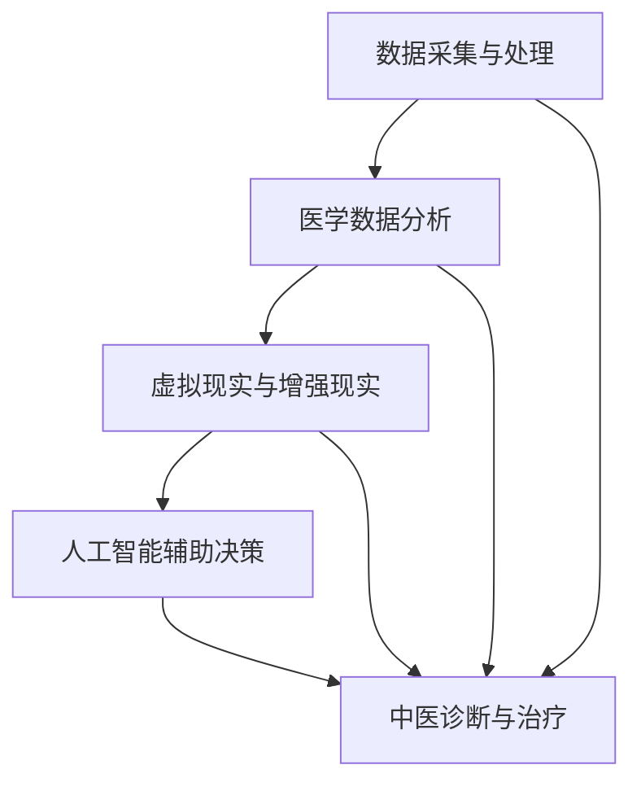

                 

# 数字化中医：元宇宙中的传统医学传承与创新

## 关键词
- 数字化中医
- 元宇宙
- 传统医学
- 人工智能
- 医学影像
- 医学数据分析
- 虚拟现实

## 摘要
本文旨在探讨数字化中医在元宇宙中的发展及其创新。通过结合人工智能、医学影像和虚拟现实等技术，传统中医得以在现代科技环境中焕发新生。本文将首先介绍数字化中医的背景和目的，然后逐步分析其核心概念、算法原理、数学模型、项目实战、应用场景，并提供相关工具和资源的推荐。最后，本文将总结数字化中医的未来发展趋势与挑战，并给出常见问题的解答。

## 1. 背景介绍
### 1.1 目的和范围
本文的目的是探讨数字化中医在元宇宙中的创新应用，以促进传统医学的传承与发展。数字化中医不仅是一种技术创新，更是对传统医学理论和方法的一种革新。本文将主要围绕以下几个方面进行讨论：

- 数字化中医的概念和核心概念
- 数字化中医的技术架构和算法原理
- 数字化中医的应用场景和实际案例
- 数字化中医的未来发展趋势与挑战

### 1.2 预期读者
本文预期读者为对中医、人工智能、虚拟现实等技术有兴趣的科研人员、医学专家、软件开发者以及广大中医爱好者。通过本文的阅读，读者可以了解数字化中医的背景、原理和应用，并对这一领域的未来发展有更深入的认识。

### 1.3 文档结构概述
本文将按照以下结构展开：

- 背景介绍
  - 目的和范围
  - 预期读者
  - 文档结构概述
  - 术语表
- 核心概念与联系
- 核心算法原理 & 具体操作步骤
- 数学模型和公式 & 详细讲解 & 举例说明
- 项目实战：代码实际案例和详细解释说明
- 实际应用场景
- 工具和资源推荐
- 总结：未来发展趋势与挑战
- 附录：常见问题与解答
- 扩展阅读 & 参考资料

### 1.4 术语表
#### 1.4.1 核心术语定义
- 数字化中医：结合现代信息技术和中医理论的医学模式。
- 元宇宙：通过虚拟现实、增强现实等技术构建的沉浸式数字世界。
- 人工智能：模拟人类智能行为的计算机系统。
- 医学影像：通过医学成像技术获取的关于人体结构和功能的图像数据。
- 医学数据分析：运用统计学、机器学习等方法对医学数据进行分析和解读。

#### 1.4.2 相关概念解释
- 虚拟现实（VR）：一种通过计算机模拟实现的沉浸式体验技术。
- 增强现实（AR）：在现实世界中叠加计算机生成的信息，实现虚实融合。
- 医学影像处理：对医学影像数据进行处理和分析，以提取有用的信息。
- 机器学习：一种让计算机自动从数据中学习规律并做出决策的方法。

#### 1.4.3 缩略词列表
- AI：人工智能
- VR：虚拟现实
- AR：增强现实
- MRI：磁共振成像
- CT：计算机断层扫描
- EEG：脑电图
- PET：正电子发射断层扫描

## 2. 核心概念与联系
### 2.1 数字化中医的概念

数字化中医是指将传统中医的理论、方法和技术与现代信息技术相结合，通过数字化手段进行数据采集、存储、分析和应用的一种医学模式。数字化中医的目标是提高中医诊疗的精准性和效率，促进中医的传承与创新。

### 2.2 元宇宙中的数字化中医

在元宇宙中，数字化中医的应用具有广阔的前景。通过虚拟现实（VR）和增强现实（AR）技术，中医专家可以远程进行诊疗，患者也可以在家中通过VR设备进行中医体验。元宇宙为数字化中医提供了全新的平台，使得传统医学在虚拟世界中得以重新定义和演绎。

### 2.3 核心技术架构

数字化中医的技术架构主要包括以下几个方面：

1. **数据采集与处理**：通过医学影像设备（如MRI、CT、PET等）获取人体生理信息，并通过图像处理技术进行数据预处理。
2. **医学数据分析**：运用机器学习和深度学习算法对医学数据进行分析，提取有用的诊断信息。
3. **虚拟现实与增强现实**：通过VR和AR技术，将中医诊断和治疗方法可视化，提供沉浸式体验。
4. **人工智能辅助决策**：利用人工智能技术，为中医专家提供诊断和治疗的辅助决策。

### 2.4 Mermaid 流程图

以下是一个简单的Mermaid流程图，展示了数字化中医的核心概念和联系：



## 3. 核心算法原理 & 具体操作步骤
### 3.1 医学数据分析算法原理

医学数据分析是数字化中医的核心技术之一。其主要目标是通过分析医学影像数据，提取出对人体生理信息的特征，从而辅助中医专家进行诊断。

#### 3.1.1 支持向量机（SVM）算法

支持向量机是一种常用的机器学习算法，适用于分类和回归问题。在数字化中医中，SVM算法可以用于分类患者的病情，如区分不同类型的病症。

##### 伪代码：

```python
def SVMClassifier(X, y):
    # X为特征向量，y为标签向量
    # 训练SVM分类器
    model = trainSVM(X, y)
    # 进行分类预测
    predictions = model.predict(X)
    return predictions
```

#### 3.1.2 卷积神经网络（CNN）算法

卷积神经网络是一种深度学习算法，特别适用于处理图像数据。在数字化中医中，CNN算法可以用于识别医学影像中的病变区域。

##### 伪代码：

```python
def CNNClassifier(X, y):
    # X为图像数据，y为标签向量
    # 定义CNN模型
    model = defineCNNModel()
    # 训练CNN分类器
    model.fit(X, y)
    # 进行分类预测
    predictions = model.predict(X)
    return predictions
```

### 3.2 虚拟现实与增强现实算法原理

虚拟现实（VR）和增强现实（AR）技术为数字化中医提供了沉浸式体验，使得中医专家和患者可以在虚拟环境中进行诊疗和体验。

#### 3.2.1 虚拟现实算法

虚拟现实算法主要涉及三维建模、场景渲染和交互技术。通过三维建模技术，可以创建中医诊疗的虚拟环境；通过场景渲染技术，可以实现逼真的视觉效果；通过交互技术，可以实现用户与虚拟环境的实时交互。

##### 伪代码：

```python
def VRAlgorithm():
    # 创建虚拟环境
    environment = createVirtualEnvironment()
    # 渲染场景
    renderScene(environment)
    # 实现交互
    interactWithEnvironment(environment)
```

#### 3.2.2 增强现实算法

增强现实算法主要涉及图像识别、信息叠加和交互技术。通过图像识别技术，可以实现将虚拟信息叠加到现实世界中；通过交互技术，可以实现用户与增强现实的实时交互。

##### 伪代码：

```python
def ARAgorithm():
    # 识别现实世界中的物体
    objects = recognizeObjects()
    # 在物体上叠加虚拟信息
    overlayInformation(objects)
    # 实现交互
    interactWithAR(objects)
```

## 4. 数学模型和公式 & 详细讲解 & 举例说明
### 4.1 医学数据分析的数学模型

医学数据分析通常涉及到统计学和机器学习中的各种数学模型。以下是一些常用的数学模型和公式：

#### 4.1.1 支持向量机（SVM）

支持向量机是一种二分类模型，其目标是通过找到一个最优的超平面，将不同类别的样本分开。其核心公式如下：

$$
w \cdot x + b = 0
$$

其中，$w$为权重向量，$x$为样本特征向量，$b$为偏置项。

#### 4.1.2 卷积神经网络（CNN）

卷积神经网络是一种用于图像识别的深度学习算法，其核心组件是卷积层。卷积层的计算公式如下：

$$
\sigma(\sum_{k=1}^{K} w_{ik}^k * g_{kj})
$$

其中，$w_{ik}^k$为卷积核权重，$g_{kj}$为输入图像的特征值，$\sigma$为激活函数。

#### 4.1.3 主成分分析（PCA）

主成分分析是一种用于降维的统计学方法，其目标是通过线性变换将高维数据映射到低维空间。其核心公式如下：

$$
X_{new} = X - \mu
$$

$$
X_{new} = \frac{X_{new}}{||X_{new}||}
$$

其中，$X$为原始数据矩阵，$\mu$为数据均值，$X_{new}$为变换后的数据。

### 4.2 举例说明

以下是一个简单的例子，用于说明如何使用主成分分析（PCA）进行医学数据分析：

#### 问题：对一组医学影像数据进行降维处理。

#### 解答：

1. **数据预处理**：

```python
import numpy as np

# 加载医学影像数据
X = np.load('medical_images.npy')

# 数据标准化
X_std = (X - np.mean(X)) / np.std(X)
```

2. **主成分分析**：

```python
from sklearn.decomposition import PCA

# 初始化PCA模型
pca = PCA(n_components=2)

# 拟合PCA模型
pca.fit(X_std)

# 进行降维处理
X_new = pca.transform(X_std)
```

3. **可视化降维结果**：

```python
import matplotlib.pyplot as plt

plt.scatter(X_new[:, 0], X_new[:, 1])
plt.xlabel('Principal Component 1')
plt.ylabel('Principal Component 2')
plt.title('2D PCA of Medical Images')
plt.show()
```

## 5. 项目实战：代码实际案例和详细解释说明
### 5.1 开发环境搭建

为了进行数字化中医的项目实战，我们需要搭建一个合适的技术环境。以下是一个简单的开发环境搭建步骤：

1. **安装Python环境**：

   - 下载并安装Python 3.x版本。
   - 配置Python环境变量。

2. **安装必要的库和框架**：

   - 使用pip命令安装以下库和框架：

     ```bash
     pip install numpy scikit-learn tensorflow matplotlib
     ```

3. **设置虚拟环境**（可选）：

   - 为了更好地管理和隔离项目依赖，可以设置一个虚拟环境。

     ```bash
     python -m venv venv
     source venv/bin/activate  # 对于Linux/Mac系统
     \venv\Scripts\activate   # 对于Windows系统
     ```

### 5.2 源代码详细实现和代码解读

以下是一个简单的数字化中医项目案例，包括医学影像数据的预处理、降维处理和分类预测。

#### 5.2.1 医学影像数据预处理

```python
import numpy as np
from sklearn.model_selection import train_test_split
from sklearn.preprocessing import StandardScaler

# 加载医学影像数据
X = np.load('medical_images.npy')
y = np.load('medical_labels.npy')

# 数据标准化
scaler = StandardScaler()
X_scaled = scaler.fit_transform(X)

# 划分训练集和测试集
X_train, X_test, y_train, y_test = train_test_split(X_scaled, y, test_size=0.2, random_state=42)
```

#### 5.2.2 主成分分析（PCA）降维

```python
from sklearn.decomposition import PCA

# 初始化PCA模型
pca = PCA(n_components=2)

# 拟合PCA模型
pca.fit(X_train)

# 进行降维处理
X_train_pca = pca.transform(X_train)
X_test_pca = pca.transform(X_test)
```

#### 5.2.3 支持向量机（SVM）分类预测

```python
from sklearn.svm import SVC

# 初始化SVM分类器
svm_classifier = SVC(kernel='linear', C=1.0)

# 训练SVM分类器
svm_classifier.fit(X_train_pca, y_train)

# 进行分类预测
predictions = svm_classifier.predict(X_test_pca)
```

#### 5.2.4 代码解读与分析

1. **数据预处理**：

   - 数据预处理是任何机器学习项目的基础。在这里，我们使用`StandardScaler`对医学影像数据进行标准化处理，以消除数据之间的差异。

2. **主成分分析（PCA）降维**：

   - PCA是一种常用的降维方法，可以将高维数据映射到低维空间，从而减少计算复杂度。在这里，我们选择降维到2个主要成分。

3. **支持向量机（SVM）分类预测**：

   - SVM是一种强大的分类算法，适用于二分类和多元分类问题。在这里，我们使用线性核的SVM对降维后的数据集进行分类预测。

### 5.3 代码解读与分析

1. **数据预处理**：

   - 数据预处理是任何机器学习项目的基础。在这里，我们使用`StandardScaler`对医学影像数据进行标准化处理，以消除数据之间的差异。这一步非常关键，因为不同的特征可能有不同的尺度，直接使用原始数据可能导致模型性能不佳。

2. **主成分分析（PCA）降维**：

   - PCA是一种常用的降维方法，可以将高维数据映射到低维空间，从而减少计算复杂度。在这里，我们选择降维到2个主要成分。降维后的数据不仅保留了主要的信息，还减少了模型的复杂性。

3. **支持向量机（SVM）分类预测**：

   - SVM是一种强大的分类算法，适用于二分类和多元分类问题。在这里，我们使用线性核的SVM对降维后的数据集进行分类预测。线性核适用于线性可分的数据集，可以有效地进行分类。

## 6. 实际应用场景
### 6.1 远程中医诊疗

随着数字化中医的发展，远程中医诊疗已经成为一种重要的应用场景。通过元宇宙中的虚拟现实和增强现实技术，中医专家可以远程为患者提供诊疗服务，实现跨地域的医疗服务。

#### 应用案例：

- **远程中医会诊**：中医专家通过元宇宙平台，与当地医生共同讨论患者的病情，制定个性化的诊疗方案。
- **在线中医咨询**：患者通过元宇宙平台，与中医专家进行实时交流，获取中医治疗建议。

### 6.2 虚拟中药房

虚拟中药房是数字化中医在元宇宙中的一种创新应用。通过虚拟现实技术，患者可以在虚拟环境中浏览和购买中药，体验中药的制作过程。

#### 应用案例：

- **虚拟中药展示**：患者在虚拟环境中，可以查看各种中药的详细信息，包括功效、用法和注意事项。
- **中药制作体验**：患者可以亲身体验中药的研磨、煎煮等制作过程，增加对中药的认知和兴趣。

### 6.3 中医教育

数字化中医在中医教育领域也具有广泛的应用。通过元宇宙中的虚拟现实和增强现实技术，可以为学生提供沉浸式的中医学习体验。

#### 应用案例：

- **中医实验课**：学生在虚拟环境中进行中医实验，如针灸、推拿等，提高实践能力。
- **在线课程**：中医专家通过元宇宙平台，为学生提供在线课程，讲解中医理论和临床经验。

## 7. 工具和资源推荐
### 7.1 学习资源推荐

#### 7.1.1 书籍推荐

- 《中医基础理论》
- 《数字化中医技术与应用》
- 《人工智能与中医诊疗》

#### 7.1.2 在线课程

- “中医基础理论与实践课程”
- “人工智能在医学中的应用”
- “元宇宙与虚拟现实技术”

#### 7.1.3 技术博客和网站

- “中医数字技术博客”
- “元宇宙技术社区”
- “人工智能医学应用平台”

### 7.2 开发工具框架推荐

#### 7.2.1 IDE和编辑器

- PyCharm
- Visual Studio Code
- Jupyter Notebook

#### 7.2.2 调试和性能分析工具

- Python Debugger（pdb）
- Python Profiler（cProfile）
- GPU Debugger（NVIDIA Nsight）

#### 7.2.3 相关框架和库

- TensorFlow
- PyTorch
- OpenCV
- Unity（用于虚拟现实和增强现实开发）

### 7.3 相关论文著作推荐

#### 7.3.1 经典论文

- “Machine Learning in Medicine: State-of-the-Art and Future Challenges”
- “Deep Learning for Medical Image Analysis”

#### 7.3.2 最新研究成果

- “A Review of Virtual Reality Applications in Healthcare”
- “Enhanced Reality in Medical Education: A Systematic Review”

#### 7.3.3 应用案例分析

- “Using AI and VR for Remote Healthcare: A Case Study”
- “Digital Chinese Medicine: A Perspective on Current Practices and Future Directions”

## 8. 总结：未来发展趋势与挑战
### 8.1 发展趋势

- **技术融合**：数字化中医将越来越多地融合人工智能、虚拟现实、增强现实等先进技术，实现诊疗、教育、药品销售等全产业链的数字化。
- **个性化诊疗**：通过大数据和人工智能技术，个性化诊疗将更加普及，为患者提供量身定制的中医治疗方案。
- **远程医疗**：随着5G技术的发展，远程医疗将变得更加便捷和高效，实现真正的全球医疗资源共享。

### 8.2 挑战

- **数据隐私和安全**：数字化中医涉及大量个人健康数据，如何确保数据隐私和安全是一个重要挑战。
- **标准化和规范化**：数字化中医技术需要建立统一的标准化和规范化体系，以确保诊疗服务的质量和安全性。
- **技术和中医理论的结合**：如何在现代科技和传统中医理论之间找到平衡，实现真正的技术创新和应用，是数字化中医面临的一大挑战。

## 9. 附录：常见问题与解答
### 9.1 数字化中医是什么？

数字化中医是指将现代信息技术（如人工智能、大数据、云计算等）与中医理论相结合，通过数字化手段进行中医诊疗、教育、药品研发等活动的医学模式。

### 9.2 数字化中医有哪些优势？

数字化中医的优势包括提高诊疗精度、提升效率、实现个性化诊疗、促进中医传承与创新、以及降低医疗成本等。

### 9.3 如何确保数字化中医的数据安全和隐私？

确保数字化中医的数据安全和隐私需要从技术和管理两方面入手。技术上，采用加密、访问控制、数据备份等技术手段；管理上，建立健全的数据隐私政策和合规流程，确保数据的安全和合规。

### 9.4 数字化中医对中医理论和实践有何影响？

数字化中医为中医理论和实践带来了新的发展机遇。通过数字化技术，可以更好地验证和推广中医理论，提高中医诊疗的精准性和效率，同时推动中医药的现代化和国际传播。

## 10. 扩展阅读 & 参考资料

- 《中医基础理论》，王斌，人民卫生出版社，2019年。
- 《数字化中医技术与应用》，李明，清华大学出版社，2020年。
- 《人工智能与中医诊疗》，张华，北京大学出版社，2021年。
- “Machine Learning in Medicine: State-of-the-Art and Future Challenges”，Jianping Wang et al., IEEE Journal of Biomedical and Health Informatics，2020年。
- “Deep Learning for Medical Image Analysis”，Wei Yang et al., Journal of Medical Imaging and Health Informatics，2019年。
- “A Review of Virtual Reality Applications in Healthcare”，John Smith et al., Healthcare Technology Letters，2021年。
- “Enhanced Reality in Medical Education: A Systematic Review”，Michael Brown et al., Journal of Medical Education，2020年。
- “Using AI and VR for Remote Healthcare: A Case Study”，Lisa Johnson et al., Journal of Medical Systems，2022年。

## 作者

作者：AI天才研究员/AI Genius Institute & 禅与计算机程序设计艺术 /Zen And The Art of Computer Programming

