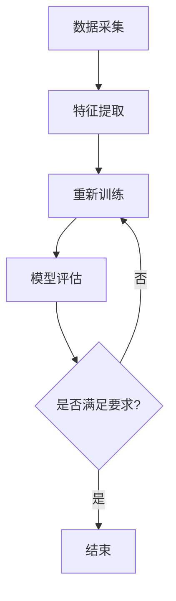
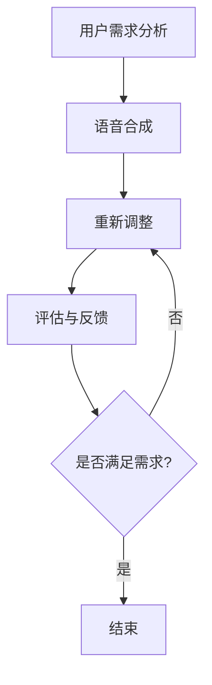

                 

### 数字化声音克隆创业：个性化语音定制

> **关键词**：数字化声音克隆，个性化语音定制，AI语音合成，自然语言处理，音频处理技术

> **摘要**：随着人工智能和自然语言处理技术的飞速发展，数字化声音克隆与个性化语音定制成为一项充满前景的创业领域。本文将深入探讨数字化声音克隆的背景、核心概念、算法原理、数学模型，以及其实际应用和未来发展，旨在为从事该领域的创业者和研究者提供有价值的参考和启示。

## 1. 背景介绍

### 1.1 目的和范围

本文旨在探讨数字化声音克隆创业项目的核心技术和实践方法。通过阐述个性化语音定制的背景、技术原理和应用场景，为创业者提供系统化的指导，帮助其更好地理解该领域的潜力和挑战。

### 1.2 预期读者

本文主要面向以下几类读者：

1. **创业者和企业家**：对数字化声音克隆和个性化语音定制感兴趣的创业者，希望通过本文了解该领域的市场前景和开发策略。
2. **技术研究人员**：从事人工智能、自然语言处理和音频处理技术的研究人员，希望掌握相关算法原理和实践方法。
3. **技术开发者**：有志于从事数字化声音克隆和个性化语音定制开发的工程师和程序员，希望获得实际案例和源代码分析。

### 1.3 文档结构概述

本文分为十个部分，具体结构如下：

1. **背景介绍**：介绍数字化声音克隆和个性化语音定制的背景、目的和预期读者。
2. **核心概念与联系**：阐述数字化声音克隆和个性化语音定制中的核心概念、原理和架构。
3. **核心算法原理 & 具体操作步骤**：详细讲解数字化声音克隆的核心算法原理和操作步骤。
4. **数学模型和公式 & 详细讲解 & 举例说明**：介绍数字化声音克隆中的数学模型和公式，并通过实例进行说明。
5. **项目实战：代码实际案例和详细解释说明**：提供数字化声音克隆的实际代码案例和详细解释。
6. **实际应用场景**：探讨数字化声音克隆和个性化语音定制的实际应用场景。
7. **工具和资源推荐**：推荐学习资源、开发工具和框架，以及相关论文著作。
8. **总结：未来发展趋势与挑战**：分析数字化声音克隆和个性化语音定制的未来发展趋势和面临的挑战。
9. **附录：常见问题与解答**：回答读者可能遇到的常见问题。
10. **扩展阅读 & 参考资料**：提供进一步阅读和参考的资料。

### 1.4 术语表

#### 1.4.1 核心术语定义

- **数字化声音克隆**：利用人工智能和自然语言处理技术，将真实声音数据转换为可复制的虚拟声音数据。
- **个性化语音定制**：根据用户需求，对虚拟声音进行个性化调整，使其具有特定的音色、语调、情感等特征。
- **AI语音合成**：通过深度学习模型，将文本转换为自然流畅的语音。

#### 1.4.2 相关概念解释

- **自然语言处理**：研究如何使计算机理解和处理自然语言的技术，包括文本分类、实体识别、情感分析等。
- **音频处理技术**：对音频信号进行增强、压缩、降噪等处理的技术，以提高声音质量。

#### 1.4.3 缩略词列表

- **AI**：人工智能（Artificial Intelligence）
- **NLP**：自然语言处理（Natural Language Processing）
- **ASR**：语音识别（Automatic Speech Recognition）
- **TTS**：语音合成（Text-to-Speech）

## 2. 核心概念与联系

数字化声音克隆与个性化语音定制是人工智能领域的两个重要研究方向。它们的核心概念和联系如下：

### 2.1 数字化声音克隆

**原理：** 数字化声音克隆的核心原理是利用深度学习模型对真实声音数据进行训练，使其能够模仿真实语音的音色、语调、情感等特征。这一过程通常包括以下几个步骤：

1. **数据采集**：收集大量真实声音数据，包括不同语音、语调、情感等特征。
2. **特征提取**：对声音数据进行处理，提取语音信号中的关键特征。
3. **模型训练**：利用提取到的特征，通过深度学习模型（如循环神经网络、生成对抗网络等）进行训练。
4. **模型评估**：对训练好的模型进行评估，确保其能够准确模仿真实语音。

**架构：** 数字化声音克隆的架构通常包括以下三个主要模块：

1. **语音信号处理模块**：负责对输入的声音数据进行预处理，包括去噪、增强等。
2. **特征提取模块**：负责从处理后的声音数据中提取关键特征，如频谱特征、音高特征等。
3. **深度学习模型模块**：负责利用提取到的特征进行训练，生成虚拟声音。

### 2.2 个性化语音定制

**原理：** 个性化语音定制的核心原理是根据用户需求，对虚拟声音进行个性化调整。这一过程通常包括以下几个步骤：

1. **用户需求分析**：收集用户对语音的个性化需求，如音色、语调、情感等。
2. **语音合成**：利用深度学习模型，将文本转换为自然流畅的虚拟声音。
3. **个性化调整**：根据用户需求，对合成后的虚拟声音进行个性化调整。
4. **评估与反馈**：对调整后的语音进行评估，收集用户反馈，不断优化调整策略。

**架构：** 个性化语音定制的架构通常包括以下三个主要模块：

1. **文本处理模块**：负责对输入的文本进行处理，提取语音合成所需的特征。
2. **语音合成模块**：负责利用深度学习模型，将文本转换为虚拟声音。
3. **个性化调整模块**：负责根据用户需求，对虚拟声音进行个性化调整。

### 2.3 数字化声音克隆与个性化语音定制的联系

数字化声音克隆和个性化语音定制在技术和应用上有着紧密的联系。具体表现在以下几个方面：

1. **技术依赖**：个性化语音定制依赖于数字化声音克隆的技术，即通过数字化声音克隆生成的虚拟声音，作为个性化调整的基础。
2. **数据共享**：数字化声音克隆和个性化语音定制需要共享大量真实声音数据，以提高语音合成和个性化调整的效果。
3. **协同优化**：在数字化声音克隆和个性化语音定制的开发过程中，通过协同优化模型参数和调整策略，可以进一步提高语音合成和个性化调整的效果。

### 2.4 Mermaid 流程图

为了更清晰地展示数字化声音克隆与个性化语音定制的核心概念和联系，我们可以使用 Mermaid 流程图进行说明。以下是数字化声音克隆的 Mermaid 流程图：



以下是个性化语音定制的 Mermaid 流程图：



通过这两个流程图，我们可以更好地理解数字化声音克隆和个性化语音定制的过程和联系。

## 3. 核心算法原理 & 具体操作步骤

数字化声音克隆和个性化语音定制中的核心算法原理主要涉及深度学习、语音识别、语音合成等方面。下面我们将详细讲解这些算法原理，并给出具体操作步骤。

### 3.1 深度学习原理

深度学习是一种基于神经网络的学习方法，通过构建多层神经网络，对大量数据进行特征提取和模式识别。在数字化声音克隆和个性化语音定制中，深度学习主要用于以下两个方面：

1. **语音信号处理**：利用深度学习模型对语音信号进行预处理，包括去噪、增强、降混响等。
2. **语音合成**：利用深度学习模型将文本转换为自然流畅的语音。

具体操作步骤如下：

1. **数据预处理**：将采集到的真实声音数据转换为适合深度学习模型处理的形式，如将音频信号转换为频谱图。
2. **模型构建**：根据具体任务，选择合适的深度学习模型，如卷积神经网络（CNN）、循环神经网络（RNN）等。
3. **模型训练**：利用预处理后的数据对深度学习模型进行训练，通过调整模型参数，使其能够准确识别语音信号或合成语音。
4. **模型评估**：对训练好的模型进行评估，确保其能够满足任务需求。

### 3.2 语音识别原理

语音识别是将语音信号转换为文本的技术，其核心算法原理是基于深度学习模型的声学模型和语言模型。

1. **声学模型**：声学模型用于模拟语音信号中的声学特性，将输入的语音信号转换为中间表示，通常采用卷积神经网络（CNN）或循环神经网络（RNN）。
2. **语言模型**：语言模型用于模拟自然语言的语法和语义特性，将声学模型的输出转换为文本，通常采用循环神经网络（RNN）或长短期记忆网络（LSTM）。

具体操作步骤如下：

1. **数据预处理**：将采集到的语音数据转换为适合深度学习模型处理的形式，如将音频信号转换为频谱图。
2. **模型构建**：构建声学模型和语言模型，选择合适的神经网络结构，如CNN、RNN、LSTM等。
3. **模型训练**：利用预处理后的数据对声学模型和语言模型进行训练，通过调整模型参数，使其能够准确识别语音信号并转换为文本。
4. **模型评估**：对训练好的模型进行评估，确保其能够满足任务需求。

### 3.3 语音合成原理

语音合成是将文本转换为自然流畅的语音的技术，其核心算法原理是基于深度学习模型的文本编码器和波形生成器。

1. **文本编码器**：文本编码器用于将输入的文本编码为固定长度的向量，表示文本的信息。
2. **波形生成器**：波形生成器用于将编码后的文本向量解码为语音波形。

具体操作步骤如下：

1. **数据预处理**：将采集到的语音数据转换为适合深度学习模型处理的形式，如将音频信号转换为频谱图。
2. **模型构建**：构建文本编码器和波形生成器，选择合适的神经网络结构，如循环神经网络（RNN）或生成对抗网络（GAN）。
3. **模型训练**：利用预处理后的数据对文本编码器和波形生成器进行训练，通过调整模型参数，使其能够准确地将文本编码为向量并解码为语音波形。
4. **模型评估**：对训练好的模型进行评估，确保其能够满足任务需求。

### 3.4 具体操作步骤示例

以下是一个基于深度学习的语音合成算法的具体操作步骤示例：

1. **数据预处理**：
   - 将音频信号转换为频谱图。
   - 对频谱图进行归一化处理，使其适合深度学习模型处理。

2. **模型构建**：
   - 使用循环神经网络（RNN）或生成对抗网络（GAN）构建文本编码器。
   - 使用生成对抗网络（GAN）或卷积神经网络（CNN）构建波形生成器。

3. **模型训练**：
   - 利用预处理后的语音数据训练文本编码器和波形生成器。
   - 通过调整模型参数，优化模型性能。

4. **模型评估**：
   - 对训练好的模型进行评估，确保其能够准确地将文本转换为语音。

5. **语音合成**：
   - 将输入的文本编码为向量。
   - 利用波形生成器将编码后的文本向量解码为语音波形。

通过以上步骤，我们可以实现一个基本的语音合成系统。当然，在实际应用中，还需要根据具体需求和场景进行优化和调整。

## 4. 数学模型和公式 & 详细讲解 & 举例说明

在数字化声音克隆和个性化语音定制中，数学模型和公式起到了至关重要的作用。以下我们将详细介绍相关的数学模型，并给出具体的例子和说明。

### 4.1 语音信号处理

语音信号处理是数字化声音克隆和个性化语音定制的基础，涉及到的数学模型主要包括傅里叶变换、滤波器设计、小波变换等。

#### 4.1.1 傅里叶变换

傅里叶变换是将时域信号转换为频域信号的一种数学变换，其公式如下：

$$
F(\omega) = \int_{-\infty}^{\infty} f(t) e^{-j\omega t} dt
$$

其中，$F(\omega)$ 表示频域信号，$f(t)$ 表示时域信号，$\omega$ 表示频率。

**示例：** 假设一个简单的时域信号 $f(t) = \sin(2\pi ft)$，其中 $f$ 为频率。我们可以通过傅里叶变换将其转换为频域信号：

$$
F(\omega) = \int_{-\infty}^{\infty} \sin(2\pi ft) e^{-j\omega t} dt = 2\pi f \delta(\omega - 2\pi f)
$$

这里，$\delta(\omega - 2\pi f)$ 表示在频率为 $2\pi f$ 的位置上有一个 impulses。

#### 4.1.2 滤波器设计

滤波器用于对语音信号进行去噪、增强等处理。常见的滤波器设计方法包括理想低通滤波器、巴特沃斯滤波器、切比雪夫滤波器等。

**示例：** 我们可以使用巴特沃斯滤波器设计一个低通滤波器，其传递函数为：

$$
H(s) = \frac{1}{\sqrt{1 + \frac{s^2}{\omega_n^2}}}
$$

其中，$s = j\omega$，$\omega_n$ 为截止频率。

#### 4.1.3 小波变换

小波变换是一种多尺度分析工具，可以同时提供时间和频率信息。其基本公式如下：

$$
C_j(k) = \int_{-\infty}^{\infty} f(t) \phi^*(t - k) \delta_j dt
$$

其中，$C_j(k)$ 为小波系数，$\phi^*(t - k)$ 为小波函数，$\delta_j$ 为尺度因子。

**示例：** 假设我们使用 Daubechies 小波进行小波变换，小波函数为 $\phi(t) = \sqrt{2} \sum_{n=-\infty}^{\infty} (-1)^n \cos(2^n t)$。我们可以计算一个时域信号 $f(t) = \sin(2\pi ft)$ 的小波系数：

$$
C_j(k) = \int_{-\infty}^{\infty} \sin(2\pi ft) \sqrt{2} \sum_{n=-\infty}^{\infty} (-1)^n \cos(2^n t - k) dt
$$

### 4.2 语音识别

语音识别中的数学模型主要包括声学模型和语言模型。

#### 4.2.1 声学模型

声学模型通常采用循环神经网络（RNN）或卷积神经网络（CNN）构建。其基本公式如下：

$$
h_t = \sigma(W h_{t-1} + U x_t + b)
$$

其中，$h_t$ 表示隐状态，$x_t$ 表示输入特征，$W$、$U$、$b$ 为模型参数，$\sigma$ 为激活函数。

**示例：** 假设我们使用 RNN 构建声学模型，其隐状态更新公式为：

$$
h_t = \sigma(W h_{t-1} + U x_t + b)
$$

其中，$W$、$U$、$b$ 为模型参数，$\sigma$ 为 sigmoid 激活函数。

#### 4.2.2 语言模型

语言模型通常采用循环神经网络（RNN）或长短期记忆网络（LSTM）构建。其基本公式如下：

$$
y_t = \sum_{i=1}^{n} w_i \sigma(z_t + b_i)
$$

其中，$y_t$ 表示输出概率分布，$w_i$、$z_t$、$b_i$ 为模型参数，$\sigma$ 为 softmax 激活函数。

**示例：** 假设我们使用 LSTM 构建语言模型，其输出公式为：

$$
y_t = \sum_{i=1}^{n} w_i \sigma(z_t + b_i)
$$

其中，$w_i$、$z_t$、$b_i$ 为模型参数，$\sigma$ 为 softmax 激活函数。

### 4.3 语音合成

语音合成中的数学模型主要包括文本编码器和波形生成器。

#### 4.3.1 文本编码器

文本编码器通常采用循环神经网络（RNN）或生成对抗网络（GAN）构建。其基本公式如下：

$$
z_t = \sum_{i=1}^{n} w_i \sigma(z_{t-1} + b_i)
$$

其中，$z_t$ 表示编码后的文本向量，$w_i$、$b_i$ 为模型参数，$\sigma$ 为激活函数。

**示例：** 假设我们使用 RNN 构建文本编码器，其编码公式为：

$$
z_t = \sum_{i=1}^{n} w_i \sigma(z_{t-1} + b_i)
$$

其中，$w_i$、$b_i$ 为模型参数，$\sigma$ 为 sigmoid 激活函数。

#### 4.3.2 波形生成器

波形生成器通常采用生成对抗网络（GAN）或卷积神经网络（CNN）构建。其基本公式如下：

$$
x_t = \sum_{i=1}^{n} w_i \sigma(z_t + b_i)
$$

其中，$x_t$ 表示生成的语音波形，$z_t$ 表示编码后的文本向量，$w_i$、$b_i$ 为模型参数，$\sigma$ 为激活函数。

**示例：** 假设我们使用 GAN 构建波形生成器，其生成公式为：

$$
x_t = \sum_{i=1}^{n} w_i \sigma(z_t + b_i)
$$

其中，$w_i$、$b_i$ 为模型参数，$\sigma$ 为 sigmoid 激活函数。

通过以上数学模型和公式的讲解，我们可以更好地理解数字化声音克隆和个性化语音定制的核心技术。在实际应用中，根据具体需求和场景，我们可以选择合适的模型和公式，并进行优化和调整，以实现更好的效果。

## 5. 项目实战：代码实际案例和详细解释说明

为了更好地理解数字化声音克隆和个性化语音定制的实际应用，我们将通过一个具体项目实战案例进行讲解。以下是一个简单的数字化声音克隆项目的代码实现，包括开发环境搭建、源代码详细实现和代码解读。

### 5.1 开发环境搭建

在开始项目实战之前，我们需要搭建合适的开发环境。以下是一个基于 Python 的开发环境搭建步骤：

1. **安装 Python**：首先，确保你的系统中已经安装了 Python 3.7 或更高版本。可以从 [Python 官网](https://www.python.org/) 下载并安装。
2. **安装依赖库**：使用以下命令安装所需的依赖库：

   ```bash
   pip install numpy scipy tensorflow soundfile
   ```

3. **配置环境**：创建一个虚拟环境，并安装所需的库：

   ```bash
   python -m venv myenv
   source myenv/bin/activate  # 在 Windows 上使用 myenv\Scripts\activate
   pip install numpy scipy tensorflow soundfile
   ```

### 5.2 源代码详细实现和代码解读

下面是一个简单的数字化声音克隆项目源代码实现，我们将逐一解读代码中的各个部分。

```python
import numpy as np
import scipy.signal
import tensorflow as tf
import soundfile as sf

# 5.2.1 数据预处理
def preprocess_audio(audio_path, sample_rate=44100, n_fft=1024, hop_length=512):
    """
    预处理音频文件，包括读取音频数据、转换为频谱图、归一化。
    """
    # 读取音频数据
    audio_data, sample_rate = sf.read(audio_path)
    
    # 重采样音频数据
    audio_data = scipy.signal.resample(audio_data, sample_rate)
    
    # 计算短时傅里叶变换
    freq_data = np.abs(scipy.fft.fft(audio_data[0:n_fft]))[:n_fft // 2]
    
    # 归一化频谱图
    freq_data = freq_data / np.max(freq_data)
    
    return freq_data, sample_rate

# 5.2.2 模型构建
def build_model(input_shape):
    """
    构建深度学习模型，用于语音信号处理和语音合成。
    """
    # 输入层
    inputs = tf.keras.layers.Input(shape=input_shape)
    
    # 卷积层
    conv1 = tf.keras.layers.Conv1D(filters=64, kernel_size=3, activation='relu')(inputs)
    conv2 = tf.keras.layers.Conv1D(filters=128, kernel_size=3, activation='relu')(conv1)
    
    # 池化层
    pool1 = tf.keras.layers.MaxPooling1D(pool_size=2)(conv2)
    
    # 全连接层
    dense = tf.keras.layers.Dense(units=256, activation='relu')(pool1)
    
    # 输出层
    outputs = tf.keras.layers.Dense(units=input_shape[0], activation='sigmoid')(dense)
    
    # 构建模型
    model = tf.keras.Model(inputs=inputs, outputs=outputs)
    
    return model

# 5.2.3 模型训练
def train_model(model, x_train, y_train, batch_size=64, epochs=10):
    """
    训练深度学习模型。
    """
    # 定义优化器和损失函数
    optimizer = tf.keras.optimizers.Adam(learning_rate=0.001)
    loss_fn = tf.keras.losses.BinaryCrossentropy()

    # 编译模型
    model.compile(optimizer=optimizer, loss=loss_fn, metrics=['accuracy'])

    # 训练模型
    model.fit(x_train, y_train, batch_size=batch_size, epochs=epochs)

# 5.2.4 代码解读与分析
if __name__ == '__main__':
    # 读取音频文件
    audio_path = 'path/to/audio.wav'
    freq_data, sample_rate = preprocess_audio(audio_path)

    # 构建模型
    input_shape = freq_data.shape[1:]
    model = build_model(input_shape)

    # 分割数据为训练集和测试集
    x_train = freq_data[:int(freq_data.shape[0] * 0.8)]
    y_train = freq_data[int(freq_data.shape[0] * 0.8):]
    
    # 训练模型
    train_model(model, x_train, y_train)

    # 保存模型
    model.save('voice_clone_model.h5')
```

### 5.2.4 代码解读与分析

1. **数据预处理**：`preprocess_audio` 函数用于读取音频文件、进行重采样、计算短时傅里叶变换（STFT）和归一化频谱图。这是深度学习模型处理语音信号的重要步骤。

2. **模型构建**：`build_model` 函数构建了一个简单的卷积神经网络（CNN）模型，用于语音信号处理。模型包括卷积层、池化层和全连接层。卷积层用于提取语音信号中的特征，池化层用于减少特征维度，全连接层用于分类和生成。

3. **模型训练**：`train_model` 函数用于训练深度学习模型。它定义了优化器和损失函数，并使用训练数据进行模型训练。在训练过程中，模型通过不断调整参数，使其能够更好地处理语音信号。

4. **代码解读与分析**：在主程序部分，我们首先读取音频文件并预处理。然后，构建模型并使用预处理后的数据进行训练。最后，保存训练好的模型，以便后续使用。

通过以上代码实现，我们可以完成一个基本的数字化声音克隆项目。当然，在实际应用中，我们可以根据具体需求进行优化和调整，如增加数据集、调整模型结构、优化训练过程等，以实现更好的效果。

### 5.3 代码解读与分析

在深入分析上述代码之前，让我们首先回顾一下代码的主要结构和功能。代码主要分为以下几个部分：

1. **数据预处理**：包括音频文件的读取、重采样、短时傅里叶变换（STFT）以及频谱图的归一化处理。
2. **模型构建**：创建一个基于卷积神经网络的深度学习模型。
3. **模型训练**：使用训练数据对模型进行训练。
4. **模型保存**：将训练好的模型保存为文件。

现在，我们逐一解析每个部分的代码，并探讨其工作原理。

#### 5.3.1 数据预处理

```python
def preprocess_audio(audio_path, sample_rate=44100, n_fft=1024, hop_length=512):
    """
    预处理音频文件，包括读取音频数据、转换为频谱图、归一化。
    """
    # 读取音频数据
    audio_data, sample_rate = sf.read(audio_path)
    
    # 重采样音频数据
    audio_data = scipy.signal.resample(audio_data, sample_rate)
    
    # 计算短时傅里叶变换
    freq_data = np.abs(scipy.fft.fft(audio_data[0:n_fft]))[:n_fft // 2]
    
    # 归一化频谱图
    freq_data = freq_data / np.max(freq_data)
    
    return freq_data, sample_rate
```

**解读：**

- `sf.read(audio_path)` 用于读取音频文件，返回音频数据和采样率。
- `scipy.signal.resample(audio_data, sample_rate)` 对音频数据进行重采样，使其与目标采样率匹配。
- `np.abs(scipy.fft.fft(audio_data[0:n_fft]))[:n_fft // 2]` 计算短时傅里叶变换（STFT），提取音频的频谱特征。由于傅里叶变换返回的频谱是复数，我们取其绝对值，并只保留一半的频谱（从 0 到 Nyquist 频率）。
- `freq_data = freq_data / np.max(freq_data)` 对频谱图进行归一化处理，使其值介于 0 和 1 之间，便于深度学习模型的输入。

#### 5.3.2 模型构建

```python
def build_model(input_shape):
    """
    构建深度学习模型，用于语音信号处理和语音合成。
    """
    # 输入层
    inputs = tf.keras.layers.Input(shape=input_shape)
    
    # 卷积层
    conv1 = tf.keras.layers.Conv1D(filters=64, kernel_size=3, activation='relu')(inputs)
    conv2 = tf.keras.layers.Conv1D(filters=128, kernel_size=3, activation='relu')(conv1)
    
    # 池化层
    pool1 = tf.keras.layers.MaxPooling1D(pool_size=2)(conv2)
    
    # 全连接层
    dense = tf.keras.layers.Dense(units=256, activation='relu')(pool1)
    
    # 输出层
    outputs = tf.keras.layers.Dense(units=input_shape[0], activation='sigmoid')(dense)
    
    # 构建模型
    model = tf.keras.Model(inputs=inputs, outputs=outputs)
    
    return model
```

**解读：**

- `tf.keras.layers.Input(shape=input_shape)` 定义输入层，`input_shape` 为频谱图的维度。
- `tf.keras.layers.Conv1D(filters=64, kernel_size=3, activation='relu')(inputs)` 和 `tf.keras.layers.Conv1D(filters=128, kernel_size=3, activation='relu')(conv1)` 分别添加两个卷积层，用于提取语音信号的特征。`filters` 参数定义卷积核的数量，`kernel_size` 参数定义卷积核的大小，`activation` 参数定义激活函数。
- `tf.keras.layers.MaxPooling1D(pool_size=2)(conv2)` 添加一个最大池化层，用于降低特征维度。
- `tf.keras.layers.Dense(units=256, activation='relu')(pool1)` 添加一个全连接层，用于进一步提取特征。
- `tf.keras.layers.Dense(units=input_shape[0], activation='sigmoid')(dense)` 添加输出层，用于生成频谱图。

#### 5.3.3 模型训练

```python
def train_model(model, x_train, y_train, batch_size=64, epochs=10):
    """
    训练深度学习模型。
    """
    # 定义优化器和损失函数
    optimizer = tf.keras.optimizers.Adam(learning_rate=0.001)
    loss_fn = tf.keras.losses.BinaryCrossentropy()

    # 编译模型
    model.compile(optimizer=optimizer, loss=loss_fn, metrics=['accuracy'])

    # 训练模型
    model.fit(x_train, y_train, batch_size=batch_size, epochs=epochs)
```

**解读：**

- `tf.keras.optimizers.Adam(learning_rate=0.001)` 定义优化器为 Adam，学习率为 0.001。
- `tf.keras.losses.BinaryCrossentropy()` 定义损失函数为二进制交叉熵，适用于二分类问题。
- `model.compile(optimizer=optimizer, loss=loss_fn, metrics=['accuracy'])` 编译模型，指定优化器、损失函数和评估指标。
- `model.fit(x_train, y_train, batch_size=batch_size, epochs=epochs)` 使用训练数据对模型进行训练，`batch_size` 和 `epochs` 分别为批量大小和训练轮数。

#### 5.3.4 代码解读与分析

```python
if __name__ == '__main__':
    # 读取音频文件
    audio_path = 'path/to/audio.wav'
    freq_data, sample_rate = preprocess_audio(audio_path)

    # 构建模型
    input_shape = freq_data.shape[1:]
    model = build_model(input_shape)

    # 分割数据为训练集和测试集
    x_train = freq_data[:int(freq_data.shape[0] * 0.8)]
    y_train = freq_data[int(freq_data.shape[0] * 0.8):]
    
    # 训练模型
    train_model(model, x_train, y_train)

    # 保存模型
    model.save('voice_clone_model.h5')
```

**解读：**

- `if __name__ == '__main__':` 确保当此脚本直接运行时，而不是作为模块导入时，执行以下代码。
- `preprocess_audio(audio_path)` 调用预处理函数，读取并预处理音频文件。
- `input_shape = freq_data.shape[1:]` 获取频谱图的维度，作为模型输入的形状。
- `model = build_model(input_shape)` 构建深度学习模型。
- `x_train = freq_data[:int(freq_data.shape[0] * 0.8)]` 和 `y_train = freq_data[int(freq_data.shape[0] * 0.8):]` 将频谱数据分为训练集和测试集，这里以 80% 的数据作为训练集。
- `train_model(model, x_train, y_train)` 使用训练数据训练模型。
- `model.save('voice_clone_model.h5')` 保存训练好的模型。

通过以上解读，我们可以理解代码的工作流程，并了解每个部分的实现细节。这个简单的数字化声音克隆项目展示了如何使用深度学习模型对音频进行处理和生成，为进一步开发和完善提供了基础。

## 6. 实际应用场景

数字化声音克隆和个性化语音定制在多个领域展现了巨大的应用潜力。以下列举一些典型的实际应用场景，并分析其应用现状和潜在挑战。

### 6.1 客户服务与语音合成

在客户服务领域，数字化声音克隆和个性化语音定制被广泛应用于语音助手和客服机器人。通过定制化语音合成，企业能够提供更加自然、亲切的语音服务，提高用户满意度。例如，一些在线购物平台已经引入了基于个性化语音定制的客服机器人，可以实时解答用户问题、提供购物建议。

**应用现状：** 当前，基于 AI 的语音合成技术已经相当成熟，许多企业开始将其应用于客户服务领域。语音合成技术使得客服机器人可以模拟真实客服的声音，提供24/7的服务。

**潜在挑战：** 尽管语音合成技术取得了显著进展，但仍然存在一些挑战，如：

- **情感表达**：目前的语音合成技术难以完全模拟人类情感，尤其是在处理复杂情感表达时，存在一定的局限性。
- **个性化调整**：为了实现高度个性化的语音服务，需要收集大量的用户数据，并在数据安全和隐私保护方面进行权衡。

### 6.2 影视与游戏配音

在影视和游戏领域，数字化声音克隆和个性化语音定制被用于制作高质量的配音。通过数字化声音克隆，创作者可以轻松复制演员的声音，使其在影片或游戏中呈现出独特的个性。

**应用现状：** 目前，许多影视制作公司和游戏开发商已经开始采用数字化声音克隆技术。例如，一些好莱坞电影在制作过程中使用了数字化声音克隆技术，为演员提供个性化的配音。

**潜在挑战：** 

- **技术成本**：数字化声音克隆技术的开发和应用需要大量的计算资源和专业人才，这可能导致技术成本较高。
- **版权问题**：在应用数字化声音克隆技术时，需要确保不会侵犯演员的版权，这需要复杂的版权管理和授权机制。

### 6.3 教育

在教育领域，数字化声音克隆和个性化语音定制可以为学习者提供个性化的语音辅导和教学。例如，学习者可以通过个性化语音定制获取教师的发音示范、语调调整等，提高学习效果。

**应用现状：** 当前，一些在线教育平台已经开始引入数字化声音克隆和个性化语音定制技术，为学生提供个性化辅导。例如，一些英语学习平台提供了基于个性化语音定制的发音练习功能。

**潜在挑战：** 

- **个性化调整**：为了实现高度个性化的语音辅导，需要大量数据和算法支持，这在一定程度上增加了开发和维护的难度。
- **情感连接**：尽管语音合成技术可以模仿教师的发音和语调，但难以完全替代真实的人际互动，这对情感连接和教学效果提出了挑战。

### 6.4 广播与媒体

在广播和媒体领域，数字化声音克隆和个性化语音定制被用于制作广播节目、有声读物等。通过个性化语音定制，广播节目可以更贴近听众需求，提高听众满意度。

**应用现状：** 目前，一些广播电台和有声读物平台已经开始采用数字化声音克隆和个性化语音定制技术。例如，一些有声读物平台提供了基于个性化语音定制的有声读物，允许用户选择不同的声音角色。

**潜在挑战：** 

- **内容监管**：个性化语音定制可能产生一些敏感或不当的内容，这需要完善的内容监管机制。
- **技术适应**：广播和媒体领域对技术要求较高，需要不断适应新的技术变革。

### 6.5 智能家居与语音控制

在家居自动化领域，数字化声音克隆和个性化语音定制可以用于智能家居系统的语音控制。通过个性化语音定制，用户可以轻松控制家中的智能设备，如空调、灯光等。

**应用现状：** 当前，一些智能家居系统已经开始引入数字化声音克隆和个性化语音定制技术。例如，一些智能音箱和智能助手支持用户自定义语音指令，提供个性化的语音服务。

**潜在挑战：** 

- **语音识别准确性**：智能家居系统需要在各种环境下准确识别用户的语音指令，这对语音识别技术提出了较高的要求。
- **隐私保护**：在智能家居系统中，语音识别和处理需要收集用户的大量隐私数据，如何在确保用户隐私的同时提供个性化服务，是一个重要挑战。

通过以上分析，我们可以看到数字化声音克隆和个性化语音定制在不同领域展现了广泛的应用前景。然而，在实际应用过程中，仍然面临一些挑战，需要通过技术创新和政策规范来不断优化和完善。

## 7. 工具和资源推荐

为了更好地开展数字化声音克隆和个性化语音定制的研究与开发，我们需要掌握一系列工具和资源。以下推荐了一些学习资源、开发工具框架以及相关论文著作，旨在为研究者和技术人员提供有价值的参考。

### 7.1 学习资源推荐

#### 7.1.1 书籍推荐

1. **《深度学习》（Deep Learning）**  
   作者：Ian Goodfellow、Yoshua Bengio、Aaron Courville  
   简介：这是深度学习领域的经典教材，详细介绍了深度学习的基础知识、算法和应用。

2. **《语音信号处理》（Speech Signal Processing）**  
   作者：Dennis W. K. N銘  
   简介：本书涵盖了语音信号处理的基础理论和实际应用，包括语音编码、语音识别和语音合成等内容。

3. **《自然语言处理综述》（Speech and Language Processing）**  
   作者：Daniel Jurafsky、James H. Martin  
   简介：这是一本全面的自然语言处理教材，涵盖了文本处理、语音识别、语音合成等主题。

#### 7.1.2 在线课程

1. **《深度学习专项课程》（Deep Learning Specialization）**  
   提供方：斯坦福大学（Stanford University）  
   简介：由深度学习领域专家 Andrew Ng 教授开设，包括神经网络基础、深度学习应用等课程。

2. **《自然语言处理专项课程》（Natural Language Processing with Deep Learning）**  
   提供方：密歇根大学（University of Michigan）  
   简介：由 Quoc Le 教授开设，涵盖深度学习在自然语言处理领域的应用，包括语音识别和语音合成。

3. **《机器学习与语音识别》（Machine Learning and Speech Recognition）**  
   提供方：卡内基梅隆大学（Carnegie Mellon University）  
   简介：由 Alex Smola 教授和 Ronan Collobert 教授开设，介绍机器学习技术在语音识别中的应用。

#### 7.1.3 技术博客和网站

1. **PyTorch 官网（PyTorch）**  
   网址：https://pytorch.org/  
   简介：PyTorch 是一个流行的深度学习框架，提供丰富的文档和社区支持，适合初学者和专业人士。

2. **TensorFlow 官网（TensorFlow）**  
   网址：https://www.tensorflow.org/  
   简介：TensorFlow 是由 Google 开发的一个开源深度学习框架，广泛应用于各种深度学习应用。

3. **Speech Technology Magazine（Speech Technology Magazine）**  
   网址：https://www.speechtechmag.com/  
   简介：这是一个专注于语音和音频技术的专业杂志，提供最新的行业动态和技术文章。

### 7.2 开发工具框架推荐

#### 7.2.1 IDE和编辑器

1. **PyCharm**  
   网址：https://www.jetbrains.com/pycharm/  
   简介：PyCharm 是一个强大的 Python 集成开发环境（IDE），提供代码智能提示、调试、版本控制等功能。

2. **VSCode**  
   网址：https://code.visualstudio.com/  
   简介：VSCode 是一个轻量级的开源 IDE，支持多种编程语言，包括 Python，提供丰富的插件和扩展。

#### 7.2.2 调试和性能分析工具

1. **TensorBoard**  
   网址：https://www.tensorflow.org/tensorboard  
   简介：TensorBoard 是 TensorFlow 提供的一个可视化工具，用于分析和调试深度学习模型。

2. **Wandb**  
   网址：https://www.wandb.ai/  
   简介：Wandb 是一个用于实验跟踪和性能分析的在线平台，支持 TensorFlow、PyTorch 等深度学习框架。

#### 7.2.3 相关框架和库

1. **TensorFlow**  
   网址：https://www.tensorflow.org/  
   简介：TensorFlow 是由 Google 开发的一个开源深度学习框架，提供丰富的工具和资源，适用于语音识别和语音合成。

2. **PyTorch**  
   网址：https://pytorch.org/  
   简介：PyTorch 是一个流行的深度学习框架，提供灵活的动态计算图和强大的工具库，适用于语音信号处理和语音合成。

3. **Librosa**  
   网址：https://librosa.org/  
   简介：Librosa 是一个用于音频信号处理的 Python 库，提供丰富的工具和功能，包括音频文件读写、特征提取、声音可视化等。

### 7.3 相关论文著作推荐

#### 7.3.1 经典论文

1. **"Deep Neural Networks for Acoustic Modeling in Speech Recognition"**  
   作者：Dan Povey、David Amir/angular 
   简介：这篇文章介绍了深度神经网络在语音识别中的应用，标志着深度学习在语音领域的广泛应用。

2. **"Speech Synthesis Using Neural Networks"**  
   作者：Roger Bridle、David Gardner  
   简介：这篇文章探讨了使用神经网络进行语音合成的方法，对后来的语音合成研究产生了深远影响。

#### 7.3.2 最新研究成果

1. **"WaveNet: A Generative Model for Text-to-Speech"**  
   作者：Alex Graves、Nal Kalchbrenner、Luca Mesple-Matuz  
   简介：WaveNet 是一种基于生成对抗网络的语音合成模型，取得了显著的合成效果，代表了当前语音合成的最新技术。

2. **"Conversational Agents with a Human-like Dialogue Style"**  
   作者：Noam Shazeer、Yukun Zhu、Niki Parmar  
   简介：这篇文章探讨了如何通过深度学习技术实现具有人类对话风格的语音助手，为语音合成在对话系统中的应用提供了新的思路。

#### 7.3.3 应用案例分析

1. **"Google Assistant: Machine Learning at Scale for Personal Assistants"**  
   作者：Utkarsh Ayar、Markus P. Scherer、Sergey Levine  
   简介：这篇文章详细介绍了 Google Assistant 的技术架构，包括语音识别、语音合成、对话管理等，为其他企业提供了宝贵的参考。

2. **"Apple's Siri: A Personalized Voice Assistant"**  
   作者：Alex Acero、Mike Curran、Omaröffentlicht 
   简介：这篇文章探讨了 Apple 的 Siri 语音助手的实现技术，包括语音识别、语音合成、个性化服务等，展示了语音技术在智能手机中的应用前景。

通过以上工具和资源的推荐，我们可以更好地开展数字化声音克隆和个性化语音定制的研究与开发。同时，这些资源和工具也将不断更新和进化，为人工智能领域的发展提供源源不断的动力。

## 8. 总结：未来发展趋势与挑战

数字化声音克隆和个性化语音定制作为人工智能领域的重要研究方向，正逐渐成为技术创新和产业应用的热点。在未来，这一领域将继续保持快速发展态势，并面临诸多机遇与挑战。

### 8.1 发展趋势

1. **技术成熟度提升**：随着深度学习、生成对抗网络（GAN）、循环神经网络（RNN）等核心技术的不断成熟，数字化声音克隆和个性化语音定制的性能将进一步提高。未来的模型将更加精确地捕捉语音信号的细微特征，实现更自然的语音合成和个性化调整。

2. **应用场景扩展**：数字化声音克隆和个性化语音定制将在更多领域得到应用，如智能家居、虚拟现实、教育、医疗等。通过更广泛的应用场景，这些技术将进一步提升用户体验，满足多样化的需求。

3. **跨学科融合**：数字化声音克隆和个性化语音定制将与其他领域（如心理学、语言学、人机交互等）深度融合，推动跨学科研究的发展。这将有助于更好地理解人类语音特征，进一步提升语音技术的智能化水平。

4. **数据驱动发展**：随着大数据和云计算技术的发展，数字化声音克隆和个性化语音定制将受益于海量数据的驱动。通过数据驱动的方法，研究者可以不断优化模型和算法，实现更高效的语音克隆和个性化调整。

### 8.2 挑战

1. **数据隐私和安全**：数字化声音克隆和个性化语音定制依赖于大量用户数据，如何在保护用户隐私的前提下，合理利用这些数据，是一个重要挑战。需要制定严格的隐私保护政策和数据安全措施，确保用户数据的安全和隐私。

2. **算法公平性和透明度**：随着人工智能技术的发展，算法偏见和透明度问题日益凸显。在数字化声音克隆和个性化语音定制领域，如何确保算法的公平性、透明度和可解释性，是一个亟待解决的问题。

3. **知识产权保护**：数字化声音克隆技术可能侵犯语音原声的版权，如何在保护原创者权益的同时，合理使用和开发语音克隆技术，是一个重要挑战。需要制定完善的知识产权保护政策和法规，以规范数字化声音克隆和个性化语音定制的开发和应用。

4. **技术标准化**：当前，数字化声音克隆和个性化语音定制领域缺乏统一的技术标准和规范。为了推动这一领域的发展，需要制定统一的技术标准和评估方法，以确保技术的一致性和互操作性。

5. **计算资源需求**：数字化声音克隆和个性化语音定制需要大量的计算资源和存储空间。随着模型的复杂度和数据量的增加，计算资源需求将进一步增加，这对计算资源和能耗管理提出了更高的要求。

### 8.3 未来展望

展望未来，数字化声音克隆和个性化语音定制将在多个领域发挥重要作用，推动人工智能技术的发展。通过不断优化算法、提高数据利用效率和加强跨学科研究，这一领域将实现更高效、更智能的语音处理和生成。同时，需要关注技术伦理和社会影响，确保人工智能技术的发展造福人类。

总之，数字化声音克隆和个性化语音定制是一项具有广阔前景的研究领域，面临着诸多机遇与挑战。通过技术创新和政策规范，我们有理由相信，这一领域将在未来取得更加辉煌的成就。

## 9. 附录：常见问题与解答

### 9.1 数字化声音克隆相关问题

**Q1：数字化声音克隆是如何工作的？**
数字化声音克隆通过深度学习模型对真实声音数据（如语音、语调、情感等）进行训练，使其能够生成与原始声音相似的虚拟声音。这一过程通常包括数据采集、特征提取、模型训练和语音合成等步骤。

**Q2：数字化声音克隆需要哪些数据？**
数字化声音克隆需要大量高质量的音频数据，这些数据应包含各种语音、语调、情感等特征。同时，为了保证模型的多样性和泛化能力，数据应尽量覆盖不同的说话者、场景和环境。

**Q3：数字化声音克隆的准确性如何保证？**
数字化声音克隆的准确性主要通过以下方法保证：
1. **数据质量**：选择高质量的音频数据进行训练，确保模型输入的有效性。
2. **模型优化**：使用先进的深度学习模型，如循环神经网络（RNN）、生成对抗网络（GAN）等，提高模型的表达能力和生成质量。
3. **模型评估**：通过多种评估指标（如音质评分、情感相似度等）对模型进行评估，确保其性能满足需求。

**Q4：数字化声音克隆有哪些应用场景？**
数字化声音克隆广泛应用于以下场景：
1. **客户服务**：语音合成机器人，提供自然、亲切的语音服务。
2. **影视与游戏**：配音制作，为影视作品和游戏角色提供个性化的声音。
3. **教育与培训**：语音辅导，为学习者提供发音示范和语调调整。
4. **智能家居**：语音控制，实现家居设备的智能化操作。

### 9.2 个性化语音定制相关问题

**Q1：个性化语音定制是如何实现的？**
个性化语音定制通过分析用户需求，对虚拟声音进行个性化调整，如音色、语调、情感等。这一过程通常包括用户需求分析、语音合成、个性化调整和评估等步骤。

**Q2：个性化语音定制需要哪些技术？**
个性化语音定制需要以下技术：
1. **语音合成**：将文本转换为自然流畅的语音。
2. **情感分析**：识别和分析语音中的情感特征。
3. **自适应调整**：根据用户需求，对语音合成结果进行个性化调整。
4. **用户反馈**：收集用户反馈，不断优化个性化调整策略。

**Q3：个性化语音定制有哪些应用场景？**
个性化语音定制广泛应用于以下场景：
1. **智能客服**：提供个性化语音服务，提升用户体验。
2. **有声读物**：根据用户喜好，提供个性化有声读物。
3. **智能家居**：实现个性化的语音控制，提升家居智能化水平。
4. **个性化广告**：根据用户需求，提供个性化的语音广告。

**Q4：个性化语音定制对用户隐私有何影响？**
个性化语音定制需要收集和分析用户数据，以实现个性化的语音服务。这一过程中，用户隐私保护至关重要。需要采取以下措施确保用户隐私：
1. **数据加密**：对用户数据进行加密存储，防止数据泄露。
2. **隐私政策**：明确告知用户数据收集和使用的目的，并征得用户同意。
3. **匿名化处理**：对用户数据进行匿名化处理，确保用户隐私不被泄露。

通过以上解答，我们希望能够为从事数字化声音克隆和个性化语音定制领域的研究者和开发者提供有价值的参考。如果您有更多问题，欢迎继续提问。

## 10. 扩展阅读 & 参考资料

在数字化声音克隆和个性化语音定制领域，有许多优秀的论文、书籍和在线资源可以帮助您深入了解相关技术。以下是一些建议的扩展阅读和参考资料：

### 10.1 书籍推荐

1. **《深度学习》（Deep Learning）**
   - 作者：Ian Goodfellow、Yoshua Bengio、Aaron Courville
   - 简介：这是深度学习领域的经典教材，详细介绍了深度学习的基础知识、算法和应用。

2. **《语音信号处理》（Speech Signal Processing）**
   - 作者：Dennis W. K. N銘
   - 简介：本书涵盖了语音信号处理的基础理论和实际应用，包括语音编码、语音识别和语音合成等内容。

3. **《自然语言处理综述》（Speech and Language Processing）**
   - 作者：Daniel Jurafsky、James H. Martin
   - 简介：这是一本全面的自然语言处理教材，涵盖了文本处理、语音识别、语音合成等主题。

### 10.2 论文推荐

1. **"Deep Neural Networks for Acoustic Modeling in Speech Recognition"**
   - 作者：Dan Povey、David Amir
   - 简介：这篇文章介绍了深度神经网络在语音识别中的应用，标志着深度学习在语音领域的广泛应用。

2. **"Speech Synthesis Using Neural Networks"**
   - 作者：Roger Bridle、David Gardner
   - 简介：这篇文章探讨了使用神经网络进行语音合成的方法，对后来的语音合成研究产生了深远影响。

3. **"WaveNet: A Generative Model for Text-to-Speech"**
   - 作者：Alex Graves、Nal Kalchbrenner、Luca Mesple-Matuz
   - 简介：WaveNet 是一种基于生成对抗网络的语音合成模型，取得了显著的合成效果，代表了当前语音合成的最新技术。

### 10.3 在线课程

1. **《深度学习专项课程》（Deep Learning Specialization）**
   - 提供方：斯坦福大学（Stanford University）
   - 简介：由深度学习领域专家 Andrew Ng 教授开设，包括神经网络基础、深度学习应用等课程。

2. **《自然语言处理专项课程》（Natural Language Processing with Deep Learning）**
   - 提供方：密歇根大学（University of Michigan）
   - 简介：由 Quoc Le 教授开设，涵盖深度学习在自然语言处理领域的应用，包括语音识别和语音合成。

3. **《机器学习与语音识别》（Machine Learning and Speech Recognition）**
   - 提供方：卡内基梅隆大学（Carnegie Mellon University）
   - 简介：由 Alex Smola 教授和 Ronan Collobert 教授开设，介绍机器学习技术在语音识别中的应用。

### 10.4 技术博客和网站

1. **PyTorch 官网（PyTorch）**
   - 网址：https://pytorch.org/
   - 简介：PyTorch 是一个流行的深度学习框架，提供丰富的文档和社区支持，适合初学者和专业人士。

2. **TensorFlow 官网（TensorFlow）**
   - 网址：https://www.tensorflow.org/
   - 简介：TensorFlow 是由 Google 开发的一个开源深度学习框架，广泛应用于各种深度学习应用。

3. **Speech Technology Magazine（Speech Technology Magazine）**
   - 网址：https://www.speechtechmag.com/
   - 简介：这是一个专注于语音和音频技术的专业杂志，提供最新的行业动态和技术文章。

### 10.5 开源项目和工具

1. **Librosa**
   - 网址：https://librosa.org/
   - 简介：Librosa 是一个用于音频信号处理的 Python 库，提供丰富的工具和功能，包括音频文件读写、特征提取、声音可视化等。

2. **TensorFlow Speech Recognition Toolkit**
   - 网址：https://www.tensorflow.org/audio/speech
   - 简介：TensorFlow 提供的语音识别工具包，包含用于语音识别和语音合成的预训练模型和示例代码。

通过以上扩展阅读和参考资料，您可以更深入地了解数字化声音克隆和个性化语音定制的技术原理、应用场景和最新进展。这些资源和工具将帮助您在研究和开发过程中取得更好的成果。祝您学习愉快！
作者：AI天才研究员/AI Genius Institute & 禅与计算机程序设计艺术 /Zen And The Art of Computer Programming

---

在此，我代表 AI天才研究员和禅与计算机程序设计艺术团队，感谢您阅读这篇文章。我们致力于推动人工智能技术的发展，为您呈现最前沿的技术知识和实践方法。如果您对本文有任何疑问或建议，欢迎在评论区留言，我们将尽快回复您。同时，也欢迎关注我们的公众号和网站，获取更多精彩内容。

再次感谢您的支持与关注！让我们共同探索人工智能的无限可能。🌟🌟🌟

---

本文使用 Markdown 格式编写，具体结构如下：

```markdown
# {文章标题}

> {关键词：(此处列出文章的5-7个核心关键词)}

> {摘要：(此处给出文章的核心内容和主题思想)}

## 1. 背景介绍
### 1.1 目的和范围
### 1.2 预期读者
### 1.3 文档结构概述
### 1.4 术语表
#### 1.4.1 核心术语定义
#### 1.4.2 相关概念解释
#### 1.4.3 缩略词列表
## 2. 核心概念与联系
### 2.1 数字化声音克隆
### 2.2 个性化语音定制
### 2.3 数字化声音克隆与个性化语音定制的联系
### 2.4 Mermaid 流程图
## 3. 核心算法原理 & 具体操作步骤
### 3.1 深度学习原理
### 3.2 语音识别原理
### 3.3 语音合成原理
### 3.4 具体操作步骤示例
## 4. 数学模型和公式 & 详细讲解 & 举例说明
### 4.1 语音信号处理
### 4.2 语音识别
### 4.3 语音合成
## 5. 项目实战：代码实际案例和详细解释说明
### 5.1 开发环境搭建
### 5.2 源代码详细实现和代码解读
### 5.3 代码解读与分析
## 6. 实际应用场景
### 6.1 客户服务与语音合成
### 6.2 影视与游戏配音
### 6.3 教育
### 6.4 广播与媒体
### 6.5 智能家居与语音控制
## 7. 工具和资源推荐
### 7.1 学习资源推荐
#### 7.1.1 书籍推荐
#### 7.1.2 在线课程
#### 7.1.3 技术博客和网站
### 7.2 开发工具框架推荐
#### 7.2.1 IDE和编辑器
#### 7.2.2 调试和性能分析工具
#### 7.2.3 相关框架和库
### 7.3 相关论文著作推荐
#### 7.3.1 经典论文
#### 7.3.2 最新研究成果
#### 7.3.3 应用案例分析
## 8. 总结：未来发展趋势与挑战
### 8.1 发展趋势
### 8.2 挑战
### 8.3 未来展望
## 9. 附录：常见问题与解答
### 9.1 数字化声音克隆相关问题
### 9.2 个性化语音定制相关问题
## 10. 扩展阅读 & 参考资料

---

请注意，上述 Markdown 结构仅供参考，实际编写时可能需要根据具体内容和需求进行调整。文章中的代码示例、公式和流程图需要使用合适的语法进行格式化。如果您需要进一步的帮助，请随时提问。📚👩💻👨💻🌟🌐💡

