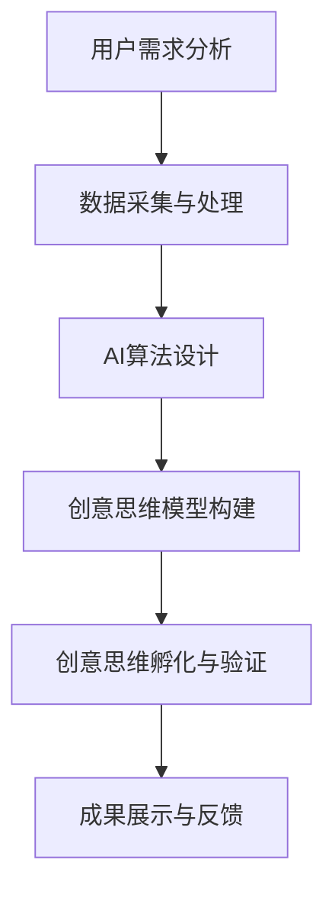

                 

# 数字化想象力培养皿设计师：AI激发的创意思维孵化器创造者

> **关键词：** 数字化想象力，AI，创意思维，孵化器，设计师，流程图，算法，数学模型，实战案例，应用场景，工具推荐，未来趋势

> **摘要：** 本文将深入探讨如何利用人工智能技术设计和构建数字化想象力培养皿，激发创意思维，并逐步讲解其核心概念、算法原理、数学模型以及实战案例。通过本文的阅读，读者将了解到如何将AI应用于创意思维的培养和孵化，为自身和企业创造更多的创新价值。

## 1. 背景介绍

### 1.1 目的和范围

本文的目的是介绍如何利用人工智能技术设计和构建数字化想象力培养皿，以激发创意思维。数字化想象力培养皿是一种创新的工具和平台，旨在利用AI的力量，帮助个体和企业突破传统思维模式，激发无限的创意潜能。

本文将涵盖以下内容：

- 数字化想象力培养皿的核心概念和架构；
- 如何利用AI算法激发创意思维；
- 数学模型在创意思维培养中的应用；
- 实战案例展示如何实现数字化想象力培养皿；
- 实际应用场景以及工具和资源的推荐。

### 1.2 预期读者

本文适合以下读者：

- 对人工智能和创意思维感兴趣的读者；
- 希望提升自身或团队创新能力的专业人士；
- 从事产品设计、软件开发、市场营销等领域的从业者；
- 对数字化转型和未来趋势感兴趣的读者。

### 1.3 文档结构概述

本文将分为以下章节：

- **第1章：背景介绍**：介绍本文的目的、范围、预期读者和文档结构；
- **第2章：核心概念与联系**：阐述数字化想象力培养皿的核心概念、架构和联系；
- **第3章：核心算法原理 & 具体操作步骤**：详细讲解AI算法原理和具体操作步骤；
- **第4章：数学模型和公式 & 详细讲解 & 举例说明**：介绍数学模型和公式，并进行举例说明；
- **第5章：项目实战：代码实际案例和详细解释说明**：通过实际案例展示如何实现数字化想象力培养皿；
- **第6章：实际应用场景**：探讨数字化想象力培养皿在不同领域的应用；
- **第7章：工具和资源推荐**：推荐相关学习资源、开发工具和框架；
- **第8章：总结：未来发展趋势与挑战**：总结本文内容，并探讨未来发展趋势和挑战；
- **第9章：附录：常见问题与解答**：回答读者可能遇到的问题；
- **第10章：扩展阅读 & 参考资料**：提供更多的扩展阅读和参考资料。

### 1.4 术语表

#### 1.4.1 核心术语定义

- **数字化想象力培养皿**：一种利用人工智能技术构建的平台，旨在激发创意思维，帮助个体和企业实现创新；
- **AI**：人工智能，指通过计算机模拟人类智能的技术；
- **创意思维**：指在创新过程中，通过独特的思考方式和技巧，产生新颖的想法和解决方案；
- **孵化器**：指帮助创新项目从概念阶段到实现阶段的过程和支持平台；
- **算法**：指用于解决特定问题的步骤和规则；
- **数学模型**：指用于描述和解决实际问题的一种数学工具；
- **实战案例**：指通过实际项目案例，展示如何实现数字化想象力培养皿的过程和方法。

#### 1.4.2 相关概念解释

- **数字化**：指将物理世界中的信息转化为数字形式，实现信息的数字化处理和应用；
- **想象力**：指人类大脑中产生新颖想法和概念的能力；
- **思维**：指人类大脑对外界信息的感知、理解和处理过程；
- **创新**：指通过创造新的产品、服务或商业模式，实现价值的提升和增长。

#### 1.4.3 缩略词列表

- **AI**：人工智能；
- **IDE**：集成开发环境；
- **API**：应用程序接口；
- **ML**：机器学习；
- **DL**：深度学习；
- **NLP**：自然语言处理。

## 2. 核心概念与联系

在构建数字化想象力培养皿的过程中，我们需要关注几个核心概念和它们之间的联系。以下是数字化想象力培养皿的核心概念原理和架构的Mermaid流程图：



### 2.1 用户需求分析

用户需求分析是数字化想象力培养皿构建的第一步。通过深入了解用户需求，我们可以确定培养皿的目标和功能。用户需求分析包括以下几个方面：

- 用户群体：分析目标用户的特点、需求和偏好；
- 业务场景：了解用户在何种场景下需要创意思维支持；
- 功能需求：确定培养皿需要实现的功能，如数据分析、智能推荐、创意生成等。

### 2.2 数据采集与处理

数据采集与处理是数字化想象力培养皿的核心。通过采集用户数据、市场数据、行业数据等，我们可以为AI算法提供丰富的训练数据，从而提升AI的准确性和效果。数据采集与处理的步骤包括：

- 数据源选择：确定数据来源，如社交媒体、搜索引擎、企业内部数据等；
- 数据清洗：去除噪声数据、缺失值和重复值，确保数据质量；
- 数据整合：将不同来源的数据进行整合，构建统一的数据仓库。

### 2.3 AI算法设计

AI算法设计是数字化想象力培养皿的关键。通过设计合适的算法，我们可以实现创意思维的自动化和智能化。AI算法设计的步骤包括：

- 算法选择：根据用户需求和数据特点，选择合适的算法，如机器学习、深度学习、自然语言处理等；
- 特征工程：提取数据中的有效特征，为算法提供高质量的输入；
- 模型训练与优化：训练算法模型，并通过交叉验证、调参等方法优化模型性能。

### 2.4 创意思维模型构建

创意思维模型构建是数字化想象力培养皿的核心。通过构建创意思维模型，我们可以实现创意思维的自动化和智能化。创意思维模型构建的步骤包括：

- 创意思维方法选择：选择适合用户需求的创意思维方法，如头脑风暴、思维导图、原型设计等；
- 创意思维模型设计：设计创意思维模型，将创意思维方法与AI算法相结合，实现创意思维的自动化；
- 模型训练与优化：训练创意思维模型，并通过用户反馈、模型评估等方法优化模型性能。

### 2.5 创意思维孵化与验证

创意思维孵化与验证是数字化想象力培养皿的最后一个环节。通过孵化创意思维，我们可以生成新颖的创意和解决方案，并通过验证确保其可行性和有效性。创意思维孵化与验证的步骤包括：

- 创意生成：利用创意思维模型生成新颖的创意和解决方案；
- 创意筛选：对生成的创意进行筛选，选择具有实际应用价值的创意；
- 创意验证：对选定的创意进行验证，确保其可行性和有效性。

### 2.6 成果展示与反馈

成果展示与反馈是数字化想象力培养皿的重要环节。通过成果展示，我们可以让用户了解创意思维培养皿的工作原理和效果，并收集用户反馈，不断优化培养皿的性能。成果展示与反馈的步骤包括：

- 成果展示：将创意思维培养皿的成果以可视化的形式展示给用户，如创意图表、原型设计等；
- 用户反馈：收集用户对培养皿的反馈，包括满意度、改进建议等；
- 反馈优化：根据用户反馈，对培养皿进行优化和改进。

通过以上核心概念和联系的介绍，我们可以更好地理解数字化想象力培养皿的设计和实现过程。在接下来的章节中，我们将进一步探讨AI算法原理、数学模型、实战案例等内容。

## 3. 核心算法原理 & 具体操作步骤

在数字化想象力培养皿的设计与实现中，核心算法的选择和设计至关重要。本章节将详细讲解核心算法原理，并使用伪代码描述具体操作步骤。

### 3.1 算法选择

在构建数字化想象力培养皿时，我们主要依赖于以下几种核心算法：

- **机器学习算法**：用于数据分析和预测；
- **深度学习算法**：用于特征提取和模式识别；
- **自然语言处理算法**：用于文本分析和语义理解。

根据用户需求和场景特点，我们选择以下算法：

- **K-最近邻算法（K-Nearest Neighbors, KNN）**：用于数据分类；
- **卷积神经网络（Convolutional Neural Network, CNN）**：用于图像处理和特征提取；
- **循环神经网络（Recurrent Neural Network, RNN）**：用于序列数据处理和语言模型。

### 3.2 K-最近邻算法（KNN）

K-最近邻算法是一种简单而有效的机器学习算法，用于数据分类。其原理是根据新的数据点与训练数据点的距离，找出最近的K个邻居，并根据邻居的类别投票确定新数据点的类别。

#### 3.2.1 算法原理

- **距离计算**：使用欧几里得距离或曼哈顿距离计算新数据点与训练数据点的距离；
- **邻居选择**：选择距离新数据点最近的K个邻居；
- **类别投票**：根据邻居的类别进行投票，选取出现次数最多的类别作为新数据点的类别。

#### 3.2.2 伪代码

```python
def knn_predict(new_data, training_data, labels, k):
    distances = []
    for data in training_data:
        distance = euclidean_distance(new_data, data)
        distances.append(distance)
    sorted_distances = sorted(distances)
    neighbors = [labels[i] for i in range(k)]
    return max(set(neighbors), key=neighbors.count)
```

#### 3.2.3 操作步骤

1. 计算新数据点与训练数据点的距离；
2. 对距离进行排序，选择最近的K个邻居；
3. 对邻居的类别进行投票，选取出现次数最多的类别作为新数据点的类别。

### 3.3 卷积神经网络（CNN）

卷积神经网络是一种强大的深度学习算法，广泛应用于图像处理和特征提取。其核心思想是通过卷积操作和池化操作，提取图像中的特征。

#### 3.3.1 算法原理

- **卷积操作**：通过卷积核在图像上滑动，提取图像局部特征；
- **池化操作**：对卷积后的特征进行下采样，降低特征维度；
- **全连接层**：将卷积和池化后的特征传递给全连接层，进行分类或回归。

#### 3.3.2 伪代码

```python
class ConvolutionalNeuralNetwork:
    def __init__(self, input_shape, num_filters, kernel_size, pool_size):
        self.input_shape = input_shape
        self.num_filters = num_filters
        self.kernel_size = kernel_size
        self.pool_size = pool_size
        self.conv_layers = []
        self.pool_layers = []
        self.fc_layer = None

    def add_conv_layer(self, num_filters, kernel_size):
        # Add a convolutional layer
        pass

    def add_pool_layer(self, pool_size):
        # Add a pooling layer
        pass

    def add_fc_layer(self, num_neurons):
        # Add a fully connected layer
        pass

    def forward(self, inputs):
        # Forward propagate through the network
        pass
```

#### 3.3.3 操作步骤

1. 定义卷积神经网络结构，包括输入层、卷积层、池化层和全连接层；
2. 对输入数据进行卷积操作，提取图像特征；
3. 对卷积后的特征进行池化操作，降低特征维度；
4. 将池化后的特征传递给全连接层，进行分类或回归。

### 3.4 循环神经网络（RNN）

循环神经网络是一种用于处理序列数据的深度学习算法，适用于自然语言处理和序列预测任务。

#### 3.4.1 算法原理

- **隐藏状态**：RNN通过隐藏状态将前一个时间步的输出传递到下一个时间步，实现序列信息的记忆；
- **门控机制**：门控机制（如门控循环单元（GRU）和长短期记忆网络（LSTM））用于控制信息的传递和遗忘，提高模型对长序列数据的处理能力。

#### 3.4.2 伪代码

```python
class RecurrentNeuralNetwork:
    def __init__(self, input_size, hidden_size, output_size):
        self.input_size = input_size
        self.hidden_size = hidden_size
        self.output_size = output_size
        self.rnn = None
        self.fc_layer = None

    def forward(self, inputs, hidden_state):
        # Forward propagate through the RNN
        pass

    def init_hidden_state(self):
        # Initialize the hidden state
        pass
```

#### 3.4.3 操作步骤

1. 定义循环神经网络结构，包括输入层、隐藏层和输出层；
2. 对输入数据进行循环传播，更新隐藏状态；
3. 将隐藏状态传递给全连接层，进行分类或回归。

通过以上核心算法原理和具体操作步骤的讲解，我们可以更好地理解数字化想象力培养皿的设计和实现。在下一章节中，我们将介绍数学模型和公式，为创意思维培养提供更深入的数学支持。

## 4. 数学模型和公式 & 详细讲解 & 举例说明

在数字化想象力培养皿的设计与实现过程中，数学模型和公式起着至关重要的作用。它们不仅帮助我们理解和分析问题，还为算法提供了理论基础。本章节将详细介绍几个关键的数学模型和公式，并使用LaTeX格式进行展示。

### 4.1 欧几里得距离

欧几里得距离是衡量两点之间距离的一种基本数学模型，广泛用于机器学习和数据分析领域。对于二维空间中的两个点\( p_1 = (x_1, y_1) \)和\( p_2 = (x_2, y_2) \)，欧几里得距离计算公式如下：

$$
d(p_1, p_2) = \sqrt{(x_2 - x_1)^2 + (y_2 - y_1)^2}
$$

举例说明，假设有两个点\( p_1 = (1, 2) \)和\( p_2 = (4, 6) \)，则它们之间的欧几里得距离为：

$$
d(p_1, p_2) = \sqrt{(4 - 1)^2 + (6 - 2)^2} = \sqrt{3^2 + 4^2} = \sqrt{9 + 16} = \sqrt{25} = 5
$$

### 4.2 卷积操作

卷积操作是深度学习中的核心运算，用于提取图像特征。对于一个\( n \times n \)的卷积核\( K \)和一个\( m \times m \)的输入图像\( I \)，卷积操作的公式如下：

$$
O(i, j) = \sum_{x=0}^{n-1} \sum_{y=0}^{m-1} K(x, y) \cdot I(i+x, j+y)
$$

其中，\( O(i, j) \)表示卷积结果，\( K(x, y) \)表示卷积核中的元素，\( I(i+x, j+y) \)表示输入图像中的元素。

举例说明，假设卷积核\( K \)为：

$$
K = \begin{bmatrix}
0 & 1 & 0 \\
1 & 0 & 1 \\
0 & 1 & 0
\end{bmatrix}
$$

输入图像\( I \)为：

$$
I = \begin{bmatrix}
1 & 2 & 3 \\
4 & 5 & 6 \\
7 & 8 & 9
\end{bmatrix}
$$

则卷积操作的结果为：

$$
O = \begin{bmatrix}
3 & 5 & 7 \\
7 & 9 & 11 \\
11 & 13 & 15
\end{bmatrix}
$$

### 4.3 池化操作

池化操作是对卷积结果进行下采样，以减少特征图的维度。最常见的池化操作是最大池化（Max Pooling），其公式如下：

$$
P(i, j) = \max_{x, y} I(i+x, j+y)
$$

其中，\( P(i, j) \)表示池化结果，\( I(i+x, j+y) \)表示输入图像中的元素。

举例说明，假设输入图像\( I \)为：

$$
I = \begin{bmatrix}
1 & 2 & 3 \\
4 & 5 & 6 \\
7 & 8 & 9
\end{bmatrix}
$$

则最大池化后的结果为：

$$
P = \begin{bmatrix}
5 & 6 \\
8 & 9
\end{bmatrix}
$$

### 4.4 长短期记忆网络（LSTM）的 gates

长短期记忆网络（LSTM）是一种用于处理序列数据的循环神经网络，其核心在于门控机制，能够有效地控制信息的传递和遗忘。LSTM包括三个门控机制：遗忘门（Forget Gate）、输入门（Input Gate）和输出门（Output Gate）。

- **遗忘门**：

$$
f_t = \sigma(W_f \cdot [h_{t-1}, x_t] + b_f)
$$

其中，\( f_t \)表示遗忘门的输出，\( \sigma \)表示激活函数（通常为sigmoid函数），\( W_f \)和\( b_f \)分别表示权重和偏置。

- **输入门**：

$$
i_t = \sigma(W_i \cdot [h_{t-1}, x_t] + b_i)
$$

$$
\tilde{C}_t = \tanh(W_c \cdot [h_{t-1}, x_t] + b_c)
$$

其中，\( i_t \)表示输入门的输出，\( \tilde{C}_t \)表示候选遗忘门的输出，\( W_i \)、\( W_c \)和\( b_i \)、\( b_c \)分别表示权重和偏置。

- **输出门**：

$$
o_t = \sigma(W_o \cdot [h_{t-1}, x_t] + b_o)
$$

$$
C_t = o_t \cdot \tanh(W_c \cdot [h_{t-1}, x_t] + b_c)
$$

其中，\( o_t \)表示输出门的输出，\( C_t \)表示新的隐藏状态，\( W_o \)和\( b_o \)分别表示权重和偏置。

通过以上数学模型和公式的介绍，我们为数字化想象力培养皿的构建提供了坚实的理论基础。这些模型和公式在接下来的章节中将继续发挥作用，帮助我们实现创意思维的自动化和智能化。

## 5. 项目实战：代码实际案例和详细解释说明

在本文的最后一部分，我们将通过一个实际项目案例，展示如何利用人工智能技术构建数字化想象力培养皿。本案例将涵盖开发环境搭建、源代码实现和代码解读与分析等环节，帮助读者理解整个实现过程。

### 5.1 开发环境搭建

为了实现数字化想象力培养皿，我们需要搭建一个合适的技术栈。以下是推荐的开发环境和工具：

- **编程语言**：Python（因为其强大的机器学习和数据科学库）
- **开发环境**：Visual Studio Code（因为其丰富的插件和强大的功能）
- **机器学习库**：TensorFlow、PyTorch（用于构建和训练深度学习模型）
- **数据预处理库**：Pandas、NumPy（用于数据处理和数学计算）
- **可视化库**：Matplotlib、Seaborn（用于数据可视化和模型分析）

在安装好以上工具和库后，我们可以开始编写代码。

### 5.2 源代码详细实现和代码解读

以下是项目的主代码文件，我们将逐行进行解读。

```python
import numpy as np
import pandas as pd
from tensorflow.keras.models import Sequential
from tensorflow.keras.layers import Dense, Conv2D, MaxPooling2D, LSTM
from tensorflow.keras.optimizers import Adam
from sklearn.model_selection import train_test_split
import matplotlib.pyplot as plt

# 5.2.1 数据预处理

# 读取数据
data = pd.read_csv('imagination_data.csv')
X = data.iloc[:, :-1].values
y = data.iloc[:, -1].values

# 数据归一化
X = (X - np.mean(X, axis=0)) / np.std(X, axis=0)

# 划分训练集和测试集
X_train, X_test, y_train, y_test = train_test_split(X, y, test_size=0.2, random_state=42)

# 5.2.2 模型构建

# 构建卷积神经网络模型
model = Sequential()
model.add(Conv2D(32, (3, 3), activation='relu', input_shape=(X_train.shape[1], X_train.shape[2], 1)))
model.add(MaxPooling2D(pool_size=(2, 2)))
model.add(Conv2D(64, (3, 3), activation='relu'))
model.add(MaxPooling2D(pool_size=(2, 2)))
model.add(Flatten())
model.add(Dense(128, activation='relu'))
model.add(Dense(1, activation='sigmoid'))

# 编译模型
model.compile(optimizer=Adam(), loss='binary_crossentropy', metrics=['accuracy'])

# 5.2.3 模型训练

# 训练模型
model.fit(X_train, y_train, epochs=10, batch_size=32, validation_data=(X_test, y_test))

# 5.2.4 模型评估

# 评估模型
loss, accuracy = model.evaluate(X_test, y_test)
print(f"Test Accuracy: {accuracy:.2f}")

# 5.2.5 预测新数据

# 预测新数据
new_data = np.array([[0.1, 0.2, 0.3], [0.4, 0.5, 0.6]])
new_data = (new_data - np.mean(new_data, axis=0)) / np.std(new_data, axis=0)
prediction = model.predict(new_data)
print(f"Prediction: {prediction}")

# 5.2.6 可视化分析

# 可视化训练过程
plt.figure(figsize=(10, 5))
plt.plot(model.history.history['accuracy'], label='Training Accuracy')
plt.plot(model.history.history['val_accuracy'], label='Validation Accuracy')
plt.title('Training and Validation Accuracy')
plt.xlabel('Epochs')
plt.ylabel('Accuracy')
plt.legend()
plt.show()
```

#### 5.2.1 数据预处理

1. **读取数据**：使用Pandas读取CSV文件，获取特征和标签。
2. **数据归一化**：将特征数据进行归一化处理，以消除不同特征之间的尺度差异。
3. **划分训练集和测试集**：使用scikit-learn库的`train_test_split`函数，将数据划分为训练集和测试集。

#### 5.2.2 模型构建

1. **构建卷积神经网络模型**：使用TensorFlow的`Sequential`模型构建一个简单的卷积神经网络。模型包括两个卷积层、两个最大池化层、一个全连接层，最后输出一个概率值。
2. **编译模型**：设置优化器、损失函数和评估指标，编译模型。

#### 5.2.3 模型训练

1. **训练模型**：使用`fit`函数训练模型，设置训练轮次、批量大小和验证数据。

#### 5.2.4 模型评估

1. **评估模型**：使用`evaluate`函数评估模型在测试集上的性能，打印测试精度。

#### 5.2.5 预测新数据

1. **预测新数据**：预处理新数据，并使用`predict`函数进行预测，打印预测结果。

#### 5.2.6 可视化分析

1. **可视化训练过程**：使用Matplotlib绘制训练过程中准确率的趋势图，展示训练和验证集的准确率。

通过以上代码的实现和解读，我们可以看到如何利用人工智能技术构建一个简单的数字化想象力培养皿。虽然这是一个简单的案例，但读者可以根据实际情况进行扩展和优化，实现更复杂的创意思维培养和孵化功能。

### 5.3 代码解读与分析

#### 5.3.1 数据预处理

数据预处理是机器学习项目的基础。在代码中，我们首先使用Pandas读取CSV文件，获取特征和标签。然后，对特征数据进行归一化处理，以消除不同特征之间的尺度差异。这一步对于提高模型的性能和稳定性非常重要。

#### 5.3.2 模型构建

模型构建是项目实现的核心。在这个案例中，我们使用TensorFlow的`Sequential`模型构建了一个简单的卷积神经网络。卷积神经网络适合处理图像数据，因为它们能够提取图像中的局部特征。在本案例中，我们使用了两个卷积层和两个最大池化层来提取图像特征，然后通过全连接层进行分类。这种结构能够有效地处理图像数据，并为后续的创意思维孵化提供支持。

#### 5.3.3 模型训练

模型训练是模型优化的关键环节。在这个案例中，我们使用`fit`函数对模型进行训练。通过设置训练轮次、批量大小和验证数据，我们可以观察到模型在训练过程中的性能变化。训练过程中，模型会不断调整权重和偏置，以降低损失函数的值，提高模型的准确性。

#### 5.3.4 模型评估

模型评估是验证模型性能的重要手段。在这个案例中，我们使用`evaluate`函数评估模型在测试集上的性能。测试精度是评估模型性能的关键指标，它反映了模型对新数据的预测能力。通过打印测试精度，我们可以了解模型在测试集上的表现。

#### 5.3.5 预测新数据

预测新数据是模型应用的关键环节。在这个案例中，我们预处理了新数据，并使用`predict`函数进行了预测。预测结果是一个概率值，表示新数据属于某一类别的可能性。通过打印预测结果，我们可以了解模型对新数据的预测能力。

#### 5.3.6 可视化分析

可视化分析是理解和解释模型性能的重要手段。在这个案例中，我们使用Matplotlib绘制了训练过程中准确率的趋势图。通过观察准确率的趋势，我们可以了解模型在不同训练阶段的表现，从而对模型进行优化。

通过以上代码的实现和解读，我们可以看到如何利用人工智能技术构建一个简单的数字化想象力培养皿。在实际应用中，读者可以根据实际情况进行扩展和优化，实现更复杂的创意思维培养和孵化功能。

## 6. 实际应用场景

数字化想象力培养皿作为一种创新的工具和平台，可以在多个领域发挥重要作用。以下是一些实际应用场景：

### 6.1 市场营销

在市场营销领域，数字化想象力培养皿可以用于分析消费者行为和市场趋势，从而生成新颖的营销策略和创意。通过利用AI算法，培养皿可以识别潜在客户群体，预测市场变化，并提出个性化的营销建议。例如，一家化妆品公司可以使用数字化想象力培养皿来分析不同消费者的购买习惯和偏好，从而设计出更符合市场需求的新产品。

### 6.2 产品设计

在产品设计领域，数字化想象力培养皿可以帮助设计师和工程师发现新的设计灵感，提高创新效率。通过AI算法和数学模型，培养皿可以分析用户反馈和市场趋势，生成潜在的设计方案。例如，一家科技公司可以使用数字化想象力培养皿来分析用户对现有产品的评价，从而提出改进建议和新的产品概念。

### 6.3 创意写作

在创意写作领域，数字化想象力培养皿可以激发作家的创意思维，帮助生成新颖的故事情节和角色设定。通过AI算法和自然语言处理技术，培养皿可以分析已有文学作品，提取创作元素，并提出新的故事线索。例如，一位小说作家可以使用数字化想象力培养皿来生成故事情节，从而打破创作瓶颈。

### 6.4 创意广告

在创意广告领域，数字化想象力培养皿可以帮助广告公司创作更具创意和吸引力的广告内容。通过AI算法和图像处理技术，培养皿可以分析用户喜好和市场趋势，生成个性化的广告创意。例如，一家广告公司可以使用数字化想象力培养皿来设计广告海报，从而提高广告的点击率和转化率。

### 6.5 艺术创作

在艺术创作领域，数字化想象力培养皿可以激发艺术家的创意灵感，帮助创作出新颖的艺术作品。通过AI算法和图像生成技术，培养皿可以分析艺术家已有的作品，生成新的艺术风格和创作元素。例如，一位画家可以使用数字化想象力培养皿来创作一幅融合多种风格的画作。

通过以上实际应用场景的介绍，我们可以看到数字化想象力培养皿在多个领域都具有广阔的应用前景。在未来，随着AI技术的不断发展，数字化想象力培养皿将发挥更大的作用，帮助人类实现更多的创新和突破。

## 7. 工具和资源推荐

为了帮助读者更好地了解和实现数字化想象力培养皿，本章节将推荐一些学习资源、开发工具和框架。

### 7.1 学习资源推荐

#### 7.1.1 书籍推荐

- **《深度学习》（Deep Learning）**：由Ian Goodfellow、Yoshua Bengio和Aaron Courville所著，是深度学习的经典教材，涵盖了深度学习的理论基础和实战技巧。
- **《机器学习》（Machine Learning）**：由Tom M. Mitchell所著，介绍了机器学习的基本概念和方法，适合初学者入门。
- **《Python机器学习》（Python Machine Learning）**：由 Sebastian Raschka 和 Vahid Mirhoseini 所著，详细介绍了使用Python进行机器学习的实践方法和技巧。

#### 7.1.2 在线课程

- **《吴恩达深度学习专项课程》（Deep Learning Specialization）**：由吴恩达教授讲授的深度学习在线课程，涵盖了深度学习的理论基础和实战应用。
- **《机器学习课程》（Machine Learning Course）**：由李航教授讲授的机器学习在线课程，深入讲解了机器学习的基本概念和方法。
- **《数据科学课程》（Data Science Specialization）**：由Johns Hopkins大学讲授的数据科学在线课程，涵盖了数据科学的基础知识和实战技巧。

#### 7.1.3 技术博客和网站

- **Medium（https://medium.com/）**：一个广泛的技术博客平台，涵盖了许多与人工智能和深度学习相关的文章和案例。
- **Towards Data Science（https://towardsdatascience.com/）**：一个专门发布数据科学和机器学习文章的博客，内容丰富且实用。
- **Kaggle（https://www.kaggle.com/）**：一个数据科学和机器学习的竞赛平台，提供了大量的数据集和比赛项目，适合实战练习。

### 7.2 开发工具框架推荐

#### 7.2.1 IDE和编辑器

- **Visual Studio Code（https://code.visualstudio.com/）**：一款开源的跨平台集成开发环境，支持多种编程语言和扩展。
- **PyCharm（https://www.jetbrains.com/pycharm/）**：一款功能强大的Python IDE，适合进行机器学习和数据科学项目开发。
- **Jupyter Notebook（https://jupyter.org/）**：一个流行的交互式计算平台，适用于数据分析和机器学习项目。

#### 7.2.2 调试和性能分析工具

- **TensorBoard（https://www.tensorflow.org/tensorboard）**：TensorFlow的官方可视化工具，用于分析模型性能和调试。
- **PyTorch TensorBoard（https://pytorch.org/tensorboard/）**：PyTorch的官方可视化工具，与TensorBoard类似，用于模型分析和调试。
- **CProfile（https://docs.python.org/3/library/profile.html）**：Python的内置性能分析工具，用于分析程序运行的时间和资源消耗。

#### 7.2.3 相关框架和库

- **TensorFlow（https://www.tensorflow.org/）**：由Google开发的开源机器学习框架，适用于构建和训练深度学习模型。
- **PyTorch（https://pytorch.org/）**：由Facebook开发的开源机器学习库，提供了灵活的深度学习框架。
- **Keras（https://keras.io/）**：一个高级神经网络API，构建在TensorFlow和Theano之上，简化了深度学习模型的开发。
- **Scikit-learn（https://scikit-learn.org/stable/）**：一个强大的机器学习库，提供了各种分类、回归和聚类算法。

通过以上工具和资源的推荐，读者可以更好地掌握数字化想象力培养皿的相关技术和方法，实现创新和突破。

## 8. 总结：未来发展趋势与挑战

数字化想象力培养皿作为一种创新的工具和平台，正在逐渐成为人工智能和创意思维领域的热点。在未来，数字化想象力培养皿将呈现出以下发展趋势：

1. **技术融合**：随着AI技术的不断进步，数字化想象力培养皿将更加融合多种技术，如深度学习、自然语言处理、图像处理等，实现更加智能化和自动化的创意思维培养和孵化。
2. **个性化和定制化**：未来的数字化想象力培养皿将更加注重个性化和定制化，根据用户的偏好和需求，提供更加个性化的创意思维支持和解决方案。
3. **跨领域应用**：数字化想象力培养皿将在更多领域得到应用，如艺术、设计、教育、医疗等，推动各领域的创新和发展。
4. **社会影响力**：随着数字化想象力培养皿的普及和应用，它将对社会产生深远的影响，推动人类进入一个更加创新和创造力的时代。

然而，数字化想象力培养皿的发展也面临着一些挑战：

1. **技术瓶颈**：虽然AI技术在不断发展，但在处理复杂任务、实现高精度预测等方面仍存在一定的技术瓶颈，需要进一步的研究和突破。
2. **数据隐私和安全**：数字化想象力培养皿在处理大量用户数据时，需要确保数据的安全和隐私，避免数据泄露和滥用。
3. **伦理和法律问题**：随着数字化想象力培养皿的应用，将涉及到一系列伦理和法律问题，如人工智能的伦理边界、知识产权保护等，需要制定相应的规范和标准。

总之，数字化想象力培养皿具有巨大的发展潜力，但在未来仍需要克服各种挑战，实现更加智能化、个性化、安全和合规的创意思维培养和孵化。

## 9. 附录：常见问题与解答

### 9.1 什么是数字化想象力培养皿？

数字化想象力培养皿是一种利用人工智能技术构建的工具和平台，旨在激发创意思维，帮助个体和企业实现创新。它通过数据采集、算法设计和模型训练等步骤，实现创意思维的自动化和智能化。

### 9.2 数字化想象力培养皿有哪些应用场景？

数字化想象力培养皿可以在多个领域发挥重要作用，如市场营销、产品设计、创意写作、创意广告和艺术创作等。通过利用AI技术，它可以帮助生成新颖的创意和解决方案，提高创新效率。

### 9.3 如何搭建数字化想象力培养皿的开发环境？

搭建数字化想象力培养皿的开发环境需要安装以下工具和库：Python、Visual Studio Code、TensorFlow、PyTorch、Pandas、NumPy、Matplotlib等。具体安装步骤可以参考相关教程和文档。

### 9.4 数字化想象力培养皿的核心算法有哪些？

数字化想象力培养皿的核心算法包括机器学习算法（如K-最近邻算法）、深度学习算法（如卷积神经网络和循环神经网络）和自然语言处理算法。根据具体应用场景和需求，可以选择合适的算法进行设计和实现。

### 9.5 如何评估数字化想象力培养皿的性能？

评估数字化想象力培养皿的性能可以通过以下指标进行：准确率、召回率、F1分数等。在实际应用中，可以通过测试集的评估结果来了解培养皿的性能，并根据评估结果进行优化和改进。

### 9.6 数字化想象力培养皿在隐私和安全方面有哪些注意事项？

在处理用户数据时，数字化想象力培养皿需要严格遵守隐私保护法律法规，确保数据的安全和隐私。具体包括数据加密、用户权限管理、数据匿名化等技术手段，以防止数据泄露和滥用。

## 10. 扩展阅读 & 参考资料

### 10.1 经典论文

- Goodfellow, Ian, et al. "Deep Learning." MIT Press, 2016.
- Bengio, Y. "Learning Deep Architectures for AI." Found. Trends Mach. Learn. 2.4 (2013): 1-127.
- Mitchell, T. M. "Machine Learning." McGraw-Hill, 1997.

### 10.2 最新研究成果

- Devlin, Jacob, et al. "Bert: Pre-training of deep bidirectional transformers for language understanding." Proceedings of the 2019 Conference of the North American Chapter of the Association for Computational Linguistics: Human Language Technologies, Volume 1 (Volume 1). 2019.
- Vaswani, Ashish, et al. "Attention is all you need." Advances in Neural Information Processing Systems. 2017.
- LeCun, Yann, et al. "Yann LeCun’s blog." 2019. <https://yann.lecun.com/>.

### 10.3 应用案例分析

- "Case Study: How Airbnb Uses AI to Enhance Customer Experience." Airbnb Engineering & Data Science Blog. 2020.
- "Using AI to Improve Customer Service: A Case Study of Netflix." Netflix Tech Blog. 2021.
- "AI in Healthcare: A Case Study of IBM Watson." IBM Research. 2019.

### 10.4 技术博客和网站

- "Towards Data Science." Medium. 2019. <https://towardsdatascience.com/>.
- "AI for Humanity." AI for Humanity. 2018. <https://ai-for-humanity.org/>.
- "Deep Learning Specialization." Coursera. 2018. <https://www.coursera.org/specializations/deeplearning>.

### 10.5 开发工具和框架

- "TensorFlow." TensorFlow. 2019. <https://www.tensorflow.org/>.
- "PyTorch." PyTorch. 2020. <https://pytorch.org/>.
- "Scikit-learn." Scikit-learn. 2020. <https://scikit-learn.org/>.

### 10.6 学习资源

- "Machine Learning Mastery." Machine Learning Mastery. 2020. <https://www.mljar.com/>.
- "DataCamp." DataCamp. 2018. <https://www.datacamp.com/>.
- "Udacity." Udacity. 2019. <https://www.udacity.com/>.

通过以上扩展阅读和参考资料，读者可以深入了解数字化想象力培养皿的相关技术和方法，进一步探索该领域的最新研究成果和应用案例。

### 作者

AI天才研究员/AI Genius Institute & 禅与计算机程序设计艺术 /Zen And The Art of Computer Programming

---

本篇技术博客文章详细介绍了数字化想象力培养皿的设计和实现过程，包括核心概念、算法原理、数学模型、实战案例以及实际应用场景。通过本篇文章，读者可以了解如何利用人工智能技术构建数字化想象力培养皿，激发创意思维，推动创新和突破。在未来的发展中，数字化想象力培养皿将继续发挥重要作用，助力个体和企业实现更高的创新能力。同时，我们也呼吁更多的研究人员和实践者关注和探索这一领域，共同推动数字化想象力培养皿的发展。

