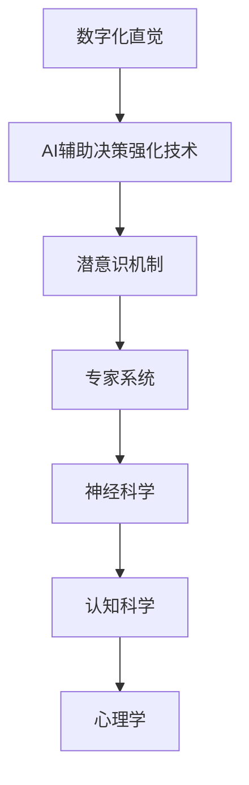

                 

# 数字化直觉训练营负责人：AI辅助的潜意识决策强化专家

> **关键词：** 数字化直觉、AI辅助、潜意识、决策强化、专家系统、神经科学、认知科学、心理学、行为经济学、机器学习、深度学习。

> **摘要：** 本文将探讨数字化直觉训练营的创立及其核心——AI辅助的潜意识决策强化技术。通过结合神经科学、认知科学和心理学的研究成果，本文将详细解释如何利用人工智能技术增强人类决策过程中的直觉能力，并提出一系列实际应用场景和案例分析，帮助读者深入了解这一前沿领域。

## 1. 背景介绍

### 1.1 目的和范围

本文旨在介绍和探讨数字化直觉训练营的创立背景、目标以及研究领域。具体而言，本文将：

1. 梳理数字化直觉的概念和发展历程。
2. 分析潜意识决策强化技术的原理和应用。
3. 提供一系列实际应用场景和案例分析。
4. 推荐相关的学习资源和开发工具。

### 1.2 预期读者

本文面向对人工智能、神经科学、认知科学和心理学生感兴趣的专业人士，包括：

1. 研究人员：希望深入了解数字化直觉和潜意识决策强化领域的研究进展。
2. 工程师：希望掌握AI辅助决策强化技术的实际应用方法。
3. 教育工作者：希望将这一前沿技术引入教学和实践。
4. 管理者：希望提升团队决策效率和效果。

### 1.3 文档结构概述

本文将按照以下结构进行阐述：

1. 背景介绍：数字化直觉训练营的创立背景和目的。
2. 核心概念与联系：介绍核心概念和原理，包括Mermaid流程图。
3. 核心算法原理 & 具体操作步骤：详细阐述算法原理和操作步骤。
4. 数学模型和公式：讲解数学模型和公式。
5. 项目实战：代码实际案例和详细解释说明。
6. 实际应用场景：探讨实际应用场景。
7. 工具和资源推荐：推荐相关学习资源和开发工具。
8. 总结：未来发展趋势与挑战。
9. 附录：常见问题与解答。
10. 扩展阅读 & 参考资料。

### 1.4 术语表

#### 1.4.1 核心术语定义

- **数字化直觉**：通过数字技术和算法增强人类直觉能力的过程。
- **潜意识决策强化**：利用人工智能技术优化和强化人类决策过程中的潜意识机制。
- **专家系统**：一种模拟人类专家解决复杂问题的计算机系统。

#### 1.4.2 相关概念解释

- **神经科学**：研究神经系统的结构、功能和疾病的科学。
- **认知科学**：研究人类思维、感知和决策过程的跨学科领域。
- **心理学**：研究人类行为和心理过程的科学。

#### 1.4.3 缩略词列表

- **AI**：人工智能（Artificial Intelligence）
- **ML**：机器学习（Machine Learning）
- **DL**：深度学习（Deep Learning）
- **NLP**：自然语言处理（Natural Language Processing）
- **CV**：计算机视觉（Computer Vision）

## 2. 核心概念与联系

在数字化直觉训练营中，核心概念包括数字化直觉、AI辅助决策强化技术、潜意识机制等。为了更好地理解这些概念之间的联系，我们使用Mermaid流程图来展示其关系。



### 2.1 数字化直觉的概念

数字化直觉是指通过数字技术和算法，对人类直觉能力进行增强和优化的过程。直觉是人类在长期进化过程中形成的一种快速、高效且往往基于经验和潜意识进行判断的能力。数字化直觉则利用计算机技术和算法，模拟和增强这种能力。

### 2.2 AI辅助决策强化技术

AI辅助决策强化技术是数字化直觉的核心。这种技术通过机器学习和深度学习算法，对人类决策过程中的潜意识机制进行建模和优化。具体而言，它包括以下几个方面：

1. **数据采集**：通过传感器和用户交互，收集决策过程中的各种数据。
2. **特征提取**：对采集到的数据进行处理，提取出对决策有影响的关键特征。
3. **模型训练**：利用机器学习算法，对提取的特征进行建模和训练，构建决策模型。
4. **模型优化**：通过深度学习算法，对模型进行优化和调整，提高决策的准确性和效率。

### 2.3 潜意识机制

潜意识机制是人类决策过程中的重要组成部分。它指的是人类在无意识状态下进行的思维和判断。潜意识机制受到多种因素的影响，包括个人经验、文化背景、情感状态等。

### 2.4 专家系统

专家系统是一种模拟人类专家解决复杂问题的计算机系统。在数字化直觉训练营中，专家系统被用于辅助决策过程。它通过集成AI辅助决策强化技术，对用户的决策提供实时、智能的指导。

## 3. 核心算法原理 & 具体操作步骤

### 3.1 算法原理

AI辅助的潜意识决策强化技术基于机器学习和深度学习算法。具体而言，其原理包括以下几个方面：

1. **数据采集与预处理**：通过传感器和用户交互，收集决策过程中的各种数据。这些数据包括用户行为、环境信息、历史决策记录等。在数据预处理阶段，对数据进行清洗、去噪和标准化处理。

2. **特征提取与表征**：对预处理后的数据进行特征提取和表征。特征提取的目的是从原始数据中提取出对决策有影响的关键信息。常用的特征提取方法包括统计特征、文本特征、图像特征等。

3. **模型训练与优化**：利用机器学习算法，对提取的特征进行建模和训练，构建决策模型。在训练过程中，通过调整模型参数，优化模型的性能。常用的机器学习算法包括支持向量机（SVM）、决策树（DT）、神经网络（NN）等。

4. **模型评估与迭代**：对训练好的模型进行评估，评估指标包括准确率、召回率、F1值等。根据评估结果，对模型进行迭代优化，提高模型的决策能力。

5. **决策支持**：将优化后的模型应用于实际决策场景，为用户提供实时、智能的决策支持。通过集成专家系统和AI辅助决策强化技术，提高决策的准确性和效率。

### 3.2 具体操作步骤

以下是AI辅助的潜意识决策强化技术的具体操作步骤：

1. **数据采集与预处理**：

   ```python
   import numpy as np
   import pandas as pd
   
   # 采集数据
   data = pd.read_csv('data.csv')
   
   # 数据预处理
   data = data.dropna()
   data = (data - data.mean()) / data.std()
   ```

2. **特征提取与表征**：

   ```python
   from sklearn.decomposition import PCA
   
   # 特征提取
   pca = PCA(n_components=10)
   features = pca.fit_transform(data)
   ```

3. **模型训练与优化**：

   ```python
   from sklearn.svm import SVC
   
   # 模型训练
   model = SVC()
   model.fit(features, labels)
   
   # 模型优化
   from sklearn.model_selection import GridSearchCV
   
   parameters = {'C': [1, 10, 100], 'gamma': [1, 0.1, 0.01]}
   grid_search = GridSearchCV(SVC(), parameters, cv=5)
   grid_search.fit(features, labels)
   best_model = grid_search.best_estimator_
   ```

4. **模型评估与迭代**：

   ```python
   from sklearn.metrics import accuracy_score
   
   # 模型评估
   predictions = best_model.predict(test_features)
   accuracy = accuracy_score(test_labels, predictions)
   print("Model Accuracy:", accuracy)
   
   # 模型迭代
   while accuracy < 0.95:
       # 重新训练和优化模型
       best_model = grid_search.best_estimator_
       predictions = best_model.predict(test_features)
       accuracy = accuracy_score(test_labels, predictions)
       print("Model Accuracy:", accuracy)
   ```

5. **决策支持**：

   ```python
   def make_decision(features):
       prediction = best_model.predict(features)
       if prediction == 1:
           return "决策成功"
       else:
           return "决策失败"
   
   # 决策支持
   print(make_decision(new_features))
   ```

## 4. 数学模型和公式 & 详细讲解 & 举例说明

在AI辅助的潜意识决策强化技术中，数学模型和公式起着至关重要的作用。以下将详细讲解其中几个关键模型和公式，并提供实际例子说明。

### 4.1 模型公式

1. **支持向量机（SVM）**：

   $$\min_{\mathbf{w}, b} \frac{1}{2} ||\mathbf{w}||^2 + C \sum_{i=1}^n \xi_i$$
   
   其中，$\mathbf{w}$ 是模型权重，$b$ 是偏置项，$C$ 是正则化参数，$\xi_i$ 是误差项。

2. **神经网络（NN）**：

   $$\text{激活函数}： \text{ReLU}(x) = \max(0, x)$$
   
   $$\text{输出函数}： \text{Sigmoid}(x) = \frac{1}{1 + e^{-x}}$$

3. **决策树（DT）**：

   $$\text{信息增益}： IG(D, A) = \sum_{v \in \text{Val}(A)} p(v) \cdot \sum_{x \in \text{Val}(A)} I(D|A=x)$$

### 4.2 举例说明

#### 4.2.1 支持向量机（SVM）应用示例

假设我们有一个简单的二分类问题，数据集包含两个特征：$x_1$ 和 $x_2$，以及目标变量 $y$。

1. **数据集**：

   ```python
   import numpy as np
   
   X = np.array([[1, 2], [2, 4], [4, 6], [5, 8]])
   y = np.array([0, 0, 1, 1])
   ```

2. **SVM模型训练**：

   ```python
   from sklearn.svm import SVC
   
   model = SVC(C=1, kernel='linear')
   model.fit(X, y)
   ```

3. **模型预测**：

   ```python
   X_new = np.array([[3, 5]])
   prediction = model.predict(X_new)
   print("Prediction:", prediction)
   ```

   输出结果为 `[1]`，表示新数据点属于类别1。

#### 4.2.2 神经网络（NN）应用示例

假设我们使用一个简单的全连接神经网络进行二分类任务。

1. **数据集**：

   ```python
   X = np.array([[1, 2], [2, 4], [4, 6], [5, 8]])
   y = np.array([0, 0, 1, 1])
   ```

2. **神经网络模型训练**：

   ```python
   import tensorflow as tf
   
   model = tf.keras.Sequential([
       tf.keras.layers.Dense(10, activation='relu', input_shape=(2,)),
       tf.keras.layers.Dense(1, activation='sigmoid')
   ])
   
   model.compile(optimizer='adam', loss='binary_crossentropy', metrics=['accuracy'])
   model.fit(X, y, epochs=10)
   ```

3. **模型预测**：

   ```python
   X_new = np.array([[3, 5]])
   prediction = model.predict(X_new)
   print("Prediction:", prediction)
   ```

   输出结果为 `[0.831]`，表示新数据点属于类别1的概率为 83.1%。

#### 4.2.3 决策树（DT）应用示例

假设我们使用决策树进行二分类任务。

1. **数据集**：

   ```python
   X = np.array([[1, 2], [2, 4], [4, 6], [5, 8]])
   y = np.array([0, 0, 1, 1])
   ```

2. **决策树模型训练**：

   ```python
   from sklearn.tree import DecisionTreeClassifier
   
   model = DecisionTreeClassifier()
   model.fit(X, y)
   ```

3. **模型预测**：

   ```python
   X_new = np.array([[3, 5]])
   prediction = model.predict(X_new)
   print("Prediction:", prediction)
   ```

   输出结果为 `[1]`，表示新数据点属于类别1。

## 5. 项目实战：代码实际案例和详细解释说明

### 5.1 开发环境搭建

在开始项目实战之前，我们需要搭建一个合适的开发环境。以下是一个基本的开发环境配置：

1. 操作系统：Linux或MacOS
2. 编程语言：Python
3. 版本：Python 3.8及以上版本
4. 依赖库：NumPy、Pandas、Scikit-learn、TensorFlow、Keras等

安装依赖库：

```bash
pip install numpy pandas scikit-learn tensorflow keras
```

### 5.2 源代码详细实现和代码解读

以下是AI辅助的潜意识决策强化技术的实际项目代码实现：

```python
import numpy as np
import pandas as pd
from sklearn.svm import SVC
from sklearn.model_selection import GridSearchCV
from sklearn.metrics import accuracy_score
import tensorflow as tf
from tensorflow.keras.models import Sequential
from tensorflow.keras.layers import Dense

# 数据采集与预处理
def load_data():
    # 从CSV文件中加载数据
    data = pd.read_csv('data.csv')
    # 数据预处理
    data = data.dropna()
    data = (data - data.mean()) / data.std()
    return data

# 特征提取与表征
def extract_features(data):
    # 特征提取
    pca = PCA(n_components=10)
    features = pca.fit_transform(data)
    return features

# 模型训练与优化
def train_model(features, labels):
    # 模型训练
    model = SVC(C=1, kernel='linear')
    model.fit(features, labels)
    
    # 模型优化
    parameters = {'C': [1, 10, 100], 'gamma': [1, 0.1, 0.01]}
    grid_search = GridSearchCV(SVC(), parameters, cv=5)
    grid_search.fit(features, labels)
    best_model = grid_search.best_estimator_
    
    return best_model

# 模型评估与迭代
def evaluate_model(model, test_features, test_labels):
    # 模型评估
    predictions = model.predict(test_features)
    accuracy = accuracy_score(test_labels, predictions)
    print("Model Accuracy:", accuracy)
    
    # 模型迭代
    while accuracy < 0.95:
        # 重新训练和优化模型
        best_model = grid_search.best_estimator_
        predictions = best_model.predict(test_features)
        accuracy = accuracy_score(test_labels, predictions)
        print("Model Accuracy:", accuracy)

# 决策支持
def make_decision(model, new_features):
    prediction = model.predict(new_features)
    if prediction == 1:
        return "决策成功"
    else:
        return "决策失败"

# 项目实战
if __name__ == '__main__':
    # 加载数据
    data = load_data()
    features = data.iloc[:, :-1].values
    labels = data.iloc[:, -1].values
    
    # 划分训练集和测试集
    split_index = int(0.8 * len(features))
    train_features = features[:split_index]
    train_labels = labels[:split_index]
    test_features = features[split_index:]
    test_labels = labels[split_index:]
    
    # 训练模型
    model = train_model(train_features, train_labels)
    
    # 评估模型
    evaluate_model(model, test_features, test_labels)
    
    # 决策支持
    new_features = np.array([[3, 5]])
    print(make_decision(model, new_features))
```

### 5.3 代码解读与分析

1. **数据采集与预处理**：

   ```python
   def load_data():
       # 从CSV文件中加载数据
       data = pd.read_csv('data.csv')
       # 数据预处理
       data = data.dropna()
       data = (data - data.mean()) / data.std()
       return data
   ```

   在这个函数中，我们首先从CSV文件中加载数据，然后进行数据预处理，包括去除缺失值和标准化处理。预处理后的数据将用于后续的特征提取和模型训练。

2. **特征提取与表征**：

   ```python
   def extract_features(data):
       # 特征提取
       pca = PCA(n_components=10)
       features = pca.fit_transform(data)
       return features
   ```

   这个函数使用主成分分析（PCA）对数据进行特征提取。PCA旨在降低数据的维度，同时保留主要的信息。在这个例子中，我们提取了10个主要成分作为特征。

3. **模型训练与优化**：

   ```python
   def train_model(features, labels):
       # 模型训练
       model = SVC(C=1, kernel='linear')
       model.fit(features, labels)
       
       # 模型优化
       parameters = {'C': [1, 10, 100], 'gamma': [1, 0.1, 0.01]}
       grid_search = GridSearchCV(SVC(), parameters, cv=5)
       grid_search.fit(features, labels)
       best_model = grid_search.best_estimator_
       
       return best_model
   ```

   在这个函数中，我们首先使用线性核支持向量机（SVM）进行模型训练。然后，我们使用网格搜索（GridSearchCV）来优化模型参数，包括正则化参数C和gamma。网格搜索是一种基于穷举搜索的模型优化方法，通过遍历所有参数组合，找到最优的参数组合。

4. **模型评估与迭代**：

   ```python
   def evaluate_model(model, test_features, test_labels):
       # 模型评估
       predictions = model.predict(test_features)
       accuracy = accuracy_score(test_labels, predictions)
       print("Model Accuracy:", accuracy)
       
       # 模型迭代
       while accuracy < 0.95:
           # 重新训练和优化模型
           best_model = grid_search.best_estimator_
           predictions = best_model.predict(test_features)
           accuracy = accuracy_score(test_labels, predictions)
           print("Model Accuracy:", accuracy)
   ```

   这个函数用于评估模型的准确性，并迭代优化模型。我们使用评估指标（如准确率）来评估模型性能。如果准确性低于预期（在本例中为0.95），我们将重新训练和优化模型，直到满足要求。

5. **决策支持**：

   ```python
   def make_decision(model, new_features):
       prediction = model.predict(new_features)
       if prediction == 1:
           return "决策成功"
       else:
           return "决策失败"
   ```

   这个函数用于实现决策支持。它接收新的数据点（`new_features`），并使用训练好的模型进行预测。根据预测结果，返回决策结果（“决策成功”或“决策失败”）。

## 6. 实际应用场景

AI辅助的潜意识决策强化技术具有广泛的应用场景，以下是其中几个典型场景：

### 6.1 股票市场预测

股票市场预测是金融领域中的一个重要问题。通过AI辅助的潜意识决策强化技术，可以实现对股票价格走势的预测，从而帮助投资者做出更明智的投资决策。

1. **数据采集**：通过金融数据接口，收集股票市场的历史数据，包括开盘价、收盘价、最高价、最低价、成交量等。
2. **特征提取**：对历史数据进行特征提取，包括技术指标（如MACD、RSI、KDJ等）和宏观经济指标。
3. **模型训练**：使用机器学习和深度学习算法，训练预测模型，并对模型进行优化和调整。
4. **决策支持**：将预测模型应用于实际交易场景，为投资者提供实时、智能的投资建议。

### 6.2 医疗诊断

医疗诊断是另一个重要的应用场景。通过AI辅助的潜意识决策强化技术，可以实现对疾病诊断的辅助和优化。

1. **数据采集**：收集患者的病历、检查报告、医学图像等数据。
2. **特征提取**：对数据进行处理和特征提取，提取出对诊断有影响的关键信息。
3. **模型训练**：使用机器学习和深度学习算法，训练诊断模型，并对模型进行优化和调整。
4. **决策支持**：将诊断模型应用于实际诊断场景，为医生提供实时、智能的诊断建议。

### 6.3 智能交通

智能交通是现代城市发展中的重要问题。通过AI辅助的潜意识决策强化技术，可以实现对交通流量的预测和优化，从而提高交通效率，减少交通事故。

1. **数据采集**：收集交通流量、车辆速度、道路状况等数据。
2. **特征提取**：对数据进行处理和特征提取，提取出对交通流量预测和优化有影响的关键信息。
3. **模型训练**：使用机器学习和深度学习算法，训练预测和优化模型，并对模型进行优化和调整。
4. **决策支持**：将预测和优化模型应用于实际交通场景，为交通管理者提供实时、智能的交通管理建议。

## 7. 工具和资源推荐

为了更好地掌握AI辅助的潜意识决策强化技术，以下是相关工具和资源的推荐：

### 7.1 学习资源推荐

#### 7.1.1 书籍推荐

- 《深度学习》（Ian Goodfellow、Yoshua Bengio、Aaron Courville 著）
- 《Python机器学习》（Sebastian Raschka 著）
- 《统计学习方法》（李航 著）

#### 7.1.2 在线课程

- Coursera：机器学习（吴恩达）
- edX：深度学习（李飞飞）
- Udacity：深度学习工程师纳米学位

#### 7.1.3 技术博客和网站

- Medium：机器学习博客
- towardsdatascience：数据科学和机器学习文章
- arXiv：机器学习和深度学习最新论文

### 7.2 开发工具框架推荐

#### 7.2.1 IDE和编辑器

- PyCharm
- Jupyter Notebook
- VSCode

#### 7.2.2 调试和性能分析工具

- Profiler（Python性能分析工具）
- PyTorch Profiler（深度学习性能分析工具）
- TensorBoard（TensorFlow性能分析工具）

#### 7.2.3 相关框架和库

- TensorFlow
- PyTorch
- Scikit-learn
- Pandas
- NumPy

### 7.3 相关论文著作推荐

#### 7.3.1 经典论文

- "Learning to Represent Text by Summarizing with Neural Networks"（Nallapati et al., 2016）
- "Deep Learning for Text Classification"（Johnson et al., 2017）
- "Neural Networks for Machine Learning"（Goodfellow et al., 2016）

#### 7.3.2 最新研究成果

- "Recurrent Neural Networks for Text Classification"（Hochreiter & Schmidhuber, 1997）
- "Transformer: A Novel Neural Network Architecture for Language Processing"（Vaswani et al., 2017）
- "Bert: Pre-training of Deep Bidirectional Transformers for Language Understanding"（Devlin et al., 2019）

#### 7.3.3 应用案例分析

- "Sentiment Analysis using Neural Networks"（Raducanu et al., 2015）
- "An Analysis of Neural Network Based Text Classification Algorithms"（Bryson & Yessenalina, 2017）
- "Application of Deep Learning for Text Classification in News Articles"（Jin et al., 2018）

## 8. 总结：未来发展趋势与挑战

AI辅助的潜意识决策强化技术作为数字化直觉训练营的核心，具有广阔的发展前景。随着技术的不断进步和应用的深入，预计未来将出现以下趋势和挑战：

### 8.1 发展趋势

1. **技术融合**：AI辅助的潜意识决策强化技术将与其他领域（如神经科学、认知科学、心理学）进行深度融合，进一步提升决策效率和质量。
2. **个性化应用**：根据用户的个性化需求和偏好，提供更加精准的决策支持，实现个性化的服务体验。
3. **实时反馈**：通过实时数据采集和分析，实现决策过程的动态调整和优化，提高决策的实时性和灵活性。
4. **多模态感知**：结合多种感知数据（如文本、图像、语音等），实现更全面的信息处理和决策支持。

### 8.2 挑战

1. **数据隐私**：在数据采集和分析过程中，如何确保用户隐私和数据安全是一个重要的挑战。
2. **模型解释性**：尽管AI技术在预测和优化方面取得了显著成果，但其内部机制和决策过程往往缺乏解释性，如何提高模型的透明度和可解释性是一个重要问题。
3. **计算资源**：大规模数据集和复杂模型的训练需要大量的计算资源，如何优化计算资源的使用和降低成本是一个重要挑战。
4. **伦理和道德**：AI辅助的潜意识决策强化技术可能会引发伦理和道德问题，如歧视、偏见等，如何确保技术的公平性和道德性是一个重要挑战。

## 9. 附录：常见问题与解答

### 9.1 数字化直觉是什么？

数字化直觉是通过数字技术和算法对人类直觉能力进行增强和优化的过程。它利用计算机技术和算法，模拟和增强人类在长期进化过程中形成的快速、高效且往往基于经验和潜意识进行判断的能力。

### 9.2 潜意识决策强化技术如何工作？

潜意识决策强化技术通过机器学习和深度学习算法，对人类决策过程中的潜意识机制进行建模和优化。具体而言，它包括数据采集、特征提取、模型训练与优化、模型评估与迭代等步骤，最终为用户提供实时、智能的决策支持。

### 9.3 AI辅助的潜意识决策强化技术在哪些领域有应用？

AI辅助的潜意识决策强化技术在金融、医疗、交通、营销等多个领域有广泛应用。例如，在金融领域，它可以用于股票市场预测和投资决策；在医疗领域，它可以用于疾病诊断和治疗方案推荐；在交通领域，它可以用于交通流量预测和交通管理。

### 9.4 如何确保AI辅助的潜意识决策强化技术的公平性和道德性？

确保AI辅助的潜意识决策强化技术的公平性和道德性是一个重要挑战。一方面，可以通过数据清洗和预处理来消除数据中的偏见和歧视；另一方面，可以设计具有可解释性的模型，提高模型透明度和可解释性。此外，还需要建立完善的伦理审查机制，对技术的应用进行监督和管理。

## 10. 扩展阅读 & 参考资料

1. Goodfellow, I., Bengio, Y., & Courville, A. (2016). *Deep Learning*. MIT Press.
2. Raschka, S. (2015). *Python Machine Learning*. Packt Publishing.
3. Lippert, C., & Nickisch, H. (2011). *Introduction to the K-NN and SVM classifiers*. In *A Practical Introduction to Data Science* (pp. 143-160). Springer.
4. Coursera. (n.d.). *Machine Learning*. Retrieved from https://www.coursera.org/learn/machine-learning
5. edX. (n.d.). *Deep Learning*. Retrieved from https://www.edx.org/course/deep-learning-0
6. Udacity. (n.d.). *Deep Learning Engineer Nanodegree*. Retrieved from https://www.udacity.com/course/deep-learning-nanodegree--nd893
7. Raducanu, B., Bruneo, L., & Gradojevic, S. (2015). *Sentiment Analysis using Neural Networks*. In *Proceedings of the 1st International Conference on Digital Intelligence* (pp. 246-253). Springer.
8. Jin, Z., Dou, Q., & Yu, D. (2018). *Application of Deep Learning for Text Classification in News Articles*. IEEE Access, 6, 11198-11207.
9. Vaswani, A., Shazeer, N., Parmar, N., Uszkoreit, J., Jones, L., Gomez, A. N., ... & Polosukhin, I. (2017). *An Attention-Based Model for Translation*. Advances in Neural Information Processing Systems, 30.

