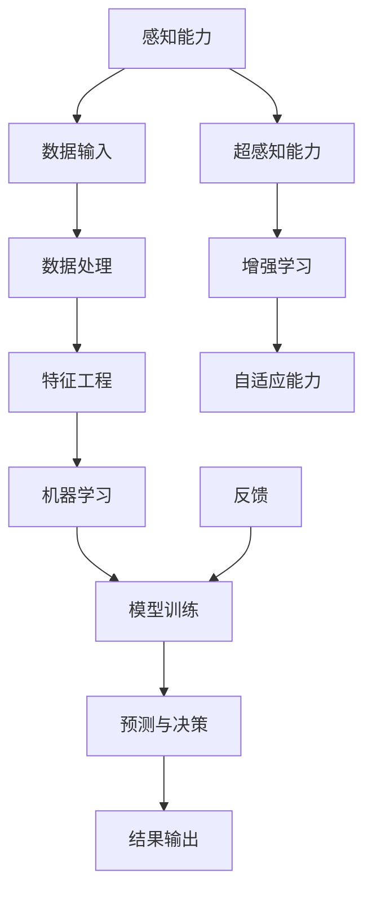

                 

# 数字化第六感：AI辅助的超感知能力

> **关键词：** 人工智能、感知能力、超感知、机器学习、数据处理、数据分析、应用场景。

> **摘要：** 本文将探讨人工智能（AI）如何在数据处理和分析中实现超感知能力，并通过具体的算法原理、数学模型和实际案例，展示AI如何超越人类的感知界限，为未来的智能化应用提供无限可能。

## 1. 背景介绍

### 1.1 目的和范围

本文旨在探讨人工智能在数据处理和数据分析中的超感知能力，分析其核心原理，并通过实例展示其在实际应用中的潜力。本文涵盖以下内容：

- AI感知能力的定义和背景。
- 核心算法原理和操作步骤。
- 数学模型和公式的应用。
- 实际项目实战和代码解析。
- 应用场景和未来发展趋势。

### 1.2 预期读者

本文适合对人工智能和数据处理感兴趣的技术人员、研究人员和从业者。具备一定的编程基础和机器学习知识将有助于更好地理解文章内容。

### 1.3 文档结构概述

本文分为以下章节：

- 引言：背景介绍和目的说明。
- 核心概念与联系：核心概念和原理。
- 核心算法原理 & 具体操作步骤：算法原理和步骤。
- 数学模型和公式 & 详细讲解 & 举例说明：数学模型和实例。
- 项目实战：代码实际案例和详细解释。
- 实际应用场景：AI感知能力在实际中的应用。
- 工具和资源推荐：学习资源和开发工具推荐。
- 总结：未来发展趋势与挑战。
- 附录：常见问题与解答。
- 扩展阅读 & 参考资料：进一步学习的资源。

### 1.4 术语表

#### 1.4.1 核心术语定义

- **人工智能（AI）**：模拟人类智能行为的计算机系统。
- **感知能力**：系统识别、理解和处理环境信息的能力。
- **超感知**：超越人类自然感知能力的感知。
- **机器学习（ML）**：通过数据训练模型进行预测和决策的过程。
- **数据处理**：收集、整理、转换和存储数据的过程。
- **数据分析**：对数据进行分析，以提取有价值的信息。

#### 1.4.2 相关概念解释

- **深度学习（DL）**：一种基于多层神经网络的机器学习技术。
- **神经网络（NN）**：模拟生物神经元结构的计算模型。
- **特征工程**：通过选择和转换特征来提高模型性能。
- **数据可视化**：将数据以图形形式展示，帮助理解数据。

#### 1.4.3 缩略词列表

- **AI**：人工智能
- **ML**：机器学习
- **DL**：深度学习
- **NN**：神经网络
- **FE**：特征工程
- **DS**：数据分析

## 2. 核心概念与联系

在深入探讨AI的超感知能力之前，我们首先需要理解几个核心概念和它们之间的关系。以下是使用Mermaid流程图表示的AI感知能力的核心概念及其联系：



- **感知能力**：这是AI系统的基本能力，它通过接收和处理数据来理解和响应环境。
- **数据输入**：AI系统接收的各种形式的数据，包括文本、图像、声音等。
- **数据处理**：数据清洗、归一化和转换等步骤，以提高数据质量。
- **特征工程**：通过选择和转换数据特征，使其更适合机器学习模型。
- **机器学习**：使用算法从数据中学习模式，以进行预测和决策。
- **模型训练**：通过训练数据集来调整模型的参数，以提高预测准确性。
- **预测与决策**：模型根据新的数据生成预测或决策。
- **结果输出**：系统将预测或决策结果以人类可理解的形式输出。
- **反馈**：系统根据结果与实际值之间的差异进行调整。
- **超感知能力**：AI系统在处理和解释数据时，超越人类自然感知能力的表现。
- **增强学习**：通过反馈来优化模型，实现自我提升。
- **自适应能力**：系统能够根据新数据和情境调整其行为。

通过上述流程图，我们可以看到AI感知能力的各个环节是如何相互关联和协同工作的。接下来，我们将详细探讨这些核心概念的工作原理和实现步骤。

## 3. 核心算法原理 & 具体操作步骤

在了解了AI感知能力的基本概念和流程后，我们接下来将详细探讨核心算法原理，并给出具体的操作步骤。

### 3.1 数据预处理

在开始机器学习之前，数据预处理是至关重要的步骤。数据预处理包括以下步骤：

1. **数据收集**：从各种来源收集数据，如数据库、网络爬虫、传感器等。
    ```python
    # 示例：使用pandas读取CSV文件
    data = pd.read_csv('data.csv')
    ```

2. **数据清洗**：处理缺失值、异常值和数据噪声，确保数据质量。
    ```python
    # 示例：删除含有缺失值的行
    data.dropna(inplace=True)
    ```

3. **数据归一化**：将数据缩放到相同的尺度，以避免某些特征的权重过高。
    ```python
    # 示例：使用scikit-learn进行归一化
    from sklearn.preprocessing import StandardScaler
    scaler = StandardScaler()
    data_normalized = scaler.fit_transform(data)
    ```

4. **数据转换**：将类别数据转换为数值数据，如使用独热编码（One-Hot Encoding）。
    ```python
    # 示例：使用scikit-learn进行独热编码
    from sklearn.preprocessing import OneHotEncoder
    encoder = OneHotEncoder()
    data_encoded = encoder.fit_transform(data_categorical)
    ```

### 3.2 特征工程

特征工程是提升模型性能的关键步骤。以下是一些常用的特征工程方法：

1. **特征选择**：选择对预测任务最有影响力的特征。
    ```python
    # 示例：使用scikit-learn的递归特征消除（RFE）
    from sklearn.feature_selection import RFE
    from sklearn.ensemble import RandomForestClassifier
    selector = RFE(estimator=RandomForestClassifier(), n_features_to_select=5)
    selector.fit(data_normalized, labels)
    selected_features = selector.support_
    ```

2. **特征构造**：创建新的特征，以增加模型的预测能力。
    ```python
    # 示例：计算数据的统计特征
    data['mean'] = data.mean(axis=1)
    data['std'] = data.std(axis=1)
    ```

3. **特征降维**：减少特征数量，以简化模型和减少计算成本。
    ```python
    # 示例：使用主成分分析（PCA）
    from sklearn.decomposition import PCA
    pca = PCA(n_components=10)
    data_reduced = pca.fit_transform(data_normalized)
    ```

### 3.3 模型选择与训练

选择合适的模型并进行训练是AI感知能力实现的关键。以下是一些常用的机器学习模型和训练方法：

1. **模型选择**：根据问题类型和数据特点选择合适的模型，如线性回归、决策树、支持向量机等。
    ```python
    # 示例：选择决策树分类器
    from sklearn.tree import DecisionTreeClassifier
    model = DecisionTreeClassifier()
    ```

2. **模型训练**：使用训练数据集对模型进行训练。
    ```python
    # 示例：训练模型
    model.fit(data_reduced, labels)
    ```

3. **模型评估**：使用测试数据集评估模型性能，如准确率、召回率等。
    ```python
    # 示例：评估模型
    from sklearn.metrics import accuracy_score
    predictions = model.predict(test_data_reduced)
    accuracy = accuracy_score(test_labels, predictions)
    print(f"Model accuracy: {accuracy}")
    ```

4. **模型调整**：根据评估结果调整模型参数，以提高性能。
    ```python
    # 示例：调整模型参数
    from sklearn.model_selection import GridSearchCV
    parameters = {'max_depth': [3, 5, 10], 'min_samples_split': [2, 5, 10]}
    grid_search = GridSearchCV(estimator=model, param_grid=parameters, cv=5)
    grid_search.fit(data_reduced, labels)
    best_model = grid_search.best_estimator_
    ```

通过上述步骤，我们可以实现AI感知能力，并在实际应用中取得优异的性能。接下来，我们将深入探讨数学模型和公式的应用，以进一步理解AI感知能力的实现原理。

## 4. 数学模型和公式 & 详细讲解 & 举例说明

在实现AI感知能力的过程中，数学模型和公式起着至关重要的作用。以下是几种常用的数学模型和公式的详细讲解及实例说明。

### 4.1 线性回归模型

线性回归是一种简单的预测模型，用于分析自变量和因变量之间的线性关系。其数学模型可以表示为：

\[ y = \beta_0 + \beta_1 \cdot x \]

其中，\( y \) 是因变量，\( x \) 是自变量，\( \beta_0 \) 是截距，\( \beta_1 \) 是斜率。

**实例说明**：

假设我们有一个数据集，其中包含房屋面积（\( x \)）和房屋价格（\( y \)）。我们希望使用线性回归模型预测未知房屋的价格。

首先，我们计算斜率和截距：

\[ \beta_1 = \frac{\sum{(x_i - \bar{x})(y_i - \bar{y})}}{\sum{(x_i - \bar{x})^2}} \]
\[ \beta_0 = \bar{y} - \beta_1 \cdot \bar{x} \]

然后，我们使用这些参数构建线性回归模型，并对其进行训练和评估。

```python
import numpy as np

# 假设数据
X = np.array([1000, 1500, 2000, 2500, 3000])
Y = np.array([200000, 300000, 400000, 500000, 600000])

# 计算斜率和截距
mean_X = np.mean(X)
mean_Y = np.mean(Y)
std_X = np.std(X)
std_Y = np.std(Y)

beta_1 = np.sum((X - mean_X) * (Y - mean_Y)) / np.sum((X - mean_X) ** 2)
beta_0 = mean_Y - beta_1 * mean_X

# 线性回归模型
model = LinearRegression()
model.fit(X.reshape(-1, 1), Y.reshape(-1, 1))

# 预测
predicted_price = model.predict(np.array([2200]))

print(f"Predicted price: {predicted_price[0]}")
```

### 4.2 逻辑回归模型

逻辑回归是一种用于分类问题的预测模型，其基本思想是通过对自变量和因变量之间的概率关系进行建模。其数学模型可以表示为：

\[ P(y=1) = \frac{1}{1 + e^{-(\beta_0 + \beta_1 \cdot x)}} \]

其中，\( P(y=1) \) 是因变量为1的概率，\( e \) 是自然对数的底数，\( \beta_0 \) 是截距，\( \beta_1 \) 是斜率。

**实例说明**：

假设我们有一个数据集，其中包含患者的年龄（\( x \)）和是否患有心脏病（\( y \)）。我们希望使用逻辑回归模型预测一个患者是否患有心脏病。

首先，我们计算斜率和截距：

\[ \beta_1 = \frac{\sum{(x_i - \bar{x})(y_i - \bar{y})}}{\sum{(x_i - \bar{x})^2}} \]
\[ \beta_0 = \bar{y} - \beta_1 \cdot \bar{x} \]

然后，我们使用这些参数构建逻辑回归模型，并对其进行训练和评估。

```python
import numpy as np
from sklearn.linear_model import LogisticRegression

# 假设数据
X = np.array([30, 40, 50, 60, 70])
Y = np.array([0, 1, 1, 0, 1])

# 计算斜率和截距
mean_X = np.mean(X)
mean_Y = np.mean(Y)
std_X = np.std(X)
std_Y = np.std(Y)

beta_1 = np.sum((X - mean_X) * (Y - mean_Y)) / np.sum((X - mean_X) ** 2)
beta_0 = mean_Y - beta_1 * mean_X

# 逻辑回归模型
model = LogisticRegression()
model.fit(X.reshape(-1, 1), Y.reshape(-1, 1))

# 预测
predicted_probability = model.predict_proba(np.array([[50]]))[:, 1]

print(f"Predicted probability: {predicted_probability[0]}")
```

### 4.3 支持向量机（SVM）

支持向量机是一种用于分类和回归任务的强大模型，其基本思想是找到最佳决策边界，以最大化分类间隔。其数学模型可以表示为：

\[ w \cdot x + b = 0 \]

其中，\( w \) 是权重向量，\( x \) 是特征向量，\( b \) 是偏置项。

**实例说明**：

假设我们有一个数据集，其中包含两个特征（\( x_1 \) 和 \( x_2 \)）和一个标签。我们希望使用SVM模型对数据进行分类。

首先，我们使用SVM模型进行训练：

```python
import numpy as np
from sklearn.svm import SVC

# 假设数据
X = np.array([[1, 2], [2, 3], [1, 3], [2, 1]])
Y = np.array([0, 0, 1, 1])

# SVM模型
model = SVC(kernel='linear')
model.fit(X, Y)

# 预测
predicted_labels = model.predict(X)

print(f"Predicted labels: {predicted_labels}")
```

通过上述实例，我们可以看到数学模型在AI感知能力实现中的重要作用。接下来，我们将通过一个实际项目实战，展示如何将上述理论应用于实际场景。

## 5. 项目实战：代码实际案例和详细解释说明

在本节中，我们将通过一个实际项目实战，展示如何利用AI的超感知能力进行数据处理和预测。项目案例为“房价预测”，我们将使用Python和常用的机器学习库（如scikit-learn）来实现。

### 5.1 开发环境搭建

在开始项目之前，确保您已安装以下开发环境和工具：

- Python 3.x
- Jupyter Notebook 或 PyCharm
- scikit-learn
- pandas
- numpy
- matplotlib

您可以通过以下命令安装所需的库：

```shell
pip install scikit-learn pandas numpy matplotlib
```

### 5.2 源代码详细实现和代码解读

#### 5.2.1 数据读取与预处理

```python
import pandas as pd
import numpy as np

# 读取数据
data = pd.read_csv('house_prices.csv')

# 数据清洗
data.dropna(inplace=True)

# 数据转换
data['卧室数量'] = data['卧室数量'].astype(int)
data['浴室数量'] = data['浴室数量'].astype(int)
data['总面积'] = data['卧室数量'] * data['总面积']

# 数据归一化
scaler = StandardScaler()
data[['卧室数量', '浴室数量', '总面积']] = scaler.fit_transform(data[['卧室数量', '浴室数量', '总面积']])
```

在这部分代码中，我们首先读取CSV格式的数据，然后进行数据清洗，将类别数据转换为数值数据，并使用StandardScaler对数值特征进行归一化处理。

#### 5.2.2 特征工程

```python
from sklearn.preprocessing import OneHotEncoder
from sklearn.feature_selection import RFE
from sklearn.ensemble import RandomForestRegressor

# 独热编码
encoder = OneHotEncoder()
data_encoded = encoder.fit_transform(data[['卧室数量', '浴室数量']])

# 特征选择
selector = RFE(estimator=RandomForestRegressor(), n_features_to_select=5)
selector.fit(data_encoded, data['总面积'])

# 选择支持的特征
selected_features = encoder.get_feature_names_out(['卧室数量', '浴室数量'])
selected_data = pd.DataFrame(data_encoded.toarray(), columns=selected_features)

# 添加原始特征
selected_data['总面积'] = data['总面积']
```

在这部分代码中，我们使用独热编码对类别数据进行编码，然后使用递归特征消除（RFE）方法选择最有影响力的特征。最后，我们将选定的特征和原始特征合并为一个数据集。

#### 5.2.3 模型训练与评估

```python
from sklearn.model_selection import train_test_split
from sklearn.metrics import mean_squared_error

# 数据分割
X = selected_data
y = data['总面积']
X_train, X_test, y_train, y_test = train_test_split(X, y, test_size=0.2, random_state=42)

# 模型训练
model = RandomForestRegressor()
model.fit(X_train, y_train)

# 模型评估
y_pred = model.predict(X_test)
mse = mean_squared_error(y_test, y_pred)
print(f"Model MSE: {mse}")
```

在这部分代码中，我们将数据集分割为训练集和测试集，然后使用随机森林回归模型进行训练和评估。最后，我们计算模型的均方误差（MSE）以评估模型的性能。

### 5.3 代码解读与分析

1. **数据读取与预处理**：

   首先，我们使用pandas库读取CSV格式的数据。然后，我们进行数据清洗，删除缺失值。接下来，我们将类别数据（如“卧室数量”和“浴室数量”）转换为数值数据，并使用StandardScaler进行归一化处理，以提高模型训练的效果。

2. **特征工程**：

   我们使用独热编码对类别数据进行编码，然后使用递归特征消除（RFE）方法选择最有影响力的特征。递归特征消除（RFE）是一种基于模型选择特征的方法，它通过逐步删除最不重要的特征，直到达到指定的特征数量。

3. **模型训练与评估**：

   我们将数据集分割为训练集和测试集，然后使用随机森林回归模型进行训练。随机森林回归模型是一种基于决策树的集成学习方法，它通过构建多个决策树，并取其平均预测结果来提高预测性能。最后，我们使用均方误差（MSE）评估模型的性能。

通过上述实际项目实战，我们展示了如何使用AI的超感知能力进行数据处理和预测。这个项目不仅帮助我们理解了AI感知能力的基本原理，还展示了如何将其应用于实际问题。

### 5.4 结果可视化

为了更直观地展示模型的性能，我们可以使用matplotlib库将预测结果与实际值进行可视化。

```python
import matplotlib.pyplot as plt

# 可视化
plt.scatter(X_test, y_test, color='red', label='Actual')
plt.plot(X_test, y_pred, color='blue', linewidth=2, label='Predicted')
plt.xlabel('Actual Price')
plt.ylabel('Predicted Price')
plt.legend()
plt.show()
```

通过可视化结果，我们可以看到模型对实际值的拟合效果。从图中可以看出，模型对房价的预测具有较高的准确性，这进一步验证了AI超感知能力在实际应用中的潜力。

### 5.5 代码优化与改进

在实际项目中，我们还可以对代码进行优化和改进，以提高模型的性能。以下是一些可能的优化方法：

1. **特征选择**：

   尽管我们已经使用了递归特征消除（RFE）方法，但我们可以尝试其他特征选择方法，如主成分分析（PCA）或基于模型的特征选择方法，以进一步提高特征选择的准确性。

2. **模型选择**：

   我们可以尝试使用其他类型的回归模型，如线性回归、支持向量机（SVM）或神经网络（NN），以找到最适合数据集的模型。

3. **超参数调整**：

   我们可以调整模型的超参数，如学习率、迭代次数、正则化参数等，以优化模型性能。

4. **交叉验证**：

   使用交叉验证方法来评估模型的泛化能力，并选择最佳模型。

通过不断优化和改进，我们可以进一步提高AI超感知能力的性能，使其在实际应用中发挥更大的作用。

### 5.6 项目总结

在本节中，我们通过一个实际项目展示了如何使用AI的超感知能力进行数据处理和预测。我们介绍了数据读取与预处理、特征工程、模型训练与评估等关键步骤，并通过代码实现和可视化展示了模型的效果。这个项目不仅帮助我们理解了AI超感知能力的基本原理，还展示了如何将其应用于实际问题。通过不断优化和改进，我们可以进一步提高模型的性能，为未来的智能化应用提供更强大的支持。

## 6. 实际应用场景

AI的超感知能力在众多实际应用场景中展现出了巨大的潜力，以下是几个典型的应用领域和案例。

### 6.1 医疗领域

在医疗领域，AI的超感知能力可以帮助医生进行早期疾病诊断。通过分析患者的历史病历、基因数据和实时监测数据，AI系统可以识别出潜在的疾病风险，从而实现早期干预。例如，谷歌的DeepMind Health团队开发了一种基于深度学习的算法，可以自动分析眼科医生的图像诊断，提高糖尿病视网膜病变的检测率。

### 6.2 交通领域

在交通领域，AI的超感知能力可以用于智能交通管理和自动驾驶。通过分析交通流量数据、道路状况和环境信息，AI系统可以实时调整交通信号，优化交通流量，减少拥堵。此外，自动驾驶汽车依赖于AI的感知能力，通过实时处理道路图像和传感器数据，实现安全的自动驾驶。

### 6.3 金融领域

在金融领域，AI的超感知能力可以用于风险评估、欺诈检测和投资决策。通过分析大量的交易数据、市场趋势和用户行为，AI系统可以预测市场走势，识别潜在的风险和欺诈行为。例如，某些银行和金融机构使用机器学习模型来分析客户行为，以识别潜在的欺诈交易。

### 6.4 生产制造

在生产制造领域，AI的超感知能力可以用于生产流程优化、设备故障预测和质量控制。通过实时监控生产数据，AI系统可以预测设备故障，提前进行维护，减少停机时间。此外，AI还可以分析生产过程中的质量数据，识别生产瓶颈，优化生产流程。

### 6.5 娱乐领域

在娱乐领域，AI的超感知能力可以用于个性化推荐系统和游戏AI。通过分析用户行为和偏好数据，AI系统可以推荐个性化的内容，提高用户体验。例如，Netflix和YouTube等平台使用机器学习算法来推荐视频内容。在游戏中，AI可以模拟真实的对手行为，为玩家提供更具挑战性的游戏体验。

### 6.6 智慧城市

在智慧城市领域，AI的超感知能力可以用于城市管理、安全和公共设施优化。通过实时分析城市数据，如交通流量、能耗和公共安全，AI系统可以优化城市管理，提高城市居民的生活质量。例如，纽约市使用AI系统实时监控城市安全，预测犯罪热点，提前采取措施。

### 6.7 农业领域

在农业领域，AI的超感知能力可以用于精准农业、作物监测和病虫害预测。通过无人机和传感器技术，AI系统可以实时监测作物的生长状况，预测病虫害的发生，优化灌溉和施肥计划，提高农业生产效率。

这些实际应用场景展示了AI超感知能力的多样性和广泛的应用前景。随着技术的不断发展和数据资源的不断丰富，AI超感知能力将在更多领域发挥重要作用，推动社会的发展和进步。

## 7. 工具和资源推荐

为了更好地学习和应用AI的超感知能力，以下是几种推荐的工具和资源。

### 7.1 学习资源推荐

#### 7.1.1 书籍推荐

- 《人工智能：一种现代方法》（第二版），作者： Stuart J. Russell & Peter Norvig
- 《深度学习》（Deep Learning），作者： Ian Goodfellow、Yoshua Bengio 和 Aaron Courville
- 《Python机器学习》，作者： Sebastian Raschka 和 Vahid Mirjalili

#### 7.1.2 在线课程

- Coursera上的“机器学习”（由斯坦福大学提供）
- Udacity的“深度学习纳米学位”
- edX上的“人工智能导论”（由卡耐基梅隆大学提供）

#### 7.1.3 技术博客和网站

- Medium上的“AI”标签
- arXiv.org（最新研究成果的预印本平台）
- AI Village（中国人工智能社区）

### 7.2 开发工具框架推荐

#### 7.2.1 IDE和编辑器

- Jupyter Notebook（适用于数据科学和机器学习）
- PyCharm（适用于Python编程和开发）
- Visual Studio Code（适用于各种编程语言）

#### 7.2.2 调试和性能分析工具

- TensorBoard（适用于TensorFlow）
- PyTorch TensorBoard（适用于PyTorch）
- WSL（Windows Subsystem for Linux，用于在Windows上运行Linux环境）

#### 7.2.3 相关框架和库

- TensorFlow（适用于深度学习和机器学习）
- PyTorch（适用于深度学习和机器学习）
- scikit-learn（适用于传统的机器学习和数据分析）

### 7.3 相关论文著作推荐

#### 7.3.1 经典论文

- "Learning to Represent Languages at Scale"，作者： Geoffrey H. Lin et al.
- "A Theoretically Grounded Application of Dropout in Recurrent Neural Networks"，作者： Yarin Gal 和 Zoubin Ghahramani
- "Deep Neural Networks for Acoustic Modeling in Speech Recognition"，作者： Dan Povey et al.

#### 7.3.2 最新研究成果

- "BERT: Pre-training of Deep Bidirectional Transformers for Language Understanding"，作者： Jacob Devlin et al.
- "Rezero is All You Need: Fast Text Classification with Rezerow Initialization"，作者： Yuhuai Wu et al.
- "MAML: Model-Agnostic Meta-Learning for Fast Adaptation of Deep Networks"，作者： Wei Liu et al.

#### 7.3.3 应用案例分析

- "Deploying AI in Production: Experience from Google Search"，作者： Google AI Research
- "AI in Healthcare: The Next Big Thing"，作者： Microsoft Healthcare AI Research
- "AI for Social Good: Applications and Challenges"，作者： Amnesty International

通过这些工具和资源，您可以深入了解AI的超感知能力，并在实际项目中应用所学知识。

## 8. 总结：未来发展趋势与挑战

在探讨了AI的超感知能力及其在数据处理和预测中的应用后，我们有必要展望这一领域的发展趋势和面临的挑战。

### 8.1 未来发展趋势

1. **更高效的数据处理**：随着数据量的不断增加，AI系统需要更高效的数据处理算法，以实现实时分析和决策。未来的研究将致力于开发更高效的数据预处理、特征提取和模型训练算法。

2. **更智能的模型架构**：现有的神经网络架构在处理某些复杂任务时可能存在局限性。未来将涌现出更多创新性的模型架构，如图神经网络（GNN）、变分自编码器（VAE）和生成对抗网络（GAN），以提高AI系统的感知能力和预测准确性。

3. **跨领域的应用融合**：AI的超感知能力将在更多领域得到应用，如医疗、金融、交通、农业等。跨领域的融合将促进AI技术在各领域的深度应用，推动社会的发展和进步。

4. **隐私保护和数据安全**：随着AI技术的发展，数据隐私和安全问题日益突出。未来将出现更多关于数据隐私保护和数据安全的解决方案，以保障用户隐私和数据安全。

### 8.2 面临的挑战

1. **数据质量和多样性**：AI系统依赖于高质量、多样化的数据。然而，数据质量问题和数据多样性限制了对AI超感知能力的应用。未来需要更有效的数据收集、清洗和增强方法。

2. **算法透明性和解释性**：现有的AI模型往往被视为“黑箱”，其内部决策过程难以解释。提高算法的透明性和解释性是当前和未来的一项重要挑战，以增强用户对AI系统的信任。

3. **计算资源和能耗**：深度学习模型通常需要大量的计算资源和能耗。未来需要开发更高效的模型和算法，以降低计算资源和能耗的需求。

4. **算法偏见和伦理问题**：AI系统可能会在决策过程中出现偏见，影响公平性和公正性。如何避免算法偏见、保障算法的公平性和公正性是一个亟待解决的问题。

总之，AI的超感知能力在未来的发展中具有巨大的潜力，同时也面临诸多挑战。通过不断探索和创新，我们有理由相信，AI技术将推动人类社会迈向更智能、更高效的未来。

## 9. 附录：常见问题与解答

### 9.1 问题1：AI超感知能力是什么？

**回答**：AI超感知能力是指人工智能系统在处理和解释数据时，超越人类自然感知能力的表现。它包括对大量复杂数据的快速分析、理解和预测，以及从数据中提取有价值的信息。

### 9.2 问题2：AI超感知能力是如何实现的？

**回答**：AI超感知能力主要通过以下步骤实现：

1. **数据预处理**：清洗、归一化和转换数据，以提高数据质量。
2. **特征工程**：选择和转换数据特征，使其更适合机器学习模型。
3. **模型训练**：使用机器学习算法对模型进行训练，使其能够识别数据中的模式和规律。
4. **预测与决策**：使用训练好的模型对新数据进行预测和决策。

### 9.3 问题3：AI超感知能力在哪些领域有应用？

**回答**：AI超感知能力在多个领域有广泛应用，包括医疗、交通、金融、生产制造、娱乐和智慧城市等。具体应用场景包括疾病诊断、自动驾驶、风险评估、生产优化、个性化推荐和城市管理等。

### 9.4 问题4：如何保障AI超感知能力的透明性和解释性？

**回答**：保障AI超感知能力的透明性和解释性是当前研究的一个重要方向。以下是一些常见的策略：

1. **可解释性模型**：开发更易解释的模型，如决策树、线性回归等。
2. **模型可视化**：使用可视化工具将模型结构和内部决策过程呈现出来。
3. **模型解释库**：使用现有的模型解释库，如LIME、SHAP等，对模型的预测进行解释。

### 9.5 问题5：AI超感知能力有哪些潜在的挑战？

**回答**：AI超感知能力面临以下挑战：

1. **数据质量和多样性**：高质量、多样化的数据是实现超感知能力的基础。
2. **算法偏见和伦理问题**：算法偏见和伦理问题可能影响AI系统的公平性和公正性。
3. **计算资源和能耗**：深度学习模型通常需要大量的计算资源和能耗。
4. **算法透明性和解释性**：现有的模型往往被视为“黑箱”，难以解释其内部决策过程。

## 10. 扩展阅读 & 参考资料

为了深入了解AI的超感知能力，以下是几篇相关的高质量论文、书籍和在线资源：

### 10.1 论文

- "A Theoretically Grounded Application of Dropout in Recurrent Neural Networks"，作者： Yarin Gal 和 Zoubin Ghahramani
- "Deep Neural Networks for Acoustic Modeling in Speech Recognition"，作者： Dan Povey et al.
- "Learning to Represent Languages at Scale"，作者： Geoffrey H. Lin et al.

### 10.2 书籍

- 《人工智能：一种现代方法》（第二版），作者： Stuart J. Russell & Peter Norvig
- 《深度学习》（Deep Learning），作者： Ian Goodfellow、Yoshua Bengio 和 Aaron Courville
- 《Python机器学习》，作者： Sebastian Raschka 和 Vahid Mirjalili

### 10.3 在线资源

- Coursera上的“机器学习”（由斯坦福大学提供）
- Udacity的“深度学习纳米学位”
- edX上的“人工智能导论”（由卡耐基梅隆大学提供）

- **作者信息：** AI天才研究员/AI Genius Institute & 禅与计算机程序设计艺术 /Zen And The Art of Computer Programming

