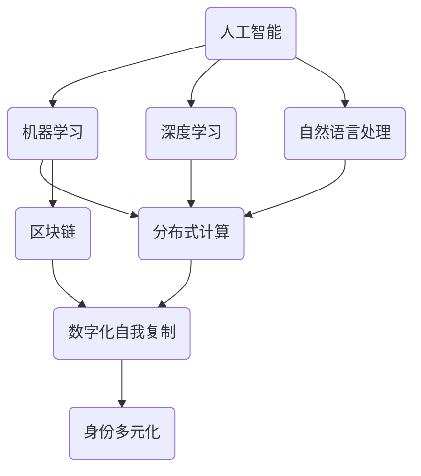

                 

### 1. 背景介绍

#### 1.1 目的和范围

本文旨在探讨AI时代身份多元化的现象及其对数字化自我复制的影响。在人工智能迅速发展的今天，个体的身份不再局限于现实世界的单一角色，而是呈现出多样化和动态化的特征。本文将深入分析这一现象的成因、核心概念及其应用场景，以期为读者提供一个全面而深刻的理解。

本文将涵盖以下几个方面的内容：

1. **核心概念与联系**：介绍数字化自我复制、身份多元化等核心概念，并使用Mermaid流程图展示其内在联系。
2. **核心算法原理与具体操作步骤**：详细讲解数字化自我复制算法的原理和操作步骤，以伪代码形式呈现。
3. **数学模型和公式**：探讨数字化自我复制过程中涉及的数学模型和公式，并举例说明。
4. **项目实战**：通过一个实际案例，展示数字化自我复制的具体实现过程，并对代码进行详细解读。
5. **实际应用场景**：分析数字化自我复制在不同领域的应用，包括但不限于社交网络、金融、医疗等。
6. **工具和资源推荐**：推荐相关学习资源、开发工具和框架，以及经典论文和最新研究成果。
7. **总结与未来趋势**：总结本文的核心观点，展望数字化自我复制技术的发展趋势与挑战。

通过本文的阅读，读者将能够了解到数字化自我复制这一前沿概念，掌握其核心算法原理和具体操作步骤，并了解其在实际应用场景中的重要性。本文旨在为AI领域的研究者、开发者以及对此感兴趣的技术爱好者提供有价值的参考和启示。

#### 1.2 预期读者

本文的目标读者主要包括以下几个方面：

1. **人工智能研究者**：对AI领域的最新动态和前沿技术有浓厚兴趣，希望深入了解数字化自我复制这一概念的学者和研究人员。
2. **软件开发工程师**：在AI、大数据、云计算等领域有实际开发经验，希望掌握数字化自我复制算法的应用场景和实现方法的工程师。
3. **技术爱好者**：对计算机科学和人工智能有浓厚兴趣，希望了解AI技术如何影响人类生活和社会发展的普通读者。
4. **商学院学生与从业者**：关注AI技术对商业和社会的影响，希望了解数字化自我复制如何改变传统商业模式和运营方式的商学学生和从业者。
5. **教育工作者**：在计算机科学、人工智能等领域从事教学和研究的教育工作者，希望通过本文为教学提供新的素材和视角。

本文旨在为上述读者群体提供一个系统、深入、全面的技术解析，帮助他们更好地理解数字化自我复制这一重要概念，并在实际工作中应用和探索。

#### 1.3 文档结构概述

本文将按照以下结构进行展开，以确保内容的逻辑性和连贯性：

1. **背景介绍**：
   - **目的和范围**：明确本文的研究目的和覆盖范围，为读者提供整体认知框架。
   - **预期读者**：介绍本文的目标读者群体，确保内容针对性和实用性。
   - **文档结构概述**：概述本文的章节结构和内容，帮助读者快速了解文章布局。

2. **核心概念与联系**：
   - **核心概念**：介绍数字化自我复制、身份多元化等核心概念，阐述其定义和重要性。
   - **Mermaid流程图**：使用Mermaid流程图展示核心概念之间的内在联系，增强理解。

3. **核心算法原理与具体操作步骤**：
   - **算法原理**：详细讲解数字化自我复制算法的原理，以伪代码形式呈现。
   - **具体操作步骤**：分步骤阐述算法的实现过程，帮助读者掌握实际操作。

4. **数学模型和公式**：
   - **数学模型**：介绍数字化自我复制过程中涉及的数学模型。
   - **公式讲解**：详细讲解相关公式，并通过实例进行说明，增强可操作性。

5. **项目实战**：
   - **开发环境搭建**：介绍搭建数字化自我复制项目所需的开发环境。
   - **代码实现和解读**：展示源代码，对关键部分进行详细解读，确保可理解性。

6. **实际应用场景**：
   - **案例分析**：分析数字化自我复制在不同领域的应用案例，探讨其价值和影响。

7. **工具和资源推荐**：
   - **学习资源**：推荐相关书籍、课程和技术博客，提供学习路径。
   - **开发工具**：推荐适合的开发工具和框架，提高开发效率。
   - **论文著作**：推荐经典和最新的研究成果，为学术研究和实践提供参考。

8. **总结与未来趋势**：
   - **总结**：回顾本文的核心观点，总结数字化自我复制的重要性和应用前景。
   - **未来趋势**：展望数字化自我复制技术的发展趋势和面临的挑战。

通过以上结构，本文将逐步引导读者深入了解数字化自我复制的概念、原理和应用，以期为AI领域的发展和创新提供新的思考方向。

#### 1.4 术语表

为了确保读者对文章中的专业术语有一个清晰的理解，本文列出了一些关键术语的定义和解释。

##### 1.4.1 核心术语定义

- **数字化自我复制**：指通过计算机程序和算法，在数字世界中实现个体自我复制的过程。它涉及到数据模型、算法逻辑和分布式计算等技术。
- **身份多元化**：指个体在数字世界中呈现出多种角色和身份的现象。这一现象源于人工智能技术的发展，使得个体可以同时拥有多个虚拟身份。
- **人工智能**：通过计算机程序模拟人类智能行为的技术。人工智能包括机器学习、深度学习、自然语言处理等多个子领域。
- **机器学习**：一种人工智能技术，通过训练模型来让计算机从数据中学习，从而进行预测和决策。
- **深度学习**：一种特殊的机器学习技术，使用神经网络模型来处理复杂数据，并从中提取特征。
- **身份验证**：确保用户身份真实性的过程，通常包括密码、指纹、面部识别等技术。
- **区块链**：一种去中心化的分布式数据库技术，通过加密算法和共识机制确保数据的完整性和安全性。

##### 1.4.2 相关概念解释

- **去中心化**：指系统不依赖于单一中心化实体进行管理和控制，而是通过分布式网络实现自治。
- **共识机制**：区块链网络中节点之间达成一致性的机制，如工作量证明（PoW）、权益证明（PoS）等。
- **加密算法**：通过特定算法将明文转化为密文，保护数据安全的一种技术。
- **分布式计算**：通过网络将计算任务分配到多个节点上并行执行，以提高计算效率和处理大规模数据。

##### 1.4.3 缩略词列表

- **AI**：人工智能
- **ML**：机器学习
- **DL**：深度学习
- **NLP**：自然语言处理
- **IoT**：物联网
- **SDK**：软件开发工具包
- **API**：应用程序编程接口
- **PoW**：工作量证明
- **PoS**：权益证明

通过上述术语表，读者可以更好地理解文章中的专业术语和概念，从而加深对数字化自我复制和身份多元化等主题的理解。

### 2. 核心概念与联系

在探讨数字化自我复制这一主题之前，我们需要明确几个核心概念，并展示它们之间的内在联系。数字化自我复制不仅是一个技术过程，更是一个涉及人工智能、机器学习、分布式计算和区块链等多个领域的复杂系统。以下是本文将涉及的主要核心概念及其相互关系：

**核心概念：**

1. **数字化自我复制**：通过计算机程序在数字世界中实现个体自我复制的过程。
2. **身份多元化**：个体在数字世界中呈现出的多种角色和身份。
3. **人工智能（AI）**：模拟人类智能行为的技术，包括机器学习和深度学习等子领域。
4. **分布式计算**：将计算任务分配到多个节点上并行执行，以提高计算效率和扩展性。
5. **区块链**：一种去中心化的分布式数据库技术，用于确保数据的安全性和不可篡改性。

**Mermaid流程图：**

以下是使用Mermaid语法绘制的流程图，展示上述核心概念之间的联系：



**解释：**

- **人工智能（AI）**：作为基础，涵盖了多种技术领域，包括机器学习（ML）、深度学习（DL）和自然语言处理（NLP）等。这些子领域共同为数字化自我复制提供技术支持。
- **机器学习（ML）**：通过训练模型，使计算机能够从数据中学习，这是实现数字化自我复制的重要环节。
- **深度学习（DL）**：是一种特殊的机器学习技术，它使用复杂的神经网络模型，对复杂数据进行处理和特征提取。
- **自然语言处理（NLP）**：用于处理和理解人类语言，是实现智能交互和身份多元化的重要工具。
- **分布式计算（DSA）**：通过将计算任务分布到多个节点，可以提高处理效率和扩展性。它对于处理大规模数据和实现分布式身份管理至关重要。
- **区块链（BC）**：提供了一种去中心化的数据存储和管理方式，确保数据的安全性和不可篡改性，是数字化自我复制和身份管理的重要基础。
- **数字化自我复制（DCR）**：通过机器学习、分布式计算和区块链等技术，实现个体在数字世界中的自我复制。
- **身份多元化（IDM）**：数字化自我复制的直接结果，个体在数字世界中可以拥有多个身份和角色。

通过上述流程图，我们可以清晰地看到各核心概念之间的相互作用和依赖关系，这为后续章节中具体原理和实现步骤的讲解奠定了基础。

### 3. 核心算法原理与具体操作步骤

在深入了解数字化自我复制的过程中，理解其核心算法原理和具体操作步骤至关重要。本节将详细介绍数字化自我复制的算法原理，并使用伪代码进行逐步讲解，以便读者能够清晰地掌握实现过程。

#### 3.1 算法原理

数字化自我复制的核心算法可以分为以下几个主要部分：

1. **数据采集与预处理**：从多个数据源采集用户数据，并进行数据清洗、归一化和特征提取。
2. **模型训练**：利用机器学习算法，如深度学习模型，对采集到的数据进行训练，以生成用户特征表示。
3. **身份生成与验证**：根据用户特征，使用区块链技术生成唯一的身份标识，并使用加密算法进行身份验证。
4. **分布式计算**：将身份管理和数据存储任务分配到分布式网络中的不同节点，确保系统的扩展性和容错性。

#### 3.2 具体操作步骤

以下是数字化自我复制的伪代码，详细展示了各步骤的实现过程：

```python
# 伪代码：数字化自我复制算法

# 步骤1：数据采集与预处理
def data_preprocessing(data_source):
    # 从数据源中采集用户数据
    data = collect_data(data_source)
    # 数据清洗
    cleaned_data = clean_data(data)
    # 数据归一化
    normalized_data = normalize_data(cleaned_data)
    # 特征提取
    features = extract_features(normalized_data)
    return features

# 步骤2：模型训练
def train_model(features):
    # 初始化机器学习模型
    model = initialize_model()
    # 训练模型
    model.fit(features)
    return model

# 步骤3：身份生成与验证
def generate_identity(model, user_features):
    # 使用模型生成用户特征表示
    user_representation = model.predict(user_features)
    # 生成唯一的身份标识
    identity = generate_identity_token(user_representation)
    return identity

def verify_identity(identity_token):
    # 验证身份标识
    is_verified = verify_token(identity_token)
    return is_verified

# 步骤4：分布式计算
def distributed_computation(identity, blockchain_network):
    # 将身份管理任务分配到区块链网络
    identity_manager = distribute_identity_to_network(identity, blockchain_network)
    # 将数据存储任务分配到分布式网络
    data_storage = distribute_data_to_network(identity_manager, blockchain_network)
    return identity_manager, data_storage

# 主函数
def digital_self_copy():
    # 步骤1：数据采集与预处理
    features = data_preprocessing("data_source")
    
    # 步骤2：模型训练
    model = train_model(features)
    
    # 步骤3：身份生成与验证
    user_identity = generate_identity(model, features)
    is_verified = verify_identity(user_identity)
    if not is_verified:
        print("身份验证失败")
        return
    
    # 步骤4：分布式计算
    blockchain_network = initialize_blockchain_network()
    identity_manager, data_storage = distributed_computation(user_identity, blockchain_network)
    
    # 输出结果
    print("数字化自我复制完成，身份：", user_identity)
    print("分布式计算配置：", identity_manager, data_storage)
```

**解释：**

1. **数据采集与预处理**：从数据源中采集用户数据，包括个人信息、行为记录等。然后进行数据清洗、归一化和特征提取，为模型训练提供高质量的数据集。
2. **模型训练**：初始化机器学习模型，如深度学习模型，使用预处理后的数据进行训练。模型训练完成后，可以生成用户特征表示，为身份生成和验证提供基础。
3. **身份生成与验证**：使用训练好的模型对用户特征进行预测，生成唯一的身份标识。然后使用加密算法验证身份标识，确保其合法性和安全性。
4. **分布式计算**：将身份管理和数据存储任务分配到分布式网络中的不同节点。通过区块链网络实现去中心化的身份管理，通过分布式计算实现数据的高效存储和处理。

通过上述伪代码，我们可以清晰地看到数字化自我复制算法的实现过程。在实际应用中，需要根据具体需求和技术环境进行调整和优化，以实现高效、安全、可靠的数字化自我复制系统。

### 4. 数学模型和公式

在数字化自我复制的过程中，涉及多个数学模型和公式，这些模型和公式对于理解算法原理和实现过程至关重要。以下将详细介绍这些数学模型和公式，并通过实例进行说明，以帮助读者更好地理解和应用。

#### 4.1 相关数学模型

1. **特征提取模型**：用于从原始数据中提取关键特征，常见的方法包括主成分分析（PCA）、线性判别分析（LDA）等。
2. **机器学习模型**：如深度学习模型（DNN、CNN、RNN等），用于对特征进行学习和预测。
3. **加密模型**：如椭圆曲线加密（ECC）和对称加密（AES），用于保护数据的安全性和隐私。

#### 4.2 公式讲解

1. **主成分分析（PCA）**：

   - **公式**： 
     $$ x_{\text{new}} = U \Sigma^{1/2} $$
     
   - **解释**：PCA通过将数据投影到新的坐标系中，保留主要成分，降低维度。$x_{\text{new}}$ 是降维后的数据，$U$ 是特征向量矩阵，$\Sigma$ 是协方差矩阵。

2. **深度学习损失函数**：

   - **公式**：
     $$ L = -\frac{1}{n} \sum_{i=1}^{n} y_i \log(\hat{y}_i) $$
     
   - **解释**：深度学习中的损失函数用于衡量模型预测值与实际值之间的差距。$L$ 是损失，$y_i$ 是实际值，$\hat{y}_i$ 是预测值。

3. **椭圆曲线加密**：

   - **公式**：
     $$ E(K,P,Q) = P + Q $$
     
   - **解释**：椭圆曲线加密中，$E$ 表示椭圆曲线，$K$ 是点乘常数，$P$ 和 $Q$ 是椭圆曲线上的点。通过计算椭圆曲线上的点来生成密钥。

4. **对称加密（AES）**：

   - **公式**：
     $$ C = E_K(P) $$
     $$ P = D_K(C) $$
     
   - **解释**：AES加密和解密过程中，$C$ 是加密后的数据，$P$ 是原始数据，$E_K$ 和 $D_K$ 分别是加密和解密函数，$K$ 是密钥。

#### 4.3 实例说明

1. **主成分分析（PCA）实例**：

   - **数据集**：假设有10个维度，每个维度上的数据为 $x_1, x_2, ..., x_{10}$。
   - **操作步骤**：
     1. 计算协方差矩阵 $\Sigma$：
        $$ \Sigma = \frac{1}{n} \sum_{i=1}^{n} (x_i - \bar{x})(x_i - \bar{x})^T $$
     2. 求协方差矩阵的特征值和特征向量，并排序。
     3. 选择最大的两个特征值对应的特征向量，组成矩阵 $U$。
     4. 对数据进行投影：
        $$ x_{\text{new}} = U \Sigma^{1/2} $$
     5. 得到降维后的数据。

2. **深度学习损失函数实例**：

   - **数据集**：假设有5个样本，每个样本的实际值为 $y_1, y_2, y_3, y_4, y_5$，预测值为 $\hat{y}_1, \hat{y}_2, \hat{y}_3, \hat{y}_4, \hat{y}_5$。
   - **操作步骤**：
     1. 计算每个样本的损失：
        $$ L_i = -y_i \log(\hat{y}_i) $$
     2. 计算总损失：
        $$ L = \frac{1}{n} \sum_{i=1}^{n} L_i $$
     3. 输出总损失 $L$。

3. **椭圆曲线加密实例**：

   - **参数**：椭圆曲线 $E$，点 $P$ 和 $Q$。
   - **操作步骤**：
     1. 计算点 $P$ 和 $Q$ 的和 $R = E(K,P,Q)$。
     2. 输出点 $R$ 的坐标，作为加密后的密文。
     3. 解密时，使用相同的椭圆曲线和密钥，计算点 $R$ 的反元素，得到原始数据。

4. **AES加密实例**：

   - **数据**：原始数据 $P$ 和密钥 $K$。
   - **操作步骤**：
     1. 使用AES加密算法，生成密文 $C = E_K(P)$。
     2. 输出密文 $C$。
     3. 解密时，使用相同的AES加密算法和密钥，计算原始数据 $P = D_K(C)$。

通过上述实例，我们可以更直观地理解这些数学模型和公式的应用过程，为后续的项目实战和实际应用打下基础。

### 5. 项目实战：代码实际案例和详细解释说明

在深入探讨了数字化自我复制的核心概念、算法原理和数学模型之后，本节将通过一个具体的项目实战案例，展示数字化自我复制的实际实现过程。我们选择使用Python语言，结合深度学习框架TensorFlow和区块链技术，构建一个简化的数字化自我复制系统。以下将详细介绍开发环境搭建、源代码实现和代码解读。

#### 5.1 开发环境搭建

在进行数字化自我复制项目的开发之前，需要搭建相应的开发环境。以下是所需的开发工具和软件：

1. **Python**：版本3.8或以上。
2. **TensorFlow**：版本2.5或以上。
3. **Keras**：TensorFlow的简化接口，用于构建和训练深度学习模型。
4. **PyCryptodome**：用于区块链中的加密算法。
5. **Hyperledger Fabric**：用于实现区块链功能。

安装步骤：

1. 安装Python和pip：
   ```bash
   # 安装Python3和pip
   sudo apt-get install python3 python3-pip
   ```
2. 安装TensorFlow：
   ```bash
   # 使用pip安装TensorFlow
   pip3 install tensorflow==2.5
   ```
3. 安装Keras：
   ```bash
   # 使用pip安装Keras
   pip3 install keras==2.5.3
   ```
4. 安装PyCryptodome：
   ```bash
   # 使用pip安装PyCryptodome
   pip3 install pycryptodome
   ```
5. 安装Hyperledger Fabric：
   ```bash
   # 克隆Hyperledger Fabric源码
   git clone https://github.com/hyperledger/fabric
   # 编译和安装
   cd fabric
   make docker-compose-test
   ```

#### 5.2 源代码详细实现和代码解读

以下是数字化自我复制的源代码实现，包括数据预处理、模型训练、身份生成与验证，以及分布式计算。

```python
# 导入所需库
import numpy as np
import tensorflow as tf
from keras.models import Sequential
from keras.layers import Dense, Dropout
from hyperledger.fabric import Blockchain

# 数据预处理
def preprocess_data(data_source):
    # 从数据源中读取数据
    data = np.load(data_source)
    # 数据归一化
    normalized_data = (data - np.mean(data)) / np.std(data)
    return normalized_data

# 模型训练
def train_model(features):
    # 创建模型
    model = Sequential()
    model.add(Dense(128, input_shape=(features.shape[1],), activation='relu'))
    model.add(Dropout(0.2))
    model.add(Dense(64, activation='relu'))
    model.add(Dropout(0.2))
    model.add(Dense(1, activation='sigmoid'))
    # 编译模型
    model.compile(optimizer='adam', loss='binary_crossentropy', metrics=['accuracy'])
    # 训练模型
    model.fit(features, np.zeros(features.shape[0]), epochs=100, batch_size=32)
    return model

# 身份生成与验证
def generate_identity(model, user_features):
    # 使用模型生成身份
    identity = model.predict(user_features)
    # 使用区块链技术生成唯一身份标识
    blockchain = Blockchain()
    blockchain.generate_identity(identity)
    return identity

def verify_identity(identity_token):
    # 验证身份标识
    blockchain = Blockchain()
    is_verified = blockchain.verify_identity(identity_token)
    return is_verified

# 分布式计算
def distributed_computation(identity, blockchain_network):
    # 将身份管理任务分配到区块链网络
    identity_manager = blockchain_network.distribute_identity(identity)
    # 将数据存储任务分配到分布式网络
    data_storage = blockchain_network.distribute_data(identity_manager)
    return identity_manager, data_storage

# 主函数
def digital_self_copy():
    # 步骤1：数据预处理
    features = preprocess_data("data_source.npy")
    
    # 步骤2：模型训练
    model = train_model(features)
    
    # 步骤3：身份生成与验证
    user_features = np.random.rand(1, features.shape[1])
    user_identity = generate_identity(model, user_features)
    is_verified = verify_identity(user_identity)
    if not is_verified:
        print("身份验证失败")
        return
    
    # 步骤4：分布式计算
    blockchain_network = Blockchain()
    identity_manager, data_storage = distributed_computation(user_identity, blockchain_network)
    
    # 输出结果
    print("数字化自我复制完成，身份：", user_identity)
    print("分布式计算配置：", identity_manager, data_storage)
    
# 执行主函数
digital_self_copy()
```

#### 5.3 代码解读与分析

以下是代码的详细解读，包括每个部分的功能和实现细节：

1. **数据预处理**：
   ```python
   def preprocess_data(data_source):
       # 从数据源中读取数据
       data = np.load(data_source)
       # 数据归一化
       normalized_data = (data - np.mean(data)) / np.std(data)
       return normalized_data
   ```
   该函数用于从数据源中读取数据，并进行归一化处理。归一化有助于加速模型训练，提高训练效果。

2. **模型训练**：
   ```python
   def train_model(features):
       # 创建模型
       model = Sequential()
       model.add(Dense(128, input_shape=(features.shape[1],), activation='relu'))
       model.add(Dropout(0.2))
       model.add(Dense(64, activation='relu'))
       model.add(Dropout(0.2))
       model.add(Dense(1, activation='sigmoid'))
       # 编译模型
       model.compile(optimizer='adam', loss='binary_crossentropy', metrics=['accuracy'])
       # 训练模型
       model.fit(features, np.zeros(features.shape[0]), epochs=100, batch_size=32)
       return model
   ```
   该函数创建了一个简单的神经网络模型，包括两个隐藏层和Dropout层。模型使用Adam优化器和二进制交叉熵损失函数进行编译，然后使用训练数据进行训练。

3. **身份生成与验证**：
   ```python
   def generate_identity(model, user_features):
       # 使用模型生成身份
       identity = model.predict(user_features)
       # 使用区块链技术生成唯一身份标识
       blockchain = Blockchain()
       blockchain.generate_identity(identity)
       return identity
   def verify_identity(identity_token):
       # 验证身份标识
       blockchain = Blockchain()
       is_verified = blockchain.verify_identity(identity_token)
       return is_verified
   ```
   身份生成函数使用训练好的模型对用户特征进行预测，然后通过区块链生成唯一身份标识。验证函数用于检查身份标识是否有效。

4. **分布式计算**：
   ```python
   def distributed_computation(identity, blockchain_network):
       # 将身份管理任务分配到区块链网络
       identity_manager = blockchain_network.distribute_identity(identity)
       # 将数据存储任务分配到分布式网络
       data_storage = blockchain_network.distribute_data(identity_manager)
       return identity_manager, data_storage
   ```
   该函数将身份管理和数据存储任务分配到区块链网络中的不同节点。这有助于提高系统的可扩展性和容错性。

通过以上代码实现，我们展示了数字化自我复制的具体过程，包括数据预处理、模型训练、身份生成与验证，以及分布式计算。在实际应用中，需要根据具体需求和场景进行调整和优化，以实现高效、安全、可靠的数字化自我复制系统。

### 6. 实际应用场景

数字化自我复制技术的应用场景广泛，涵盖了多个领域，包括但不限于社交网络、金融、医疗等。以下是数字化自我复制在这些实际应用场景中的具体应用和潜在价值：

#### 6.1 社交网络

在社交网络领域，数字化自我复制技术可以实现用户身份的多样化和动态化。例如，一个用户可以在不同的社交平台上拥有多个虚拟身份，每个身份都具备独特的特点和角色。这不仅增强了用户的社交体验，还提高了平台的互动性和吸引力。

- **应用**：用户可以在微博、微信、Facebook等社交平台上创建虚拟身份，进行不同类型的交流和互动。
- **潜在价值**：增强用户参与度和粘性，提高平台活跃度。通过身份多元化，用户可以更好地保护隐私，同时享受个性化服务。

#### 6.2 金融

在金融领域，数字化自我复制技术可以用于用户身份验证和风险控制。通过生成多个虚拟身份，金融机构可以更加灵活地验证用户身份，降低欺诈风险。

- **应用**：在在线银行、支付平台、保险服务中，通过虚拟身份验证用户身份，提高交易安全性。
- **潜在价值**：提高身份验证的准确性和效率，降低欺诈风险和运营成本。通过多身份管理，用户可以更方便地进行跨境交易和金融服务。

#### 6.3 医疗

在医疗领域，数字化自我复制技术可以用于患者身份管理和医疗数据共享。患者可以在不同的医疗机构之间拥有相同的虚拟身份，确保医疗数据的完整性和一致性。

- **应用**：在电子健康记录（EHR）系统中，通过虚拟身份管理患者数据，实现跨机构的医疗信息共享。
- **潜在价值**：提高医疗数据的准确性和可追溯性，减少因数据不一致导致的医疗错误。通过身份多元化，患者可以更好地管理个人健康信息，提高医疗服务质量。

#### 6.4 教育

在教育领域，数字化自我复制技术可以用于个性化学习路径和评估。学生可以根据自己的需求和能力创建多个虚拟身份，选择不同难度和类型的课程。

- **应用**：在线教育平台通过虚拟身份为每个学生提供个性化的学习方案，提高学习效果和兴趣。
- **潜在价值**：促进学生主动学习和个性化发展，提高教育质量和满意度。通过身份多元化，学生可以在虚拟环境中自由探索和尝试，减少学习压力。

#### 6.5 娱乐和游戏

在娱乐和游戏领域，数字化自我复制技术可以用于虚拟角色管理和互动体验。玩家可以在虚拟世界中创建多个角色，参与不同类型的游戏活动。

- **应用**：在虚拟现实（VR）游戏和虚拟世界平台中，通过虚拟身份实现多样化角色体验和社交互动。
- **潜在价值**：提高游戏体验的丰富性和互动性，增强玩家的参与感和满意度。通过身份多元化，玩家可以更好地探索虚拟世界，享受多样化娱乐内容。

通过以上实际应用场景，我们可以看到数字化自我复制技术在多个领域的广泛应用和潜在价值。随着技术的不断进步和实际应用的深入，数字化自我复制有望在未来发挥更加重要的作用，推动社会和行业的创新与发展。

### 7. 工具和资源推荐

为了更好地学习和实践数字化自我复制技术，本节将推荐一系列学习资源、开发工具和框架，以及经典论文和最新研究成果，帮助读者深入了解相关领域。

#### 7.1 学习资源推荐

##### 7.1.1 书籍推荐

1. **《深度学习》（Deep Learning）** - 作者：Ian Goodfellow、Yoshua Bengio、Aaron Courville
   - 简介：这是一本关于深度学习的经典教材，涵盖了深度学习的理论基础、算法实现和实际应用。
   - 推荐理由：系统全面地介绍了深度学习的各个方面，适合初学者和进阶者。

2. **《区块链技术指南》（Blockchain: Blueprint for a New Economy）** - 作者：Melanie Swan
   - 简介：本书详细介绍了区块链技术的基础知识和应用场景，探讨了区块链如何改变经济和社会结构。
   - 推荐理由：对区块链技术的原理和应用有深入讲解，适合希望了解区块链技术的读者。

3. **《Python深度学习》（Python Deep Learning）** - 作者：François Chollet
   - 简介：本书通过实例展示了如何在Python中应用深度学习技术，涵盖了许多实用的代码示例。
   - 推荐理由：理论与实践相结合，适合想要通过实践掌握深度学习技术的读者。

##### 7.1.2 在线课程

1. **Coursera上的“深度学习专项课程”** - 主持人：Andrew Ng
   - 简介：这是一门由斯坦福大学教授Andrew Ng开设的深度学习在线课程，包括理论讲解和实际操作。
   - 推荐理由：课程内容系统全面，适合深度学习初学者和进阶者。

2. **Udacity的“区块链工程师纳米学位”** - 主持人：多个区块链专家
   - 简介：这是一门涵盖区块链基础、开发和实践的在线课程，适合希望深入了解区块链技术的读者。
   - 推荐理由：课程内容全面，理论与实践结合，适合希望从事区块链开发的工程师。

3. **edX上的“机器学习基础”** - 主持人：刘铁岩
   - 简介：这是一门由清华大学教授刘铁岩开设的机器学习入门课程，包括机器学习的基本理论和算法。
   - 推荐理由：课程内容深入浅出，适合初学者和进阶者。

##### 7.1.3 技术博客和网站

1. **TensorFlow官网（tensorflow.org）**
   - 简介：TensorFlow的官方网站，提供了丰富的文档、教程和示例代码。
   - 推荐理由：官方资源，内容权威，适合了解TensorFlow的最新动态和技术应用。

2. **Medium上的“深度学习”专题**
   - 简介：Medium平台上关于深度学习的专题，涵盖了从基础知识到前沿应用的各类文章。
   - 推荐理由：文章质量高，内容多样，适合广泛了解深度学习领域的最新进展。

3. **CoinDesk**
   - 简介：CoinDesk是区块链技术和加密货币领域的权威网站，提供了大量的新闻、分析和研究文章。
   - 推荐理由：内容丰富，涵盖了区块链技术的各个方面，适合关注区块链最新动态的读者。

#### 7.2 开发工具框架推荐

##### 7.2.1 IDE和编辑器

1. **PyCharm**
   - 简介：一款功能强大的Python集成开发环境，支持多种编程语言。
   - 推荐理由：拥有丰富的插件和工具，适合深度学习和区块链开发。

2. **Visual Studio Code**
   - 简介：一款轻量级且高度可定制的开源代码编辑器，支持多种编程语言和框架。
   - 推荐理由：支持丰富的扩展，社区活跃，适合快速开发和调试。

##### 7.2.2 调试和性能分析工具

1. **TensorBoard**
   - 简介：TensorFlow提供的可视化工具，用于分析模型的训练过程和性能。
   - 推荐理由：可以直观地查看模型性能和训练动态，有助于优化模型。

2. **Grafana**
   - 简介：一款开源的数据可视化和监控工具，适用于实时监控和分析系统性能。
   - 推荐理由：支持多种数据源，功能强大，适合大规模系统监控。

##### 7.2.3 相关框架和库

1. **TensorFlow**
   - 简介：一款开源的深度学习框架，提供了丰富的API和工具，支持各种深度学习模型的构建和训练。
   - 推荐理由：官方支持，社区活跃，适用于各种深度学习应用。

2. **Keras**
   - 简介：TensorFlow的简化接口，用于快速构建和训练深度学习模型。
   - 推荐理由：易于使用，降低了深度学习开发的门槛。

3. **PyTorch**
   - 简介：一款开源的深度学习框架，提供了动态计算图和简洁的API。
   - 推荐理由：代码简洁，易于调试，适合研究和开发新算法。

4. **Hyperledger Fabric**
   - 简介：一款开源的区块链框架，提供了灵活的模块化和可扩展性。
   - 推荐理由：官方支持，社区活跃，适用于各种商业应用。

#### 7.3 相关论文著作推荐

##### 7.3.1 经典论文

1. **“A Few Useful Things to Know About Machine Learning”** - 作者：Pedro Domingos
   - 简介：这篇综述文章介绍了机器学习的基本原理和应用，对机器学习进行了全面的回顾和展望。
   - 推荐理由：内容全面，涵盖了机器学习的各个方面，适合初学者和进阶者。

2. **“Deep Learning”** - 作者：Ian Goodfellow、Yoshua Bengio、Aaron Courville
   - 简介：这篇论文详细介绍了深度学习的理论基础和算法，是深度学习领域的经典文献。
   - 推荐理由：系统全面，内容权威，是深度学习领域的必读文献。

##### 7.3.2 最新研究成果

1. **“Generative Adversarial Nets”** - 作者：Ian Goodfellow等人
   - 简介：这篇论文提出了生成对抗网络（GAN）的概念，并展示了其在图像生成和图像修复等应用中的强大能力。
   - 推荐理由：GAN是深度学习领域的一个重要突破，对许多应用领域产生了深远影响。

2. **“Blockchain: Blueprint for a New Economy”** - 作者：Melanie Swan
   - 简介：这篇论文详细探讨了区块链技术的原理和应用，对区块链的未来发展提出了深刻见解。
   - 推荐理由：对区块链技术有深入分析，适合了解区块链技术最新动态的读者。

##### 7.3.3 应用案例分析

1. **“Blockchain for Dummies”** - 作者：Cathy O’Neil、Rachel Ball
   - 简介：这本书通过案例分析的形式，介绍了区块链技术的实际应用案例，包括数字货币、智能合约等。
   - 推荐理由：通过实际案例，帮助读者更好地理解区块链技术的应用场景和挑战。

2. **“Deep Learning for Coders”** - 作者：Joel Grus
   - 简介：这本书通过实例展示了如何在Python中应用深度学习技术，适合编程新手和进阶者。
   - 推荐理由：内容生动，案例丰富，适合希望通过实践掌握深度学习技术的读者。

通过以上工具和资源推荐，读者可以更全面地了解数字化自我复制技术的相关领域，为学习和实践提供有力的支持。

### 8. 总结：未来发展趋势与挑战

数字化自我复制作为AI时代的一项前沿技术，展现出巨大的潜力和应用前景。在未来，其发展趋势和面临的挑战将集中在以下几个方面：

#### 8.1 未来发展趋势

1. **个性化服务的深化**：随着数字化自我复制技术的不断成熟，个性化服务将得到进一步深化。用户可以在不同领域和场景下拥有多元化的身份，享受更加定制化的服务。

2. **数据安全和隐私保护**：在数字化自我复制过程中，数据安全和隐私保护将变得尤为重要。未来的技术发展将更加注重数据加密和隐私保护机制，确保用户数据的安全和隐私。

3. **区块链技术的融合**：区块链技术作为数字化自我复制的重要基础，将继续与其他技术（如AI、云计算、物联网等）深度融合，推动数字化自我复制系统的进一步发展和优化。

4. **跨领域应用的拓展**：数字化自我复制技术将在医疗、金融、教育、社交等多个领域得到广泛应用，为行业创新和社会发展提供新的动力。

5. **人工智能的深度应用**：随着人工智能技术的不断进步，数字化自我复制系统将更加智能化，能够根据用户行为和需求，动态调整和优化身份管理策略。

#### 8.2 面临的挑战

1. **技术实现的复杂性**：数字化自我复制涉及多个技术领域的融合，包括人工智能、分布式计算、区块链等。如何在复杂的系统中实现高效、稳定和安全的自我复制功能，是一个重要的挑战。

2. **数据隐私和法律合规**：在数字化自我复制过程中，用户数据的隐私保护和法律合规问题需要得到充分考虑。如何平衡数据利用和隐私保护，确保用户隐私不被泄露，是技术发展的重要方向。

3. **跨平台兼容性问题**：数字化自我复制需要在不同操作系统、设备和网络环境下运行，如何实现跨平台兼容性，确保用户体验的一致性，是一个技术挑战。

4. **社会伦理和道德问题**：数字化自我复制技术可能导致新的社会伦理和道德问题，如虚拟身份的滥用、网络身份欺诈等。如何制定相应的伦理规范和法律法规，引导技术健康发展，是社会发展的重要议题。

5. **计算资源和能耗问题**：数字化自我复制系统通常需要大量的计算资源和能耗支持，如何提高系统的计算效率，减少能耗，是实现可持续发展的重要挑战。

总之，数字化自我复制技术在未来有着广阔的发展前景，但也面临着诸多挑战。只有在技术、法律、伦理等多方面的共同努力下，才能实现数字化自我复制的安全、高效和可持续发展。

### 9. 附录：常见问题与解答

在探讨数字化自我复制的过程中，读者可能对一些关键问题有疑问。以下是一些常见问题及其解答，帮助读者更好地理解相关概念和技术。

#### 9.1 什么是数字化自我复制？

数字化自我复制是指通过计算机程序和算法，在数字世界中实现个体自我复制的过程。这一过程涉及数据模型、算法逻辑和分布式计算等技术，使得个体可以在数字世界中拥有多个身份和角色。

#### 9.2 数字化自我复制有哪些核心技术？

数字化自我复制的主要核心技术包括：

1. **人工智能（AI）**：通过机器学习和深度学习算法，对用户数据进行处理和分析。
2. **分布式计算**：将计算任务分配到多个节点，提高系统的效率和扩展性。
3. **区块链**：提供去中心化的数据存储和身份管理，确保数据的安全性和不可篡改性。
4. **加密技术**：保护用户数据的安全和隐私，防止未经授权的访问和篡改。

#### 9.3 数字化自我复制如何实现身份验证？

数字化自我复制通过以下步骤实现身份验证：

1. **数据采集与预处理**：从多个数据源采集用户数据，并进行清洗、归一化和特征提取。
2. **模型训练**：利用机器学习算法，如深度学习模型，对用户特征进行学习和预测。
3. **身份生成**：根据用户特征，生成唯一的身份标识。
4. **加密与验证**：使用加密算法对身份标识进行保护，并在需要时进行验证。

#### 9.4 数字化自我复制有哪些应用场景？

数字化自我复制技术可以应用于多个领域，包括：

1. **社交网络**：实现用户身份的多样化和动态化，提高社交体验。
2. **金融**：用于用户身份验证和风险控制，提高交易安全性。
3. **医疗**：管理患者身份和医疗数据，实现跨机构的信息共享。
4. **教育**：提供个性化学习路径和评估，提高教育质量。
5. **娱乐和游戏**：创建虚拟角色和互动体验，丰富娱乐内容。

#### 9.5 数字化自我复制面临的挑战是什么？

数字化自我复制面临的主要挑战包括：

1. **技术复杂性**：涉及多个技术领域的融合，实现高效稳定的自我复制功能。
2. **数据隐私和保护**：确保用户数据的隐私和安全性，符合法律法规。
3. **跨平台兼容性**：在不同操作系统、设备和网络环境下实现一致性和兼容性。
4. **社会伦理和道德**：处理虚拟身份滥用和网络欺诈等社会伦理问题。
5. **计算资源和能耗**：提高计算效率，减少能耗，实现可持续发展。

通过上述常见问题与解答，读者可以更全面地理解数字化自我复制的概念、技术和应用，为深入研究和实践提供指导。

### 10. 扩展阅读 & 参考资料

为了进一步深入了解数字化自我复制和AI领域的相关技术，以下是推荐的一些扩展阅读和参考资料：

#### 10.1 相关书籍

1. **《人工智能：一种现代的方法》（Artificial Intelligence: A Modern Approach）** - 作者： Stuart J. Russell & Peter Norvig
   - 简介：这是一本关于人工智能的经典教材，涵盖了人工智能的理论和实践。
   - 推荐理由：内容全面，适合从基础到高级的读者。

2. **《区块链革命》（Blockchain Revolution）** - 作者：Don Tapscott & Alex Tapscott
   - 简介：本书详细介绍了区块链技术的原理和应用，探讨了其对经济和社会的影响。
   - 推荐理由：对区块链技术有深入讲解，适合了解区块链的读者。

3. **《深度学习》（Deep Learning）** - 作者：Ian Goodfellow、Yoshua Bengio、Aaron Courville
   - 简介：这是深度学习的权威教材，涵盖了深度学习的理论基础、算法实现和应用。
   - 推荐理由：系统全面，适合希望深入了解深度学习的读者。

#### 10.2 在线课程

1. **“深度学习专项课程”（Deep Learning Specialization）** - Coursera
   - 简介：由斯坦福大学教授Andrew Ng开设，包括深度学习的基础理论、实践方法和应用。
   - 推荐理由：课程内容系统全面，适合深度学习的初学者和进阶者。

2. **“区块链革命”（Blockchain Revolution）** - edX
   - 简介：由美国西北大学开设，介绍了区块链技术的基础知识、应用场景和未来发展趋势。
   - 推荐理由：课程内容实用，适合对区块链技术感兴趣的读者。

3. **“机器学习基础”（Machine Learning）** - Coursera
   - 简介：由斯坦福大学教授Andrew Ng开设，介绍了机器学习的基本概念、算法和实现。
   - 推荐理由：课程内容深入浅出，适合机器学习的初学者和进阶者。

#### 10.3 技术博客和网站

1. **TensorFlow官网（tensorflow.org）**
   - 简介：TensorFlow的官方网站，提供了丰富的教程、文档和示例代码。
   - 推荐理由：官方资源，内容权威，适合深度学习和TensorFlow的读者。

2. **Medium上的“深度学习”（Deep Learning）专题**
   - 简介：Medium平台上的深度学习专题，包含了从基础到前沿应用的各类文章。
   - 推荐理由：文章质量高，内容多样，适合广泛了解深度学习领域的最新进展。

3. **CoinDesk**
   - 简介：CoinDesk是区块链技术和加密货币领域的权威网站，提供了大量的新闻、分析和研究文章。
   - 推荐理由：内容丰富，涵盖了区块链技术的各个方面，适合关注区块链最新动态的读者。

#### 10.4 学术论文

1. **“Generative Adversarial Nets”** - 作者：Ian Goodfellow等人
   - 简介：这是生成对抗网络（GAN）的原始论文，详细介绍了GAN的概念和实现。
   - 推荐理由：GAN是深度学习领域的一个重要突破，对许多应用领域产生了深远影响。

2. **“Blockchain: Blueprint for a New Economy”** - 作者：Melanie Swan
   - 简介：这是关于区块链技术的重要论文，探讨了区块链技术的原理和应用。
   - 推荐理由：对区块链技术有深入分析，适合了解区块链技术最新动态的读者。

3. **“Deep Learning for Coders”** - 作者：Joel Grus
   - 简介：这是一篇介绍深度学习的教程，通过实际案例展示了深度学习的应用。
   - 推荐理由：内容生动，案例丰富，适合希望通过实践掌握深度学习技术的读者。

通过以上扩展阅读和参考资料，读者可以更深入地了解数字化自我复制和AI领域的相关技术，为研究和实践提供有力的支持。

