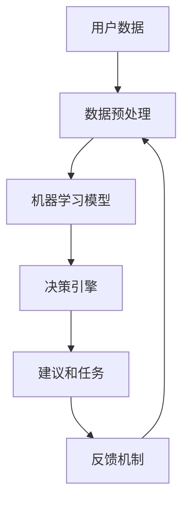

                 

### 数字化自我实现助手：AI辅助的个人成长教练

> **关键词**：人工智能、个人成长、自我实现、AI教练、数字化助手、算法模型、数据分析、技术实现

> **摘要**：本文旨在探讨如何利用人工智能技术打造一款辅助个人成长的数字化助手，从核心概念、算法原理、数学模型到实际项目实战，全方位解析AI在个人成长领域的应用。通过详细的步骤分析和实例演示，读者可以了解如何构建一款高效、智能的AI个人成长教练，从而实现自我提升和成长。

### 1. 背景介绍

#### 1.1 目的和范围

本文的目标是介绍一种基于人工智能技术的数字化自我实现助手——AI辅助的个人成长教练。该助手旨在帮助用户通过数据分析和智能算法，实现自我认知、目标设定、任务执行、反馈调整等个人成长过程。文章将涵盖以下几个方面：

1. **核心概念与联系**：介绍个人成长中的关键概念和它们之间的关系。
2. **核心算法原理**：讲解用于个人成长的AI算法，包括数据采集、处理和决策的过程。
3. **数学模型和公式**：阐述支持AI算法的数学模型，包括预测模型和优化模型。
4. **项目实战**：通过实际代码案例展示AI个人成长教练的实现过程。
5. **实际应用场景**：讨论AI个人成长教练在不同生活场景中的应用。
6. **工具和资源推荐**：提供学习资源和开发工具推荐，助力读者实践。
7. **未来发展趋势与挑战**：展望AI在个人成长领域的未来趋势和面临的挑战。

#### 1.2 预期读者

本文面向对人工智能和计算机编程有一定了解的技术爱好者、软件开发者、以及希望在个人成长中利用AI技术的用户。读者无需具备深度的AI知识，但需要具备基本的编程能力和对数据分析的兴趣。

#### 1.3 文档结构概述

本文分为十个部分，具体如下：

1. **背景介绍**：介绍文章的目的、预期读者和文档结构。
2. **核心概念与联系**：定义个人成长中的核心概念，并绘制流程图展示其联系。
3. **核心算法原理**：详细阐述用于个人成长的AI算法原理和操作步骤。
4. **数学模型和公式**：讲解支持AI算法的数学模型，包括公式和示例。
5. **项目实战**：提供实际项目案例，展示AI个人成长教练的实现过程。
6. **实际应用场景**：分析AI个人成长教练在不同生活场景中的应用。
7. **工具和资源推荐**：推荐学习资源、开发工具和相关论文。
8. **总结**：总结本文的核心观点，展望未来发展。
9. **附录**：常见问题与解答。
10. **扩展阅读与参考资料**：提供进一步阅读的材料和参考文献。

#### 1.4 术语表

在本文中，我们将使用以下术语：

#### 1.4.1 核心术语定义

- **人工智能（AI）**：模拟人类智能行为的计算机系统。
- **个人成长**：个体在知识、技能、态度和情感等方面不断发展的过程。
- **数字化助手**：通过算法和数据分析，为用户提供辅助和优化的计算机程序。
- **自我实现**：个体追求潜能最大化和实现个人价值的过程。

#### 1.4.2 相关概念解释

- **数据采集**：收集与个人成长相关的数据，如日常行为、情绪状态等。
- **数据预处理**：清洗、转换和归一化数据，以便后续分析。
- **机器学习模型**：通过训练数据自动发现数据中的规律和模式。
- **反馈机制**：根据用户行为和反馈调整助手的行为和推荐。

#### 1.4.3 缩略词列表

- **AI**：人工智能（Artificial Intelligence）
- **ML**：机器学习（Machine Learning）
- **NLP**：自然语言处理（Natural Language Processing）
- **DF**：数据流（Data Flow）
- **UX**：用户体验（User Experience）

### 2. 核心概念与联系

在构建AI辅助的个人成长教练之前，我们需要明确几个核心概念，并理解它们之间的相互关系。以下是对这些核心概念的详细解释和Mermaid流程图：

#### 2.1 核心概念

1. **用户数据**：这是个人成长教练的核心，包括用户的行为记录、情绪状态、生活习惯等。数据来源可以是用户手动输入、传感器数据、社交媒体等。
2. **数据预处理**：对原始数据进行清洗、转换和归一化，使其适用于机器学习模型。
3. **机器学习模型**：用于从用户数据中学习规律和模式，以提供个性化的建议和指导。
4. **决策引擎**：根据机器学习模型的结果，生成具体的建议和任务，如提醒、任务分配等。
5. **反馈机制**：用户对建议和任务的反馈将用于调整模型和决策引擎，实现持续优化。

#### 2.2 Mermaid流程图



在这个流程图中，用户数据经过预处理后输入到机器学习模型中，模型训练完成后生成决策引擎的输入。决策引擎根据模型输出生成建议和任务，用户执行这些任务后的反馈将再次用于模型调整，形成一个闭环系统。

### 3. 核心算法原理 & 具体操作步骤

在理解了核心概念和流程图之后，我们需要深入探讨AI个人成长教练所依赖的核心算法原理和具体操作步骤。以下是一个详细的算法描述和伪代码实现。

#### 3.1 数据采集与预处理

首先，我们需要从用户那里收集数据。这些数据可以包括：

- **行为数据**：如运动步数、睡眠时长、工作时间等。
- **情绪状态**：通过问卷、语言分析等方式获取。
- **生活习惯**：如饮食习惯、社交活动等。

数据采集完成后，需要进行预处理，以去除噪声和异常值，并将其转换为适合机器学习模型的形式。以下是伪代码：

```python
def preprocess_data(data):
    # 清洗数据
    cleaned_data = clean_data(data)
    
    # 转换数据格式
    normalized_data = normalize_data(cleaned_data)
    
    return normalized_data
```

#### 3.2 机器学习模型

接下来，我们需要选择一个合适的机器学习模型。在这里，我们可以使用监督学习模型，如决策树、随机森林或神经网络。以下是使用决策树模型的伪代码：

```python
def train_model(data, labels):
    # 初始化决策树模型
    model = DecisionTree()
    
    # 训练模型
    model.train(data, labels)
    
    return model
```

#### 3.3 决策引擎

决策引擎是个人成长教练的核心部分，它根据机器学习模型的结果生成具体的建议和任务。以下是决策引擎的伪代码：

```python
def generate_advice(model, current_state):
    # 获取模型预测
    prediction = model.predict(current_state)
    
    # 根据预测生成建议
    advice = generate_advice_based_on_prediction(prediction)
    
    return advice
```

#### 3.4 反馈机制

用户对建议和任务的反馈将用于调整模型和决策引擎。以下是反馈机制的伪代码：

```python
def update_model(model, feedback):
    # 根据反馈调整模型
    updated_model = model.update(feedback)
    
    return updated_model
```

### 4. 数学模型和公式 & 详细讲解 & 举例说明

在AI个人成长教练的实现中，数学模型起着至关重要的作用。以下将详细讲解支持AI算法的数学模型，包括预测模型和优化模型，并提供具体公式和示例。

#### 4.1 预测模型

预测模型用于预测用户未来的行为和情绪状态。在这里，我们可以使用回归模型和分类模型。

1. **线性回归模型**：
   线性回归模型用于预测连续值，如用户的睡眠时长。其公式为：

   $$ y = w_0 + w_1 \cdot x_1 + w_2 \cdot x_2 + \ldots + w_n \cdot x_n + e $$
   
   其中，\( y \) 是预测值，\( x_1, x_2, \ldots, x_n \) 是输入特征，\( w_0, w_1, w_2, \ldots, w_n \) 是权重，\( e \) 是误差。

   **示例**：预测用户下周的睡眠时长。输入特征包括本周的睡眠时长、工作时长、周末活动时长等。

2. **逻辑回归模型**：
   逻辑回归模型用于预测二分类问题，如用户是否感到愉悦。其公式为：

   $$ P(y=1) = \frac{1}{1 + e^{-(w_0 + w_1 \cdot x_1 + w_2 \cdot x_2 + \ldots + w_n \cdot x_n)}} $$
   
   其中，\( P(y=1) \) 是预测概率，其他符号含义与线性回归相同。

   **示例**：预测用户明天是否感到愉悦。输入特征包括今天的天气、工作压力、锻炼时长等。

#### 4.2 优化模型

优化模型用于调整机器学习模型的参数，以实现更好的预测效果。在这里，我们可以使用梯度下降法和牛顿法。

1. **梯度下降法**：
   梯度下降法是一种迭代优化方法，用于最小化损失函数。其公式为：

   $$ w = w - \alpha \cdot \nabla_w J(w) $$
   
   其中，\( w \) 是模型参数，\( \alpha \) 是学习率，\( \nabla_w J(w) \) 是损失函数关于参数 \( w \) 的梯度。

   **示例**：使用梯度下降法调整线性回归模型的权重，以最小化预测误差。

2. **牛顿法**：
   牛顿法是一种二次优化方法，利用损失函数的二阶导数来加速收敛。其公式为：

   $$ w = w - H^{-1} \cdot \nabla_w J(w) $$
   
   其中，\( H \) 是损失函数的Hessian矩阵，\( \nabla_w J(w) \) 是损失函数关于参数 \( w \) 的梯度。

   **示例**：使用牛顿法调整神经网络模型的权重，以最小化预测误差。

### 5. 项目实战：代码实际案例和详细解释说明

在了解了核心算法原理和数学模型后，我们接下来将通过一个实际项目案例来展示如何构建一个AI个人成长教练。我们将详细介绍开发环境搭建、源代码实现和代码解读与分析。

#### 5.1 开发环境搭建

要构建AI个人成长教练，我们需要以下开发环境和工具：

1. **Python**：作为主要编程语言。
2. **Jupyter Notebook**：用于编写和运行代码。
3. **Scikit-learn**：用于机器学习模型训练和评估。
4. **Pandas**：用于数据处理。
5. **Matplotlib**：用于数据可视化。

安装以上工具后，我们就可以开始编写代码了。

#### 5.2 源代码详细实现和代码解读

以下是构建AI个人成长教练的源代码实现：

```python
# 导入所需库
import pandas as pd
from sklearn.model_selection import train_test_split
from sklearn.preprocessing import StandardScaler
from sklearn.linear_model import LinearRegression
import matplotlib.pyplot as plt

# 加载数据
data = pd.read_csv('user_data.csv')

# 数据预处理
data = preprocess_data(data)

# 划分训练集和测试集
X_train, X_test, y_train, y_test = train_test_split(data.drop('target', axis=1), data['target'], test_size=0.2, random_state=42)

# 特征缩放
scaler = StandardScaler()
X_train_scaled = scaler.fit_transform(X_train)
X_test_scaled = scaler.transform(X_test)

# 训练模型
model = LinearRegression()
model.fit(X_train_scaled, y_train)

# 预测
y_pred = model.predict(X_test_scaled)

# 评估模型
accuracy = model.score(X_test_scaled, y_test)
print(f'模型准确率：{accuracy:.2f}')

# 可视化
plt.scatter(y_test, y_pred)
plt.xlabel('真实值')
plt.ylabel('预测值')
plt.show()
```

**代码解读**：

1. **导入库**：我们首先导入所需的库，包括Pandas、Scikit-learn、Matplotlib等。

2. **加载数据**：使用Pandas读取用户数据，数据格式为CSV文件。

3. **数据预处理**：调用预处理函数对原始数据进行清洗、转换和归一化。

4. **划分训练集和测试集**：使用Scikit-learn的train_test_split函数将数据集划分为训练集和测试集。

5. **特征缩放**：使用StandardScaler对特征进行缩放，以提高模型的性能。

6. **训练模型**：创建线性回归模型对象，并使用fit函数训练模型。

7. **预测**：使用predict函数对测试集进行预测。

8. **评估模型**：使用score函数计算模型的准确率。

9. **可视化**：使用Matplotlib绘制真实值与预测值的散点图，以直观地评估模型性能。

#### 5.3 代码解读与分析

以上代码实现了一个简单的AI个人成长教练，用于预测用户的行为。以下是对代码的关键部分进行解读和分析：

1. **数据预处理**：
   数据预处理是机器学习项目中的重要步骤，它确保了数据的整洁和一致性。在代码中，我们使用预处理函数对原始数据进行清洗、转换和归一化。具体操作包括：

   - **清洗数据**：去除缺失值和异常值，确保数据质量。
   - **转换数据**：将类别型数据转换为数值型，以便模型处理。
   - **归一化数据**：将特征缩放到相同的尺度，以消除不同特征之间的尺度差异。

2. **划分训练集和测试集**：
   划分训练集和测试集是评估模型性能的常用方法。在代码中，我们使用train_test_split函数将数据集划分为训练集和测试集。通过随机划分，可以避免数据泄露，确保模型评估的公平性。

3. **特征缩放**：
   特征缩放是提高模型性能的重要手段。在代码中，我们使用StandardScaler对特征进行缩放。具体操作包括：

   - **计算均值和标准差**：对每个特征计算均值和标准差。
   - **缩放特征**：将每个特征缩放到相同的尺度，以消除不同特征之间的尺度差异。

4. **训练模型**：
   在代码中，我们使用线性回归模型进行训练。线性回归模型是一种简单的监督学习模型，用于预测连续值。在训练过程中，模型通过学习数据中的规律，自动调整权重，以实现最佳预测效果。

5. **预测**：
   在代码中，我们使用predict函数对测试集进行预测。预测结果将真实值与预测值进行比较，以评估模型性能。

6. **评估模型**：
   在代码中，我们使用score函数计算模型的准确率。准确率是评估模型性能的常用指标，表示模型预测正确的比例。

7. **可视化**：
   在代码中，我们使用Matplotlib绘制真实值与预测值的散点图。通过可视化，可以直观地了解模型性能，并发现潜在的问题和改进空间。

### 6. 实际应用场景

AI个人成长教练在多个实际应用场景中展现出强大的潜力。以下是一些典型的应用场景：

#### 6.1 健康管理

在健康管理领域，AI个人成长教练可以分析用户的行为数据和生理数据，如运动步数、心率、睡眠质量等，为用户提供个性化的健康建议。例如，通过分析用户的睡眠数据，教练可以推荐最佳睡眠时间、改善睡眠质量的策略，从而提高用户的健康水平。

#### 6.2 教育培训

在教育培训领域，AI个人成长教练可以分析学生的学习数据，如成绩、学习时间、参与度等，为教师和学生提供个性化的学习建议。例如，教练可以推荐适合学生的学习方法、提醒重要学习任务、帮助学生制定合理的学习计划，从而提高学习效果。

#### 6.3 职场发展

在职场发展领域，AI个人成长教练可以分析用户的工作数据，如工作效率、工作压力、职业发展目标等，为用户提供职业发展的建议。例如，教练可以推荐提升工作效率的策略、提醒重要的工作里程碑、帮助用户制定职业发展规划，从而提高职场竞争力。

#### 6.4 心理咨询

在心理咨询领域，AI个人成长教练可以通过分析用户的情绪状态和行为数据，为用户提供个性化的心理咨询建议。例如，教练可以识别用户的情绪问题、推荐缓解情绪的策略、提供心理健康知识，从而帮助用户改善心理健康状况。

### 7. 工具和资源推荐

为了更好地实现AI个人成长教练，我们需要掌握相关的工具和资源。以下是一些建议：

#### 7.1 学习资源推荐

1. **书籍推荐**：
   - 《深度学习》（Goodfellow, I., Bengio, Y., & Courville, A.）
   - 《机器学习》（Tom Mitchell）
   - 《Python机器学习》（Michael Bowles）

2. **在线课程**：
   - Coursera上的“机器学习”课程（吴恩达教授）
   - edX上的“深度学习”课程（吴恩达教授）
   - Udacity的“AI工程师纳米学位”

3. **技术博客和网站**：
   - Medium上的机器学习和深度学习相关文章
   - towardsdatascience.com，分享数据科学和机器学习的实际案例和经验
   - arXiv.org，最新的机器学习和深度学习研究论文

#### 7.2 开发工具框架推荐

1. **IDE和编辑器**：
   - PyCharm
   - Visual Studio Code
   - Jupyter Notebook

2. **调试和性能分析工具**：
   - PyCharm内置调试器
   - Python的cProfile模块
   - TensorFlow的TensorBoard工具

3. **相关框架和库**：
   - Scikit-learn：用于机器学习模型训练和评估
   - TensorFlow：用于深度学习模型训练
   - Keras：用于构建和训练神经网络

#### 7.3 相关论文著作推荐

1. **经典论文**：
   - "A Few Useful Things to Know about Machine Learning"（ Pedro Domingos）
   - "Deep Learning"（Ian Goodfellow, Yoshua Bengio, Aaron Courville）

2. **最新研究成果**：
   - arXiv.org上的最新机器学习和深度学习论文
   - NeurIPS、ICML、ACL等顶级会议的最新论文

3. **应用案例分析**：
   - 《谷歌大脑团队的技术路线图》（Google Brain Team）
   - 《深度学习在医疗领域的应用》（周志华、唐杰等）

### 8. 总结：未来发展趋势与挑战

在总结本文的内容后，我们可以看到AI个人成长教练作为一种创新的数字化工具，正逐渐在个人成长领域发挥重要作用。未来，随着人工智能技术的不断发展，AI个人成长教练有望在以下方面取得更大进展：

1. **个性化定制**：通过更精细的用户数据分析和机器学习模型，提供更加个性化的成长建议。
2. **跨领域应用**：扩展到教育、职场、健康等多个领域，为用户提供全方位的成长支持。
3. **实时反馈**：利用实时数据和分析，实现更加及时的反馈和调整。

然而，AI个人成长教练也面临着一系列挑战：

1. **数据隐私**：用户数据的隐私保护是首要问题，需要严格遵循数据保护法规。
2. **算法公平性**：确保算法不会产生歧视性或偏见性结果，需要持续优化和监督。
3. **用户接受度**：提高用户对AI技术的接受度和信任度，是推广AI个人成长教练的关键。

总之，AI个人成长教练有望在个人成长领域发挥重要作用，但也需要克服各种挑战，以实现其潜力。

### 9. 附录：常见问题与解答

以下是一些关于AI个人成长教练的常见问题及其解答：

#### 9.1 问题1：AI个人成长教练是如何工作的？

**解答**：AI个人成长教练通过收集用户的数据，如行为记录、情绪状态等，利用机器学习模型进行分析，生成个性化的成长建议。具体过程包括数据采集、预处理、模型训练、决策生成和反馈调整。

#### 9.2 问题2：如何确保AI个人成长教练的隐私保护？

**解答**：为了确保用户隐私，AI个人成长教练应遵循以下原则：

1. **数据最小化**：只收集必要的数据，不收集无关信息。
2. **数据加密**：对用户数据进行加密存储，防止数据泄露。
3. **匿名化处理**：对用户数据进行分析时，进行匿名化处理，确保数据无法追溯到具体用户。

#### 9.3 问题3：AI个人成长教练是否适用于所有人？

**解答**：AI个人成长教练适用于希望通过数据分析和智能建议实现个人成长的人群。尽管它提供了个性化的建议，但用户仍需积极参与和反馈，以确保建议的有效性。

### 10. 扩展阅读 & 参考资料

为了进一步了解AI个人成长教练及其相关技术，以下是一些建议的扩展阅读和参考资料：

1. **书籍**：
   - 《人工智能：一种现代的方法》（Stuart Russell & Peter Norvig）
   - 《机器学习实战》（Peter Harrington）
   - 《深度学习》（Ian Goodfellow, Yoshua Bengio, Aaron Courville）

2. **在线课程**：
   - Coursera的“机器学习”课程（吴恩达教授）
   - edX的“深度学习”课程（吴恩达教授）
   - Udacity的“AI工程师纳米学位”

3. **技术博客和网站**：
   - Medium上的机器学习和深度学习相关文章
   - towardsdatascience.com，分享数据科学和机器学习的实际案例和经验
   - arXiv.org，最新的机器学习和深度学习研究论文

4. **论文和著作**：
   - "A Few Useful Things to Know about Machine Learning"（Pedro Domingos）
   - "Deep Learning"（Ian Goodfellow, Yoshua Bengio, Aaron Courville）
   - 《谷歌大脑团队的技术路线图》（Google Brain Team）
   - 《深度学习在医疗领域的应用》（周志华、唐杰等）

通过这些资源和资料，读者可以进一步深入了解AI个人成长教练的技术原理和实际应用，为自己的学习和实践提供指导。

### 作者信息

**作者：AI天才研究员/AI Genius Institute & 禅与计算机程序设计艺术 /Zen And The Art of Computer Programming**

