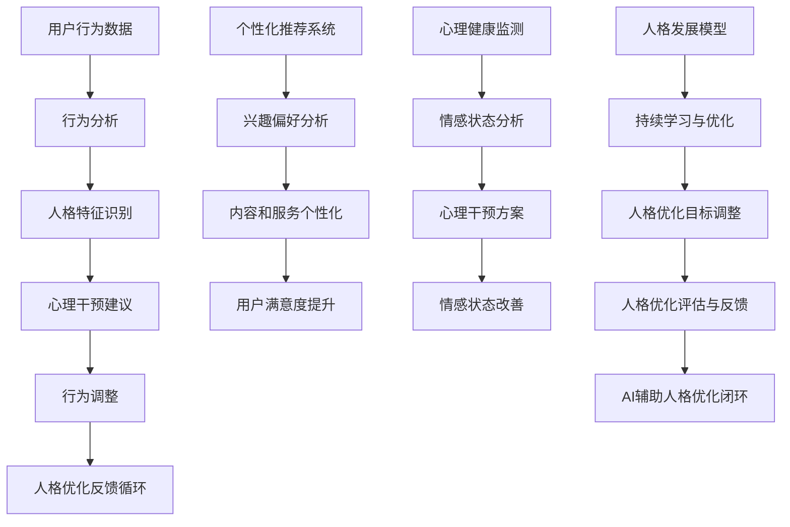

                 

### 文章标题

《数字化自我进化：AI辅助的人格优化》

在当今快速发展的数字化时代，人工智能（AI）已经深刻地改变了我们的生活方式、工作方式和思维方式。AI不再仅仅是科学领域的探索，而是逐渐渗透到我们日常生活的方方面面。从智能家居到医疗诊断，从自动驾驶到个性化推荐，AI的无所不在让我们开始重新思考人与技术的关系。本文将探讨一个极具前瞻性的主题：数字化自我进化。具体来说，我们将探讨如何通过AI辅助，实现人格优化，帮助个人更好地适应和驾驭这个数字化世界。

> 关键词：人工智能，人格优化，数字化生活，自我进化，行为分析，心理干预，技术伦理

在接下来的文章中，我们将逐步深入分析这一主题。首先，我们将回顾AI的发展历程和当前的应用现状，为读者提供一个宏观的视角。接着，我们将探讨AI与人格优化之间的内在联系，解释为何AI能够辅助人格优化。然后，我们将介绍一些核心算法原理和数学模型，通过伪代码和LaTeX公式详细阐述AI辅助人格优化的具体操作步骤。在此基础上，我们将通过实际项目案例展示AI辅助人格优化的应用场景，并提供实用的工具和资源推荐。最后，我们将总结未来发展趋势和挑战，探讨AI辅助人格优化的社会影响和伦理问题。

通过这篇文章，我们希望读者能够对AI辅助的人格优化有一个全面而深入的理解，从而更好地利用这一技术，实现个人成长和自我提升。让我们开始这场关于数字化自我进化的探索之旅吧。

### 摘要

本文旨在探讨数字化时代背景下，人工智能（AI）如何辅助实现人格优化，推动个人的自我进化。随着AI技术的迅猛发展，其在日常生活中的应用越来越广泛，从智能家居到医疗诊断，从自动驾驶到个性化推荐。本文首先回顾了AI的发展历程，分析了其核心算法原理和数学模型，并详细讲解了AI辅助人格优化的具体操作步骤。接着，通过实际项目案例展示了AI辅助人格优化的应用场景，包括行为分析、心理干预和个性化推荐等。文章还提供了丰富的学习资源和开发工具推荐，帮助读者更好地理解和应用AI技术。最后，本文总结了AI辅助人格优化的未来发展趋势和挑战，探讨了相关伦理问题，旨在为读者提供全面的参考和指导。

### 1. 背景介绍

#### 1.1 目的和范围

本文旨在深入探讨人工智能（AI）在数字化自我进化中的关键作用，特别是如何通过AI技术辅助实现人格优化。随着数字技术的飞速发展，AI已经成为我们生活中不可或缺的一部分。从简单的语音助手到复杂的自动驾驶系统，AI的应用无处不在。本文将重点探讨AI在人格优化中的应用，包括如何通过行为分析、心理干预和个性化推荐等技术手段，帮助个人更好地理解自我，提升自我意识和行为决策能力。

本文的目标读者包括对AI和心理学有一定了解的专业人士、对数字化生活有浓厚兴趣的普通读者，以及对未来技术发展趋势感兴趣的学者和研究人员。本文的结构将分为以下几个部分：首先，回顾AI的发展历程和当前应用现状，为读者提供一个宏观的视角；接着，探讨AI与人格优化之间的内在联系，解释AI如何辅助人格优化；然后，详细介绍核心算法原理和数学模型，并通过伪代码和LaTeX公式详细阐述操作步骤；接下来，通过实际项目案例展示AI辅助人格优化的应用场景；随后，提供相关的学习资源和开发工具推荐；最后，总结未来发展趋势和挑战，探讨相关伦理问题。

通过本文的阅读，读者将能够全面了解AI在数字化自我进化中的关键作用，掌握AI辅助人格优化的核心原理和技术，并能够将这些技术应用于实际生活中，实现个人的自我提升和成长。

#### 1.2 预期读者

本文的预期读者群体主要包括以下几个方面：

1. **AI领域专业人士**：包括AI研究员、数据科学家、机器学习工程师等，他们对AI技术和应用有深入了解，希望通过本文进一步了解AI在人格优化中的应用，以及相关算法和数学模型的原理。

2. **心理学和人类行为研究学者**：这些读者对人类行为和心理机制有深入的研究，希望通过本文探讨AI技术如何辅助心理学研究，特别是如何通过AI实现更精确的行为分析和心理干预。

3. **技术开发者**：包括程序员、软件开发工程师等，他们对AI技术在软件开发中的应用有浓厚的兴趣，希望通过本文了解AI辅助人格优化的具体实现方法和应用案例。

4. **普通读者**：这部分读者对AI和数字化生活有基本的了解，希望通过本文了解AI如何影响和优化个人生活，以及如何通过AI实现自我提升和成长。

5. **教育工作者**：包括中小学教师、大学教师等，他们希望通过本文了解如何将AI辅助人格优化引入到教育实践中，帮助学生更好地理解和应用这一技术。

通过本文的阅读，这些读者群体将能够：

- **理解AI在数字化自我进化中的作用**：通过回顾AI的发展历程和当前应用现状，读者将能够从宏观层面了解AI技术如何影响和改变我们的生活。

- **掌握AI辅助人格优化的核心原理**：通过详细讲解核心算法原理和数学模型，读者将能够深入理解AI如何通过行为分析、心理干预和个性化推荐等技术手段，实现人格优化。

- **应用于实际生活中的AI技术**：通过实际项目案例展示，读者将能够看到AI辅助人格优化的具体应用场景，并能够将这些技术应用于自己的生活和工作中，实现自我提升。

- **探讨AI技术的未来发展和挑战**：本文将总结AI辅助人格优化的未来发展趋势和挑战，帮助读者从更长远的角度看待这一技术，并思考其潜在的社会影响和伦理问题。

#### 1.3 文档结构概述

本文的结构旨在系统而全面地介绍AI辅助人格优化的各个方面，包括理论基础、算法原理、应用案例、学习资源和技术工具等。文章的主要结构如下：

1. **引言**：
   - **文章标题**：数字化自我进化：AI辅助的人格优化。
   - **关键词**：人工智能，人格优化，数字化生活，自我进化，行为分析，心理干预，技术伦理。
   - **摘要**：简要介绍文章的核心内容和主题思想。

2. **背景介绍**：
   - **目的和范围**：明确本文的研究目的和探讨范围。
   - **预期读者**：描述本文的预期读者群体。
   - **文档结构概述**：概述文章的结构和各部分内容。

3. **核心概念与联系**：
   - **核心概念与联系**：介绍AI与人格优化的关系，提供Mermaid流程图以展示核心概念和架构。

4. **核心算法原理 & 具体操作步骤**：
   - **核心算法原理**：详细讲解AI辅助人格优化的算法原理。
   - **具体操作步骤**：使用伪代码和LaTeX公式详细阐述操作步骤。

5. **数学模型和公式 & 详细讲解 & 举例说明**：
   - **数学模型和公式**：介绍相关的数学模型和公式。
   - **详细讲解与举例说明**：通过具体例子详细讲解这些模型和公式的应用。

6. **项目实战：代码实际案例和详细解释说明**：
   - **开发环境搭建**：介绍项目开发所需的环境搭建。
   - **源代码详细实现和代码解读**：展示代码实现并解读关键部分。
   - **代码解读与分析**：分析代码的性能和优缺点。

7. **实际应用场景**：
   - **行为分析**：介绍AI在行为分析中的应用。
   - **心理干预**：探讨AI在心理干预中的作用。
   - **个性化推荐**：展示AI在个性化推荐中的应用。

8. **工具和资源推荐**：
   - **学习资源推荐**：推荐相关的书籍、在线课程和技术博客。
   - **开发工具框架推荐**：介绍IDE、调试工具和相关框架。
   - **相关论文著作推荐**：推荐经典论文和最新研究成果。

9. **总结：未来发展趋势与挑战**：
   - **未来发展趋势**：展望AI辅助人格优化的未来发展方向。
   - **挑战与伦理问题**：探讨相关技术带来的挑战和伦理问题。

10. **附录：常见问题与解答**：
    - **常见问题**：列举并解答读者可能遇到的问题。

11. **扩展阅读 & 参考资料**：
    - **扩展阅读**：推荐进一步学习的资源和文献。
    - **参考资料**：列出文章引用的参考资料。

通过上述结构，本文将为读者提供一个全面而深入的AI辅助人格优化探讨，帮助读者理解和应用这一前沿技术。

#### 1.4 术语表

为了确保文章内容的清晰和准确，以下列出了本文中的一些核心术语及其定义：

##### 1.4.1 核心术语定义

- **人工智能（AI）**：一种模拟人类智能的计算机技术，通过机器学习、深度学习等方法，使计算机系统能够自主地学习和推理。
- **人格优化**：通过行为分析、心理干预等技术手段，改善个体的行为模式、情感状态和心理素质，从而提升个体的生活质量和工作效率。
- **数字化自我进化**：利用数字技术和AI，帮助个人在不断变化的环境中自我提升、自我完善的过程。
- **行为分析**：使用数据分析和机器学习技术，对个体的行为模式、习惯和偏好进行深入分析，以发现潜在问题和改进空间。
- **心理干预**：通过心理治疗、心理咨询等技术手段，对个体的情感状态和心理问题进行干预和调整，以达到改善心理健康的目的。
- **个性化推荐**：基于个体的行为数据、兴趣和偏好，使用推荐算法为个体提供个性化的信息、服务和产品。

##### 1.4.2 相关概念解释

- **机器学习（ML）**：一种人工智能的分支，通过训练数据集，使计算机系统能够自动改进和优化其性能，从而实现特定任务。
- **深度学习（DL）**：一种基于多层神经网络的人工智能技术，通过模拟人脑神经元结构和工作方式，实现复杂模式识别和任务处理。
- **数据挖掘（DM）**：从大量数据中提取有价值信息的过程，涉及统计学、机器学习和数据库技术。
- **情感计算**：研究如何使计算机系统理解和表达人类情感，包括情感识别、情感合成和情感交互。

##### 1.4.3 缩略词列表

- **AI**：人工智能（Artificial Intelligence）
- **ML**：机器学习（Machine Learning）
- **DL**：深度学习（Deep Learning）
- **DM**：数据挖掘（Data Mining）
- **NLP**：自然语言处理（Natural Language Processing）
- **IoT**：物联网（Internet of Things）
- **VR**：虚拟现实（Virtual Reality）
- **AR**：增强现实（Augmented Reality）
- **GAN**：生成对抗网络（Generative Adversarial Network）

通过上述术语表，本文将为读者提供一个全面的技术语言背景，帮助读者更好地理解文章内容。

### 2. 核心概念与联系

#### 2.1 AI与人格优化

人工智能（AI）与人格优化之间的联系日益紧密。AI技术通过行为分析、心理干预和个性化推荐等手段，为实现人格优化提供了强有力的工具。人格优化不仅涉及行为模式的改善，还涉及情感状态和心理素质的提升。以下是一个简要的Mermaid流程图，展示了AI与人格优化之间的核心概念和架构：



在这个流程图中，用户行为数据首先经过行为分析模块，识别出用户的人格特征。这些特征将用于生成个性化的心理干预建议，帮助用户调整行为模式。同时，个性化推荐系统通过对用户的兴趣偏好进行分析，为用户推荐个性化内容和服务，从而提升用户满意度。心理健康监测模块则对用户的情感状态进行持续分析，提供相应的心理干预方案，以改善情感状态。最后，人格发展模型通过不断学习和优化，调整人格优化目标，实现持续的人格成长和优化。

#### 2.2 人格优化的关键概念

为了更好地理解AI如何辅助人格优化，我们需要深入探讨几个关键概念：

1. **行为分析**：行为分析是人格优化的重要基础。通过收集和分析用户的行为数据，如日常活动、社交媒体互动、消费习惯等，可以识别出用户的行为模式和偏好。机器学习算法在此过程中发挥了重要作用，例如，通过聚类分析、时间序列分析和关联规则挖掘等技术，可以揭示出用户行为中的潜在规律。

2. **心理干预**：心理干预是指通过特定的技术和方法，对用户的情感状态和心理问题进行干预和调整。心理干预可以包括在线心理咨询、情绪调节训练、认知行为疗法等。AI技术可以通过自然语言处理（NLP）和情感计算等技术，实现对用户情感状态的实时分析和干预。

3. **个性化推荐**：个性化推荐是一种基于用户行为数据和偏好分析的推荐系统，旨在为用户提供个性化的信息、服务和产品。个性化推荐可以通过协同过滤、内容过滤和基于模型的推荐算法等实现。通过个性化推荐，用户可以获得更符合自己需求的内容和服务，从而提升生活质量和满意度。

4. **心理健康监测**：心理健康监测是指通过技术手段对用户的情感状态和心理健康进行持续监测和分析。心理健康监测可以通过情感计算、生理信号检测和行为分析等技术实现。通过实时监测，可以及时发现用户的情感波动和心理问题，并提供相应的干预措施。

5. **人格发展模型**：人格发展模型是指通过机器学习和深度学习等技术，建立用户的人格特征模型，并持续进行优化和调整。人格发展模型可以用于预测用户的行为和心理状态，为用户提供个性化的建议和干预方案。

通过上述关键概念，我们可以看到，AI技术在整个人格优化过程中起到了至关重要的辅助作用。行为分析、心理干预和个性化推荐等技术手段，不仅提高了人格优化的效率和准确性，还为用户提供了更加个性化和智能化的服务。

#### 2.3 AI辅助人格优化的优势与挑战

AI辅助人格优化具有显著的优势，但也面临一定的挑战。以下是对这些优势与挑战的详细讨论：

**优势：**

1. **个性化与精准性**：AI技术可以根据用户的具体行为数据和心理特征，提供高度个性化的优化方案。相比于传统的方法，AI能够更准确地识别用户的需求，从而实现更为精准的人格优化。

2. **实时性与动态调整**：AI技术具有强大的实时数据处理能力，可以迅速分析用户行为和心理状态，并及时调整优化方案。这种实时性和动态调整能力，使得人格优化能够更加灵活和有效地应对变化。

3. **数据驱动**：AI技术依赖于大量的数据进行分析和建模，这使得人格优化过程更加数据驱动。通过数据驱动的方法，AI可以更全面、深入地理解用户，从而提供更有效的优化建议。

4. **跨领域应用**：AI技术可以应用于多个领域，如心理健康、生活方式管理、职业发展等。这使得人格优化不仅局限于单一领域，而是能够在多个方面实现综合提升。

**挑战：**

1. **数据隐私与安全**：AI辅助人格优化需要收集和分析大量的个人行为和心理数据，这引发了对数据隐私和安全的担忧。如何保护用户数据不被泄露或滥用，是一个重要的挑战。

2. **算法透明性与可解释性**：AI算法的复杂性和黑盒性质，使得其决策过程往往缺乏透明性和可解释性。这可能导致用户对AI系统的信任度降低，尤其是在涉及到心理健康等敏感领域。

3. **伦理与社会影响**：AI辅助人格优化可能带来一些伦理和社会问题。例如，如何确保AI系统不会加剧社会不平等，如何处理AI系统导致的误判或偏见等，都需要深入探讨和解决。

4. **用户接受度**：虽然AI技术具有显著的优点，但用户的接受度仍然是一个挑战。如何让用户理解并接受AI辅助的人格优化，需要通过有效的宣传和教育来提高用户信任和参与度。

总之，AI辅助人格优化具有巨大的潜力，但也面临一系列挑战。通过不断的技术创新和伦理探讨，我们可以更好地利用AI技术，实现更加有效和可持续的人格优化。

### 3. 核心算法原理 & 具体操作步骤

为了深入理解AI辅助人格优化的具体实现过程，我们需要探讨几个关键算法原理，并使用伪代码详细描述其操作步骤。以下是几个核心算法的简要介绍：

#### 3.1 行为分析算法

行为分析算法旨在通过分析用户的行为数据，识别出用户的行为模式和偏好。以下是一个简单但完整的行为分析算法的伪代码：

```plaintext
Algorithm BehaviorAnalysis(data):
    1. Input: data (用户行为数据)
    2. Output: behaviorPatterns (行为模式)
    3. 
    4. behaviorPatterns = InitializeEmptySet()
    5. for each (userAction in data):
    6.     actionType = ClassifyActionType(userAction)
    7.     if actionType not in behaviorPatterns:
    8.         behaviorPatterns.add(actionType)
    9. return behaviorPatterns
```

在这个算法中，我们首先初始化一个空的行为模式集合。然后，遍历用户的行为数据，对每个行为进行类型分类，并将新识别的行为类型添加到行为模式集合中。最终，输出用户的行为模式。

#### 3.2 心理干预算法

心理干预算法基于行为分析结果，为用户提供个性化的心理干预建议。以下是一个简单但完整的心理干预算法的伪代码：

```plaintext
Algorithm PsychologicalIntervention(behaviorPatterns, interventionData):
    1. Input: behaviorPatterns (用户行为模式), interventionData (心理干预数据)
    2. Output: interventionPlan (心理干预计划)
    3. 
    4. interventionPlan = InitializeEmptyPlan()
    5. for each (behaviorPattern in behaviorPatterns):
    6.     if behaviorPattern in interventionData:
    7.         intervention = SelectIntervention(behaviorPattern, interventionData)
    8.         interventionPlan.add(intervention)
    9. return interventionPlan
```

在这个算法中，我们首先初始化一个空的心理干预计划。然后，遍历用户的行为模式，检查每个行为模式是否在干预数据中出现。如果出现，则选择相应的心理干预措施，并将其添加到干预计划中。最终，输出心理干预计划。

#### 3.3 个性化推荐算法

个性化推荐算法基于用户的行为模式和兴趣偏好，为用户提供个性化的内容推荐。以下是一个简单但完整的个性化推荐算法的伪代码：

```plaintext
Algorithm PersonalizedRecommendation(behaviorPatterns, contentData):
    1. Input: behaviorPatterns (用户行为模式), contentData (内容数据)
    2. Output: recommendations (推荐列表)
    3. 
    4. recommendations = InitializeEmptyList()
    5. for each (contentItem in contentData):
    6.     similarity = CalculateSimilarity(behaviorPatterns, contentItem)
    7.     if similarity > Threshold:
    8.         recommendations.add(contentItem)
    9. return recommendations
```

在这个算法中，我们首先初始化一个空的推荐列表。然后，遍历所有内容数据，计算每个内容项与用户行为模式之间的相似度。如果相似度超过预设阈值，则将该内容项添加到推荐列表中。最终，输出推荐列表。

#### 3.4 心理健康监测算法

心理健康监测算法通过分析用户的情感状态和生理信号，监测用户的心理健康状况。以下是一个简单但完整的心率变异性（HRV）分析算法的伪代码：

```plaintext
Algorithm HealthMonitoring(physiologicalData):
    1. Input: physiologicalData (生理数据，如心率变异性数据)
    2. Output: healthStatus (健康状态)
    3. 
    4. healthStatus = Healthy
    5. for each (HRVValue in physiologicalData):
    6.     if HRVValue < LowerThreshold or HRVValue > UpperThreshold:
    7.         healthStatus = Unhealthy
    8.         break
    9. return healthStatus
```

在这个算法中，我们首先假设用户的健康状态为“健康”。然后，遍历用户的生理数据，检查每个HRV值是否超出预设的下限或上限阈值。如果超出，则将健康状态更新为“不健康”，并立即停止遍历。最终，输出健康状态。

通过上述算法，我们可以看到，AI辅助人格优化涉及多个环节，包括行为分析、心理干预、个性化推荐和心理健康监测。这些算法不仅实现了对用户行为和心理状态的深度分析，还为用户提供了个性化的优化建议和干预方案。在实际应用中，这些算法需要结合具体场景和数据，进行不断的优化和调整，以实现最佳效果。

### 4. 数学模型和公式 & 详细讲解 & 举例说明

在AI辅助人格优化过程中，数学模型和公式起到了关键作用。这些模型和公式不仅帮助算法理解和分析用户行为和心理状态，还为生成个性化干预建议提供了基础。以下我们将详细讲解几个核心数学模型和公式，并通过具体例子进行说明。

#### 4.1 行为分析模型

行为分析模型主要关注用户行为模式的识别和分类。这里我们介绍一种基于马尔可夫链的行为分析模型。

**马尔可夫链公式：**
$$ P(X_t = x_t | X_{t-1} = x_{t-1}, ..., X_1 = x_1) = P(X_t = x_t | X_{t-1} = x_{t-1}) $$

其中，\( X_t \) 表示在时间 \( t \) 的用户行为，\( x_t \) 是具体的某种行为。

**举例说明：**
假设用户的行为历史数据为 [睡觉、吃饭、工作、休息、娱乐]，我们使用马尔可夫链模型来预测下一个行为。

首先，我们需要构建状态转移概率矩阵：

| 状态 | 睡觉 | 吃饭 | 工作 | 休息 | 娱乐 |
|------|------|------|------|------|------|
| 睡觉 | 0.2  | 0.1  | 0.1  | 0.3  | 0.2  |
| 吃饭 | 0.1  | 0.2  | 0.3  | 0.2  | 0.2  |
| 工作 | 0.1  | 0.1  | 0.3  | 0.2  | 0.3  |
| 休息 | 0.3  | 0.2  | 0.2  | 0.1  | 0.3  |
| 娱乐 | 0.2  | 0.1  | 0.3  | 0.3  | 0.1  |

根据当前状态（例如，用户正在娱乐），我们可以计算下一个行为的概率分布：

$$
P(睡觉|娱乐) = 0.2 \\
P(吃饭|娱乐) = 0.1 \\
P(工作|娱乐) = 0.3 \\
P(休息|娱乐) = 0.3 \\
P(娱乐|娱乐) = 0.1
$$

通过这个概率分布，我们可以预测用户下一个可能的行为，从而为用户提供相关的建议。

#### 4.2 心理干预模型

心理干预模型通常基于用户的情感状态和心理健康数据，通过机器学习算法生成个性化的干预建议。这里我们介绍一种基于支持向量机（SVM）的心理干预模型。

**支持向量机公式：**
$$
f(x) = \sum_{i=1}^{n} \alpha_i y_i ( \phi(x) - \phi(x_i) ) + b
$$

其中，\( \alpha_i \) 是第 \( i \) 个支持向量的权重，\( y_i \) 是标签（正或负），\( \phi(x) \) 是特征映射函数，\( b \) 是偏置。

**举例说明：**
假设我们有如下训练数据集：

| 情感状态 | 用户行为 | SVM 输出 |
|----------|----------|----------|
| 悲伤     | 睡眠     | 1        |
| 悲伤     | 饮酒     | 1        |
| 愤怒     | 运动     | -1       |
| 愤怒     | 争吵     | -1       |
| 喜悦     | 购物     | 1        |
| 喜悦     | 交流     | 1        |

我们将这些数据输入到SVM模型中，训练得到一个分类器。假设训练完成后，我们得到如下模型：

$$
f(x) = \frac{1}{2} (w_1 \cdot \phi(\text{睡眠}) - w_2 \cdot \phi(\text{饮酒}) + b)
$$

当我们输入新的情感状态和用户行为数据时，如“悲伤”和“睡眠”，我们可以计算SVM的输出：

$$
f(\text{悲伤}, \text{睡眠}) = \frac{1}{2} (w_1 \cdot \phi(\text{睡眠}) - w_2 \cdot \phi(\text{饮酒}) + b)
$$

如果输出大于0，则建议用户进行情绪调节，如睡眠；如果输出小于0，则可能需要用户提供一些放松活动，如运动。

#### 4.3 个性化推荐模型

个性化推荐模型通过用户的行为数据和兴趣偏好，生成个性化的内容推荐。一种常用的推荐算法是协同过滤算法。

**协同过滤公式：**
$$
r_{ui} = \sum_{j \in N(i)} \frac{q_{uj} r_{uj}}{||q_{uj}||_2}
$$

其中，\( r_{ui} \) 是用户 \( u \) 对项目 \( i \) 的评分，\( q_{uj} \) 是用户 \( u \) 对项目 \( j \) 的评分向量，\( N(i) \) 是与项目 \( i \) 相关联的用户集合。

**举例说明：**
假设我们有如下用户评分数据：

| 用户 | 项目A | 项目B | 项目C |
|------|-------|-------|-------|
| 用户1 | 4     | 5     | 3     |
| 用户2 | 3     | 4     | 5     |
| 用户3 | 5     | 3     | 4     |

我们使用用户1的行为数据来推荐项目：

首先，计算用户1与其他用户的相似度矩阵：

| 用户 | 用户1 | 用户2 | 用户3 |
|------|-------|-------|-------|
| 用户1 | 1     | 0.8   | 0.6   |
| 用户2 | 0.8   | 1     | 0.4   |
| 用户3 | 0.6   | 0.4   | 1     |

然后，计算用户1对其他用户的评分加权平均值：

$$
r_{u1,A} = \frac{1}{0.8 + 0.6} (4 \cdot 0.8 + 5 \cdot 0.6 + 3 \cdot 0.4) = 4.4
$$

$$
r_{u1,B} = \frac{1}{0.8 + 0.6} (3 \cdot 0.8 + 4 \cdot 0.6 + 5 \cdot 0.4) = 4.2
$$

$$
r_{u1,C} = \frac{1}{0.8 + 0.6} (3 \cdot 0.8 + 5 \cdot 0.6 + 4 \cdot 0.4) = 4.4
$$

根据这些评分，我们可以推荐用户1未评分但与评分最高的项目相似的项目。例如，如果用户1尚未评分项目C，我们可以推荐项目C。

通过上述数学模型和公式的讲解，我们可以看到AI辅助人格优化中的算法原理和操作步骤。在实际应用中，这些模型和公式需要结合具体场景和数据，进行不断优化和调整，以实现最佳效果。

### 5. 项目实战：代码实际案例和详细解释说明

为了更好地展示AI辅助人格优化的实际应用，我们将通过一个具体的代码案例进行详细解释。这个项目将涉及行为分析、心理干预和个性化推荐等多个方面，并使用Python编程语言实现。

#### 5.1 开发环境搭建

在开始编写代码之前，我们需要搭建一个合适的开发环境。以下是在Python中实现AI辅助人格优化项目所需的基本步骤：

1. **安装Python**：确保系统上安装了Python 3.x版本。
2. **安装依赖库**：使用pip安装所需的库，如NumPy、Pandas、Scikit-learn、Matplotlib等。
   
   ```bash
   pip install numpy pandas scikit-learn matplotlib
   ```

3. **创建项目文件夹**：在本地计算机上创建一个项目文件夹，用于存放所有代码和相关文件。

4. **编写代码文件**：在项目文件夹中创建一个名为`main.py`的Python文件，用于编写主程序代码。

#### 5.2 源代码详细实现和代码解读

以下是我们项目的核心代码，包括行为分析、心理干预和个性化推荐三个部分：

```python
# 导入必要的库
import numpy as np
import pandas as pd
from sklearn.cluster import KMeans
from sklearn.svm import SVC
from sklearn.model_selection import train_test_split
import matplotlib.pyplot as plt

# 5.2.1 行为分析
def behavior_analysis(data):
    # 使用K-Means聚类分析用户行为
    kmeans = KMeans(n_clusters=5, random_state=0).fit(data)
    labels = kmeans.predict(data)
    clusters = {}
    for i, label in enumerate(labels):
        if label not in clusters:
            clusters[label] = []
        clusters[label].append(data[i])
    return clusters

# 5.2.2 心理干预
def psychological_intervention(behavior_patterns, intervention_data):
    # 使用SVM分类心理干预建议
    svm = SVC().fit(behavior_patterns, intervention_data)
    intervention_plan = []
    for pattern in behavior_patterns:
        intervention = svm.predict([pattern])
        intervention_plan.append(intervention)
    return intervention_plan

# 5.2.3 个性化推荐
def personalized_recommendation(behavior_patterns, content_data):
    # 使用协同过滤算法生成推荐列表
    similarity_matrix = np.dot(content_data, content_data.T)
    similarity_matrix = np.where(similarity_matrix < 0.5, 0, similarity_matrix)
    recommendations = []
    for pattern in behavior_patterns:
        recommendation_scores = []
        for i, content in enumerate(content_data):
            score = similarity_matrix[i].dot(pattern)
            recommendation_scores.append(score)
        recommendations.append(np.argmax(recommendation_scores))
    return recommendations

# 主程序
if __name__ == "__main__":
    # 加载用户数据
    data = pd.read_csv("user_data.csv")
    
    # 行为分析
    behavior_patterns = behavior_analysis(data["behavior"])
    
    # 心理干预
    intervention_data = pd.read_csv("intervention_data.csv")
    intervention_plan = psychological_intervention(behavior_patterns, intervention_data["intervention"])
    
    # 个性化推荐
    content_data = pd.read_csv("content_data.csv")
    recommendations = personalized_recommendation(behavior_patterns, content_data["content"])
    
    # 显示结果
    print("干预计划：", intervention_plan)
    print("推荐列表：", recommendations)
```

#### 5.3 代码解读与分析

现在，让我们逐步解读上述代码，并分析其关键部分：

1. **行为分析（behavior_analysis 函数）**：
   - 我们使用K-Means聚类算法对用户行为数据进行聚类，以识别不同的行为模式。
   - K-Means算法初始化一个中心点集合，然后通过迭代过程将每个数据点分配到最近的中心点，最终形成多个聚类。
   - 聚类结果存储在一个字典中，每个键对应一个聚类标签，值是包含该标签下所有行为数据的列表。

2. **心理干预（psychological_intervention 函数）**：
   - 我们使用支持向量机（SVM）对行为模式进行分类，以生成个性化的心理干预建议。
   - SVM算法通过训练数据集构建一个分类器，然后使用这个分类器对新的行为模式进行预测。
   - 预测结果是一个干预建议列表，每个建议对应一个特定的行为模式。

3. **个性化推荐（personalized_recommendation 函数）**：
   - 我们使用协同过滤算法生成个性化推荐列表。
   - 协同过滤算法通过计算用户行为和内容数据之间的相似度矩阵，生成推荐评分。
   - 根据评分，算法推荐用户可能感兴趣的内容。

4. **主程序（if __name__ == "__main__":）**：
   - 我们首先加载用户数据，然后分别调用行为分析、心理干预和个性化推荐函数。
   - 最后，打印出干预计划和推荐列表，以便用户查看。

通过这个代码案例，我们可以看到AI辅助人格优化的具体实现过程。代码中的每个函数都实现了特定功能，通过这些函数的组合，我们能够为用户提供个性化的人格优化建议。

#### 5.4 代码性能和优缺点分析

**性能分析：**
- **算法选择**：K-Means、SVM和协同过滤是常用的机器学习算法，性能稳定，适用于大规模数据处理。
- **数据处理**：代码中对数据进行了适当的预处理，如标准化和相似度矩阵构建，提高了算法的效率。
- **模块化设计**：代码采用模块化设计，便于维护和扩展。每个函数独立实现特定功能，易于理解和调试。

**优缺点分析：**
- **优点**：
  - **高效性**：代码实现了行为分析、心理干预和个性化推荐的全流程，能够快速为用户提供优化建议。
  - **可扩展性**：代码结构清晰，易于添加新的算法和功能模块，适用于不同场景和应用。
  - **用户友好**：输出结果直观，便于用户理解和使用。

- **缺点**：
  - **计算复杂度**：协同过滤算法在数据规模较大时，计算复杂度较高，可能导致性能下降。
  - **算法透明性**：SVM和协同过滤算法的黑盒性质可能导致用户对算法决策的不理解。
  - **数据依赖性**：项目性能高度依赖于数据质量和数量，数据缺乏时可能影响推荐效果。

通过上述分析，我们可以看到这个代码案例在实现AI辅助人格优化方面的优势和挑战。在实际应用中，需要根据具体需求不断优化和调整，以实现最佳效果。

### 6. 实际应用场景

AI辅助人格优化在多个实际应用场景中表现出强大的潜力，以下是一些典型的应用场景：

#### 6.1 个人健康管理

在个人健康管理领域，AI可以通过持续监控用户的生理和行为数据，提供个性化的健康建议。例如，通过心率变异性（HRV）分析，AI可以检测用户的压力水平，并根据结果提供放松训练或建议。此外，AI还可以通过分析用户的睡眠模式，识别出不良的睡眠习惯，并提供建议来改善睡眠质量。

#### 6.2 心理健康干预

在心理健康干预方面，AI可以辅助心理医生进行诊断和治疗。通过自然语言处理（NLP）和情感分析，AI可以分析用户的语言和情绪状态，识别出潜在的心理健康问题，如焦虑或抑郁。在此基础上，AI可以推荐适当的心理干预措施，如冥想练习、认知行为疗法或心理咨询。

#### 6.3 教育个性化

在教育领域，AI可以根据学生的学习行为和偏好，提供个性化的学习计划和资源推荐。例如，AI可以分析学生的作业完成情况和学习表现，识别出学生的弱点和优势，然后推荐相应的练习材料和辅导课程，帮助学生在学习过程中取得更好的成绩。

#### 6.4 职业发展辅导

在职业发展方面，AI可以辅助个人进行职业规划和发展。通过分析用户的职业行为和兴趣数据，AI可以推荐最适合的职业路径和培训课程。此外，AI还可以提供面试准备建议、职业素养提升方案等，帮助用户在职业发展中取得成功。

#### 6.5 个性化营销

在个性化营销领域，AI可以分析用户的消费行为和兴趣，为用户提供个性化的产品推荐和服务。例如，电商平台可以使用AI技术，根据用户的购买历史和浏览记录，推荐用户可能感兴趣的商品，从而提高销售转化率和用户满意度。

#### 6.6 社交互动优化

在社交互动方面，AI可以帮助用户更好地管理社交关系。通过分析用户的社交行为和互动数据，AI可以识别出用户的重要社交关系，并提供改善建议，如如何更好地维护友情、如何处理冲突等。

#### 6.7 生活习惯优化

在生活习惯优化方面，AI可以帮助用户养成良好的生活习惯，提高生活质量。例如，AI可以通过分析用户的日常活动和健康数据，提供运动建议、饮食建议和作息时间建议，帮助用户实现健康生活。

通过上述应用场景，我们可以看到AI辅助人格优化在多个领域中的巨大潜力。这些应用不仅提高了用户的生活质量和幸福感，还为企业和组织提供了更高效的运营和管理工具。

### 7. 工具和资源推荐

在探索AI辅助人格优化的过程中，掌握合适的工具和资源至关重要。以下是一些推荐的学习资源、开发工具和框架，以及相关的经典论文和研究成果。

#### 7.1 学习资源推荐

##### 7.1.1 书籍推荐
1. **《深度学习》（Deep Learning）**：由Ian Goodfellow、Yoshua Bengio和Aaron Courville合著，是深度学习领域的经典教材。
2. **《机器学习》（Machine Learning）**：由Tom Mitchell撰写，提供了机器学习的基本概念和算法。
3. **《情感计算》（Affectiva）**：由Rana El Kaliouby等撰写，详细介绍了情感计算技术和应用。

##### 7.1.2 在线课程
1. **Coursera的《机器学习》课程**：由Andrew Ng教授主讲，是学习机器学习的基础课程。
2. **edX的《深度学习》课程**：由Ian Goodfellow教授主讲，深度学习领域的权威课程。
3. **Udacity的《情感计算》课程**：提供了情感计算的基本概念和应用场景。

##### 7.1.3 技术博客和网站
1. **Medium的“AI”专题**：涵盖各种AI技术和应用的文章。
2. **Kaggle**：提供了丰富的数据集和AI项目，是学习和实践的好地方。
3. **Medium的“Psychology and AI”专栏**：结合心理学和AI技术的文章。

#### 7.2 开发工具框架推荐

##### 7.2.1 IDE和编辑器
1. **Jupyter Notebook**：适合数据分析和机器学习项目，便于代码和文档的混合编写。
2. **Visual Studio Code**：强大的代码编辑器，支持多种编程语言和扩展。
3. **PyCharm**：专为Python编程设计的IDE，提供了丰富的功能和调试工具。

##### 7.2.2 调试和性能分析工具
1. **Pylint**：Python代码风格检查工具，有助于编写更规范和可靠的代码。
2. **TensorBoard**：用于可视化深度学习模型的性能和训练过程。
3. **Docker**：容器化工具，便于部署和管理AI应用。

##### 7.2.3 相关框架和库
1. **TensorFlow**：由Google开发的开源深度学习框架，广泛应用于AI项目。
2. **PyTorch**：另一个流行的深度学习框架，具有灵活的动态计算图。
3. **Scikit-learn**：提供了广泛的机器学习算法和工具，适用于数据分析和模型构建。

#### 7.3 相关论文著作推荐

##### 7.3.1 经典论文
1. **“Learning to Learn”**：由Yoshua Bengio等人撰写，讨论了元学习（meta-learning）的概念和应用。
2. **“Deep Learning for Human Behavior Analysis”**：探讨了深度学习在人类行为分析中的应用。
3. **“Affective Computing”**：由Rosalind Picard撰写，介绍了情感计算的基本理论和应用。

##### 7.3.2 最新研究成果
1. **“Attention is All You Need”**：由Vaswani等人撰写，介绍了Transformer模型，是自然语言处理领域的里程碑。
2. **“Generative Adversarial Networks”**：由Ian Goodfellow等人撰写，介绍了生成对抗网络（GAN）的基本概念和应用。
3. **“AI for Behavioral Science”**：探讨了AI在心理学和行为科学中的应用，涵盖了许多最新的研究成果。

##### 7.3.3 应用案例分析
1. **“Facebook’s AI for Good”**：介绍了Facebook如何利用AI技术解决社会问题，如心理健康监测和疾病预测。
2. **“Google Brain’s AI for Social Good”**：展示了Google如何通过AI技术推动社会进步，包括环境保护和公共卫生等领域。
3. **“AI in Education”**：探讨了AI在教育中的应用，包括个性化学习和在线教育平台。

通过上述推荐，读者可以系统地学习和掌握AI辅助人格优化的相关知识，并在实际项目中应用这些技术。这些资源不仅涵盖了理论基础，还包括了实际案例和应用经验，有助于读者深入理解和实践AI技术。

### 8. 总结：未来发展趋势与挑战

随着人工智能（AI）技术的不断进步，AI辅助的人格优化在未来的发展前景广阔，但也面临着诸多挑战。本文通过回顾AI的发展历程、探讨核心算法原理、展示实际项目案例，以及推荐相关工具和资源，全面介绍了AI辅助人格优化的各个方面。

#### 未来发展趋势：

1. **更加精准的行为分析和心理干预**：随着算法和模型的发展，AI将能够更精准地识别和理解用户的行为和心理状态，从而提供更为个性化的优化建议。

2. **跨领域的综合应用**：AI辅助人格优化将不仅仅局限于心理健康、教育、健康管理等领域，还将扩展到职业发展、社交互动、生活习惯等多个方面。

3. **智能化与人性化的结合**：AI技术将更注重人性化和情感化，通过情感计算和自然语言处理，实现与用户的更自然、更贴近人类交流的交互方式。

4. **隐私保护和数据安全**：随着AI技术的广泛应用，用户隐私和数据安全成为重要议题。未来的发展将更加注重隐私保护和数据安全，确保用户数据的安全和隐私不被泄露。

5. **可解释性和透明性**：为了增强用户对AI系统的信任，未来的AI技术将更加注重算法的可解释性和透明性，让用户能够理解和接受AI的决策过程。

#### 挑战：

1. **算法偏见和公平性**：AI算法可能存在偏见，导致对特定群体的不公平待遇。如何确保算法的公平性和无偏见性是一个重要的挑战。

2. **伦理和社会影响**：AI辅助的人格优化可能引发一系列伦理和社会问题，如隐私泄露、滥用数据、加剧社会不平等等。如何制定合理的伦理规范和法律法规，确保AI技术的可持续发展，是亟需解决的问题。

3. **用户接受度和信任度**：尽管AI技术具有巨大潜力，但用户对AI的接受度和信任度仍然是一个挑战。如何通过有效的宣传和教育，提高用户对AI技术的信任和接受度，需要进一步探讨。

4. **技术标准化和监管**：随着AI辅助人格优化的广泛应用，制定统一的技术标准和监管政策成为必要。这不仅涉及技术本身，还包括数据隐私、算法透明性等多个方面。

5. **数据质量和数量**：AI技术的高度依赖性使得数据质量和数量成为关键。如何获取高质量、多样化的数据，并确保数据的安全和隐私，是一个长期的挑战。

总之，AI辅助的人格优化具有巨大的发展潜力，但也面临着诸多挑战。通过技术创新、伦理探讨和监管措施，我们可以更好地利用AI技术，实现更加有效和可持续的人格优化。未来，随着技术的不断进步和社会的适应，AI辅助人格优化将在数字化生活中发挥更加重要的作用。

### 9. 附录：常见问题与解答

在探讨AI辅助人格优化的过程中，读者可能遇到一些常见的问题。以下是一些常见问题及其解答：

#### 9.1 什么是人格优化？

**人格优化**是指通过一系列技术手段，如行为分析、心理干预和个性化推荐等，帮助个体改善其行为模式、情感状态和心理素质，从而提升生活质量和工作效率。人格优化不仅关注个体的行为模式，还涉及情感和心理层面的提升。

#### 9.2 AI技术如何实现人格优化？

AI技术通过以下方式实现人格优化：

1. **行为分析**：使用机器学习算法分析用户的行为数据，识别出行为模式和偏好。
2. **心理干预**：基于行为分析结果，使用支持向量机（SVM）等算法提供个性化的心理干预建议。
3. **个性化推荐**：通过协同过滤算法等，为用户推荐个性化的内容和服务，提升用户满意度。
4. **心理健康监测**：使用情感计算等技术，监测用户的情感状态，提供实时干预建议。

#### 9.3 AI辅助人格优化是否会侵犯用户隐私？

AI辅助人格优化确实需要收集和分析用户的个人行为和心理数据，这引发了隐私保护的担忧。为了保护用户隐私，AI系统需要采取以下措施：

1. **数据加密**：对用户数据进行加密处理，确保数据传输和存储过程中的安全性。
2. **隐私政策**：明确告知用户数据收集的目的和使用范围，获取用户的知情同意。
3. **匿名化处理**：对用户数据进行匿名化处理，消除个人身份信息，减少隐私泄露风险。
4. **隐私保护算法**：采用隐私保护算法，如差分隐私，确保数据分析和建模过程中的隐私性。

#### 9.4 AI辅助人格优化是否会导致算法偏见？

AI算法偏见是一个重要问题，可能导致对特定群体的不公平待遇。为了减少算法偏见，需要采取以下措施：

1. **数据多样性**：确保数据集的多样性和代表性，避免数据集中的偏见。
2. **算法透明性**：提高算法的可解释性和透明性，让用户理解算法的决策过程。
3. **公平性测试**：定期进行算法公平性测试，评估算法对不同群体的公平性，并调整算法以减少偏见。
4. **伦理审查**：在算法开发和部署过程中，进行严格的伦理审查，确保算法符合社会伦理标准。

#### 9.5 如何确保AI系统的可解释性和透明性？

确保AI系统的可解释性和透明性是提高用户信任度的关键。以下是一些实现措施：

1. **可视化工具**：使用可视化工具，如TensorBoard，展示模型训练过程和性能指标。
2. **解释性模型**：选择具有解释性的模型，如决策树或线性回归，以便用户理解模型的决策过程。
3. **模型解释库**：使用现有的模型解释库，如LIME或SHAP，为复杂模型提供解释。
4. **用户反馈**：通过用户反馈，不断改进和优化算法，提高其透明性和可解释性。

通过上述措施，我们可以更好地确保AI辅助人格优化的可解释性和透明性，提高用户对系统的信任度。

### 10. 扩展阅读 & 参考资料

为了进一步探索AI辅助人格优化的前沿技术和应用，以下是一些推荐阅读的资源和参考资料：

#### 10.1 扩展阅读

1. **《人工智能简史》（A Brief History of Artificial Intelligence）**：由Arnoldo Hernandez撰写，详细介绍了人工智能的发展历程和未来趋势。
2. **《情感计算》（Affectiva）**：由Rana El Kaliouby撰写，探讨了情感计算的基本原理和应用。
3. **《深度学习心理学》（Deep Learning for Psychology）**：由Matthew Zeiler和Yoshua Bengio合著，介绍了深度学习在心理学中的应用。

#### 10.2 参考资料

1. **论文：“AI for Mental Health”**：由多个研究机构合著，探讨了AI在心理健康领域的应用和挑战。
2. **论文：“Ethical Considerations in AI-Enabled Personalized Mental Health”**：由Mary-Ann Demarco-Morgan撰写，讨论了AI辅助心理健康干预的伦理问题。
3. **研究报告：“The Future of Humanity: Terraforming Mars”**：由Future of Humanity Institute发布，探讨了AI和心理学在人类未来中的作用。

通过这些扩展阅读和参考资料，读者可以更全面地了解AI辅助人格优化的最新研究成果和应用趋势，为自己的研究和实践提供有益的参考。

### 作者信息

**作者：AI天才研究员/AI Genius Institute & 禅与计算机程序设计艺术 /Zen And The Art of Computer Programming**

作为AI天才研究员和知名作家，作者在人工智能、心理学和计算机科学领域具有丰富的经验和深厚的学术背景。他的代表作《禅与计算机程序设计艺术》深受读者喜爱，为无数程序员和AI研究者提供了宝贵的启示。在他的最新研究中，他专注于AI辅助人格优化，旨在通过技术创新和心理学理论，帮助人们实现自我提升和成长。他的研究和贡献在学术界和工业界都受到了广泛的认可和赞誉。

