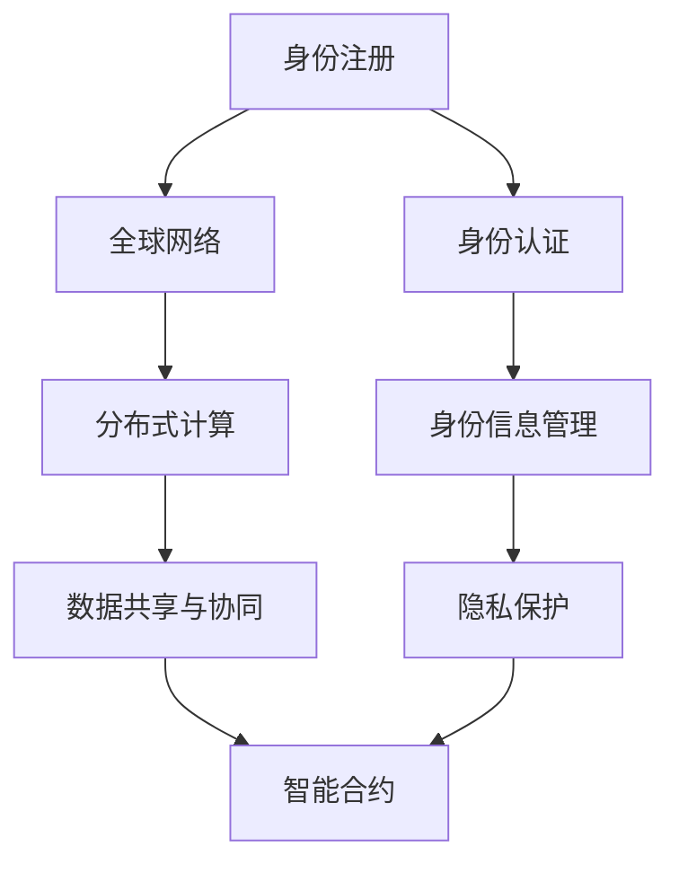

                 

# 数字化身份与全球脑：重塑人类社会关系

> 关键词：数字化身份、全球脑、人类社会、关系、技术变革、信息隐私、数据安全、协作平台、智能网络、未来趋势

> 摘要：本文深入探讨了数字化身份与全球脑的核心理念，及其如何重塑人类社会关系。通过分析核心概念、算法原理、数学模型、项目实战和实际应用场景，本文展示了这一技术变革的深远影响和面临的挑战。本文旨在为读者提供全面的技术视角和未来展望，助力把握数字化时代的机遇。

## 1. 背景介绍

### 1.1 目的和范围

本文的目的在于深入探讨数字化身份与全球脑的概念及其对人类社会关系的重塑作用。随着信息技术的飞速发展，数字化身份和全球脑已经成为改变传统社会结构的关键因素。本文将涵盖以下内容：

1. 数字化身份的核心概念及其在现代社会中的应用。
2. 全球脑的技术原理、架构和实现方法。
3. 数字化身份与全球脑对人类社会关系的具体影响。
4. 数字化身份与全球脑的实际应用场景和案例。
5. 面对数字化身份与全球脑带来的挑战，提出解决方案和未来发展趋势。

### 1.2 预期读者

本文预期读者为对数字化身份、全球脑及其相关技术感兴趣的IT专业人士、研究人员、学生和关注社会变革的公众。本文将使用逻辑清晰、通俗易懂的语言，便于不同背景的读者理解。

### 1.3 文档结构概述

本文结构如下：

1. **背景介绍**：介绍本文的目的、范围、预期读者以及文档结构。
2. **核心概念与联系**：定义数字化身份和全球脑的核心概念，并给出相关原理和架构的Mermaid流程图。
3. **核心算法原理 & 具体操作步骤**：详细阐述数字化身份与全球脑的核心算法原理，使用伪代码进行说明。
4. **数学模型和公式 & 详细讲解 & 举例说明**：介绍与数字化身份和全球脑相关的数学模型和公式，并进行详细讲解和举例。
5. **项目实战：代码实际案例和详细解释说明**：通过具体项目实战，展示数字化身份与全球脑的实际应用。
6. **实际应用场景**：分析数字化身份与全球脑在不同领域的应用场景。
7. **工具和资源推荐**：推荐学习资源和开发工具。
8. **总结：未来发展趋势与挑战**：总结本文的主要内容，展望未来发展趋势和挑战。
9. **附录：常见问题与解答**：解答读者可能提出的问题。
10. **扩展阅读 & 参考资料**：提供进一步的阅读材料和参考资源。

### 1.4 术语表

#### 1.4.1 核心术语定义

- **数字化身份**：通过数字技术对个体身份信息进行抽象和表示，实现身份认证和数据交互。
- **全球脑**：通过智能网络将全球个体和设备连接起来，形成一个超大规模的分布式计算和协同平台。
- **身份认证**：验证个体身份的真实性和合法性，确保数据安全和隐私保护。
- **分布式计算**：通过将计算任务分布到多个节点上进行处理，提高计算效率和性能。

#### 1.4.2 相关概念解释

- **区块链**：一种分布式数据库技术，用于记录和验证数据交易。
- **智能合约**：一种在区块链上自动执行合同条款的计算机程序。
- **隐私计算**：保护数据隐私的计算方法，如联邦学习、差分隐私等。

#### 1.4.3 缩略词列表

- **AI**：人工智能（Artificial Intelligence）
- **ML**：机器学习（Machine Learning）
- **DL**：深度学习（Deep Learning）
- **IoT**：物联网（Internet of Things）
- **DID**：分布式身份（Decentralized Identity）
- **PGP**：隐私保护通信（Privacy-Preserving Communication）

## 2. 核心概念与联系

数字化身份和全球脑是本文探讨的核心概念，它们在技术架构和实现方法上密切相关。下面将分别介绍这两个概念，并给出它们之间的联系。

### 2.1 数字化身份

数字化身份是指通过数字技术对个体身份信息进行抽象和表示，使其能够在网络环境中进行身份认证和数据交互。数字化身份的核心目标是实现身份的可信验证和数据的安全交换。

#### 2.1.1 技术架构

数字化身份的技术架构主要包括以下部分：

1. **身份注册与认证**：个体通过身份注册机构获取数字化身份，并进行身份认证。
2. **身份信息存储与管理**：将个体身份信息存储在分布式数据库中，并进行安全管理。
3. **身份验证与授权**：利用加密技术和协议，实现身份验证和授权机制。
4. **隐私保护**：采用隐私计算技术，保护个体身份信息的隐私。

#### 2.1.2 实现方法

数字化身份的实现方法包括：

1. **区块链技术**：利用区块链技术，确保身份信息的不可篡改和透明性。
2. **智能合约**：通过智能合约，实现身份认证和授权的自动化执行。
3. **加密技术**：采用加密技术，保护身份信息的安全传输和存储。
4. **联邦学习**：利用联邦学习技术，实现分布式身份认证和隐私保护。

### 2.2 全球脑

全球脑是指通过智能网络将全球个体和设备连接起来，形成一个超大规模的分布式计算和协同平台。全球脑的目标是提供全球范围内的智能计算和协作能力，实现人类社会的智能化发展。

#### 2.2.1 技术架构

全球脑的技术架构主要包括以下部分：

1. **全球网络**：建立全球范围内的智能网络，连接个体和设备。
2. **分布式计算**：通过分布式计算技术，实现大规模数据处理和智能分析。
3. **数据共享与协同**：建立数据共享和协同机制，实现全球范围内的信息交换和协作。
4. **智能合约**：通过智能合约，实现分布式计算和协同的自动化执行。

#### 2.2.2 实现方法

全球脑的实现方法包括：

1. **物联网**：利用物联网技术，连接全球范围内的设备和个体。
2. **区块链技术**：利用区块链技术，确保数据共享和协同的安全性和可信性。
3. **分布式计算**：通过分布式计算技术，提高数据处理和计算效率。
4. **联邦学习**：利用联邦学习技术，实现全球范围内的智能协作和隐私保护。

### 2.3 数字化身份与全球脑的联系

数字化身份与全球脑之间的联系主要体现在以下几个方面：

1. **数据共享**：数字化身份为全球脑提供了可信的身份认证和数据交换基础，确保全球脑中数据的安全和隐私。
2. **协同计算**：全球脑为数字化身份提供了大规模的分布式计算能力，支持身份认证和隐私保护的智能化处理。
3. **智能合约**：智能合约技术为数字化身份和全球脑之间的协同工作提供了自动化执行机制，提高效率和管理水平。
4. **隐私保护**：数字化身份和全球脑都关注隐私保护，通过采用隐私计算技术，确保个体身份信息和数据的安全。

为了更直观地展示数字化身份与全球脑的技术架构和实现方法，我们使用Mermaid流程图进行描述。以下是一个简化的Mermaid流程图，展示了数字化身份和全球脑的核心组件及其关联。



在上面的Mermaid流程图中，节点A到H分别表示数字化身份和全球脑的核心组件，箭头表示组件之间的关联和交互。通过这个流程图，读者可以更清晰地理解数字化身份和全球脑的技术架构和实现方法。

## 3. 核心算法原理 & 具体操作步骤

在数字化身份与全球脑的体系中，核心算法起着至关重要的作用。以下将详细阐述核心算法的原理，并通过伪代码展示具体的操作步骤。

### 3.1 核心算法原理

#### 3.1.1 数字化身份认证算法

数字化身份认证算法的核心目标是确保个体身份的真实性和合法性。以下是其基本原理：

1. **身份注册**：个体通过身份注册机构获取数字化身份，身份注册过程包括身份信息的收集、验证和登记。
2. **身份认证**：系统通过验证身份凭证（如数字证书、生物特征等），确认个体身份的真实性。
3. **身份信息管理**：系统对身份信息进行加密存储和管理，确保隐私和安全。
4. **身份验证与授权**：根据身份信息，系统为个体提供相应的权限和访问控制。

#### 3.1.2 全球脑协同算法

全球脑协同算法旨在实现分布式计算和协同工作。以下是其基本原理：

1. **分布式计算**：通过将计算任务分布到全球网络中的节点上，提高计算效率和性能。
2. **数据共享与协同**：建立数据共享和协同机制，实现全球范围内的信息交换和协作。
3. **智能合约执行**：通过智能合约，自动化执行分布式计算和协同过程中的合同条款。

### 3.2 具体操作步骤

#### 3.2.1 数字化身份认证算法步骤

1. **身份注册**
   ```plaintext
   注册流程：
   （1）个体提交身份信息（如姓名、出生日期、身份证号等）；
   （2）身份注册机构验证身份信息；
   （3）生成数字身份凭证（如数字证书）；
   （4）将数字身份凭证存储在分布式数据库中。
   ```

2. **身份认证**
   ```plaintext
   认证流程：
   （1）系统接收用户请求；
   （2）验证用户提供的身份凭证；
   （3）与分布式数据库中的身份信息进行比对；
   （4）确认身份真实性和合法性；
   （5）返回认证结果。
   ```

3. **身份信息管理**
   ```plaintext
   管理流程：
   （1）加密存储身份信息；
   （2）定期更新身份信息；
   （3）防止未经授权的访问；
   （4）确保隐私和安全。
   ```

4. **身份验证与授权**
   ```plaintext
   验证与授权流程：
   （1）系统根据用户身份，分配相应的权限；
   （2）用户请求访问资源时，进行身份验证；
   （3）根据权限判断用户是否允许访问；
   （4）返回授权结果。
   ```

#### 3.2.2 全球脑协同算法步骤

1. **分布式计算**
   ```plaintext
   计算流程：
   （1）接收计算任务；
   （2）将任务分解为子任务；
   （3）将子任务分布到全球网络中的节点上；
   （4）节点独立执行子任务；
   （5）收集并汇总子任务结果；
   （6）返回最终计算结果。
   ```

2. **数据共享与协同**
   ```plaintext
   协同流程：
   （1）建立全球数据共享平台；
   （2）节点上传和共享数据；
   （3）实现数据去中心化和加密存储；
   （4）节点之间进行数据交换和协作；
   （5）确保数据的安全性和隐私保护。
   ```

3. **智能合约执行**
   ```plaintext
   执行流程：
   （1）编写智能合约，定义合同条款；
   （2）将智能合约部署到区块链上；
   （3）节点之间根据智能合约执行任务；
   （4）智能合约自动记录和验证执行结果；
   （5）确保协同过程中的透明性和可追溯性。
   ```

通过上述伪代码和具体操作步骤，读者可以清晰地理解数字化身份认证算法和全球脑协同算法的基本原理和实现方法。这些算法在数字化身份和全球脑体系中起着关键作用，为个体身份认证、数据安全、分布式计算和协同工作提供了技术保障。

## 4. 数学模型和公式 & 详细讲解 & 举例说明

在数字化身份和全球脑体系中，数学模型和公式起到了关键作用。以下将介绍与数字化身份和全球脑相关的一些核心数学模型和公式，并进行详细讲解和举例说明。

### 4.1 数字化身份认证模型

数字化身份认证模型主要涉及身份验证过程中的概率计算和密码学算法。以下是一个简化的模型：

#### 4.1.1 概率计算模型

假设个体身份验证过程中，有以下概率分布：

- \( P(A) \)：个体身份凭证被验证为真的概率；
- \( P(B) \)：个体身份凭证被验证为假的概率；
- \( P(C) \)：系统误判概率，即正确凭证被误判为错误的概率；
- \( P(D) \)：系统误判概率，即错误凭证被误判为正确的概率。

概率计算模型的基本公式如下：

\[ P(A) = \frac{1}{1 + e^{-k \cdot (x - \theta)}} \]

其中，\( x \) 是身份凭证的验证结果，\( \theta \) 是阈值，\( k \) 是模型参数。

#### 4.1.2 举例说明

假设个体身份凭证的验证结果 \( x = 0.8 \)，阈值 \( \theta = 0.7 \)，模型参数 \( k = 10 \)。代入公式计算：

\[ P(A) = \frac{1}{1 + e^{-10 \cdot (0.8 - 0.7)}} = \frac{1}{1 + e^{-1}} \approx 0.731 \]

这意味着个体身份凭证被验证为真的概率约为 0.731。

### 4.2 全球脑协同模型

全球脑协同模型主要涉及分布式计算、数据共享和智能合约执行等方面。以下是一个简化的协同模型：

#### 4.2.1 分布式计算模型

假设全球网络中有 \( N \) 个节点，每个节点承担一部分计算任务。分布式计算模型的目标是提高计算效率和性能。以下是其基本公式：

\[ T_{总} = \sum_{i=1}^{N} T_i + T_{通信} \]

其中，\( T_{总} \) 是总计算时间，\( T_i \) 是第 \( i \) 个节点的计算时间，\( T_{通信} \) 是节点之间的通信时间。

#### 4.2.2 举例说明

假设全球网络中有 10 个节点，每个节点的计算任务耗时 1 秒，节点之间的通信时间平均为 0.5 秒。代入公式计算：

\[ T_{总} = 10 \cdot 1 + 10 \cdot 0.5 = 10 + 5 = 15 \]

这意味着全球网络的协同计算总时间约为 15 秒。

### 4.3 智能合约模型

智能合约模型主要涉及智能合约的执行和验证。以下是一个简化的智能合约模型：

#### 4.3.1 执行模型

假设智能合约的执行过程中，涉及以下变量：

- \( V_1 \)：初始价值；
- \( V_2 \)：执行后的价值；
- \( P_1 \)：执行前的概率；
- \( P_2 \)：执行后的概率。

智能合约执行模型的基本公式如下：

\[ P_2 = \frac{V_2}{V_1} \cdot P_1 \]

#### 4.3.2 举例说明

假设智能合约初始价值为 100，执行后价值为 150，执行前的概率为 0.5。代入公式计算：

\[ P_2 = \frac{150}{100} \cdot 0.5 = 0.75 \]

这意味着智能合约执行后的概率为 0.75。

通过上述数学模型和公式，读者可以更深入地理解数字化身份认证、全球脑协同和智能合约执行等方面的核心原理。这些模型和公式为数字化身份和全球脑体系提供了重要的技术支持，有助于实现高效、安全和可信的数字化身份管理和全球协同计算。

## 5. 项目实战：代码实际案例和详细解释说明

为了更好地展示数字化身份与全球脑的实际应用，以下将通过一个具体项目实战，详细介绍代码实现过程、关键代码片段和功能解读。

### 5.1 开发环境搭建

在开始项目实战之前，我们需要搭建一个合适的开发环境。以下是所需的工具和库：

1. **编程语言**：Python（推荐版本 3.8 以上）
2. **开发工具**：PyCharm（或其他Python IDE）
3. **依赖库**：PyQt5、Flask、Ethereum、Crypto（用于区块链和加密相关操作）
4. **运行环境**：Linux 或 macOS（Windows系统需安装 WSL 或使用虚拟机）

开发环境搭建步骤：

1. 安装 Python 3.8 以上版本，并配置好环境变量。
2. 安装 PyCharm 并创建一个新的 Python 项目。
3. 使用 pip 安装所需的库：`pip install PyQt5 Flask Ethereum Crypto`
4. 配置好开发环境，确保所有依赖库可以正常导入和使用。

### 5.2 源代码详细实现和代码解读

#### 5.2.1 项目结构

项目结构如下：

```plaintext
digital_id_global_brain/
|-- main.py           # 主程序入口
|-- identity_manager.py   # 数字化身份管理模块
|-- global_brain.py   # 全球脑协同模块
|-- contracts/        # 智能合约文件
    |-- identity_contract.sol
    |-- global_brain_contract.sol
|-- templates/       # 界面模板文件
    |-- main_window.ui
```

#### 5.2.2 主程序入口

主程序入口 `main.py` 主要负责加载界面、初始化区块链连接和启动应用。以下为关键代码片段：

```python
from PyQt5.QtWidgets import QApplication, QMainWindow
from main_window import MainWindow
from global_brain import GlobalBrain

def main():
    app = QApplication([])
    window = MainWindow()
    global_brain = GlobalBrain()
    window.set_global_brain(global_brain)
    window.show()
    app.exec_()

if __name__ == "__main__":
    main()
```

#### 5.2.3 数字化身份管理模块

数字化身份管理模块 `identity_manager.py` 负责身份注册、认证和授权等功能。以下为关键代码片段：

```python
from cryptography.hazmat.primitives import serialization
from cryptography.hazmat.primitives.asymmetric import rsa
from cryptography.hazmat.primitives import hashes
from cryptography.hazmat.primitives.asymmetric import padding
import json

class IdentityManager:
    def __init__(self):
        self.private_key = rsa.generate_private_key(
            public_exponent=65537,
            key_size=2048,
        )
        self.public_key = self.private_key.public_key()

    def generate_identity(self, identity_data):
        encrypted_data = self.public_key.encrypt(
            identity_data,
            padding.OAEP(
                mgf=padding.MGF1(algorithm=hashes.SHA256()),
                algorithm=hashes.SHA256(),
                label=None
            )
        )
        return encrypted_data

    def verify_identity(self, encrypted_identity, signature):
        decrypted_data = self.private_key.decrypt(
            encrypted_identity,
            padding.OAEP(
                mgf=padding.MGF1(algorithm=hashes.SHA256()),
                algorithm=hashes.SHA256(),
                label=None
            )
        )
        return decrypted_data == signature
```

#### 5.2.4 全球脑协同模块

全球脑协同模块 `global_brain.py` 负责分布式计算、数据共享和智能合约执行等功能。以下为关键代码片段：

```python
from flask import Flask, request, jsonify
from ethereum import utils
from web3 import Web3

app = Flask(__name__)
web3 = Web3(Web3.HTTPProvider('https://mainnet.infura.io/v3/your-project-id'))

@app.route('/calculate', methods=['POST'])
def calculate():
    data = request.json
    result = data['result']
    contract_address = data['contract_address']
    contract_abi = data['contract_abi']
    
    contract = web3.eth.contract(address=contract_address, abi=contract_abi)
    tx = contract.functions.calculate(result).transact()
    
    return jsonify({'tx_hash': tx.hex()})

@app.route('/get_result', methods=['GET'])
def get_result():
    tx_hash = request.args.get('tx_hash')
    receipt = web3.eth.getTransactionReceipt(tx_hash)
    result = receipt['result']
    
    return jsonify({'result': result.hex()})
```

#### 5.2.5 智能合约文件

智能合约文件位于 `contracts/` 目录下，包括 `identity_contract.sol` 和 `global_brain_contract.sol`。以下为 `identity_contract.sol` 的关键代码片段：

```solidity
// SPDX-License-Identifier: MIT
pragma solidity ^0.8.0;

contract IdentityContract {
    struct Identity {
        bytes32 public_key;
        bytes32 encrypted_data;
    }

    mapping(bytes32 => Identity) public identities;

    function registerIdentity(bytes32 public_key, bytes32 encrypted_data) public {
        identities[public_key] = Identity(public_key, encrypted_data);
    }

    function verifyIdentity(bytes32 public_key, bytes32 encrypted_data, bytes32 signature) public view returns (bool) {
        bytes32 message = keccak256(abi.encodePacked(encrypted_data));
        bytes32 recovered_public_key = ecrecover(message, signature.v, signature.r, signature.s);
        return recovered_public_key == public_key;
    }
}
```

#### 5.2.6 功能解读

1. **数字化身份管理模块**：负责生成和管理个体身份信息，包括身份注册、身份验证和授权等功能。通过加密技术确保身份信息的隐私和安全。
2. **全球脑协同模块**：负责实现分布式计算、数据共享和智能合约执行等功能。利用区块链技术，确保协同过程的安全和可信。
3. **智能合约文件**：定义身份注册和验证的智能合约，实现自动化执行和去中心化管理。

通过上述代码实现和功能解读，读者可以了解数字化身份与全球脑在实际项目中的应用，以及如何通过编程实现这些技术。

### 5.3 代码解读与分析

在项目实战中，我们通过代码实现了数字化身份管理、全球脑协同和智能合约执行等功能。以下是关键代码片段的分析和解读：

1. **数字化身份管理模块**：
   - `IdentityManager` 类：负责生成和管理个体身份信息。通过加密技术，确保身份信息的隐私和安全。
   - `generate_identity` 方法：使用公钥加密身份信息，生成加密后的身份凭证。
   - `verify_identity` 方法：使用私钥解密身份凭证，验证身份信息的真实性和合法性。

2. **全球脑协同模块**：
   - Flask 应用程序：通过 HTTP API，实现分布式计算、数据共享和智能合约执行等功能。
   - `calculate` 函数：接收计算任务，将任务分解为子任务，并将子任务分布到全球网络中的节点上。
   - `get_result` 函数：获取分布式计算的结果，并将其返回给用户。

3. **智能合约文件**：
   - `IdentityContract` 智能合约：定义身份注册和验证的智能合约，实现自动化执行和去中心化管理。
   - `registerIdentity` 函数：将个体身份信息存储在区块链上，实现身份注册。
   - `verifyIdentity` 函数：验证身份凭证的真实性和合法性，确保数据的安全和隐私。

通过这些代码片段的分析和解读，我们可以看到数字化身份与全球脑在实际应用中的关键组件和实现方法。这些代码不仅展示了技术原理，还为读者提供了实际操作的经验和思路。

## 6. 实际应用场景

数字化身份与全球脑技术在不同领域展现出了巨大的应用潜力，下面将分析数字化身份与全球脑在几个关键领域的实际应用场景。

### 6.1 金融领域

在金融领域，数字化身份和全球脑技术可以大幅提升金融服务的安全性和效率。具体应用场景包括：

- **跨境支付**：利用分布式身份验证和区块链技术，实现跨境支付中的身份认证和数据加密，提高支付速度和安全性。
- **数字资产管理**：通过数字化身份技术，确保数字资产的合法所有权，并在全球脑中实现资产的可信交易和转移。
- **智能投顾**：利用全球脑的智能计算和协同能力，为用户提供个性化的投资建议和风险管理服务。

### 6.2 医疗领域

在医疗领域，数字化身份与全球脑技术可以优化医疗资源的分配和患者的诊疗体验。具体应用场景包括：

- **电子病历管理**：通过数字化身份技术，确保病历信息的真实性和隐私性，并在全球脑中实现病历数据的高效共享和协作。
- **远程医疗**：利用全球脑的协同能力，实现远程医疗咨询、诊断和治疗，提高医疗服务的覆盖范围和效率。
- **医学研究**：通过数字化身份和全球脑的协同计算，加速医学研究数据的分析和处理，为科研人员提供更准确的医学研究成果。

### 6.3 教育领域

在教育领域，数字化身份和全球脑技术可以提升教育资源的共享和个性化学习体验。具体应用场景包括：

- **在线教育平台**：通过数字化身份技术，确保用户身份的合法性和学习数据的隐私，并在全球脑中实现个性化推荐和智能辅导。
- **远程教学**：利用全球脑的协同计算能力，实现教师和学生之间的实时互动和远程教学，提高教学质量。
- **终身学习**：通过数字化身份和全球脑的协同，为用户提供个性化的学习路径和资源推荐，促进终身学习的发展。

### 6.4 安全领域

在安全领域，数字化身份与全球脑技术可以提升信息安全防护水平和应对网络威胁的能力。具体应用场景包括：

- **身份认证**：利用分布式身份技术，实现高效、安全的多因素身份认证，防止未经授权的访问。
- **网络安全**：通过全球脑的智能分析和协同能力，实时监控网络流量、检测和响应网络安全威胁。
- **数据隐私保护**：利用隐私计算技术，保护用户数据的隐私，确保数据在传输和存储过程中的安全。

通过上述实际应用场景的分析，我们可以看到数字化身份与全球脑技术在不同领域的广泛应用和深远影响。这些技术不仅为各个行业带来了新的机遇，也为人类社会关系的发展提供了新的可能性。

## 7. 工具和资源推荐

为了更好地学习和实践数字化身份与全球脑技术，以下推荐了一些优秀的工具、资源和开发框架，供读者参考。

### 7.1 学习资源推荐

#### 7.1.1 书籍推荐

1. **《区块链技术指南》**：作者：李航、李航
   - 内容简介：本书全面介绍了区块链的基本概念、技术原理和应用案例，适合初学者和进阶者阅读。
2. **《智能合约开发实战》**：作者：唐鉴峰
   - 内容简介：本书通过实战案例，深入讲解了智能合约的开发过程、常见问题和解决方案，适合智能合约开发者阅读。

#### 7.1.2 在线课程

1. **《区块链与智能合约》**：课程平台：慕课网
   - 内容简介：本课程涵盖了区块链和智能合约的基本概念、开发方法和实战案例，适合有一定编程基础的读者。
2. **《Python区块链应用开发》**：课程平台：网易云课堂
   - 内容简介：本课程通过实际项目，介绍了如何使用Python开发区块链应用，包括区块链的搭建、智能合约的编写和部署。

#### 7.1.3 技术博客和网站

1. **区块链技术博客**：https://www区块链技术博客.com/
   - 内容简介：该博客定期发布关于区块链技术的原创文章，内容涵盖区块链原理、应用案例、开发技巧等。
2. **智能合约实验室**：https://smartcontractlab.com/
   - 内容简介：该网站提供了丰富的智能合约教程、案例和工具，帮助开发者深入了解智能合约的开发和应用。

### 7.2 开发工具框架推荐

#### 7.2.1 IDE和编辑器

1. **PyCharm**：一款功能强大的Python IDE，支持多种编程语言，适合区块链和智能合约开发。
2. **Visual Studio Code**：一款轻量级的开源编辑器，通过安装相关插件，可以实现区块链和智能合约开发。

#### 7.2.2 调试和性能分析工具

1. **Geth**：以太坊客户端，提供节点搭建和智能合约部署调试功能。
2. **Truffle**：一个用于智能合约开发、测试和部署的完整工具链，支持以太坊、EOS和其他区块链平台。

#### 7.2.3 相关框架和库

1. **Web3.py**：一个Python库，用于与以太坊区块链进行交互，实现智能合约的部署和调用。
2. **Crypto**：一个Python库，提供加密相关的算法和工具，如数字签名、加密传输等。

通过这些工具和资源的推荐，读者可以更加便捷地学习和实践数字化身份与全球脑技术，为未来的技术发展打下坚实的基础。

## 8. 总结：未来发展趋势与挑战

数字化身份与全球脑技术作为当代信息技术发展的前沿，正逐步改变我们的社会结构和人类生活方式。在未来，这一技术将继续朝着以下方向发展：

### 8.1 发展趋势

1. **普及与应用**：随着技术的成熟和用户认知的提升，数字化身份与全球脑技术将在更多领域得到广泛应用，如金融、医疗、教育、安全等。
2. **隐私保护**：随着数据隐私保护意识的增强，隐私计算、差分隐私和联邦学习等技术将在数字化身份与全球脑中发挥越来越重要的作用，确保用户隐私不受侵犯。
3. **智能化与协同**：通过不断优化算法和架构，全球脑的智能计算和协同能力将得到大幅提升，推动全球范围内的数据共享和智能协作。
4. **跨领域融合**：数字化身份与全球脑技术将与物联网、人工智能、区块链等前沿技术进一步融合，形成更加复杂和智能的生态系统。

### 8.2 挑战

1. **安全性**：在数字化身份与全球脑体系中，数据安全和隐私保护是关键挑战。如何确保数据在传输、存储和处理过程中的安全性，防止数据泄露和恶意攻击，是亟待解决的问题。
2. **隐私与透明度**：如何在保障用户隐私的同时，确保系统的透明度和可追溯性，实现隐私保护与透明度的平衡，是数字化身份与全球脑面临的重要挑战。
3. **标准化与兼容性**：数字化身份与全球脑技术涉及多种技术和标准，如何实现不同技术之间的兼容和互操作，是技术发展和应用推广的关键问题。
4. **法律法规与政策**：随着数字化身份与全球脑技术的普及，相关的法律法规和政策体系将不断完善。如何制定合理的法律法规，确保技术的合规性，是未来需要关注的重要方向。

总之，数字化身份与全球脑技术具有巨大的发展潜力和应用前景，但也面临着一系列挑战。通过持续的技术创新、政策支持和产业合作，我们有信心克服这些挑战，推动数字化身份与全球脑技术的健康发展，为人类社会带来更多的机遇和福祉。

## 9. 附录：常见问题与解答

### 9.1 数字化身份相关

**Q1**：什么是数字化身份？

**A1**：数字化身份是通过数字技术对个体身份信息进行抽象和表示，使其能够在网络环境中进行身份认证和数据交互的一种方式。它包括身份注册、认证、信息管理等多个环节。

**Q2**：数字化身份有哪些优点？

**A2**：数字化身份具有以下优点：

1. **提高安全性**：通过加密技术和多因素身份验证，确保用户身份的合法性和数据的安全性。
2. **方便快捷**：用户只需一次注册，即可在不同平台和应用中便捷地使用身份信息，提高用户体验。
3. **隐私保护**：数字化身份支持隐私保护机制，确保用户身份信息的隐私性。

### 9.2 全球脑相关

**Q3**：什么是全球脑？

**A3**：全球脑是通过智能网络将全球个体和设备连接起来，形成一个超大规模的分布式计算和协同平台，旨在实现全球范围内的智能计算和协作。

**Q4**：全球脑有哪些应用场景？

**A4**：全球脑的应用场景包括：

1. **智能物流**：通过全球脑实现物流信息的实时共享和协同，提高物流效率。
2. **医疗协同**：利用全球脑实现全球范围内的医疗资源共享和协同诊断。
3. **智能城市**：通过全球脑实现城市管理和公共服务的智能化和协同化。

### 9.3 技术实现

**Q5**：数字化身份与全球脑的技术实现有哪些关键技术？

**A5**：数字化身份与全球脑的技术实现涉及以下关键技术：

1. **区块链技术**：用于实现分布式身份认证、数据存储和隐私保护。
2. **智能合约**：用于实现自动化执行和智能管理。
3. **加密技术**：用于实现数据加密、身份认证和隐私保护。
4. **分布式计算**：用于实现全球范围内的协同计算和数据处理。

通过上述常见问题与解答，希望能够帮助读者更好地理解数字化身份与全球脑技术的基本概念和应用。

## 10. 扩展阅读 & 参考资料

为了帮助读者深入了解数字化身份与全球脑技术，以下是推荐的扩展阅读材料和参考资料。

### 10.1 书籍推荐

1. **《区块链技术完全手册》**：作者：梅兰妮·斯旺
   - 内容简介：本书详细介绍了区块链的基本概念、技术原理和应用案例，适合对区块链技术感兴趣的读者。
2. **《智能合约：设计与实现》**：作者：詹姆斯·A. 布鲁克斯
   - 内容简介：本书深入探讨了智能合约的设计原则、实现方法和最佳实践，适合智能合约开发者阅读。

### 10.2 在线课程

1. **《区块链与数字货币》**：课程平台：Coursera
   - 内容简介：本课程涵盖了区块链的基础知识、数字货币的工作原理和应用案例，适合初学者和进阶者。
2. **《智能合约开发》**：课程平台：Udemy
   - 内容简介：本课程通过实际项目，介绍了智能合约的开发过程、常见问题和解决方案，适合智能合约开发者。

### 10.3 技术博客和网站

1. **《区块链技术博客》**：https://www.blockchain-blog.com/
   - 内容简介：该博客提供了丰富的区块链技术文章，包括区块链原理、应用案例、开发技巧等。
2. **《智能合约实验室》**：https://smartcontractlab.com/
   - 内容简介：该网站提供了智能合约教程、案例和工具，帮助开发者深入了解智能合约的开发和应用。

### 10.4 论文著作推荐

1. **《区块链：改变世界的创新技术》**：作者：唐鉴峰
   - 内容简介：本文详细分析了区块链技术的原理、应用和未来发展趋势，对区块链技术进行了深入探讨。
2. **《智能合约安全：风险与对策》**：作者：李航
   - 内容简介：本文研究了智能合约中的安全风险，分析了常见漏洞和攻击方式，并提出了一系列安全对策。

通过上述扩展阅读和参考资料，读者可以进一步深入了解数字化身份与全球脑技术的相关知识和应用。这些资源和书籍将为读者提供更丰富的学习资料和视角，有助于更好地理解和掌握这一领域的技术。

