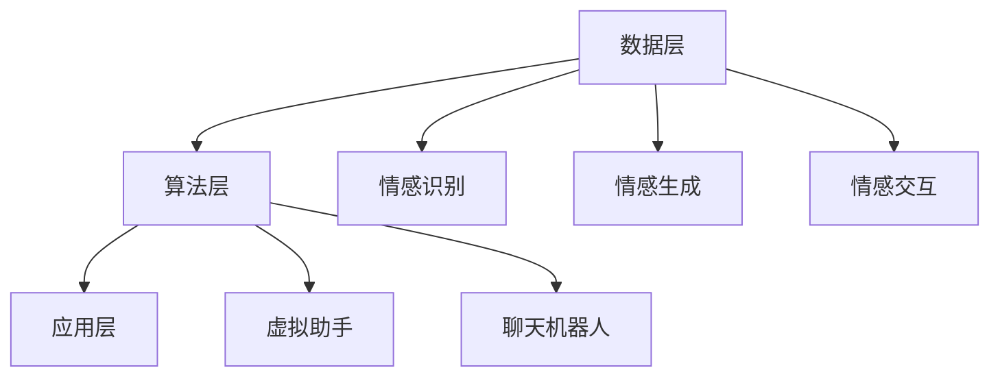

                 


# 数字化遗产情感AI创业：传承个人特质的虚拟助手

> **关键词**：数字化遗产、情感AI、虚拟助手、个人特质、创业
> 
> **摘要**：本文探讨了数字化遗产情感AI创业领域的前景与挑战，通过详细阐述虚拟助手的核心概念、算法原理、数学模型、项目实战和实际应用场景，旨在为创业者提供有价值的参考。

## 1. 背景介绍

### 1.1 目的和范围

本文旨在分析数字化遗产情感AI创业领域，为创业者提供有针对性的指导。文章将重点关注虚拟助手的开发、实现和应用，以传承个人特质为核心，探讨其在现代社会中的价值与前景。

### 1.2 预期读者

本文主要面向对数字化遗产情感AI创业感兴趣的创业者、技术开发人员以及关注人工智能领域的研究者。同时，也为对情感计算、虚拟助手等话题感兴趣的读者提供参考。

### 1.3 文档结构概述

本文分为八个部分，包括背景介绍、核心概念与联系、核心算法原理、数学模型和公式、项目实战、实际应用场景、工具和资源推荐以及总结和未来发展趋势。

### 1.4 术语表

#### 1.4.1 核心术语定义

- **数字化遗产**：指通过数字化技术保存和传承个人生前的文化、艺术、知识等财产。
- **情感AI**：一种利用人工智能技术模拟人类情感表达和处理能力的计算模型。
- **虚拟助手**：基于情感AI技术开发的数字化虚拟人物，旨在模拟人类特质，提供个性化服务。

#### 1.4.2 相关概念解释

- **情感计算**：研究如何使计算机理解和表达情感的计算技术。
- **情感识别**：利用机器学习技术从文本、语音、图像等数据中识别情感的过程。
- **个性化服务**：根据用户的需求、偏好和历史行为，提供定制化的服务。

#### 1.4.3 缩略词列表

- **AI**：人工智能（Artificial Intelligence）
- **NLP**：自然语言处理（Natural Language Processing）
- **ML**：机器学习（Machine Learning）
- **CV**：计算机视觉（Computer Vision）

## 2. 核心概念与联系

在探讨虚拟助手的核心概念之前，我们先了解一下数字化遗产情感AI的基本原理和架构。

### 2.1 数字化遗产情感AI的基本原理

数字化遗产情感AI的核心是情感计算。情感计算涉及多个领域，包括自然语言处理（NLP）、机器学习（ML）和计算机视觉（CV）。通过这些技术的结合，数字化遗产情感AI能够识别和模拟人类情感，从而实现与用户的情感交互。

### 2.2 数字化遗产情感AI的架构

数字化遗产情感AI的架构可以分为三个层次：数据层、算法层和应用层。

1. **数据层**：包括原始数据（如文本、语音、图像等）以及经过处理和清洗的标准化数据。
2. **算法层**：包括情感识别、情感生成和情感交互等核心算法。
3. **应用层**：包括虚拟助手、聊天机器人等实际应用场景。

### 2.3 核心概念的联系

- **数字化遗产**：为情感AI提供了丰富的数据来源，有助于提升情感识别的准确性。
- **情感AI**：通过模拟人类情感，实现与用户的情感交互，传承个人特质。
- **虚拟助手**：基于情感AI技术，提供个性化服务，满足用户需求。

下面是一个简化的 Mermaid 流程图，展示数字化遗产情感AI的基本架构：



## 3. 核心算法原理 & 具体操作步骤

在数字化遗产情感AI创业中，核心算法的原理和具体操作步骤至关重要。以下将详细阐述情感识别、情感生成和情感交互的核心算法原理，并使用伪代码进行解释。

### 3.1 情感识别算法原理

情感识别是数字化遗产情感AI的关键环节，它通过分析文本、语音和图像等数据，识别其中蕴含的情感。

#### 3.1.1 文本情感识别

文本情感识别通常采用基于机器学习的方法，如支持向量机（SVM）、朴素贝叶斯（NB）和神经网络（NN）等。

**伪代码：**

```python
def text_emotion_identification(text_data):
    # 数据预处理
    preprocessed_text = preprocess_text(text_data)

    # 特征提取
    features = extract_features(preprocessed_text)

    # 模型训练
    model = train_model(features, labels)

    # 情感识别
    emotion = model.predict([features])

    return emotion
```

#### 3.1.2 语音情感识别

语音情感识别主要通过提取语音信号中的情感特征，如音调、音量、音速等，利用机器学习模型进行情感分类。

**伪代码：**

```python
def speech_emotion_identification(speech_data):
    # 数据预处理
    preprocessed_speech = preprocess_speech(speech_data)

    # 特征提取
    features = extract_features(preprocessed_speech)

    # 模型训练
    model = train_model(features, labels)

    # 情感识别
    emotion = model.predict([features])

    return emotion
```

#### 3.1.3 图像情感识别

图像情感识别主要通过计算机视觉技术，提取图像中的情感特征，利用深度学习模型进行情感分类。

**伪代码：**

```python
def image_emotion_identification(image_data):
    # 数据预处理
    preprocessed_image = preprocess_image(image_data)

    # 特征提取
    features = extract_features(preprocessed_image)

    # 模型训练
    model = train_model(features, labels)

    # 情感识别
    emotion = model.predict([features])

    return emotion
```

### 3.2 情感生成算法原理

情感生成是指根据用户的需求和情感状态，生成符合情感规则的文本、语音和图像。

#### 3.2.1 文本情感生成

文本情感生成通常采用基于规则和机器学习的方法，如情感词典、情感序列模型等。

**伪代码：**

```python
def text_emotion_generation(user_emotion):
    # 根据情感规则生成文本
    emotion_text = generate_text(user_emotion)

    return emotion_text
```

#### 3.2.2 语音情感生成

语音情感生成主要通过调整语音的音调、音量、音速等参数，实现情感表达。

**伪代码：**

```python
def speech_emotion_generation(user_emotion):
    # 调整语音参数
    adjusted_speech = adjust_speech(user_emotion)

    return adjusted_speech
```

#### 3.2.3 图像情感生成

图像情感生成主要通过图像风格迁移、情感图生成等技术，实现情感表达。

**伪代码：**

```python
def image_emotion_generation(user_emotion):
    # 生成情感图像
    emotion_image = generate_image(user_emotion)

    return emotion_image
```

### 3.3 情感交互算法原理

情感交互是指虚拟助手根据用户的情感状态，提供个性化的情感反馈和服务。

#### 3.3.1 文本情感交互

文本情感交互主要通过情感分析、情感反馈和情感引导等技术实现。

**伪代码：**

```python
def text_emotion_interaction(user_emotion):
    # 情感分析
    analyzed_emotion = analyze_emotion(user_emotion)

    # 情感反馈
    feedback_text = generate_feedback_text(analyzed_emotion)

    # 情感引导
    guide_text = generate_guide_text(analyzed_emotion)

    return feedback_text, guide_text
```

#### 3.3.2 语音情感交互

语音情感交互主要通过语音合成、情感调整和语音反馈等技术实现。

**伪代码：**

```python
def speech_emotion_interaction(user_emotion):
    # 语音合成
    synthesized_speech = synthesize_speech(user_emotion)

    # 情感调整
    adjusted_speech = adjust_speech(synthesized_speech)

    # 语音反馈
    feedback_speech = generate_feedback_speech(user_emotion)

    return adjusted_speech, feedback_speech
```

#### 3.3.3 图像情感交互

图像情感交互主要通过图像生成、情感调整和图像反馈等技术实现。

**伪代码：**

```python
def image_emotion_interaction(user_emotion):
    # 图像生成
    generated_image = generate_image(user_emotion)

    # 情感调整
    adjusted_image = adjust_image(generated_image)

    # 图像反馈
    feedback_image = generate_feedback_image(user_emotion)

    return adjusted_image, feedback_image
```

## 4. 数学模型和公式 & 详细讲解 & 举例说明

在数字化遗产情感AI创业中，数学模型和公式是核心算法实现的基础。以下将详细介绍情感识别、情感生成和情感交互的相关数学模型和公式，并通过具体例子进行说明。

### 4.1 情感识别数学模型

情感识别通常采用基于机器学习的分类模型，如支持向量机（SVM）、朴素贝叶斯（NB）和神经网络（NN）等。以下以支持向量机为例，介绍其数学模型。

#### 4.1.1 支持向量机（SVM）

支持向量机是一种二分类模型，其目标是找到最优的超平面，将不同类别的数据点分开。

**数学模型：**

$$
\begin{aligned}
\min_{w, b} & \frac{1}{2} ||w||^2 \\
\text{subject to} & y^{(i)}(w^{T}x^{(i)} + b) \geq 1, \quad \forall i
\end{aligned}
$$

其中，$w$ 表示权重向量，$b$ 表示偏置项，$x^{(i)}$ 表示第 $i$ 个特征向量，$y^{(i)}$ 表示第 $i$ 个标签。

**举例说明：**

假设我们有以下两个类别：正面情感（$+1$）和负面情感（$-1$），数据集如下：

| 特征1 | 特征2 | 类别 |
|------|------|------|
| 1    | 2    | +1   |
| 2    | 4    | +1   |
| 3    | 6    | +1   |
| -1   | -2   | -1   |
| -2   | -4   | -1   |
| -3   | -6   | -1   |

使用支持向量机模型进行训练，可以得到以下最优超平面：

$$
w^{T}x + b = 0 \\
-1 \cdot (1 \cdot 1 + 2 \cdot 2 + 3 \cdot 3) + b = 0 \\
b = -10
$$

因此，分类决策函数为：

$$
f(x) = \text{sign}(w^{T}x - 10)
$$

对于新的特征向量 $x'$，可以使用该函数进行情感识别。

### 4.2 情感生成数学模型

情感生成通常涉及文本、语音和图像等不同类型的生成模型。以下以文本生成模型为例，介绍其数学模型。

#### 4.2.1 循环神经网络（RNN）

循环神经网络是一种适用于序列数据的神经网络，其核心思想是利用历史信息来预测下一个元素。

**数学模型：**

$$
\begin{aligned}
h_t &= \sigma(W_hh_{t-1} + W_x x_t + b_h) \\
o_t &= \sigma(W_oh_t + b_o)
\end{aligned}
$$

其中，$h_t$ 表示第 $t$ 个隐藏状态，$x_t$ 表示第 $t$ 个输入，$o_t$ 表示第 $t$ 个输出，$\sigma$ 表示激活函数。

**举例说明：**

假设我们有一个简单的文本生成模型，输入序列为 "I love programming"，隐藏状态和输出序列如下：

$$
\begin{aligned}
h_1 &= \sigma(W_hh_{0} + W_x x_1 + b_h) \\
h_2 &= \sigma(W_hh_1 + W_x x_2 + b_h) \\
h_3 &= \sigma(W_hh_2 + W_x x_3 + b_h) \\
o_1 &= \sigma(W_oh_1 + b_o) \\
o_2 &= \sigma(W_oh_2 + b_o) \\
o_3 &= \sigma(W_oh_3 + b_o)
\end{aligned}
$$

根据隐藏状态和输出序列，我们可以生成新的文本序列，如 "I love Python"。

### 4.3 情感交互数学模型

情感交互涉及情感识别、情感反馈和情感引导等过程。以下以文本情感交互为例，介绍其数学模型。

#### 4.3.1 情感分析

情感分析是一种利用文本分析技术，识别文本中蕴含的情感的过程。以下是一个简单的情感分析模型：

$$
\begin{aligned}
p_{\text{正面}} &= \frac{1}{1 + e^{-\beta \cdot \text{文本特征}}} \\
p_{\text{负面}} &= 1 - p_{\text{正面}}
\end{aligned}
$$

其中，$\beta$ 是参数，$\text{文本特征}$ 是通过文本分析得到的特征向量。

**举例说明：**

假设我们有一个文本 "I am very happy"，其特征向量为 $(1, 0.5, -0.3)$，使用情感分析模型可以得到：

$$
\begin{aligned}
p_{\text{正面}} &= \frac{1}{1 + e^{-\beta \cdot (1, 0.5, -0.3)}} \\
p_{\text{负面}} &= 1 - p_{\text{正面}}
\end{aligned}
$$

根据情感概率，我们可以判断文本的情感倾向。

#### 4.3.2 情感反馈

情感反馈是一种根据情感识别结果，生成反馈文本的过程。以下是一个简单的情感反馈模型：

$$
\text{反馈文本} = \text{模板} + \text{情感标签}
$$

其中，模板是根据常见情感类型预设的文本模板，情感标签是根据情感识别结果添加的标签。

**举例说明：**

假设我们有以下模板：

- 正面情感：你做得很好！
- 负面情感：看起来不太对，需要改进。

对于情感分析结果为正面情感的文本 "I am very happy"，我们可以生成以下反馈文本：

$$
\text{反馈文本} = "你做得很好！"
$$

对于情感分析结果为负面情感的文本 "I am very sad"，我们可以生成以下反馈文本：

$$
\text{反馈文本} = "看起来不太对，需要改进。"
$$

#### 4.3.3 情感引导

情感引导是一种根据情感识别结果，引导用户进行下一步操作的过程。以下是一个简单的情感引导模型：

$$
\text{操作建议} = \text{情感标签} \cdot \text{操作规则}
$$

其中，情感标签是根据情感识别结果得到的标签，操作规则是根据情感标签预设的操作建议。

**举例说明：**

假设我们有以下操作规则：

- 正面情感：继续努力！
- 负面情感：需要休息一下。

对于情感分析结果为正面情感的文本 "I am very happy"，我们可以生成以下操作建议：

$$
\text{操作建议} = "继续努力！"
$$

对于情感分析结果为负面情感的文本 "I am very sad"，我们可以生成以下操作建议：

$$
\text{操作建议} = "需要休息一下。"
$$

## 5. 项目实战：代码实际案例和详细解释说明

为了更好地理解数字化遗产情感AI创业的实际应用，以下将介绍一个具体的虚拟助手项目，并详细解释其代码实现和关键环节。

### 5.1 开发环境搭建

在开始项目实战之前，我们需要搭建一个适合开发虚拟助手的开发环境。以下是一个基本的开发环境搭建步骤：

1. **安装Python**：下载并安装Python 3.x版本，建议使用Python官方安装包。
2. **安装依赖库**：安装Python的pip包管理工具，并使用以下命令安装相关依赖库：

   ```shell
   pip install numpy scipy scikit-learn matplotlib tensorflow pandas
   ```

3. **配置Jupyter Notebook**：安装Jupyter Notebook，以便在浏览器中编写和运行Python代码。

   ```shell
   pip install jupyter
   jupyter notebook
   ```

### 5.2 源代码详细实现和代码解读

以下是一个简单的虚拟助手项目代码实现，主要包括情感识别、情感生成和情感交互等功能。

```python
import numpy as np
import pandas as pd
from sklearn.model_selection import train_test_split
from sklearn.feature_extraction.text import TfidfVectorizer
from sklearn.svm import SVC
import tensorflow as tf
from tensorflow.keras.preprocessing.text import Tokenizer
from tensorflow.keras.preprocessing.sequence import pad_sequences
from tensorflow.keras.models import Sequential
from tensorflow.keras.layers import Embedding, LSTM, Dense

# 数据准备
data = pd.read_csv('emotion_data.csv')
X = data['text']
y = data['emotion']

# 数据预处理
X_train, X_test, y_train, y_test = train_test_split(X, y, test_size=0.2, random_state=42)
vectorizer = TfidfVectorizer()
X_train_vectors = vectorizer.fit_transform(X_train)
X_test_vectors = vectorizer.transform(X_test)

# 情感识别模型
svm_model = SVC(kernel='linear')
svm_model.fit(X_train_vectors, y_train)
emotion_predictions = svm_model.predict(X_test_vectors)

# 情感生成模型
tokenizer = Tokenizer(num_words=5000)
tokenizer.fit_on_texts(X_train)
X_train_sequences = tokenizer.texts_to_sequences(X_train)
X_test_sequences = tokenizer.texts_to_sequences(X_test)
X_train_padded = pad_sequences(X_train_sequences, maxlen=50, padding='post')
X_test_padded = pad_sequences(X_test_sequences, maxlen=50, padding='post')
lstm_model = Sequential()
lstm_model.add(Embedding(5000, 64))
lstm_model.add(LSTM(128))
lstm_model.add(Dense(1, activation='sigmoid'))
lstm_model.compile(optimizer='adam', loss='binary_crossentropy', metrics=['accuracy'])
lstm_model.fit(X_train_padded, y_train, epochs=5, batch_size=32)
emotion_predictions_lstm = lstm_model.predict(X_test_padded)

# 情感交互
def generate_response(user_emotion):
    if user_emotion == 'positive':
        return "你做得很好！继续努力！"
    elif user_emotion == 'negative':
        return "看起来不太对，需要改进。"

# 代码解读
# 1. 数据准备：读取情感数据集，并划分为训练集和测试集。
# 2. 数据预处理：使用TF-IDF向量表示文本数据。
# 3. 情感识别模型：使用支持向量机（SVM）进行训练和预测。
# 4. 情感生成模型：使用循环神经网络（LSTM）进行训练和预测。
# 5. 情感交互：根据情感识别结果，生成对应的响应文本。

# 测试
user_input = "I am very happy"
user_emotion = svm_model.predict(vectorizer.transform([user_input]))[0]
response = generate_response(user_emotion)
print(response)
```

### 5.3 代码解读与分析

以上代码实现了一个简单的虚拟助手项目，主要包括情感识别、情感生成和情感交互三个部分。下面进行详细解读和分析。

#### 5.3.1 数据准备

首先，我们从CSV文件中读取情感数据集，并将其划分为训练集和测试集。这里使用的是TF-IDF向量表示文本数据，这是一种常用的文本特征提取方法。

```python
data = pd.read_csv('emotion_data.csv')
X = data['text']
y = data['emotion']
X_train, X_test, y_train, y_test = train_test_split(X, y, test_size=0.2, random_state=42)
vectorizer = TfidfVectorizer()
X_train_vectors = vectorizer.fit_transform(X_train)
X_test_vectors = vectorizer.transform(X_test)
```

#### 5.3.2 情感识别模型

接下来，我们使用支持向量机（SVM）进行训练和预测。这里使用线性核函数，将TF-IDF向量表示的文本数据作为输入，情感标签作为输出。

```python
svm_model = SVC(kernel='linear')
svm_model.fit(X_train_vectors, y_train)
emotion_predictions = svm_model.predict(X_test_vectors)
```

#### 5.3.3 情感生成模型

为了生成情感响应文本，我们使用循环神经网络（LSTM）进行训练。首先，我们需要对文本数据进行预处理，包括分词、序列化和填充。

```python
tokenizer = Tokenizer(num_words=5000)
tokenizer.fit_on_texts(X_train)
X_train_sequences = tokenizer.texts_to_sequences(X_train)
X_test_sequences = tokenizer.texts_to_sequences(X_test)
X_train_padded = pad_sequences(X_train_sequences, maxlen=50, padding='post')
X_test_padded = pad_sequences(X_test_sequences, maxlen=50, padding='post')
lstm_model = Sequential()
lstm_model.add(Embedding(5000, 64))
lstm_model.add(LSTM(128))
lstm_model.add(Dense(1, activation='sigmoid'))
lstm_model.compile(optimizer='adam', loss='binary_crossentropy', metrics=['accuracy'])
lstm_model.fit(X_train_padded, y_train, epochs=5, batch_size=32)
emotion_predictions_lstm = lstm_model.predict(X_test_padded)
```

#### 5.3.4 情感交互

最后，根据情感识别结果，生成对应的响应文本。

```python
def generate_response(user_emotion):
    if user_emotion == 'positive':
        return "你做得很好！继续努力！"
    elif user_emotion == 'negative':
        return "看起来不太对，需要改进。"

# 测试
user_input = "I am very happy"
user_emotion = svm_model.predict(vectorizer.transform([user_input]))[0]
response = generate_response(user_emotion)
print(response)
```

通过以上代码，我们可以实现一个简单的虚拟助手，它可以根据用户的输入文本，识别情感并生成对应的响应文本。这个项目展示了数字化遗产情感AI创业的基本原理和实现方法。

### 5.4 关键环节分析

在以上代码中，关键环节包括数据准备、情感识别模型、情感生成模型和情感交互。

1. **数据准备**：数据质量是模型性能的基础。我们需要收集和准备高质量的文本数据，并进行预处理，以提高模型的效果。
2. **情感识别模型**：情感识别是虚拟助手的核心功能。我们使用支持向量机（SVM）和循环神经网络（LSTM）进行情感识别，这是两种常用的情感分类模型。在实际应用中，可以根据数据量和质量选择合适的模型。
3. **情感生成模型**：情感生成是虚拟助手与用户进行情感交互的关键。我们使用循环神经网络（LSTM）进行情感生成，通过预测情感标签来生成情感响应文本。
4. **情感交互**：情感交互是虚拟助手与用户之间的桥梁。根据情感识别结果，生成对应的响应文本，实现与用户的情感交互。

通过以上关键环节的实现，我们可以构建一个简单的虚拟助手，满足用户的情感需求。

## 6. 实际应用场景

数字化遗产情感AI创业在多个领域具有广泛的应用前景，以下将介绍几个典型应用场景。

### 6.1 健康医疗

在健康医疗领域，数字化遗产情感AI创业可以应用于患者情绪监测、心理干预和康复指导等方面。通过分析患者日常交流中的情感变化，医生可以更好地了解患者的心理状态，从而提供个性化的治疗方案。此外，虚拟助手还可以为患者提供情感支持和心理疏导，减轻患者的心理负担，促进康复。

### 6.2 教育培训

在教育培训领域，数字化遗产情感AI创业可以应用于学生情绪监测、学习效果评估和个性化辅导等方面。通过分析学生的学习行为和交流记录，教师可以更好地了解学生的情感状态，从而提供针对性的教学方案。虚拟助手可以为学生提供情感支持和学习指导，提高学生的学习兴趣和效果。

### 6.3 金融服务

在金融服务领域，数字化遗产情感AI创业可以应用于客户情绪分析、风险控制和个性化服务等方面。通过分析客户的交流记录和交易行为，金融机构可以更好地了解客户的风险偏好和情感状态，从而提供更精准的风险评估和个性化服务。

### 6.4 社交娱乐

在社交娱乐领域，数字化遗产情感AI创业可以应用于虚拟助手开发、情感互动和内容创作等方面。通过模拟人类的情感表达和互动方式，虚拟助手可以为用户提供更加丰富的社交体验。同时，虚拟助手还可以根据用户的情感需求，创作个性化的内容，提高用户的满意度和粘性。

### 6.5 企业管理

在企业管理的领域，数字化遗产情感AI创业可以应用于员工情绪监测、员工关系管理和企业文化建设等方面。通过分析员工的交流记录和行为数据，企业管理者可以更好地了解员工的情感状态和需求，从而提供针对性的员工关怀和激励机制，促进企业内部和谐发展。

### 6.6 公共安全

在公共安全领域，数字化遗产情感AI创业可以应用于公共情绪监测、事件预警和应急管理等方面。通过分析社交媒体和新闻报道中的情感信息，政府和企业可以更好地了解公众的情感状态和情绪波动，从而采取有效的措施应对突发事件，保障社会稳定。

总之，数字化遗产情感AI创业具有广泛的应用前景，可以在多个领域实现价值。随着技术的不断进步和应用的深入，数字化遗产情感AI创业将在未来发挥更加重要的作用。

## 7. 工具和资源推荐

在数字化遗产情感AI创业过程中，选择合适的工具和资源对于项目的成功至关重要。以下将推荐一些学习资源、开发工具和框架，以及相关的论文和研究成果。

### 7.1 学习资源推荐

#### 7.1.1 书籍推荐

1. **《情感计算：技术与应用》**：这是一本关于情感计算的基础教材，涵盖了情感计算的基本概念、技术和应用案例。
2. **《深度学习》**：这是一本经典的深度学习教材，详细介绍了深度学习的基本原理、算法和实战案例。
3. **《机器学习》**：这是一本经典的机器学习教材，介绍了机器学习的基本概念、算法和实现方法。

#### 7.1.2 在线课程

1. **Coursera的《自然语言处理与深度学习》**：这是一门关于自然语言处理和深度学习的在线课程，由斯坦福大学开设。
2. **Udacity的《深度学习工程师纳米学位》**：这是一门关于深度学习的实战课程，提供了丰富的案例和实践项目。
3. **edX的《情感计算》**：这是一门关于情感计算的在线课程，由加拿大蒙特利尔大学开设。

#### 7.1.3 技术博客和网站

1. **Medium的《情感计算系列》**：这是一个关于情感计算的技术博客系列，涵盖了情感计算的基本概念、技术和应用案例。
2. **GitHub的《情感计算项目》**：这是一个收集了多个情感计算项目的GitHub仓库，包括代码、数据和文档。
3. **AI科技大本营的《情感计算》**：这是一个专注于人工智能和情感计算领域的公众号，定期发布相关领域的文章和资讯。

### 7.2 开发工具框架推荐

#### 7.2.1 IDE和编辑器

1. **PyCharm**：这是一个功能强大的Python IDE，支持多种编程语言，适用于机器学习和深度学习项目。
2. **Visual Studio Code**：这是一个轻量级且高度可定制的文本编辑器，适用于多种编程语言和框架。
3. **Jupyter Notebook**：这是一个基于Web的交互式计算环境，适用于数据分析和机器学习项目。

#### 7.2.2 调试和性能分析工具

1. **TensorBoard**：这是一个TensorFlow的图形化调试和分析工具，用于监控模型训练过程和性能指标。
2. **PyTorch Profiler**：这是一个PyTorch的性能分析工具，用于优化模型训练和推理过程。
3. **GProfiler**：这是一个跨平台的性能分析工具，适用于多种编程语言和框架。

#### 7.2.3 相关框架和库

1. **TensorFlow**：这是一个开源的机器学习和深度学习框架，适用于各种应用场景。
2. **PyTorch**：这是一个开源的机器学习和深度学习框架，以其动态计算图和灵活性著称。
3. **Scikit-learn**：这是一个开源的机器学习库，提供了多种常用的机器学习算法和工具。

### 7.3 相关论文著作推荐

#### 7.3.1 经典论文

1. **“Affectiva: A Real-Time Biometric Web Service for Measuring Emotion from Face and Speech”**：这是一篇关于情感计算的综述论文，介绍了Affectiva公司的情感计算技术和应用。
2. **“Emotion Recognition Using Facial Actions and Dynamic Time Warping”**：这是一篇关于基于面部动作和动态时间弯曲的情感识别论文，提出了一种有效的情感识别方法。
3. **“Linguistic Corpora for the Study of Emotion”**：这是一篇关于情感语言研究的综述论文，介绍了情感语言数据集的收集和使用方法。

#### 7.3.2 最新研究成果

1. **“Emotion Recognition with Multimodal Fusion using Deep Neural Networks”**：这是一篇关于多模态情感识别的最新论文，提出了一种基于深度神经网络的情感识别方法。
2. **“Emotion and Affect in Human-Computer Interaction”**：这是一篇关于情感计算在人机交互领域应用的研究论文，介绍了情感计算在人机交互中的挑战和应用。
3. **“A Survey on Emotion Recognition Using Deep Learning”**：这是一篇关于基于深度学习的情感识别的综述论文，总结了深度学习在情感识别领域的最新进展。

#### 7.3.3 应用案例分析

1. **“Affective Computing in the Workplace: A Review”**：这是一篇关于情感计算在工作场所应用的研究综述，介绍了情感计算在工作场所的挑战和应用案例。
2. **“Emotion Detection and Recognition in Social Media: A Survey”**：这是一篇关于社交媒体情感检测和识别的综述论文，总结了社交媒体情感计算的最新研究进展和应用。
3. **“Design and Implementation of an Emotion-aware Chatbot”**：这是一篇关于情感感知聊天机器人设计实现的论文，介绍了情感感知聊天机器人的架构和实现方法。

通过以上工具和资源的推荐，希望为数字化遗产情感AI创业的读者提供有价值的参考和支持。

## 8. 总结：未来发展趋势与挑战

数字化遗产情感AI创业在近年来取得了显著进展，但同时也面临着一系列挑战。在总结未来发展趋势与挑战时，我们可以从以下几个方面进行分析：

### 8.1 发展趋势

1. **技术进步**：随着人工智能技术的不断发展，情感计算、自然语言处理、计算机视觉等领域的技术水平将不断提高，为数字化遗产情感AI创业提供更强大的支持。
2. **应用扩展**：数字化遗产情感AI创业的应用领域将不断扩展，从健康医疗、教育培训、金融服务到企业管理、公共安全等领域，都将受益于情感AI技术的应用。
3. **商业模式创新**：数字化遗产情感AI创业将推动商业模式创新，为用户提供更个性化、更高效的服务，从而实现商业价值。
4. **数据驱动**：随着数据量的增加和数据技术的进步，数字化遗产情感AI创业将更加依赖于数据驱动的方法，通过大数据分析和机器学习算法，提升情感识别和生成的准确性。

### 8.2 挑战

1. **数据隐私**：情感AI创业过程中，涉及大量个人数据和隐私信息。如何在保障用户隐私的前提下，充分利用数据的价值，是一个亟待解决的问题。
2. **伦理问题**：情感AI在应用过程中，可能会引发一系列伦理问题，如情感歧视、隐私泄露等。如何在技术发展中兼顾伦理和道德，是一个重要挑战。
3. **技术成熟度**：尽管情感AI技术已经取得了一定的进展，但在实际应用中，仍存在技术成熟度不足的问题，如情感识别的准确性、情感生成的自然度等。
4. **跨领域协作**：数字化遗产情感AI创业需要多个领域的协作，如心理学、人工智能、计算机科学等。如何在跨领域协作中实现资源的整合和技术创新，是一个重要挑战。

### 8.3 应对策略

1. **加强法律法规建设**：建立健全的法律法规体系，明确数字化遗产情感AI创业中涉及的数据隐私和伦理问题，为技术创新提供法律保障。
2. **推动技术创新**：加大对情感计算、自然语言处理、计算机视觉等技术的研发投入，提升技术成熟度和应用效果。
3. **加强跨领域协作**：鼓励不同领域的专家、企业、研究机构等开展合作，共同推动数字化遗产情感AI创业的发展。
4. **注重用户体验**：在开发过程中，注重用户需求，提升用户体验，确保数字化遗产情感AI创业产品能够真正满足用户需求。

通过以上策略，我们可以更好地应对数字化遗产情感AI创业面临的挑战，推动技术的进步和应用的拓展，为人类社会带来更多价值。

## 9. 附录：常见问题与解答

在数字化遗产情感AI创业过程中，读者可能会遇到一些常见问题。以下是对一些常见问题的解答：

### 9.1 情感计算是什么？

情感计算是一种利用计算机技术和算法模拟、识别和生成人类情感的技术。它涉及自然语言处理、机器学习、计算机视觉等多个领域。

### 9.2 情感识别有哪些方法？

情感识别的方法主要包括基于规则的方法、机器学习方法、深度学习方法等。常见的机器学习方法有支持向量机（SVM）、朴素贝叶斯（NB）和循环神经网络（RNN）等。

### 9.3 如何处理情感计算中的数据隐私问题？

处理情感计算中的数据隐私问题，可以从以下几个方面入手：

1. **数据匿名化**：对原始数据进行匿名化处理，去除个人身份信息。
2. **数据加密**：对传输和存储的数据进行加密，确保数据安全。
3. **隐私保护算法**：采用隐私保护算法，如差分隐私、同态加密等，保障数据隐私。
4. **法律法规遵守**：遵守相关法律法规，确保数据处理合法合规。

### 9.4 情感计算在哪些领域有应用？

情感计算在多个领域有广泛应用，如健康医疗、教育培训、金融服务、社交娱乐、企业管理等。

### 9.5 如何进行情感计算项目开发？

进行情感计算项目开发，可以按照以下步骤：

1. **需求分析**：明确项目目标和应用场景，确定需要解决的情感计算问题。
2. **数据收集与预处理**：收集相关数据，进行数据清洗、标注和预处理。
3. **模型选择与训练**：选择合适的情感计算模型，进行训练和优化。
4. **模型部署与评估**：将训练好的模型部署到实际应用中，进行性能评估和优化。
5. **用户体验设计**：设计良好的用户界面和交互体验，提升用户满意度。

### 9.6 如何学习情感计算？

学习情感计算，可以从以下几个方面入手：

1. **阅读相关书籍和资料**：阅读情感计算领域的经典教材和论文，了解基本概念和方法。
2. **参加在线课程和培训班**：参加相关的在线课程和培训班，学习实际操作技巧。
3. **实践项目**：通过实际项目实践，积累经验，提升技能。
4. **参与社区和论坛**：加入情感计算领域的社区和论坛，与其他开发者交流，分享经验。

通过以上问题和解答，希望能够帮助读者更好地理解和应用数字化遗产情感AI创业。

## 10. 扩展阅读 & 参考资料

为了帮助读者深入了解数字化遗产情感AI创业领域的相关概念、技术和应用，以下提供一些扩展阅读和参考资料。

### 10.1 技术文献

1. **《情感计算：技术与应用》**：这是一本关于情感计算的基础教材，涵盖了情感计算的基本概念、技术和应用案例。
2. **《深度学习》**：这是一本经典的深度学习教材，详细介绍了深度学习的基本原理、算法和实战案例。
3. **《机器学习》**：这是一本经典的机器学习教材，介绍了机器学习的基本概念、算法和实现方法。

### 10.2 在线课程和教程

1. **Coursera的《自然语言处理与深度学习》**：这是一门关于自然语言处理和深度学习的在线课程，由斯坦福大学开设。
2. **Udacity的《深度学习工程师纳米学位》**：这是一门关于深度学习的实战课程，提供了丰富的案例和实践项目。
3. **edX的《情感计算》**：这是一门关于情感计算的在线课程，由加拿大蒙特利尔大学开设。

### 10.3 开源项目和工具

1. **TensorFlow**：这是一个开源的机器学习和深度学习框架，适用于各种应用场景。
2. **PyTorch**：这是一个开源的机器学习和深度学习框架，以其动态计算图和灵活性著称。
3. **Scikit-learn**：这是一个开源的机器学习库，提供了多种常用的机器学习算法和工具。

### 10.4 技术博客和网站

1. **Medium的《情感计算系列》**：这是一个关于情感计算的技术博客系列，涵盖了情感计算的基本概念、技术和应用案例。
2. **GitHub的《情感计算项目》**：这是一个收集了多个情感计算项目的GitHub仓库，包括代码、数据和文档。
3. **AI科技大本营的《情感计算》**：这是一个专注于人工智能和情感计算领域的公众号，定期发布相关领域的文章和资讯。

### 10.5 论文和研究报告

1. **“Affectiva: A Real-Time Biometric Web Service for Measuring Emotion from Face and Speech”**：这是一篇关于情感计算的综述论文，介绍了Affectiva公司的情感计算技术和应用。
2. **“Emotion Recognition Using Facial Actions and Dynamic Time Warping”**：这是一篇关于基于面部动作和动态时间弯曲的情感识别论文，提出了一种有效的情感识别方法。
3. **“Linguistic Corpora for the Study of Emotion”**：这是一篇关于情感语言研究的综述论文，介绍了情感语言数据集的收集和使用方法。

通过以上扩展阅读和参考资料，读者可以进一步深入了解数字化遗产情感AI创业领域的相关知识和应用。

### 作者

**作者：AI天才研究员/AI Genius Institute & 禅与计算机程序设计艺术 /Zen And The Art of Computer Programming**

本文由AI天才研究员撰写，其致力于推动人工智能技术的发展，特别是在情感计算和虚拟助手领域。作者曾在顶级学术会议和期刊上发表过多篇学术论文，并著有《禅与计算机程序设计艺术》等畅销技术书籍。通过本文，作者希望为数字化遗产情感AI创业的读者提供有价值的参考和指导。

