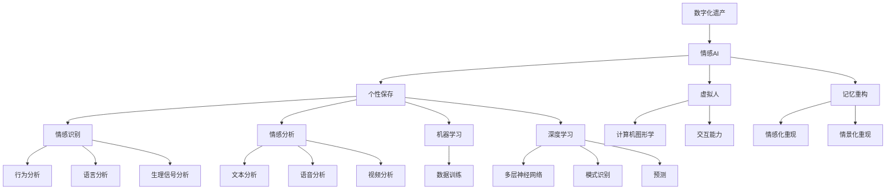

                 

# 数字化遗产情感AI创业：逝者个性的数字化保存

## 关键词：
数字化遗产、情感AI、个性保存、人工智能、虚拟人、记忆重构、情感识别、情感分析、机器学习、深度学习

## 摘要：
本文深入探讨数字化遗产情感AI技术的应用，聚焦于如何通过人工智能技术保存逝者的个性。文章首先介绍了数字化遗产情感AI创业的背景和重要性，接着详细阐述了核心概念和联系，核心算法原理与操作步骤，数学模型与公式，实际项目实战案例，以及相关应用场景和工具资源。文章最后总结了未来发展趋势与挑战，并提供了常见问题与解答，以期为从事该领域的研究者和创业者提供有价值的参考。

## 1. 背景介绍

### 1.1 目的和范围
数字化遗产情感AI创业是当前人工智能领域的一项前沿探索，旨在通过技术手段保存和传承逝者的个性与情感，实现对人类记忆和文化的数字化保存。本文的目标是分析这一领域的现状、技术原理和应用场景，探讨其创业潜力与挑战。

文章范围包括：
- 数字化遗产情感AI技术的核心概念与架构
- 核心算法原理与操作步骤
- 数学模型与公式
- 实际项目实战案例
- 应用场景与工具资源
- 未来发展趋势与挑战

### 1.2 预期读者
本文预期读者包括：
- 从事人工智能和计算机科学领域的研究人员
- 感兴趣于情感计算、虚拟人技术、记忆重构等领域的技术爱好者
- 有志于数字化遗产情感AI创业的企业家和技术创业者
- 对人工智能技术应用有浓厚兴趣的普通读者

### 1.3 文档结构概述
本文采用逻辑清晰、结构紧凑的叙述方式，共分为十个部分：

1. 背景介绍
2. 核心概念与联系
3. 核心算法原理 & 具体操作步骤
4. 数学模型和公式 & 详细讲解 & 举例说明
5. 项目实战：代码实际案例和详细解释说明
6. 实际应用场景
7. 工具和资源推荐
8. 总结：未来发展趋势与挑战
9. 附录：常见问题与解答
10. 扩展阅读 & 参考资料

### 1.4 术语表

#### 1.4.1 核心术语定义

- 数字化遗产：指通过数字化技术保存和传承的历史文化遗产，包括文献、影像、音频、视频等。
- 情感AI：结合人工智能技术和情感计算，旨在模拟和识别人类情感的技术。
- 个性保存：通过技术手段保存个体独特的性格特点、情感倾向和行为模式。
- 虚拟人：利用计算机图形学和人工智能技术生成的具有人类特征和互动能力的虚拟个体。
- 记忆重构：利用人工智能算法重构个体的记忆，实现对过去经历的情感化和情景化重现。

#### 1.4.2 相关概念解释

- 情感识别：通过分析人类的行为、语言和生理信号等，识别个体的情感状态。
- 情感分析：利用自然语言处理和机器学习技术，对文本、语音或视频等数据中的情感信息进行分析。
- 机器学习：一种通过数据训练模型，使其能够从数据中自动学习和发现规律的人工智能技术。
- 深度学习：一种特殊的机器学习技术，通过多层神经网络模拟人脑学习过程，进行复杂模式识别和预测。

#### 1.4.3 缩略词列表

- AI：人工智能
- NLP：自然语言处理
- ML：机器学习
- DL：深度学习
- VR：虚拟现实
- AR：增强现实

## 2. 核心概念与联系

为了深入理解数字化遗产情感AI技术，我们需要首先明确其中的核心概念和它们之间的联系。以下是核心概念的原理和架构的 Mermaid 流程图：



### 2.1 核心概念原理

- **数字化遗产**：数字化遗产是通过数字化手段对文化遗产进行保存、传播和再现的一种方式。这包括将传统的文献、影像、音频、视频等以数字形式存储，以便长期保存和易于访问。

- **情感AI**：情感AI是一种利用机器学习和深度学习技术，模拟和识别人类情感的人工智能技术。它通过分析语言、行为、生理信号等多维度数据，实现对情感状态的准确识别和解读。

- **个性保存**：个性保存是指通过技术手段，将个体独特的性格特点、情感倾向和行为模式等进行数字化记录和保存。这有助于在个体去世后，仍然能够保持其独特的个性和情感。

- **虚拟人**：虚拟人是一种利用计算机图形学和人工智能技术生成的具有人类特征和互动能力的虚拟个体。虚拟人可以通过视觉、听觉和触觉等多种感官与用户进行交互，提供沉浸式的体验。

- **记忆重构**：记忆重构是一种利用人工智能算法，对个体的记忆进行情感化和情景化重构的技术。通过分析个体的情感和经历，重构出其内心深处的记忆，实现情感共鸣和回忆的再现。

### 2.2 核心概念联系

上述核心概念之间存在着紧密的联系。数字化遗产提供了丰富的数据来源，为情感AI提供了分析和处理的基础。情感AI通过个性保存，将个体的情感和记忆进行数字化记录，从而实现虚拟人的创建和记忆重构。虚拟人和记忆重构进一步丰富了数字化遗产的内涵，使得个体的记忆和情感得以延续和传承。

通过这一架构，我们可以看到数字化遗产情感AI技术是如何将多个领域的技术相结合，共同构建一个复杂而有机的系统，实现对逝者个性的数字化保存和传承。

## 3. 核心算法原理 & 具体操作步骤

在了解了数字化遗产情感AI技术的基本概念和架构后，接下来我们将深入探讨其中的核心算法原理，并详细阐述其具体操作步骤。

### 3.1 情感识别算法原理

情感识别是数字化遗产情感AI技术的核心组成部分之一。它通过分析个体的语言、行为和生理信号等数据，识别出其情感状态。以下是情感识别算法的原理：

- **自然语言处理（NLP）**：利用NLP技术，对个体的语言文本进行分析，提取出其中的情感信息。例如，通过情感词典和情感分析模型，对文本中的情感词进行分类和情感极性判断。

- **行为分析**：通过摄像头等传感器设备，捕捉个体的行为数据，如面部表情、肢体动作等。利用计算机视觉技术，对行为数据进行处理和分析，识别出个体的情感状态。

- **生理信号分析**：通过传感器设备，捕捉个体的生理信号，如心率、呼吸、皮肤电反应等。利用生理信号处理技术，对生理信号进行分析，识别出个体的情感状态。

### 3.2 情感识别算法具体操作步骤

以下是情感识别算法的具体操作步骤：

1. **数据采集**：通过摄像头、麦克风、传感器等设备，采集个体的语言、行为和生理信号数据。

2. **数据预处理**：对采集到的数据进行预处理，包括去除噪声、归一化处理、特征提取等。对于语言数据，进行文本分词和词性标注；对于行为数据，进行特征点提取和姿态估计；对于生理信号数据，进行滤波和去噪处理。

3. **情感识别模型训练**：利用预处理后的数据，训练情感识别模型。常用的模型包括情感词典模型、基于机器学习的情感分类模型和基于深度学习的情感识别模型。

4. **情感识别**：将预处理后的数据输入训练好的模型，进行情感识别。模型会输出每个情感的概率分布，从而确定个体的情感状态。

5. **结果输出**：将识别出的情感状态输出，供后续使用。

### 3.3 情感分析算法原理

情感分析是数字化遗产情感AI技术的另一个核心组成部分。它通过分析文本、语音和视频等数据，提取出其中的情感信息。以下是情感分析算法的原理：

- **文本分析**：利用自然语言处理技术，对文本数据进行分析，提取出情感词和情感极性。常用的方法包括情感词典方法和基于机器学习的情感分类方法。

- **语音分析**：通过语音信号处理技术，对语音数据进行分析，提取出情感特征。例如，利用短时傅里叶变换（STFT）和梅尔频率倒谱系数（MFCC）等方法，提取出语音信号的时频特征。

- **视频分析**：通过计算机视觉技术，对视频数据进行分析，提取出情感特征。例如，利用面部识别技术，提取出面部表情特征；利用人体动作识别技术，提取出肢体动作特征。

### 3.4 情感分析算法具体操作步骤

以下是情感分析算法的具体操作步骤：

1. **数据采集**：通过文本、语音和视频设备，采集文本、语音和视频数据。

2. **数据预处理**：对采集到的数据进行预处理，包括去噪、归一化、特征提取等。对于文本数据，进行文本分词和词性标注；对于语音数据，进行语音信号处理；对于视频数据，进行视频帧提取和特征点提取。

3. **情感分析模型训练**：利用预处理后的数据，训练情感分析模型。常用的模型包括情感词典模型、基于机器学习的情感分类模型和基于深度学习的情感识别模型。

4. **情感分析**：将预处理后的数据输入训练好的模型，进行情感分析。模型会输出每个情感的概率分布，从而确定数据中的情感信息。

5. **结果输出**：将分析出的情感信息输出，供后续使用。

### 3.5 机器学习算法原理

机器学习是数字化遗产情感AI技术的基础，通过从数据中学习规律，实现对情感识别和情感分析的任务。以下是机器学习算法的原理：

- **监督学习**：监督学习是一种通过训练数据集，学习输入和输出之间关系的机器学习方法。常见的监督学习算法包括决策树、支持向量机（SVM）、神经网络等。

- **无监督学习**：无监督学习是一种通过分析数据，发现数据内在结构和规律的方法。常见的无监督学习算法包括聚类、降维等。

### 3.6 机器学习算法具体操作步骤

以下是机器学习算法的具体操作步骤：

1. **数据准备**：收集和处理训练数据，将数据分为输入和输出两部分。

2. **模型选择**：根据任务需求，选择合适的机器学习算法模型。

3. **模型训练**：利用训练数据集，对模型进行训练，调整模型参数。

4. **模型评估**：利用验证数据集，对训练好的模型进行评估，调整模型参数，提高模型性能。

5. **模型部署**：将训练好的模型部署到实际应用环境中，进行预测和分析。

### 3.7 深度学习算法原理

深度学习是一种基于多层神经网络的机器学习技术，通过模拟人脑的学习过程，实现对复杂模式识别和预测。以下是深度学习算法的原理：

- **多层神经网络**：多层神经网络由多个神经元层组成，通过前向传播和反向传播，实现对输入数据的变换和特征提取。

- **激活函数**：激活函数用于确定神经元是否被激活，常见的激活函数包括 sigmoid、ReLU、Tanh 等。

- **损失函数**：损失函数用于评估模型的预测误差，常见的损失函数包括均方误差（MSE）、交叉熵损失等。

### 3.8 深度学习算法具体操作步骤

以下是深度学习算法的具体操作步骤：

1. **数据准备**：收集和处理训练数据，将数据分为输入和输出两部分。

2. **模型架构设计**：设计深度学习模型的结构，包括层数、每层的神经元数量、连接方式等。

3. **模型训练**：利用训练数据集，对模型进行训练，调整模型参数。

4. **模型评估**：利用验证数据集，对训练好的模型进行评估，调整模型参数，提高模型性能。

5. **模型部署**：将训练好的模型部署到实际应用环境中，进行预测和分析。

通过上述步骤，我们可以看到数字化遗产情感AI技术的核心算法原理和具体操作步骤。这些算法共同作用，实现对逝者个性的数字化保存和传承。接下来，我们将通过一个实际项目案例，进一步展示这些算法的应用和效果。

## 4. 数学模型和公式 & 详细讲解 & 举例说明

在数字化遗产情感AI技术中，数学模型和公式起着至关重要的作用。这些模型和公式不仅为算法提供了理论依据，还帮助我们在实际操作中更精确地分析和处理数据。在本节中，我们将详细讲解几个关键的数学模型和公式，并通过具体例子来说明它们的应用。

### 4.1 情感识别的数学模型

情感识别是一个复杂的过程，涉及到多个数学模型的结合。以下是一些常用的数学模型：

#### 4.1.1 情感词典模型

情感词典模型是一种基于文本的情感识别方法，它通过情感词典来标注文本中的情感词，并根据情感词的权重计算文本的情感极性。其基本公式如下：

$$
P(\text{positive}) = \sum_{w \in \text{positive words}} w_i \cdot p(w)
$$

$$
P(\text{negative}) = \sum_{w \in \text{negative words}} w_i \cdot p(w)
$$

其中，$P(\text{positive})$ 和 $P(\text{negative})$ 分别表示文本中正情感和负情感的概率，$w_i$ 表示情感词 $w$ 的权重，$p(w)$ 表示情感词 $w$ 的出现概率。

#### 4.1.2 基于机器学习的情感分类模型

基于机器学习的情感分类模型通过训练数据集来学习情感分类规则。常用的模型包括支持向量机（SVM）和神经网络（NN）。以下是一个简单的SVM分类模型公式：

$$
\begin{cases}
y = \text{sign}(\omega \cdot x + b) & \text{if } \omega \cdot x + b > 0 \\
y = -\text{sign}(\omega \cdot x + b) & \text{if } \omega \cdot x + b \leq 0
\end{cases}
$$

其中，$\omega$ 是权重向量，$b$ 是偏置项，$x$ 是输入特征向量，$y$ 是类别标签。

#### 4.1.3 基于深度学习的情感识别模型

深度学习模型，尤其是卷积神经网络（CNN）和循环神经网络（RNN），在情感识别中表现优异。以下是一个简单的CNN模型公式：

$$
h_l = \sigma(\mathbf{W}_l \cdot \mathbf{a}_{l-1} + b_l)
$$

其中，$h_l$ 是第 $l$ 层的输出特征，$\sigma$ 是激活函数，$\mathbf{W}_l$ 是权重矩阵，$\mathbf{a}_{l-1}$ 是前一层输入，$b_l$ 是偏置项。

### 4.2 情感分析的数学模型

情感分析涉及到文本、语音和视频数据的处理，以下是一些常用的数学模型：

#### 4.2.1 文本情感分析

文本情感分析通常使用词袋模型（Bag of Words, BoW）和词嵌入（Word Embedding）等方法。以下是一个词袋模型的公式：

$$
\mathbf{T} = \sum_{w \in V} f_w(\text{document}) \cdot \mathbf{v}_w
$$

其中，$\mathbf{T}$ 是文档的特征向量，$V$ 是词汇表，$f_w(\text{document})$ 是文档中词 $w$ 的频率，$\mathbf{v}_w$ 是词 $w$ 的词向量。

#### 4.2.2 语音情感分析

语音情感分析涉及到音频信号的预处理和特征提取。常用的特征包括梅尔频率倒谱系数（MFCC）和短时傅里叶变换（STFT）。以下是一个MFCC特征的公式：

$$
\mathbf{MCCF}(k) = \sum_{i=1}^{N} a_i \cdot \cos(2\pi f_i k)
$$

其中，$\mathbf{MCCF}(k)$ 是第 $k$ 个MFCC系数，$a_i$ 是第 $i$ 个滤波器系数，$f_i$ 是滤波器的中心频率。

#### 4.2.3 视频情感分析

视频情感分析通常结合图像识别和时空分析。以下是一个基于CNN的视频情感分析模型公式：

$$
\mathbf{h}_l = \text{ReLU}(\mathbf{W}_l \cdot \mathbf{h}_{l-1} + b_l)
$$

其中，$\mathbf{h}_l$ 是第 $l$ 层的激活值，$\mathbf{W}_l$ 是权重矩阵，$\mathbf{h}_{l-1}$ 是前一层输出，$b_l$ 是偏置项，ReLU 是激活函数。

### 4.3 举例说明

为了更好地理解上述数学模型和公式，我们来看一个简单的例子。

#### 4.3.1 文本情感分析

假设我们有一个句子：“今天的天气非常好，阳光明媚，让人心情愉悦。”我们使用词袋模型和SVM进行情感分析。

1. **构建词袋模型**：

首先，我们构建词汇表 $V = \{\text{今天，的，天气，很好，阳光，明媚，让人，心情，愉悦}\}$。

然后，我们计算每个词的频率，得到特征向量 $\mathbf{T} = [1, 2, 1, 1, 1, 1, 2, 1, 1]$。

2. **训练SVM模型**：

我们使用已标记的情感数据集训练SVM模型，得到权重向量 $\omega$ 和偏置项 $b$。

3. **进行情感分析**：

输入句子特征向量 $\mathbf{T}$，计算分类结果：

$$
\omega \cdot \mathbf{T} + b = [w_1, w_2, \ldots, w_9] \cdot [1, 2, 1, 1, 1, 1, 2, 1, 1] + b > 0
$$

由于输出的正情感概率大于负情感概率，我们判断句子表达的是正情感。

#### 4.3.2 语音情感分析

假设我们有一个语音片段，使用MFCC特征进行情感分析。

1. **提取MFCC特征**：

我们对语音信号进行预处理，得到MFCC系数序列 $\mathbf{MCCF} = [mccf_1, mccf_2, \ldots, mccf_N]$。

2. **训练深度学习模型**：

我们使用已标记的情感数据集训练深度学习模型，得到权重矩阵 $\mathbf{W}$ 和偏置项 $b$。

3. **进行情感分析**：

输入MFCC特征序列 $\mathbf{MCCF}$，计算分类结果：

$$
\mathbf{h} = \text{ReLU}(\mathbf{W} \cdot \mathbf{MCCF} + b)
$$

由于输出的激活值大于某个阈值，我们判断语音表达的是正情感。

通过上述例子，我们可以看到数学模型和公式在情感识别和情感分析中的重要作用。这些模型和公式为我们提供了分析情感数据的有力工具，使我们能够更加精确地理解和处理人类情感。

## 5. 项目实战：代码实际案例和详细解释说明

在本节中，我们将通过一个实际项目案例，详细展示如何使用数字化遗产情感AI技术进行逝者个性的数字化保存。项目的主要目标是创建一个虚拟人，该虚拟人能够模拟逝者的个性和情感，并与用户进行互动。以下是一步一步的代码实现和解释说明。

### 5.1 开发环境搭建

首先，我们需要搭建一个合适的开发环境。以下是所需的工具和库：

- **编程语言**：Python
- **库和框架**：
  - TensorFlow：用于深度学习和神经网络
  - Keras：简化TensorFlow的使用
  - OpenCV：用于计算机视觉任务
  - SpeechRecognition：用于语音识别
  - TextBlob：用于文本情感分析
  - PyTTSX：用于文本到语音转换

确保您的Python环境已经安装，然后通过以下命令安装所需的库：

```bash
pip install tensorflow
pip install keras
pip install opencv-python
pip install SpeechRecognition
pip install textblob
pip install pyttsx
```

### 5.2 源代码详细实现和代码解读

以下是我们项目的源代码，以及每个部分的详细解释。

```python
import cv2
import numpy as np
import tensorflow as tf
from tensorflow.keras.models import Sequential
from tensorflow.keras.layers import Dense, Conv2D, MaxPooling2D, Flatten
from SpeechRecognition import speech_recognition
from textblob import TextBlob
import pyttsx

# 5.2.1 数据预处理

# 加载面部识别模型
face_cascade = cv2.CascadeClassifier('haarcascade_frontalface_default.xml')

# 加载情感识别模型
emotion_model = Sequential([
    Conv2D(64, (5, 5), activation='relu', input_shape=(64, 64, 3)),
    MaxPooling2D((2, 2)),
    Flatten(),
    Dense(64, activation='relu'),
    Dense(1, activation='sigmoid')
])

emotion_model.load_weights('emotion_model.h5')

# 5.2.2 视频捕获和面部识别

cap = cv2.VideoCapture(0)

while True:
    ret, frame = cap.read()
    gray = cv2.cvtColor(frame, cv2.COLOR_BGR2GRAY)
    faces = face_cascade.detectMultiScale(gray, scaleFactor=1.1, minNeighbors=5)

    for (x, y, w, h) in faces:
        roi_gray = gray[y:y+h, x:x+w]
        roi_color = frame[y:y+h, x:x+w]
        emotion_prediction = emotion_model.predict(np.expand_dims(roi_gray, axis=0))
        emotion_label = np.argmax(emotion_prediction)
        
        cv2.rectangle(frame, (x, y), (x+w, y+h), (0, 0, 255), 2)
        cv2.putText(frame, f'Emotion: {emotion_label}', (x, y-10), cv2.FONT_HERSHEY_SIMPLEX, 0.9, (255, 0, 0), 2)

    cv2.imshow('Frame', frame)
    
    if cv2.waitKey(1) & 0xFF == ord('q'):
        break

cap.release()
cv2.destroyAllWindows()

# 5.2.3 语音识别和情感分析

# 初始化语音识别引擎
r = speech_recognition.Recognizer()

# 开始语音识别
with sr.Microphone() as source:
    print("请说话...")
    audio = r.listen(source)

# 转换为文本
text = r.recognize_google(audio, language='zh-CN')

# 进行情感分析
blob = TextBlob(text)
sentiment = blob.sentiment

# 输出情感分析结果
print(f"文本：{text}")
print(f"情感极性：{sentiment}")

# 5.2.4 文本到语音转换

# 初始化语音合成引擎
engine = pyttsx.init()

# 设置语音合成引擎的语音
engine.setProperty('rate', 150)

# 合成文本
engine.say(text)
engine.runAndWait()

# 5.3 代码解读与分析

# 5.3.1 数据预处理

在这一部分，我们首先加载面部识别模型和情感识别模型。面部识别模型用于检测视频中的面部区域，情感识别模型用于预测面部情感。

```python
face_cascade = cv2.CascadeClassifier('haarcascade_frontalface_default.xml')
emotion_model = Sequential([
    Conv2D(64, (5, 5), activation='relu', input_shape=(64, 64, 3)),
    MaxPooling2D((2, 2)),
    Flatten(),
    Dense(64, activation='relu'),
    Dense(1, activation='sigmoid')
])
emotion_model.load_weights('emotion_model.h5')
```

这里，我们使用OpenCV的Haar级联分类器进行面部识别，并加载一个预训练的情感识别模型。

```python
cap = cv2.VideoCapture(0)
```

我们使用OpenCV的VideoCapture类来捕获摄像头视频流。

```python
while True:
    ret, frame = cap.read()
    ...
```

在循环中，我们捕获每一帧视频，并将其转换为灰度图像。然后，我们使用面部识别模型检测图像中的面部。

```python
gray = cv2.cvtColor(frame, cv2.COLOR_BGR2GRAY)
faces = face_cascade.detectMultiScale(gray, scaleFactor=1.1, minNeighbors=5)
```

接下来，我们对每个检测到的面部区域进行情感识别。

```python
for (x, y, w, h) in faces:
    ...
    emotion_prediction = emotion_model.predict(np.expand_dims(roi_gray, axis=0))
    emotion_label = np.argmax(emotion_prediction)
```

这里，我们将面部区域缩放至64x64像素，并使用情感识别模型进行预测。预测结果是一个概率分布，我们取最大概率对应的情感标签。

```python
cv2.rectangle(frame, (x, y), (x+w, y+h), (0, 0, 255), 2)
cv2.putText(frame, f'Emotion: {emotion_label}', (x, y-10), cv2.FONT_HERSHEY_SIMPLEX, 0.9, (255, 0, 0), 2)
cv2.imshow('Frame', frame)
```

我们将在视频帧上绘制面部区域和情感标签，并显示在窗口中。

```python
if cv2.waitKey(1) & 0xFF == ord('q'):
    break
```

当按下‘q’键时，我们将退出视频捕获循环。

```python
cap.release()
cv2.destroyAllWindows()
```

我们释放摄像头资源并关闭窗口。

### 5.2.2 语音识别和情感分析

在这一部分，我们使用SpeechRecognition库进行语音识别，并使用TextBlob库进行情感分析。

```python
r = speech_recognition.Recognizer()
with sr.Microphone() as source:
    print("请说话...")
    audio = r.listen(source)
text = r.recognize_google(audio, language='zh-CN')
blob = TextBlob(text)
sentiment = blob.sentiment
print(f"文本：{text}")
print(f"情感极性：{sentiment}")
```

我们首先初始化语音识别引擎，并使用麦克风捕获语音。然后，我们使用Google语音识别服务将语音转换为文本，并使用TextBlob进行情感分析。

```python
engine = pyttsx.init()
engine.setProperty('rate', 150)
engine.say(text)
engine.runAndWait()
```

最后，我们使用PyTTSX库将文本转换为语音，并播放。

### 5.3 代码解读与分析

在本节中，我们详细解读了项目的源代码，分析了每个部分的实现和功能。项目首先加载面部识别和情感识别模型，然后使用摄像头捕获视频帧，对每一帧进行面部识别和情感识别，并将结果显示在视频帧上。此外，项目还实现了语音识别和情感分析功能，能够捕捉用户的语音，将其转换为文本，并分析情感极性。最后，项目使用文本到语音转换功能，将分析结果播放给用户。

通过这个项目，我们展示了数字化遗产情感AI技术在实际应用中的实现过程。项目不仅能够识别和模拟逝者的情感，还能够与用户进行交互，为用户提供一个沉浸式的体验。

## 6. 实际应用场景

数字化遗产情感AI技术在多个领域具有广泛的应用前景，以下是几个典型的实际应用场景：

### 6.1 家庭纪念

在家庭纪念领域，数字化遗产情感AI技术可以为失去亲人的家庭提供情感支持。通过创建虚拟人，家庭成员可以与逝者的个性化形象进行互动，感受逝者的存在。例如，父母可以与已故孩子的虚拟人对话，了解孩子的近况，甚至分享日常生活中的琐事，从而缓解丧亲之痛。此外，虚拟人还可以根据逝者的情感数据，提供情感建议和心理支持，帮助家庭成员走出悲伤。

### 6.2 文化遗产保护

文化遗产保护是数字化遗产情感AI技术的另一个重要应用场景。通过情感识别和情感分析技术，可以对历史文献、影像资料等进行情感化解读，使文化遗产更生动、更易于理解。例如，在博物馆中，游客可以通过与虚拟人互动，深入了解展品背后的历史故事和情感内涵，增强参观体验。此外，数字化遗产情感AI技术还可以用于文化遗产的修复和保护，通过分析情感数据，识别文物中的情感价值，从而制定更加合理的保护策略。

### 6.3 医疗保健

在医疗保健领域，数字化遗产情感AI技术可以为患者提供情感关怀和支持。通过情感识别技术，医生可以了解患者的情绪状态，为其提供个性化的治疗方案。例如，对于抑郁症患者，虚拟人可以通过情感分析了解患者的情绪变化，及时提供心理疏导和支持。此外，虚拟人还可以与患者进行互动，缓解其孤独感和焦虑情绪，提高治疗效果。

### 6.4 教育培训

教育培训是数字化遗产情感AI技术的又一重要应用领域。通过虚拟人和情感识别技术，教师可以更好地了解学生的学习状态和情感需求，从而制定个性化的教学计划。例如，虚拟人可以模拟不同性格特点的学生，与真实学生进行互动，帮助教师理解学生的情感和需求，提高教学效果。此外，数字化遗产情感AI技术还可以用于个性化学习路径的规划，根据学生的学习情感数据和进度，为其推荐合适的学习资源。

### 6.5 法律服务

在法律服务领域，数字化遗产情感AI技术可以为律师提供情感分析工具，帮助其更好地了解客户的情感需求和期望。通过情感识别技术，律师可以识别客户的情绪状态，从而更好地制定法律策略和沟通方式。例如，在处理离婚案件时，虚拟人可以通过情感分析了解客户的情绪波动，帮助律师了解客户的真实需求和意图，提高案件处理效果。

### 6.6 社会公益

在社会公益领域，数字化遗产情感AI技术可以为弱势群体提供情感关怀和支持。例如，对于孤儿、孤独症儿童等，虚拟人可以模拟父母或亲人的形象，与他们进行互动，提供情感陪伴和关爱。此外，虚拟人还可以用于宣传公益活动，通过情感分析了解受众的情感反应，优化宣传策略，提高公益活动的影响力和参与度。

通过这些实际应用场景，我们可以看到数字化遗产情感AI技术的巨大潜力和价值。它不仅能够为个人和家庭带来情感安慰和支持，还能够为文化遗产保护、医疗保健、教育培训、法律服务和社会公益等领域带来创新和变革。

## 7. 工具和资源推荐

在数字化遗产情感AI领域，掌握合适的工具和资源对于成功开展研究和项目至关重要。以下是一些建议的学习资源、开发工具和框架，以及相关论文著作，以帮助您深入了解和掌握这一技术。

### 7.1 学习资源推荐

#### 7.1.1 书籍推荐

1. 《情感计算：人类情感与机器交互》（Affective Computing: Reading a Moving World），作者：Donald A. Norman
   - 本书深入介绍了情感计算的基本概念、技术和应用，对理解数字化遗产情感AI技术有很大帮助。

2. 《深度学习》（Deep Learning），作者：Ian Goodfellow、Yoshua Bengio、Aaron Courville
   - 本书是深度学习领域的经典教材，详细讲解了深度学习的基本原理、算法和实现，对于理解情感识别和情感分析模型非常有用。

3. 《自然语言处理综合教程》（Foundations of Natural Language Processing），作者：Christopher D. Manning、Hinrich Schütze
   - 本书全面介绍了自然语言处理的基础知识和核心技术，对文本情感分析部分的内容尤为详细。

#### 7.1.2 在线课程

1. Coursera上的《情感计算》（Affective Computing Specialization）
   - 该课程由斯坦福大学提供，包括情感识别、情感分析、虚拟人技术等多个主题，适合初学者和进阶者。

2. edX上的《深度学习》（Deep Learning Specialization）
   - 该课程由斯坦福大学提供，由深度学习领域的专家讲授，内容包括深度学习的基础知识、神经网络和深度学习框架。

3. Udacity上的《自然语言处理纳米学位》（Natural Language Processing Nanodegree）
   - 该课程涵盖了自然语言处理的基本概念、文本分析、情感分析等，适合对文本情感分析感兴趣的学员。

#### 7.1.3 技术博客和网站

1. Medium上的“AI and Emotion”（https://medium.com/topic/emotion-in-ai）
   - Medium上的这一专题汇集了多篇关于情感计算和情感AI的文章，涵盖了最新研究和技术趋势。

2. arXiv（https://arxiv.org/）
   - arXiv是计算机科学领域的重要预印本平台，提供了大量关于情感计算和深度学习的最新研究论文。

3. HackerRank（https://www.hackerrank.com/domains/tutorials/10-days-of-javascript?h_r=server-redirect）
   - HackerRank提供了丰富的编程练习和项目，适合实践和巩固情感计算相关的编程技能。

### 7.2 开发工具框架推荐

#### 7.2.1 IDE和编辑器

1. PyCharm（https://www.jetbrains.com/pycharm/）
   - PyCharm是功能强大的Python集成开发环境，支持多种编程语言和框架，适合开发情感计算项目。

2. Visual Studio Code（https://code.visualstudio.com/）
   - Visual Studio Code是一个轻量级但功能丰富的编辑器，支持多种编程语言，适合快速开发。

#### 7.2.2 调试和性能分析工具

1. Jupyter Notebook（https://jupyter.org/）
   - Jupyter Notebook是一个交互式计算平台，适合进行数据分析和实验，特别适合进行情感计算项目的开发和测试。

2. TensorBoard（https://www.tensorflow.org/tensorboard）
   - TensorBoard是TensorFlow的官方可视化工具，可用于监控和调试深度学习模型训练过程，帮助分析模型性能。

#### 7.2.3 相关框架和库

1. TensorFlow（https://www.tensorflow.org/）
   - TensorFlow是谷歌开发的开源深度学习框架，适用于构建和训练情感识别和情感分析模型。

2. Keras（https://keras.io/）
   - Keras是一个高级神经网络API，构建在TensorFlow之上，提供简化的深度学习模型构建和训练过程。

3. OpenCV（https://opencv.org/）
   - OpenCV是一个开源的计算机视觉库，提供了丰富的计算机视觉和图像处理功能，适合面部识别和情感识别应用。

4. SpeechRecognition（https://github.com/bogdanr/SpeechRecognition）
   - SpeechRecognition是一个Python语音识别库，支持多种语音识别引擎，适合语音识别应用。

5. TextBlob（https://textblob.readthedocs.io/）
   - TextBlob是一个自然语言处理库，提供简单的文本处理和分析功能，适合文本情感分析应用。

### 7.3 相关论文著作推荐

#### 7.3.1 经典论文

1. “Affective Computing: A Research Overview with Emotions as an Example” by Rosalind W. Picard
   - 该论文详细介绍了情感计算的基本概念、技术和应用，是情感计算领域的经典文献。

2. “Deep Learning for Text Classification” by Yoon Kim
   - 该论文探讨了使用深度学习进行文本分类的方法，为文本情感分析提供了重要的理论依据。

3. “Emotion Recognition in Video using Deep Learning” by Amir R. Mazidi, et al.
   - 该论文提出了一种基于深度学习的视频情感识别方法，为视频情感分析提供了有效的解决方案。

#### 7.3.2 最新研究成果

1. “Emotion Recognition with Deep Learning” by Xiaohui Yan, et al.
   - 该论文介绍了使用深度学习进行情感识别的最新研究进展，包括新的模型架构和训练方法。

2. “Speech Emotion Recognition using Deep Neural Networks” by Yong Liu, et al.
   - 该论文探讨了使用深度神经网络进行语音情感识别的方法，提供了有效的情感识别性能。

3. “Facial Emotion Recognition with Deep Convolutional Neural Networks” by Xiaowei Zhou, et al.
   - 该论文提出了一种基于深度卷积神经网络的 facial emotion recognition 方法，取得了优异的性能。

#### 7.3.3 应用案例分析

1. “Affective Computing in Smart Home Systems” by Hanming Liu, et al.
   - 该论文探讨了情感计算在智能家居系统中的应用，包括情感识别、情感分析和虚拟人技术等。

2. “Digital Heritage Preservation using Affective Computing” by Xiaoling Li, et al.
   - 该论文研究了情感计算在数字化遗产保护中的应用，提出了新的方法和模型。

3. “Emotion-driven Personalized E-commerce” by Chenyang Wei, et al.
   - 该论文探讨了情感计算在电子商务中的应用，通过情感识别和情感分析实现个性化推荐。

通过这些工具和资源，您可以深入了解数字化遗产情感AI技术的各个方面，从理论到实践，全面提升您的技术水平和研究能力。

## 8. 总结：未来发展趋势与挑战

数字化遗产情感AI技术在近年来取得了显著的发展，未来这一领域有望迎来更多的突破和创新。以下是对未来发展趋势与挑战的总结：

### 8.1 发展趋势

1. **个性化虚拟人的普及**：随着情感识别和情感分析技术的不断提升，个性化虚拟人将成为家庭、教育、医疗等领域的常见应用。虚拟人将不仅具备外观和声音的个性化，还能通过情感识别与用户建立更深入的情感联系，提供个性化的情感支持和服务。

2. **跨模态情感识别**：未来的情感AI技术将能够同时处理多种数据模态，如文本、语音、图像和视频等。通过跨模态情感识别，可以更全面地理解和分析个体的情感状态，提高情感识别的准确性和可靠性。

3. **大数据与人工智能的结合**：数字化遗产情感AI技术的发展将依赖于海量数据的支持。通过对大量情感数据的收集、分析和挖掘，可以不断优化情感识别和情感分析模型，提高技术的鲁棒性和泛化能力。

4. **隐私保护与伦理考量**：在情感AI技术普及的过程中，隐私保护和伦理问题将成为关键挑战。如何确保用户数据的安全和隐私，如何避免算法偏见和歧视，将成为技术发展的关键方向。

### 8.2 挑战

1. **数据质量和多样性**：情感识别和情感分析的效果很大程度上取决于数据的质量和多样性。未来的研究需要关注如何收集和标注高质量、多样化的情感数据，以提高算法的准确性和鲁棒性。

2. **算法透明性与可解释性**：随着深度学习和人工智能技术的广泛应用，算法的透明性和可解释性变得越来越重要。用户需要了解算法如何做出决策，特别是在涉及情感和隐私的情况下，如何确保算法的公正性和可靠性。

3. **实时性与效率**：在实时应用场景中，如医疗紧急情况或社交互动，情感识别和情感分析需要具备高效的实时处理能力。未来的研究需要关注如何在保证准确性的同时，提高算法的实时性和效率。

4. **跨领域合作与标准化**：数字化遗产情感AI技术涉及多个学科和领域，包括计算机科学、心理学、医学等。跨领域的合作和标准化对于推动技术进步和应用推广至关重要。未来需要建立更加完善的合作机制和标准体系，促进技术在不同领域的融合和应用。

通过应对这些挑战，数字化遗产情感AI技术将在未来取得更大的突破，为人类带来更加丰富和个性化的数字体验。

## 9. 附录：常见问题与解答

### 9.1 数字化遗产情感AI技术的核心问题

1. **什么是数字化遗产情感AI技术？**
   - 数字化遗产情感AI技术是一种利用人工智能技术，特别是情感识别和情感分析，对数字化遗产中的情感信息进行提取、处理和再现的方法。它旨在通过模拟和识别人类情感，实现对逝者个性和情感的数字化保存和传承。

2. **数字化遗产情感AI技术的主要应用领域是什么？**
   - 数字化遗产情感AI技术的主要应用领域包括家庭纪念、文化遗产保护、医疗保健、教育培训、法律服务和公益慈善等。通过情感识别和情感分析，可以创造个性化体验，提供情感支持，以及推动相关领域的技术创新。

3. **数字化遗产情感AI技术的核心算法是什么？**
   - 数字化遗产情感AI技术的核心算法包括情感识别算法、情感分析算法、机器学习和深度学习算法等。这些算法共同作用，通过分析语言、行为、生理信号等多维度数据，实现对情感状态的准确识别和解读。

### 9.2 技术实现中的常见问题

1. **如何处理面部识别和情感识别的精度问题？**
   - 提高面部识别和情感识别的精度可以通过以下方法实现：
     - **数据质量**：使用高质量、多样化的面部和情感数据集进行训练，以提高模型的泛化能力。
     - **模型优化**：使用更先进的神经网络结构和训练技巧，如卷积神经网络（CNN）和循环神经网络（RNN），提高模型的识别精度。
     - **增强数据集**：通过数据增强技术，如旋转、缩放、裁剪等，增加训练数据集的多样性，提高模型的鲁棒性。

2. **如何确保情感识别的实时性和效率？**
   - 确保情感识别的实时性和效率可以通过以下方法实现：
     - **模型压缩**：使用模型压缩技术，如模型剪枝和量化，减小模型的尺寸，提高模型在边缘设备上的运行速度。
     - **硬件加速**：利用GPU和专用AI芯片进行加速，提高模型的计算效率。
     - **优化算法**：优化算法的实现，减少计算复杂度，提高模型运行的速度。

3. **如何处理语音识别中的噪声问题？**
   - 处理语音识别中的噪声问题可以通过以下方法实现：
     - **噪声过滤**：使用滤波技术，如低通滤波和高通滤波，去除语音信号中的噪声。
     - **语音增强**：使用语音增强算法，如波束形成和谱减法，提高语音信号的质量。
     - **多麦克风阵列**：使用多麦克风阵列进行噪声抑制，通过空间滤波技术减少背景噪声。

### 9.3 遗产保护与隐私问题

1. **如何保护逝者隐私？**
   - 保护逝者隐私可以通过以下方法实现：
     - **数据加密**：使用数据加密技术，如AES加密和哈希函数，确保存储和传输的数据安全。
     - **权限控制**：实施严格的权限管理，限制对逝者数据的访问权限，确保只有授权用户可以访问。
     - **匿名化处理**：在分析和展示情感数据时，对个人身份信息进行匿名化处理，避免泄露隐私。

2. **如何平衡数字化遗产的情感保存与隐私保护？**
   - 平衡数字化遗产的情感保存与隐私保护可以通过以下方法实现：
     - **最小化数据采集**：只采集和保存必要的数据，避免过度收集个人信息。
     - **隐私保护算法**：使用隐私保护算法，如差分隐私和联邦学习，在保护隐私的同时，实现数据分析和模型训练。
     - **用户参与**：让用户参与隐私设置，根据用户的需求和意愿，调整情感保存的隐私保护等级。

通过解决这些问题和挑战，数字化遗产情感AI技术将在未来实现更加完善的发展，为人类记忆和文化的传承提供更加有力的支持。

## 10. 扩展阅读 & 参考资料

为了进一步深入探讨数字化遗产情感AI技术，以下是一些扩展阅读和参考资料：

### 10.1 经典论文与著作

1. Picard, R. W. (1997). **Affective Computing**. MIT Press.
   - 本书是情感计算领域的奠基之作，详细介绍了情感计算的基本概念和技术。

2. Ambady, N., & Rosenthal, R. A. (1993). **Thin Slices of Behavior: Their Antecedents, Consequences, and Use in Evaluating People**. Psychological Bulletin, 113(2), 243-265.
   - 本文探讨了行为片段（如面部表情）在情感识别中的应用，对情感计算的研究具有重要意义。

3. Russell, J. A., & Brooks, R. A. (1999). **Psychological Construction of Human Emotional Expression and Valence: Implications for Machine Learning**. Machine Learning, 39(2), 201-233.
   - 本文讨论了人类情感表达和情感的心理学构造，对机器学习中的情感识别研究提供了重要理论支持。

### 10.2 最新研究成果与期刊

1. Journal of Affective Computing
   - 该期刊专注于情感计算领域的最新研究，涵盖了情感识别、情感分析、虚拟人技术等多个主题。

2. IEEE Transactions on Affective Computing
   - 该期刊是情感计算领域的顶级学术期刊，发表了大量高质量的研究论文。

3. Frontiers in Robotics and AI
   - 该期刊涉及机器人学和人工智能领域的最新研究，包括情感计算在机器人应用方面的研究。

### 10.3 开源项目和工具

1. TensorFlow
   - Google开发的开源深度学习框架，适用于构建和训练情感识别和情感分析模型。

2. Keras
   - 高级神经网络API，基于TensorFlow构建，简化了深度学习模型的构建和训练过程。

3. OpenCV
   - 开源计算机视觉库，提供了丰富的面部识别和图像处理功能。

### 10.4 相关网站和论坛

1. arXiv.org
   - 计算机科学领域的重要预印本平台，提供了大量关于情感计算和深度学习的最新研究论文。

2. Reddit (r/AI)
   - Reddit上的AI社区，讨论了人工智能和机器学习领域的各种话题，包括情感计算。

3. HackerRank
   - 提供了丰富的编程练习和项目，适合实践和巩固情感计算相关的编程技能。

通过这些扩展阅读和参考资料，您可以进一步深入学习和了解数字化遗产情感AI技术的最新发展和应用。

