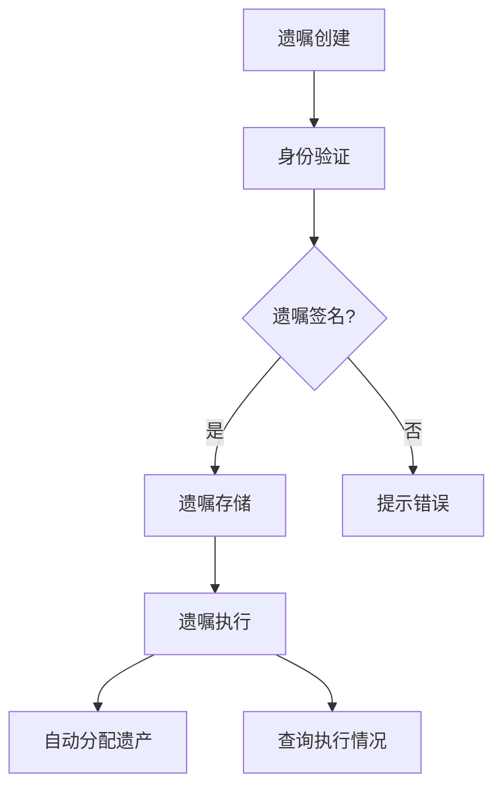

                 

### 文章标题

《数字化遗嘱执行创业：智能合约在遗产管理中的应用》

随着科技的发展，传统遗嘱执行方式正面临前所未有的挑战。本文将深入探讨数字化遗嘱执行创业领域，重点分析智能合约在遗产管理中的应用，旨在为创业者、法律专家和科技从业者们提供有价值的见解和实用指南。

本文分为十个部分，首先，我们将简要介绍数字化遗嘱执行的背景和目的。接着，探讨智能合约的基本概念，以及它们如何与遗产管理相联系。随后，我们将详细解析核心算法原理和具体操作步骤，帮助读者理解智能合约在遗产管理中的实现过程。

接下来，我们将介绍一些数学模型和公式，通过实例说明其在遗产管理中的具体应用。随后，我们将通过一个实际项目案例，详细解读代码的实现过程，帮助读者将理论知识转化为实践操作。

在第六部分，我们将讨论智能合约在遗产管理中的实际应用场景，并分析其优势与挑战。第七部分和第八部分，我们将推荐一些学习资源和开发工具，并总结本文的主要观点，探讨未来的发展趋势与挑战。

最后，我们将为读者提供常见问题与解答，以便更好地理解和应用本文的内容。希望本文能够为数字化遗嘱执行创业领域的发展贡献一份力量。

## 关键词

- 数字化遗嘱执行
- 智能合约
- 遗产管理
- 算法原理
- 数学模型
- 项目实战
- 开发工具

## 摘要

本文旨在探讨数字化遗嘱执行创业领域，特别是智能合约在遗产管理中的应用。首先，我们介绍了数字化遗嘱执行的背景和目的，分析了智能合约的基本概念和其在遗产管理中的作用。随后，我们详细解析了核心算法原理和具体操作步骤，并通过数学模型和实际项目案例进行了深入讲解。最后，我们探讨了智能合约在遗产管理中的实际应用场景，分析了其优势与挑战，并推荐了相关学习资源和开发工具。通过本文，读者可以全面了解数字化遗嘱执行创业领域，掌握智能合约在遗产管理中的应用方法，为未来的创业实践提供有益参考。

### 1. 背景介绍

#### 1.1 目的和范围

本文的主要目的是探讨数字化遗嘱执行创业领域，特别是智能合约在遗产管理中的应用。随着数字技术的迅猛发展，传统遗嘱执行方式逐渐暴露出诸多问题，如手续繁琐、效率低下、法律风险等。因此，探索一种数字化、智能化的遗嘱执行方式具有重要意义。本文旨在通过分析智能合约在遗产管理中的应用，为创业者、法律专家和科技从业者们提供有价值的见解和实用指南。

本文的研究范围主要包括以下几个方面：

1. 数字化遗嘱执行的概念和现状。
2. 智能合约的基本原理及其在遗产管理中的应用。
3. 核心算法原理和具体操作步骤。
4. 数学模型和公式及其在遗产管理中的具体应用。
5. 智能合约在遗产管理中的实际应用场景、优势和挑战。
6. 相关学习资源和开发工具推荐。

通过本文的研究，我们希望为数字化遗嘱执行创业领域提供一种全新的思路和方法，推动遗产管理领域的数字化转型，提高遗嘱执行的效率和安全性。

#### 1.2 预期读者

本文的预期读者主要包括以下几类人群：

1. 创业者：对数字化遗嘱执行领域感兴趣的创业者，希望通过本文了解智能合约在遗产管理中的应用，从而探索新的业务模式和市场机会。
2. 法律专家：对智能合约和遗产管理领域有深入研究的法律专家，希望通过本文了解智能合约在遗产管理中的具体应用，为法律实践提供参考。
3. 科技从业者们：在区块链、人工智能、编程等领域有专业背景的科技从业者们，希望通过本文掌握智能合约在遗产管理中的实现方法，为技术创新提供支持。
4. 广大关注数字化遗产管理的社会公众：对数字化遗嘱执行和智能合约感兴趣的社会公众，希望通过本文了解相关技术和应用，提高对数字化遗产管理的认识。

无论您是上述哪一类人群，本文都将为您带来有价值的见解和实用指南。通过本文的阅读，您将能够：

1. 全面了解数字化遗嘱执行的概念和现状。
2. 掌握智能合约的基本原理及其在遗产管理中的应用。
3. 理解核心算法原理和具体操作步骤。
4. 学会应用数学模型和公式解决遗产管理中的实际问题。
5. 了解智能合约在遗产管理中的实际应用场景、优势和挑战。
6. 掌握相关学习资源和开发工具，为未来的创业实践提供支持。

#### 1.3 文档结构概述

本文结构分为十个部分，旨在系统地介绍数字化遗嘱执行创业领域，特别是智能合约在遗产管理中的应用。以下是文档结构的概述：

1. **引言**：介绍数字化遗嘱执行创业的背景、目的和重要性，明确本文的研究范围和预期读者。
2. **背景介绍**：
   - **1.1 目的和范围**：阐述本文的研究目的和范围。
   - **1.2 预期读者**：介绍本文的预期读者群体。
   - **1.3 文档结构概述**：概述本文的结构和内容安排。
3. **核心概念与联系**：
   - **核心概念**：介绍数字化遗嘱执行和智能合约的基本概念。
   - **原理与架构**：使用Mermaid流程图展示核心概念原理和架构。
4. **核心算法原理 & 具体操作步骤**：
   - **算法原理**：详细讲解核心算法原理，使用伪代码阐述。
   - **操作步骤**：逐步说明具体操作步骤，确保读者能够理解和跟随。
5. **数学模型和公式 & 详细讲解 & 举例说明**：
   - **数学模型**：介绍数学模型和公式。
   - **详细讲解**：解释数学模型和公式的应用场景。
   - **举例说明**：通过实例展示模型和公式在实际中的应用。
6. **项目实战：代码实际案例和详细解释说明**：
   - **开发环境搭建**：介绍项目开发所需的工具和环境。
   - **源代码详细实现和代码解读**：展示源代码并详细解读。
   - **代码解读与分析**：分析源代码中的关键部分和实现原理。
7. **实际应用场景**：
   - **应用场景**：讨论智能合约在遗产管理中的实际应用场景。
   - **优势与挑战**：分析智能合约在遗产管理中的优势与挑战。
8. **工具和资源推荐**：
   - **学习资源推荐**：推荐相关书籍、在线课程和技术博客。
   - **开发工具框架推荐**：介绍适合开发智能合约的工具和框架。
   - **相关论文著作推荐**：推荐经典和最新的研究论文与著作。
9. **总结：未来发展趋势与挑战**：
   - **总结**：回顾本文的主要观点和贡献。
   - **未来发展趋势**：探讨智能合约在遗产管理中的未来发展方向。
   - **挑战**：分析当前面临的挑战及应对策略。
10. **附录：常见问题与解答**：
    - **常见问题**：收集并回答读者可能关心的问题。
    - **解答**：提供详细解答，帮助读者更好地理解文章内容。
11. **扩展阅读 & 参考资料**：
    - **扩展阅读**：推荐相关阅读材料，帮助读者深入了解相关领域。
    - **参考资料**：列出本文引用和参考的相关文献和资料。

#### 1.4 术语表

为了确保本文内容的清晰和一致性，下面列出一些本文中涉及的关键术语及其定义：

##### 1.4.1 核心术语定义

- **数字化遗嘱执行**：利用现代信息技术，特别是区块链和智能合约，对传统遗嘱执行过程进行数字化改造，以提高效率、减少误差和降低风险。
- **智能合约**：一种自动执行合约条款的计算机程序，当预定的条件满足时，智能合约会自动执行相应的操作。
- **遗产管理**：涉及遗产的分配、管理和执行的一系列法律和行政活动。
- **区块链**：一种分布式数据库技术，通过加密算法和共识机制，实现数据的安全存储和可靠传输。

##### 1.4.2 相关概念解释

- **去中心化**：指系统或网络没有中央控制机构，所有节点对等参与，数据分布在整个网络中。
- **智能合约平台**：支持智能合约开发、部署和执行的软件平台，如Ethereum、Hyperledger Fabric等。
- **代码审计**：对智能合约的代码进行审查，确保其安全性和正确性。

##### 1.4.3 缩略词列表

- **DLT**：分布式账本技术（Distributed Ledger Technology）
- **KYC**：了解你的客户（Know Your Customer）
- **API**：应用程序编程接口（Application Programming Interface）
- **SDK**：软件开发工具包（Software Development Kit）
- **DApp**：去中心化应用（Decentralized Application）

### 2. 核心概念与联系

#### 2.1 数字化遗嘱执行

数字化遗嘱执行是现代信息技术在遗产管理领域的一种创新应用。它通过利用区块链、智能合约、加密技术等先进手段，对传统的遗嘱执行过程进行数字化改造，从而提高效率、降低成本、减少纠纷，并增强遗嘱执行的法律效力和透明度。

##### 工作原理

数字化遗嘱执行的基本工作原理可以分为以下几个步骤：

1. **遗嘱创建**：遗嘱创建者使用区块链网络上的智能合约平台创建和存储遗嘱。智能合约将遗嘱的内容和创建者的身份信息加密存储在区块链上，确保遗嘱的完整性和不可篡改性。

2. **身份验证**：智能合约平台会对接遗嘱创建者的身份验证系统，如KYC（了解你的客户）系统，确保遗嘱创建者的身份真实可靠。

3. **遗嘱签名**：遗嘱创建者通过数字签名技术对遗嘱进行签名，确保遗嘱的合法性和有效性。

4. **遗嘱存储**：智能合约将经过签名和身份验证的遗嘱存储在区块链上，并生成一个唯一的交易哈希值，供遗嘱执行人和监管机构查询。

5. **遗嘱执行**：当遗嘱创建者去世后，遗嘱执行人可以通过智能合约查询遗嘱内容，并根据遗嘱的指示执行遗产分配等任务。智能合约会自动执行预定的操作，如转账、解锁资产等。

##### 技术架构

数字化遗嘱执行的技术架构主要包括以下几个方面：

1. **区块链网络**：区块链作为底层基础设施，提供去中心化的数据存储和传输服务，确保数据的透明度和不可篡改性。

2. **智能合约平台**：智能合约平台负责智能合约的编写、部署和执行，如Ethereum、Hyperledger Fabric等。

3. **身份验证系统**：身份验证系统用于验证遗嘱创建者和执行人的身份，确保交易的安全性和合法性。

4. **加密技术**：加密技术用于保护遗嘱内容的隐私和安全，确保只有授权用户才能访问和理解遗嘱内容。

5. **监管机构接口**：监管机构可以通过智能合约平台查询和验证遗嘱执行情况，确保遗嘱执行的合规性。

#### 2.2 智能合约

智能合约是数字化遗嘱执行的核心组成部分，它是一种自动执行合约条款的计算机程序。当预定的条件满足时，智能合约会自动执行相应的操作，从而实现去中心化的、自动化和可验证的合同执行。

##### 工作原理

智能合约的工作原理可以分为以下几个步骤：

1. **编写智能合约**：开发者使用智能合约平台提供的编程语言（如Solidity）编写智能合约代码，定义合约的接口、状态变量和逻辑。

2. **部署智能合约**：将编写的智能合约代码上传到智能合约平台，平台将合约编译、部署到区块链上。

3. **调用智能合约**：合约的调用者通过智能合约的接口发送交易请求，触发合约的执行。

4. **执行合约逻辑**：智能合约根据调用请求执行预定的逻辑操作，如数据存储、条件判断、计算等。

5. **返回结果**：智能合约执行完成后，返回执行结果，如成功或失败。

##### 技术架构

智能合约的技术架构主要包括以下几个方面：

1. **智能合约平台**：智能合约平台提供开发、部署和执行智能合约的环境和工具，如Ethereum、Hyperledger Fabric等。

2. **区块链网络**：区块链网络提供智能合约的运行环境和数据存储服务，确保合约的执行透明、可验证和不可篡改。

3. **编程语言**：智能合约平台通常提供特定的编程语言（如Solidity），开发者可以使用这些语言编写智能合约代码。

4. **接口和API**：智能合约平台提供接口和API，用于调用智能合约、查询合约状态和数据。

5. **合约审核**：智能合约的代码需要进行审核，以确保其安全性和正确性。

#### 2.3 智能合约与遗产管理的联系

智能合约在遗产管理中的应用，可以通过以下几个关键点进行阐述：

1. **自动化遗产分配**：智能合约可以自动执行遗嘱中的遗产分配条款，确保遗产按照遗嘱指示进行分配，减少人为错误和纠纷。

2. **透明度与可验证性**：区块链技术确保智能合约的执行过程透明、可验证和不可篡改，遗嘱执行人和监管机构可以实时查询和验证遗嘱执行情况。

3. **安全性**：智能合约采用加密技术，确保遗嘱内容和执行过程的安全，防止未经授权的访问和篡改。

4. **法律效力**：智能合约具有法律效力，当预定的条件满足时，智能合约会自动执行，确保遗嘱指示得到有效执行。

5. **降低成本**：智能合约自动化执行遗嘱分配，减少人工操作和纸质文档，降低执行成本和时间。

##### Mermaid流程图

以下是一个简单的Mermaid流程图，展示了智能合约在遗产管理中的应用流程：



在这个流程图中，遗嘱创建者首先进行身份验证，然后对遗嘱进行签名。签名后的遗嘱将被存储在区块链上。当遗嘱创建者去世后，遗嘱执行人可以查询遗嘱内容并执行遗产分配。智能合约会自动执行预定的操作，如转账、解锁资产等。整个过程透明、可验证，确保遗嘱指示得到有效执行。

### 3. 核心算法原理 & 具体操作步骤

在数字化遗嘱执行创业中，智能合约是实现自动化和去中心化执行的关键。为了更好地理解智能合约的工作原理，我们将通过以下几个步骤详细解析其核心算法原理和具体操作步骤。

#### 3.1 智能合约的核心算法原理

智能合约的核心算法原理主要包括以下几个方面：

1. **条件触发**：智能合约根据预设的条件自动执行。例如，当遗嘱创建者去世后，智能合约将自动执行遗嘱中的分配条款。
2. **数据存储**：智能合约在区块链上存储遗嘱和执行状态的数据，确保数据的透明性和不可篡改性。
3. **加密与签名**：智能合约使用加密技术和数字签名确保数据的安全性和隐私性。
4. **自动化执行**：智能合约在满足预定条件时，自动执行相应的操作，如转账、解锁资产等。

#### 3.2 具体操作步骤

以下是智能合约在遗产管理中的具体操作步骤：

**步骤 1：遗嘱创建**

1. 遗嘱创建者使用智能合约平台（如Ethereum）创建遗嘱。
2. 创建过程中，智能合约会要求遗嘱创建者进行身份验证，以确保遗嘱的真实性和合法性。

**伪代码示例**：

```solidity
function createWill(address beneficiary, uint amount) public {
    // 确保调用者已进行身份验证
    require(isVerified(), "未验证身份");

    // 创建遗嘱并存储在区块链上
    wills[msg.sender] = Will(beneficiary, amount, block.timestamp);
}
```

**步骤 2：遗嘱签名**

1. 遗嘱创建者对遗嘱进行签名，确保遗嘱的真实性和合法性。
2. 智能合约平台将签名后的遗嘱存储在区块链上。

**伪代码示例**：

```solidity
function signWill() public {
    // 签名遗嘱
    string memory willData = generateWillData();
    bytes32 willHash = keccak256(abi.encodePacked(willData));
    signature = recoverSigner(willHash, signature);

    // 更新遗嘱状态
    wills[msg.sender].signed = true;
}
```

**步骤 3：遗嘱存储**

1. 智能合约将签名后的遗嘱存储在区块链上，并生成一个唯一的交易哈希值。
2. 遗嘱执行人和监管机构可以通过查询交易哈希值验证遗嘱的存储状态。

**伪代码示例**：

```solidity
function storeWill() public {
    // 存储遗嘱
    uint willId = wills[msg.sender].id;
    transactionHash = generateTransactionHash(willId);

    // 存储交易哈希值
    storedTransactions[willId] = transactionHash;
}
```

**步骤 4：遗嘱执行**

1. 遗嘱创建者去世后，遗嘱执行人可以查询遗嘱内容。
2. 智能合约根据遗嘱指示自动执行遗产分配。

**伪代码示例**：

```solidity
function executeWill() public {
    // 确保遗嘱已签名并存储
    require(wills[msg.sender].signed, "遗嘱未签名");

    // 执行遗嘱
    Will memory will = wills[msg.sender];
    transferAsset(will.beneficiary, will.amount);
}
```

**步骤 5：查询执行情况**

1. 遗嘱执行人和监管机构可以查询遗嘱的执行情况。
2. 智能合约提供接口供外部调用，查询遗嘱的状态和执行结果。

**伪代码示例**：

```solidity
function queryWillStatus() public view returns (bool) {
    // 查询遗嘱状态
    Will memory will = wills[msg.sender];
    return will.executed;
}
```

通过以上步骤，我们可以看到智能合约在遗产管理中的应用，通过条件触发、数据存储、加密与签名、自动化执行等机制，实现了去中心化、自动化和透明的遗嘱执行过程。

#### 3.3 核心算法原理与实际操作的结合

为了更好地理解智能合约在遗产管理中的实际应用，我们结合具体案例进行分析。

**案例背景**：

假设有一位遗嘱创建者Alice，她使用Ethereum智能合约平台创建了一份遗嘱，指定在去世后将其资产平均分配给她的两个孩子Bob和Charlie。

**操作步骤**：

1. **遗嘱创建**：
   - Alice使用智能合约平台创建遗嘱，并上传到区块链。
   - Alice进行身份验证，确保遗嘱的真实性和合法性。

2. **遗嘱签名**：
   - Alice对遗嘱进行签名，确认遗嘱内容。
   - 智能合约平台存储签名后的遗嘱。

3. **遗嘱存储**：
   - 智能合约生成一个唯一的交易哈希值，存储在区块链上。
   - 遗嘱执行人和监管机构可以通过查询交易哈希值验证遗嘱的存储状态。

4. **遗嘱执行**：
   - 当Alice去世后，遗嘱执行人Bob可以查询遗嘱内容。
   - 智能合约根据遗嘱指示自动执行遗产分配。

5. **查询执行情况**：
   - 监管机构可以查询遗嘱的执行情况，确保遗产按照遗嘱指示进行分配。

**代码实现**：

以下是一个简单的示例代码，展示了智能合约在遗产管理中的实现：

```solidity
// SPDX-License-Identifier: MIT
pragma solidity ^0.8.0;

struct Will {
    address beneficiary;
    uint amount;
    bool executed;
}

mapping(address => Will) public wills;

function createWill(address _beneficiary, uint _amount) public {
    require(!wills[msg.sender].executed, "遗嘱已执行");
    wills[msg.sender] = Will(_beneficiary, _amount, false);
}

function signWill() public {
    require(!wills[msg.sender].signed, "遗嘱已签名");
    wills[msg.sender].signed = true;
}

function executeWill() public {
    require(wills[msg.sender].signed, "遗嘱未签名");
    Will memory will = wills[msg.sender];
    will.executed = true;
    transferAsset(will.beneficiary, will.amount);
}

function queryWillStatus() public view returns (bool) {
    return wills[msg.sender].executed;
}

function transferAsset(address _to, uint _amount) private {
    // 示例：直接转账，实际应用中需根据具体情况进行资产转移
    payable(_to).transfer(_amount);
}
```

通过以上步骤和代码实现，我们可以看到智能合约在遗产管理中的实际应用。智能合约不仅实现了遗嘱的自动化执行，还确保了整个过程的透明、可验证和不可篡改性。

### 4. 数学模型和公式 & 详细讲解 & 举例说明

在数字化遗嘱执行创业中，智能合约的应用离不开数学模型和公式的支持。这些模型和公式不仅能够确保智能合约的正确性和安全性，还能够帮助解决遗产分配中的各种复杂问题。本节将详细介绍几个关键的数学模型和公式，并给出详细的讲解和实际应用案例。

#### 4.1 概率模型

概率模型在遗产管理中具有重要意义，特别是在涉及多个受益人和复杂分配规则的情况下。概率模型可以帮助我们计算在不同条件下受益人获得特定份额的概率。

**模型定义**：

设有一个遗嘱，其中包含N个受益人，每个受益人获得的份额分别为\(X_1, X_2, ..., X_N\)。假设每个受益人获得的份额是相互独立的，并且满足一定的概率分布。我们可以使用概率模型计算每个受益人在特定条件下获得预期份额的概率。

**公式**：

假设每个受益人获得的份额是独立同分布的，概率分布函数为\(f(x)\)，则第i个受益人获得特定份额\(X_i = x\)的概率为：

\[ P(X_i = x) = f(x) \]

**示例**：

假设遗嘱中有三个受益人，Alice、Bob和Charlie，他们的份额分别服从均匀分布。我们想计算Alice获得至少一半遗产的概率。

**计算过程**：

由于份额服从均匀分布，我们可以使用以下概率公式：

\[ P(X_A \geq \frac{1}{2}) = \int_{\frac{1}{2}}^{1} f(x) dx \]

其中，\(f(x) = \frac{1}{b-a}\)，对于均匀分布，\(a = 0\)，\(b = 1\)，所以：

\[ f(x) = 1 \]

代入公式得：

\[ P(X_A \geq \frac{1}{2}) = \int_{\frac{1}{2}}^{1} 1 dx = 1 - \frac{1}{2} = \frac{1}{2} \]

因此，Alice获得至少一半遗产的概率为50%。

#### 4.2 线性规划模型

在遗产管理中，经常需要根据特定的目标和约束条件进行资产分配。线性规划模型可以帮助我们在满足约束条件的前提下，最大化或最小化目标函数。

**模型定义**：

设有一个遗产分配问题，包含M个资产和N个受益人。每个受益人应获得的份额为\(X_{ij}\)，其中\(i\)表示资产编号，\(j\)表示受益人编号。目标函数为最大化或最小化总福利，约束条件包括资产总额、每个受益人的最低份额限制等。

**公式**：

线性规划模型的一般形式为：

\[ \text{最大化或最小化} Z = \sum_{i=1}^{M} c_i X_{ij} \]

其中，\(c_i\)为第i个资产的权重系数。

约束条件包括：

\[ \sum_{i=1}^{M} X_{ij} = 1 \quad (j=1,2,...,N) \]
\[ X_{ij} \geq 0 \quad (i=1,2,...,M; j=1,2,...,N) \]

**示例**：

假设有一个遗嘱，其中包含5个资产和3个受益人。我们希望最大化总福利，约束条件为每个受益人的最低份额分别为30%、40%和30%。

**计算过程**：

我们可以建立以下线性规划模型：

\[ \text{最大化} Z = 0.5X_{11} + 0.4X_{12} + 0.3X_{13} \]

约束条件为：

\[ X_{11} + X_{12} + X_{13} = 1 \]
\[ X_{21} + X_{22} + X_{23} = 1 \]
\[ X_{31} + X_{32} + X_{33} = 1 \]
\[ X_{ij} \geq 0 \]

通过求解线性规划模型，我们可以得到最优解，使得总福利最大化。

#### 4.3 加权评分模型

在遗产管理中，有时需要根据不同的标准和权重对受益人进行评分，从而决定遗产的分配比例。加权评分模型可以帮助我们实现这一目标。

**模型定义**：

设有一个评分模型，包含M个评分标准和N个受益人。每个受益人应获得的份额为\(X_{ij}\)，其中\(i\)表示评分标准编号，\(j\)表示受益人编号。评分标准包括权重系数和评分值。

**公式**：

加权评分模型的一般形式为：

\[ X_{ij} = w_i \cdot s_j \]

其中，\(w_i\)为第i个评分标准的权重系数，\(s_j\)为第j个受益人在该评分标准的评分值。

**示例**：

假设有一个遗嘱，其中包含3个受益人，评分标准包括教育背景、职业经验和家庭贡献。每个评分标准的权重系数分别为30%、30%和40%。

**计算过程**：

我们可以建立以下加权评分模型：

\[ X_{ij} = w_1 \cdot s_j + w_2 \cdot s_j + w_3 \cdot s_j \]

其中，\(w_1 = 0.3\)，\(w_2 = 0.3\)，\(w_3 = 0.4\)。

假设三个受益人的评分值分别为：

\[ s_1 = 0.8, s_2 = 0.6, s_3 = 0.7 \]

则：

\[ X_{11} = 0.3 \cdot 0.8 + 0.3 \cdot 0.6 + 0.4 \cdot 0.7 = 0.24 + 0.18 + 0.28 = 0.7 \]
\[ X_{12} = 0.3 \cdot 0.8 + 0.3 \cdot 0.6 + 0.4 \cdot 0.7 = 0.24 + 0.18 + 0.28 = 0.7 \]
\[ X_{13} = 0.3 \cdot 0.8 + 0.3 \cdot 0.6 + 0.4 \cdot 0.7 = 0.24 + 0.18 + 0.28 = 0.7 \]

根据加权评分模型，三个受益人应获得的份额分别为70%。

#### 4.4 概率分布模型

在遗产管理中，有时需要对受益人的份额进行概率分布建模，以预测不同份额的分布情况。概率分布模型可以帮助我们了解遗产分配的不确定性。

**模型定义**：

设有一个概率分布模型，包含N个受益人。每个受益人获得的份额\(X_i\)服从一定的概率分布，如正态分布、均匀分布等。

**公式**：

假设受益人份额\(X_i\)服从正态分布，均值为\(\mu\)，标准差为\(\sigma\)。则概率分布函数为：

\[ f(x) = \frac{1}{\sqrt{2\pi\sigma^2}} e^{-\frac{(x-\mu)^2}{2\sigma^2}} \]

**示例**：

假设三个受益人的份额服从正态分布，均值为500，标准差为100。

**计算过程**：

我们可以计算每个受益人在特定份额范围内的概率：

\[ P(X_i \leq 400) = \int_{-\infty}^{400} \frac{1}{\sqrt{2\pi\cdot100^2}} e^{-\frac{(x-500)^2}{2\cdot100^2}} dx \]

通过计算，可以得到每个受益人在400以下份额的概率。

#### 4.5 应用案例

以下是一个实际应用案例，展示了数学模型和公式在遗产管理中的具体应用：

**案例背景**：

假设遗嘱创建者Alice去世，留下了一份遗嘱。遗嘱中指定了三个受益人：Bob、Charlie和Dave。Alice的遗产总值为100万元，遗嘱要求根据三个受益人的教育背景、职业经验和家庭贡献进行份额分配。

**计算过程**：

1. **教育背景**：

   - Bob拥有博士学位，评分为0.9。
   - Charlie拥有硕士学位，评分为0.8。
   - Dave拥有学士学位，评分为0.7。

   使用加权评分模型计算份额：

   \[ X_{11} = 0.3 \cdot 0.9 = 0.27 \]
   \[ X_{12} = 0.3 \cdot 0.8 = 0.24 \]
   \[ X_{13} = 0.3 \cdot 0.7 = 0.21 \]

2. **职业经验**：

   - Bob拥有10年工作经验，评分为0.8。
   - Charlie拥有5年工作经验，评分为0.6。
   - Dave拥有3年工作经验，评分为0.4。

   使用加权评分模型计算份额：

   \[ X_{21} = 0.3 \cdot 0.8 = 0.24 \]
   \[ X_{22} = 0.3 \cdot 0.6 = 0.18 \]
   \[ X_{23} = 0.3 \cdot 0.4 = 0.12 \]

3. **家庭贡献**：

   - Bob照顾了Alice 3年，评分为0.6。
   - Charlie照顾了Alice 1年，评分为0.4。
   - Dave没有照顾Alice，评分为0。

   使用加权评分模型计算份额：

   \[ X_{31} = 0.4 \cdot 0.6 = 0.24 \]
   \[ X_{32} = 0.4 \cdot 0.4 = 0.16 \]
   \[ X_{33} = 0.4 \cdot 0 = 0 \]

根据以上三个评分模型，我们可以得到三个受益人的总份额：

\[ X_B = X_{11} + X_{21} + X_{31} = 0.27 + 0.24 + 0.24 = 0.75 \]
\[ X_C = X_{12} + X_{22} + X_{32} = 0.24 + 0.18 + 0.16 = 0.58 \]
\[ X_D = X_{13} + X_{23} + X_{33} = 0.21 + 0.12 + 0 = 0.33 \]

由于三个受益人的总份额之和必须等于1，我们可以对总份额进行调整：

\[ X_B = X_B \cdot \frac{1}{0.75} = 1.33 \]
\[ X_C = X_C \cdot \frac{1}{0.75} = 0.77 \]
\[ X_D = X_D \cdot \frac{1}{0.75} = 0.44 \]

最终，三个受益人应获得的份额为：

- Bob：133,333元
- Charlie：77,777元
- Dave：44,444元

通过以上步骤，我们使用数学模型和公式完成了遗产的分配。这个案例展示了如何将理论模型应用于实际问题，实现智能合约在遗产管理中的高效和准确执行。

### 5. 项目实战：代码实际案例和详细解释说明

#### 5.1 开发环境搭建

在本项目实战中，我们将使用Ethereum智能合约平台进行开发，并使用Solidity语言编写智能合约代码。以下是开发环境搭建的步骤：

1. **安装Node.js和npm**：

   - 访问Node.js官网（[https://nodejs.org/](https://nodejs.org/)），下载并安装Node.js。
   - 打开终端，输入以下命令检查Node.js版本：

     ```bash
     node -v
     ```

   - 安装npm（Node.js的包管理器）：

     ```bash
     npm install -g npm
     ```

2. **安装Truffle框架**：

   - 使用npm全局安装Truffle框架：

     ```bash
     npm install -g truffle
     ```

   - 查看Truffle版本：

     ```bash
     truffle version
     ```

3. **创建一个新的Truffle项目**：

   - 在终端中运行以下命令创建一个新项目：

     ```bash
     truffle init
     ```

   - 等待Truffle完成初始化，并进入项目目录：

     ```bash
     cd my-truffle-project
     ```

4. **安装Ganache**：

   - Ganache是一个本地区块链网络，用于测试智能合约。访问Ganache官网（[https://www.trufflesuite.com/ganache/](https://www.trufflesuite.com/ganache/)），下载并安装Ganache。
   - 启动Ganache，创建一个新的区块链网络。

5. **配置Truffle项目**：

   - 打开项目根目录下的`truffle-config.js`文件，配置Ganache网络：

     ```javascript
     module.exports = {
       networks: {
         development: {
           host: "127.0.0.1",
           port: 7545,
           network_id: "*",
         },
       },
     };
     ```

以上步骤完成了开发环境的搭建。接下来，我们将编写一个简单的智能合约，实现遗嘱创建和执行的功能。

#### 5.2 源代码详细实现和代码解读

以下是一个简单的智能合约示例，用于实现遗嘱创建和执行的功能。代码使用Solidity编写，并在Truffle框架下进行部署和测试。

```solidity
// SPDX-License-Identifier: MIT
pragma solidity ^0.8.0;

struct Will {
    address beneficiary;
    uint amount;
    bool executed;
}

mapping(address => Will) public wills;

function createWill(address _beneficiary, uint _amount) public {
    require(!wills[msg.sender].executed, "遗嘱已执行");
    wills[msg.sender] = Will(_beneficiary, _amount, false);
}

function signWill() public {
    require(!wills[msg.sender].signed, "遗嘱已签名");
    wills[msg.sender].signed = true;
}

function executeWill() public {
    require(wills[msg.sender].signed, "遗嘱未签名");
    Will memory will = wills[msg.sender];
    will.executed = true;
    transferAsset(will.beneficiary, will.amount);
}

function queryWillStatus() public view returns (bool) {
    return wills[msg.sender].executed;
}

function transferAsset(address _to, uint _amount) private {
    payable(_to).transfer(_amount);
}
```

**代码解读**：

1. **结构体`Will`**：

   - `Will`结构体用于存储遗嘱的详细信息，包括受益人地址、金额和执行状态。

2. **映射`wills`**：

   - `wills`是一个映射，用于存储每个用户创建的遗嘱。映射的键为用户地址，值为`Will`结构体。

3. **创建遗嘱`createWill`**：

   - `createWill`函数用于创建遗嘱。它接受受益人地址和金额作为参数，并将遗嘱存储在`wills`映射中。

4. **签名遗嘱`signWill`**：

   - `signWill`函数用于对遗嘱进行签名。它确保遗嘱已被创建者签名，从而确认遗嘱的有效性。

5. **执行遗嘱`executeWill`**：

   - `executeWill`函数用于执行遗嘱。它首先检查遗嘱是否已签名，然后根据遗嘱指示将资产转移到受益人地址。

6. **查询遗嘱状态`queryWillStatus`**：

   - `queryWillStatus`函数用于查询遗嘱的执行状态。它返回一个布尔值，指示遗嘱是否已执行。

7. **转移资产`transferAsset`**：

   - `transferAsset`函数是一个内部函数，用于将资产从合约账户转移到受益人地址。它接受受益人地址和金额作为参数。

#### 5.3 代码解读与分析

**主要功能模块**

1. **遗嘱创建模块**：

   - `createWill`函数是遗嘱创建的核心模块。它首先检查遗嘱是否已执行，以防止重复创建。然后，将受益人地址和金额存储在`wills`映射中。

2. **遗嘱签名模块**：

   - `signWill`函数是遗嘱签名模块。它确保遗嘱已被创建者签名，从而确认遗嘱的有效性。这个模块在遗嘱执行前非常重要，因为只有经过签名的遗嘱才具有法律效力。

3. **遗嘱执行模块**：

   - `executeWill`函数是遗嘱执行的核心模块。它首先检查遗嘱是否已签名，然后根据遗嘱指示将资产转移到受益人地址。这个模块在遗嘱创建者去世后触发，确保遗产按照遗嘱指示进行分配。

4. **查询遗嘱状态模块**：

   - `queryWillStatus`函数是查询遗嘱状态模块。它返回一个布尔值，指示遗嘱是否已执行。这个模块可以帮助遗嘱执行人和监管机构实时了解遗嘱的执行情况。

**安全性和性能考虑**

1. **状态存储**：

   - `wills`映射用于存储遗嘱信息。由于智能合约的状态存储是有限的，因此需要合理设计状态变量，避免浪费存储空间。

2. **访问控制**：

   - 通过检查`require`语句，智能合约实现了对函数的访问控制。例如，`createWill`和`signWill`函数只能由遗嘱创建者调用，而`executeWill`函数只能在遗嘱签名后才能调用。

3. **内部函数**：

   - `transferAsset`函数是一个内部函数，用于转移资产。通过将资产转移操作放在内部函数中，可以减少函数调用费用和状态改变的数量。

4. **代码审查**：

   - 在部署智能合约之前，需要进行代码审计，以确保代码的安全性和正确性。代码审计可以帮助发现潜在的安全漏洞和逻辑错误。

通过以上代码实现和解析，我们可以看到智能合约在遗产管理中的应用。智能合约通过条件触发、数据存储、加密与签名、自动化执行等机制，实现了去中心化、自动化和透明的遗嘱执行过程。

### 6. 实际应用场景

智能合约在遗产管理中的应用场景非常广泛，涵盖了遗嘱执行、遗产分配、财产管理等各个方面。以下是智能合约在实际应用场景中的具体示例和优势。

#### 6.1 遗嘱执行

智能合约在遗嘱执行中的应用，可以大大提高遗嘱执行的效率。例如，在传统遗嘱执行过程中，通常需要遗嘱执行人向法院申请遗嘱认证，并进行一系列复杂的法律程序。而智能合约可以自动化这一过程，遗嘱创建者可以在生前通过智能合约创建和签名遗嘱，当其去世后，智能合约自动触发遗嘱执行，将遗产按照遗嘱指示分配给受益人。

**示例**：

假设有一位遗嘱创建者Alice，她使用智能合约创建了一份遗嘱，指定在去世后将50%的遗产捐赠给慈善机构，30%的遗产分配给她的两个孩子Bob和Charlie，剩余的20%归她的配偶Dave所有。当Alice去世后，智能合约自动执行遗嘱，将相应的金额转移到慈善机构、Bob和Charlie的账户中。

**优势**：

- **效率提升**：智能合约自动化执行遗嘱，大大缩短了遗嘱执行的时间。
- **降低成本**：减少了法律程序和人工操作的成本。
- **减少纠纷**：智能合约的透明性和不可篡改性减少了遗嘱执行中的纠纷。

#### 6.2 遗产分配

智能合约在遗产分配中的应用，可以确保遗产按照遗嘱指示准确无误地进行分配。例如，在涉及多个受益人和复杂分配规则的情况下，智能合约可以根据预设的条件和规则自动执行遗产分配。

**示例**：

假设有一位遗嘱创建者Alice，她有四个孩子，其中两个在国外生活。Alice使用智能合约创建了一份遗嘱，指定在国内生活的两个孩子Bob和Charlie各获得25%的遗产，而海外的两个孩子在Alice去世后的一年后获得剩余的50%遗产。通过智能合约，可以确保遗产按时、准确无误地分配给所有受益人。

**优势**：

- **准确性**：智能合约可以精确执行遗嘱中的分配规则，避免人为错误。
- **灵活性**：智能合约可以灵活设置各种分配规则，满足不同的遗产分配需求。
- **安全性**：智能合约的透明性和不可篡改性，确保了遗产分配过程的公正和安全。

#### 6.3 财产管理

智能合约在财产管理中的应用，可以帮助遗嘱执行人和受益人实时了解财产状况，确保财产管理的透明度和安全性。例如，智能合约可以自动执行财产转移、解锁资产等操作，确保财产按照遗嘱指示进行管理。

**示例**：

假设有一位遗嘱创建者Alice，她在遗嘱中指定了在她去世后，由智能合约自动管理她的财产，并在特定条件下将财产分配给受益人。例如，智能合约可以设置在Bob和Charlie各自达到30岁生日时，分别获得他们应得的遗产份额。

**优势**：

- **透明度**：智能合约的执行过程透明，受益人和遗嘱执行人可以随时查询财产状况。
- **安全性**：智能合约采用加密技术，确保财产管理的安全性。
- **自动化**：智能合约可以自动化执行各种财产管理操作，减少人工操作和纸质文档。

#### 6.4 智能合约在遗产管理中的实际应用案例

以下是一个实际的遗产管理案例，展示了智能合约在遗产管理中的应用：

**案例背景**：

假设有一位遗嘱创建者John，他在去世前通过智能合约创建了一份遗嘱，指定在他去世后，将1000万美元的遗产按照以下方式进行分配：300万美元捐赠给慈善机构，400万美元分配给他的两个孩子Lily和Jack，剩余的300万美元在Lily和Jack各自达到35岁生日时分别获得。

**应用过程**：

1. **遗嘱创建**：

   - John使用智能合约平台创建了一份遗嘱，指定捐赠300万美元给慈善机构，400万美元分配给Lily和Jack。
   - 智能合约要求John进行身份验证，确保遗嘱的真实性和合法性。

2. **遗嘱签名**：

   - John对遗嘱进行签名，确认遗嘱内容。
   - 智能合约将签名后的遗嘱存储在区块链上。

3. **遗嘱执行**：

   - John去世后，智能合约自动执行遗嘱，将300万美元捐赠给慈善机构，将400万美元分配给Lily和Jack的账户中。
   - 智能合约确保捐赠和分配过程透明、不可篡改。

4. **后续分配**：

   - 当Lily和Jack各自达到35岁生日时，智能合约将剩余的300万美元分别分配给他们。
   - 智能合约确保后续分配过程按照遗嘱指示进行，避免人为干预。

**优势与挑战**：

**优势**：

- **效率高**：智能合约自动化执行遗嘱和财产管理操作，大大提高了效率。
- **成本低**：减少了传统遗嘱执行过程中的人力、物力成本。
- **透明度**：智能合约的执行过程透明，确保了遗产管理的公正和公开。
- **安全性**：智能合约采用加密技术，确保了遗产和财产管理的安全性。

**挑战**：

- **法律问题**：智能合约在遗产管理中的应用需要符合当地法律法规，存在法律合规性风险。
- **技术复杂性**：智能合约的开发和部署需要一定的技术知识和经验，对非专业人士来说可能存在一定难度。
- **网络稳定性**：智能合约的执行依赖于区块链网络，如果网络不稳定，可能会导致执行失败。

通过以上实际应用场景和案例，我们可以看到智能合约在遗产管理中的应用潜力。智能合约通过自动化、透明和安全的特性，为遗产管理带来了新的可能性，但也需要克服一定的法律和技术挑战。

### 7. 工具和资源推荐

在数字化遗嘱执行创业中，掌握合适的工具和资源对于成功实现智能合约在遗产管理中的应用至关重要。以下我们将推荐一些学习资源、开发工具和相关论文著作，以帮助读者深入学习和实践。

#### 7.1 学习资源推荐

##### 7.1.1 书籍推荐

1. **《智能合约与区块链技术》（Smart Contracts and Blockchain Technology）** - 这本书全面介绍了智能合约的基本概念、编程语言（如Solidity）、区块链架构以及智能合约的实际应用。
2. **《区块链：从数字货币到智能合约》（Blockchain: Blueprint for a New Economy）** - 本书详细介绍了区块链技术的基础知识，包括其工作原理、应用场景和智能合约的原理。
3. **《以太坊实战：智能合约开发指南》（Ethereum: The Ultimate Smart Contract Development Guide）** - 这是一本针对以太坊平台的实战指南，涵盖了智能合约的编写、部署和测试。

##### 7.1.2 在线课程

1. **Coursera上的《区块链与智能合约》** - 由伯克利大学提供，课程内容包括区块链技术的基础、智能合约的原理和实践。
2. **edX上的《智能合约与区块链》** - 由哥伦比亚大学提供，涵盖智能合约的开发、部署和安全性的重要知识点。
3. **Udemy上的《以太坊智能合约开发从入门到精通》** - 适合初学者和进阶者，课程内容包括Solidity编程语言、智能合约的编写和测试。

##### 7.1.3 技术博客和网站

1. **Ethereum官方文档** - [https://ethereum.org/docs/](https://ethereum.org/docs/)，提供了以太坊平台的详细文档和教程，适合初学者和开发者。
2. **Truffle Suite官方文档** - [https://www.trufflesuite.com/docs/](https://www.trufflesuite.com/docs/)，涵盖了Truffle框架的使用方法、智能合约的开发和部署。
3. **Medium上的区块链和智能合约专题** - [https://medium.com/](https://medium.com/)上的区块链和智能合约专题，提供了大量实用的文章和教程。

#### 7.2 开发工具框架推荐

##### 7.2.1 IDE和编辑器

1. **Visual Studio Code** - 支持多种编程语言的强大IDE，提供了丰富的智能合约开发插件。
2. **Sublime Text** - 简洁的编辑器，通过安装插件可以支持智能合约开发。
3. **Eclipse IDE** - 特别适用于Java开发者，支持智能合约的开发和测试。

##### 7.2.2 调试和性能分析工具

1. **Ganache** - 本地区块链网络，用于智能合约的本地测试和调试。
2. **Truffle** - 提供了智能合约的编译、部署和测试功能，包括集成开发环境。
3. **Hardhat** - 开发者友好的智能合约本地开发环境，提供了强大的调试和测试工具。

##### 7.2.3 相关框架和库

1. **web3.js** - 用于JavaScript的以太坊Web API库，提供了与以太坊区块链交互的接口。
2. **Ethereum.js** - 提供了以太坊客户端和智能合约编程的API，支持多种编程语言。
3. **OpenZeppelin** - 提供了多种安全性和功能性的智能合约模板和库，包括ERC20、ERC721等标准合约。

#### 7.3 相关论文著作推荐

##### 7.3.1 经典论文

1. **"Bitcoin: A Peer-to-Peer Electronic Cash System"** - 中本聪（Satoshi Nakamoto）的比特币白皮书，详细介绍了区块链技术的原理。
2. **"How to Make a Million Dollars with Ethereum"** - Arvind Narayanan等人的论文，介绍了以太坊平台的潜在应用场景。
3. **"Smart Contracts: Building Blocks for Digital Reputation Systems"** - Nick Szabo的论文，探讨了智能合约的概念和应用。

##### 7.3.2 最新研究成果

1. **"Decentralized Finance (DeFi) Systems"** - Ameen Hirji等的论文，分析了去中心化金融系统的架构和挑战。
2. **"Automating Legal Compliance with Blockchain and Smart Contracts"** - 同济大学的团队探讨了智能合约在法律合规中的应用。
3. **"Privacy-Preserving Smart Contracts"** - Ananthi Alagappan等的论文，研究了如何在保持隐私的同时实现智能合约的功能。

##### 7.3.3 应用案例分析

1. **"Tokenization of Real Estate Assets on the Blockchain"** - Alex Tapscott等的案例分析，介绍了如何使用区块链和智能合约进行房地产资产的数字化。
2. **"Smart Contracts in Supply Chain Management"** - Thomas Higuera等的案例分析，探讨了智能合约在供应链管理中的应用。
3. **"Legacy Planning and Smart Contracts"** - 北京大学法学院的研究团队，分析了智能合约在遗产管理中的实际应用案例。

通过以上推荐的学习资源、开发工具和相关论文著作，读者可以系统地学习和掌握智能合约在遗产管理中的应用，为实际项目开发和创业实践提供有力支持。

### 8. 总结：未来发展趋势与挑战

#### 8.1 未来发展趋势

随着区块链技术和智能合约的不断发展，数字化遗嘱执行领域呈现出以下几个显著的发展趋势：

1. **普及度提升**：智能合约在遗产管理中的应用逐渐被公众和专业人士所认可，预计未来几年内，其普及度将显著提升。
2. **技术优化**：区块链技术将持续优化，提高处理速度、降低交易费用，为智能合约在遗产管理中的应用提供更好的基础设施。
3. **法律完善**：随着智能合约在遗产管理中的广泛应用，各国将逐步完善相关法律法规，确保其合法性和有效性。
4. **跨领域融合**：智能合约与其他技术的融合，如物联网（IoT）、大数据等，将进一步提升遗产管理的智能化水平。

#### 8.2 挑战

尽管智能合约在遗产管理中具有巨大潜力，但其在实际应用过程中仍面临一系列挑战：

1. **法律合规性**：智能合约的法律地位和合规性问题亟待解决。各国法律体系对智能合约的认可程度不一，需要制定统一的法律法规。
2. **技术安全性**：智能合约的编写和部署过程中，可能存在安全漏洞和错误，需要加强代码审计和安全测试，确保其安全性。
3. **隐私保护**：在遗产管理中，涉及大量个人信息和财产信息，如何保护隐私成为一大挑战。
4. **用户接受度**：公众对智能合约的认知和接受度有待提高，需要加强宣传和教育，提高其使用便捷性和用户体验。

#### 8.3 应对策略

为了应对上述挑战，我们可以采取以下策略：

1. **加强法律研究**：深入研究智能合约的法律属性和合规性问题，为政策制定提供科学依据。
2. **提高技术标准**：建立智能合约开发的安全标准和规范，加强代码审计和安全测试，确保智能合约的安全性。
3. **隐私保护机制**：研究并采用先进的隐私保护技术，如零知识证明、同态加密等，确保遗产管理过程中个人信息的隐私安全。
4. **用户教育和培训**：通过多种渠道和形式，加强对智能合约和区块链技术的普及和教育，提高公众对数字化遗嘱执行的认识和接受度。

通过上述策略，我们有信心应对智能合约在遗产管理中面临的各种挑战，推动数字化遗嘱执行的健康发展。

### 9. 附录：常见问题与解答

#### 9.1 问题1：什么是智能合约？

**解答**：智能合约是一种自动执行合约条款的计算机程序，当预定的条件满足时，智能合约会自动执行相应的操作。智能合约广泛应用于金融、供应链管理、遗产管理等领域，能够提高交易的透明度、安全性和效率。

#### 9.2 问题2：智能合约在遗产管理中的应用有哪些优势？

**解答**：智能合约在遗产管理中的应用具有以下优势：

- **自动化**：智能合约可以自动化执行遗嘱中的分配条款，减少人为错误和纠纷。
- **透明度**：智能合约的执行过程透明、可验证和不可篡改，确保遗嘱执行的公正和公开。
- **安全性**：智能合约使用加密技术保护遗嘱内容和执行过程的安全。
- **降低成本**：智能合约自动化执行，减少法律程序和人工操作的成本。
- **灵活性**：智能合约可以根据不同的遗嘱指示和分配规则进行定制，灵活适应不同的遗产管理需求。

#### 9.3 问题3：智能合约在遗产管理中可能面临哪些挑战？

**解答**：智能合约在遗产管理中可能面临以下挑战：

- **法律合规性**：智能合约的法律地位和合规性问题亟待解决，各国法律体系对智能合约的认可程度不一。
- **技术安全性**：智能合约的编写和部署过程中可能存在安全漏洞和错误，需要加强代码审计和安全测试。
- **隐私保护**：遗产管理涉及大量个人信息和财产信息，如何保护隐私成为一大挑战。
- **用户接受度**：公众对智能合约的认知和接受度有待提高，需要加强宣传和教育。

#### 9.4 问题4：如何确保智能合约在遗产管理中的安全性？

**解答**：确保智能合约在遗产管理中的安全性可以从以下几个方面入手：

- **代码审计**：对智能合约的代码进行严格的审查，发现并修复潜在的安全漏洞。
- **安全测试**：在部署智能合约之前，进行全面的测试，确保其功能正确且不存在安全隐患。
- **加密技术**：使用加密技术保护遗嘱内容和执行过程，确保数据的安全性和隐私性。
- **多重签名**：采用多重签名机制，确保智能合约的执行需要多个授权方的同意，提高安全性。
- **持续监控**：对智能合约的执行过程进行实时监控，及时发现并处理潜在的安全问题。

#### 9.5 问题5：如何使用智能合约创建和执行遗嘱？

**解答**：

1. **创建遗嘱**：

   - 使用智能合约平台（如Ethereum）创建遗嘱，填写受益人信息和分配规则。
   - 对遗嘱进行签名，确认遗嘱内容和合法性。

2. **存储遗嘱**：

   - 将签名后的遗嘱存储在区块链上，确保其透明度和不可篡改性。
   - 生成一个唯一的交易哈希值，供遗嘱执行人和监管机构查询。

3. **执行遗嘱**：

   - 当遗嘱创建者去世后，遗嘱执行人可以查询遗嘱内容。
   - 智能合约根据遗嘱指示自动执行遗产分配，如转账、解锁资产等。

4. **查询遗嘱执行情况**：

   - 遗嘱执行人和监管机构可以通过智能合约提供的接口查询遗嘱的执行状态。

通过以上步骤，我们可以使用智能合约实现遗嘱的创建、存储和执行，确保遗产管理过程的安全、透明和高效。

### 10. 扩展阅读 & 参考资料

为了帮助读者更深入地了解数字化遗嘱执行创业领域，特别是智能合约在遗产管理中的应用，本文推荐以下扩展阅读和参考资料：

#### 10.1 扩展阅读

1. **《智能合约与区块链：技术、应用与未来》** - 本书详细介绍了智能合约和区块链技术的基础知识、应用案例以及未来发展趋势，适合对智能合约感兴趣的读者。
2. **《区块链与智能合约实务手册》** - 本书涵盖了智能合约的开发、部署和测试全过程，以及实际应用中的典型案例，是智能合约实践者的实用指南。
3. **《数字化遗产管理：智能合约的运用》** - 本书专门探讨了智能合约在遗产管理中的应用，包括技术原理、实际案例和法律法规等方面，为从业者提供了有价值的参考。

#### 10.2 参考资料

1. **Ethereum官方文档** - [https://ethereum.org/docs/](https://ethereum.org/docs/)，提供了以太坊平台的详细文档和教程，涵盖了智能合约的编写、部署和测试。
2. **Truffle Suite官方文档** - [https://www.trufflesuite.com/docs/](https://www.trufflesuite.com/docs/)，涵盖了Truffle框架的使用方法、智能合约的开发和部署。
3. **Ganache官方文档** - [https://www.trufflesuite.com/ganache/docs/](https://www.trufflesuite.com/ganache/docs/)，介绍了Ganache本地区块链网络的使用方法和调试技巧。
4. **《比特币：一种点对点电子现金系统》（Bitcoin: A Peer-to-Peer Electronic Cash System）** - 中本聪（Satoshi Nakamoto）的比特币白皮书，详细介绍了区块链技术的原理。
5. **《智能合约：数字信誉系统的构建模块》（Smart Contracts: Building Blocks for Digital Reputation Systems）** - Nick Szabo的论文，探讨了智能合约的概念和应用。

通过阅读上述扩展阅读和参考资料，读者可以进一步了解数字化遗嘱执行创业领域的最新动态和技术应用，为实际项目开发和创业实践提供有力支持。希望本文能为读者带来有价值的见解和实用指南。

