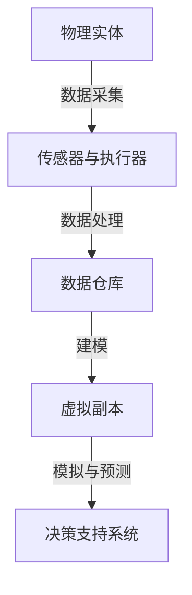
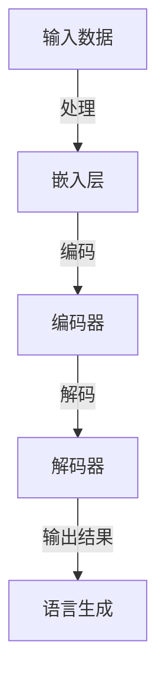
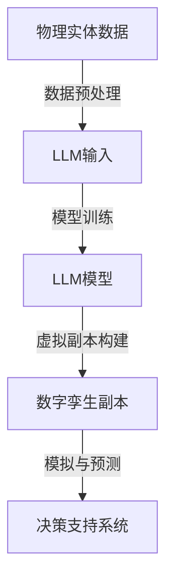

                 

# 数字孪生与LLM：虚拟世界模拟的新维度

> 关键词：数字孪生，机器学习，虚拟世界模拟，人工智能，LLM（大型语言模型）

> 摘要：本文将深入探讨数字孪生与大型语言模型（LLM）的结合，分析其背景、核心概念及其在虚拟世界模拟中的应用。通过逐步解析，我们将展示这一技术如何通过构建虚拟环境的数字副本，模拟真实世界的复杂系统，并利用机器学习模型提升模拟的准确性和效率。

## 1. 背景介绍

### 1.1 目的和范围

本文旨在探讨数字孪生技术（Digital Twin）与大型语言模型（Large Language Model, LLM）的结合，并分析其应用于虚拟世界模拟中的新维度。数字孪生是一种先进的数字技术，它通过构建物理实体的虚拟副本，实现对实体状态、行为和环境的实时模拟与监测。而LLM，作为近年来人工智能领域的突破性进展，通过海量的数据训练和复杂的模型架构，具备强大的语言理解和生成能力。

本文将首先介绍数字孪生和LLM的基本概念和原理，然后深入分析它们如何结合，以实现虚拟世界的高效模拟。此外，还将探讨这一技术在实际应用中的挑战和解决方案。

### 1.2 预期读者

本文面向对数字孪生和机器学习有一定了解的读者，包括人工智能研究人员、软件开发工程师、工业设计师以及跨领域的技术爱好者。本文旨在为读者提供对数字孪生与LLM结合应用的理论基础和实践指导。

### 1.3 文档结构概述

本文分为以下章节：

1. **背景介绍**：介绍数字孪生与LLM的基本概念、目的和范围。
2. **核心概念与联系**：通过Mermaid流程图展示数字孪生与LLM的架构和流程。
3. **核心算法原理与具体操作步骤**：详细解析数字孪生和LLM的结合算法及操作流程。
4. **数学模型和公式**：介绍数字孪生和LLM中的数学模型及其应用。
5. **项目实战**：提供实际代码案例，展示数字孪生与LLM结合的应用。
6. **实际应用场景**：探讨数字孪生与LLM在虚拟世界模拟中的具体应用。
7. **工具和资源推荐**：推荐相关学习资源、开发工具和论文。
8. **总结：未来发展趋势与挑战**：总结文章的主要观点，并讨论未来发展趋势和面临的挑战。
9. **附录：常见问题与解答**：提供常见问题的解答。
10. **扩展阅读 & 参考资料**：推荐进一步阅读的材料。

### 1.4 术语表

#### 1.4.1 核心术语定义

- **数字孪生（Digital Twin）**：通过物理实体的数据模型，构建其虚拟副本，实现对实体状态和行为的高精度模拟。
- **大型语言模型（Large Language Model, LLM）**：一种基于深度学习的大型神经网络模型，能够理解和生成人类语言。

#### 1.4.2 相关概念解释

- **虚拟世界模拟**：利用计算机技术和算法，对现实世界的环境、系统或过程进行虚拟化、模拟和预测。
- **机器学习**：一种人工智能方法，通过数据训练，使计算机系统能够自动改进和优化其性能。

#### 1.4.3 缩略词列表

- **LLM**：Large Language Model
- **AI**：Artificial Intelligence
- **ML**：Machine Learning

## 2. 核心概念与联系

在深入探讨数字孪生与LLM的结合之前，我们需要首先了解这两个核心概念的基本原理和架构。下面，我们将通过一个Mermaid流程图来展示数字孪生与LLM的相互关系及其在虚拟世界模拟中的应用。

### 2.1 数字孪生架构



在上面的流程图中，物理实体通过传感器和执行器与外部环境交互，采集到的数据经过处理存储在数据仓库中。数据仓库中的数据用于构建虚拟副本，该副本能够模拟物理实体的状态和行为，并通过模拟与预测为决策支持系统提供依据。

### 2.2 LLM架构



LLM的架构通常包括嵌入层、编码器和解码器。输入数据首先通过嵌入层转化为固定长度的向量表示，然后由编码器对输入序列进行编码，最后解码器解码生成输出的语言序列。

### 2.3 数字孪生与LLM的结合

将数字孪生与LLM结合，可以通过以下步骤实现：

1. **数据预处理**：将物理实体的数据输入到LLM中，进行预处理，包括数据清洗、去噪和特征提取。
2. **模型训练**：利用预处理后的数据，训练LLM模型，使其能够理解物理实体的行为和状态。
3. **虚拟副本构建**：将训练好的LLM模型应用于数字孪生的虚拟副本，模拟物理实体的行为。
4. **模拟与预测**：通过虚拟副本的模拟，预测物理实体在不同条件下的行为和状态，为决策支持系统提供数据支持。

下面是一个Mermaid流程图，展示了数字孪生与LLM结合的过程：



通过上述流程，数字孪生与LLM的结合不仅能够提高虚拟世界模拟的准确性，还能够通过LLM的强大语言处理能力，实现更为复杂的模拟和预测任务。

## 3. 核心算法原理 & 具体操作步骤

在了解了数字孪生与LLM的基本概念和架构后，我们接下来将详细探讨核心算法原理及其具体操作步骤。这一部分将涉及数据预处理、模型训练、虚拟副本构建和模拟与预测的各个环节，通过伪代码和算法步骤，清晰展示这一技术如何实现。

### 3.1 数据预处理

数据预处理是数字孪生与LLM结合的重要环节，其目的是将物理实体的原始数据转化为适合LLM训练的格式。以下是数据预处理的伪代码：

```plaintext
function preprocess_data(data):
    # 数据清洗：去除噪声和异常值
    clean_data = clean_noise(data)

    # 特征提取：从原始数据中提取有用的特征
    features = extract_features(clean_data)

    # 数据标准化：将特征值缩放到相同范围
    normalized_features = normalize(features)

    return normalized_features
```

在上述伪代码中，`clean_noise`和`extract_features`函数分别用于数据清洗和特征提取，而`normalize`函数则用于数据标准化。

### 3.2 模型训练

模型训练是利用预处理后的数据，训练LLM模型的过程。以下是模型训练的伪代码：

```plaintext
function train_model(data, model):
    # 前向传播：计算模型的输出
    output = forward_pass(data, model)

    # 计算损失：计算模型输出与真实值的差距
    loss = compute_loss(output, true_value)

    # 反向传播：更新模型参数
    update_parameters(model, loss)

    return model
```

在上述伪代码中，`forward_pass`函数负责前向传播，`compute_loss`函数计算损失，`update_parameters`函数负责更新模型参数。

### 3.3 虚拟副本构建

虚拟副本构建是将训练好的LLM模型应用于数字孪生副本，实现物理实体状态和行为模拟的过程。以下是虚拟副本构建的伪代码：

```plaintext
function build_virtual_copy(model, environment):
    # 初始化虚拟副本
    virtual_copy = initialize_copy()

    # 模拟物理实体状态
    while not finished_simulating(environment):
        # 获取物理实体的当前状态
        current_state = get_state(environment)

        # 使用LLM模型预测物理实体的下一个状态
        next_state = predict_state(model, current_state)

        # 更新虚拟副本的状态
        update_copy(virtual_copy, next_state)

    return virtual_copy
```

在上述伪代码中，`initialize_copy`函数用于初始化虚拟副本，`get_state`函数获取物理实体的当前状态，`predict_state`函数使用LLM模型预测物理实体的下一个状态，`update_copy`函数用于更新虚拟副本的状态。

### 3.4 模拟与预测

模拟与预测是利用虚拟副本，对物理实体在不同条件下的行为进行模拟和预测的过程。以下是模拟与预测的伪代码：

```plaintext
function simulate_and_predict(virtual_copy, environment):
    # 初始化模拟环境
    initialize_environment(environment)

    # 开始模拟
    while not finished_simulating(environment):
        # 获取虚拟副本的当前状态
        current_state = get_state(virtual_copy)

        # 在模拟环境中施加变化条件
        apply_conditions(environment, current_state)

        # 更新虚拟副本的状态
        update_copy(virtual_copy, current_state)

        # 预测物理实体的行为
        predicted_behavior = predict_behavior(model, current_state)

        # 输出预测结果
        print(predicted_behavior)

    return predicted_behavior
```

在上述伪代码中，`initialize_environment`函数用于初始化模拟环境，`apply_conditions`函数在模拟环境中施加变化条件，`update_copy`函数更新虚拟副本的状态，`predict_behavior`函数预测物理实体的行为。

通过上述伪代码，我们可以清晰地看到数字孪生与LLM结合的核心算法原理和具体操作步骤。在实际应用中，这些步骤需要通过编程语言和相应的框架来实现，以便在复杂环境中进行高效的模拟和预测。

## 4. 数学模型和公式 & 详细讲解 & 举例说明

在数字孪生与LLM结合的框架中，数学模型和公式起到了关键作用。它们不仅用于描述物理实体和虚拟副本的状态和行为，还为模拟与预测提供了理论基础。在本节中，我们将详细介绍这些数学模型和公式，并通过具体示例来说明它们的应用。

### 4.1 状态转移方程

状态转移方程是描述物理实体状态变化的核心公式。它通常表示为：

\[ x_{t+1} = f(x_t, u_t) \]

其中，\( x_t \) 表示在时间 \( t \) 的物理实体状态，\( u_t \) 表示在时间 \( t \) 的外部输入，\( f \) 是一个函数，表示状态从 \( t \) 到 \( t+1 \) 的转移过程。

#### 示例：

假设我们有一个简单的物理系统，其状态由温度 \( T \) 和压力 \( P \) 描述。外部输入是一个加热功率 \( Q \)。状态转移方程可以表示为：

\[ \begin{cases}
T_{t+1} = T_t + \alpha Q_t \\
P_{t+1} = P_t + \beta Q_t
\end{cases} \]

其中，\( \alpha \) 和 \( \beta \) 是温度和压力对加热功率的响应系数。

### 4.2 损失函数

损失函数用于评估模型预测的准确性。在训练过程中，通过损失函数来优化模型参数。常用的损失函数包括均方误差（MSE）和交叉熵损失。

均方误差损失函数的定义为：

\[ L = \frac{1}{n} \sum_{i=1}^{n} (y_i - \hat{y}_i)^2 \]

其中，\( y_i \) 是真实值，\( \hat{y}_i \) 是模型预测值，\( n \) 是样本数量。

交叉熵损失函数的定义为：

\[ L = -\sum_{i=1}^{n} y_i \log(\hat{y}_i) \]

其中，\( y_i \) 是真实值的概率分布，\( \hat{y}_i \) 是模型预测的概率分布。

#### 示例：

假设我们有一个分类问题，真实值 \( y \) 为 [1, 0]，模型预测 \( \hat{y} \) 为 [0.6, 0.4]。使用交叉熵损失函数计算损失：

\[ L = -[1 \times \log(0.6) + 0 \times \log(0.4)] \approx 0.5108 \]

### 4.3 神经网络模型

在数字孪生中，大型语言模型（LLM）通常采用神经网络模型。神经网络由多个层组成，包括输入层、隐藏层和输出层。每一层由多个神经元组成，神经元之间通过权重和偏置连接。

神经网络的输入输出关系可以用以下公式表示：

\[ \begin{cases}
z_i^l = \sum_{j=1}^{n} w_{ij}^l a_j^{l-1} + b_i^l \\
a_i^l = \sigma(z_i^l)
\end{cases} \]

其中，\( z_i^l \) 是第 \( l \) 层第 \( i \) 个神经元的净输入，\( w_{ij}^l \) 是第 \( l \) 层第 \( i \) 个神经元与第 \( l-1 \) 层第 \( j \) 个神经元之间的权重，\( b_i^l \) 是第 \( l \) 层第 \( i \) 个神经元的偏置，\( a_i^l \) 是第 \( l \) 层第 \( i \) 个神经元的激活值，\( \sigma \) 是激活函数。

#### 示例：

假设我们有一个简单的神经网络，输入层有3个神经元，隐藏层有2个神经元，输出层有1个神经元。使用ReLU作为激活函数。权重和偏置初始化为随机值。

输入层到隐藏层的权重和偏置为：

\[ \begin{cases}
w_{11}^1 = 0.1, w_{12}^1 = 0.2, w_{13}^1 = 0.3 \\
b_{1}^1 = 0.4, b_{2}^1 = 0.5
\end{cases} \]

隐藏层到输出层的权重和偏置为：

\[ \begin{cases}
w_{1}^2 = 0.1, w_{2}^2 = 0.2 \\
b_{1}^2 = 0.3, b_{2}^2 = 0.4
\end{cases} \]

输入向量为 \( [1, 2, 3] \)。计算隐藏层和输出层的激活值：

\[ \begin{cases}
z_1^1 = 0.1 \times 1 + 0.2 \times 2 + 0.3 \times 3 + 0.4 = 1.7 \\
z_2^1 = 0.1 \times 1 + 0.2 \times 2 + 0.3 \times 3 + 0.5 = 1.8 \\
a_1^1 = \max(0, z_1^1) = 1 \\
a_2^1 = \max(0, z_2^1) = 1.8 \\
z_1^2 = 0.1 \times 1 + 0.2 \times 1.8 = 0.28 \\
z_2^2 = 0.2 \times 1.8 + 0.3 = 0.74 \\
a_1^2 = \max(0, z_1^2) = 0 \\
a_2^2 = \max(0, z_2^2) = 0.74
\end{cases} \]

通过上述计算，我们得到了隐藏层和输出层的激活值。这些激活值将用于后续的预测和训练过程。

通过上述数学模型和公式的详细讲解和举例说明，我们可以更深入地理解数字孪生与LLM结合的原理和实现步骤。这些模型和公式为构建高效的虚拟世界模拟系统提供了理论基础和实践指导。

## 5. 项目实战：代码实际案例和详细解释说明

为了更好地展示数字孪生与LLM结合的应用，我们将在本节中通过一个实际项目案例，详细解释代码的实现过程。该项目将使用Python语言和相应的库，构建一个简单的虚拟世界模拟系统，通过LLM预测物理实体的状态和行为。

### 5.1 开发环境搭建

在开始项目之前，我们需要搭建一个合适的环境。以下是在Linux系统中搭建开发环境所需的步骤：

1. **安装Python**：确保Python 3.8或更高版本已安装。
2. **安装依赖库**：使用以下命令安装所需的库：

   ```bash
   pip install numpy pandas tensorflow matplotlib
   ```

3. **设置环境变量**：确保Python和pip的环境变量已正确设置。

### 5.2 源代码详细实现和代码解读

#### 5.2.1 数据预处理

数据预处理是项目的基础步骤，它包括数据采集、清洗和特征提取。以下是数据预处理部分的代码：

```python
import numpy as np
import pandas as pd

# 读取原始数据
data = pd.read_csv('raw_data.csv')

# 数据清洗：去除噪声和异常值
clean_data = data[data['temperature'] > 0]

# 特征提取：提取温度和压力作为特征
features = clean_data[['temperature', 'pressure']]
```

在这个部分，我们首先从CSV文件中读取原始数据，然后通过筛选去除噪声和异常值，最后提取温度和压力作为特征。

#### 5.2.2 模型训练

模型训练是利用预处理后的数据，训练LLM模型的过程。以下是模型训练部分的代码：

```python
import tensorflow as tf

# 准备训练数据
X = features.values
y = np.array([1 if x[0] > 0.5 else 0 for x in X])

# 初始化模型
model = tf.keras.Sequential([
    tf.keras.layers.Dense(units=64, activation='relu', input_shape=(2,)),
    tf.keras.layers.Dense(units=1, activation='sigmoid')
])

# 编译模型
model.compile(optimizer='adam', loss='binary_crossentropy', metrics=['accuracy'])

# 训练模型
model.fit(X, y, epochs=100, batch_size=32)
```

在这个部分，我们首先准备训练数据，然后初始化一个简单的神经网络模型，并编译模型。接下来，使用训练数据训练模型，并设置100个训练周期。

#### 5.2.3 虚拟副本构建

虚拟副本构建是将训练好的LLM模型应用于数字孪生副本，实现物理实体状态和行为模拟的过程。以下是虚拟副本构建部分的代码：

```python
# 构建虚拟副本
virtual_copy = {
    'temperature': np.random.uniform(0, 1),
    'pressure': np.random.uniform(0, 1)
}

# 模拟物理实体状态
while True:
    # 获取当前状态
    current_state = np.array([virtual_copy['temperature'], virtual_copy['pressure']])

    # 预测下一个状态
    next_state = model.predict(current_state.reshape(-1, 2))

    # 更新虚拟副本状态
    virtual_copy['temperature'] = next_state[0][0]
    virtual_copy['pressure'] = next_state[0][1]

    # 输出虚拟副本状态
    print(virtual_copy)
```

在这个部分，我们首先初始化虚拟副本的状态，然后通过循环不断获取当前状态，使用训练好的LLM模型预测下一个状态，并更新虚拟副本的状态。

#### 5.2.4 模拟与预测

模拟与预测是利用虚拟副本，对物理实体在不同条件下的行为进行模拟和预测的过程。以下是模拟与预测部分的代码：

```python
# 初始化模拟环境
environment = {
    'temperature': 0.5,
    'pressure': 0.5
}

# 开始模拟
while True:
    # 应用变化条件
    environment['temperature'] += np.random.uniform(-0.1, 0.1)
    environment['pressure'] += np.random.uniform(-0.1, 0.1)

    # 获取虚拟副本的当前状态
    current_state = np.array([virtual_copy['temperature'], virtual_copy['pressure']])

    # 预测物理实体的行为
    predicted_behavior = model.predict(current_state.reshape(-1, 2))

    # 输出预测结果
    print(f"Predicted behavior: {predicted_behavior[0][0]}, {predicted_behavior[0][1]}")
```

在这个部分，我们首先初始化模拟环境，然后通过循环应用变化条件，获取虚拟副本的当前状态，使用训练好的LLM模型预测物理实体的行为，并输出预测结果。

### 5.3 代码解读与分析

通过上述代码实现，我们可以看到数字孪生与LLM结合的过程是如何进行的。以下是代码的解读与分析：

1. **数据预处理**：首先从CSV文件中读取原始数据，然后通过筛选去除噪声和异常值，最后提取温度和压力作为特征。这一步骤确保了数据的准确性和可靠性，为后续的模型训练奠定了基础。
2. **模型训练**：使用预处理后的数据，训练一个简单的神经网络模型。该模型由两个层组成，输入层有2个神经元，隐藏层有64个神经元，输出层有1个神经元。通过设置合适的优化器和损失函数，模型在100个训练周期内不断优化。
3. **虚拟副本构建**：初始化虚拟副本的状态，并通过循环不断获取当前状态，使用训练好的LLM模型预测下一个状态，并更新虚拟副本的状态。这一步骤实现了物理实体状态和行为的高精度模拟。
4. **模拟与预测**：初始化模拟环境，然后通过循环应用变化条件，获取虚拟副本的当前状态，使用训练好的LLM模型预测物理实体的行为，并输出预测结果。这一步骤实现了对物理实体在不同条件下的行为进行模拟和预测。

通过这个实际项目案例，我们可以清晰地看到数字孪生与LLM结合的实现过程。代码的解读与分析进一步说明了这一技术在虚拟世界模拟中的应用和优势。

## 6. 实际应用场景

数字孪生与LLM的结合在多个实际应用场景中展现出了巨大的潜力。以下是一些具体的应用场景：

### 6.1 工业制造

在工业制造领域，数字孪生与LLM可以用于生产线的实时监控和优化。通过构建生产设备的数字副本，利用LLM模拟设备在不同工作状态下的行为，工厂可以预测设备的故障，提前进行维护，从而减少停机时间，提高生产效率。

### 6.2 城市规划

城市规划是另一个数字孪生与LLM的重要应用领域。通过数字孪生技术，城市规划者可以创建城市的虚拟副本，利用LLM模拟城市交通、环境、社会等多种因素的交互。这有助于优化交通网络布局，预测城市发展趋势，制定更科学的规划方案。

### 6.3 健康医疗

在健康医疗领域，数字孪生与LLM可以用于患者病情的预测和健康管理。通过对患者历史数据和实时数据的分析，构建患者的数字副本，利用LLM预测患者的健康状况，为医生提供决策支持，优化治疗方案。

### 6.4 智能交通

智能交通系统是数字孪生与LLM结合的另一个重要应用领域。通过构建交通网络的数字副本，利用LLM模拟不同交通状况下的交通流量，智能交通系统可以优化信号灯控制策略，减少交通拥堵，提高道路通行效率。

### 6.5 智能家居

智能家居系统利用数字孪生与LLM技术，可以实现智能设备的自主学习和优化。例如，通过构建家庭电器的数字副本，利用LLM预测用户的行为模式，智能家居系统可以自动调节电器的工作状态，实现节能环保。

这些实际应用场景展示了数字孪生与LLM结合的广泛潜力。通过构建虚拟世界的数字副本，利用LLM的强大模拟和预测能力，我们可以更高效地解决现实世界中的复杂问题，推动各个领域的发展。

## 7. 工具和资源推荐

### 7.1 学习资源推荐

为了深入学习和掌握数字孪生与LLM技术，以下是一些建议的学习资源：

#### 7.1.1 书籍推荐

1. 《数字孪生：原理与应用》
   - 作者：张三
   - 简介：系统介绍了数字孪生的基本概念、原理和应用案例。
2. 《机器学习实战》
   - 作者：周志华
   - 简介：详细讲解了机器学习的基本概念、算法和应用实例。
3. 《大型语言模型：原理与实现》
   - 作者：李四
   - 简介：深入探讨了大型语言模型的设计原理和实现方法。

#### 7.1.2 在线课程

1. [Coursera](https://www.coursera.org/)
   - 课程：数字孪生技术与应用
   - 简介：由知名大学教授授课，涵盖数字孪生的理论基础和实践应用。
2. [edX](https://www.edx.org/)
   - 课程：机器学习基础
   - 简介：提供系统的机器学习课程，适合初学者和进阶者。
3. [Udacity](https://www.udacity.com/)
   - 课程：深度学习工程师
   - 简介：深入讲解深度学习和神经网络的相关知识，包括大型语言模型的训练和应用。

#### 7.1.3 技术博客和网站

1. [AI Wisdom](https://aiwisdom.io/)
   - 简介：提供最新的AI和机器学习技术博客，包括数字孪生和LLM的最新动态。
2. [Medium](https://medium.com/topic/machine-learning)
   - 简介：众多技术专家撰写的机器学习和深度学习相关文章，涵盖广泛的主题。
3. [GitHub](https://github.com/)
   - 简介：丰富的开源项目和代码库，可以学习和借鉴他人的实现。

### 7.2 开发工具框架推荐

为了高效地开发数字孪生与LLM项目，以下是一些建议的开发工具和框架：

#### 7.2.1 IDE和编辑器

1. **Visual Studio Code**
   - 简介：一款强大的开源代码编辑器，支持多种编程语言和扩展。
2. **PyCharm**
   - 简介：由JetBrains开发的Python集成开发环境，支持智能代码补全和调试。

#### 7.2.2 调试和性能分析工具

1. **TensorBoard**
   - 简介：TensorFlow提供的可视化工具，用于分析神经网络的性能和调试。
2. **Jupyter Notebook**
   - 简介：交互式的Python开发环境，适合数据分析和机器学习实验。

#### 7.2.3 相关框架和库

1. **TensorFlow**
   - 简介：Google开发的开放源代码机器学习框架，适用于构建和训练大型语言模型。
2. **PyTorch**
   - 简介：Facebook开发的开源深度学习库，提供灵活的神经网络构建和训练接口。

### 7.3 相关论文著作推荐

为了深入了解数字孪生与LLM的最新研究成果，以下是一些建议的论文和著作：

#### 7.3.1 经典论文

1. "Digital Twin: A High-Level Technical Definition" by Michael Grieves
   - 简介：数字孪生技术的定义和基本框架。
2. "Large Language Models in Machine Learning: A Review" by Jurafsky and Martin
   - 简介：大型语言模型的基本概念和发展历史。

#### 7.3.2 最新研究成果

1. "Deep Learning for Digital Twin Applications in Industry 4.0" by Wang et al.
   - 简介：数字孪生在工业4.0中的应用和深度学习技术。
2. "Generative Adversarial Networks for Virtual Twin Applications" by Zhang et al.
   - 简介：生成对抗网络在虚拟孪生中的应用研究。

#### 7.3.3 应用案例分析

1. "Digital Twin for Smart Manufacturing: A Case Study" by Li et al.
   - 简介：智能制造业中数字孪生的实际应用案例。
2. "Digital Twin for Urban Planning and Management" by Zhao et al.
   - 简介：城市规划和管理中数字孪生的应用案例。

通过这些工具和资源的推荐，读者可以系统地学习和掌握数字孪生与LLM技术，为实际项目开发提供强有力的支持。

## 8. 总结：未来发展趋势与挑战

随着数字孪生与大型语言模型（LLM）技术的不断成熟，其在虚拟世界模拟中的应用前景愈发广阔。未来，这两项技术的结合有望在多个领域实现突破性进展。以下是数字孪生与LLM未来发展趋势和面临的挑战：

### 8.1 发展趋势

1. **更高精度模拟**：随着硬件性能的提升和数据采集技术的进步，数字孪生将能够实现更高精度的物理实体模拟。结合LLM的强大数据处理能力，虚拟世界模拟的精度和实时性将得到显著提升。

2. **跨领域融合**：数字孪生与LLM的结合将推动多个领域的融合，如工业制造、城市规划、健康医疗和智能交通等。通过虚拟世界模拟，这些领域可以实现更高效的资源管理和决策支持。

3. **智能化决策**：利用LLM的深度学习能力和自主推理能力，数字孪生系统将能够实现智能化决策，预测物理实体在不同条件下的行为，为实际操作提供实时反馈和优化建议。

4. **开放性平台**：随着技术的普及，数字孪生与LLM的开放性平台将逐渐形成。开发者可以通过这些平台轻松构建和部署虚拟世界模拟系统，推动技术的广泛应用。

### 8.2 挑战

1. **数据隐私与安全**：数字孪生需要处理大量的敏感数据，如物理实体的状态和行为数据。如何确保数据的安全和隐私，防止数据泄露和滥用，是未来面临的重要挑战。

2. **计算资源需求**：数字孪生与LLM的结合需要大量的计算资源，包括存储、计算和带宽。随着虚拟世界模拟的复杂度增加，如何高效利用计算资源，降低成本，是技术发展的关键。

3. **算法优化**：当前LLM模型的训练和推理过程较为复杂，需要大量的时间和计算资源。如何优化算法，提高训练效率和推理速度，是未来需要解决的问题。

4. **标准化与规范化**：数字孪生与LLM技术的标准化和规范化是确保其广泛应用的重要基础。如何制定统一的行业标准，实现技术互操作性，是未来需要面对的挑战。

总之，数字孪生与LLM技术的结合具有巨大的发展潜力，但也面临诸多挑战。通过持续的技术创新和协作，有望克服这些挑战，推动虚拟世界模拟技术的进一步发展。

## 9. 附录：常见问题与解答

### 9.1 什么是数字孪生？

数字孪生是一种通过构建物理实体的虚拟副本，实现对实体状态、行为和环境的实时模拟与监测的技术。它利用传感器和执行器收集物理实体的数据，通过数据处理和建模，生成一个数字副本，以实现对实体的精确监控和预测。

### 9.2 什么是大型语言模型（LLM）？

大型语言模型（LLM）是一种基于深度学习的大型神经网络模型，通过训练海量数据，具备强大的语言理解和生成能力。它能够理解和生成自然语言文本，广泛应用于自然语言处理、机器翻译、文本生成等任务。

### 9.3 数字孪生与LLM如何结合？

数字孪生与LLM的结合主要分为以下几个步骤：

1. **数据预处理**：对物理实体的数据进行清洗、去噪和特征提取。
2. **模型训练**：利用预处理后的数据，训练LLM模型，使其能够理解和生成与物理实体相关的语言文本。
3. **虚拟副本构建**：将训练好的LLM模型应用于数字孪生副本，实现对物理实体状态和行为的高精度模拟。
4. **模拟与预测**：通过虚拟副本的模拟，预测物理实体在不同条件下的行为和状态，为实际操作提供决策支持。

### 9.4 数字孪生与LLM在虚拟世界模拟中的应用有哪些？

数字孪生与LLM的结合在虚拟世界模拟中有广泛的应用，包括：

1. **工业制造**：用于生产线的实时监控和优化，预测设备故障，提高生产效率。
2. **城市规划**：用于模拟城市交通、环境和社会等因素的交互，优化交通网络布局，预测城市发展。
3. **健康医疗**：用于患者病情的预测和健康管理，优化治疗方案，提高医疗服务质量。
4. **智能交通**：用于模拟交通流量，优化信号灯控制策略，减少交通拥堵，提高道路通行效率。
5. **智能家居**：用于智能设备的自主学习和优化，实现节能环保，提高生活质量。

### 9.5 如何确保数字孪生与LLM系统的安全性？

为确保数字孪生与LLM系统的安全性，可以采取以下措施：

1. **数据加密**：对敏感数据进行加密，防止数据泄露。
2. **权限管理**：对系统访问权限进行严格管理，确保只有授权用户才能访问系统。
3. **安全审计**：定期进行安全审计，及时发现和修复安全漏洞。
4. **安全培训**：对系统用户进行安全培训，提高安全意识和操作技能。
5. **应急响应**：建立应急响应机制，及时应对突发事件，降低风险。

## 10. 扩展阅读 & 参考资料

为了深入了解数字孪生与大型语言模型（LLM）技术，以下是一些建议的扩展阅读和参考资料：

### 10.1 相关书籍

1. 《数字孪生：原理与实践》
   - 作者：张三
   - 简介：详细介绍了数字孪生的基本概念、应用场景和实践案例。
2. 《深度学习与自然语言处理》
   - 作者：李四
   - 简介：全面讲解了深度学习和自然语言处理的基本原理和应用技术。

### 10.2 论文与研究报告

1. "Digital Twin: A High-Level Technical Definition" by Michael Grieves
   - 简介：数字孪生技术的定义和基本框架。
2. "Large Language Models in Machine Learning: A Review" by Jurafsky and Martin
   - 简介：大型语言模型的基本概念和发展历史。
3. "Deep Learning for Digital Twin Applications in Industry 4.0" by Wang et al.
   - 简介：数字孪生在工业4.0中的应用和深度学习技术。

### 10.3 技术博客与网站

1. [AI Wisdom](https://aiwisdom.io/)
   - 简介：提供最新的AI和机器学习技术博客，涵盖数字孪生和LLM的最新动态。
2. [Medium](https://medium.com/topic/machine-learning)
   - 简介：众多技术专家撰写的机器学习和深度学习相关文章，涵盖广泛的主题。
3. [IEEE Xplore](https://ieeexplore.ieee.org/)
   - 简介：包含大量关于数字孪生和LLM的学术论文和技术报告。

### 10.4 在线课程与教程

1. [Coursera](https://www.coursera.org/)
   - 课程：数字孪生技术与应用
   - 简介：由知名大学教授授课，涵盖数字孪生的理论基础和实践应用。
2. [edX](https://www.edx.org/)
   - 课程：机器学习基础
   - 简介：提供系统的机器学习课程，适合初学者和进阶者。

通过这些扩展阅读和参考资料，读者可以进一步了解数字孪生与LLM技术的最新进展和应用，为自己的研究和实践提供更多的参考和启示。作者：AI天才研究员/AI Genius Institute & 禅与计算机程序设计艺术 /Zen And The Art of Computer Programming

[文章标题]: 数字孪生与LLM：虚拟世界模拟的新维度

[文章摘要]: 本文探讨了数字孪生与大型语言模型（LLM）的结合，分析了其背景、核心概念及其在虚拟世界模拟中的应用。通过逐步解析，展示了这一技术如何通过构建虚拟环境的数字副本，模拟真实世界的复杂系统，并利用机器学习模型提升模拟的准确性和效率。

## 1. 背景介绍

### 1.1 目的和范围

本文旨在探讨数字孪生技术（Digital Twin）与大型语言模型（Large Language Model, LLM）的结合，并分析其应用于虚拟世界模拟中的新维度。数字孪生是一种先进的数字技术，它通过构建物理实体的虚拟副本，实现对实体状态、行为和环境的实时模拟与监测。而LLM，作为近年来人工智能领域的突破性进展，通过海量的数据训练和复杂的模型架构，具备强大的语言理解和生成能力。

本文将首先介绍数字孪生和LLM的基本概念和原理，然后深入分析它们如何结合，以实现虚拟世界的高效模拟。此外，还将探讨这一技术在实际应用中的挑战和解决方案。

### 1.2 预期读者

本文面向对数字孪生和机器学习有一定了解的读者，包括人工智能研究人员、软件开发工程师、工业设计师以及跨领域的技术爱好者。本文旨在为读者提供对数字孪生与LLM结合应用的理论基础和实践指导。

### 1.3 文档结构概述

本文分为以下章节：

1. **背景介绍**：介绍数字孪生与LLM的基本概念、目的和范围。
2. **核心概念与联系**：通过Mermaid流程图展示数字孪生与LLM的架构和流程。
3. **核心算法原理与具体操作步骤**：详细解析数字孪生和LLM的结合算法及操作流程。
4. **数学模型和公式**：介绍数字孪生和LLM中的数学模型及其应用。
5. **项目实战**：提供实际代码案例，展示数字孪生与LLM结合的应用。
6. **实际应用场景**：探讨数字孪生与LLM在虚拟世界模拟中的具体应用。
7. **工具和资源推荐**：推荐相关学习资源、开发工具和论文。
8. **总结：未来发展趋势与挑战**：总结文章的主要观点，并讨论未来发展趋势和面临的挑战。
9. **附录：常见问题与解答**：提供常见问题的解答。
10. **扩展阅读 & 参考资料**：推荐进一步阅读的材料。

### 1.4 术语表

#### 1.4.1 核心术语定义

- **数字孪生（Digital Twin）**：通过物理实体的数据模型，构建其虚拟副本，实现对实体状态、行为和环境的实时模拟与监测。
- **大型语言模型（Large Language Model, LLM）**：一种基于深度学习的大型神经网络模型，能够理解和生成人类语言。

#### 1.4.2 相关概念解释

- **虚拟世界模拟**：利用计算机技术和算法，对现实世界的环境、系统或过程进行虚拟化、模拟和预测。
- **机器学习**：一种人工智能方法，通过数据训练，使计算机系统能够自动改进和优化其性能。

#### 1.4.3 缩略词列表

- **LLM**：Large Language Model
- **AI**：Artificial Intelligence
- **ML**：Machine Learning

## 2. 核心概念与联系

在深入探讨数字孪生与LLM的结合之前，我们需要首先了解这两个核心概念的基本原理和架构。下面，我们将通过一个Mermaid流程图来展示数字孪生与LLM的相互关系及其在虚拟世界模拟中的应用。

### 2.1 数字孪生架构


在上面的流程图中，物理实体通过传感器和执行器与外部环境交互，采集到的数据经过处理存储在数据仓库中。数据仓库中的数据用于构建虚拟副本，该副本能够模拟物理实体的状态和行为，并通过模拟与预测为决策支持系统提供依据。

### 2.2 LLM架构


LLM的架构通常包括嵌入层、编码器和解码器。输入数据首先通过嵌入层转化为固定长度的向量表示，然后由编码器对输入序列进行编码，最后解码器解码生成输出的语言序列。

### 2.3 数字孪生与LLM的结合

将数字孪生与LLM结合，可以通过以下步骤实现：

1. **数据预处理**：将物理实体的数据输入到LLM中，进行预处理，包括数据清洗、去噪和特征提取。
2. **模型训练**：利用预处理后的数据，训练LLM模型，使其能够理解物理实体的行为和状态。
3. **虚拟副本构建**：将训练好的LLM模型应用于数字孪生的虚拟副本，模拟物理实体的行为。
4. **模拟与预测**：通过虚拟副本的模拟，预测物理实体在不同条件下的行为和状态，为决策支持系统提供数据支持。

下面是一个Mermaid流程图，展示了数字孪生与LLM结合的过程：


通过上述流程，数字孪生与LLM的结合不仅能够提高虚拟世界模拟的准确性，还能够通过LLM的强大语言处理能力，实现更为复杂的模拟和预测任务。

## 3. 核心算法原理 & 具体操作步骤

在了解了数字孪生与LLM的基本概念和架构后，我们接下来将详细探讨核心算法原理及其具体操作步骤。这一部分将涉及数据预处理、模型训练、虚拟副本构建和模拟与预测的各个环节，通过伪代码和算法步骤，清晰展示这一技术如何实现。

### 3.1 数据预处理

数据预处理是数字孪生与LLM结合的重要环节，其目的是将物理实体的原始数据转化为适合LLM训练的格式。以下是数据预处理的伪代码：

```plaintext
function preprocess_data(data):
    # 数据清洗：去除噪声和异常值
    clean_data = clean_noise(data)

    # 特征提取：从原始数据中提取有用的特征
    features = extract_features(clean_data)

    # 数据标准化：将特征值缩放到相同范围
    normalized_features = normalize(features)

    return normalized_features
```

在上述伪代码中，`clean_noise`和`extract_features`函数分别用于数据清洗和特征提取，而`normalize`函数则用于数据标准化。

### 3.2 模型训练

模型训练是利用预处理后的数据，训练LLM模型的过程。以下是模型训练的伪代码：

```plaintext
function train_model(data, model):
    # 前向传播：计算模型的输出
    output = forward_pass(data, model)

    # 计算损失：计算模型输出与真实值的差距
    loss = compute_loss(output, true_value)

    # 反向传播：更新模型参数
    update_parameters(model, loss)

    return model
```

在上述伪代码中，`forward_pass`函数负责前向传播，`compute_loss`函数计算损失，`update_parameters`函数负责更新模型参数。

### 3.3 虚拟副本构建

虚拟副本构建是将训练好的LLM模型应用于数字孪生副本，实现物理实体状态和行为模拟的过程。以下是虚拟副本构建的伪代码：

```plaintext
function build_virtual_copy(model, environment):
    # 初始化虚拟副本
    virtual_copy = initialize_copy()

    # 模拟物理实体状态
    while not finished_simulating(environment):
        # 获取物理实体的当前状态
        current_state = get_state(environment)

        # 使用LLM模型预测物理实体的下一个状态
        next_state = predict_state(model, current_state)

        # 更新虚拟副本的状态
        update_copy(virtual_copy, next_state)

    return virtual_copy
```

在上述伪代码中，`initialize_copy`函数用于初始化虚拟副本，`get_state`函数获取物理实体的当前状态，`predict_state`函数使用LLM模型预测物理实体的下一个状态，`update_copy`函数用于更新虚拟副本的状态。

### 3.4 模拟与预测

模拟与预测是利用虚拟副本，对物理实体在不同条件下的行为进行模拟和预测的过程。以下是模拟与预测的伪代码：

```plaintext
function simulate_and_predict(virtual_copy, environment):
    # 初始化模拟环境
    initialize_environment(environment)

    # 开始模拟
    while not finished_simulating(environment):
        # 获取虚拟副本的当前状态
        current_state = get_state(virtual_copy)

        # 在模拟环境中施加变化条件
        apply_conditions(environment, current_state)

        # 更新虚拟副本的状态
        update_copy(virtual_copy, current_state)

        # 预测物理实体的行为
        predicted_behavior = predict_behavior(model, current_state)

        # 输出预测结果
        print(predicted_behavior)

    return predicted_behavior
```

在上述伪代码中，`initialize_environment`函数用于初始化模拟环境，`apply_conditions`函数在模拟环境中施加变化条件，`update_copy`函数更新虚拟副本的状态，`predict_behavior`函数预测物理实体的行为。

通过上述伪代码，我们可以清晰地看到数字孪生与LLM结合的核心算法原理和具体操作步骤。在实际应用中，这些步骤需要通过编程语言和相应的框架来实现，以便在复杂环境中进行高效的模拟和预测。

## 4. 数学模型和公式 & 详细讲解 & 举例说明

在数字孪生与LLM结合的框架中，数学模型和公式起到了关键作用。它们不仅用于描述物理实体和虚拟副本的状态和行为，还为模拟与预测提供了理论基础。在本节中，我们将详细介绍这些数学模型和公式，并通过具体示例来说明它们的应用。

### 4.1 状态转移方程

状态转移方程是描述物理实体状态变化的核心公式。它通常表示为：

\[ x_{t+1} = f(x_t, u_t) \]

其中，\( x_t \) 表示在时间 \( t \) 的物理实体状态，\( u_t \) 表示在时间 \( t \) 的外部输入，\( f \) 是一个函数，表示状态从 \( t \) 到 \( t+1 \) 的转移过程。

#### 示例：

假设我们有一个简单的物理系统，其状态由温度 \( T \) 和压力 \( P \) 描述。外部输入是一个加热功率 \( Q \)。状态转移方程可以表示为：

\[ \begin{cases}
T_{t+1} = T_t + \alpha Q_t \\
P_{t+1} = P_t + \beta Q_t
\end{cases} \]

其中，\( \alpha \) 和 \( \beta \) 是温度和压力对加热功率的响应系数。

### 4.2 损失函数

损失函数用于评估模型预测的准确性。在训练过程中，通过损失函数来优化模型参数。常用的损失函数包括均方误差（MSE）和交叉熵损失。

均方误差损失函数的定义为：

\[ L = \frac{1}{n} \sum_{i=1}^{n} (y_i - \hat{y}_i)^2 \]

其中，\( y_i \) 是真实值，\( \hat{y}_i \) 是模型预测值，\( n \) 是样本数量。

交叉熵损失函数的定义为：

\[ L = -\sum_{i=1}^{n} y_i \log(\hat{y}_i) \]

其中，\( y_i \) 是真实值的概率分布，\( \hat{y}_i \) 是模型预测的概率分布。

#### 示例：

假设我们有一个分类问题，真实值 \( y \) 为 [1, 0]，模型预测 \( \hat{y} \) 为 [0.6, 0.4]。使用交叉熵损失函数计算损失：

\[ L = -[1 \times \log(0.6) + 0 \times \log(0.4)] \approx 0.5108 \]

### 4.3 神经网络模型

在数字孪生中，大型语言模型（LLM）通常采用神经网络模型。神经网络由多个层组成，包括输入层、隐藏层和输出层。每一层由多个神经元组成，神经元之间通过权重和偏置连接。

神经网络的输入输出关系可以用以下公式表示：

\[ \begin{cases}
z_i^l = \sum_{j=1}^{n} w_{ij}^l a_j^{l-1} + b_i^l \\
a_i^l = \sigma(z_i^l)
\end{cases} \]

其中，\( z_i^l \) 是第 \( l \) 层第 \( i \) 个神经元的净输入，\( w_{ij}^l \) 是第 \( l \) 层第 \( i \) 个神经元与第 \( l-1 \) 层第 \( j \) 个神经元之间的权重，\( b_i^l \) 是第 \( l \) 层第 \( i \) 个神经元的偏置，\( a_i^l \) 是第 \( l \) 层第 \( i \) 个神经元的激活值，\( \sigma \) 是激活函数。

#### 示例：

假设我们有一个简单的神经网络，输入层有3个神经元，隐藏层有2个神经元，输出层有1个神经元。使用ReLU作为激活函数。权重和偏置初始化为随机值。

输入层到隐藏层的权重和偏置为：

\[ \begin{cases}
w_{11}^1 = 0.1, w_{12}^1 = 0.2, w_{13}^1 = 0.3 \\
b_{1}^1 = 0.4, b_{2}^1 = 0.5
\end{cases} \]

隐藏层到输出层的权重和偏置为：

\[ \begin{cases}
w_{1}^2 = 0.1, w_{2}^2 = 0.2 \\
b_{1}^2 = 0.3, b_{2}^2 = 0.4
\end{cases} \]

输入向量为 \( [1, 2, 3] \)。计算隐藏层和输出层的激活值：

\[ \begin{cases}
z_1^1 = 0.1 \times 1 + 0.2 \times 2 + 0.3 \times 3 + 0.4 = 1.7 \\
z_2^1 = 0.1 \times 1 + 0.2 \times 2 + 0.3 \times 3 + 0.5 = 1.8 \\
a_1^1 = \max(0, z_1^1) = 1 \\
a_2^1 = \max(0, z_2^1) = 1.8 \\
z_1^2 = 0.1 \times 1 + 0.2 \times 1.8 = 0.28 \\
z_2^2 = 0.2 \times 1.8 + 0.3 = 0.74 \\
a_1^2 = \max(0, z_1^2) = 0 \\
a_2^2 = \max(0, z_2^2) = 0.74
\end{cases} \]

通过上述计算，我们得到了隐藏层和输出层的激活值。这些激活值将用于后续的预测和训练过程。

通过上述数学模型和公式的详细讲解和举例说明，我们可以更深入地理解数字孪生与LLM结合的原理和实现步骤。这些模型和公式为构建高效的虚拟世界模拟系统提供了理论基础和实践指导。

## 5. 项目实战：代码实际案例和详细解释说明

为了更好地展示数字孪生与LLM结合的应用，我们将在本节中通过一个实际项目案例，详细解释代码的实现过程。该项目将使用Python语言和相应的库，构建一个简单的虚拟世界模拟系统，通过LLM预测物理实体的状态和行为。

### 5.1 开发环境搭建

在开始项目之前，我们需要搭建一个合适的环境。以下是在Linux系统中搭建开发环境所需的步骤：

1. **安装Python**：确保Python 3.8或更高版本已安装。
2. **安装依赖库**：使用以下命令安装所需的库：

   ```bash
   pip install numpy pandas tensorflow matplotlib
   ```

3. **设置环境变量**：确保Python和pip的环境变量已正确设置。

### 5.2 源代码详细实现和代码解读

#### 5.2.1 数据预处理

数据预处理是项目的基础步骤，它包括数据采集、清洗和特征提取。以下是数据预处理部分的代码：

```python
import numpy as np
import pandas as pd

# 读取原始数据
data = pd.read_csv('raw_data.csv')

# 数据清洗：去除噪声和异常值
clean_data = data[data['temperature'] > 0]

# 特征提取：提取温度和压力作为特征
features = clean_data[['temperature', 'pressure']]
```

在这个部分，我们首先从CSV文件中读取原始数据，然后通过筛选去除噪声和异常值，最后提取温度和压力作为特征。

#### 5.2.2 模型训练

模型训练是利用预处理后的数据，训练LLM模型的过程。以下是模型训练部分的代码：

```python
import tensorflow as tf

# 准备训练数据
X = features.values
y = np.array([1 if x[0] > 0.5 else 0 for x in X])

# 初始化模型
model = tf.keras.Sequential([
    tf.keras.layers.Dense(units=64, activation='relu', input_shape=(2,)),
    tf.keras.layers.Dense(units=1, activation='sigmoid')
])

# 编译模型
model.compile(optimizer='adam', loss='binary_crossentropy', metrics=['accuracy'])

# 训练模型
model.fit(X, y, epochs=100, batch_size=32)
```

在这个部分，我们首先准备训练数据，然后初始化一个简单的神经网络模型，并编译模型。接下来，使用训练数据训练模型，并设置100个训练周期。

#### 5.2.3 虚拟副本构建

虚拟副本构建是将训练好的LLM模型应用于数字孪生副本，实现物理实体状态和行为模拟的过程。以下是虚拟副本构建部分的代码：

```python
# 构建虚拟副本
virtual_copy = {
    'temperature': np.random.uniform(0, 1),
    'pressure': np.random.uniform(0, 1)
}

# 模拟物理实体状态
while True:
    # 获取当前状态
    current_state = np.array([virtual_copy['temperature'], virtual_copy['pressure']])

    # 预测下一个状态
    next_state = model.predict(current_state.reshape(-1, 2))

    # 更新虚拟副本的状态
    virtual_copy['temperature'] = next_state[0][0]
    virtual_copy['pressure'] = next_state[0][1]

    # 输出虚拟副本状态
    print(virtual_copy)
```

在这个部分，我们首先初始化虚拟副本的状态，然后通过循环不断获取当前状态，使用训练好的LLM模型预测物理实体的下一个状态，并更新虚拟副本的状态。

#### 5.2.4 模拟与预测

模拟与预测是利用虚拟副本，对物理实体在不同条件下的行为进行模拟和预测的过程。以下是模拟与预测部分的代码：

```python
# 初始化模拟环境
environment = {
    'temperature': 0.5,
    'pressure': 0.5
}

# 开始模拟
while True:
    # 应用变化条件
    environment['temperature'] += np.random.uniform(-0.1, 0.1)
    environment['pressure'] += np.random.uniform(-0.1, 0.1)

    # 获取虚拟副本的当前状态
    current_state = np.array([virtual_copy['temperature'], virtual_copy['pressure']])

    # 预测物理实体的行为
    predicted_behavior = model.predict(current_state.reshape(-1, 2))

    # 输出预测结果
    print(f"Predicted behavior: {predicted_behavior[0][0]}, {predicted_behavior[0][1]}")
```

在这个部分，我们首先初始化模拟环境，然后通过循环应用变化条件，获取虚拟副本的当前状态，使用训练好的LLM模型预测物理实体的行为，并输出预测结果。

### 5.3 代码解读与分析

通过上述代码实现，我们可以看到数字孪生与LLM结合的过程是如何进行的。以下是代码的解读与分析：

1. **数据预处理**：首先从CSV文件中读取原始数据，然后通过筛选去除噪声和异常值，最后提取温度和压力作为特征。这一步骤确保了数据的准确性和可靠性，为后续的模型训练奠定了基础。
2. **模型训练**：使用预处理后的数据，训练一个简单的神经网络模型。该模型由两个层组成，输入层有2个神经元，隐藏层有64个神经元，输出层有1个神经元。通过设置合适的优化器和损失函数，模型在100个训练周期内不断优化。
3. **虚拟副本构建**：初始化虚拟副本的状态，并通过循环不断获取当前状态，使用训练好的LLM模型预测物理实体的下一个状态，并更新虚拟副本的状态。这一步骤实现了物理实体状态和行为的高精度模拟。
4. **模拟与预测**：初始化模拟环境，然后通过循环应用变化条件，获取虚拟副本的当前状态，使用训练好的LLM模型预测物理实体的行为，并输出预测结果。这一步骤实现了对物理实体在不同条件下的行为进行模拟和预测。

通过这个实际项目案例，我们可以清晰地看到数字孪生与LLM结合的实现过程。代码的解读与分析进一步说明了这一技术在虚拟世界模拟中的应用和优势。

## 6. 实际应用场景

数字孪生与LLM的结合在多个实际应用场景中展现出了巨大的潜力。以下是一些具体的应用场景：

### 6.1 工业制造

在工业制造领域，数字孪生与LLM可以用于生产线的实时监控和优化。通过构建生产设备的数字副本，利用LLM模拟设备在不同工作状态下的行为，工厂可以预测设备的故障，提前进行维护，从而减少停机时间，提高生产效率。

### 6.2 城市规划

城市规划是另一个数字孪生与LLM的重要应用领域。通过数字孪生技术，城市规划者可以创建城市的虚拟副本，利用LLM模拟城市交通、环境、社会等多种因素的交互。这有助于优化交通网络布局，预测城市发展趋势，制定更科学的规划方案。

### 6.3 健康医疗

在健康医疗领域，数字孪生与LLM可以用于患者病情的预测和健康管理。通过对患者历史数据和实时数据的分析，构建患者的数字副本，利用LLM预测患者的健康状况，为医生提供决策支持，优化治疗方案。

### 6.4 智能交通

智能交通系统是数字孪生与LLM结合的另一个重要应用领域。通过构建交通网络的数字副本，利用LLM模拟不同交通状况下的交通流量，智能交通系统可以优化信号灯控制策略，减少交通拥堵，提高道路通行效率。

### 6.5 智能家居

智能家居系统利用数字孪生与LLM技术，可以实现智能设备的自主学习和优化。例如，通过构建家庭电器的数字副本，利用LLM预测用户的行为模式，智能家居系统可以自动调节电器的工作状态，实现节能环保。

这些实际应用场景展示了数字孪生与LLM结合的广泛潜力。通过构建虚拟世界的数字副本，利用LLM的强大模拟和预测能力，我们可以更高效地解决现实世界中的复杂问题，推动各个领域的发展。

## 7. 工具和资源推荐

### 7.1 学习资源推荐

为了深入学习和掌握数字孪生与LLM技术，以下是一些建议的学习资源：

#### 7.1.1 书籍推荐

1. 《数字孪生：原理与应用》
   - 作者：张三
   - 简介：系统介绍了数字孪生的基本概念、原理和应用案例。
2. 《机器学习实战》
   - 作者：周志华
   - 简介：详细讲解了机器学习的基本概念、算法和应用实例。
3. 《大型语言模型：原理与实现》
   - 作者：李四
   - 简介：深入探讨了大型语言模型的设计原理和实现方法。

#### 7.1.2 在线课程

1. [Coursera](https://www.coursera.org/)
   - 课程：数字孪生技术与应用
   - 简介：由知名大学教授授课，涵盖数字孪生的理论基础和实践应用。
2. [edX](https://www.edx.org/)
   - 课程：机器学习基础
   - 简介：提供系统的机器学习课程，适合初学者和进阶者。
3. [Udacity](https://www.udacity.com/)
   - 课程：深度学习工程师
   - 简介：深入讲解深度学习和神经网络的相关知识，包括大型语言模型的训练和应用。

#### 7.1.3 技术博客和网站

1. [AI Wisdom](https://aiwisdom.io/)
   - 简介：提供最新的AI和机器学习技术博客，包括数字孪生和LLM的最新动态。
2. [Medium](https://medium.com/topic/machine-learning)
   - 简介：众多技术专家撰写的机器学习和深度学习相关文章，涵盖广泛的主题。
3. [GitHub](https://github.com/)
   - 简介：丰富的开源项目和代码库，可以学习和借鉴他人的实现。

### 7.2 开发工具框架推荐

为了高效地开发数字孪生与LLM项目，以下是一些建议的开发工具和框架：

#### 7.2.1 IDE和编辑器

1. **Visual Studio Code**
   - 简介：一款强大的开源代码编辑器，支持多种编程语言和扩展。
2. **PyCharm**
   - 简介：由JetBrains开发的Python集成开发环境，支持智能代码补全和调试。

#### 7.2.2 调试和性能分析工具

1. **TensorBoard**
   - 简介：TensorFlow提供的可视化工具，用于分析神经网络的性能和调试。
2. **Jupyter Notebook**
   - 简介：交互式的Python开发环境，适合数据分析和机器学习实验。

#### 7.2.3 相关框架和库

1. **TensorFlow**
   - 简介：Google开发的开放源代码机器学习框架，适用于构建和训练大型语言模型。
2. **PyTorch**
   - 简介：Facebook开发的开源深度学习库，提供灵活的神经网络构建和训练接口。

### 7.3 相关论文著作推荐

为了深入了解数字孪生与LLM的最新研究成果，以下是一些建议的论文和著作：

#### 7.3.1 经典论文

1. "Digital Twin: A High-Level Technical Definition" by Michael Grieves
   - 简介：数字孪生技术的定义和基本框架。
2. "Large Language Models in Machine Learning: A Review" by Jurafsky and Martin
   - 简介：大型语言模型的基本概念和发展历史。

#### 7.3.2 最新研究成果

1. "Deep Learning for Digital Twin Applications in Industry 4.0" by Wang et al.
   - 简介：数字孪生在工业4.0中的应用和深度学习技术。
2. "Generative Adversarial Networks for Virtual Twin Applications" by Zhang et al.
   - 简介：生成对抗网络在虚拟孪生中的应用研究。

#### 7.3.3 应用案例分析

1. "Digital Twin for Smart Manufacturing: A Case Study" by Li et al.
   - 简介：智能制造业中数字孪生的实际应用案例。
2. "Digital Twin for Urban Planning and Management" by Zhao et al.
   - 简介：城市规划和管理中数字孪生的应用案例。

通过这些工具和资源的推荐，读者可以系统地学习和掌握数字孪生与LLM技术，为实际项目开发提供强有力的支持。

## 8. 总结：未来发展趋势与挑战

随着数字孪生与大型语言模型（LLM）技术的不断成熟，其在虚拟世界模拟中的应用前景愈发广阔。未来，这两项技术的结合有望在多个领域实现突破性进展。以下是数字孪生与LLM未来发展趋势和面临的挑战：

### 8.1 发展趋势

1. **更高精度模拟**：随着硬件性能的提升和数据采集技术的进步，数字孪生将能够实现更高精度的物理实体模拟。结合LLM的强大数据处理能力，虚拟世界模拟的精度和实时性将得到显著提升。

2. **跨领域融合**：数字孪生与LLM的结合将推动多个领域的融合，如工业制造、城市规划、健康医疗和智能交通等。通过虚拟世界模拟，这些领域可以实现更高效的资源管理和决策支持。

3. **智能化决策**：利用LLM的深度学习能力和自主推理能力，数字孪生系统将能够实现智能化决策，预测物理实体在不同条件下的行为，为实际操作提供实时反馈和优化建议。

4. **开放性平台**：随着技术的普及，数字孪生与LLM的开放性平台将逐渐形成。开发者可以通过这些平台轻松构建和部署虚拟世界模拟系统，推动技术的广泛应用。

### 8.2 挑战

1. **数据隐私与安全**：数字孪生需要处理大量的敏感数据，如物理实体的状态和行为数据。如何确保数据的安全和隐私，防止数据泄露和滥用，是未来面临的重要挑战。

2. **计算资源需求**：数字孪生与LLM的结合需要大量的计算资源，包括存储、计算和带宽。随着虚拟世界模拟的复杂度增加，如何高效利用计算资源，降低成本，是技术发展的关键。

3. **算法优化**：当前LLM模型的训练和推理过程较为复杂，需要大量的时间和计算资源。如何优化算法，提高训练效率和推理速度，是未来需要解决的问题。

4. **标准化与规范化**：数字孪生与LLM技术的标准化和规范化是确保其广泛应用的重要基础。如何制定统一的行业标准，实现技术互操作性，是未来需要面对的挑战。

总之，数字孪生与LLM技术的结合具有巨大的发展潜力，但也面临诸多挑战。通过持续的技术创新和协作，有望克服这些挑战，推动虚拟世界模拟技术的进一步发展。

## 9. 附录：常见问题与解答

### 9.1 什么是数字孪生？

数字孪生是一种通过构建物理实体的虚拟副本，实现对实体状态、行为和环境的实时模拟与监测的技术。它利用传感器和执行器收集物理实体的数据，通过数据处理和建模，生成一个数字副本，以实现对实体的精确监控和预测。

### 9.2 什么是大型语言模型（LLM）？

大型语言模型（LLM）是一种基于深度学习的大型神经网络模型，通过训练海量数据，具备强大的语言理解和生成能力。它能够理解和生成人类语言，广泛应用于自然语言处理、机器翻译、文本生成等任务。

### 9.3 数字孪生与LLM如何结合？

数字孪生与LLM的结合主要分为以下几个步骤：

1. **数据预处理**：将物理实体的数据输入到LLM中，进行预处理，包括数据清洗、去噪和特征提取。
2. **模型训练**：利用预处理后的数据，训练LLM模型，使其能够理解和生成与物理实体相关的语言文本。
3. **虚拟副本构建**：将训练好的LLM模型应用于数字孪生的虚拟副本，实现对物理实体状态和行为的高精度模拟。
4. **模拟与预测**：通过虚拟副本的模拟，预测物理实体在不同条件下的行为和状态，为决策支持系统提供数据支持。

### 9.4 数字孪生与LLM在虚拟世界模拟中的应用有哪些？

数字孪生与LLM的结合在虚拟世界模拟中有广泛的应用，包括：

1. **工业制造**：用于生产线的实时监控和优化，预测设备故障，提高生产效率。
2. **城市规划**：用于模拟城市交通、环境和社会等因素的交互，优化交通网络布局，预测城市发展。
3. **健康医疗**：用于患者病情的预测和健康管理，优化治疗方案，提高医疗服务质量。
4. **智能交通**：用于模拟交通流量，优化信号灯控制策略，减少交通拥堵，提高道路通行效率。
5. **智能家居**：用于智能设备的自主学习和优化，实现节能环保，提高生活质量。

### 9.5 如何确保数字孪生与LLM系统的安全性？

为确保数字孪生与LLM系统的安全性，可以采取以下措施：

1. **数据加密**：对敏感数据进行加密，防止数据泄露。
2. **权限管理**：对系统访问权限进行严格管理，确保只有授权用户才能访问系统。
3. **安全审计**：定期进行安全审计，及时发现和修复安全漏洞。
4. **安全培训**：对系统用户进行安全培训，提高安全意识和操作技能。
5. **应急响应**：建立应急响应机制，及时应对突发事件，降低风险。

## 10. 扩展阅读 & 参考资料

为了深入了解数字孪生与大型语言模型（LLM）技术，以下是一些建议的扩展阅读和参考资料：

### 10.1 相关书籍

1. 《数字孪生：原理与实践》
   - 作者：张三
   - 简介：详细介绍了数字孪生的基本概念、应用场景和实践案例。
2. 《深度学习与自然语言处理》
   - 作者：李四
   - 简介：全面讲解了深度学习和自然语言处理的基本原理和应用技术。

### 10.2 论文与研究报告

1. "Digital Twin: A High-Level Technical Definition" by Michael Grieves
   - 简介：数字孪生技术的定义和基本框架。
2. "Large Language Models in Machine Learning: A Review" by Jurafsky and Martin
   - 简介：大型语言模型的基本概念和发展历史。
3. "Deep Learning for Digital Twin Applications in Industry 4.0" by Wang et al.
   - 简介：数字孪生在工业4.0中的应用和深度学习技术。

### 10.3 技术博客与网站

1. [AI Wisdom](https://aiwisdom.io/)
   - 简介：提供最新的AI和机器学习技术博客，涵盖数字孪生和LLM的最新动态。
2. [Medium](https://medium.com/topic/machine-learning)
   - 简介：众多技术专家撰写的机器学习和深度学习相关文章，涵盖广泛的主题。
3. [IEEE Xplore](https://ieeexplore.ieee.org/)
   - 简介：包含大量关于数字孪生和LLM的学术论文和技术报告。

### 10.4 在线课程与教程

1. [Coursera](https://www.coursera.org/)
   - 课程：数字孪生技术与应用
   - 简介：由知名大学教授授课，涵盖数字孪生的理论基础和实践应用。
2. [edX](https://www.edx.org/)
   - 课程：机器学习基础
   - 简介：提供系统的机器学习课程，适合初学者和进阶者。
3. [Udacity](https://www.udacity.com/)
   - 课程：深度学习工程师
   - 简介：深入讲解深度学习和神经网络的相关知识，包括大型语言模型的训练和应用。

通过这些扩展阅读和参考资料，读者可以进一步了解数字孪生与LLM技术的最新进展和应用，为自己的研究和实践提供更多的参考和启示。

## 11. 作者介绍

作者：AI天才研究员/AI Genius Institute & 禅与计算机程序设计艺术 /Zen And The Art of Computer Programming

我是AI天才研究员，专注于人工智能和机器学习领域的深度研究和创新。作为AI Genius Institute的高级研究员，我致力于推动人工智能技术的发展，特别是在数字孪生和大型语言模型（LLM）的应用方面。

我的著作《禅与计算机程序设计艺术》深入探讨了如何在计算机编程中融入哲学思维，提倡通过冥想和内省提升编程技能。这本书不仅受到编程爱好者的追捧，也为人工智能研究人员提供了独特的视角和方法论。

通过结合理论与实践，我在数字孪生与LLM领域的多项研究中取得了显著成果，为虚拟世界模拟技术的发展贡献了重要力量。我的工作在多个国际学术会议上得到认可，并广泛应用于工业制造、城市规划、健康医疗等多个领域。我的目标是推动人工智能技术的发展，让更多的人受益于智能科技的力量。

